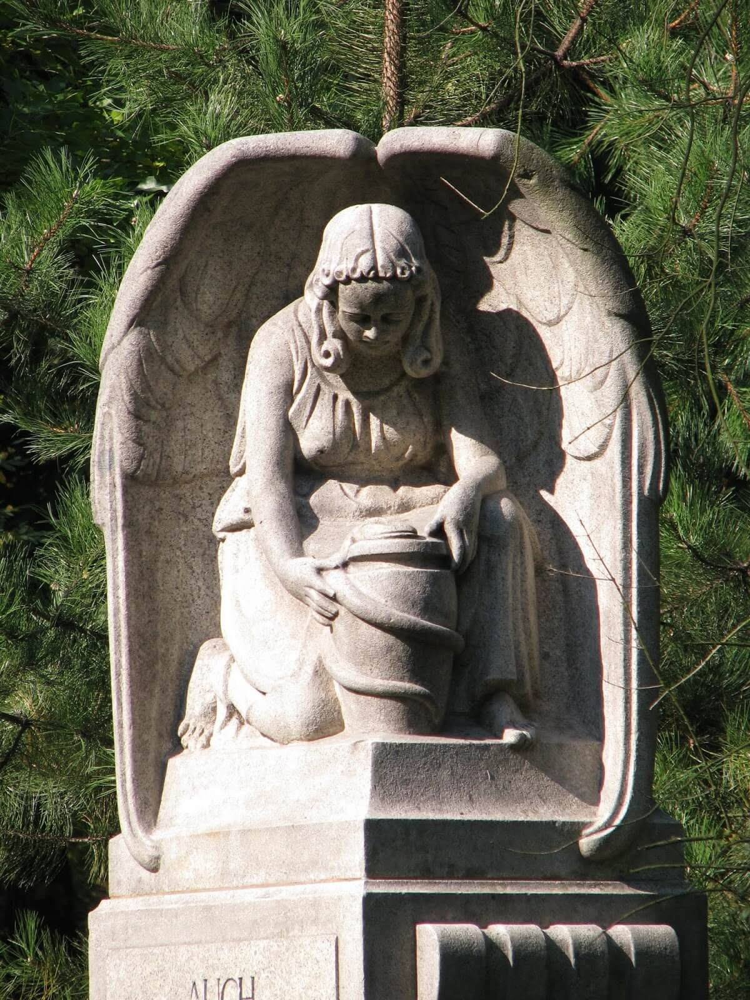

### Berlin

Brigitte Eicke, ekspedientka:
>2 kwietnia kolejny alarm przeciwlotniczy. Niedziela Wielkanocna. Spałyśmy do późna, za dnia czytałyśmy, a wieczorem słuchałyśmy strasznych historii. Potem ćwiczenia i do łóżka spać. Mam dość wojny. Co noc bombowce bombardują Berlin. Jesteśmy wykończeni. Gdzie ta cudowna broń?

Dieter Borkowski, służba pomocnicza Luftwaffe:
>Mój towarzysz Udo otrzymał list z Pankow. Jego matka i młodsza siostra Elke spłonęły w północnym Berlinie. Nikt mu nie został. Długi czas stał nieruchomo. Potem wskoczył na stołek, zerwał ze ściany portret Hitlera. Opluł go i podeptał. Wreszcie sierżant zamknął go w celi.

Joseph Goebbels:
>Kolejny nalot Mosquito. Przywykliśmy do nich na zasadzie codziennej rutyny. Gdyby nie przyleciały, berlińczycy uznaliby, że im czegoś brakuje.

### Bataliony Chłopskie

Szefostwo konspiracji ruchu ludowego: Centralne Kierownictwo Ruchu Ludowego podjęło decyzję o ujawnieniu Batalionów Chłopskich.

Z powodu braku zaufania do nowych, komunistycznych władz rozkaz ten nie wszędzie został wykonany od razu. Ujawnianie trwało do września. Wielu żołnierzy zgodnie z zaleceniami dowództwa BCh wstąpiła do WP.

W połowie 1944 stan kadrowy BCh to było 150 tys. żołnierzy. Po Armii Krajowej była to druga siła bojowa w podziemnej Polsce.

### U-321

Lotnicy polskiego 304. Dywizjonu Bombowego latający na bombowcach Vickers Wellington zatopili u południowo-zachodniego wybrzeża Irlandii U-Boota U 321 (typ VII C/41). Cała załoga, 41 marynarzy, zginęła.

### Stalag IX-B

Grupa bojowa 44 DP amerykańskiej przedarła się 60 km za linie frontu, żeby wyzwolić 6 tys. jeńców wojennych trzymanych w fatalnych warunkach w obozie w Bad Orb (Hesja).

- Mark Felton Productions ["US Mission to Rescue 6,000 POWs 1945" [YT 13:55]](https://www.youtube.com/watch?v=hWeLu7YuwUs)

### Brazylia

Brazylia i ZSRR nawiązały stosunki dyplomatyczne.

### Operacja wiedeńska

Armia Czerwona wkroczyła na teren Austrii i rozpoczęła właściwą cześć operacji wiedeńskiej.

### Budapeszt

Dziś zmarł od ran biskup Győr Vilmos Apor, który cztery dni temu przed bronił ukrywających się w piwnicy jego pałacu cywilów.

### Wrocław

Ksiądz Peikert:
>Rezultatem bombardowania w Wielką Niedzielę było straszne spustoszenie naszego miasta. [...] W Poniedziałek Wielkanocny dokończono dzieła rozpoczętego w Wielką Niedzielę. Naloty trwały dalej, ale bardziej niż naszą dzielnicę dotknęły one śródmieście i północ. Około godz. 16.30 rozszalał się straszliwy pożar miasta, wywołany chyba przez bomby fosforowe zrzucone przez nasze własne samoloty. Przez cały Poniedziałek Wielkanocny szalała wichura. Pod wieczór przeszła ona w prawdziwy huragan. Naraz ogień poszedł ulicami miasta i od domu do domu poczęło się palić w różnych miejscach: wkrótce stanęły w ogniu całe ciągi ulic, a potem całe dzielnice. Huraganowy wicher pognał wnet przez miasto miliony iskier i tysiące snopów ognia. Wybuchy zniszczyły całkowicie okna domów. Wichura wniosła do mieszkań tysiące iskier i snopów ognia przez wybite okna. W poduszkach, łóżkach i zasłonach znalazły one obfity żer. Potem domy stawały nagle w ogniu od dołu do góry niby wielkie piece. [...] Nie wiedzieliśmy, jak się z tej pożogi wydostać. Dosłownie przez korytarz ognia, poprzez podwórko posesji musieliśmy dotrzeć do Alexanderstraße, wciąż w obawie, że staniemy się płonącymi pochodniami. Jednak również na Alexanderstraße, którą uciekaliśmy w dół, spadały na nas miliony iskier. To samo przeżyliśmy na Herbert-Welkisch-Straße. Zawalone domy tarasowały ulice górami gruzu. Obawialiśmy się każdej chwili, że możemy się stać płonącymi pochodniami. Po drodze natknęliśmy się na całe grupy i oddziały członków Volkssturmu uciekających z piwnic płonących domów w poszukiwaniu bezpiecznych schronów. [...] Tu z mostu widzieliśmy płonący Wrocław. Z Kaiserbrücke rozpościerał się przed nami nieopisanie smutny widok płonącego Wrocławia, niezapomniana panorama grozy. Płonęły więc dzielnice po obu stronach Odry, po prawej stronie Odry od Kaiserbrücke po Gneisenauplatz (pl. Gen. Bema) aż do Sternstraße (Sienkiewicza), po lewej stronie Odry od Weidendamm (Na Grobli), Klosterstraße w dół, Ohlauerstraße poprzez gmach Poczty Głównej, Altbusserstraße (Pokutnicza) i Neumarkt aż po Sandinsel (Wyspę Piaskową). Płomienie buchały z wież kościoła katedralnego; dach Katedry był jednym morzem płomieni; płonął kościół Św. Michała, kościół Na Piasku, Św. Wincentego, Św. Wojciecha, Św. Maurycego, Św. Bernarda, Św. Krzysztofa i wszystkie ciągi ulic między tymi kościołami, przede wszystkim zaś Biblioteka Uniwersytecka. Niesamowity i ponury był obraz płonącego Wrocławia wieczorem w Poniedziałek Wielkanocny i w nocy, obraz zagłady najpiękniejszej części tego ładnego miasta. Ciemne, zachmurzone niebo płonęło czerwienią. Gigantyczne kłęby dymu zawisły nad całym miastem. Ciągle odwracaliśmy się, aby spojrzeć na ten makabryczny obraz. Uciekaliśmy wzdłuż Uferzeile (Wybrzeże Wyspiańskiego). [...] We wtorek wielkanocny kontynuowaliśmy naszą wędrówkę na Sępolno, szedłem bowiem za moją parafią, aby tam znów rozpocząć działalność kapłańską i znaleźć mieszkanie dla siebie i moich współlokatorów. Gryzący dym wisiał nad całym miastem. A tymczasem pożar rozszerzał się coraz bardziej. Oczy piekły od żaru i dymu ubiegłych dni.

W ciągu tych dwóch dni bombardowań zniszczono historyczne centrum miasta, cały Rynek (z wyjątkiem zachodniej pierzei i kościoła św. Elżbiety) i jego okolice, w niewielkim tylko stopniu został zniszczony gmach główny Uniwersytetu oraz kościół Imienia Jezus, ocalała również niezrównana perła architektury gotyckiej - kościół św Krzyża. Ale to były wyjątki, zdjęcia lotnicze z 1947 ukazują gęstą siatkę pozbawionych dachów murów, wypalony i wyczyszczony w ciągu poprzednich dwóch lat szkielet zmasakrowanego miasta. W 1947 można było podziwiać Wrocław jak sterylny, bezpieczny pomnik strasznej wojny, do tego czasu usunięto już większość gruzów, chwiejące się ściany zwalono.

Ale w kwietniu 1945 ten pomnik żył własną destrukcją i pochłaniał kolejne ofiary, budynki wciąż były trawione płomieniami, gęsty duszący dym spowił miasto i pokrył wszystko trudną do usunięcia sadzą. Jest to tzw. kopeć wojenny, ciężkie węglowodory, śmiertelnie niebezpieczne i tworzące trudny do usunięcia brudny nalot na każdej powierzchni, wciąż widoczny na wielu budynkach we Wrocławiu. Od późnego średniowiecza większość budynków wznoszonych we Wrocławiu była murowana, ale aż do początków XX wieku, kiedy zaczął triumfować żelbet, te murowane domy miały drewniany szkielet dachu i często kryte były papą. Często górne piętra też miały konstrukcję drewnianą. Już od wielu dni widzieliśmy Wrocław pokryty brudem, którego nie mógł zmyć żaden deszcz, pokryty wszechobecnym unoszącym się kurzem wznoszonym przez walące się budynki.

Bombardowanie wielkanocne pokryło miasto grubą warstwą sadzy i zasłoniło je śmiercionośnym dymem. Kiedy ruiny wystygły zaczęły śmierdzieć rozkładające się w nich zwłoki. Na zabitych wrocławianach wyrosło pokolenie wielkich i śmiałych szczurów. Był też jeszcze jeden, zupełnie nieoczekiwany skutek tych bombardowań. Przestały jeździć tramwaje. Od dawna były już tylko propagandowym trikiem bez znaczenia, ale tworzyły ostatni jeszcze działający fragment miejskiej rzeczywistości, który tworzył pozory normalności. Od bitwy wielkanocnej Wrocław był już tylko morzem ruin zasiedlonym przez duchy czekające końca.

Ksiądz Walter Laßmann, w poniedziałek wielkanocny 2 kwietnia:
>O godzinie 8.00 Rosjanie pod komendą generała Głuzdowskiego ponawiają huraganowy ostrzał miasta. Wkrótce cała starówka stała w płomieniach. Ten Poniedziałek Wielkanocny miał się okazać najcięższym dniem w tysiącletniej historii Wrocławia. Z wielkim impetem zaatakował nieprzyjaciel Rzeźnię Miejską [obecnie Magnolia), bronioną tylko przez batalion Volkssturmu, ale poniósł przy tym znaczne straty. [...] położenie obrońców stawało się coraz bardziej krytyczne. Rosjanie zajmują przy silnym wsparciu czołgów pokryty zaroślami teren ogródków i łąk na dawnych błoniach po przekroczeniu nasypu koło Popowic. Brak już rezerw, rzucają dwa bataliony Volkssturmu złożone z młodych chłopców. Rzucono ich do kontrataku i stała się rzecz niewiarygodna! W krótkim czasie młodociani volkssturmiści oczyścili ten rejon ogródków działkowych z wroga. Jeden z młodych podoficerów sam zniszczył pięć rosyjskich czołgów. Wieczorem także nasyp kolejowy był z powrotem w naszych rękach. Gdy nastała wreszcie noc Rosjanie byli wykrwawieni. Zbyt wyczerpani, aby już teraz sięgnąć po władzę nad całym miastem. Atak został odparty. [...] Do dolnego kościoła św Krzyża wkrótce po zakończeniu mszy wpadają dwie bomby. Zabijają piętnaście osób i ranią wielką liczbę wiernych. [...] Pospieszyłem do umierających z duszpasterskim pocieszeniem. Zabici wyglądali niczym postrącane z ołtarzy figury świętych. Leżeli w najrozmaitszych pozach, pokryci szarym pyłem sprawiali wrażenie upudrowanych. [...] Po południu płonie cały Ostrów Tumski. Także nasz dom przy pl. Katedralnym 6, w którego piwnicy mieliśmy swoje schronienie, ogarnęły płomienie. Jasnym ogniem płoną Katedra, kanonia sufragana Ferchego, pałac arcybiskupi, klasztor sióstr NMP, kanonie przy ul Katedralnej 1 i 3. [...] Prowadzę Mamę za rękę wzdłuż buchających ogniem domów. W wąskiej ulicy Katedralnej panuje tak wysoka temperatura, że widzę, jak pozostawiona przez kogoś na środku ulicy walizka naraz zajmuje się ogniem. Przed snopami fruwających w powietrzu iskier chronimy twarze wilgotnymi chustkami. [...] W nocy pomiędzy 2.00 a 3.00 oddaliłem się na chwilę nad Odrę, żeby zaczerpnąć chłodniejszego powietrza. Widok jaki się stąd rozpościerał był wprost fantastyczny, o bajecznej wprost nierzeczywistości. Zmuszałem się, aby uwierzyć, że sceny jakie się przede mną roztaczały i wyglądały jak w piekła rodem, dzieją się na jawie, a nie we śnie. Rzadko oko ludzkie może oglądać to, na co patrzyłem oniemiały, wstrząśnięty do głębi - i z podziwem dla tego infernalnego piekła. Za mną gorzały obydwie monstrualne pochodnie wież katedry. Obok pałac arcybiskupi tonął w morzu ognia, na prawo płonął kościół NMP na Piasku, a przede mną po drugiej stronie paliło się miasto. Pięciopiętrowe domy spowijały kolumny jasnych płomieni, okna były rozświetlone niczym podczas jakiegoś bankietu, a od czasu do czasu któryś z nich zapadał się w sobie, wyrzucając w górę wspaniały snop iskier. Wyglądało to na przepyszny pokaz sztucznych ogni. Nie wiem, czy stary Eneasz, o którym nam opowiada Wergiliusz, doznał podobnie wstrząsającego i upiornego przeżycia, kiedy uciekając, spojrzał za siebie na płonącą Troję, czy Neron, ten zwyrodnialec na cesarskim tronie, nie pożółkłby z zazdrości, gdy widok podpalonego przez niego Rzymu, nie mókłby się chyba równać z panoramą płonącego Wrocławia, jaka jawiła się przede mną tej nocy.

### Niemieckie znaki na samolotach

Rzeczą wymagającą wyjaśnienia było powtarzające się w kilku relacjach spostrzeżenie, że Wrocław bombardowany był w Wielkanoc przez samoloty z niemieckimi znakami, które zrzucały niemieckie bomby. Co do samych bomb, to owszem Armia Czerwona posiadała ogromne zasoby zdobycznego sprzętu wojennego i może lotnicy sowieccy zrzucali niemieckie bomby, jeśli ich samoloty były do tego przystosowane, ale równie dobrze mogło to być czyjeś spostrzeżenie szybko powielone w panice, łatwo było temu dać wiary w sytuacji, w jakiej znaleźli się wrocławianie.

Natomiast jeśli chodzi o samoloty, czy to produkcji niemieckiej, czy nawet z niemieckimi znakami (dlaczego mieliby ich nie przemalować?) to już jest raczej pozbawione sensu. Przede wszystkim w strefie wojny latanie w samolocie wroga przy własnej przewadze w powietrzu jest zbyt niebezpieczne. Żeby dokonywać nalotów niemieckimi samolotami, sowieci musieliby wyłączyć własną obronę przeciwlotniczą. Przede wszystkim jednak nie mieli żadnego powodu, żeby to robić. 2 Armia Lotnicza, czyli lotnictwo 1 Frontu Ukraińskiego miała dość własnych zasobów, żeby dokonać takiego bombardowania. Więcej na ten temat będzie w osobnym artykule. 2 AL miała trzy rodzaje bombowców: Pe-2, pochodzące z Lend Lease North American B-25 Mitchell, oraz również amerykańskie produkowany na licencji Douglas DC-3 pod nazwą Li-2. Co do ich liczby, udźwigu i jednostek, w skład których wchodziły o tym przy innej okazji.

Teraz zaś koniecznie trzeba poruszyć temat pamiętnika księdza Peikerta - jego wspomnienie z nalotu jest ostatnim większym fragmentem dotyczącym konkretnego dnia. Jest - jak mogliśmy to wiele razy zauważyć - uważnym obserwatorem, rzetelnym i dokładnym, nie ukrywa własnych opinii, ale nie miesza ich z opisem sytuacji. Z tekstu Peikerta korzystali autorzy legendarnego już opracowania historii bitwy, Jońca i Konieczny "Upadek Festung Breslau" (w bibliografii jako Archiwum Archidiecezjalne Wrocław, OA Breslau, St Mauritius 51, 24. Personal-Akten der Erzpr. Paul Peikert, Pfarrer bei St. Mauritius zu Breslau) wydanego rok wcześniej, może to się odnosi do pełnej wersji tekstu. Przy okazji bombardowania wielkanocnego podają fragment relacji niejakiego księdza B., którego w książce brak:
>Obserwowano jednakże, że również własna soldateska pomagała w rozpętaniu pożarów, aby w ten sposób niepostrzeżenie zdobyć pożądane pozycje wojskowe do obrony. Tak się stało w otoczeniu kościoła św. Maurycego.

Cytują również fragment listu Peikerta z 19 lipca 1945 (nieobecny w książce):
>Wywołało ją bezsensowne zniszczenie całych części miast przez nasz Wehrmacht. Tak podpalone zostały przez nasz Wehrmacht cenne dzielnice mieszkaniowe południa i zachodu oraz cały wschód miasta. Pożar wielkanocny był w ten sposób dziełem naszych własnych samolotów. 85% zniszczonego Wrocławia trzeba zaliczyć na poczet naszego Wehrmachtu.

Dalej autorzy wyciągają te relacje o niemieckich samolotach, zdając się sugerować, że może Luftwaffe brała udział w bombardowaniu, co jest przypuszczeniem absurdalnym zarówno ze względu na możliwości techniczne, jak i sam pomysł. Ale wiem skądinąd, że te dwa straszliwe dni nie były wcale z punktu widzenia 2 AL okresem takich nasilonych operacji, zbyt wiele razy pojawia się wątek niemieckiego wojska niszczącego Wrocław i wydaje się sensownym przypuszczenie, że sporą część tych pożarów i zniszczeń spowodowali sami hitlerowcy, zamierzając przemienić Wrocław w drugi Stalingrad. Prawdopodobnie nie mamy narzędzi, by pojąć działanie umysłów tych ludzi pod koniec wojny.

<BoxImageWrapper>

Wrocław, Park Zachodni. Rzeźba cmentarna, jedna z niewielu pozostałości cmentarza komunalnego. 
By Agnieszka Kwiecień ([Nova](https://commons.wikimedia.org/wiki/User:Nova)) - Praca własna,[CC BY 3.0](https://creativecommons.org/licenses/by/3.0), [Link](https://commons.wikimedia.org/w/index.php?curid=2827235)
</BoxImageWrapper>

### Ofensywa

Jednocześnie 6 Armia przypuściła długo przygotowywany atak dużymi siłami od zachodu. Już pierwszego dnia zdobyła rejon lotniska i wdarła się do Parku Zachodniego. Broniące lotniska 3 kompanie spadochroniarzy z III/FJR 26 zostały zdziesiątkowane: jak wspomina jeden z nich:
>Przedstawiały one smutny widok. Wielu towarzyszy broni poległo lub było rannych, bardzo wielu jednakże zaginęło.

Resztki pułku Mohr, Volkssturmu, kompanii spadochroniarzy schroniły się i umocniły w Zakładzie Dla Niewidomych.

Koszary Adolfa Hitlera 28 batalionu saperów (Kozanów, obecnie Komisariat Policji Wrocław-Fabryczna) były bronione krótko. Reszta obrońców pod dowództwem majora Tilingera w nocy z 1 na 2 kwietnia uciekła przez jaz rędziński, unosząc ze sobą tylko broń lekką.

Jednym z poległych na lotnisku czerwonoarmistów był reporter wojenny, Władynir Suszyński:
>Przy szturmie lotniska, w którym uczestniczyłem razem ze swoimi zwiadowcami, byłem świadkiem tragicznego wydarzenia, którego nie zapomnę do końca życia. Jeszcze w czasie walk pod Duklą słyszałem od oficerów naszego sztabu o wspaniałym człowieku, operatorze filmowym, który zawsze z kamerą w ręku towarzyszył nacierającym żołnierzom. Dzielił się też z nimi wszystkie trudy wojennego życia, utrwalając na taśmie filmowej zarówno toczone walki jak i codzienny żołnierski trud. Gdy jednak zachodziła tego potrzeba, umiał, równie dobrze jak kamerą, posługiwać się pistoletem maszynowym. I teraz też znalazł się w pierwszym szeregu szturmujących lotnisko. Gdy Niemcy, nie mogąc wytrzymać naszego naporu, zaczęli wycofywać się z lotniska, operator oczywiście nie chciał stracić okazji do sfotografowania panicznej ucieczki hitlerowskich wojaków. Nie zwracając uwagi na silny ostrzał broni maszynowej i wybuchy pocisków moździerzowych, które nas, doświadczonych oficerów, przyciskały do ziemi, przedostał się na drugą kondygnację poważnie uszkodzonego budynku i wysunął przez okno obiektyw swej kamery. Niemcy prawdopodobnie dostrzegli błysk szkieł. Celny pocisk artyleryjski – i ściany budynku zawaliły się, grzebiąc pod gruzami bohatera. Był nim Władynir Suszyński.
