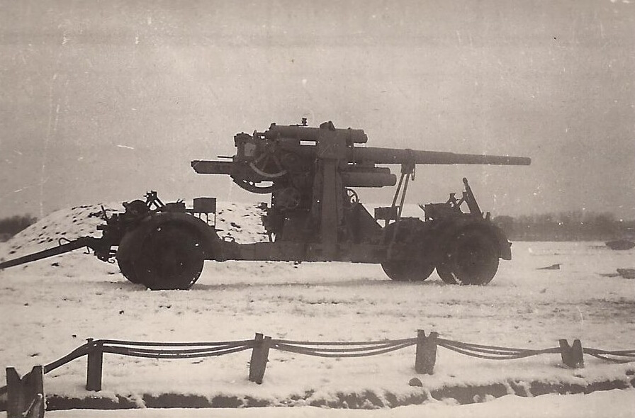

### Samobójstwa hitlerowców

Wbrew oficjalnej propagandzie nawet najbardziej zatwardziali naziści widzieli, że wojna jest już przegrana, a ponieważ zaangażowali się po stronie Hitlera, to nie ma dla nich ratunku. Zaczynają się samobójstwa hitlerowców. Od dzisiaj będą nam aż do końca wojny towarzyszyć, cały długi (za krótki!) wianuszek ludzi, którzy postanowili się sami rozliczyć ze swojego postępowania, zanim zrobi to ktoś inny. Niestety za mało i o wiele za późno.

Pierwszym z całej serii jest Karl Astel, lat 47, żołnierz freikorpsów, puczysta i to podwójny bo uczestnik puczu Kappa Luttwitza oraz monachijskiego, działacz NSDAP i SS od 1930. Wtedy też ukończył medycynę i został lekarzem. Tzw. alter Kämpfer (pl. stary bojownik), który zrobił dzięki Partii znakomitą karierę. Eugenik, rasista, pracownik RuSHA.

W 1932 szef Erbgesundheitlichen Beratungsstelle w RuSHA oraz Rassehygieneamtes der Reichsführerschule der SA w Monachium. Zaraz po dojściu do władzy hitlerowcy wdrażają politykę rasową. 15 lipca 1933 powstaje Thüringischen Landesamtes für Rassewesen w Weimarze, Astel staje na jego czele i jest odpowiedzialny za tysiące przymusowych sterylizacji.

Jego kolega z freikorpsów Fritz Sauckel (niestety nie zabił się sam, został osądzony i zabity w Norymberdze) załatwił mu stanowisko szefa Landesamtes für Rassewesen oraz profesurę bez wymaganej procedury na uniwersytecie w Jenie (Turyngia), gdzie od 1935 stał na czele Institut für menschliche Erbforschung und Rassenpolitik. Przy wsparciu SS i osobistym Himmlera ten instytut odegrał fundamentalną rolę w tworzeniu teoretycznych podstaw hitlerowskiej polityki rasowej. Był współredaktorem "Volk und Rasse" (długi poddtytuł tego czasopisma to Illustrierte Monatsschrift für deutsches Volkstum, Rassenkunde, Rassenpflege. Zeitschrift des "Reichsausschusses für Volksgesundheitsdienst" und der "Deutschen Gesellschaft für Rassenhygiene").

Od 1939 rektor uniwersytetu w Jenie. Dziś zastrzelił sę w tamtejszym szpitalu. Jena była intensywnie bombardowana od lutego. Amerykanie zajęli ją 13 kwietnia.

Jego syn został poetą.

### Hans-Georg Henke

FBTODO

- [Znane, ale poruszające fotografie. 16-letni żołnierz Luftwaffe Hans-Georg Henke, obsługujący działo przeciwlotnicze wzięty do niewoli przez Amerykanów z 9 Armii, 3 kwietnia 1945 r. / W obliczu nieuchronnej klęski, III Rzesza wysyłała na front coraz młodszych ludzi. Hans-Georg Henke miał więcej szczęścia niż wielu jego rówieśników.](https://www.facebook.com/groups/837847453218455/posts/1842505839419273/)

### Wewelsburg

Jeden z najbardziej znanych zamków. Znajduje się k. Paderborn (Nadrenia Północna-Westfalia). Jego historia sięga XII wieku, w obecnej renesansowej formie wybudowany w latach 1603-09. Jest bardzo charakterystyczny, zbudowany na planie trójkąta. W 1933 przejęty przez SS. Stał się najważniejszym ośrodkiem mistycyzmu SS. To tam, w Obergruppenführersaal po raz pierwszy pojawił się symbol Czarnego Słońca (niem. Schwarze Sonne).

W 1940 w jego pobliżu powstał KL Niederhagen.

Współcześnie znany choćby z takich gier jak Wolfeinstein, czy Medal of Honor: Underground.

Kiedy do Padeborn zbliżała się 3 Dywizja Zmechanizowana amerykańska 30 marca 1945 dowódca zamku generał Siegfried Taubert uciekł. Himmler wydał rozkaz zniszczenia zamku. Major Heinz Macher mając do dyspozycji tylko 15 ludzi i niewielką ilość materiału wybuchowego zdołał następnego dnia zniszczyć tylko jedną wieżę i mało istotne budynki, wzniecił pożar. Otwarty zamek został złupiony przez miejscową ludność. Trzy dni później 83 Zwiadowczy Batalion Zmechanizowany zameldował:
>SS men had set fire to their barracks in the castle, changed into civilian clothes and fled

- Mark Felton Productions ["SS Death's Head Rings - A Nazi Treasure Mystery" [YT 14:39]](https://www.youtube.com/watch?v=deGAMLWW_BA)

### Operacja berlińska

Państwa Osi przegrywały od dawna na całej linii, Japonia dopiero co przegrała krwawą bitwę na Iwo Jimie, a dwa dni temu, 1 kwietnia zaczęła się inwazja na Okinawę, wczoraj 2 kwietnia rozpoczęła się operacja wiedeńska.

OKH wystawiło w roli ostatniej rubieży Berlina na zachód od Odry Grupę Armii Wisła (Heeresgruppe Weichsel) od 21 marca pod dowództwem generała Heinriciego, w sile pół miliona żołnierzy. Naprzeciwko tej armii, po drugiej stronie Odry do ataku szykował się 1 Front Białoruski marszałka Żukowa w sile ponad 700 tys. żołnierzy. Właśnie dziś obaj marszałkowie Żukow i Koniew przylecieli z Moskwy do swoich sztabów, mając zupełnie nowe rozkazy i tajne polecenie Stalina wyznaczające datę rozpoczęcia operacji berlińskiej. Rozpoczęła się ostatnia rozgrywka tej wojny. Oba Fronty miały porzucić umacnianie swoich pozycji i niemalże natychmiast przystąpić do wielkiej, połączonej ofensywy. Na przygotowanie tej morderczej operacji dano im tylko dwa tygodnie.

<SeeAlso txt="Depesza Eisenhowera (SCAF 252)" url="/festung-breslau/article/depesza-eisenhovera/" />

Od powstania 24 stycznia aż do 20 marca dowódcą Grupy Armii Wisła był Heinrich Himmler, właściwy twórca SS i człowiek obdarzony pełnym zaufaniem Hitlera, pozbawiony natomiast, i to zupełnie, rzeczy na tym stanowisku najważniejszej - doświadczenia wojskowego. Nigdy nie był w prawdziwym wojsku i nigdy nie dowodził jednostką frontową. Ktoś taki był na czele kluczowego, bo berlińskiego odcinka frontu przez te krytyczne prawie dwa miesiące walk. To była jedna z tych katastrofalnych decyzji Hitlera, tak cenionych we wszystkich alianckich sztabach.

[Dla niego wojna już się skończyła. Nastoletni żołnierz obrony przeciwlotniczej Hans-Georg Henke](https://www.facebook.com/WojskoweOpowiastki/posts/1157443851377015)

### Wrocław

Dzisiaj, 3 kwietnia 1945 komendant twierdzy Wrocław Hermann Niehoff ma urodziny. Pamiętamy, że w dniu, kiedy poprzedni komendant obchodził urodziny, nie tak dawno temu - 20 lutego - zaczęły się jego kłopoty z Gauleiterem Karlem Hanke. Intrygami, korzystając z wpływów w bunkrze Hitlera, za pośrednictwem Martina Bormanna Hanke doprowadził do zmiany na stanowisku komendanta. Von Ahlfenowi wytoczono proces i groził mu pluton egzekucyjny. Niehoff jednak nie tylko pomógł von Ahlfenowi, ratując mu życie, ale co więcej, nie stał się człowiekiem Gauleitera. Czy koniec problemów na linii komendant - gauleiter wynika z charakteru Niehoffa, czy zmiany sytuacji tego nie da się rozstrzygnąć. Prawdopodobnie, skoro Berlin był zagrożony atakiem, sprawy Wrocławia spadły daleko poza margines zainteresowań. Wrocław nie bronił już żadnej pozycji, był tylko izolowaną Twierdzą angażująca mało ważną 6 Armię.

O ile na przełomie lutego przedmiotem kontrowersji i długotrwałych sporów między najważniejszymi osobami w państwie było przysłanie niewłaściwego batalionu spadochroniarzy (III batalion składał się ze spieszonych lotników, a nie komandosów, dopiero Niehoff przywiózł w ciągu dwóch tygodni pozostałe dwa bataliony komandosów) to teraz, bezpośrednim przedmiotem zainteresowania samego Hitlera stało się przysłanie do Wrocławia sześciu armat, co wszyscy odradzali, bo droga powietrzna była już niepewna. I rzeczywiście, na osobisty rozkaz Hitlera armaty wysłano, ale do Wrocławia dotarła tylko jedna. Co, i tak nie miało żadnego znaczenia, bo twierdza cierpiała na niedostatek amunicji artyleryjskiej.

<BoxImageWrapper>

Działo 8,8 cm Flak 18, Berlin, styczeń 1944. 
8,8cm-antiaircraft battery in Berlin-Karow, gun "Bertha" in march position (January 1944) 
By Heinz Radtke - Family Archive Norbert Radtke, Domena publiczna, [Link](https://commons.wikimedia.org/w/index.php?curid=25549686)
</BoxImageWrapper>

Podobnie jak Grupa Armii Wisła Heinriciego także front niemiecki we Wrocławiu miał tylko jedną linię, brak zaplecza i rosnące niedostatki w zaopatrzeniu. Brakowało amunicji do słynnych osiemdziesiątek-ósemek, zwanych w konwencji niemieckiej (używali centymetrów do określania kalibru broni artyleryjskiej) Acht-Acht, najsłynniejszej armaty tej wojny. Była to niezwykle cenna broń, chociaż niespecjalnie przystosowana do walk w mieście, ale we Wrocławiu - właśnie z powodu braku amunicji - niepotrzebne armaty wmontowywano w barykady.

Hugo Hartung tak je opisuje 2 kwietnia:
>Tej nocy mieliśmy wrażenie, jakby cały Wrocław stał w płomieniach. Przez okrągłą noc byliśmy zaangażowani do gaszenia pożarów, podczas gdy wokół bez przerwy śmigały bomby. W mętnym świetle ognia małe sowieckie "maszyny do szycia" krążyły bardzo nisko i szyły nad miastem amunicją smugową. To były dodatkowe fajerwerki. Na zachodzie płoną ulice odchodzące od pl. Macieja, na wschodzie stoi w płomieniach dzielnica katedralna. Co jakiś czas, w długich odstępach bije jakiś kołysany żarem ciężki dzwon. Wielkanocny dzwon we Wrocławiu. Ognista nawałnica przetacza się przez nasze podwórze, impet pożogi wyrzuca w górę płonące kawałki płonącego drewna i wirujące snopy iskier, które opadają na dachy, płodząc kolejne zarzewia. I tak oto piekło nieustannie szaleje przez cały drugi dzień świąt. Jesteśmy niewyspani, brudni - pompa nie ciągnie już wody, a dym gryzie nas w oczy.

Natomiast dzisiaj
>Niesamowity spokój. Pada deszcz. Ciężkie duszne powietrze nasiąkłe odorem spalenizny. Wielkie kamienice po zachodniej stronie placu zamieniły się w ruiny. Żółte forsycje na skwerze są czarne i zwęglone. Tymczasem na grządce za naszą piwnicą rozkwitły podczas tych gorących nocy tulipany i hiacynty.

ksiądz Walter Laßmann, wtorek wielkanocny 3 kwietnia:
>Katedra wciąż płonie. [...] Wracając do naszych nowych katakumb, jestem świadkiem osunięcia się jej wypalonej wieży północnej. [...] Boże co to była za Wielkanoc, którą nam przyszło tego roku przeżywać! nigdy wiosna nie rozkwitła w takiej krasie. Błękit nieba promieniejące złotem słońce, łagodne powietrze. W ogrodzie rozkwitają fiołki, narcyzy, tulipany i hiacynty. Jakże piękne może być życie! I nad tym wszystkim rozpętuje się straszna, stalowa burza. Ziemia się trzęsie, lecą odłamki, grzmią eksplozje. Pogrzebani żywcem ludzie, trupy wśród kwiatów. Czterdzieści tysięcy mieszkańców Wrocławia mogło zginąć tylko podczas tych świąt. Czterdzieści tysięcy martwych Wrocławian leży pod gruzami, w wypalonych domach, na placach i ulicach. "To koniec" mówią ci, którzy przeżyli te dni wielkanocne. Jeszcze więcej cierpienia miasto już nie udźwignie. Ale do końca jeszcze daleko. Niehoff i Hanke rozkazują: "Twierdza walczy dalej". I tak "organy Stalina" intonują od nowa swój piekielny skowyt. Śmierć znów szaleje we Wrocławiu [...] Poniedziałek Wielkanocny: pozostawił po sobie tragiczne brzemię: szalejąca wichura pędziła przez miasto miliony strzępów ognia i iskier, zapalając ulice jedna za drugą. Najstarszymi dzielnicami Wrocławia, tonącymi w dymach pożarów, piekło eksplozji. Wypala się Nowy Targ. Na samo tylko Naczelne Prezydium spada 21 bomb. Ze wspaniałej katedry pozostała jedynie wypalona powłoka, słychać z niej tylko upiorny odgłos olbrzymich, kłapiących o siebie metalowych blach, pozostałych z poszycia dachu". [...] Ogień spadł z nieba. Słyszeliśmy świst spadających bomb i rozsadzające bębenki w uszach eksplozje. Kościół zamienił się w wielkie morze płomieni. Zgorzały w pożodze cenne obrazy, barokowa snycerka wielu ołtarzy wiekowe stalle, wspaniała kazalnica, potężne organy, kościelne sprzęty. Budowla wypaliła się doszczętnie a sklepienie runęło na posadzkę - Z drugiej strony wiatr pędzi chmury dymu unoszącego się nad pożarami a Ostrowie Tumskim. Katedra jest jedną wielką pochodnią. Wieże są słupami ognia, którego języki wydobywają się ze wszelkich zakamarków. Apokaliptyczny to spektakl o posępnej wielkości. Nawet rozpadając się w gruzy, obydwie te świątynie pełne są dostojeństwa i świętości. Kiedyś nawet cesarze zbliżać się mogli do Bożego Miasta w polu widoczności jego wież jedynie pieszo. Po cichej ulicy Katedralnej zostało tylko pogorzelisko. To nasza via sacra, gdzie wierni padali na kolana, kiedy kardynał-arcybiskup wracał po nabożeństwie rezurekcyjnym pod baldachimem do swojego pałacu. Także i ta budowla jest teraz tylko stertą gruzu. [...] Pali się wszystko nawet pinie w Ogrodzie Botanicznym. Przebywanie na wolnym powietrzu graniczy z niemożnością. Kłęby wszechobecnych iskier zwęglają ubrania, a bagaże z dobytkiem ratowanym z rozsypujących się domów i wynoszone na ulice zapalają się tam wskutek samozapłonu od płonącego żaru. Ludzie mają twarze poczerniałe od ognia i sadzy. Wieczorem tego poniedziałku bombardowania rzedną. Cisza zalega na frontach. Ale przez cała noc tli się żar pogorzelisk po całych kwartałach domów; pełzające po nich delikatne płomienie harmonizują z czerwienią nieba. Grobowa cisza rozpościera się nad śmiertelnie ugodzonym miastem. W powietrzu unosi się nieznośny trupi odór i swąd spalenizny. Następujące potem dni są względnie spokojne. Rosjanie czekają, ciekawi skutków swego huraganowego ataku. A są one straszne. Z lotu ptaka Wrocław jest wielkim morzem ruin, nad którym unoszą się potężne chmury dymów od trawiącego je wciąż jeszcze ognia. Ale cała tragedia śląskiej metropolii odsłania się z bliska dopiero temu, kto porusza się po niej po ziemi, aż do barykady na południu i na zachodzie. [...] odsłonięte i rozerwane rury kanalizacyjne zioną piekielnym smrodem, o watahach szczurów, ucztujących przy setkach niepogrzebanych zwłok i wdzierających się nocami do mieszkań, wreszcie o pustyni gruzów [...] Na froncie południowym i zachodnim walki odżywają na nowo i na śródmieście znów spadają pociski. Rosjanie zacieśniają pierścień okrążenia, nasze położenie staje się coraz bardziej rozpaczliwe. Kierowane do nas wezwania brzmią "Wytrzymajcie! Za kilka dni na pewno nadejdzie odsiecz!" To ostatnie kłamstwo i próba ogłupienia ludzkości. Głuche dudnienie słychać od strony Ślęży, podwrocławskiej Góry Silingów, gdzie przebiega właściwy front. Atak nastąpi teraz także ze wschodu. Oraz z północy. Mam wrażenie jak gdyby granaty oraz pociski rozrywały się już w moim najbliższym sąsiedztwie.

### Ofensywa

W wyniku szturmu 359 Dywizji Piechoty przeprowadzonej z Nowego Dworu na płytę lotniska na Gądowie Małym siły obrońców zostały zmiażdżone i wyparte. Sowieci dotarli do Odry i utworzyli szeroki front na całym zachodnim skraju Popowic (niem. Pöpelwitz), na wschodniej krawędzi Gądowa wciąż były linie niemieckie. Bastionem obrońców, którzy w tym czasie zdążyli przegrupować siły na nowej linii frontu, stał się Śląski Instytut Edukacji Niewidomych (Schlesiche Blinden-Unterrichts-Anstalt) do dziś istniejący zespół solidnych gmachów, pozwalający wyobrazić sobie jak wyglądały Popowice niegdyś.

Przedmiotem dyskusji jest postępowanie atakujących, którzy zamiast korzystając z przełamania, wedrzeć się jak najdalej pozostawili najważniejsze osie ataku i uderzyli w kierunku Odry, odcinając siły niemieckie na zachód od swoich pozycji. Utracili w ten sposób, być może ryzykowną, ale ostatnią sposobność do szybkiego postępu w stronę centrum miasta. Odcięcie nielicznych oddziałów nie przyniosło spodziewanych korzyści, bo bez strat przeprawiły się przez stopień wodny Rędzin (niem. Ransern) i dołączyły do sił na prawym brzegu Odry.

Powtórzyła się historia z uderzenia od południa, tylko że tam sowieci zostali zatrzymani w krytycznej chwili przez samobójczy kontratak Hitlerjugend, tym razem utracili tempo, chcąc zając dogodną pozycję. Przyniosło to kolejne tygodnie rzezi i destrukcji.

### 2 Armia WP

Było jednak coś, co mogło odmienić tę sytuację, wciąż była szansa na pokonanie twierdzy w kilka dni. Na północnej rubieży miasta do ataku szykowały się polskie oddziały 2 Armii LWP. Nie mieli jeszcze doświadczenia w walce, dla sporej części tych żołnierzy w ogóle duże miasto było nowym doświadczeniem. Jak wspomina ppłk Ryszard Skała:
>Rozłożona płachta planu leżała na dużym, dębowym stole. Przychodzili koledzy, przyglądali mu się żołnierze, egzaminowaliśmy się ze znajomości miasta: Matthiasstraße, Gartenstraße, Palmstraße, Alee der SA... Wiedzieliśmy: to miasto będzie nasze. Jeszcze jedno z wielu pogorzelisk, jeszcze jedna ruina, jeszcze jeden masowy cmentarz.

Jutro miał się rozpocząć proces luzowania jednostek sowieckich. Przez poprzednie dwa dni Polacy patrzyli na bombardowanie miasta.

Nigdy do Wrocławia nie weszli. Niespodziewanie przyszły inne rozkazy.
