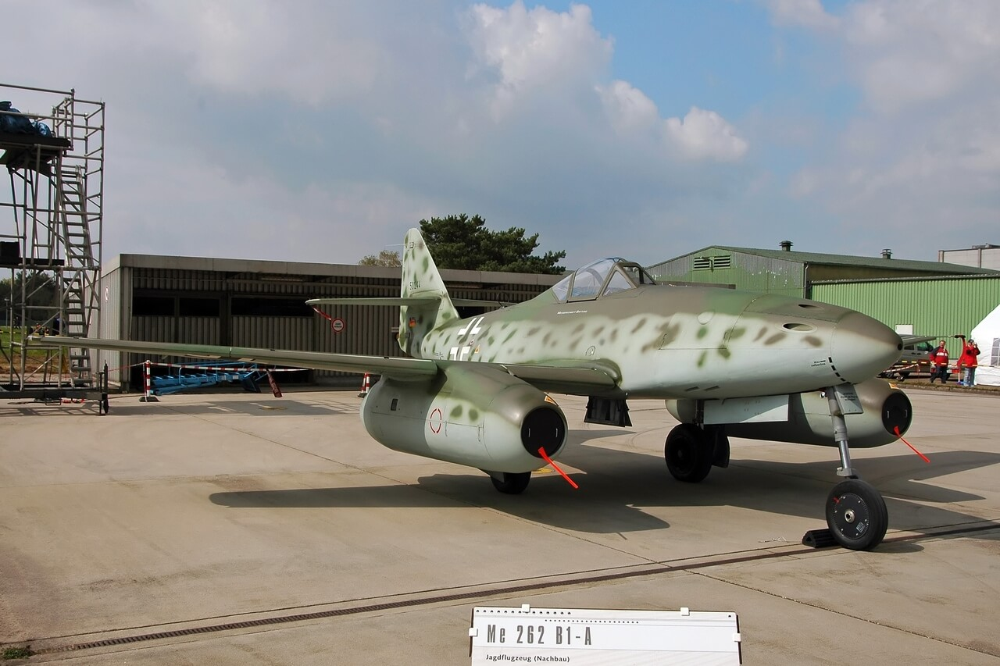

### I-250 (MiG-13)

Również sowieci eksperymentowali z samolotami odrzutowymi, ale dopóki w 1947 nie dostali silników brytyjskich (naprawdę je dostali) wyglądało to, jak w przypadku tego pierwszego odrzutowego MiGa - I-250, który dzisiaj został oblatany przez pilota oblatywacza Aleksandra Diejewa. Prace nad nim zaczęły się 22 maja 1944. Eksperymentalny układ napędowy powstał w moskiewskim Centralnym Instytucie Rozwoju Silników Lotniczych (ros. Центральный институт авиационного моторостроения). Kierownikiem zespołu inżynierów był Konstanty Wasilijewicz Holszczewnikow.

Był to samolot z silnikiem tłokowym М-107 (w układzie V12, czasem nazywany też od nazwiska konstruktora Климов ВК-107) napędzający śmigło i osiągający prędkość maksymalną 677 km/h. Silnik ten dodatkowo napędzał sprężarkę zasilającą powietrzem silnik odrzutowy umieszczony w części ogonowej, który przyspieszał go do 825 km/h. Silnik odrzutowy miał łączny czas pracy 10 minut podczas jednego lotu.

Taki układ: silnik tłokowy + sprężarka + silnik odrzutowy nazywa się motorjet, Rosjanie nazwali go silnik powietrzno-odrzutowy z kompresorem (ros. Мотокомпрессорный воздушно-реактивный двигатель; ВРДК). Podobną konstrukcją był również sowiecki Su-5 oraz amerykański Ryan FR Fireball. Su-5 zostanie oblatany za dwa dni. Ryan FR Fireball 25 czerwca 1945.

W przypadku tak nowatorskiej i skomplikowanej konstrukcji pojęcie oblot jest trochę mylące, 4 kwietnia samolot wzniósł się w powietrze, dwa dni później znowu i tym razem przetestowano chowanie się podwozia. Dopiero potem zaczęły się próby uruchomienia silnika odrzutowego, wszystkie zakończone awariami, albo błędami systemu. Dopiero 19 maja udało się uruchomić cały układ napędowy i wtedy samolot osiągnął prędkość 809 km/h.

5 lipca kolejny lot próbny zakończył się katastrofą, w której Diejew zginął. Rozwój i dalsze próby z tą konstrukcją trwały do 1946, kiedy to uznano ją za nieperspektywiczną, wobec pojawienia się MiG-9 i Jak-15. Był zbyt skomplikowany, zawodny, trudny w pilotażu i liczył się jedynie jako eksperyment. Przekazano go Marynarce, która zamknęła projekt 3 kwietnia 1948. Powstało ok. 10 prototypów.

Przy okazji: był to również pierwszy całkowicie metalowy samolot w biurze konstrukcyjnym MiG.

- [И-250 (МиГ-13)](http://www.airwar.ru/enc/fighter/mig13.html)
- [Dark Skies "The WW2 Fighter with a Jet Stuffed in Its Tail - Ryan FR Fireball" [13:47]](https://www.youtube.com/watch?v=c_75lF_BLgs)

### Słowacja

2 Front Ukraiński zdobył Bratysławę.

<SeeAlso txt="Słowacja" url="/festung-breslau/article/slowacja" />

Była to część operacji bratysławsko-brneńskiej rozpoczętej 25 marca. 7 Armia Gwardyjska przedarła się przez niemieckie linie obrony na rzece Hron i 29 marca zdobyła Komarno i Nowe Zamki.

26 marca 4 Armia rumuńska zdobyła Bańską Bystrzycę.

2 kwietnia sowieci zdobyli lotnisko w Vajnorach i zaczęła się bitwa o Bratysławę. Faszystowski dyktator ksiądz Tiso uciekł i znalazł schronienie w austriackim klasztorze Kremsmünster. Bratysławy broniły niemiecka 6 Armia i węgierska 3 Armia. Już czwartego kwietnia większość Bratysławy była w rękach sowieckich. 5 kwietnia zdobyli dzielnice na południe od Dunaju.

### Węgry

Ostatnie oddziały niemieckie wycofały się z Węgier.

<SeeAlso txt="Węgry" url="/festung-breslau/article/wegry" />

Smutnym i tragicznym podsumowaniem poparcia węgierskiego dla Hitlera było to, że Węgrzy zasłużyli sobie na miano najwierniejszego sojusznika III Rzeszy. Ich armia została wyniszczona na wojnach Hitlera, a bezbronny kraj został wydany w ręce sowieckich mścicieli. Węgry hańbi również współudział w Holokauście, jeszcze za rządów Horthy'ego 400 tys. węgierskich Żydów zostało wysłanych do KL Auschwitz i zamordowanych.
 
### KL Ohrdruf

4 Dywizja Zmechanizowana amerykańska wyzwoliła KL Ohrdruf (Turyngia). Był to pierwszy obóz koncentracyjny zajęty przez Amerykanów. Zastali stosy ciał, częściowo spalonych. Widać było próby ukrycia zbrodni daremne wobec jej rozmiaru.

12 kwietnia będą tu z wizytą generałowie Dwight D. Eisenhower, George S. Patton i Omar Bradley.

David Cohen, radiooperator, jeden z pierwszych żołnierzy, którzy zobaczyli obóz:
>We walked into a shed and the bodies were piled up like wood. There are no words to describe it.

### KL Mauthausen

Generał Mieczysław Ryś-Trojanowski został zamordowany w obozie koncentracyjnym Mauthausen.

Był to jeden w organizatorów ruchu legionowego, był w grupie pierwszych 66 strzelców, którzy otrzymali patent oficerski. Dowódca 5 pułku piechoty Legionów Polskich. Od 20 września 1939 na Węgrzech, gdzie działał konspiracji.

19 marca 1944 Węgry zostały zajęte przez Niemcy i w wyniku zdrady został pojmany i wysłany do obozu.

### Merkers

Również dziś US Army zdobyło nieznane nikomu miasteczko Merkers. Nawet dziś nazwa te poza kręgiem osób znających dzieje wojny w Niemczech nie jest rozpoznawalna. A szkoda. To właśnie tam, w nieczynnych kopalniach soli hitlerowcy ukryli swój skarb, wywieziony w panice i nieładzie skarb Banku Rzeszy i nagrabione w całej Europie dzieła sztuki. Wywieźli to w ciągu 10 dni i ukryli w tzw. najściślejszej tajemnicy, 320 km od Berlina.

Znamy wszyscy te opowieści z Sudetów o tym, że wszyscy we wsi zasłonili okna i w ciszy przejechał tajny konwój ciężarówek (skąd wszyscy wiedzieli, żeby zasłonić okna, jeżeli to była taka tajemnica?) obładowane tak, że resory były ugięte. Wjechały do góry, bo wiadomo, że góry mają wrota i zniknęły na zawsze, lub wróciły puste. Jedyny żyjący świadek zeznaje o tym na łożu śmierci albo pozostawia po sobie dziwną mapę.

Na przykładzie Merkers możemy zobaczyć, jak wyglądała ta "najściślejsza tajemnica". Natychmiast do Amerykanów zgłosiły się życzliwe osoby, mówiąc, że wojsko ukryło coś w kopalni soli. Ponieważ jest już po wojnie, oni nie chcą być w coś wplątani, nie chcą mieć z tym nic wspólnego.

Armia natychmiast weszła do kopalni, zabezpieczyła teren i... wezwała dziennikarzy i sztabowców. To był skarb przez duże litery S, K, A, R i B. Natychmiast zrobiono z tego medialne wydarzenie znane na całym świecie. 7 tysięcy ponumerowanych worków, pieniądze różnych walut, złoto, biżuteria i liczne dzieła sztuki. Było tam 93% niemieckich rezerw złota. Czy w Berlinie wybuchła wściekłość z tego powodu? Prawdopodobnie rozumieli, że mają dużo większe problemy niż przepadek mienia. 

Na pewno wściekły był Himmler, bo zdając sobie sprawę, z ukrytego tam majątku, zażądał części (łatwe do przeniesienia i ukrycia złoto i diamenty) dla siebie na "potrzeby operacyjne" SS. Koleje niemieckie Deutsche Bahn odmówiły mu transportu w zadanym terminie, bo... wypadały dni ustawowo wolne od pracy. To już był czas, kiedy Himmler negocjował swoje powojenne życie.

Nadal funkcjonowały niemieckie instytucje skarbowe. A w Berlinie znajdowały się zapasy dewiz, papierów wartościowych i kosztowności. Dyrektor Banku Rzeszy Emil Puhl i minister gospodarki Walther Funk przekonali Hitlera, że konieczna jest dalsza ewakuacja skarbu Rzeszy, ale tym razem do wciąż bezpiecznej Bawarii. Jak wkrótce zobaczymy Bawaria była w ogóle preferowanym miejscem ucieczki.

- [Mark Felton Productions "Mark Felton Productions" [15:58]](https://www.youtube.com/watch?v=eMy-AKoZEvA)

### Samobójstwa hitlerowców

I kolejne samobójstwo hitlerowca, tym razem w boju. Sytuacja jest tu dość skomplikowana, bo major Heinrich Ehler był ambitnym asem lotniczym, którego kariera ciągnąca się od Legionu Kondor, wydawałoby się, była wzorcowa, nieprzerwana seria zwycięstw, ciągłe awanse i zaszczyty, ordery, w końcu dowództwo nad całą JG5 i awans na majora... aż do feralnego 12 listopada 1944, kiedy to na skutek błędnych danych nie napotkali celu, jakim było zgrupowanie brytyjskich bombowców. Problem w tym, że te bombowce były to Lancastery niosące znane nam 5 tonowe bomby Tallboy, które nie napotykając żadnego oporu Luftwaffe, bez problemu zatopiły Tirpitza, flagowy okręt Kriegsmarine. O tę katastrofę oskarżono Ehlera,

Stanął przed sądem polowym i został uznany za winnego. Wyrok: trzy lata więzienia i degradacja. Stanęła za nim cała jednostka, przedstawili dowody jego niewinności i został przywrócony, ale tylko aby jak to Hitler powiedział "zrehabilitować się".

Dzisiaj, kiedy skończyła mu się amunicja, skierował swój myśliwiec Me 262 na czoło nieprzyjacielskiej formacji bombowców i przez radio przekazał ostatnią wiadomość:
>Theo, tu Heinrich nie mam już amunicji. Będę taranował. Do zobaczenia w Walhalli.

Staranował B-24 "Trouble in Mind", wszyscy lotnicy zginęli w eksplozji. Było to jego 208 zestrzelenie. OK, licząc samobója 209.

*Wprowadzony do walki w kwietniu 1944 niemiecki myśliwiec odrzutowy Me 262. Przy produkcji zginęło ok. 40 tys. robotników przymusowych. Luftwaffe nigdy nie miała ich na stanie więcej niż 200. Zbudowali ich ponad tysiąc. Przypisuje się im zestrzelenie ok. 400 samolotów nieprzyjaciela. Ze względu na szybkość używano ich przede wszystkim do atakowania flotylli bombowców. 
By [Kogo](https://commons.wikimedia.org/wiki/User:Kogo) - Praca własna, [GFDL](http://www.gnu.org/copyleft/fdl.html), [Link](https://commons.wikimedia.org/w/index.php?curid=2765923)*

### Grupa Drobnera

4 kwietnia odbyło się w spotkanie w siedzibie Polskiego Związku Zachodniego w Krakowie dotyczące przejęcia zakładów naukowych i gospodarczych we Wrocławiu i wyznaczeniu ostatecznego składu grupy pionierskiej dra Drobnera. Zespół Drobnera współpracuje z przedstawicielami 1 Frontu Ukraińskiego.

<SeeAlso txt="Grupa inicjatywna Drobnera" url="/festung-breslau/article/grupa-drobnera" />

### 2 Armia WP

Polacy nie będą atakować Wrocławia!

Również dziś 2 Armia LWP szykująca się do szturmu Wrocławia otrzymała ze sztabu Frontu rozkaz zluzowania 13. Armii na odcinku Zgorzelec - Żagań. Jeszcze tego dnia ostatnie oddziały Armii przybywały na dopiero co wyznaczony rejon zgrupowania w Trzebnicy. Teraz cała Armia wykonała zwrot i ruszyła w kierunku zachodnim. Jutro po całonocnym marszu o 6.30 rozlokują się w rejonie Wińsko - Środa Śląska - Brzeg Dolny.

Ta gwałtowna zmiana dotyczyła działań obu najważniejszych frontów sowieckich i wynikała bezpośrednio z rozkazu Stalina by natychmiast zaatakować Berlin. Do tego rozkazu Stalina sprowokowała depesza od głównodowodzącego frontu zachodniego generała Eisenhowera, w której nieostrożny i nie znający się na polityce amerykański dowódca zaproponował koordynację działań sojuszników i uderzenie z obu stron skierowane na oś Drezno - Lipsk, dodawał przy tym, że Berlin nie jest dla aliantów istotnym celem. Depeszę tę Stalin uznał za fortel, który miał go odwieść od Berlina, który na pewno Amerykanie będą chcieli mu go odebrać.

Takie były kulisy tej największej gwałtownej zmiany operacyjnej w dziejach WWII i dlatego właśnie Polacy zostali odesłani spod Wrocławia, który w tej sytuacji został skazany na dalszą agonię.

<SeeAlso txt="Depesza Eisenhowera (SCAF 252)" url="/festung-breslau/article/depesza-eisenhowera" />

### Wrocław

We Wrocławiu trwa natarcie z zachodu, obrona niemiecka jest zdziesiątkowana i cofa się w chaosie. Ale broni się wystarczająco długo, by na zapleczu można było pospiesznie uformować kolejną linię obrony. Sowieci zwyciężają, niestety dla siebie i dla Wrocławia zwyciężają zbyt wolno by dokonać przełomu.

Hendrik Verton - utracony został zespół solidnych gmachów Instytutu dla Niewidomych:
>Mieliśmy Kompanię składającą się tylko z 25 osób. Nasz pułk został zredukowany o 70%. Koło Parku Zachodniego i Zakładu dla Niewidomych znajdowały się ich najsilniejsze grupy bojowe, wspomagane przez snajperów. Nasze karabiny bez litości siały po nich ogniem i niektórzy padali w odległości kilku metrów od nas. Rzucaliśmy w nich granatami ręcznymi, aby następnie napotkać grad radzieckich granatów jako rodzaj odpłaty. W porcie silna grupa z czerwonej gwardii wrzuciła ponad tuzin niemieckich żołnierzy do basenu. Z desperacją odwagą posuwaliśmy się stopniowo ku Instytutowi dla Niewidomych, wokół którego skoncentrowani byli spadochroniarze walczący z podchodzącą piechotą radziecką. Ogień karabinów trwał bez przerwy, kosząc szeregi krzyczące "Urrra". Otrzymaliśmy rozkaz do kontrataku. Byłem przekonany, ze piekła, jakie się teraz rozpętało, już nie przeżyję. Pierwszym, który poległ, był nasz dowódca plutonu. Nie mieliśmy żadnego wyjścia, jak powoli wycofać się pod naporem mającego przewagę nieprzyjaciela. Potykaliśmy się na każdym metrze o góry kamieni podczas wycofania się w chmurach gryzącego dymu. Zaskakujące było to, że Rosjanie nie przeszli do pościgu, a rozproszone, pojedyncze kule świszczące koło hełmów nie czyniły szkody. Jeszcze raz przeżyliśmy. Byłem cały. Jeszcze raz uciekłem z ostatniej wycieczki do piekła.

Walki o zajezdnię tramwajową:
>Wskutek ostrego ostrzału z granatnika (w tym Rosjanie byli mistrzami!) trafiony został w serce znajdujący się obok mnie 18-letni żołnierz, który upadł bez życia na ziemię. Nie można było go już uratować. Niedługo potem zostałem zraniony w lewą nogę i jeszcze w dwa inne miejsca. [...] Kilka godzin później dzwon kościelny, długo słyszalny z wysokości swej dzwonnicy, przekazywał Wrocławiowi wielkanocne przesłanie. Ale to nie dzwonnicy go uruchomili. To po prostu gorące fale powietrza pochodzące z płonącego w dole miasta popychały go w ruch. To nie ogłaszanie "Wesołych Świąt", lecz zwiastun śmierci.

Trwały walki o FAMO i Linke Hofmann Werke. Sowiecka 181 DP mająca wsparcie artylerii podpułkownika Miedwiediewa przeprowadzała kolejne szturmy ba tereny fabryczne. Żołnierze ginęli dziesiątkami. Większość budynków i maszyn uległa zniszczeniu. Już wkrótce linia frontu ustabilizuje się na nasypie kolejowym.

Goebbels o dzisiejszych walkach we Wrocławiu:
>4 kwietnia. Sowieci wdarli się we Wrocławiu do kilku bloków. W czasie narady sytuacyjnej u Führera, Hankego bardzo chwalono. W pełni na to zasługuje. Jest on rzeczywiście najlepszym naszym gauleiterem. Angażuje się w walkę w taki sposób, jakiego u innych niestety nie stwierdzamy.
