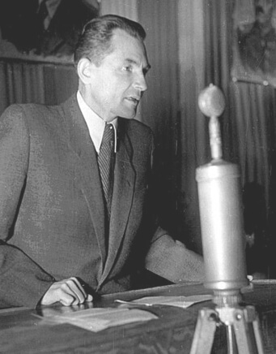

### Ełk

Ełk został przekazany pod administrację polską.

### Sarajewo

Miasto najbardziej znane z zamachu rozpoczynającego Wielką Wojnę. 6 kwietnia 1945 zostało odbite przez jugosłowiańskich partyzantów pod dowództwem Vladimira Perića "Valtera".

<SeeAlso txt="Jugosławia" url="/festung-breslau/article/jugoslawia" />

Sprawą, do której szczególnie przykładał uwagę, było zapobieżenie ewentualnym aktom sabotażu, skierowanym przeciwko miejskiej infrastrukturze. Chciał, żeby od razu można było zacząć normalne życie. Podczas wizytacji w fabryce tytoniu dziś w nocy, jeden z ostatnich żołnierzy niemieckich wciąż przebywających na terenie miasta rzucił w niego granatem. Valter zginął. Był jednym z ostatnich mieszkańców Sarajewa, którzy ponieśli śmierć podczas wojny.

### Kremser Hasenjagd

Austriackie miasto Stein an der Donau zostało w 1938 włączone do Krems an der Donau. W Stein mieści się drugie co do wielkości więzienie austriackie. Podczas wojny przetrzymywani tam byli więźniowie polityczni, głównie z wyroków o drobne wykroczenia typu słuchanie radia, albo wrogie reżimowi wypowiedzi. Byli to obywatele Austrii, Czech, Chorwacji i Grecji, ze środowisk komunistycznych, socjaldemokratycznych i chrześcijańskich.

W lutym 1945 wiedeński wymiar sprawiedliwości wydał rozkaz, by wobec zbliżania się nieprzyjaciela przeprowadzić ewakuację więźniów politycznych, a jeżeli ewakuacja była niemożliwa dokonać egzekucji. Kryminalnych natomiast wypuścić.

Na początku kwietnia więzienie w Stein było w tragicznym położeniu, kończyły się zapasy żywności, zbliżał się nieprzyjaciel, Armia Czerwona była już pod Wiedniem, a podjęte próby organizacji transportu dla prawie 2 tys. więźniów zakończyły się fiaskiem.

5 kwietnia zwolniono setkę więźniów kryminalnych. Zostali sami polityczni. Dyrektor więzienia Franz Kodré podjął decyzję, że ich też wypuści. Od rana zaczęło się wypuszczanie więźniów politycznych zgodnie z całą obowiązującą procedurą wydawania im rzeczy osobistych. Ponieważ sytuacja była napięta i groził bunt, dla uspokojenia niektórym z nich wydano broń. Wyglądało na to, że wszystko skończy się dobrze.

Nie wszyscy byli zadowoleni z decyzji dyrektora. Wśród pracowników więzienia było wielu nazistów. Zaalarmowali kreisleitera Antona Wilthuma, który wezwał na pomoc wojsko. W tym czasie setki więźniów już było poza więzieniem, mając przy sobie dokumenty zwolnienia. Wojsko zapędziło wszystkich uwolnionych z powrotem do więzienia, odebrało im broń i rozpoczęło masakrę. Zabijano wszystkich na dziedzińcach i korytarzach. Przy życiu pozostali tylko ci, których w ostatniej chwili strażnicy zamknęli w celach, pozorując, że bezprawne uwolnienie ich nie dotyczyło. Rozstrzelano dyrektora Kodré.

W samym więzieniu zamordowano ponad 200 osadzonych. Zmotoryzowane oddziały SS krążyły po okolicy, wyszukując uciekinierów. Miały wsparcie żandarmerii i Volkssturmu. Więźniowie byli łatwym celem, bo większość z nich wciąż miała na sobie więzienne ubrania i nie wiedzieli o obławie. W kilku przypadkach udzielono im schronienia.

Część ze schwytanych zatrzymano w Hadersdorf, następnego dnia 61 ludzi musiało wykopać sobie grób i zostali rozstrzelani przez SS.

Masakrę przeżyło 1074 osoby. Oznacza to, że łączna liczba ofiar waha się od 550 do 650 ludzi. Ci z mniejszymi wyrokami zostali wypuszczeni już 7 i 8 kwietnia. Resztę tzn. 836 ludzi załadowano na barki i przewieziono do Bawarii, gdzie zostali wyzwoleni przez wojska amerykańskie.

Gauleiter Hugo Jury oraz kreisleiter Anton Wilthum popełnili samobójstwo, unikając sprawiedliwości. 30 sierpnia 1946 zakończył się proces 14 sprawców: pracowników więzienia i dowódcy Volkssturmu w Krems. Wydano 5 wyroków śmierci (Leo Pilz, Alois Baumgartner, Anton Pomassl, Franz Heinisch, Eduard Ambrosch) 5 wyroków dożywocia, jeden dostał trzy lata więzienia, resztę uniewinniono. W odrębnym procesie zasądzono wyroki więzienia dla sprawców egzekucji w Hadersdorf. Żadni esesmani ani wojskowi nie zostali ukarani. Masakrę uznano za "przestępstwo fazy końcowej" (niem. Endphaseverbrechen) co stanowi (dlaczego?) okoliczność łagodzącą.

- [Massaker im Zuchthaus Stein](https://de.wikipedia.org/wiki/Massaker_im_Zuchthaus_Stein)

### KL Mauthausen-Gusen

Podczas ewakuacji filii obozu koncentracyjnego Mauthausen-Gusen Zygmunt znajdującej się w Wiener Neudorf został zastrzelony Zygmunt Miłkowski, dyplomowany pułkownik kawalerii, który całą wojnę spędził w konspiracji.

Po wybuchu Powstania Warszawskiego został wyznaczony na dowódcę Obszaru Zachodniego AK (Kraj Warty), ale podczas próby wydostania się z Warszawy 15 sierpnia został zatrzymany przez Niemców i nierozpoznany wywieziony do KL Mauthausen-Gusen.

### KL Mittelbau-Dora

Likwidacja obozu o nazwie A-Dorf w Artern (Turyngia). Jest to filia ogromnego obozu pracy KL Mittelbau-Dora znanego głównie z produkcji rakiet V-2. Żyjący jeszcze więźniowie zostali wywiezieni do obozu pracy fabryki rakiet V-2 w sztolniach w górze Kohnstein. Obóz ten zostanie wyzwolony przez US Army 11 kwietnia, Arterm 12 kwietnia. W lipcu na mocy ustaleń sojuszniczych całą Turyngia zostanie przekazana Armii Czerwonej i władzom NKWD.

Nie, nie władzom NRD. NRD powstanie za ponad cztery lata. Cały ten czas wschodnie Niemcy są we wszechmocy sowieckich czekistów Sierowa.

### Królewiec

O godzinie 0730 od niszczącego przygotowania artyleryjskiego zaczyna się szturm Królewca. Na miasto spadł ogień z tysięcy luf, do tego doszły bombardowania lotnicze. Wypełnione uciekinierami zabytkowe miasto błyskawicznie zamieniło się w dymiące ruiny.

### Gdynia

Żołnierze 1 BPanc. i 1 batalionu morskiego oraz przedstawiciele władz cywilnych dokonali uroczystego aktu zaślubin z morzem.

Czwarty tej wojny i piąty w ogóle.

Westerplatte wciąż się broni.

### Hieronim Mikołaj Radziwiłł

W sowieckim łagrze z powodu traktowania i warunków zmarł w wieku 60 lat Hieronim Mikołaj Radziwiłł (z tych Radziwiłów) właściciel dóbr Balice (na części znajduje się obecnie lotnisko krakowskie). Miał sześcioro dzieci, po śmierci żony ożenił się powtórnie w 1937 z 20 lat młodszą daleką kuzynką (przeżyła wojnę, zmarła w 1974). W lutym 1945 z synem aresztowany i wywieziony do łagru.

### Masakra w Gorajcu

2 Samodzielny Batalion Operacyjny polskiego Korpusu Bezpieczeństwa Wewnętrznego wczoraj o godzinie 21.00 wyruszył z koszar w Lubaczowie. Ich celem było odnalezienie i zlikwidowanie sztabu UPA, który miał znajdować się w odległej o 15 km wsi Gorajec. Okrążyli wieś i zaczęli atak o 5 rano ostrzałem moździerzowym. W ciągu godziny opanowali całą wieś. Okazało się, że żadnego sztabu UPA nie ma i we wsi jest tylko niewielki oddział ukraińskiej samoobrony.

W ciągu następnych czterech godzin rozegrała się tragedia mieszkańców wsi. Polscy żołnierze dokonali masakry cywilów, mordując 174 ludzi, w tym 32 kobiety, 35 dzieci i 19 osób powyżej 60 roku życia. Jak wykazało śledztwo IPN, do zbrodni doszło bez rozkazu, masakra miała spontaniczny charakter. Zabudowania podpalono, majątek zarekwirowano na rzecz Wojska Polskiego.

### Centralne Obozy Pracy

Stefan Radkiewicz stojący na czele po orwellowsku nazwanego Ministerstwa Bezpieczeństwa Publicznego niesławnym okólnikiem 42 powołuje Centralne Obozy Pracy, czyli polskie gułagi. Polskie obozy koncentracyjne przeznaczone dla ludzi niewygodnych dla komunizmu, folksdojczów i Ukraińców. Radkiewicz był ministrem bezpieki do 1954, kiedy czasy się zmieniły i popadł w niełaskę.

Na początek pięć:

- Warszawa
- Poniatowa
- Krzesimów
- Potulice
- Jaworzno.

Przynajmniej dwa z utworzonych przez niego obozów zostały bez żadnych zmian odziedziczone po hitlerowcach: obóz jeniecki w Łambinowicach (Lamsdorf) i filia KL Auschwitz-Birkenau w Jaworznie (Neu-Dachs).

Jaworzno powołano tylko formalnie, w rzeczywistości taki obóz istnieje tam już od lutego. Przetrzymywano w nich mieszkańców Górnego Śląska podejrzewanych o podpisanie Volkslisty, Niemców, byłych żołnierzy SS, oraz wracających do kraju żołnierzy armii Andersa, jeżeli wstąpili do niej, dezerterując z Wehrmachtu, do którego wcielono ich w ramach Volkslisty. Pierwszy oficjalny spis więźniów pochodzi z 22 marca.

W czasie kiedy więźniowie Auschwitz i Groß-Rosen wciąż byli pędzeni w Marszach Śmierci, obóz w Jaworznie znów przyjmował więźniów. To ukazuje nam prawdziwe oblicze powojennej Polski wyłaniające się spod propagandowego lukru.

*Stanisław Radkiewicz 1947, szef Ministerstwa Bezpieczeństwa Publicznego w latach 1945-54. 
By unknown-anonymous - "Głos Ludu" 1947, Domena publiczna, [Link](https://commons.wikimedia.org/w/index.php?curid=40085830)*

### Wrocław

We Wrocławiu działa kilka obozów pracy, w dużej części podobozów KL Groß-Rosen

- Breslau I, FAMO późniejszy Dolmel.
- Breslau II w Leśnicy przy koszarach SS.
- Breslau Hundsfeld, Psie Pole.
- Breslau Burgweide, na rogu Sołtysowickiej i Poprzecznej, było tam zależnie od okresu od 4 do 10 tys ludzi, tam przewożono wszystkich robotników przymusowych z dziesiątek likwidowanych obozów pracy na terenie całego Wrocławia. Obóz został wyzwolony już po kapitulacji Wrocławia, a kilka dni później odwiedził go Stanisław Drobner, apelując do polskich więźniów o pozostanie we Wrocławiu.
- Gross Masselwitz – Zwangsarbaiterlager – 646, w 1940 1000 robotników przymusowych, po 1943 prawie 3 tys.
- Archimedes przy Robotniczej, notabene jest to interesujący przykład przejęcia przez PRL nie tylko zakładu i rodzaju produkcji, ale i nazwy.

<SeeAlso txt="Obóz koncentracyjny Groß-Rosen (1940-45)" url="/festung-breslau/article/kl-gross-rosen" />

Istniało również kilka obozów o charakterze więziennym, w których stłoczeni w przeraźliwych warunkach ludzie mogli mieć tylko nadzieję, że Twierdza padnie, zanim zdąży ich zabić: największe to ten w szkole przy Hauke-Bosaka opisany przy okazji wizyty księdza Peikerta i drugi, w którym trzymano cywilów pojmanych po upadku powstania Warszawskiego w zespole szkolnym przy rynku Sępolna.

Meldunek wysłany przez Niehoffa za pośrednictwem feldmarszałka Schõrnera dotarł do Hitlera i wczoraj. 6 kwietnia, komendant twierdzy Wrocław otrzymał odpowiedź:
>Do dowódcy Twierdzy Wrocław 
>generała piechoty Niehoffa 
>Bohaterska walka oblężonych we Wrocławiu, przeciwko wielokrotnie przeważającemu pod względem liczebnym i materiałowym przeciwnikowi i dzielna postawa ludności wobec nękających codziennie twierdzę ciężkich nalotów lotniczych stanowi wzór i przykład do naśladowania dla całego narodu niemieckiego. 
>Zadaniem oblężonych we Wrocławiu pozostaje wytężenie wszystkich sił dla powstrzymania atakującego nieprzyjaciela. Zadaniem oblężonych jest obrona twierdzy do ostatniego człowieka. 140 000 znajdujących się w niej cywilnych mieszkańców nie może się dostać w ręce nieprzyjaciela. 
>Wszystko co możliwe aby w tej walce dopomóc, zostanie uczynione. 
>Adolf Hitler 

"*140 000 cywilnych mieszkańców twierdzy*" staje się w ten sposób uzasadnieniem dalszego prowadzenia walki, która nie ma już żadnego sensu. Co zresztą ma znaczyć określenie "cywilny mieszkaniec"? Kiedy powołano Volkssturm 20 października 1944, pod broń zostali wezwani prawie wszyscy niezmobilizowani jeszcze mężczyźni w wieku od 16 do 60 roku życia. Już wtedy przestali być cywilami. 17 stycznia komendant twierdzy Johannes Krause ogłasza alarm Gneisenau, co oznacza ich mobilizację, zostali wezwani do koszar i zaczęto z nich tworzyć bataliony. Dwa dni później Gauleiter wzywa wszystkie kobiety i dzieci do natychmiastowego opuszczenia miasta.

Miasto, zamienione w kolejną hitlerowską twierdzę ma być wolne od cywilów. To, co znamy jako ludność cywilną oblężonej twierdzy to ci, którzy pozostali. Wobec braku zabezpieczenia jakichkolwiek środków transportu, punktów postojowych, pomocy na drodze stanowiło to zbrodnię wojenną, przy której bombardowanie miasta pełnego cywilów stanowi zwykłą operację wojskową.

Teraz Hitler powołuje się na dobro ludności cywilnej, aby uzasadnić dalszą jej masakrę. Trzeba też dodać, że rozkaz komendanta Hermanna Niehoffa z 7 marca czynił z wszystkich cywilów niewolników twierdzy, byli oni bowiem pod groźbą kary śmierci zobowiązani do wykonywania niewolniczej pracy, codziennie (nawet bez przerwy na niedzielę) i bardzo często w niebezpiecznych miejscach takich jak budowane na pl. Grunwaldzkim lotnisko. Obowiązkowi temu podlegali wszyscy niezmobilizowani dotąd wrocławianie płci męskiej od 10 roku życia, płci żeńskiej od 12 roku życia. Ale jak zobaczymy to jeszcze nie koniec szaleństwa twierdzy.

Tymczasem na zachodzie bez zmian, zdziesiątkowane wojska niemieckie, będące już mieszaniną oddziałów garnizonu Twierdzy, Volkssturmu i pospiesznie zebranych cywilów zdolnych do walki usiłują przetrwać nawałę ogniową, jak opisuje Verton:
>Byłem jedynym żołnierzem w piwnicy i musiałem ukrywać moje odczucia. Przeżywanie takiego nalotu powietrznego w tak ograniczonej przestrzeni nie było czymś, czego byłem dotąd przyzwyczajony. Takie bombardowanie było czymś, czego dotąd nie doświadczyłem nawet na głównej linii obrony. W końcu na zewnątrz było się uzbrojonym i aktywnym. Zaś tu w piwnicy byłem bezbronny, starałem się ukryć mój strach. Zrobiłem się użyteczny jako kelner, podając każdemu kawałek tradycyjnego drożdżowego makowca, który kobiety upiekły na Święta Wielkanocne. Ta czynność wywołała słaby uśmiech na sztywnych i kamiennych twarzach, lecz nie dotarł on do wystraszonych i zapatrzonych oczu ich właścicieli. Rozpoczęła się spontaniczna, głośna modlitwa "Święta Mario, Matko Boża” Wtedy ktoś stracił nerwy i krzyknął "zamknijcie gęby!"

Starcie pancerne na Popowicach, porucznik Leo Hartmann:
>Kiedy rozpoczął się ogień artylerii i moździerzy, opuściliśmy naszą piwnicę w Lasku Dębowym i pojechaliśmy przez ulicę Popowicką na Białowieską w kierunku portu. Przez ogródki działkowe i łąki między ośrodkiem dla niewidomych i Lasek Dębowy zbliżały się liczne nieprzyjacielskie ciężkie działa samobieżne. Strzelaliśmy do nich, jak popadło. [...] Wystrzeliłem już całą amunicję przeciwpancerną i wezwałem na pomoc Maiera. Ostatnimi granatami podpalił on ciężkie działo. Pozostałe schroniły się z powrotem w lesie.

Do bitwy pancernej za linią nasypu kolejowego, już na Szczepinie dojdzie 18 kwietnia.

### Odnośniki

- Virtual Shtetl: [Obozy na ziemiach polskich 1944–1958](https://sztetl.org.pl/en/glossary/obozy-na-ziemiach-polskich-1944-1958)
