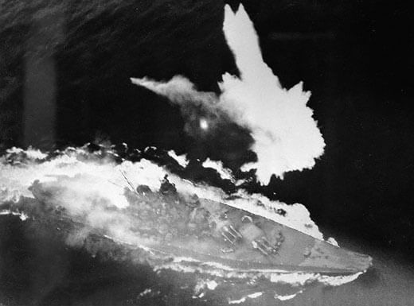

Dziś więcej o Japonii, bo są ku temu aż dwie okazje, oraz - niestety! - kończymy sprawy japońskie i zostawiamy wojnę na Pacyfiku.

### Tokio

Ostatnia podczas wojny zmiana na stanowisku premiera Japonii. I to bardzo znacząca.

Ze stanowiska premiera odchodzi Kuniaki Koiso, generał związany z Armią Kwantuńską, potem gubernator okupowanej Korei, należący do radykalnego, szowinistycznego stronnictwa Kōdō-ha. Był premierem od 22 lipca 1944. Prowadził politykę agresywnej obrony za wszelką cenę. Jej skutkiem była obrona Filipin i bitwa w zatoce Leyte gdzie po raz pierwszy 17 października 1944 użyto kamikaze. Zadając przeciwnikowi jak największe straty, usiłował wymusić korzystne warunki pokoju. Nie zdołał znaleźć warunków zakończenia wojny, które skłoniłyby zarówno Amerykanów, jak i korpus oficerski do poważniejszych rozmów. Żeby zapanować nad armią, usiłował połączyć stanowiska ministra wojny i premiera, ale to mu się nie udało, bo był już w stanie rezerwy. W końcu po serii klęsk został zmuszony do odejścia.

Jego dymisja jest bezpośrednim skutkiem inwazji na Okinawę. Po wojnie będzie sądzony za zbrodnie wojenne, uznany winnym i skazany na dożywocie. Umrze w więzieniu w 1950.

Jego następcą 7 kwietnia 1945 zostaje dwanaście lat starszy, 77-letni, admirał Kantarō Suzuki. To on po zrzuceniu bomb atomowych na Hiroszimę (6 sierpnia) i Nagasaki (9 sierpnia) 14 sierpnia wyrazi zgodę na kapitulację na warunkach określonych w deklaracji poczdamskiej.

Zaraz potem w nocy z 14 na 15 sierpnia 1945 nacjonalistyczna frakcja korpusu oficerskiego dokona zamachu stanu, mordując generała Takeshi Mori, dowódcę Gwardii Cesarskiej. Udało im się zająć Pałac Cesarski. Ich plan polegał na uwięzieniu cesarza w areszcie domowym i wezwaniu armii do buntu, powołaniu nowych władz i kontynuowaniu wojny za wszelką cenę. Usiłowali również zabić admirała Suzuki. Kiedy żadnego z tych celów nie osiągnęli, popełnili rytualne samobójstwo, seppuku.

Kiedy opublikowano warunki kapitulacji 17 sierpnia, admirał Suzuki podał się do dymisji. Umarł w 1948.

II Wojna Światowa zakończy się - przynajmniej oficjalnie, w sensie zawarcia pokoju pomiędzy państwami, które ją prowadziły, dokładnie sześć lat i jeden dzień po jej oficjalnym początku: 2 września 1945.

W przypadku Japonii przynajmniej w sferze symbolicznej alianci byli łaskawsi wobec przegranego.

### Yamato

Suzuki obejmuje urząd w chwili dla Japonii symbolicznej, tego samego dnia idzie na dno symbol imperialistycznej Japonii i duma jej floty. Wraz z bliźniaczym Musashi największy pancernik, jaki kiedykolwiek zwodowano - pancernik Yamato.

Japończycy zdawali sobie sprawę, z tego że wojny morskie to wojny produkcyjne i tu nie mają w wojnie z USA żadnych szans. Co więcej gospodarka japońska była całkowicie zależna od USA. Zaatakowali USA właśnie dlatego, że zdawali sobie sprawę iż z perspektywy amerykańskiej jako rzecz mało prawdopodobna zdecydowany, niszczący atak będzie zupełnym zaskoczeniem. Atak na Pearl Harbor rzeczywiście był zaskoczeniem, ale nie był niszczący: lotniskowce, doki, składy paliwa ocalały. Już 7 grudnia można było ocenić, że szanse Japonii są bliskie zeru.

Wtedy weszła do gry tajna broń japońskiej - pancerniki typy Yamato. Planowano ich pięć, zwodowano trzy, ale ostatni został przerobiony na lotniskowiec. Były to budowane w najściślejszej tajemnicy najpotężniejsze pancerniki w dziejach świata. Ich wielkość i siła artylerii miała być odpowiedzią na przewagę USA w każdej innej dziedzinie. Liczono na to, że tak potężne okręty będą przeciwwagą dla siły ognia floty amerykańskiej, której wielkość okrętów ograniczał rozmiar kanału panamskiego.

Bitwa na Morzu Koralowym 4-8 maja 1942 wykazała, że czas pancerników już przeminął. Decydującą rolę odgrywały lotniskowce, które z blisko 10x większym zasięgiem ognia mogły skutecznie atakować cele zza horyzontu.

Bitwa o Midway 4-7 czerwca 1942, w której Japończycy stracili 4 lotniskowce odebrała Japonii wszelkie szanse na zwycięstwo.

Japońska flota przegrywała wszystkie bitwy i nie mogła zapewnić ochrony szlaków morskich. Japońskie pancerniki albo z racji powolności spóźniały się na bitwę, albo nie odgrywały w nich żadnej istotnej roli. Yamato tylko raz miał okazję użyć głównej artylerii, podczas nieudanej próby obrony Filipin.

Teraz wysłano go w misji samobójczej do obrony Okinawy, miał paliwa tylko w jedną stronę. Jego celem było tzw. sztrandowanie, czyli wylądowanie na płyciźnie przybrzeżnej i pozostanie tam już na stałe jako bateria artylerii. Miał pełne zapasy amunicji.

7 kwietnia po trwającym ponad dwie godziny atakach prawie 400 samolotów amerykańskich w trzech falach, trafieniu przynajmniej 11 torpedami eksplodował jeden z magazynów amunicji. Grzyb wybuchu miał wysokość 6 km i był widoczny na odległej o 160 km Kyusiu. Z 2332 członków załogi udało się uratować tylko 277 ludzi.

Sam okręt jest tajemnicą dla miłośników marynistyki, bo po zatopieniu obu należących do tej rodziny pancerników tajna policja japońska Kempeitai dostała rozkaz zniszczenia całej dokumentacji łącznie ze zdjęciami i zadanie to wykonała dokładnie, więc wszystko, co wiemy, wynika z analizy zdjęć sporządzonych przez marynarkę wojenną USA.

Yamato był okrętem flagowym Połączonej Floty, czy morskiego składnika floty cesarskiej. Dlaczego nie został przeznaczony do obrony kraju, a zmiast tego wysłany w bezsensownej, samobójczej misji? Odpowiedź na to pytanie pozwala zrozumieć sposób myślenia japońskiej kadry oficerskiej żyjącej w oparach kodeksu bushido. Obowiązkiem samuraja, a wszyscy oficerowie uważali się za samurajów, było zwycięstwo lub śmierć z honorem.

W 1944 już nie dało się ukrywać, że cały ciężar wojny prowadzonej przez cesarską armię ponoszą siły lądowe. Marynarka cesarska od samego początku nie zaliczyła żadnego istotnego zwycięstwa. Nawet Pearl Harbor, jeżeli realistycznie popatrzyć na skutki było klęską. Amerykanie doświadczyli spektakularnego upokorzenia, ale US Navy nie została osłabiona. Lotniskowce nieruszone, suchy dok sprawny, zapasy paliwa nietknięte. Bitwa o Midway w czerwcu 1942 jest punktem zwrotnym wojny na Pacyfiku i wielką klęską wielkiej cesarskiej floty. W 1945 nie było już żadnych szans na zwycięstwo a okręt flagowy Połączonej Floty, wielki, największy Yamato, cały lśniący i nietknięty nie był żadną dumą, lecz wręcz przeciwnie, był hańbą całej armii. Na Midway wszystkie japońskie pancerniki się spóźniły. Brał udział w dwóch bitwach w 1944, najpierw w bitwie na Morzu Filipińskim w czerwcu i potem w październiku w bitwie morskiej o wyspę Leyte. W obu nie odegrał żadnej roli. W drugiej oddał kilka niecelnych strzałów do niszczycieli przeciwnika i dostał dwa niegroźne trafienia torpedami. Jego bliźniak Musashi zatonął.

Już wcześniej z powodu ciągłego bazowania okrętu mówiono o "Hotel Yamato", teraz jednak miał opinię "pływającego hotelu dla bezczynnych, nieudolnych admirałów". W każdej normalnej marynarce byłby jeszcze jakąś nadzieją, ale to była marynarka japońska i jedynym być może mającym element racjonalności składnikiem decyzji było poświęcenie okrętu na zadanie śmiertelnego ciosu, póki jeszcze można go zadać. Było bowiem oczywiste, że Amerykanie polują na Yamato, który w starciu z samolotami US Navy będzie bezradny. Jego port macierzysty w Kure był obiektem ataku w ramach Operation Starvation minowania z powietrza szlaków zaopatrzeniowych. Na minach zrzuconych przez amerykańskie samoloty wyleciał w powietrze jeden z niszczycieli wychodzący z tego portu.

Od 3 maja 1944 dowódcą naczelnym Połączonej Floty był admirał Soemu Toyoda. To jego decyzją były te dwie wielkie i przegrane bitwy floty japońskiej w 1944: na Morzu Filipińskim i w Zatoce Leyte. Obie były ryzykiem podjętym w obliczu kończących się zasobów, od których zależało funkcjonowanie floty. Flota więc była przydatna, tylko jeżeli zakończyłyby się zwycięstwem. Jeżeli by do nich nie doszło albo gdyby były przegrane, flota choćby z braku paliwa była bezużyteczna. Obie były klęską, a Yamato całkowicie sprawny i bez ofiar na pokładzie każdą chwilą istnienia przynosił wstyd.

To dlatego 4 kwietnia admirał Toyoda wydał rozkaz operacji Ten-gō (jap. Niebo) - rzucenia wszystkiego co Marynarka jeszcze ma w samobójczym wysiłku na Okinawę. Przede wszystkim był to Yamato, oprócz niego lekki krążownik Yahagi i 6 niszczycieli. Jak to ujął dowódca wysłanej grupy okrętów wiceadmirał Seiichi Itō "*Sądzę, że otrzymaliśmy stosowną okazję, by umrzeć. Samuraj żyje tak, że zawsze jest przygotowany na śmierć*". Dzisiaj zginął na Yamato. Co interesujące wypowiedź ta obrazuje jego stan umysłu w sytuacji, z której nie dano mu wyjścia. Był racjonalnym człowiekiem, uważał wysłanie okrętów na Okinawę za bezsensowne marnowanie sił. Zmienił swoje nastawienie, kiedy z dworu cesarskiego nadeszła wieść, że cesarz oczekuje jakiegoś działania Marynarki.

Możliwe, że zadaniem tej grupy bojowej było odciągnięcie uwagi Amerykanów od przerzucenia na Okinawę wszystkich posiadanych sił kamikaze.

Na tej zmianie na stanowisku premiera i zatopieniu Yamato kończymy wątki wojny na Pacyfiku. Do 10 maja bowiem nie wydarzy się już bowiem nic szczególnie istotnego dla jej przebiegu, oprócz cały czas trwającej od 1 kwietnia do 22 czerwca wyniszczającej bitwy o Okinawę. W ciągu 98 dni po stronie amerykańskiej zginie od 15 do 20 tysięcy żołnierzy, straty japońskie przekroczą 110 tys. zabitych.

Całe tło, przyczyny i przebieg wojny na Pacyfiku, w takim zakresie, jaki ma znaczenie dla okresu opisanego w tym blogu, znajduje się w osobnych artykułach, do których przeczytania gorąco zachęcam.

<SeeAlso txt="Wojna na Pacyfiku 1945" url="/festung-breslau/article/pacyfik-1945" />

- Podcast Wojenne Historie ["Droga do Pearl Harbor. Jak to się stało, że słaba Japonia zaatakowała potężne Stany Zjednoczone?" [YT 27:05]](https://www.youtube.com/watch?v=Zc1FtM34J6w)
- [Military History not Visualized "Yamato: Why not saved to defend Japan?" [YT 13:45]](https://www.youtube.com/watch?v=5osfQil1fn0)
- Studio Blue Ocean ["Making The Last Battle YAMATO Diorama" [YT 34:08]](https://www.youtube.com/watch?v=m1hMUTG48kw)
- [Imperial Japanese Navy Page](http://www.combinedfleet.com/kaigun.htm)

*Yamato tonie. 
Domena publiczna, [Link](https://commons.wikimedia.org/w/index.php?curid=44651)*

### Sonderkommando Elbe

Tego dnia samobójczy atak niemieckich myśliwców miał unicestwić aliancką flotę bombowców.

Pierwotnie planowano użyć w tej operacji 1,5 tys. samolotów. Ostatecznie skierowano do akcji 180 myśliwców (lub 130, zależnie od źródła), były to głównie Me B 109 G, specjalnie do tego celu pozbawione opancerzenia i uzbrojenia. Pilotom pozostawiono jedynie jeden kaem z 60 nabojami. Ich zadaniem nie była walka, ale staranowanie usterzenia nieprzyjacielskiego bombowca. Pilot miał wyskoczyć na spadochronie tuż przed atakiem. W praktyce szanse na przeżycie były niewielkie.

Zadanie mieli wykonać młodzi piloci, pozbawieni doświadczenia, mający 40 może 60 godzin w powietrzu.

Zdecydowana większość ze 180 Messerschmittów Bf 109 została zniszczona w powietrzu przez osłonę myśliwską i ogień z bombowców. Doszło do 15 ataków na bombowce, 8 z nich zniszczono (lub 13, zależnie od źródła). Z 1311.

53 Messerschmittów zestrzelono, 27 wróciło na lotniska. Jednostka została rozwiązana 17 kwietnia, a piloci spieszeni i wysłani do walki w Berlinie.

<SeeAlso txt="Wunderwaffe" url="/festung-breslau/article/wunderwaffe" />

- [Mark Felton Productions "Operation Werewolf - Sonderkommando Elbe Ram Attacks 1945" [YT 12:34 ]](https://www.youtube.com/watch?v=y7ZRCpKlzEw)
- Yarnhub ["Sonderkommando Elbe" [YT 6:42]](https://www.youtube.com/watch?v=MDkh3tdAITU)
- [Sonderkommando Elbe](https://en.wikipedia.org/wiki/Sonderkommando_Elbe)

### Królewiec

Trwa bitwa o stolicę Prus Wschodnich. Miasto wypełnione tysiącami uchodźców atakowane jest przez trzy sowieckie armie: 50, 43 i 11. W sumie ponad 100 tys. żołnierzy i 1500 samolotów.

W potrzasku bombardowanego miasta znajdowało się 100 tys. cywilów, którzy nie zdołali się ewakuować. To już drugi dzień bitwy. Armia Czerwona przełamała słabą obronę na linii fortów, zaczynają się walki w gęstej zabudowie.

Niemcy dokonują rozpaczliwych kontrataków. Atakująca od południa 11 Armia dociera do Pregoły. Na północy długo opór stawia Fort V, w nocy saperzy wysadzają fortyfikacje i dokonują włamania. W forcie rozpoczyna się walka na oślep.

### 12 Armia niemiecka

Kończymy sprawy japońskie, zaczynamy narrację berlińską. 

7 kwietnia przebywający na rehabilitacji w samym sercu rzekomej Twierdzy Narodowej, w Bechrtesgaden, generał Walther Wenck również otrzymał dziwny rozkaz. Wenck był szefem sztabu Guderiana i najmłodszym generałem Wehrmachtu, ale 13 lutego został poważnie ranny w wypadku samochodowym. Miał złamanych wiele żeber i wciąż nosił gipsowy gorset.

Otrzymał depeszę nakazującą mu natychmiast zadzwonić do kwatery głównej i kiedy to zrobił, adiutant Hitlera generał Burgdorf rozkazał mu jak najszybciej stawić się w Berlinie, powiedział mu:
>Hitler mianował pana dowódcą 12 Armii.

Tego właśnie Wenck nie zrozumiał, nigdy nie słyszał o 12 Armii. Istotnie, taka armia jeszcze nie istniała. Kiedy Wenck był w drodze do Berlina była dopiero w stadium formowania. O tym, że został ostatnim obrońcą zachodniej rubieży Berlina, generał Wenck dowiedział się na miejscu.

Historia 12 Armii jest kwintesencja ostatnich dni III Rzeszy. Coś, co w zamierzeniu tyrana miało być zachodnim bastionem obrony Berlina, zostało ruchomym obozem uciekinierów zmierzającym do poddania się w niewolę. Wenck nie wykonał rozkazu, był dowódcą misji humanitarnej.

### Westerplatte

Przed atakiem, do którego szykował się przybyły z Lublina 1. Samodzielny Morski Batalion Zaporowy poddała się niemiecka załoga Westerplatte. Walki w całym rejonie Trójmiasta ustały.

Pozostały tylko nieatakowane siły niemieckie na Helu, które poddały się dopiero 14 maja 1945.

### 2 Armia WP

Natomiast 2 Armia LWP jest w drodze na zachód i po nocnym marszu rozlokowała się na odpoczynek między Chojnowem a Przemkowem. Awangarda Armii jest już w połowie drogi do wyznaczonego rejonu zgrupowania.

Czeka ich ciężki marsz, kiedy ruszą wieczorem rozpęta się burza i będą szli w ulewnym deszczu. Wczoraj sztab Armii opuścił Trzebnicę.

### Wrocław

Warto też powrócić do relacji Hugo Hartunga, który 6 kwietnia opisuje zniszczenia samego centrum Wrocławia:
>W blasku słońca idę wzdłuż brzegu Odry, która jest mętna i brudna. Na powierzchni wody unosi się zwęglone drewno. Straszliwy obraz Ostrowa Tumskiego: wypalone kikuty wież katedry i kościoła na Piasku. Tylko delikatna smukła wieża kościoła św. Krzyża sprawia wrażenie nietkniętej. 
>Kałuże krwi na pięknej alei wzdłuż rzeki. Martwe konie. U podnóża Wzgórza Polskiego leżą białe pakunki. Tutaj grzebie się wielu spośród tych, którzy zginęli w Wielkanoc. Również w ogrodach przy domach i gospodach wszędzie świeże mogiły. Na starym cmentarzu przy kościele św. Maurycego bomby wyrzuciły z grobów zmarłych z minionych epok. Z trudem pokonuję hałdy gruzów [...] Wszędzie nieme grupy ludzi, którzy z kopiato napakowanymi wózkami albo bez jakichkolwiek bagaży ciągną ze zniszczonych stref ku jeszcze nietkniętym rejonom miasta: Sępolnie i Karłowicom. Od piwnicy do piwnicy mienie się kurczy, a straty w ludziach rosną".

7 kwietnia zaś cieszy się z bardzo dobrej kuchni, jaką zapewnia nowy członek załogi zawodowy kucharz z wieloletnim doświadczeniem w hotelach i statkach pasażerskich. Nawet w jedzeniu dobrze kryje się niebezpieczeństwo, można bowiem jeść zbyt dobrze i zbyt dobrze wyglądać:
>Uważamy tylko by zanadto nie nadużywać tych kulinarnych delikatesów. Przez dobrą prezencję można bowiem ściągnąć na siebie uwagę wojskowych medyków i obudzić w nich żyłkę "poławiaczy bohaterów".
