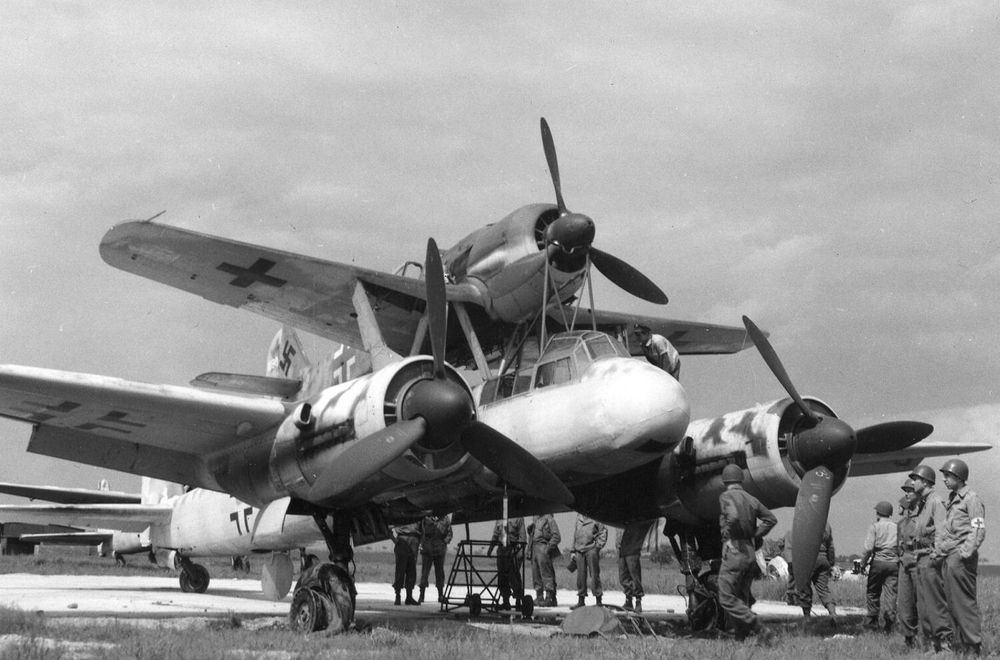

### Samobójstwa hitlerowców

Kolejny hitlerowiec popełnia samobójstwo: Josef Weinheber austriacki pisarz i poeta, który zaangażował się ideologicznie i całym sercem po stronie dyktatury.

Na 50. urodzimy Hitlera (1939) napisał słuchowisko, w którym wyjaśniał, że swastyka reprezentuje związek kobiety i mężczyzny i jest to "*płomienny znak ludzi wierzących w światło*" oraz stanowi oazę lojalności wobec "*przywódcy posłanego przez Boga*". Spadł na niego deszcz zaszczytów i nagród. W 1942 doktorat honoris causa uniwersytetu wiedeńskiego.

W sierpniu 1944 Hitler dodał go na listę najważniejszych ludzi kultury chronionych przed służbą wojskową. Ostatecznie listę tę znaną jako Gottbegnadeten-Liste zamknięto we wrześniu 1944. Była dziełem Goebbelsa (który jako minister propagandy był odpowiedzialny za wszystko związane ze sztuką) i Hitlera.

Był antysemitą, alkoholikiem, pod koniec życia cierpiał nan bezsenność i depresję.

Kiedy Armia Czerwona wkraczała do Wiednia zabił się w Kirchstetten (40 km na wschód od Wiednia), przedawkowując morfinę.

### Wiedeń

3 Front Ukraiński dowodzony przez marszałka Rodiona Malinowskiego po odparciu Operacji Balaton i zdobyciu Węgier walczy w Austrii.

Operacja wiedeńska zaczęła się 16 marca i wkrótce potem rozbito zgrupowania hitlerowskie w regionie Veszprém i Esztergom.

26 marca rozpoczęło się natarcie na Wiedeń, broniony głównie przez jednostki SS - II. SS-Panzerkorps w składzie którego walczyła 2. SS-Panzerdivision "Das Reich". Była tam również 3. SS-Panzerdivision "Totenkopf".

8 kwietnia zewnętrzna linia obrony Wiednia padła i czerwonoarmiści wdarli się do miasta od południa. Były to oddziały 6 Gwardyjskiej Armii Pancernej i 9 Armii Gwardyjskiej.

46 Armia sowiecka okrążała miasto od północy.

### Melitta Schenk Gräfin von Stauffenberg

Niemcy hitlerowskie były konserwatywne jeżeli chodzi o pozycję kobiet w społeczeństwie. Zgodnie z niemiecką tradycją "Kinder, Küche, Kirche". Były oczywiście wyjątki. Najsłynniejszym była Hanna Reitsch.

<SeeAlso txt="Kapitan Hanna Reitsch (1912-79)" url="/festung-breslau/article/hanna-reitsch" />

Znaną, choć bardziej z powojennej działalności pilotką jest Beate Uhse, założycielka sieci sklepów erotycznych. Po wojnie jako członkini Luftwaffe nie miała pozwolenie na latanie więc zajęła się handlem obnośnym chodząc od drzwi do drzwi. Kiedy zrozumiała jak bardzo brakuje edukacji seksualnej w powojennym niemieckim społeczeństwie zajęła się propagowaniem kalendarzyka małżeńskiego i sprzedażą poradników małżeńskich. Potem w latach 60. weszła w branżę erotyczną. Jej historia jest przedstawiona 22 kwietnia.

Bardziej skomplikowany i tragiczny życiorys miała Melitta Schenk Gräfin von Stauffenberg, de domo Schiller. Jej ojciec był żydowskim handlarzem futer. W 1927 ukończyła Politechnikę Monachijską. Związała się z lotnictwem, ale z powodu żydowskiego pochodzenia została zwolniona z Luftwaffe. Nadal pracowała przy opracowywaniu lotniczych systemów nawigacji. W 1937 wyszła za historyka, Alexandra Grafa Schenka von Staufenberga. Jako żona arystokraty mogła wrócić do latania. 28 października 1937 dostała awans na kapitana (druga kobieta w Niemczech po Hannie Reitsch). Miała licencję pilota i szybowcową. Od 1939 była pilotką doświadczalną w Rechlin, w sumie 2,5 tys. nurkowań, czasem 15 razy dziennie z wysokości 4 km. Uchroniło to jej rodzinę przed wywózką do obozów koncentracyjnych.

Claus von Stauffenberg, który dokonał zamachu na Hitlera 20 lipca 1944 był bratem jej męża. Dlatego została aresztowana 25 lipca w ramach odpowiedzialności zbiorowej (niem. Sippenhaft), ale ze względu na potrzeby frontu i zasługi zwolniono ją 2 września.

Jej mąż nie był tak pilnie potrzebny III Rzeszy i choć nie miał związku z zamachem został zatrzymany jako zakładnik w specjalnym oddziale KL Buchenwald. Melitta go tam czasem odwiedzała, ale 4 kwietnia spotkała ją bardzo przykra niespodzianka - oddział był pusty. Więźniów przetransportowano do Ratyzbony, ich los był nieznany. Żeby go odnaleźć poleciała razem z przyjacielem do Ratyzbony 8 kwietnia.

Lecieli nieuzbrojonym samolotem treningowym Bücker Bü 181 Bestmann. W pobliżu Straßkirchen (Bawaria) napotkał ich P-51 Mustang i zestrzelił. Ranna dokonała udanego awaryjnego lądowania. Dwie godziny później zmarła w szpitalu od ran postrzałowych. Jej mąż przeżył wojnę. 

- Mark Felton Productions ["Female Luftwaffe Pilots in Combat 1945" [YT 8:32]](https://www.youtube.com/watch?v=v8OsaIqxxwk)

### Królewiec

Trzeci dzień trwa bitwa o Królewiec. 11 Armia sowiecka atakująca od południa przekracza linię Pregoły. Fort V padł. Wszystkie trzy sowieckie armie walczą już w gęstej miejskiej zabudowie.

Marszałek Aleksandr Wasilewski, dowódca 3 Frontu Białoruskiego po raz kolejny składa propozycję kapitulacji. Odrzucona.

### Nalot Misteli na most kolejowy na Wiśle

Dziś rano miał miejsce ostatni nalot na Warszawę. Z lotniska Rechlin-Lärz w Meklemburgii wystartowało pięć bombowców hybrydowych Mistel. Celem był drewniany most kolejowy koło Cytadeli. W tym czasie oprócz niego działał tylko prowizoryczny most pontonowy. Poza tym Warszawa, bardzo ważny węzeł komunikacyjny była bez mostów.

W Centralnym archiwum Wojskowym znajduje się meldunek z tego dnia:
>Meldunek bojowy o zastosowaniu środków dymnych [...] – o 2.00, 8.4.45, dwa bombowce niemieckie pojawiły się nad m. Warszawą i zrzuciły kilka bomb oświetlających nad rejonem mostu kolejowego na rz. Wisła. Zgodnie z zarządzeniem d-cy OPL obiektu, 1 Sam. Baon Chemiczny przystąpił do przykrycia dymem obiektu. Puszczanie dymu trwało do 5.00, 8.4.45 r. Nad obiektem bomb nie zrzucono [...] Rozprzestrzeniający się dym zasłonił most kolejowy (na 3/4), most pontonowy oraz drewniany most Kierbedzia, znajdujący się w odległości 1,5 km.

Dowódca grupy PW Stahl napisał w raporcie:
>Użyto wówczas pięciu »Misteli«. Wszyscy piloci wrócili swymi Fw 190 na lotnisko operacyjne Rechlin – Lärz. Ze względu na bardzo silną artylerię przeciwlotniczą nad celem mieli kłopoty z precyzyjnym przeprowadzeniem nalotu na cel. Obserwowali wprawdzie wybuchy »Misteli«, ale nie zobaczyli osiągniętego skutku.

Są tu dwa niezwykle interesujące wątki: pierwszym są mosty na Wiśle, drugim Mistele.

Kiedy jesienią 1944 front ustabilizował się na Wiśle, z oczywistych powodów zniszczono wszystkie mosty. W efekcie na początku operacji wiślańsko-odrzańskiej Armia Czerwona dysponowała tylko naprędce skonstruowanymi mostami pontonowymi. Tak szybko, jak tylko było można, przystąpiono do odbudowy najważniejszych ze zniszczonych mostów, czyli mostów kolejowych położonych na ważnych magistralach.

W kwietniu 1 Front Białoruski dysponował zaledwie trzema mostami kolejowymi: w Sandomierzu, Dęblinie i tym właśnie prowizorycznym, drewnianym mostem koło warszawskiej Cytadeli. Dalej na północ nie było już nic. Wokół Warszawy rozlokowana była cała dywizja przeciwlotnicza. W pobliżu mostu pod strażą wojska trzymano materiały, umożliwiające jego natychmiastową odbudowę.

Niemcy wiedzieli o tej słabości 1 Frontu Białoruskiego - fakt, że nie bombardowali ich regularnie, wynika wyłącznie ze słabości Luftwaffe. Ich ostatnie rozpoznanie lotnicze pochodziło z 1 marca 1945. Przygotowanie bombardowania zajęło więc ponad miesiąc.

Bombowce hybrydowe (niem. Mistelschlepp, wleczenie jemioły) to dwa połączone ze sobą samoloty, z których jeden jest bezzałogową bombą, a w drugim jest pilot, naprowadzający całą konstrukcję na cel. Podczas nalotu, kieruje się na cel, uzbraja bombę, odłącza się i wraca. Po raz pierwszy jeszcze podczas Wielkiej Wojny planowali je zastosować Brytyjczycy do walki z niemieckimi sterowcami, Niemcy natomiast eksperymentowali z tymi samolotami od 1942 i rok później mieli już działające Jemioły (Mistel po niemiecku to jemioła). Było wiele rodzajów tych bombowców, najczęstszą kombinacją był Ju 88 i FW 190.

<SeeAlso txt="Wunderwaffe" url="/festung-breslau/article/wunderwaffe" />

Co do samego bombardowania nic tu nie jest pewne. Są rozbieżności nie tylko co do liczby samolotów, skutków, nawet co do daty, bo są źródła mówiące, że bombardowanie miało miejsce dzień później. Wiadomo tylko, że nie pozostawiło żadnych istotnych skutków i nie pisano o nim w prasie.

- Dark Skies ["Double Stack - Germany's Top-Secret Mistel Bomber" [YT 9:27]](https://www.youtube.com/watch?v=lOJJcUu4_to)

<BoxImageWrapper>

Mistel 
By U.S. Army - [http://anonymous-generaltopics.blogspot.com/2008/06/mistel.html](http://anonymous-generaltopics.blogspot.com/2008/06/mistel.html), Domena publiczna, [Link](https://commons.wikimedia.org/w/index.php?curid=25625085)
</BoxImageWrapper>

### Gdynia

Początek polskiej powojennej floty bałtyckiej. W Gdyni (albo na Oksywiu, do sprawdzenia) o godz. 1300 podniesiono banderę na ORP "Korsarz". Przy wczorajszym zatopieniu Yamato... powiedzmy wprost Korsarz to drewniana łódka, która przed wojną była cywilnym kutrem pilotowym, miała długość ponad 17 m i szerokość niecałych 5 m. Wcielono ją do służby, bo została odnaleziona nieuszkodzona i można było nią pływać. Służyła do różnych celów, m.in. zapewniała łączność z Helem.

W lipcu 1945 uratowała 11 marynarzy z sowieckiego holownika, który wszedł na minę. Już w sierpniu 1946 MW oddała ja kapitanatowi i tam jako Pilot 4 służyła do 1977.

Niecały rok później - 5 kwietnia 1946 Armia Czerwona przekaże marynarce Wojennej RP 23 okręty: [ https://www.facebook.com/1442544729302079/photos/a.2445734625649746/2497076627182212/?type=3&theater ] "Gdynia, 05.04.1946 r. Port Marynarki Wojennej na Oksywiu. Uroczystość przekazania Polsce 23 radzieckich okrętów. Z galerii: J. Berent."

### Wrocław

Walki o Popowice, podczas których 294 Dywizję Strzelecką wspierały IS-2 z 87 Pułku Gwardii:
>W czasie z któregoś kolejnych dni ponownie rozpętał się ogień. Odstrzeliłem wprawdzie na Popowickiej jeden rosyjski czołg i jedno działo pancerne, ale Rosjanom udało się dotrzeć do gospodarstwa na rogu Białowieskiej i Popowickiej i wedrzeć się do Lasku Dębowego. W obliczu znacznej przewagi wroga kontratak nie powiódł się mimo zastosowania miotaczy ognia. I tak około 7 czy 8 kwietnia Rosjanie mieli już w posiadaniu cały Lasek Dębowy, bezpośrednio na zachód od stacji Popowice. W tym czasie straciliśmy niestety naszego kompana Maiera, którego działo zostało trafione ręcznym granatem wprost w pokrywę luku, w wyniku czego kilka odłamków uszkodziło Maierowi płuca. Zmarł kilka dni później w urządzonym na Nadodrzu szpitalu wojskowym. Udało mi się go jeszcze krótko odwiedzić i przekazać wiadomość o awansie na stopień sierżanta. To była jego ostatnia radość. Godzinę później już nie żył. Być może ta śmierć oszczędziła mu wielu cierpień w sowieckiej niewoli. W Lasku Dębowym zdołałem jeszcze z przejścia podziemnego obok stacji Popowice ustrzelić sowiecki czołg stojący przy ogrodowym pawilonie.

### Odnośniki

- [Ostatni nalot na stolicę](http://www.zw.com.pl/artykul/453792.html)
- footagefarm ["Color, 1945, Germany: Surrendering German Troops - 250088-06" [YT 17:42]](https://www.youtube.com/watch?v=cbnYdYqmef4)

