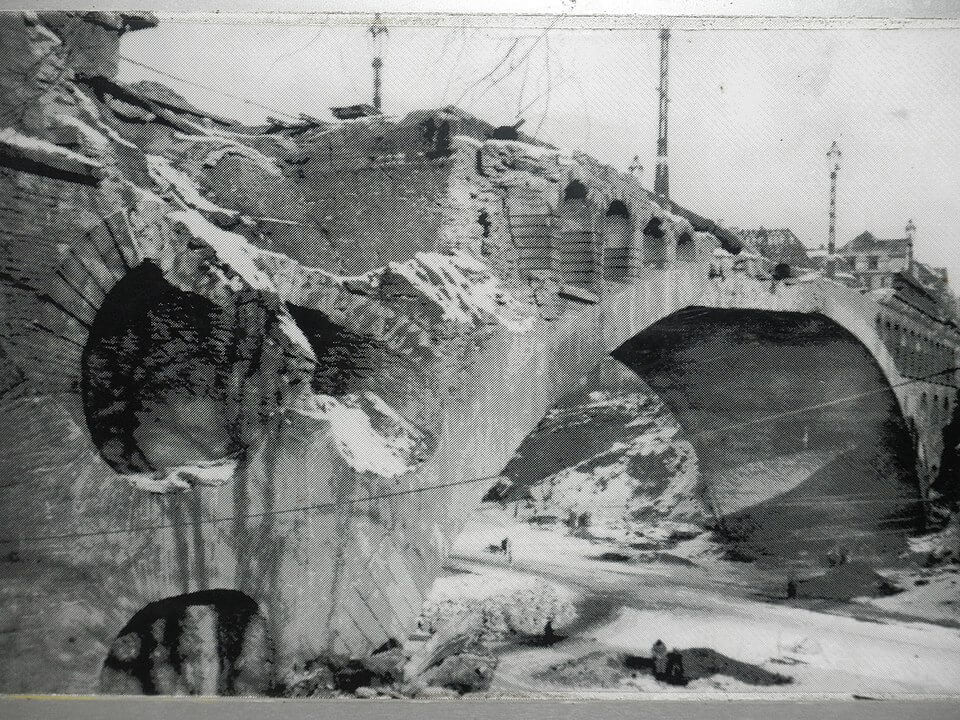

### Venona

Nasłuch Venomy przyczynił się do schwytania atomowego szpiega Klausa Fuchsa. Był to niemiecki fizyk i były członek KPD pracujący w Projekcie Manhattan. Dopóki go nie zidentyfikowano, miał nazwy kodowe CHARLES i REST.

Dzisiaj z Moskwy do Nowego Jorku dotarła wiadomość, że jego informacje mają "wielką wartość",

Został zidentyfikowany i schwytany w 1949. Rok później przyznał się do pracy dla sowieckiego wywiadu. Został skazany na 14 lat więzienia. W 1959 wypuszczony, wyemigrował do NRD, gdzie zaangażował się politycznie, wstąpił od SED, był nawet członkiem KC SED. Został także dyrektorem enerdowskiego ośrodka atomowego w Dreźnie - Helmholtz-Zentrum Dresden-Rossendorf, aż do przejścia na emeryturę w 1979. Zmarł w 1988, na rok przed upadkiem NRD.

<SeeAlso comment="Więcej na temat kryptologii powojennej we wpisie na blogu" txt="Enigma cz. 10 - Zimna Wojna" url="/blog/enigma-zimnawojna" />

### KL Hannover-Ahlem 

William J. Hagood Jr, lekarz z 335 pułku 84 DP amerykańskiej w liście do żony:
>You have to see it — and you are so stunned, you only say it was horrible. You can’t think of adjectives. We weren’t in the place two minutes before our eyes filled with tears. [...] 
>All the grisly scenes I’d witnessed in four years of combat paled as I viewed the higgedly-piggedly stack of cadavers.

- ["For Some Holocaust Survivors, Even Liberation Was Dehumanizing"](https://www.nytimes.com/2020/04/28/magazine/for-some-holocaust-survivors-even-liberation-was-dehumanizing.html)

### Messerschmitt Me 163 Komet

Napęd odrzutowy funkcjonuje na zasadzie spalania paliwa w komorze silnika. Produkty spalania są kierowane przez dysze w jedną stronę, dzięki czemu na zasadzie akcja - reakcja pojazd porusza się w przeciwną. Do spalania potrzebne są dwie rzeczy: paliwo oraz utleniacz. Ze względu na to, jak jest dostarczany utleniacz, silnik odrzutowy dzieli się na dwa rodzaje:

- silnik rakietowy - utleniacz jest dostarczany ze zbiornika
- silniki odrzutowe z dopływem powietrza, zazwyczaj określane po prostu silnikami odrzutowymi; jak sama nazwa wskazuje, utleniaczem jest tu powietrze atmmosferyczne kompresowane w turbinie przed komorą spalania.

Teraz staje się jasne, dlaczego samoloty nigdy nie polecą w kosmos. Po prostu powyżej pewnej wysokości atmosfera jest zbyt rzadka, by zapewnić dostateczną ilość utleniacza. Pewnym rozwiązaniem byłby samolot rakietowy, czyli dodanie zbiornika z utleniaczem. Ale tu wystarczy popatrzyć na rakiety kosmiczne, które w zasadzie są głównie zbiornikami paliwa, żeby zrozumieć, dlaczego nie mamy samolotów rakietowych. Tzn. prawie nie mamy.

Niemcy zbudowali w czasie wojny samolot rakietowy - Me 163 Komet. Był fenomenalną bronią z licznymi wadami. Oblatany został już 1 września 1941. Już wtedy przekroczył prędkość 1000 km/h. Ale z powodu awaryjności był to samolot równie niebezpieczny dla nieprzyjaciela, jak i pilota. Sama technologia rakietowa - ogromne zużycie paliwa i konieczność transportu utleniacza powodowała nieprzezwyciężalne ograniczenia. Czas lotu ok. 10 minut. Potem samolot stawał się bezbronnym, powolnym szybowcem.

<SeeAlso txt="Wunderwaffe" url="/festung-breslau/article/wunderwaffe" />

Alianci nie mieli jak walczyć z tymi samolotami, ale bardzo szybko opracowali prostą metodę jak ich unikać. Po prostu trasy bombowców omijały lotniska, na których bazowano te samoloty. Ze względu na ich niewielki zasięg nie było to trudne.

Prędkość była tak samo zaletą, jak i wadą, z taką różnicą prędkości celowanie było bardzo utrudnione. Próbowano zoptymalizować broń montując Sondergerät 500 Jägerfaust - było to 10 jednostrzałowych, bezodrzutowych dział z krótką lufą 50 mm skierowanych ku górze, uruchamiała je fotokomórka. Zasada była prosta: Komet wlatuje pod bombowiec, fotokomórka automatycznie odpala działa. Znany jest tylko jeden przypadek zastosowania tej broni. Właśnie dziś zniszczyła brytyjskiego Lancastera.

- [Mark Felton Productions "Mustang vs. Komet - Germany 1944" [YT 5:30]](https://www.youtube.com/watch?v=bNw3a_07OjI)

### Me 262

Dramatyczny pojedynek eskadry P-51 Mustang z osłony 8th Air Force i 2 Me 262 z III./JG 7. Amerykanie strącili jednego Messerschmitta, pilot drugiego Walter Hagenah zaatakował nieprzyjacielską eskadrę frontalnie rakietami R4M i zestrzelił jednego Mustanga po czym udało mu sie uciec na bezpieczne lotnisko.

- [Walter Hagenah](https://www.luftwaffe.cz/hagenah.html)
- Yarnhub ["When Me-262s Battled Mustangs Over Germany" [YT 6:11]](https://www.youtube.com/watch?v=ZsjMBMv0w0g)
- Soto Cinematics ["Walter Hagenah's R4M rocket attack on six P-51 Mustangs - 10th April 1945" [YT 7:33]](https://www.youtube.com/watch?v=OpuuDZXNi10)

### Lugo

- [B-24 Liberator "STEVENOVICH II" of the 779th Bombardment Squadron flips over and explodes after its port wing was hit by flak over #Lugo, Italy, on April 10, 1945.](https://www.facebook.com/WW2Facts/photos/a.134148893394160/2417130518429308)

### Bombardowanie Plauen

Bomber Command RAF przeprowadziło nocne bombardowanie Plauen (Saksonia). 304 Avro Lancaster i sześć Mosquito zrzuciło ponad tysiąc ton bomb. Atak był kierowany przez 8 wyposażonych w radary Handley Page Halifax.

Załogi bombowców w drodze powrotnej widziały pożary miasta z odległości 150 km. Celem RAF było usunięcie miasta z mapy. Zniszczono ponad 150 ha, czyli połowę obszaru miejskiego. Zginęło 900 ludzi.

- [Oboe (navigation)](https://en.wikipedia.org/wiki/Oboe_(navigation))
- [Luftangriffe auf Plauen](https://de.wikipedia.org/wiki/Luftangriffe_auf_Plauen)

<BoxImageWrapper>

Plauen, zbombardowany Most Pokoju (niem. Friedensbrücke) 1945. 
By [Wikswat(https://commons.wikimedia.org/w/index.php?title=User:Wikswat&amp;action=edit&amp;redlink=1) - Praca własna, [CC BY 3.0](https://creativecommons.org/licenses/by/3.0), [Link](https://commons.wikimedia.org/w/index.php?curid=45535663)
</BoxImageWrapper>

### Wrocław

We Wrocławiu, jak piszą Jonca i Konieczny w "Upadek Festung Breslau..." trwała podziemna walka saperów o dostęp do kanałów:
>Niemiecki podsłuch uchwycił meldunek radiowy wskazujący na zainteresowanie wojsk radzieckich jednym z kanałów. Z opisu rozmiarów kanału i jego położenia pod powierzchnią Niemcy wywnioskowali, że meldunek dotyczył skrzyżowania obszernego rurociągu z szosą wiodącą do Lipy Piotrowskiej. Okazało się mianowicie, że dwaj dezerterzy niemieccy zdradzili wejścia do niezalanych kanałów, ułatwiając żołnierzom radzieckim obejście zatopionych obszarów. W nocy z 10 na 11 kwietnia saperzy niemieccy, ostrzeżeni podchwyconym meldunkiem, przystąpili do sprawdzania kanałów. W kanale opisanym w meldunku wywiązała się wymiana ognia z napotkanym oddziałem szperaczy radzieckich, który niepostrzeżenie usiłował wejść na tyły niemieckiej linii obrony. Pod obstrzałem szperaczy Niemcy zamurowali wyjście z kanału. Chwilowo wprawdzie mur uniemożliwiał wdarcie się oddziału radzieckiego, jednakże w następnym dniu widoczne wyjście zbombardowały dwa samoloty radzieckie celnym zrzutem trzech bomb. Nie był to jedyny wypadek skutecznego zbombardowania zabezpieczonego wejścia do kanału. Wcześniej już samolot radziecki zniszczył celnym zrzutem zasuwy kanału deszczowego, świeżo założone przez saperów niemieckich w pobliżu szpitala Wszystkich Świętych (dz. im. Babińskiego). Również pod obstrzałem samolotów radzieckich pracowali saperzy niemieccy, zabezpieczając nocą włazy do kanałów ulicznych.

Majewski "Wrocław - godzina zero":
>10 kwietnia linia frontu przebiegała od zachodniego skraju Parku Dębowego do zbiegu dzisiejszych ulic Legnickiej i Małopanewskiej, skąd skręcała na wschód do nasypu poznańskiej linii kolejowej i przebiegała na zachód od stacji Wrocław Mikołajów, następnie zaś wzdłuż nasypu centralnej linii kolejowej oraz przez ogródki działkowe do dzisiejszej ulicy Stalowej.

Jak zobaczymy, w ciągu 2 tygodni ta linia całkowicie się ustabilizuje. W okresie od 25 kwietnia do kapitulacji brak jest jakichkolwiek postępów.

Ksiądz Walter Laßmann:
>O 12.30 Rosjanie wznawiają ciężkie bombardowania. Ich bombowce napływają całymi falami, jedna za drugą - i tak bez przerwy do godziny 18.00. Ze swoim strachem jestem w ciągu tych wszystkich godzin sam w piwnicy wypalonego domu przy pl. Katedralnym 6. Sklepienie przykrywa niemal dwumetrowa warstwa wciąż rozpalonego popiołu tak, że na dole jest nieznośne gorąco. Boję się podwójnie, nie tylko o siebie, ale i o bliskich w schronie na Katedralnej. 
>Około 22.00 wzywany jestem do szpitala pomocniczego przy pl. Katedralnym 14, aby zaopatrzyć w sakramenty radcę szkolnego dr. Nietzela. Podczas dzisiejszego nalotu odłamek bomby ugodził go w okolice nerek. Był do końca przytomny i okazywał wzorcowe oddanie się woli Bożej. Kiedy skończyłem swoje czynności, dr Franz przystąpił do operacji. Następnego dnia dr Netzel wyzionął jednak ducha. W nocy "maszyny do szycia" burzą systematycznie dom za domem. Tragedia zbombardowanych ludzi, poszukujących w mieście dachu nad głową powtarza się ciągle od nowa.
