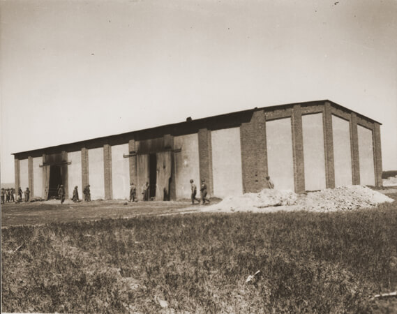

Trzynastego piątek.

### Masakra w Gardelegen

W upadającym imperium Hitlera, uprzemysłowiona, seryjnie zadawana śmierć miała własne centra przemysłowe. Postępy wojska aliantów zachodnich ujawniły światu koszmar Buchenwaldu, zajętego przez Amerykanów 11 kwietnia. Tego samego dnia alianci dotarli do obozu filialnego Mittelbau-Dora. W ten sam sposób, jak na wschodzie, SS podjęły próbę ewakuacji, transportu za wszelką cenę jak największej ilości więźniów na tyły. Nie jest do końca jasne, dlaczego po prostu ich nie poddali, rzucając wszystkie siły wojskowe i możliwości transportu na potrzeby frontu. System kierował się własną, upiorną logiką.

4 lutego na wieść o sforsowaniu Renu przez wojska amerykańskie komendantura obozu koncentracyjnego Mittelbau-Dora zarządziła ewakuację do innych położonych bardziej na wschód obozów takich jak Bergen-Belsen, Sachsenhausen, czy Neuengamme. Tysiące więźniów, wielu będących już na krawędzi śmierci, umieszczono w składach kolejowych. Nie dla wszystkich starczyło miejsca. Część więźniów pędzono w znanych już ze Śląska Marszach Śmierci. Kto nie mógł iść lub chociaż nadążyć za pochodem był zabijany na miejscu. Z powodu paniki wojennej, ataków lotniczych niszczących również składy kolejowe z transportowanymi więźniami i wieści o błyskawicznym zbliżaniu się aliantów zapanował chaos.

W miasteczku Gardelegen w Saksonii-Anhalt (40 km na północ od Magdeburga; obecnie 20-tysięczne miasto w Saksonii-Anhalt, odległe zaledwie 150 km od Berlina) więźniowie musieli opuścić wagony, bo tory na dalszych odcinkach były zniszczone przez alianckie lotnictwo. Było to w sumie ok. 3 tys. ludzi, z których część nie była w stanie przejść reszty drogi. Dowództwo SS przekonane, że wobec niewielkiej liczebności sił własnych i rosnącej liczby coraz bardziej więźniów nie zapanuje nad tą sytuacją, zaczęło werbować w szeregi pilnujących ludzi ze straży pożarnej, policji, Hitlerjugend i Volkssturmu, wśród których bez wątpienia było wielu tzw. dobrych Niemców.

13 kwietnia ta stworzona ad hoc formacja, raczej zbieranina ludzi w wielu mundurach, wielu w ogóle bez munduru, zapędziła 1016 więźniów, którym trudno było iść, do wielkiej stodoły stojącej na uboczu w pobliskiego majątku Isenschnibbe i podpaliła ją, oblewając benzyną. Prawie wszyscy zamknięci zginęli, część zdołała się wydostać, ale w większości zostali zabici podczas ucieczki.

Następnego dnia SS przybyło zatrzeć ślady zbrodni, ale pojmany amerykański oficer łącznikowy przekonał władze miasta, żeby poddać się natychmiast, bo zbliżają się czołgi.

Z ponad tysiąca ludzi ocalało 11: 7 Polaków, 3 Rosjan i 1 Francuz. Znaleziono zwłoki 1016 ludzi. Sprowadzono reporterów, wiadomości o masakrze zaczęły się ukazywać 19 kwietnia. Opowieści świadków i fotografie z Gardelegen zaczęły krążyć w zachodniej prasie, uświadamiając całemu światu, z kim walczą alianci. 21 kwietnia dowódca amerykański zebrał 300 cywili w Gardelegen i nakazał im zebrać ciała i pochować każde w osobnym grobie. Wśród tych cywilów było wielu sprawców zbrodni.

Dowódca transportu SS-Untersturmführer Erhard Brauny został skazany w 1947 przez amerykański sad wojskowy na dożywocie, zmarł w więzieniu w 1950. Nie dożył amnestii w 1952, która prawdopodobnie ofiarowałaby mu wolność. Nikt poza nim nie został ukarany. Zbrodnia w Gardelegen po wieloma względami przypomina cztery dni wcześniejszą masakrę w Celle (["9 kwietnia, poniedziałek. "Pozostań przy życiu!""](/festung-breslau/blog/04-09)).

Miejsce zbrodni jest cmentarzem i miejscem pamięci - [Gedenkstätte Feldscheune Isenschnibbe Gardelegen](https://gedenkstaette-gardelegen.sachsen-anhalt.de).

<BoxImageWrapper>

Stodoła w majątku Isenschnibbe k Gardelegen 
By U.S. Army photograper. - [http://www.jewishvirtuallibrary.org/jsource/images/Holocaust/gard3.jpg](http://www.jewishvirtuallibrary.org/jsource/images/Holocaust/gard3.jpg), Domena publiczna, [Link](https://commons.wikimedia.org/w/index.php?curid=10546954)
</BoxImageWrapper>

### Magdeburg

- [This photo was taken by Major Clarence L. Benjamin. It was Friday, April 13, 1945. A few miles northwest of Magdeburg, near the Elbe River, a railway passed through a forest. Major Clarence L. Benjamin was leading a small operation group of two light tanks on a jeep which carried out a routine patrol.](https://www.facebook.com/RememberTheHeroes.org.uk/posts/855586742506621)

### Léo Major

Odnotowuję ten przypadek, bo jest on interesujący, ale na samym początku trzeba zaznaczyć, że nic tu nie jest pewne i wersji wydarzeń jest więcej niż miałoby sens wymieniać - co właśnie jest najbardziej interesujące.

Pewne jest to, że Léo Major był frankofonem, kanadyjskim sierżantem i podczas starcia w Normandii stracił oko. Pozostał jednak z służbie i pełnił funkcję snajpera, zwiadowcy.

Podczas bitwo o Scheldt (Zelandia, Dania) wziął do niewoli 93 żołnierzy niemieckich, samodzielnie. Otrzymał za to Medal Wybitnego Zachowania (ang. Distinguished Conduct Medal), tzn. miał otrzymać, ale odmówił bo odznaczyć go miał marszałek Montgomery, więc Léo odmówił przyjęcia odznaczenia, stwierdzając, że Monty jest niekompetentny i nie powinien dawać medali. Odmówił przyjęcia ważnego odznaczenia i obraził głównodowodzącego? No właśnie, a czy w ogóle jest prawdą, że wziął do niewoli i to samodzielnie 93 żołnierzy niemieckich?

Jeszcze dziwniej przestawia się sprawa zwiadu ba! zdobycia miasta Zwolle (Holandia). Na zwiad wybrał się na ochotnika razem z przyjacielem. Przyjaciel na samym początku zginął. Co potem się wydarzyło - to już sobie można wybrać rozmaite wersje od tego, że zniszczył posterunek niemiecki i porwał samochód i w samym środku nocy jeżdżąc po mieście i rozrzucając granaty symulował walki do tego stopnia, że wojska niemieckie w panice opuściły miasto, przez to że we współpracy z miejscowym ruchem oporu wynegocjował opuszczenie miasta przez okupanta aż po taką, wersję wydarzeń, że zastał miasto opuszczone przez Niemców i rano zorganizował spotkanie nowych władz w ratuszu.

Tak, że ten.

- [Léo Major](https://en.wikipedia.org/wiki/L%C3%A9o_Major)
- Dark Docs ["The One Eyed Sniper Who Liberated an Entire City By Himself" [YT 10:21]](https://www.youtube.com/watch?v=Dn7LAvHPtiM)

### Neumünster

Miasto w Schleswig-Holstein. Obecnie mieszka tam 80 tys. ludzi.

Po powstaniu Wehrmachtu zbudowano tam lotnisko i zakłady lotnicze Luftwaffe. Zbombardowane po raz pierwszy w 1941, do 25 kwietnia było bombardowane jeszcze 7 razy.

Najcięższe bombardowanie nastąpiło 13 kwietnia 1945. Brały w nim udział samoloty B-17 Flying Fortresses z 398th Bombardment Group. W rezultacie bombardowań miasto zostało zniszczone w 20 do 30%.

3 maja zostało zajęte przez Amerykanów bez walki.

### Operacja wiedeńska

Tego dnia przeprowadzona przez Armię Czerwoną i wojsko bułgarskie operacja wiedeńska, po jedenastu dniach zakończyła się zajęciem Wiednia. Taki był właściwy koniec pierwszego podboju Hitlera.

### Egzekucje w Stein an der Donau

W Stein an der Donau (Dolna Austria, 40 km na północny zachód od Wiednia) w więzieniu Gestapo zamordowało dziś dwóch agentów wywiadu AK działających w Wiedniu:

- Karol English doktor prawa i znany taternik (w latach 1896-1903 jako pierwszy zdobył ponad 30 szczytów i grani tatrzańskich), w 1919 rzeczoznawca przy polskim komitecie na konferencji paryskiej, od 1920 mieszkał w Wiedniu i działał na rzecz polskiego wywiadu, także podczas wojny.
- Jan Mrózek od sierpnia 1942 szef grupy wywiadu dalekiego zasięgu ("Stragan") WO-1 Południe, w której działało ponad 200 agentów.

Obaj zostali aresztowani w marcu 1943, zabito ich w przeddzień wkroczenia Armii Czerwonej.

### UPA, UB

Ktoś mógłby pomyśleć, że po pięciu i pół latach wojny, kiedy sytuacja na obu europejskich frontach jednoznacznie od wielu miesięcy wskazuje na rychły koniec wojny i oczywisty już w tym momencie rezultat, udręczeni cierpieniami ludzie z nadzieją będą wypatrywać pokoju, normalnego życia. Tak właśnie powinno być. Ale wielka polityka i wielka nienawiść zatruły Europę trwale i na długo.

Wczoraj we wsi Rakowa, odległej o 15 km od obecnej wschodniej granicy, 100-osobowy oddział UPA zamordował 13 Polaków i 3 Ukraińców. A dziś w nocy (z 12 na 13 kwietnia) grupa operacyjna powiatowego UB w Siedlcach zamordowała 16 ludzi, których podejrzewała o działalność w AK i NSZ.

### Unia Hrubieszów

Powstaje klub sportowy Unia Hrubieszów.

### Wojsko Polskie

[Nad Odrą, 13 kwietnia 1945 roku.](https://www.facebook.com/permalink.php?story_fbid=2899512306985938&id=2353805098223331)
Włodzimierz Muś - zastępca dowódcy 1 Samodzielnego Pułku Moździerzy. 
>Słup był już dawno przygotowany. Jeszcze w lutym, gdy dostaliśmy wiadomość, że polski 6 samodzielny batalion pontonowo - mostowy wyszedł nad Odrę i wbił tam słup graniczny, zaproponowałem chłopcom z plutonu parkowego, by wykonali słup. Wydawało mi się wówczas że i my prędko tam dojdziemy. Żołnierze wybrali solidny dębowy pień, cieśla elegancko go obciosał, podporucznik Goldberg wymalował zgrabnego orła oraz napis : Rzeczpospolita Polska. Załadowano słup na studebakera z nadzieją w sercu, że niedługo będziemy go wbijać. Niestety, trzeba było na ten moment czekać dwa miesiące, wożąc uporczywie ze sobą ciężką belkę.[...] 
>Wzięli chłopcy na plecy ciężki słup, znieśli ze skarpy na sam brzeg rozlanej rzeki i tu na łące wkopali go głęboko. U dołu przybito tabliczkę z napisem "Wbili moździerzowcy majora Popowicza". Przy słupie wystawiono wartę honorową. [...] 
>Teraz plutonowy Babiuch w imieniu żołnierzy pułku złożył przyrzeczenie, że "granic naszego państwa strzec będziemy wiernie, nie żałując, gdy zajdzie potrzeba, krwi ani życia.  
>Czas było odchodzić, ale żołnierze zaintonowali "Jeszcze Polska nie zginęła". 
>Stałem wyprężony przed grupą, salutując. Wtem rozerwał się pocisk w odległości jakiś stu metrów. Na szczęście następne też były niecelne.

### Grupa Drobnera

Do Wrocławia dociera dziś grupa rekonesansowa dra Drobnera.

Wyjechali z Krakowa i przez Katowice i Opole dojechali do przedmieść Wrocławia. Po przedstawieniu dokumentów zostali wpuszczeni do miasta, tam odbyli rozmowę z pułkownikiem Liapunowem wyznaczonym przez generała Głuzdowskiego na komendanta wojskowego miasta. Ustalono, że obecna sytuacja jest beznadziejna, dotarli do pl. Powstańców Śląskich i po ujrzeniu ogromu zniszczeń odjechali z powrotem do Krakowa.

Dopiero wtedy zaczęła się właściwa praca nad zorganizowaniem wrocławskiej grupy inicjatywnej.

<SeeAlso txt="Grupa inicjatywna Drobnera" url="/festung-breslau/article/grupa-drobnera" />

### Twierdza

Stanisława Marciniak, robotnica przymusowa z Zawiercia, we Wrocławiu do 1942 zanotowała tego dnia w pamiętniku:
>Rano przyszło wezwanie dla mnie i dla ekspedientek, do lekarza wojskowego. Ze zdenerwowania nie mogłam utrzymać się na nogach. Wieczorem byłam u Basi, widziałam się z jej bratem Zygmuntem. Wróciłam o 21. W nocy znów miałam wartę przeciwpożarową. Słyszałam mowę Rosjan przez megafon. Za daleka była odległość by zrozumieć słowa. 
>Byłam rozczarowana, bo wszyscy przepowiadali koniec wojny w ten piątek, a walka trwa nada. W południe była Kasia Sobczak, znów nadleciały samoloty, szybko zleciałyśmy w dół.

Dokładnie w tym samym dniu, kiedy w mieście po raz pierwszy pojawiają się przedstawiciele nowych, polskich władz władze hitlerowskie osiągają nowy poziom szaleństwa. Jak pisze przebywający na Karłowicach w roli frontowego artysty Hugo Hartung:
>Dzisiejszego wieczora w auli seminarium odbywa się szczególna uroczystość. Pułkownik wręcza odznaczenia Żelazne Krzyże i Wojenne Krzyże Zasługi. Potem znowu śpiewa nasz tenor, czyli gefrajter K., ja zaś muszę recytować poezję Schillera, Goethego, Eichendorffa, i Pontatego. Pod koniec ma jednak miejsce upiorna ceremonia: młode kobiety i dziewczęta zostają zaprzysiężone w charakterze frontowych pomocnic. Muszą składać typową przysięgę żołnierską i podobno mają obsługiwać działa na froncie północnym. Pod murami seminarium widziałem po południu chłopców w stalowych hełmach. Mieli około trzynastu-piętnastu lat i stanowili załogę stanowiska obrony przeciwlotniczej... W nocy jeszcze raz wychodzę na zewnątrz. Stoi tam grupa oficerów. Jeden z nich opowiada, że był u generała Niehoffa, komendanta twierdzy i ten nadal wierzy w odsiecz. Feldmarszałek Schörner obiecał podobno, że wydobędzie nas z kleszczy oblężenia "nawet gdyby musiał przyjść do Wrocławia na piechotę". W ogrodzie seminarium śpiewa słowik.

### Świdnica

Niemieckie transporty w Żarowie (niem. Saarau) w raportach zwiadu sowieckiego.

- ["Tajemniczy transport pod koniec wojny"](http://historia-swidnica.pl/tajemniczy-transport-pod-koniec-ii-wojny-swiatowej/)
