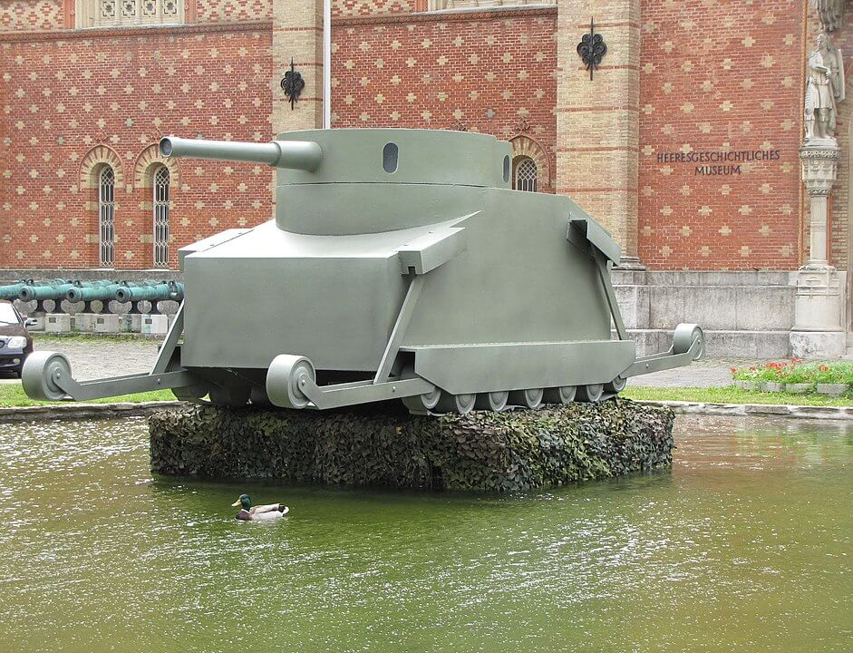

### Łaba

Amerykanie dotarli do Łaby, są 100 km od Berlina i nie robią żadnych postępów na wschód. Dlaczego?

Czasem epokę da się opisać życiem jednego człowieka, wojnę aliantów zachodnich w Niemczech opisuje ścieżka bojowa amerykańskiej 83 Dywizji Piechoty. Istniała krótko w latach 1917-18, sformowana na potrzeby Wielkiej Wojny, ale nie weszła do boju w całości i została rozformowana. Powołana na nowo w 1942, w tym samym celu, do Europy została wysłana 16 kwietnia 1944 i 18 czerwca wysadzona na plaży Omaha. Nosiła przydomek Ohio, a później znana była jako Piorun (Thunderbolt) i to nie bez powodu. W pierwszej połowie kwietnia w przeciągu zaledwie 13 dni pokonała odległość 450 km (co daje średnią 34 km dziennie) i była to właśnie ta wymarzona autostrada do Berlina. Co więcej, zakończona szczęśliwym finałem, bo 13 kwietnia dotarli do miasteczka Barby rozłożonego na lewym brzegu Łaby, dokładnie 96 km w linii prostej od granic Berlina.

Kiedy wdarli się do miasteczka (obecnie 9 tys. mieszkańców), okazało się że jedyny most został wysadzony. Na czym zatem polegał ów szczęśliwy finał? Amerykanie zbliżając się do linii Łaby liczyli na szczęśliwy traf, cud, taki sam jak w Remagen, gdzie w ich ręce wpadł zdatny do użytku most. Tym razem jednak szczęście oznaczało co innego. Po pierwsze zaczęli się przeprawiać przez Łabę natychmiast, nie czekając na rozkaz ze sztabu dywizji, po drugie Wehrmacht nie stawił na tym odcinku żadnego oporu. Nie tylko przeprawili kilka batalionów bez jednego strzału, ale wieczorem tego dnia udało im się zbudować most. Umieścili na nim tablicę "Truman Bridge - Gateway to Berlin over the Elbe, Courtesy 83rd Thunderbolt Dvision."

Napis ten wyrażał ducha bojowego Dywizji, samodzielność i korzystanie ze wszelkich sposobności. Słynęli z tego, że będąc jak najdalej od ducha regulaminowej ortodoksji, przystosowywali wszystkie napotkane pojazdy i środki walki do własnych potrzeb. W czasach pokoju bywa to nazywane grabieżą. Na wojnie ta grabież pozwalała wozić żołnierzy pojazdami wroga z pospiesznie namalowanymi białymi gwiazdami, dzięki czemu uzyskali najwyższy wskaźnik mobilności oraz drugi bojowy przydomek "Zwariowany Cyrk" (ang. Rag-tag Circus). Posiadali nawet Messerschmitta Bf 109 i znaleźli szaleńca, który nim latał, oczywiście po przemalowaniu i umieszczeniu na spodzie napisu "83d Div". Ich wygląd był tak mylący, że zdarzyło się, iż wzięli do niewoli mijający ich kolumnę niemiecki samochód sztabowy pełen oficerów, którzy dopóki nie zostali ostrzelani, sądzili że to niemieckie wojsko. Byli trochę jak startrekowy Borg, asymilujący każdą napotkaną technologię.

Następnego dnia do przeprawy dotarła 2 Dywizja Pancerna, która przedtem usiłowała bez powodzenia pokonać Łabę w innym miejscu. Do tego czasu 83 DP zbudowała drugi most i nie tylko osiągnęła stabilny przyczółek, ciągle nie napotykając oporu, ale nie czekając na rozkazy, ruszyła w stronę Berlina. 15 kwietnia patrole dywizji dotarły do Zerbst (Saksonia Anhalt). Do granic Berlina mieli tylko 87 km, do bunkra Hitlera 107 km.

Rankiem 15 kwietnia generał Simpson dowódca amerykańskiej 9 Armii, w skład której wchodziły obie powyższe dywizje, otrzymał od dowódcy sił amerykańskich generała Bradleya rozkaz stawienia się w kwaterze głównej 12 Grupy Armii w Wiesbaden. Bradley czekał na niego na lotnisku, żeby nie przedłużać formalności, przekazał mu od razu wiadomość, że mają się zatrzymać na Łabie. Zapadła cisza. "*Where in the hell did you get this?*" zapytał Simpson. "*From Ike*". Nie było odwołania.

Oznaczało to praktyczny koniec wojny na tym odcinku i poddanie walki o Berlin. Żeby zrozumieć, dlaczego Eisenhower tak postąpił, trzeba się cofnąć do 13 kwietnia, dzień po śmierci Roosevelta, kiedy to "Zwariowany Cyrk" zameldował o utworzeniu przyczółku na prawym brzegu Łaby. Generał Simpson zameldował o tym Bradleyowi, a Bradley natychmiast zadzwonił do Eisenhowera. Ten wysłuchał go uważnie i zapytał "*Brad, ile twoim zdaniem będzie nas kosztowało przełamanie przez Łabę i wzięcie Berlina?*", Bradley, który z pewnością myślał o tym często, odrzekł "*Oceniam, że mogłoby to nas kosztować sto tysięcy żołnierzy*" (chodziło o łączną liczbę zabitych i rannych). Eisenhower powiedział "*Byłaby to zbyt wysoka cena do zapłacenia za prestiżowy cel, zwłaszcza że wiemy, iż i tak przyjdzie nam wycofać się i ustąpić miejsca komu innemu*". Obaj znali postanowienia koalicji antyhitlerowskiej - Berlin był w sowieckiej strefie okupacyjnej. Ale żaden z nich nie wiedział, że już za trzy dni sowieci uderzą, że atak amerykański na pewno nie zakończyłby się takimi stratami, bo pełniłby tylko zadanie pomocnicze, a rozpraszając siły obrony Berlina, mógł znacznie skrócić wojnę. Generał Bradley czekał dwa dni, zanim przekazał rozkaz Eisenhowera swoim ludziom. Zrobił to na dzień przed sowiecką ofensywą. Co by się stało, gdyby czekał dzień dłużej?

- Mark Felton Productions ["Capture Berlin! The Secret 1945 US Mission" [YT 8:03]](https://www.youtube.com/watch?v=aONsLeFaaLk)

### Altenburg

Do miasta wkroczyli Amerykanie. Zdobyli je bez walki dzięki temu, że miejscowi komuniści pod przywództwem Waltera Fröhlicha zorganizowali przejęcie władzy.

1 lipca 1945 Altenburg (Turyngia) został przejęty przez sowietów. Fröhlich został pierwszym powojennym burmistrzem.

### Berlin

Jutro atak na Berlin!

<SeeAlso txt="Berlin do 1945" url="/festung-breslau/article/berlin-opis" />

### Staßfurt

13 września 1943 powstała filia KL Buchenwald: Staßfurt I / Neustaßfurt (Saksonia-Anhalt). Około pół tysiąca więźniów głównie z Francji i Polski pracowało tam w podziemnych zakładach Ernst Heinkel AG. Większość z nich zginęła.

11 kwietnia wciąż żyjący więźniowie uformowani w kolumnę zostali odesłani w marszu śmierci. W drugiej połowie kwietnia Staßfurt został zajęty przez Amerykanów. Szybko okazało się, że jest tam prawdziwy skarb. Bezcennych 1100 ton rudy uranowej i tlenku uranu. Przed agentami Alsos stanęło poważne wyzwanie. Ponieważ miasto znajdowało się w przyszłej sowieckiej strefie okupacyjnej, musieli za wszelką cenę wywieźć wszystko, i to w warunkach frontowych. Ciężarówka była na wagę złota. Zajęło im to całe 10 dni, potrzebowali 260 ładunków, ale się udało. Sowieci zostali z niczym.

Bomba atomowa, która 6 sierpnia została zrzucona na Hiroszimę, zawierała 64 kg uranu. Podobno część tego uranu pochodziła ze Staßfurtu.

### Wons

- [After the liberation of Sneek in the Netherlands on April 15, 1945, Canadian troops of the 3rd Canadian Infantry Division advanced to the Afsluitdijk at Kornwerderzand.](https://www.facebook.com/joelstoppelsbftours/posts/3145060992429846)

### KL Bergen Belsen

W tych dniach doszło do znaczącej zmiany władz hitlerowskich wobec sprawy obozów koncentracyjnych i ewakuacji ich więźniów. Stało się oczywiste, że wszelkie próby ukrywania zbrodni, jej skali i metod zakończyły się niepowodzeniem.

27 stycznia Sowieci zajęli KL Auschwitz, gdzie wciąż znajdowały się tysiące więźniów. Wtedy świat dowiedział się po raz pierwszy z gazet o tym, co się kryje za drutami kolczastymi. Ale było to zbyt przerażające, by można uwierzyć. Niemniej jednak przynajmniej teoretycznie alianci zachodni zdawali sobie sprawę z tego, czym są obozy koncentracyjne. Dlatego po otrzymaniu prośby o pomoc amerykańska 3 Armia natychmiast ruszyła do obozu w Buchenwaldzie.

11 kwietnia Amerykanie na własne oczy zobaczyli obóz koncentracyjny i musieli w marszu opracować procedury pomocy dla tysięcy ludzi znajdujących się na krawędzi śmierci oraz zorganizować niezbędne zasoby, i to w sytuacji, kiedy kilkadziesiąt dywizji było zaangażowanych w walkę na froncie.

Głównodowodzący alianckim frontem zachodnim generał Dwight Eisenhower wysłał do kolejno zdobywanych obozów reporterów i filmowców. Normalną procedurą stało się angażowanie miejscowej, niemieckiej ludności do porządkowania obozów, kopania masowanych grobów i pochówku tysięcy ofiar. Ludzie ci mieszkali w pobliżu obozów koncentracyjnych, nierzadko utrzymując się z prac na ich rzecz, albo korzystając z pracy więźniów. Teraz stanęli twarzą w twarz z ofiarami koszmaru, o którym nie chcieli wiedzieć.

Wciąż, prawdopodobnie siłą rozpędu obowiązywała reguła, że wobec zbliżania się wojsk wroga obozy koncentracyjne są za wszelką cenę ewakuowane, a dowody zbrodni niszczone. Jednak z powodu chaosu wojny nie udało się tego zrobić.

- 6 kwietnia "Kremser Hasenjagd" zamordowano ponad pół tysiąca ludzi podczas likwidacji więzienia w Krems an der Donau
- 8 kwietnia zamordowano około 3 tysięcy ludzi podczas tzw "polowania na króliki" w Celle.
- 11 kwietnia spalono tysiąc więźniów w stodole w Gardelegen.

Tych zbrodni dokonały powołane doraźnie siły paramilitarne składające się ze straży pożarnej, policji, pospolitego ruszenia i zwykłych niezmobilizowanych obywateli. SS było tam obecne i odgrywało rolę organizacyjną, ale sprawcami byli tzw. zwyczajni Niemcy.

Himmler - twórca SS i systemu obozów koncentracyjnych i zagłady od dawna prowadził podwójną grę z aliantami, chcąc wynegocjować sobie i być może swoim współpracownikom bezpieczne życie po klęsce reżimu hitlerowskiego. Ponadto w ciągu tych dni władze hitlerowskie zrozumiały, że "die Kacke ist am Dampfen" i dalsze ukrywanie ludobójstwa niczemu nie służy, co więcej, być może da się wykorzystać te obozy i ciężar opieki nad więźniami do spowolnienia postępu sił alianckich.

15 kwietnia oddziały brytyjskie i kanadyjskie zajęły obóz koncentracyjny Bergen Belsen w Dolnej Saksonii, ale tym razem odbyło się to w porozumieniu z hitlerowcami, którzy wynegocjowali rozejm i strefę bezpieczeństwa wokół obozu.

Już 11 kwietnia Heinrich Himmler wydał rozkaz poddania obozu bez walki, zapewniając możliwość wycofania większości załogi SS. Otoczenie obozu było strzeżone przez oddziały węgierskie i Wehrmacht. Wewnątrz pozostała minimalna załoga SS z dowódcą obozu na czele. Warunki w obozie były tak fatalne, że już po wyzwoleniu średnia śmiertelność wynosiła 500 osób dziennie. Główną przyczyną śmierci był tyfus.

Brytyjczycy dotarli do obozu. Ich dowódca porucznik Derrick Sington podjechał jeepem pod bramę i przez megafon ogłosił wyzwolenie, Byli z nim reporterzy. Już wkrótce zdjęcia ofiar ukazały światu naturę hitlerowskiego reżimu.

Jeden z Brytyjczyków, student medycyny:
>Stałem przerażony wśród tego brudu i plugastwa, próbując przyzwyczaić się do smrodu, który był mieszaniną woni prosektorium, kanału ściekowego, potu i gnijącej ropy.

### Samobójstwo hitlerowca

Joachim Albrecht Eggeling gauleiter i nadprezydent Halle-Merseburg w obliczu niewykonalnego zadania obrony Hall (Saksonia-Anhalt), po tym jak nie udało mu się wycofać tego rozkazu, zastrzelił się w zamku Moritzburg w Halle. W NSDAP od 1925. W 1936 wstępuje do SS i rok później zostaje gauleiterem.

### Günther Burstyn

Na wieść o zdobyciu pobliskiego Wiednia samobójstwo popełnił Günther Burstyn, inżynier, wynalazca, oficer jeszcze z czasów CK Austrii. W 1911 opracował i opatentował pierwszy prawdziwy czołg - Motorgeschütz. Na podwoziu amerykańskiego ciągnika rolniczego opancerzony korpus i wieża z armatą. Projekt został odrzucony i nigdy nie powstał nawet prototyp. W 1945 miał już ciężką depresję, był prawie niewidomy a poważna choroba żony uniemożliwiała ucieczkę. Nie chciał dostać się do niewoli sowieckiej. Żona zmarła pięć dni później.

Podczas Wielkiej Wojny był inżynierem wojskowym w Eisenbahn- und Telegraphenregiment. Na pomysł pojazdu lądowego wpadł podczas rejsu szybkim torpedowcem. Podczas 6 Wystawy Motoryzacyjnej w Wiedniu, w 1906 zobaczył Austro-Daimler Panzerautomobil. Wadą tego pojazdu były małe koła. Wymyślił łańcuch płytowy Gleitbänder. Najwyraźniej nie znał traktora Holta z gąsienicami. Wieża obracała się tylko o 300 stopni, było w niej miejsce dla dwóch członków załogi. Trzeci członek załogi siedział z tyłu, dysponował trzema wizjerami. Ramiona były regulowane oddzielnie, mechanicznie, istniała też podobno możliwość ręcznego ustawienia. W 1911 uzyskał patent i wysłał projekt do Ministerstwa Wojny, które odpowiedziało, że zaakceptuje projekt jeśli Burstyn opłaci jego realizację. Co więcej szefem działu odpowiedzialnego za transport był podpułkownik Robert Wolf, który związany był z projektem Austro-Daimler Panzerautomobil. Więc tu nie było szansy realizacji. Skierował się ze swoim pomysłem do Niemców, został doceniony, ale na tym się skończyło.

*Rekonstrukcja czołgu "Motorgeschütz" Burstyna z 1911 
By selbst erstellt - Praca własna (Tekst oryginalny: „selbst erstellt”), Domena publiczna, [Link](https://commons.wikimedia.org/w/index.php?curid=29640600)*

### Arthur Hermann Florstedt

Również 15 kwietnia, jak się powszechnie przypuszcza, zabity został SS-Hauptsturmführer Arthur Hermann Florstedt.

Od listopada 1942 przez prawie rok komendant obozu koncentracyjnego na Majdanku. We wrześniu 1943 aresztowany i oskarżony o przywłaszczanie sobie mienia pomordowanych i nadużycie władzy. SS-mani byli wyłączeni spod jurysdykcji normalnych sądów. Sąd SS i Policji (w czasach narodowego socjalizmu była formacja połączona jednolitym dowództwem SS- und Polizeiführer; SSPF) skazał go na karę śmierci. Został osadzony w więzieniu w Weimarze.

Z powodu chaosu wojennego nie jest wcale pewne, czy wyrok rzeczywiście wykonano. Majdanek za czasów władzy Florstedta był zasadniczo obozem zagłady jak i wielkim składem dóbr zrabowanych ofiarom Holokaustu. Jego poprzednikiem, pierwszym komendantem obozu w Majdanku również skazanym za malwersacje był SS-Standartenführer Karl-Otto Koch, mąż Ilse Koch, słynnej "suki z Buchenwaldu" (Die Hexe von Buchenwald), Koch została z całą pewnością rozstrzelana w Buchenwaldzie przez SS 5 kwietnia, na tydzień przed wyzwoleniem obozu przez Amerykanów.

### Arnhem

15 kwietnia kończą się walki o wyzwolenie Arnhem, które było przedmiotem ryzykownego ataku wojsk spadochronowych podczas Operacji Market Garden. Ponieważ oddziały alianckie zbliżają się już do linii Łaby, sukces ten pozbawiony jest znaczenia strategicznego, zabezpiecza zaplecze frontu.

### UPA

Natomiast w Polsce tego dnia zaczyna się operacja UPA skierowana przeciwko posterunkom MO w powiatach przemyskim i sanockim.

### Brygada Świętokrzyska NSZ

Wróćmy na chwilę do sławnej-niesławnej Brygady Świętokrzyskiej Narodowych Sił Zbrojnych, która pod opieką łączników SS, kiedy przez całą Europę przewalała się wojna, od połowy marca przebywała w Rozstání (Czechy, kraj Ołomuniecki) na poligonie Wehrmachtu szkolona przez RSHA. Tydzień temu dokładnie, kiedy rozstrzelano Kocha, w dniach 5-6 kwietnia odbyła się w Monachium konferencja polsko-niemiecka w sprawie przyszłości jednostki. Niemcy chcieli ich rzucić na front, czemu dowództwo Brygady się sprzeciwiało.

Dziś SS i Luftwaffe wysłało za linię frontu patrol spadochronowy Brygady: oficer, łączniczka i 5 szeregowców.

Nie był to ani pierwszy ani ostatni oddział Brygady wysłany na rozkaz SS.

### "Przekrój"

W Krakowie ukazało się pierwsze wydanie tygodnika "Przekrój".

### Grupa Drobnera

W Krakowie grupa dra Bolesława Drobnera, mianowanego prezydenta Wrocławia, który dopiero co, dwa dni temu zobaczył to dymiące morze ruin, pracuje nad zebraniem przyszłych władz miasta.

To, co zobaczyli nie zachęcało do zbierania pionierów, tym bardziej w niezniszczonym wojną Krakowie, w którym właśnie tego dnia ukazał się pierwszy numer tygodnika "Przekrój". W trzecim już za dwa tygodnie pojawi się reportaż z ich wypadu.

<SeeAlso txt="Grupa inicjatywna Drobnera" url="/festung-breslau/article/grupa-drobnera" />

### Wrocław

Nadal trwają walki na wrocławskim froncie zachodnim. Linia frontu została ustalona na nasypie kolejowym i jeszcze wiele dramatycznych dni minie zanim sowieci zdołają ją trwale przekroczyć. To, że tego dokonają, jest oczywiste, siły niemieckie nieustannie słabną. Z sowieckimi czołgami i działami pancernymi obrońcy walczą głównie panzerfaustami.

Szczególną rolę w obronie tego odcinka pełnił Oddział Niszczycieli Czołgów dowodzony przez majora W. Rettera. Jego podstawową jednostką była 1. kompania pancerna dowodzona przez oberleutenanta Wenztke, która mimo dumnej nazwy składała się z przypadkowej zbieraniny 19 pojazdów pancernych, w tym 6 szturmowych dział samobieżnych StuG 40 Ausf G, 6 czołgów przeciwlotniczych Panzer II Ausf F, 4 lekkie haubice samobieżne Panzer II Wespe, dwa działa samobieżne piechoty (lub haubice szturmowe) i duma oddziału: dosłownie jeden niszczyciel czołgów Jagdpanzer IV/70 (A), skonstruowany na bazie czołgu Panzerkampfwagen IV.

Jak pośrednio (przez brak wyraźnej wzmianki o nich) przyznaje sam Ahlfen, garnizon nie posiadał prawdziwych czołgów, które mogły toczyć równą walkę z T-34, takich jak Pantera czy Tygrys. Pozostałe trzy kompanie Oddziału Niszczycieli Czołgów to była piechota wyposażona w broń przeciwpancerną - o wiele bardziej skuteczna w walce z czołgami wroga niż skromne siły pancerne. Nie wiadomo czemu żadnej roli nie odegrały w tej walce działa 88 mm Flak, być może brakowało już do nich amunicji i z tego powodu przeznaczone były tylko do walki z lotnictwem.

15 kwietnia do walki weszła dopiero co sprowadzona do Wrocławia 135 Dywizja Piechoty, zajęła odcinek frontu na obu stronach obecnej ulicy Legnickiej. Dzięki temu 74 Korpus mógł wznowić natarcie. Ale czas spektakularnych sukcesów zakończył się bezpowrotnie.

Obie strony były wyczerpane i znajdowały się u kresu sił. Od utraty lotniska na Gądowie jedyną drogą zaopatrzenia twierdzy były zrzuty, tak jednak niecelne, że częściej zasilały atakujących. Jak się ocenia, do obrońców trafiała 1/4 zrzucanych ładunków (w okresie od 1 do 14 kwietnia średnio dziennie zrzucano 45 ton). Uruchomiono wprawdzie nowe lotnisko na pl. Grunwaldzkim zbudowane z ogromnym poświęceniem, przede wszystkim wystawionych na pewną śmierć cywilów. W nocy z 6 na 7 kwietnia wylądowało tam kilka Junkersów, które w drodze powrotnej zdołały zabrać 52 rannych. W nocy z 9 na 10 kwietnia wylądowały dwa Ju-52 zabierając 22 rannych, dzień później wylądowały dwa duże i dwa małe szybowce transportowe. 6. Luftflotte meldowała kres zdolności transportowych, 14 kwietnia poinformowała Naczelne Dowództwo Luftwaffe, że posiada tylko 580 ton paliw, co pozwalało na realizację dostaw przez 4 dni. Z powodu panowania w powietrzu lotnictwa sowieckiego większość maszyn nie wracała.

Ernst Hornig - imperium hitlerowskie w gruzach, ale akta muszą się zgadzać. We Wrocławiu nadal działają biura ewidencyjne:
>Dnia 13 kwietnia do twierdzy dotarła wiadomość o śmierci prezydenta Roosevelta. Zmarł poprzedniego dnia. Okazało się, że przekazywanie informacji przez radio nadal funkcjonowało. Następnego dnia, 14 kwietnia, ponownie pojawiała się plotka o odsieczy Wrocławia, twierdzono nawet że akcja jest w trakcie realizacji. Kto wie, w jaki sposób powstała ta pogłoska? Jednakże Konrad Bũchsel, jak i pracownicy Bethanien, byli sceptyczni wobec tego typu niesprawdzonych pogłosek: "Należy je traktować z największą ostrożnością. Podobnie wyglądała reakcja członków Wehrmachtu i ludności cywilnej".

Dalej opisuje miasto pogrążone w chaosie, ruiny i wypalone domy nad którymi latają szukające celu samoloty.
> Jednakże Ortsgruppen pracowały jednak niestrudzenie nad "objęciem ewidencją" kwater przemieszczającej się nieustannie ludności cywilnej. Hermann Nowack, który odnalazł swojego syna, zanotował 14 kwietnia: "Syn odnaleziony. Tak, przez Ortsgruppe Carlowitz, gdzie go teraz zarejestrowano i przydzielono nową kwaterę przy Korsoallee [alei Jana Kasprowicza]. Zadziwiające, że to jeszcze funkcjonuje, że wszyscy, którzy nadal żyją, są objęci ewidencją. Ponieważ ludność cywilna z dnia na dzień była bardziej zagrożona utratą życia w pożarach i pod gruzami walących się domów, usiłowano przez przebijanie murów w piwnicach z jednego domu do drugiego oraz za pomocą innych środków zapobiec niebezpieczeństwu zasypania lub katastrof związanych z wybuchem pożaru. W dzienniku majstra Nowacka pod datą 15 kwietnia znajduje się następujący wpis na ten temat: "Po południu zebranie ludzi z trójkąta Sternstraße, Furstenstraße, aż do Furstenrucke i Hansastraße. Zostaje wprowadzona straż ogniowa, która ma meldować o pożarach, obserwować zawalające się domy, żebyśmy mogli razem odkopywać zasypanych.

Przypominamy sobie zapewne prowokację sowiecką - [2 marca, piątek. "wzniecić zamieszanie i wywołać rozkład moralny obrońców"](/festung-breslau/blog/03-02/), kiedy to na niemieckiej fali radiowej puszczono meldunek o zbliżaniu się odsieczy z wezwaniem by wszyscy wylegli na powitanie i pomogli przełamać resztki oporu wroga na tym odcinku. Prawdopodobnie jednak, na tym etapie walk ważniejszym powodem sceptycyzmu był już brak wiary w odsiecz, a nie obawa przed prowokacją. Zadziwia funkcjonowanie cywilnej administracji w tych warunkach. Czy dane ewidencyjne się zachowały? Wiadomo, że wojnę przetrwała dokładna ewidencja zabitych, karty osobowe każdego żołnierza, który poległ lub zaginął. Jednak zniknęła w czasach PRL-u.

Hartung:
>Tej niedzieli znienacka dopada mnie najciemniejsza depresja. Nagle tracę też wszelką nadzieję, że moja rodzina jeszcze żyje. Po nocnej warcie jestem dość zmęczony, a nowy nieoczekiwany atak skurczy napawa mnie strachem. 
>Szukam pokrzepienia w seminaryjnej kaplicy, nowoczesnym harmonijnym wnętrzu z niezniszczonymi barwnymi witrażami, gdzie wciąż jeszcze stoją dwie choinki i szopka. Katolicy i protestanci przychodzą tutaj, by pomodlić się w ciszy. Ledwie wyszedłem ze świątyni słyszę świst spadającego granatu. Pocisk nie eksploduje - niewypał! Przebił jednak rurę i wnet obfite strumienie wody zamieniają kaplice w mętne jezioro.

Prawem cywila jest nazywanie pocisku, który nie wybuchł czyli niewybuchu - niewypałem. Ale Hartung od 7 września jest w kamaszach. Powinien robić jakieś postępy w dziedzinie wojskowości. No chyba, że to błąd tłumacza.

### Odnośniki

- [Operation Teardrop](https://en.wikipedia.org/wiki/Operation_Teardrop)
- Mark Felton Productions ["Rocket U-Boats: V-1 Missile Attack New York 1945" [YT 15:47]](https://www.youtube.com/watch?v=wHUCV_EDOFI)
- Mark Felton Productions ["SS Women - Female Concentration Camp Guards" [YT 28:13]](https://www.youtube.com/watch?v=VnVCHheKt28)
