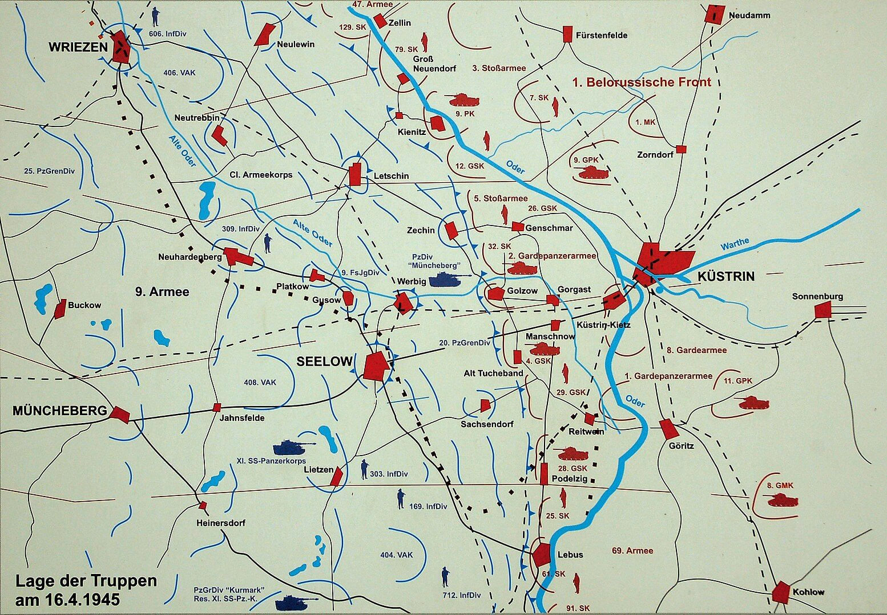

### Colditz

Najsłynniejszy wojskowy obóz jeniecki, Oflag IV-C, czyli zamek Colditz (Saksonia) po dwóch dniach walki o miasto został dziś wyzwolony przez 1 Armię amerykańską. Było to więzienie specjalne dla ważnych oficerów oraz dla tych, którzy sprawiali problemy, ciągle uciekając. Teoretycznie nie było możliwości, żeby stamtąd uciec. Ale ok. 30 ludziom ucieczka się udała.

Wśród więźniów, którzy tego dnia odzyskali wolność, był generał Tadeusz Bór Komorowski, odpowiedzialny za wybuch Powstania Warszawskiego.

Colditz jest pomiędzy Lipskiem a Dreznem, ok. 50 km na zachód od Drezna.

Sam zamek ma interesującą historię. Prawo do budowy zamku uzyskał w 1083 Wiprecht z Grójca (niem. Groitzsch) jeden z ostatnich margrabiów Miśni nienależących do dynastii Wettynów. Był lokalnym centrum władzy kraju Pleissenland, w którego stolicy ostatnie lata spędził książę Władysław Wygnaniec. W 1404 sprzedany za 15 tys. srebrnych marek Wettynom. Zaraz potem w 1430 spalony przez husytów i odbudowany dopiero w 1464 w obecnym stylu renesansowym. Znacznej rozbudowy - drugi dziedziniec - dokonał August II Mocny, to dzięki niemu miał w sumie 700 komnat i mógł stać się dużym obozem jenieckim. Od czasów napoleońskich służył głównie jako szpital.

### Karl Brandt

W latach 1932 doktor Karl Brandt wstąpił do NSDAP, SA i SS. W 1939 został mianowany przez Hitlera szefem Akcji T-4 polegającym na wymordowaniu wszystkich umysłowo i nieuleczalnie chorych. 

<SeeAlso comment="Teksty na stronę o Akcji T4" txt="github tdudkowski / t4" url="https://github.com/tdudkowski/t4" />

16 kwietnia został aresztowany przez Gestapo za wywiezienie rodziny z Berlina, żeby mogli poddać się Amerykanom. Został za to skazany na śmierć i wysłany do Kilonii. 2 maja zwolniony rozkazem Dönitza. Brytyjczycy go aresztowali 23 maja.

Osądzony w Norymberdze, w "procesie lekarzy" rozpoczętym 9 grudnia 1946. 9 sierpnia 1947 po raz kolejny skazany na śmierć. Wyrok wykonano przez powieszenie 2 czerwca 1948.

- TheUntoldPast ["The JUSTIFIED Execution Of Karl Brandt - Adolf Hitler's Doctor" [YT 11:36]](https://www.youtube.com/watch?v=qglZNIavOFE)

### MS Goya

Dziś czwarta z kolei wielka bałtycka katastrofa morska podczas operacji Hannibal - ewakuacji z Prus Wschodnich, MS Goya,

Transportowiec U-bootów, od 1943 okręt baza U-bootów. W 1945 włączony do Operacji Hannibal. Przewoził także żołnierzy, więc nie był statkiem szpitalnym. Już 4 godziny po wyjściu z portu u południowego cypla Mierzei Helskiej zbombardowany i uszkodzony przez sowieckie samoloty.

Wieczorem, już po zmroku został wykryty przez podwodny stawiacz min L-3, który był także uzbrojony w torpedy. Kilkanaście mil od Rozewia o 23:52 wystrzelił cztery torpedy, z których dwie dosięgły celu. Eksplozja śródokręcia przełamała statek, który zatonął w ciągu 4 minut. Informacje o ofiarach i uratowanych są niejasne. Jedno źródło mówi o 182 osobach uratowanych, z których 9 wkrótce zmarło (176 żołnierzy i 4 cywilów). Nie wiadomo, ilu było pasażerów nieujętych na liście, pewne jest tylko to, że liczba ofiar przekracza 6 tys. ludzi.

### Operacja Gertrud

- [zapis w dzienniku działań wojennych Sztabu Dowodzenia Luftwaffe, 16 kwietnia 1945

operacja "Gertrud", ktoś coś? bo lecieć mieli daleko, Ju 290 to Bliski Wschód, Ural?!? no i nie wyszło, bo samoloty wyszły

5 grupa dalekiego rozpoznania podlegała wówczas 200 pułkowi bombowemu](https://twitter.com/dwojkarz/status/1542472208269852673)

### Dirlewanger

16 kwietnia uderzyła w nich ofensywa. Następnego dnia Dirlewanger został ranny po raz dwunasty. To już był koniec tej niesławnej jednostki, której celem było spożytkowanie kryminalistów na potrzeby wojny. 28 kwietnia dowódca jednego z pułków, Ewald Ehlers, został powieszony przez własnych ludzi. Reszta jednostki została wybita 1 maja w bitwie pod Halbe.

Dirlewanger uciekł i został schwytany we Francji, Zginął w tajemniczych okolicznościach 8 czerwca 1945. Mówi się, że został pobity ze skutkiem śmiertelnym przez Polaków.

### Rudolf Höß

Rocznicowo: 16 kwietnia 1947 na terenie byłego obozu Auschwitz-Birkenau został powieszony jego były komendant Rudolf Höß.

### Jugosławia

Jugosłowiańscy partyzanci Tito rozpoczęli ostatnią ofensywę przeciwko wojskom niemieckim.

<SeeAlso txt="Jugosławia" url="/festung-breslau/article/jugoslawia" />

### Samobójstwa hitlerowców

Kolejny hitlerowiec się zabija: Ernst Bergmann.

W 1905 uzyskał tytuł doktora filologii na uniwersytecie w Lipsku, był filozofem hitlerowskim w Partii od 1930. Opracowywał antysemicką teologię Deutsche Christen. Po upadku Lipska zabił się. Jeszcze zanim został nazistą, miał żonę Żydówkę i miał z nią syna, który zginął na froncie zachodnim.

### Eenrum

- [Another amazing then and now photo taken in Eenrum (Netherlands) on April 16, 1945. The photo shows a Canadian vehicle packed with a partying crowd of civilians. Eenrum was liberated by the Royal Canadian Dragoons, who were advancing from Zoutkamp.](https://www.facebook.com/joelstoppelsbftours/posts/3144763335792945)

### Operacja berlińska

Ale bez wątpienia najważniejszym dziś wydarzeniem na świecie jest początek operacji berlińskiej.

Według pierwotnych założeń sowieckich miała się rozpocząć dużo wcześniej, na początku lutego i miała być po prostu drugą częścią operacji wiślańsko-odrzańskiej. Potem kiedy jednak okazało się, że hitlerowcy stawili większy opór, niż zakładano (albo inaczej mówiąc postęp okazał się zbyt kosztowny w ludziach i sprzęcie), ta druga część operacji Wisła - Odra została ograniczona w skali i ostatecznie została nazwana operacją odrzańską zakończoną w końcu lutego 1945.

Na odcinkach walki obu Frontów sowieckich zapanował spokój i przystąpiono do zabezpieczania zdobytych pozycji, umacniania zaplecza i odbudowywania sił. Straty w operacji wiślańsko-odrzańskiej były ogromne, w największym przybliżeniu można mówić o tym, że Armia Czerwona straciła połowę ludzi i połowę pojazdów. Zaplecze było słabe, przez Wisłę prowadziły tylko trzy wyreperowane i prowizoryczne mosty kolejowe. Na dodatek na terenach polskich rozstaw torów był inny (często te kluczowe linie przekuwano na rozmiar rosyjski), węzły komunikacyjne zrujnowane, Warszawa i Poznań obrócone w gruzy. Sowieci byli rozciągnięci na prawie całym granicznym biegu Odry (mowa o obecnych granicach) i Nysy Łużyckiej. Berlin - zdawałoby się - był na wyciągnięcie ręki. Kwadrans lotu samolotem, dwie godziny jazdy kolumny pancernej, dwa do trzech dni marszu piechoty. Co więcej, jak się później okazało, nic go nie broniło. Nie było żadnych fortyfikacji, garnizonu, planów obrony. A w samym centrum Berlina na tyłach nowego gmachu Kancelarii Rzeszy dwa bunkry, w jednym z nich z garstką ludzi Adolf Hitler.

Niestety obie armie były wykrwawione. Tak jak Niemcy nie byli w stanie obronić Berlina, sowieci nie byli w stanie go zaatakować. Ofensywę odkładano na okolice maja. Wydarzenia dość nieoczekiwanie przyspieszyła depesza Eisenhowera i w pierwszych dniach kwietnia obaj marszałkowie Żukow i Koniew dostali bezwzględny rozkaz Stalina - zaatakować NATYCHMIAST!

<SeeAlso txt="Depesza Eisenhowera (SCAF 252)" url="/festung-breslau/article/depesza-eisenhowera" />

Dzień rozpoczęcia ofensywy wyznaczono na 16 kwietnia. Od 24 lutego (koniec operacji odrzańskiej) do dziś minęło 52 dni. Niemcy również nie zmarnowali tego czasu. Przede wszystkim udało się usunąć Himmlera z pozycji głównodowodzącego GA Wisła. Jego miejsce 20 marca zajmuje generał Gotthard Heinrici, doświadczony sztabowiec i oficer frontowy, pozbawiony złudzeń i mający poważanie wśród kadry oficerskiej. Żukow ma niebezpiecznego przeciwnika.

Główny ciężar ofensywy wypadł na 1 Front Białoruski na odcinku brandenburskim i 1 Front Ukraiński na odcinku saksońskim, rolę pomocniczą pełnił również 2 Front Białoruski. W sumie 2.5 mln ludzi (w tym prawie 200 tys. Wojsko Polskie: 1 i 2 Armia), ponad 6 tys. pojazdów pancernych i ponad 7 tys. samolotów.

Armia Czerwona miała absolutne panowanie w powietrzu, i to nie dzięki liczbie samolotów, a z powodu braku zaopatrzenia Luftwaffe w paliwo. Zadania Luftwaffe były od 17 stycznia ograniczone do zwiadu, niszczenia czołgów i nocnego transportu. Również, jeżeli chodzi o siły pancerne, Niemcy posiadali już tylko to, co dało się wyremontować i rzucić na front. Coraz częściej porzucali pojazdy z powodu braku paliwa.

Pomimo ogromnych strat mieli jeszcze sporą armię. Rozproszoną na ogromnym obszarze w daremnej nadziei odzyskania przewagi. Ponad 300 tys. garnizon w Norwegii, który w spokoju doczekał końca wojny, ponad milion żołnierzy nieewakuowanych z Prus Wschodnich, ogromna armia w północnej Italii i Danii. Elitarne oddziały pancerne zostały zmarnowane w daremnych bojach o Budapeszt. Na najważniejszym odcinku frontu GA Wisła zaś pozostały niewielkie siły często ograbiane z najlepszych oddziałów a na ich czele Hitler osobistym rozkazem postawił niekompetentnego szaleńca - Himmlera. Bo mu ufał. Dopiero 20 marca udało się strącić tego hitlerowskiego faworyta i zastąpił go generał Gotthard Heinrici.

W niecały miesiąc Heinrici zrobił, co mógł. Przygotował się do nieuniknionego ataku. Zdecydowanie odmówił jakichkolwiek prób obrony samego Berlina. Stolicę uważał za obiekt niewojskowy, który ma być broniony za wszelką cenę, ale tylko na przedpolu. Do dyspozycji miał ponad 700 tys. żołnierzy, ok półtora tysiąca pojazdów pancernych, ponad dwa tysiące samolotów i prawie 10 tys. luf artylerii (sowieci ponad 40 tys.).

Dzisiaj przed świtem oba Fronty ruszyły od ataku, zaczęło się od przygotowania artyleryjskiego, wysunięte na przód elitarne gwardyjskie armie pancerne zaatakowały masą czołgów. Pierwsza linia, często wypełniona Volkssturmem nie stawiła żadnego oporu.

### 1 Front Białoruski

Marszałek Żukow dowodzący 1 Frontem Białoruskim do oślepienia wroga użył 133 reflektorów przeciwlotniczych, przyniosło to pożałowania godny efekt, bo reflektory wskazywały nacierające czołgi. Na czele ataku znajdowała się osławiona 8 Gwardyjska Armia generała Wasilija Czujkowa, bohatera ze Stalingradu, twórcy stalingradzkiej szkoły walki. Wspomagały ją 3 i 5 Armie Uderzeniowe oraz 69 Armia ogólnowojskowa.

Dla Żukowa ten dzień był katastrofą. Heinrici znający dobrze taktykę sowiecką wprowadził w życie plan von Xylandera opracowany jeszcze w 1944 dla obrony na linii Wisły, tzw operacja Schlittenfahrt (jazda na saniach - o której mowa była [12 stycznia, piątek. "W tym piekle pełnym ognia, dymu i ciemności"](/festung-breslau/blog/01-12/)) - czyli wyczekania do ostatniej chwili i w momencie sowieckiego ataku wycofania się na drugą przygotowaną linię obrony, w ten sposób gigantyczna siła ognia i pierwsze uderzenie trafi w pustkę, a nacierające oddziały natrafia na dobrze przygotowaną, kompletnie nierozpoznaną obronę. Tak też się stało. Początkowo atakujące armie raportowały postępy, ale potem na przedpolach wzgórz Seelow napotkały dobrze zorganizowany, zaciekły opór. Siły atakujących topniały, Żukow rzucił do walki trzymane w odwodzie ataku oddziały 1 i 2 Armii Pancernej Gwardii.

Dopiero wieczorem zameldowano o pewnych sukcesach (8 kilometrów zdobytego terenu), ale cała niemiecka linia obrony była nieruszona. Na koniec tego fatalnego dnia musiał zameldować Stalinowi, że nic nie idzie zgodnie z planem i co gorsza, Stalin poinformował go, że jego konkurentowi z południa idzie o wiele lepiej, dlatego pozwolił mu na wyprowadzenie uderzenia na Berlin.

Rozpoczęła się bitwa o wzgórza Seelow, jedno z najbardziej makabrycznych starć tej wojny.

<BoxImageWrapper>

Stan wojny w rejonie Wzgórz Seelow 16 kwietnia 1945 
By [de:User:Ralf Roletschek](https://de.wikipedia.org/wiki/User:Ralf_Roletschek) [Fahrradmonteur.de](http://www.fahrradmonteur.de) - Praca własna, [GFDL 1.2](http://www.gnu.org/licenses/old-licenses/fdl-1.2.html), [Link](https://commons.wikimedia.org/w/index.php?curid=8537596)
</BoxImageWrapper>

Walki w Forst i forsowanie Nysy Łużyckiej w dniach 16-17 kwietnia. [BÓJ O ZASIEKI (FORST) 1945](https://www.facebook.com/bobr1945/posts/3449419175171721).

### Berlin

Od dawna chaos panował w gabinetach Berlina, a od dziś zaczął władać berlińską ulicą. Piekło wojny dotarło do stolicy Rzeszy. Ofensywa nie została usłyszana w Berlinie, było to za daleko i Berlin wtedy jeszcze spał. Ale bardzo dobrze została usłyszana w przygranicznych miasteczkach. Przerażeni funkcjonariusze Partii i urzędnicy zaczęli dzwonić do Berlina z prośbą o polecenia, posiłki, wsparcie. Pierwsze o ofensywie dowiedziały się berlińskie telefonistki z porannej zmiany - "*Zaczęło się!*" - i już za chwilę wiedzieli o tym wszyscy w mieście. "*Zaczęło się!*". O godzinie 8 rano podano przez radio:
>Na froncie nad Odrą trwają ciężkie ataki rosyjskie.

Marcela Elola, francuski robotnik przymusowy:
>Wielu ludzi ginie w drodze do pracy, chociaż "praca" jest przesadą. Powiedzmy, że jak roboty udają się do swojego miejsca pracy, o ile ono jeszcze istnieje

<SeeAlso txt="Berlin do 1945" url="/festung-breslau/article/berlin-opis" />

- [Robotnicy przymusowi w dniu kapitulacji Berlina: „Koniec, ale jeszcze nie po wszystkim”](https://www.dw.com/pl/robotnicy-przymusowi-w-dniu-kapitulacji-berlina-koniec-ale-jeszcze-nie-po-wszystkim/a-53305905)

### 1 Front Ukraiński

Jego konkurentem, rywalem i obiektem zazdrości był marszałek Koniew głównodowodzący 1 Frontu Ukraińskiego. Jego przygotowanie artyleryjskie było dłuższe, nie spieszył się tak bardzo i dokładnie przygotował atak. Nie używał reflektorów plot, zamiast tego położył zasłonę dymną na Nysie Łużyckiej, na dużo większym odcinku niż sam atak, nieprzyjaciel miał nie wiedzieć, skąd atak nadejdzie. Ponadto zastosował trik znany z rozpoczęcia operacji wiślańsko-odrzańskiej. Artyleria po wstrzelaniu się pozostawiła w nawale ogniowej korytarze szerokie na 200 do 300 metrów, które zostały zbombardowane najpierw. Potem ogień przeniesiono w inne miejsca, tak żeby elita frontu jeszcze w trakcie nawały mogła wjechać prosto na niespodziewających się żołnierzy nieprzyjaciela.

Awangardę ofensywy stanowiła 13 Armia oraz 3 i 5 Armie Gwardyjskie.

Atak nastąpił w 150 miejscach na szerokości 90 km. Bezpośrednio po ataku będąc jeszcze pod ogniem nieprzyjaciela, saperzy przystąpili do budowy przepraw dla pierwszego rzutu strategicznego. Udało się wedrzeć w niemiecką linię obrony i przełamać ją na szerokości 26 km i głębokości 16 km od Forst do Muskau. Kontratak niemieckich sił pancernych został powstrzymany. Tu sytuacja była inna niż u Żukowa, Niemcy korzystając z geograficznej przewagi, jaką dawała im przeszkoda rzeczna i tego, że wschodni brzeg Nysy Łużyckiej był płaski, zaś zachodni stromy postanowili bronić się na Nysie. Choć więc oba fronty zdobyły porównywalną powierzchnię, to Koniew uzyskał przełamanie pierwszej linii obrony, przed sobą drugą słabszą linię i pokonał korpusy pancerne wroga, a Żukow utknął przed największą przeszkodą, obsadzoną najlepszym wojskiem jakie generał Heinrici miał do dyspozycji. Za nimi był już tylko Berlin. Ale będą walczyli do ostatniego żołnierza.

Pomimo oporu natarcie przebiegało zgodnie z planem. Do wieczora tego dnia sowieci doszli do drugiej linii obrony Cottbus (Chociebuż) - Weisswasser - Niesky i następnego dnia zdobyli Cottbus i jego okolice. Marzenie Koniewa spełniało się, znalazł własną autostradę do Berlina.

### Nysa Łużycka

W nocy z 12 na 13 kwietnia 1945 253 Dywizja Strzelecka zajęła odcinek Gross - Klein Bademeusel. Następny dzień zajęły przygotowania. O godz. 2300 zwiad, nieudany.
16 kwietnia ruszył atak. Pod osłoną zasłony dymnej sforsowano rzekę na odcinku 2,5 km. Straty 35 zabitych, 74 rannych.

[Przygotowania do forsowania Nysy](https://www.facebook.com/bobr1945/posts/3459263630853942)

### Wrocław

Od dawna zaczęto ograniczać walki we Wrocławiu ze względu na naczelne znaczenie Berlina. Pierwszym poważnym sygnałem było odesłanie spod Wrocławia 2 Armii WP i skierowanie jej na front nad Nysą Łużycką. 6 Armia była pozbawiana kolejnych jednostek. Teraz straciła jedną dywizję i trzy brygady artyleryjskie. Dodatkowo ograniczono o połowę dostawy amunicji dla artylerii. Artyleria jest królową wojny i była potrzebna na prawdziwym froncie. Wrocław był już tylko marginesem wojny.

Jak pisał Franz Kragen z pułku Mohr:
>Czekam, kiedy się to wszystko skończy. Ludzie piją z rozpaczy, ile się tylko da. Żaden ze starych żołnierzy nie sądzi, by ten cały burdel miał jakikolwiek sens. Po tygodniu walk na Frankfurterstrasse w naszej kompanii została połowa ludzi. Jeden większy atak, i już po nas. Iwan jednak nie spieszy się. On dobrze wie, że i tak dostaniemy mu się w łapy.
