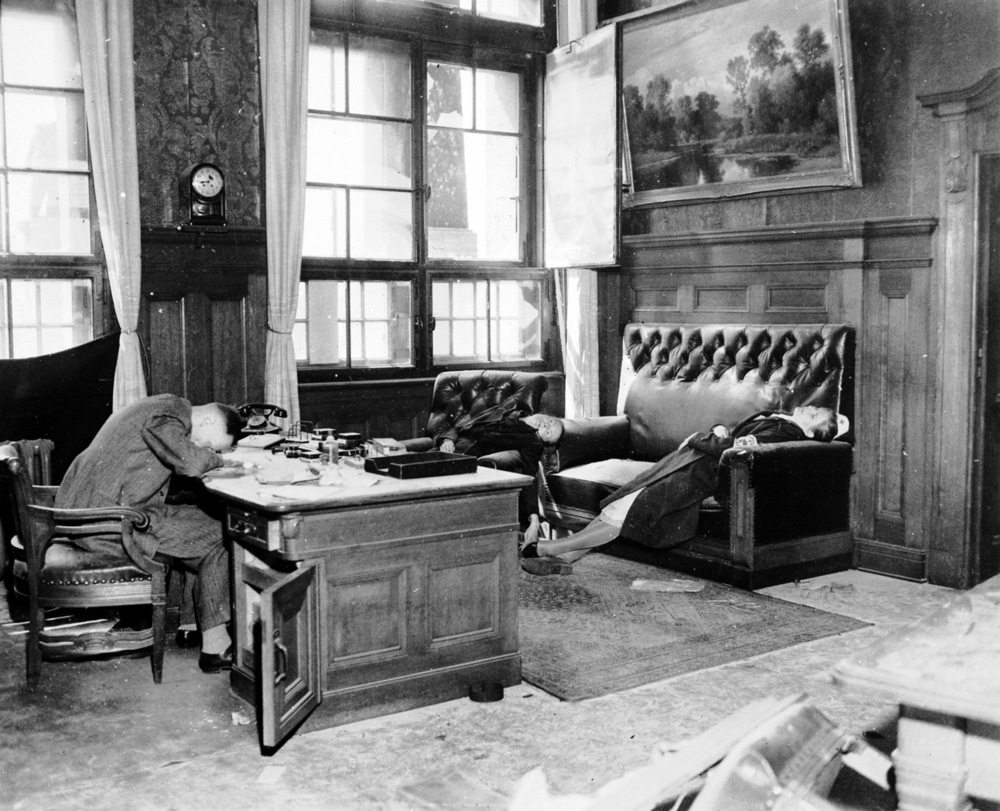
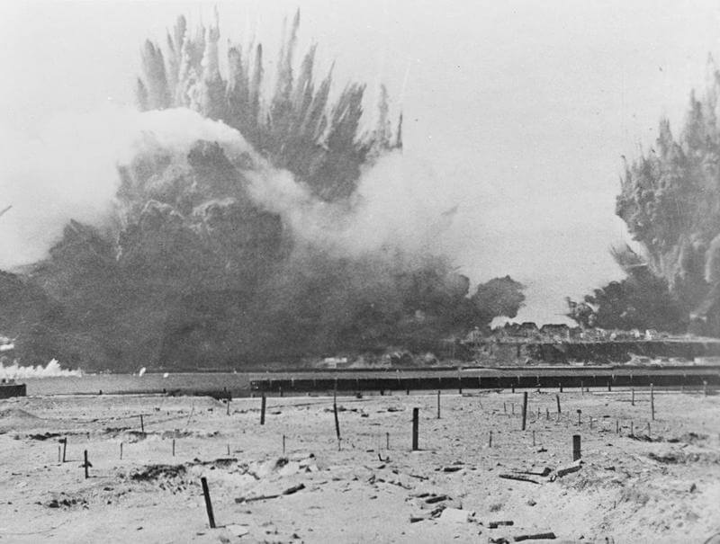

### Wzgórza Seelow

Jak pisze Ryan o bitwie na Wzgórzach Seelow:
>Z niektórych odcinków oficerowie meldowali, że przewaga liczebna nieprzyjaciela wynosi jak 10 do 1. "Idą na nas hurmem fala za falą, nie zważając na straty w ludziach - telefonował jeden z dowódców dywizji. - strzelamy z karabinów maszynowych na odległość strzału bezpośredniego, dopóki lufy nie rozpalą się do czerwoności. Moi żołnierze walczą do ostatniego naboju. A potem zostają rozbici w proch i rozjechani. Nie wiem jak długo to może potrwać". Podobnie brzmiał każdy meldunek.

Już wczoraj z centrum obrony w Seelow nieustanne naloty bombowców i samolotów szturmowych zrobiły miazgę. Miasto przestało istnieć. Ale pomimo lokalnych postępów (dziś też na północnym odcinku walk około 8 km) front utrzymywał się w odległości 10-15 km od obecnej polsko-niemieckiej granicy. Z grubsza rzecz biorąc wytyczała go droga krajowa 167 Seelow - Bad Freienwalde. Ale! Niewielki sukces na północy, czyli zdobycie Wriezen utworzyło szansę na przełamanie linii obrony na tym odcinku, w istocie była to już trzecia i ostatnia linia i taka sytuacja groziła okrążeniem głównych sił 4 Armii Pancernej.

Trzeci dzień relatywnie niewielkie siły niemieckie stawiały opór i choć raport dzienny z punktu widzenia Żukowa był niezadowalający, to w kategoriach strategicznych był przełomowy - to był ostatni dzień niemieckiego oporu, od jutra Niemcy zaczną się już wycofywać.

### 1 Armia WP

Dywizje piechoty 1 Armii WP bez powodzenia usiłowały sforsować bieg Alte Oder równoległego starorzecza Odry znajdującego się dokładnie na wysokości Cedyni.

### 1 Front Ukraiński

Dziś do Szprewy dotarła reszta wojsk 1 Frontu Ukraińskiego. Na niewielkim odcinku na południe od Cottbus walczą oddziały 3 i 4 Gwardyjskich Armii Pancernych, 5 Gwardyjskiej Armii oraz 13 Armii.

13 Armia zdobyła przyczółek po drugiej stronie Sprewy i umożliwiła przeprawę obu armiom pancernym w okolicy miasteczka Spremberg (łuż. Grodk) - leżącego dokładnie na zachód od Bad Muskau i 20 km na południe od Cottbus (pl. Chociebuż) stolicy Łużyc Dolnych. 

Równocześnie 5 Armia Gwardyjska przekroczyła Sprewę na południe od Spremberg. Uzyskano przełamanie drugiej linii obrony i siły sowieckie zaczęły się wlewać na zachód. Sowieci opanowali drogi wiodące do Cottbus od południa. Ambicje Koniewa pobiegły nimi dalej na północ, aż do Berlina.

Wieczorem 18 kwietnia, po dokładnym rozważeniu co ma do powiedzenia, zadzwonił do Stalina i przedstawił mu dokładnie sytuację, mówiąc że czołówka jego sił znajduje się 50 km na zachód od Cottbus (czyli dokładnie na południe i niecałe 100 km od Berlina). Stalin stwierdził, iż u Żukowa ciężko i zaproponował przemieszczenie sił Frontu Białoruskiego przeprawami Koniewa, na co ten odrzekł że zabierze to zbyt wiele czasu, oraz - co najważniejsze - sam ma dość sił by zaatakować Berlin. Zaproponował atak na Zossen. Stalin zapytał "*czy wiecie, że w Zossen znajduje się kwatera główna hitlerowskiego Sztabu Generalnego?*". Koniew odrzekł, że wie. Ale z Zossen był związany jeszcze jeden fakt, o którym nie wspomniał ani Koniew, ani Stalin. Było to bowiem zbyt oczywiste. Z miasteczka wybiegały cztery drogi wyjazdowe, na wschód, południe, zachód i północ, najkrótsza była ta północna, miała tylko 17 km i kończyła się na rogatkach Berlina. Marszałek Koniew w ten sposób otrzymał pozwolenie na atak na Berlin:
>Bardzo dobrze, Zgadzam się. Skierujcie swoje armie pancerne na Berlin.

Zaraz po tym jak Amerykanie zrezygnowali z marszu na Berlin, Koniew dostał własną autostradę do Berlina. O tej decyzji marszałek Żukow dowiedział się bezpośrednio od Stalina. Wpadł we wściekłość.

5 Armia Gwardyjska miała wykonać uderzenie zabezpieczające bezpośrednio w kierunku zachodnim na Torgau nad Łabą. Mieli rozciąć siły niemieckie oraz zablokować Łabę i to w obie strony: Niemcy mieli pozostać na wschodzie, Amerykanie na zachodzie.

### 2 Armia WP

2 Armia WP na swoim odcinku uzyskała kolejne 10 km.

### Robert Capa

Fotografia z Lipska w czasie wojny ocenzurowana.

- In Colore Veritas [One of a series of photos shot by Robert Capa in Leipzig showing surrendering German soldiers being hit and kicked by a soldier from the US 2nd Infantry Division. April 18, 1945](https://www.facebook.com/TheTruthInColor/posts/4106896612681417)

[ https://www.facebook.com/TheTruthInColor/posts/4106896612681417 ]

### Samobójstwa hitlerowców

Trwa bitwa o Lipsk, nieliczne punkty oporu zażarcie walczą z wojskami amerykańskimi, ale wynik jest oczywisty. Lipsk padnie następnego dnia.

18 kwietnia w biurach Nowego Ratusza zabili się kapsułkami z cyjankiem:

- prezydent Lipska SS Gruppehfuhrer Bruno Erich Alfred Freyberg z żoną i córką
- wiceprezydent i skarbnik Lipska Ernest Kurt Lisso również z żoną Renate i córką Regine, która miała nałożoną opaskę DRK (niem. Deutsche Rote Kreuz)

To drugie samobójstwo dokonane w biurze Freyberga w Nowym Ratusz zostało dwa dni później uwiecznione przez amerykańską reporterkę Margaret Bourke-White i opublikowane w magazynie Life. Zdjęcie to stało się najbardziej znaną ilustracją hitlerowskiej fali samobójstw. Freybergowie zabili się w sąsiednim pomieszczeniu, ale nikt tego nie sfotografował.

Następnego dnia zabije się dowódca lipskiego Volkssturmu.

*Kurt, Renate und Regina Lisso nach ihrem Suizid vom 18. April in den Räumen des Neuen Rathauses, 20. April 1945. 
Von US Army Signal Corps - NARA, Gemeinfrei, [Link](https://commons.wikimedia.org/w/index.php?curid=2324148)*

### Masakra w Piotrowicach

18 kwietnia, prawdopodobnie w odpowiedzi na atak UPA poprzedniego dnia, oddział Narodowej Organizacji Wojskowej pod dowództwem "Wołyniaka" w polskich mundurach wojskowych podając się za MO, opanował wieś Piotrowice, w której zgromadzona była ukraińska ludność oczekująca na wysiedlenie za wschodnią granicę. Komisję wysiedleńczą wraz z kilkunastoosobową eskortą czerwonoarmistów zmusił do ucieczki, potem dokonał masakry przebywających w miejscowej szkole ludzi, głównie kobiet i dzieci. Liczba ofiar jest trudna do ustalenia, ale najczęściej podaje się około 170 zamordowanych.

### Helgoland

Wyspa Helgoland z racji położenia u ujścia Łaby i Kanału Kilońskiego stanowiła strategiczną bazę niemieckiej marynarki wojennej. Dziś Brytyjczycy dokonali najbardziej intensywnego bombardowania w dziejach, jeżeli liczyć liczbę samolotów na jednostkę powierzchni bombardowanego celu. Wyspę o powierzchni 1,7 km2 bombardowało prawie tysiąc samolotów: 969, w tym 617 Lancasterów, 332 Halifaxów i 20 Mosquito.

Dokładnie za dwa lata 18 kwietnia 1947 Brytyjczycy dokonają największej nienuklearnej eksplozji w dziejach świata, faszerując wyspę 6,7 tys. ton ładunków wybuchowych. Brano pod uwagę całkowite zniszczenie wyspy. Doszło do zmiany jej kształtu. Do wybuchu użyto materiałów wojennych skonfiskowanych hitlerowskim Niemcom: m.in. 4 tys. torped, 9 tys. min głębinowych i 90 tys. granatów. Eksplozję obserwowali dziennikarze na parowcu Danzig. Grzyb wg niektórych doniesień miał kilka km wysokości.

W 1952 zwrócono wyspę Niemcom.

{/* 
*18 kwietnia 1947, eksplozja na Helgoland, zniszczenie poniemieckich materiałów wojennych. 
By nieznany - [http://media.iwm.org.uk/iwm/mediaLib//167/media-167928/large.jpg](http://media.iwm.org.uk/iwm/mediaLib//167/media-167928/large.jpg)(https://commons.wikimedia.org/wiki/File:IWMLondonThumbnail.jpg)This is photograph [A 31319](https://www.iwm.org.uk/collections/item/object/205162343) from the collections of the [Imperial War Museums](https://www.iwm.org.uk/).(https://commons.wikimedia.org/wiki/File:Flag_of_the_United_Kingdom.svg) Domena publiczna, [Link](https://commons.wikimedia.org/w/index.php?curid=39775192)*  */}

### Józeff Tiso

Również 18 kwietnia 1947 w Bratysławie został powieszony ksiądz Józeff Tiso, od 1918 członek, a potem aktywny działacz Słowackiej Partii Ludowej, tzw ludaków. W latach 30 XX wieku zaczął tam robić poważną karierę, po śmierci jej szefa Andreja Hlinki został jego następcą i wkrótce poparł Hitlera.

<SeeAlso txt="Słowacja" url="/festung-breslau/article/slowacja" />

Ksiądz Tiso był jednym z najważniejszych przedstawicieli faszyzmu klerykalnego (klerofaszyzmu) i po układzie monachijskim stanął na czele marionetkowego rządu hitlerowskiej Słowacji - I Republiki Słowackiej. Było to jedno z państw kolaboranckich, podobnie jak Chorwacja i Węgry. Jest odpowiedzialny za przeprowadzenie Holokaustu na terenie Słowacji, a podczas powstania w 1944 także zbrodni na Słowakach. Uciekł do Austrii, został tam schwytany przez Amerykanów, którzy wydali go nowemu rządowi Czechosłowacji. Do lutego 1948 Czechosłowacja miała jeszcze rząd mieszany, składający się w dużej części z demokratów i przedstawicieli przedwojennej Czechosłowacji.

15 kwietnia Czechosłowacki Sąd Narodowy (cz. Národný súd) wydał wyrok śmierci, prezydent Edvard Beneš nie skorzystał z prawa łaski.

W 2008 po identyfikacji zwłok na cmentarzu w Bratysławie, szczątki księdza zostały przeniesione do Katedry św. Emmerama w Nitrze (słow. Bazilika svätého Emeráma). Dziś jest usprawiedliwiany za kolaborację z Hitlerem, a czasem nawet gloryfikowany jako męczennik. Popularna postać w środowiskach nacjonalistycznych.

- WielkaHistoria [Rafał Kuzak "Holokaust na Słowacji. Jedyny kraj, który dopłacał Niemcom za mordowanie Żydów"](https://wielkahistoria.pl/holokaust-na-slowacji-jedyny-kraj-ktory-doplacal-niemcom-za-mordowanie-zydow/)

### Wilhelm zu Wied

W Predeal w Rumunii w wieku 69 lat zmarł Wilhelm zu Wied, książę Albanii, zostawiając syna Carola Victora jako pretendenta.

<SeeAlso txt="Albania" url="/festung-breslau/article/albania" />

Tron albański utracili już na początku Wielkiej Wojny, a teraz oddzielają ich od władzy nie tylko traktaty międzynarodowe, ale i albańskie władze komunistyczne. Carol Victor zmarł bezdzietnie w 1973 w wieku 60 lat.

### Wrocław

We Wrocławiu kończyły się środki walki. 6. Luftflotte traciła możliwości zaopatrywania miasta. Jak się ocenia zaledwie 1/4 w ogóle trafiała do obrońców, coraz częstsze było zatrzymywanie zasobników w pododdziałach, które je znajdowały, wielokrotnie powtarzające się rozkazy w sprawie właściwego postępowania ze zrzucanym ładunkiem świadczą, że był to coraz większy problem dla dowództwa, które w ten sposób traciło kontrolę nawet nad tym, co trafiło do niemieckiej części miasta. Zatrzymywanie zasobników w pododdziałach nazywane było sabotażem i zagrożone sądem polowym niezależnie od stopnia. Wyznaczono nieprzekraczalną normę zużycia amunicji na 20 do 30 pocisków dziennie.

18 kwietnia z terenu zajętych przez Armię Czerwoną zakładów Linke-Hoffman (późniejszy Pafawag) został wyprowadzony silny atak poprzedzony wsparciem artyleryjskim. Walczono o stację kolejową Wrocław-Mikołajów, zdobycie jej dałoby sowietom świetny punkt wyjścia do przełamania przez linię nasypu kolejowego i ataku główną zachodnią osią komunikacyjną miasta.

Równoczesny atak na nasyp kolejowy nastąpił z Lasku Dębowego i skierowany był na stację kolejową Popowice. Atak świeżymi siłami pancernymi na Szczepin miał doprowadzić do przełamania frontu na tym odcinku i wyjścia aż na teren elektrociepłowni. Na odcinku od obecnej Stacji Popowice (ul Starogroblowa) do zakrętu gdzie łączy się z ulicą Długą, doszło do poważnej bitwy pancernej, w której unicestwiony został 374 Gwardyjski Pułki Ciężkiej Artylerii Samobieżnej wyposażony w działa samobieżne ISU-152. Z 16 maszyn użytych w ataku stracił 13.

<SeeAlso txt="Bitwa pancerna na Szczepinie 18 IV 1945" url="/festung-breslau/article/szczepin-bitwa" />
 
Opisujący walkę o stację Popowice Majewski twierdzi, że Niemcy rzucili do walki Pantery (do tej pory trzymali je w ukryciu? Von Ahlfen się nimi nie chwali?), a Hartmann podaje liczby zniszczonych pojazdów pancernych przekraczające sowiecki stan posiadania.

Dzisiejszy dzień nie stworzył przełomu w walce, ale otworzył do niego drzwi. Było to pierwsze poważne przełamanie przez linię nasypu kolejowego, a tak dumny z sukcesu Leo Hartmann nie przyznaje, że właśnie kończyły się możliwości obrony nasypu.

Wojna dogorywa, ale wciąż trzyma nieszczęśników w żelaznym uścisku. Jak pisze Hornig:
>Rosyjskie dowództwo wojskowe stało się bardzo niecierpliwe z powodu braku sukcesu, czyli kapitulacji Festung Breslau. Stąd też ponownie zintensyfikowano działania wojenne i ostrzał artyleryjski, ze wszystkich dosłownie stron. Ostrzał był odczuwalny w każdej dzielnicy miasta. Rosjanie usiłowali przedrzeć się z północnego-zachodu i dlatego też silnie wzmocnili ostrzał dzielnicy Odertor. Przeorysza Margarete Ziegler relacjonuje z "Jakobshaus" przy Hermannstrasse, niedaleko Odertor-Bahnhof: "18 kwietnia - dzień ciężkich walk pierwszej rangi! Od godziny 6.00 rano wściekły ogień huraganowy z rosyjskich i niemieckich dział. Trwał bez przerwy godzinami, z niewielkimi tylko przerwami. Przerażające są te straszne uderzenia wielkokalibrowych dział, szalejące "organy Stalina". Nasz dom kilkakrotnie zadrżał w posadach. Mimo to mogłyśmy wykonywać swoją pracę w mieszkaniu na parterze i przygotowywać posiłki. [...] Niestety nadal nie było światła ani w domu, ani w bunkrach. Wieczorem nieco się uspokoiło, tak że odważyłyśmy się pójść do pompy i nabrać niezbędną ilość wody.

