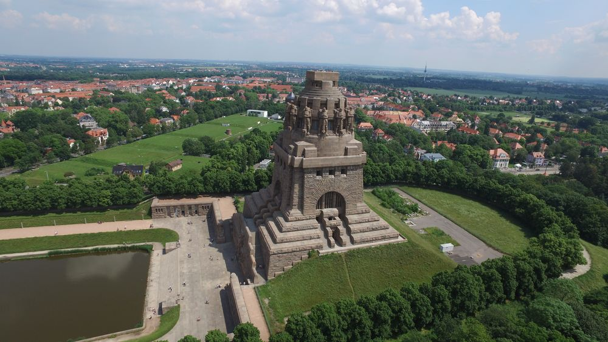

### Nowy Jork

Na Broadwayu w Nowym Jorku odbyła się premiera musicalu Carousel autorstwa Richarda Rodgersa i Oscara Hammersteina II.

Była to adaptacja dramatu autorstwa Ferenca Molnára "Liliom" z 1909. Najbardziej znanym jego dziełem jest oczywiście powieść "Chłopcy z Placu Broni" z 1906. Tytułowy Plac Broni istnieje tylko w polskim tłumaczeniu. Domu zbudowanego na miejscu placu, o który walczyli chłopcy należy szukać na skrzyżowaniu ulic Pál i Mária. W tytule oryginału i większości tłumaczeń mamy ulicę Pawła (Pál utca).

### Fabian Gerard Waculik

W bitwie nad rzeką Gaiano pod Bolonią kapelan Fabian Gerard Waculik (OFM) został zastrzelony przez niemieckiego snajpera, kiedy udział ostatniej posługi śmiertelnie rannemu żołnierzowi.

### Saksonia

Amerykanie zatrzymali się na Łabie 15 kwietnia. Ale dotyczy to szerokości geograficznej Berlina. Uprzednie ustalenia sojusznicze wyraźnie określały podział Niemiec na strefy okupacyjne tak, że Turyngia, Saksonia i Saksonia-Anhalt należały do sowietów. A Łaba płynie przez środek Saksonii. Jak więc to w praktyce wyglądało w Saksonii?

14 kwietnia Rochlitz. 16 kwietnia po dwóch dniach walki zdobyli Colditz. Tego samego dnia bez walki zajęli Plauen. 17 kwietnia dotarli do Eilenburga, który został w ciągu trzech dni obrony prawie całkowicie zniszczony ogniem artyleryjskim i potem zdobyty prawie bez strat. Również 17 kwietnia, ale zupełnie bez walki zostało oddane Zwickau. 19 kwietnia to koniec bitwy o Lipsk.

Jak widać, ostatecznie dotarli do Muldy (lewego dopływu Łaby o przebiegu południkowym) i tam się zatrzymali.

Ale istniał dość spory obszar, który był na wschód od Muldy a do którego nie dotarła Armia Czerwona. Były to trzy gminy: Schwarzenberg, Stollberg i Aue. Po kapitulacji Niemiec hitlerowskich 8 maja władzę przejęła tam lokalna organizacja samorządowa o charakterze antyhitlerowskim. Sformowała się tzw. Freie Republik Schwarzenberg. Do początku lipca był to teren pod kontrolą US Army.

3 lipca Saksonia w całości (z wyjątkiem przyłączonej do Polski części leżącej na wschód od Nysy Łużyckiej) weszła w skład Sowjetische Besatzungszone aka Ostzone czyli sowieckiej strefy okupacyjnej pod nadzorem NKWD.

Większość lokalnych władz Freie Republik Schwarzenberg pozostała.

### Lipsk

Bitwa o Lipsk skończyła się szybko. Ostatnim aktem była obrona pomnika Bitwy Narodów.

<BoxImageWrapper>

Pomnik Bitwy Narodów (niem. Völkerschlachtdenkmal), Lipsk 
By Ke1207 - Own work, CC BY-SA 4.0, https://commons.wikimedia.org/w/index.php?curid=51347904
</BoxImageWrapper>

- Mark Felton Productions ["Last Stand at the Leipzig Monument 1945" [YT 9:29]](https://www.youtube.com/watch?v=3cfWQg-3euk)

### Samobójstwa hitlerowców

Kolejny hitlerowiec się zabija: dziś jest to Otto Dönicke karierowicz bez żadnych umiejętności. W NSDAP od 1925, w latach 30. starosta powiatu lipskiego, w 1937 został burmistrzem Lipska. Skompromitował się podczas wizyty Hitlera, okazało się, że nie nadaje się na to stanowisko i w 1938 stracił wszystkie stanowiska państwowe i partyjne. Jako stary działacz wziął udział w organizacji Volkssturmu. Po kapitulacji Lipska zastrzelił się w Nowym Ratuszu wraz z kilkoma innymi dowódcami Volkssturmu.

Byli to m.in. kreisleiter SA-Standartenführer Carl Strobel i jego zastępca Willy Wiederroth.

### Wzgórza Seelow

Koniec bitwy o Wzgórza Seelow. Droga do Berlina otwarta!

Po kolejnym dniu zaciekłych, krwawych walk do wieczora 19 kwietnia okolice miasteczka Seelow zostały zdobyte przez Armię Czerwoną. To była krwawa jatka, wszędzie leżały zwłoki poległych, płonęły pojazdy i budynki. Sowieci wciąż byli ostrzeliwani przez artylerię i rozproszone oddziały niemieckie. W amoku walki oddziały sowieckie przemieszały się. Teraz potrzebowali kilku dni, żeby oczyścić teren z niedobitków, umocnić się, ale przede wszystkim przegrupować się i odzyskać porządek bitewny.

Żukow zwyciężył, ale było to zwycięstwo dalekie od oczekiwań. Co więcej, dostał wiadomość, której obawiał się najbardziej. Jego konkurent, marszałek Iwan Koniew, wystrzelił pancerną strzałę w centrum dowodzenia w Zossen i w sam Berlin. Mogło być gorzej, podobno na wieść o problemach w Seelow Stalin rozważał zmianę głównodowodzącego Frontem. Bitwa zakończyła się zwycięstwem, ale straty i czas, który pochłonęła to była klęska. 1 Front Białoruski utracił ponad 30 tys. zabitych, trzykrotnie więcej niż Niemcy.

Co gorsza, wprawdzie wszystkie trzy linie obrony, po kolei zostały przełamane i zniszczone, to siły niemieckie ciągle nie były rozbite. Wycofywali się, zachowując łączność i porządek bitewny. Ponieśli ogromne straty, ale nadal było to niebezpieczne wojsko. Cała 9 Armia została rozcięta na trzy zgrupowania, lokalnie zdolne do kontrataku.

### Goebbels

Radio:
>Naród niemiecki musi wygrać tę próbę, inaczej zasłuży na bytowanie, którego powstydziłyby się najprymitywniejsze ludy Afryki. Bezgraniczna wierność dla Führera – oto co pokażemy wrogiemu światu. Można nas zranić, ale nie zabić, uderzyć do krwi, ale nie powalić.

Już jutro urodziny Hitlera. Ostatnie.

### 1 Armia WP

1 Armia WP przełamała pozycje na Starej Odrze i zajęła wieś Neugaul (obecnie północna część miasta Wriezen przy drodze 167).

### 1 Front Ukraiński

Marszałek Iwan Koniew, dowódca 1 Frontu Ukraińskiego wpatrywał się w swój wymarzony cel. Teraz jeszcze na mapie. Już wkrótce będą tam jego ludzie. I on, marszałek Koniew w Berlinie. Deszcz orderów zaszczytów i między nimi ten najcenniejszy - triumf zdobywcy Berlina. Wszystko było gotowe. Zadzwonił do swojego najlepszego dowódcy:
>Pawle Siemionowiczu, nie martwcie się, nacierajcie dalej

Tymi słowami wystrzelił pancerną strzałę kierując swoją elitarną jednostkę na Zossen - siedzibę OKH czyli tzw Maybach I oraz OKW czyli Maybach II. Adresatem tych słów był generał Rybałko, dowódca 3 Gwardyjskiej Armii Pancernej znamy nam już z manewru, który zadecydował o rozstrzygnięciu bitwy o Górny Śląsk, gwałtownym niedającym się przewidzieć manewrem z okolic Częstochowy uderzył na tyły niemieckiej 17 Armii, która znalazłszy się w krzyżowym ogniu, atakowana z obu stron musiała się wycofać. Ale wtedy ryzyko było niewielkie, choć zawrócenie i zmiana kierunku ataku o 90 stopni wymagała wielkich umiejętności i dyscypliny, operacja odbywała się w ramach nacierającego frontu.

Teraz zadaniem, które postawił marszałek Koniew przed 3 Armią Pancerną, był marsz naprzód, nieprzerwany i bez zmiany kierunku. Wymagało to oderwania się od własnych sił, uderzenia na wrogim terenie o przewidywalnym kierunku i przede wszystkim operacji bez zabezpieczenia boków. Z rubieży na linii Lübbenau - Luckau do Zossen było ok. 50 km, do Berlina następne 20 km. Na płaskim, zalesionym terenie z wątłą siecią dróg. Według zasad taktyki wojskowej, biorąc pod uwagę planowaną głębokość natarcia zadanie, które postawił Koniew przed swoim pupilem, było samobójcze. Ale jak to po latach napisał generał Rybałko:
>Szliśmy z południa, gdy za nami pozostawały jeszcze nie dobite dywizje niemieckie. Nie obawialiśmy się jednak o losy naszych komunikacji, ponieważ byliśmy pewni, że wyższe dowództwo podejmie niezbędne kroki w celu likwidacji tych niedobitków. Skrzydła i tyły były w ciągu całej operacji skutecznie osłonięte.

19 kwietnia byli już w Spreewaldzie na linii Lübbenau - Luckau. Jest to obszar śmiertelnie niebezpieczny dla sił pancernych, z mnogością przeszkód wodnych, zupełnie płaski i zalesiony. Jest niewiele dróg do wyboru. Do Berlina jest stamtąd już tylko dwadzieścia parę km.

Wojska niemieckie były jednak w zupełnej defensywie. Gromadziły się przy głównych miejscowościach i drogi przez las były najczęściej bezpieczne.

### 2 Front Białoruski

Do 19 kwietnia 2. Front Białoruski opanował cały wschodni brzeg Odry na południe od Szczecina i utworzył przyczółki do ataku na zachód.

### Wypadek z bronią

["Od wódki rozum krótki"..... Jedna z wielu tego typu niepotrzebnych tragedii....](https://www.facebook.com/ludowewojsko/posts/692168821476921)

### Wrocław

Hartung:
>18 kwietnia 
>Dzisiaj znowu przeżywam osobliwy epizod z granatem. Idę właśnie przez ogród seminaryjny do sztabu, gdy nagle w pobliżu słyszę znajomy, złowieszczy świst. Zapominam o tym, żeby natychmiast paść na ziemie, tylko pędzę przed siebie co sił w nogach. Jednak również ten pocisk nie eksploduje - bo wcale takowym nie jest. Okazuje się, że to bomba pocztowa zrzucona przez jeden z naszych samolotów zaopatrzeniowych. Jej spadochron się nie otworzył i teraz sympatyczny ładunek musi leżeć gdzieś niedaleko.

W dzisiejszym wpisie pisze o listach od rodziny datowanych na 15 i 19 marca. Kończy
>Teraz już nie przejmuję się tym, że do trzeciej w nocy muszę siedzieć w biurze i stukać na maszynie nudne raporty.

Znana nam z wczorajszego wpisu przeorysza Margarete Ziegler:
>Ponieważ po posiłku było spokojnie, poszłam razem z siostrą Klarą zaraz po godzinie 13.00 na Rynek, mimo huraganowego wiatru, który wypełniał powietrze żółtymi obłokami pyłu i strącał cegły oraz kawałki szyb ze zniszczonych domów. Do placu dotarłyśmy bez ostrzału i odwiedziłyśmy najpierw nowy bunkier pod numerem 58., który z powodu braku wystarczającej liczby łóżek w mieście nieustannie był powiększany przez dołączanie nowych piwnic w sąsiednich domach. [...] Pomieszczenia sa dobrze chronione i zaopatrzone w światło, ale urządzenia sanitarne są absolutnie niewystarczające. Piwnice te nie zostały uszkodzone ani przez bomby, ani przez granaty, bardzo jednak ucierpiały podczas bombardowania sąsiednie domy, na przykład znana księgarnia Priebatscha, która była już tylko jedną, wielką kupą gruzów. Tysiące cennych książek leży na tym gruzowisku i każdy bierze sobie co mu się podoba. [...] W Schweidnitzer Keller odwiedziłyśmy siostry z "Bethesda" i prowadzone przez nie oddziały. Również i ten bunkier nie odniósł żadnych uszkodzeń podczas ostatniego ciężkiego ostrzału. Ratusz został trafiony w różnych miejscach, a wiele domów na Rynku było mocno zniszczonych.

Stanisława Marciniak, polska robotnica przymusowa:
>Okropna strzelanina. Na Albertstrasse [S. Czarneckiego] paliło się. Musiałam pojechać do Witka do szpitala inną ulicą. W szpitalu przepełnienie rannymi. Chorzy i personel medyczny byli w piwnicy ze względu na niebezpieczeństwo nalotów. Nad głowami sterczały grube rury kanalizacyjne przeplatane cieńszymi rurkami od elektryczności. Skąpe strumienie światła dopełniały tej niezwykłej scenerii. 
>Wąskie przejście wzdłuż ustawionych po bokach łóżek z rannymi ledwie pozwalało przecisnąć się o krok naprzód. Smutny to był widok. Temu wszystkiemu towarzyszyły lamenty chorych i bieganina lekarzy. 
>Witek miał szczęście, że w górnej kieszeni ubrania miał wieczne pióro i odłamek, który dopadł go w czasie nalotu, nie przebił serca, bo pióro osłabiło pęd odłamka. W dwa tygodnie po operacji już chodził. 