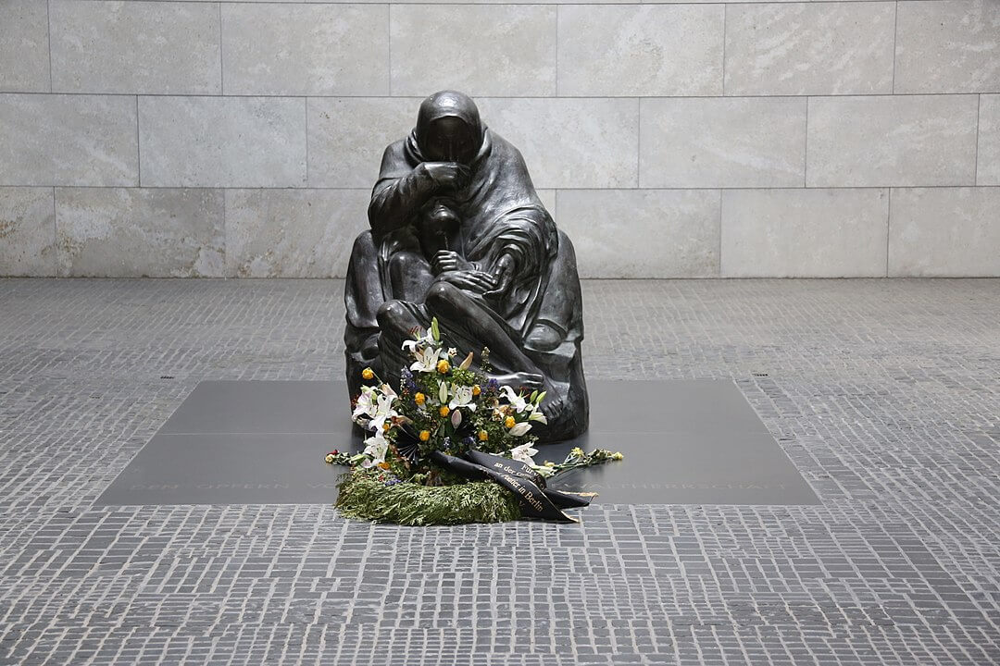

### Kurt Dittmar

22 kwietnia z samego rana przez Łabę w okolicach Magdeburga przeprawiło się trzech żołnierzy Wehrmachtu w celu poddania się do niewoli. Był to rejon zatrzymanej na Łabie amerykańskiej 9 Armii.

Kiedy zaczęto ich przesłuchiwać, okazało się, że jednym z nich jest generał porucznik Kurt Dittmar - oficer, który każdego dnia przez radio nadawał komunikaty z frontu i znany był jako "głos niemieckiego Wehrmachtu". Był cennym źródłem i chętnie mówił. Z miejsca zaczęto go pytać o rzeczy najważniejsze: co wie o Twierdzy Narodowej, jakie są tam siły, jak wygląda przygotowanie do obrony i czy jest tam Hitler.

Był bardzo zaskoczony tymi pytaniami. Jaka Twierdza Narodowa? Pytający byli uparci i nie od razu zaakceptowali wyjaśnienie Dittmara, że ta tak zwana Twierdza Narodowa jest mrzonką, nie istnieje, samo pojęcie zna, ale tylko raz o tym przeczytał w jakiejś szwajcarskiej gazecie.

Hitler natomiast - wyjaśniał Dittmar - jest w Berlinie, cały czas tam był i jest zdecydowany pozostać, zginie lub popełni samobójstwo, ale nigdzie nie zamierza uciekać. Obie te wiadomości były dla aliantów kompletnym zaskoczeniem, trudno powiedzieć która większym.

Z całą pewnością wiadomość, że w Berlinie jest Hitler była zaskoczeniem niezwykle gorzkim. Właśnie wjechały tam sowieckie czołgi.

### Berlin

Przede wszystkim, kiedy mowa o Berlinie musimy sobie uświadomić jedną rzecz - ustawa o Wielkim Berlinie z 1920 powiększyła go dziesięciokrotnie i stolica Niemiec z relatywnie niewielkiego miasta pośrodku miejsko-wiejskiej aglomeracji administracyjnie urosła do molocha trzykrotnie większego od obecnego Wrocławia i prawie dwukrotnie większego od takich stolic jak obecne Warszawa czy Praga. Berlin ma prawie 900 km2. Otacza go Berliner Ring, zewnętrzna obwodnica autostradowa, częściowo zbudowana w 1936 w ramach RAB (niem. Reichsautobahn) Fritza Todta, nosiła wtedy oznaczenie RAB 7. W latach 70 NRD dokończył tę inwestycję od zachodu i północy, obecnie jest to BAB 10.

<SeeAlso txt="Berlin do 1945" url="/festung-breslau/article/berlin-opis" />

Wewnątrz jest ogromny obszar o bardzo zróżnicowanej historii i charakterystyce, z dużą ilością lasów, labiryntem cieków wodnych i całkowicie płaski. Zabudowa co do zasady jest niewysoka. Najwyższą wówczas budowlą była wieża radiowa Funkturm 147 m na terenach wystawowych. Najwyższym budynkiem Katedra, której kopuła wznosiła się wówczas na wysokość 116 m. Ale tam gdzie są kamienice, są one wysokie. Tak więc nie ma żadnych wyraźnych punktów orientacyjnych, żadnych geograficznych wyróżników dla poszczególnych części Berlina. Dla obcej armii Berlin jest płaskim molochem pełnym pułapek i przeszkód.

Berlin jest niejednorodny w nieprzewidywalny sposób, wynika to z tego, że ustawa o Wielkim Berlinie połączyła kilkadziesiąt wsi i 8 miast, niektóre z nich (np. Köpenick) były starsze od Berlina, wszystkie miały własną strukturę urbanistyczną, rynki i ratusze. Otoczenie miasta natomiast to niewielkie miejscowości i wszędzie pełno lasów i przeszkód wodnych. Jest to idealna okolica dla zablokowania wojsk pancernych. Taki był pierwotny plan - wykorzystując znajomość terenu w rozproszony sposób blokować natarcie wszędzie gdzie się da. Hitler jednak, ten nieoceniony geniusz strategii, zadecydował inaczej. Berlin ma być cytadelą o jednolitej, potężnej linii obrony.

Którą kiedy już przyszło co do czego nie było jak i z czego zbudować ani kim i czym obsadzić.

### Beate Uhse-Rotermund

Niemcy hitlerowskie były konserwatywne jeżeli chodzi o pozycję kobiet w społeczeństwie. Zgodnie z niemiecką tradycją "Kinder, Küche, Kirche". Były oczywiście wyjątki. Najsłynniejszym była Hanna Reitsch.

<SeeAlso txt="Kapitan Hanna Reitsch (1912-79)" url="/festung-breslau/article/hanna-reitsch" />

Ale były też inne pilotki wojskowe, jak np. Melitta Schenk Gräfin von Stauffenberg opisana 8 kwietnia. Bardziej znana była Beate Uhse, najbardziej rozpoznawalna jako założycielka sieci sex-shopów. W 18 urodziny otrzymała licencję pilota. W latach 30. wykonywała loty kaskaderskie, akrobatyczne.

Podczas wojny jedyną możliwość latania dawała Luftwaffe i Uhse pilotowała samoloty transportowe. Okazjonalnie latała również na samolotach bojowych takich jak Ju 87 Stuka, Messerschmitt Bf 109 i 110, Fw 190 a pod koniec wojny również Me 262. W 1943 urodziła syna. Uzyskała pozwolenie na kontynuowanie pilotowania i wynajęcie niani. W październiku 1944 awansowała na kapitana.

W kwietniu 1945 kiedy miasto obległa Armia Czerwona jej jednostka stacjonowała w Barth 280 km na północ od Berlina, na wybrzeżu Bałtyku (niem. Ostsee). 21 kwietnia wzięła jeden z samolotów dyspozycyjnych Arado Ar 66 i poleciała na lotnisko Berlin Gatow. W mieście toczyły się już walki. Przedostała się przez cały Berlin do domu w Rangsdorf żeby zabrać syna. Kiedy następnego dnia wróciła na lotnisko okazało się, że jej samolot został zniszczony. Jej znajomy mechanik wskazał jej dwusilnikowego Siebel Fh 104. Podczas tankowania samolotu nauczyła się z podręcznika zasad pilotażu. Do samolotu weszli niania z jej synkiem, mechanik i dwóch rannych żołnierzy - na niskim pułapie udało się jej uciec z Berlina w kierunku NW do Flensburga, gdzie po wojnie pozostała.

Po wojnie jak wszyscy piloci Luftwaffe miała zakaz pilotowania, nie mogła dostać pracy w lotnictwie i zajmowała się handlem obnośnym. Poznała wtedy wiele historii swoich klientek, które zachodziły w ciążę nie mając środków na wychowanie dzieci. Zrozumiała jak bardzo im brakuje podstawowej edukacji seksualnej. Ponieważ wychowana była w bardzo progresywnej "Schule am Meer" i otrzymała odpowiednią wiedzę od matki zebrała podstawowe informacje nt Metody Ogino-Knausa i wydrukowała broszurę edukacyjną. Jej "Pamphlet X" osiągnął ogromny sukces, do 1947 rozszedł się w nakładzie 32 tys. egzemplarzy. Zaczęła sprzedawać kondomy i poradniki małżeńskie. W 1951 wystartowała jej firma Beate Uhse Mail Order Co, która od lat 60. oferowała również akcesoria erotyczne.

Za zasługi w dziedzinie edukacji i liberalizacji seksualnej otrzymała w 1989 Order Zasługi Republiki Federalnej Niemiec (niem. Verdienstorden der Bundesrepublik Deutschland). W 1996 w wieku 75 lat uzyskała prawo jazdy. W Berlinie powstało Beate Uhse Erotic Museum. W 2001 zmarła na zapalenie płuc mając 82 lata.

- Mark Felton Productions ["Female Luftwaffe Pilots in Combat 1945" [YT 8:32]](https://www.youtube.com/watch?v=v8OsaIqxxwk)

### "Upadek"

Dziś o godz. 1500 w bunkrze odbyła się słynna, najbardziej z filmu "Upadek" narada w bunkrze. Byli tam Bormann, Keitel, Jodl i Krebs.

O co chodziło? Generał SS Felix Steiner od 28 stycznia 1945 był dowódcą 11 Armii Pancernej SS (11. Armee) w składzie Grupy Armii Wisła, ale już na samym początku bitwy jej dowódca generał Heinrici pozbawił jego jednostkę najważniejszych oddziałów m.in. dywizji SS Nordland, wykrwawionej później w bojach o Wzgórza Seelow, jej resztki broniły potem Berlina. Steinerowi pozostało kilka batalionów i niewielka liczba czołgów. Steiner otrzymał rozkaz zebrania wszystkich sił, jakie są do dyspozycji, wszystkiego, co napotka i utworzenia grupy bojowej Steinera (niem. Armeeabteilung Steiner aka Armeegruppe Steiner) i trzymania pozycji na Kanale Finow. Jest to jedna z najstarszych sztucznych dróg wodnych w Europie, został zbudowany w 1605 i łączy Odrę z Hawelą na wysokości Cedyni. Zaczyna się w Liepe, a kończy w Liebenwalde. Jak widać, jest to pozycja dalekiej północnej flanki przedpola Berlina.

Po wszystkich niepowodzeniach i klęskach, jakie wydarzyły się na froncie to zgrupowanie o nazwie, z której nijak nie wynika rzeczywista wielkość, urosło w umyśle Hitlera do gigantycznej siły bojowej i dostało misję zmiażdżenia sowieckiego ataku, który po bitwie na Wzgórzach Seelow zmierzał do okrążenia miasta od północy. Steiner miał spaść na nich z północy i rozgnieść, a potem łącząc się z IX Armią atakująca od południa doprowadzić do rozbicia zgrupowania sowieckiego. Wojna wygrana.

Tak to przedstawił na naradzie i wtedy na filmie pada ta słynna kwestia:
>"Mein Fuhrer, Steiner..." 
>"Steiner konnte nicht genügend Kräfte für einen Angriff massieren. Der Angriff Steiner ist nicht erfolgt.

Słysząc to, Hitler wpadł w furię i we wściekłej tyradzie oświadczył, że wojsko go okłamywało, oficerowie zawinili tchórzostwem, wojna jest przegrana, i to z winy generałów, którzy ciągle stali mu na drodze, a on w Berlinie pozostanie do samego końca.

Po powrocie do prywatnej kwatery zadzwonił do Goebbelsa. Zaproponował by Goebbelsowie przenieśli się do bunkra, do jego starszej, gorzej chronionej części. Propozycja ta została przyjęta. Natychmiast przybyli do bunkra. Dostali się tunelem łączącym Ministerstwo Propagandy z Nową Kancelarią Rzeszy. Podczas rozmowy ustalili, że popełnią samobójstwo. Magda Goebbels dodała, że zabije przedtem własne dzieci. Była na to zdecydowana, choć Hitler oponował.

Potem o godz. 1900 wezwał do siebie Keitla i Jodla, oświadczył im że pozostaje w Berlinie i zabije się, jeśli miasto wpadnie w ręce czerwonoarmistów. Potem przeszli do planowania dalszej walki i uzgodnili, że skoro 12 Armia nie jest zagrożona przez Amerykanów, może wziąć udział w obronie Berlina. To, że Amerykanie zatrzymają się na Łabie, wiadome było też dzięki przechwyceniu planów Eclipse (powojenne urządzenie Niemiec przez aliantów). Konferencja zakończyła się o godz. 2000.

Ok. godz. 2300 w bunkrze po nominację na szefa Niemieckiego Czerwonego Krzyża przybył Obergruppenführer prof Karl Gebhardt, osobisty lekarz Himmlera. Zaoferował 600-osobowy batalion SS przydzielony natychmiast do "Cytadeli" oraz pomoc w ewakuacji kobiet i dzieci. Hitler odpowiedział mu, że wszyscy przebywający w bunkrze, robią to z własnej woli i kto chce może odejść.

- [Shout! Factory "Downfall (2004) - Clip 1: Steiner's Attack" [YT 4:16]](https://www.youtube.com/watch?v=xBWmkwaTQ0k)
- [The Great War "That Downfall Scene Explained - What Is Hitler Freaking Out About? I 16 Days In Berlin" [YT ]](https://www.youtube.com/watch?v=3Uc4_ATDjoU)

### Twierdza Berlin

Generał Hellmuth Reymann 7 marca 1945 wyznaczony na komendanta obrony Berlina rano z Goebbelsem jest w rozgłośni radiowej. Goebbels wygłasza przemówienie. Potem Reymann udaje się na kwaterę i wieczorem dostaje wiadomość, że dostaje także funkcje dowódcy Armeegruppe Spree. Ponieważ w tym momencie nic już nie działa tak jak należy dopiero następnego dnia wybierze się w rejon Poczdamu by zapoznać się z sytuacją.

Reymann nic o tym nie wie, że został już zdjęty z funkcji. Dowie się o tym dopiero następnego dnia, kiedy wróci z Poczdamu. A w tym czasie zmieni się naprawdę sporo.

Najpierw komendantem miasta Hitler mianuje generała Ernsta Kaethera. Ściśle rzecz biorąc najpierw daje mu funkcję, a potem mianuje na generała. Kather jednak zdąży tylko obdzwonić przyjaciół przekazując im radosną wieść o awansie. Zamówi sobie nowy mundur. Kilka godzin później, jeszcze tego samego dnia Hitler decyduje, że Kaether nie jest mu potrzebny i sam będzie dowodził obroną Berlina.

Nieoczekiwanie pojawia się generał Helmuth Weidling dowódca LVI Korpusu Pancernego. Jego oddział w zamieszaniu bitewnym utracił łączność z kwaterą Hitlera. Uznano wtedy, że Weidling nie wykonał rozkazu i Hitler kazał go rozstrzelać za zdradę. Weidling się o tym dowiedział i zamiast zaszyć się gdzieś dyskretnie na kilka dni zaryzykował i udał się bezpośrednio do Hitlera by osobiście wyjaśnić nieporozumienie. Ten był poruszony postawą Weidlinga i oczywiście oczyścił go z zarzutów.

Następnego dnia postawi Weidlinga na czele obrony miasta. I taką właśnie sytuację zastanie Reymann, kiedy wróci z Poczdamu.

Generał Helmuth Weidling pozostanie na stanowisku komendanta obrony Berlina do samej kapitulacji.

### Pamiętniki Hitlera

Warto wspomnieć o wypadającej na dziś rocznicy jednego z największych skandali w dziejach prasy RFN, to właśnie 21 kwietnia 1983 "Stern" zapowiedział opublikowanie nieznanych, obszernych pamiętników Adolfa Hitlera z lat 1932-1945. Zakupione za 9,9 mln marek pamiętniki okazały się fałszerstwem.

### Ucieczki

Już 20 kwietnia Hitler ogłosił, że nie ucieka, pozostaje w Berlinie. Bunkier jest przerażającym miejscem. Jest duszno i odkąd nawaliła kanalizacja, strasznie śmierdzi uryną. Od wczoraj nieustannie słychać ostrzał artyleryjski. Żadne miejsce na zewnątrz nie jest bezpieczne, więc od dawna wszyscy już siedzą w bunkrze.

Zaczynają się ucieczki. Ludzie, którzy nie są niezbędni do obrony, zaczynają być odprawiani. Tego dnia 40 osób ze sztabu Kancelarii opuściło Berlin w samolotach lecących do Berchtesgaden.

- kamerdyner Hitlera Wilhelm Arndt lubiany przez wszystkich ze względu na wygląd (wysoki blondyn z niebieskimi oczyma), tego samego dnia wieczorem zginął lecąc do Bawarii zestrzelony nad Saksonią.
- doktor Morell osobisty lekarz Hitlera.
- adiutant Julius Schaub któremu Hitler powierzył zadanie zniszczenia wszelkich rzeczy osobistych należących do niego, zrobił to w Nowej Kancelarii Rzeszy, dziś udał się z taką samą misją do Monachium, na końcu miał zniszczyć pociąg Hitlera.
- odprawione zostały sekretarki Shroeder, Wolf i kilka innych osób.

### Reichsbank

Trzecia i ostatnia ewakuacja Banku Rzeszy.

SS-Standartenführer Josef Spacil, zbrodniarz wojenny i dowódca SD w Holandii, na rozkaz szefa RSHA Kaltenbrunnera dokonał dziś ze swoimi podkomendnymi napadu z bronią w ręku na Bank Rzeszy. Tak, większość (ponad 90%) złota wywieziono jeszcze 9 lutego do Merkers. Ten skarb w całości wpadł w ręce Amerykanów 4 kwietnia. 14 kwietnia wywieziono resztę w dwóch pociągach do bezpiecznej, jak się wtedy wydawało, Bawarii. Ale to nie oznacza, że Bank Rzeszy był pusty. Spacil nie przedstawiał żadnych dokumentów, grożąc bronią, zmusił pracowników Banku Rzeszy do wydania pozostałych zasobów złota, kosztowności i obcej waluty. Był to trzeci i najbardziej tajemniczy transport ładunku Banku Rzeszy.

Spacil dotarł do samolotu czekającego na niego pod Berlinem i przez Pragę udał się do Salzburga, gdzie 4 maja spotkał się z gauleiterem Gustavem Scheelem. Wiedząc, że sowieci są w Wiedniu i Berchtesgaden niechybnie wpadnie w ręce wroga, postanowili ukryć skarb w pobliżu. Jedna ze znanych lokalizacji to Rauris. W ciągu kilku następnych dni Spacil odbywa dość tajemnicze spotkania m in z SS Hauptsturmführerem Franzem Konradem i Otto Skorzenym. Szczególnie to drugie spotkanie jest ważne, wiąże się bowiem bezpośrednio z transferem całej fortuny na rzecz organizacji zajmującej się ewakuacją zbrodniarzy hitlerowskich do Ameryki Południowej.

Spacil w przebraniu żołnierza Wehrmachtu poddał się do niewoli amerykańskiej, ale został rozpoznany. Dlatego częściowo wiemy co i gdzie ukrył. Ale jego misja do dziś skrywa wiele tajemnic.

9 listopada 1945 zeznawał na procesie norymberskim przeciwko swojemu przełożonemu, Kaltenbunnerowi. Zmarł w 1967 w Monachium.

### Operacja berlińska - 1 Front Białoruski

Krebs przekazał Heinriciemu pozwolenie dla garnizonu Frankfurtu nad Odrą na wycofanie się i połączenie z przygotowaną do obrony okrężnej 9 Armią generała Busego. Hitler dorzucił do tego swoje rojenia o współdziałaniu z 12 Armią i głębokich kontratakach, ale w obecnej sytuacji celem przełamania linii mogło być tylko wyrwanie się z kotła, co zresztą wynikało z sugestii Heinriciego.

Grupa Steinera broniła pozycji w rejonie Oranienburga i Ruppiner Kanal.

9 Gwardyjski Korpus Pancerny i 125 Dywizja Strzelecka nacierały na linii Zepernick, Schönerlinde, Mühlenbeck, Schönfliess, Hohen Neuendorf i dotarły do mostu w Henningsdorf na Haweli.

Bardziej na północ 1 Armia WP zajęła rejon między Bernau bei Berlin i Biesenthal i nacierała wzdłuż Kanału w stronę Oranienburga - dotarła do przedmieścia Oranienburga i wyzwoliła KL Sachsenhausen.

Równolegle szło uderzenie 61 Armii na południe od Kanału.

8 Armia Gwardyjska i 1 Gwardyjska Armia Pancerna wdarły się na wschodnie przedmieścia Berlina: Dahlwitz, Schöneiche bei Berlin (tu czasem osobno wymienia się Fichtenau) i Rahnsdorf.

### Operacja berlińska - 1 Front Ukraiński

5 Gwardyjski Korpus Zmechanizowany w sektorze 4 Gwardyjskiej Armii Pancernej utworzył osłonę na linii Beelitz, Treuenbrietzen, Kropstädt i został wzmocniony 13 Armią. 6 Zmechanizowany Korpus Gwardii dotarł do Beelitz, a 10 Gwardyjski Korpus Pancerny przez Saarmund i Schenkenhorst (gdzie Armia ulokowała sztab) dotarł do przedpola Poczdamu i odciął drogę ucieczki przez Caputh i Babelsberg.

3 Gwardyjska Armia Pancerna przekroczyła Notte Kanal w rejonie Zossen i wieczorem tego dnia elementy 6 i 7 Gwardyjskiego Korpusu Pancernego dotarły do Teltow Kanal w odpowiednio Teltow i Stahnsdorf. Po ich prawej stronie już o 9 rano 9 Korpus Zmechanizowany przekroczył linię autostrady i do zmroku wdarł się w przemieścia Lichtenrade, Marienfelde oraz Lankwitz.

### KL Sachsenhausen

2 Dywizja Piechoty 1 Armii Wojska Polskiego dotarła do obozu koncentracyjnego Sachsenhausen w Oranienburgu, położonym 30 km na północ od Berlina.

Sachsenhausen to było samo centrum hitlerowskiego systemu obozów koncentracyjnych i zagłady, tam właśnie mieściła się siedziba IKL (niem. Inspektion der Konzentrationslager). W ciągu poprzednich dwóch dni SS wyprowadziło w Marszach Śmierci ponad 30 tysięcy więźniów.

Kiedy do obozu weszli Polacy, zastali tam jeszcze 3 tysiące ludzi.

W sierpniu NKWD na terenie dawnego obozu koncentracyjnego założyło swój własny - Obóz Specjalny nr 7 (Speziallager Nr. 7). Jednym z jego komendantów był Roman Rudenko główny prokurator strony sowieckiej podczas procesów norymberskich. W obozie NKWD trzymało nazistów, oficerów niemieckich, antykomunistów i ludzi, którymi z różnych względów się interesowali. Przez pięć lat istnienia obozu przewinęło się przez niego 60 tysięcy ludzi, z których 12 tysięcy umarło, głównie z chorób i niedożywienia. Za czasów hitlerowskich zginęło tam około 30 tysięcy ludzi, w większości żołnierzy Armii Czerwonej.

### 2 Armia WP

Tymczasem na południu, na odcinku Niesky - Bautzen rozgrywa się tragedia 2 Armii WP. Pozbawiona wsparcia piechoty artyleria zmotoryzowana, piechota oddzielnie bez artylerii i elita uderzeniowa Armii daleko z przodu, wszystkie oddziały rozciągnięte w dużej odległości jak na spacerze były idealnym celem egzekucji. Zawiodła łączność, komenda, koordynacja. Armia nie miała żadnego doświadczenia bojowego.

Podczas przebijania się na południe do niewoli został pojmany generał Aleksander Waszkiewicz, Białorusin od 1919 w Armii Czerwonej, skierowany do WP we wrześniu 1944. Od 22 września organizator i dowódca 5 DP. Torturowany i zamordowany. Ciało odnaleziono dopiero 4 maja.

Dopiero w południe pada spóźniony rozkaz zawrócenia spod Drezna 1 Korpusu Pancernego i 8 DP. 9 DP pozostała na miejscu. Do wieczora udało im się dotrzeć w okolice Budziszyna. Jatka trwa.

### Wilhelm Cauer

W bliżej niewyjaśnionych okolicznościach został zastrzelony przez czerwonoarmistów Wilhelm Cauer zdolny matematyk, jeden z naukowców niemieckich, których sowieci poszukiwali. Miał problemy, kiedy okazało się, że jeden z jego przodków był Daniel Itzig żydowski bankier Fryderyka II. Choć wg prawa był "aryjczykiem", ale w rzeczywistości jego status był niepewny. Wywiózł dzieci z Berlina i wbrew ostrzeżeniom wrócił tam. Jego ciało znalezione w masowym grobie ofiar sowieckich egzekucji. Tak wyglądało wyzwolenie Berlina, koszmar z Nemmersdorf dotarł do serca III Rzeszy.

### Käthe Kollwitz

W wieku 78 lat zmarła w Moritzburgu Käthe Kollwitz znana powszechnie w Niemczech rzeźbiarka. Po tym jak nasiliły się bombardowania Berlina, musiała się ewakuować. Wkrótce potem jej berlińskie mieszkanie i pracownia na Prenzlauer Berg uległy zniszczeniu. Saksoński następca tronu książę Henryk zaprosił ja do siebie do Moritzburga gdzie zaoferował willę należąca do pałacu - Rüdenhof. Obecnie znajduje się tam muzeum Käthe Kollwitz.

Była to artystka zainteresowana biednymi, a z powodu własnych przeżyć (straciła syna na Wielkiej Wojnie) nastawiona antywojennie. Najsłynniejszym jej dziełem jest Pieta Berlińska, której kopia znajduje się w Nowym Odwachu na Unter den Linden.

<BoxImageWrapper>

Kate Kollwitz "Mutter mit totem Sohn", Nowy Odwach, Berlin. 
By [Drrcs15](https://commons.wikimedia.org/wiki/User:Drrcs15) - Praca własna, [CC BY-SA 4.0](https://creativecommons.org/licenses/by-sa/4.0), [Link](https://commons.wikimedia.org/w/index.php?curid=36783726)
</BoxImageWrapper>

### Bolesław Fichna

Podczas likwidacji obozu koncentracyjnego Flossenbürg zginął Bolesław Fichna, adwokat, polityk i działacz podziemia aresztowany po Powstaniu Warszawskim.

### E-100

Najbardziej znanym przykładem hitlerowskiej gigantomanii jest superciężki czołg Maus. Ale były też w opracowaniu i inne równie mało praktyczne giganty. Jednym z nich jest E-100 (E jak Entwicklung) produkcji firmy motoryzacyjnej Adler. Nie tak wielki jak Maus, miał ważyć bagatela! 123 tony i dzięki temu osiągać prędkość aż 40 km/h. Trudno mówić o szczegółach technicznych, prace skończyły się na niedokończonym jednym prototypie. Jedną z koncepcji było umieszczenie wieży od Mausa.

W lipcu 1944 Hitler kazał zatrzymać wszystkie projekty superciężkich czołgów. Mimo to w bardzo ograniczonym zakresie w zakładach Henschela pracowano nad prototypem.

22 kwietnia 751 batalion artylerii polowej zajął zakłady w Bad Lippspringe (k Padenborn, Nadrenia-Westfalia) i zameldował znalezisko:
>Located Tank Proving Ground Coor: 721700 Contains: Pilot models of 120 ton tank E100; SP 21 CM Gun How that can be fired from veh. or removed and fired from grd. 2 tks, 35 ton model unknown, tank gas chamber; tank water chamber.

- Mark Felton Productions ["The King Tiger's Big Brother - E-100 Mega Tank" [YT 5:15]](https://www.youtube.com/watch?v=R0jEau14Nr0)
- Tank Encyclopedia ["Tiger-Maus, Krupp 170-130 tonne Panzer ‘Mäuschen’"](https://tanks-encyclopedia.com/tiger-maus-krupp-170-130-tonne-panzer-maeuschen/) | ["E100 (Entwicklung 100)"](https://tanks-encyclopedia.com/e100-entwicklung-100/)

### Dornier Do 335 Pfeil

Zaskakujący wyglądem Do 335 miał przełamać dominację aliantów na niebie, bez zastosowania napędu odrzutowego. Strzała miała dwa silniki i dwa śmigła - z przodu i z tyłu. Samolot osiągał prędkość maksymalną 760 km/h i został włączony do awaryjnego projektu myśliwca (niem. Jägernotprogramm).

Zbudowano tylko kilkanaście prototypów, tylko jeden ocalał, przejęty właśnie dziś przez aliantów. Wywieziony do USA był testowany w ramach Operation Lusty - programu badania niemieckiej broni lotniczej.

- Mark Felton Productions ["Dornier Do. 335 - Hitler's Steel Arrow" [YT 8:02]](https://www.youtube.com/watch?v=W-0hzs7yO2Y)
- Dark Skies ["Dornier Do 335 - Fastest Piston Fighter of WW2" [YT 11:22]](https://www.youtube.com/watch?v=fri6qexq8JY)

### Operacja Alsos

- Nie napotykając oporu, grupa bojowa Alsos dociera do wskazanego w Heidelbergu **Heigerloch**, gdzie w piwnicy pod kościołem zamkowym odnajdują eksperymentalny reaktor (Forschungsreaktor Haigerloch), ale bez uranu i ciężkiej wody. Po kilku godzinach odnajdują ukryte w szambie dokumentację. 3 beczki ciężkiej wody i 1,5 tony (rudy?) uranu.
- W **Hechingen** pojmali 25 naukowców
- W **Tailfingen** był sam Otto Hahn i 9 jego współpracowników

Wprawdzie Heisenberg wciąż jest poza ich zasięgiem, ale niemiecki program atomowy już nie istnieje.

Co do zasady wszystko miało zostać przejęte lub zniszczone, ale 24 kwietnia ksiądz z Heigerloch wynegocjował ocalenie piwnicy i dziś znajduje się tam Atomkeller-Museum z repliką reaktora.

- Mark Felton Productions ["Hunting Heisenberg: Capturing Germany's Atomic Secrets" [YT 10:43]](https://www.youtube.com/watch?v=QrCc9XfNoBE)
- [Operation Harborage](https://en.wikipedia.org/wiki/Operation_Harborage)

### Bolonia

Komunistyczni partyzanci dzień po wyzwoleniu Bolonii zabili Leandro Arpinatiego działacza piłkarskiego, związanego z Mussolinim w latach 20. potem popadł w niełaskę i podczas wojny pomagał antyfaszystom z Comitato di Liberazione Nazionale (związek wielu organizacji antyfaszystowskich).

### Wrocław

Hornig:
>Wraz z posuwaniem się Rosjan do przodu na zachodzie od Bahnhof Nikolaitor, rozgorzały walki kilkaset metrów o wielkiego bunkra na Striegauer Platz, na terenie Sankt-Paulus-Kirche. W "Bethanien", i nie tylko tam, bardzo martwiono się o przebywający w bunkrze na Striegauer Platz ponad 1 tys rannych i chorych jak również o personel, do którego należało wiele diakonis. Obawiano się zdobycia bunkra przez przeważające liczebnie wojska rosyjskie. Tym większą było niespodzianką dla sióstr w "Bethanien", kiedy po długim tygodniu w niedzielę 22 kwietnia, w godzinach południowych w domu macierzystym pojawiło się dziewięć sióstr zakonnych z tego bunkra: dwie siostry z "Bethanien", sześć z domu macierzystego z Grunberg i jedna z Czerwonego Krzyża. W dzienniku zapisano: "Siostry mają za sobą godziny strachu i obawiały się, że już nigdy nie będą mogły opuścić tego bunkra. Oznaczałoby to dostanie się w niewolę. Na całe szczęście w godzinach porannych 22 kwietnia nastąpiła przerwa w wymianie ognia, podczas której możliwe było zabranie z bunkra ostatnich rannych. Kiedy siostry wkroczyły na naszą posesję i szły przepełnionym słońcem ogrodem przed domem macierzystym, na ich twarzach pojawiły się łzy z powodu tak wielkiego piękna i tak wielkiego niepokoju.

Wspomnienia komendanta wskazują jak bardzo osłabiony był wrocławski garnizon:
>Prócz tego udało się jeszcze, poczynając od pierwszych dni kwietnia zreorganizować lub ściągnąć na zachód dalsze siły piechoty. I tak 120 młodych sanitariuszy zamieniło opaskę z czerwonym krzyżem na broń. Zostali przydzieleni do jednostek bojowych. Z 800 oficerów piechoty z doświadczeniem frontowym, podoficerów i artylerzystów utworzono natomiast batalion artylerii jako samodzielną część załogi i wystawiono do walki na zachodzie, gdzie sprawdzał się w boju. Siły te zaoferował dowódca Urbatis, gdy wskutek rosnącego braku amunicji skazano na milczenie część baterii.