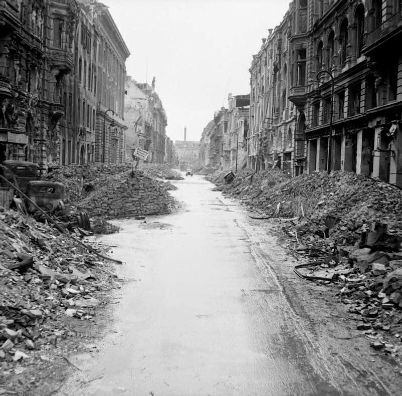

### Hohenfels

W 1938 Wehrmacht utworzył tam poligon. Już rok później znajdował się tam obóz jeniecki, początkowo dla podoficerów (Oflag IIIC), potem dla wszystkich rang (Stalag 383). Szybko został rozbudowany i mógł pomieścić ponad 5 tys. jeńców. Ponad połowę z nich stanowili Polacy.

24 kwietnia 1945 65 DP amerykańska zajęła Hohenfels i wyzwoliła obóz.

To nie był jednak koniec jego historii. Amerykanie powiększyli go dwukrotnie. Uznali, że piękna okolica i izolacja od większych ośrodków miejskich - najbliżej była Ratyzbona odległa o 25 km - zapewnia odpowiednie miejsce dla dipisów (ang. Displaced Persons), jak określano miliony ludzi wyrwanych wojną ze swoich domów. Obóz został zlikwidowany w 1949.

- [US Soldiers honor Polish fallen in Hohenfels](https://www.army.mil/article/252705)
- [Stalag 383](https://en.wikipedia.org/wiki/Stalag_383)

### Hitler

Hitler ochłonął po wstrząsie doznanym 22 kwietnia. Naszkicował rozkaz ogłoszony następnego dnia:

- OKW jest odpowiedzialne za wszystkie operacje i odpowiada przede mną
- wydaje rozkazy zgodnie z moimi poleceniami, które będę przekazywał przez szefa sztabu OKH
- Sztab "A" (północ) pod dowództwem wielkiego admirała Dönitza przejmie swoje funkcje na mój rozkaz
- główne zadanie OKW to ustanowienie połączenia z Berlinem przez ataki z południowego wschodu, północnego wschodu i południa i doprowadzenie bitwy o Berlin do pomyślnego zakończenia

Sztab "B" (południe) został przekazany generałowi Winterowi i bezpośrednio podporządkowany pod OKW. Podział na OKW i OKH został zlikwidowany.

Do bunkra Hitlera został wezwany dowódca 6 Luftflotte generał Robert Ritter von Greim.

### Francuskie SS

Francuska dywizja SS (niem. 33. Waffen-Grenadier-Division der SS „Charlemagne“ (französische Nr. 1), fr. 33e division SS Charlemagne), z której w tym czasie pozostało już tylko 750 ludzi stacjonowała w Neustrelitz.

Jej dowódca SS-Brigadeführer Gustav Krukenberg otrzymał w nocy z 23 na 24 kwietnia rozkaz z Berlina i odesłał 400 żołnierzy do innych zadań, a z pozostałych 350 (tyle było miejsca na ciężarówkach) sformował Batalion Szturmowy Charlemagne (pl. Karol Wielki) i ruszył do walki w Berlinie. O 22.00 dotarli do miasta.

[Mark Felton Productions "French SS - Berlin 1945" [12:02]](https://www.youtube.com/watch?v=UJpWB5hi3hQ)

### Atak na Berlin

Dzień po tym jak został wyznaczony ostateczny komendant niemiecki miasta wyznaczono również sowieckiego.

Dowódca 5 Armii Uderzeniowej generał Nikołaj Erastowicz Bierzarin został komendantem Berlina i dowódcą garnizonu berlińskiego. W Hermsdorf ustanowił pierwszą cywilną administrację z niemieckim burmistrzem.

<SeeAlso txt="Berlin do 1945" url="/festung-breslau/article/berlin-opis" />

Armia Czerwona od wczoraj już na szerokim froncie walcząca w Berlinie znalazła się z nowej sytuacji. Walczyli w śmiertelnie niebezpiecznym otoczeniu gęstej zabudowy, artyleria nie miała dość miejsca, by rozstawić działa, obserwatorzy artyleryjscy a często i sami artylerzyści znajdowali się bezpośrednio pod ogniem nieprzyjaciela. Często operowali ogniem na wprost, celując przez lufę, bywało, że armaty wnoszono na piętra i strzelano z klatki schodowej, a wymontowane wyrzutnie katiusz umieszczano na dachach.

Wróg był wszędzie naokoło, a bez ściśle wyznaczonych obszarów działań łatwo było o wejście w obszar własnego ognia sąsiedzkiej jednostki. Czerwonoarmiści szybko uczyli się znaczenia dobrej łączności między jednostkami. Działali bez wyznaczonego planu, orientując się mapą i kompasem na punkt centralny ich ostatniej bitwy - Reichstag. Tempo natarcia uległo znacznemu spowolnieniu, straty rosły. Czołgi nie mogły nacierać bez wsparcia piechoty, ta zaś nie mogła pozostawić za sobą nieprzeszukanych piwnic i budynków. To dawało przeciwnikowi czas na otrząśnięcie się z szoku i przygotowanie obrony.

W wielu miejscach pomiędzy atakującymi jednostkami znajdowały się spore odstępy, czasem spowodowane chaotyczną topografią Berlina i ogromną liczbą cieków wodnych, a czasem zmienną dynamiką natarcia. Nie istniała jakaś określona linia frontu, spora część Berlina to była ziemia niczyja.

### Obrona Berlina

Od wczoraj aż do samego końca walk dowódcą obrony jest generał Weidling.

Jego własny LVI Korpus Pancerny jest tak naprawdę jedyną ważną jednostką biorąca udział w walkach o miasto. Ale z pięciu dywizji wchodzących w jego skład tylko dwie stanowiły rzeczywistą siłę bojową: 11 Dywizja Grenadierów Pancernych SS Nordland i 18 Dywizja Grenadierów Pancernych. Do tego dochodziły elementy LSAAH i kilkuset francuskich esesmanów z 33 Dywizji Grenadierów Pancernych SS Charlemange. Reszta to była zbieranina gorsza od wrocławskiej. Bronić mieli miasta kilkukrotnie większego, a nieprzyjaciel był po pierwsze przynajmniej dziesięciokrotnie silniejszy a po drugie zdeterminowany. Wszyscy czerwonoarmiści wiedzieli i czuli to każdym wystrzałem, że jest to już ostatnia bitwa, i koniec tej strasznej wojny.

Weidling uprościł strukturę dowodzenia, pozbywając się niekompetentnych dowódców i zmniejszając liczbę sektorów obrony. Większość działających instytucji wojskowych została zamknięta, a personel wysłano na front.

Kobiety sformowały grupę bojową Mohnke ulokowaną w "Cytadeli".

5 tys. chłopców z Pułku Hitlerjugend dowodzonego przez Obergebietsführera dra Schlündera obsadziło dwa południowe z czterech mostów na Haweli (do Spandau) z zadaniem trzymania ich aż do nadejścia 12 Armii generała Wencka. Który jak już wiemy ani myślał by wysłać jakiekolwiek wojsko do Berlina.

Dywizja SS Nordland została wycofana z okolic Lotniska Tempelhof i przeniesiona w pobliże "Cytadeli" w rejonie Neukölln - Kreuzberg. Natomiast do Tempelhof skierowano Dywizję Pancerną Müncheberg. 20 Dywizja Grenadierów Pancernych zajęła pozycje w Wannsee, a jej miejsce w Zehlendorf zajęła 18 Dywizja Grenadierów Pancernych.

Ponieważ pojawiły się informacje, że sowieci używają sieci podziemnych tuneli do przeprowadzania wywiadu i ataków dywersyjnych na tyłach zaczęto rozważać zalanie berlińskich podziemi. 24 kwietnia Martin Bormann dopytywał o zalewanie podziemnych tuneli i specjaliści z BVG odpowiedzieli mu, że efekt jest chwilowy i jest to działanie nieskuteczne. Ponieważ Berlin jest na piaskach woda szybko wsiąknie. Takie akcje przeprowadzał jednak kapitan Gerhard Boldt bezpośrednio na rozkaz Hitlera. W tunelach ukrywało się tysiące cywilów i rannych.

### Berlin - 1 Front Białoruski

76 i 60 Dywizje Strzeleckie ze 125 Korpusu Strzeleckiego atakowały Spandau z północy i zachodu. Walki w Spandau były tak zaciekłe i chaotyczne, że choć w zasadzie zdobyte zostało do wieczora opuszczone przez czerwonoarmistów po to, tylko żeby je jeszcze raz porządnie zbombardować.

175 Dywizja Strzelecka nacierała na Lotnisko Gatow (po wojnie baza RAF Gatow, obecnie Militärhistorisches Museum Flugplatz Berlin-Gatow), którego obroną dowodził major Komorowski. Cała obrona to był pospiesznie sformowany batalion składający się z Volkssturmu i żołnierzy z oddziałów budowlanych, którzy nie umieli walczyć, do tego kilka armat. Do wieczora Volkssturm zdezerterował, a reszta jego żołnierzy w ciągu następnego dnia została zabita lub wzięta do niewoli.

Atakujące od północy oddziały 2 Gwardyjskiej Armii Pancernej wczoraj dotarły do Wittenau, dziś do popołudnia zajęły Jungfernheide, poligon (późniejsze lotnisko) Tegel i do wieczora dotarły do Hohenzollern Kanal, w kilku miejscach zdobyły przyczółki w Siemensstadt.

Równolegle po jej lewej stronie, bardziej na wschód nacierała 3 Armia Uderzeniowa:

- 79 Korpus Strzelecki zajął Reinickendorf z opuszczonymi Koszarami Goeringa w Wedding (obecnie Julius-Leber-Kaserne)
- 12 Gwardyjski Korpus Strzelecki posuwał się przez Wedding i dotarł do silnej obrony w rejonie stacji Wedding S-Bahn i Wieży Przeciwlotniczej Humboldthain (niem. Humboldthain Flakturm). Broniła się tam 9 Dywizja Spadochronowa.
- 7 Korpus Strzelecki atakował przez Prenzlauer Berg, okolicę podobną do Wedding i dwoma głównymi drogami: Prenzlauer Allee z Blankenburg i Greifswalder Strasse z Weissensee kierował się na Alexanderplatz.

5 Armia Uderzeniowa zaczęła dzień od przygotowania artyleryjskiego i desantu piechoty przez Wuhle, dopływ Szprewy. Dzięki uchwyceniu przyczółka można było przystąpić do budowy mostów i przejechać nimi czołgami.

- Po obu stronach Frankfurter Allee atakowały 26 Gwardyjski i 32 Korpus Strzelecki. Zniszczyły przy tym całą zabudowę tej ulicy. Zdobyły teren Rzeżni znajdujący się już w wewnętrznym obszarze obrony. Kontratak został powstrzymany i udało się tego dnia dotrzeć do linii obwodowej S-Bahn. Dalsze postępy zatrzymał ogień z Friedrichshain Flakturm.
- Z samego rana 9 Korpus Strzelecki przekroczył Szprewę na wysokości Parku Treptow. Miał wsparcie 1 Brygady Flotylli Dnieprzańskiej, która przy pomocy pontonów i 10 amfibii przeprawiła 16 tys. żołnierzy, 100 dział i moździerzy, 27 czołgów i 700 ciężarówek.
- 301 Dywizja Strzelecka zdobyła Elektrownię Rummelsberg, nie tylko nietkniętą, ale i działającą co wprawiło dowództwo w zachwyt i zapewniło oficerom deszcz odznaczeń.

Bardziej na południe atakowała najważniejsza jednostka 1 Frontu Białoruskiego - 3 Gwardyjska Armia Pancerna generała Czujkowa mająca wsparcie 28 Armii. Bez wątpienia Żukow umieścił ją w tym miejscu, by zapewnić skuteczne odcięcie 9 Armii niemieckiej od Berlina, ale być może także, by zablokować ewentualne wejście oddziałów 1 Frontu Ukraińskiego do Berlina.

### Berlin - 1 Front Ukraiński

Ewentualne? Otóż dziś w Bohnsdorf (na wschód od Schönefeld) 2 km na południe od Kanału Teltow doszło do spotkania wojsk sowieckich obu Frontów. Żołnierze Żukowa całkiem niespodziewanie natknęli się na czerwonoarmistów z 3 Gwardyjskiej Armii Pancernej generała Rybałki. Do tej pory Żukow nic nie wiedział o tym, że żołnierze Koniewa już są w Berlinie! To był dla niego wstrząs, wywołało to serię depeszy gwałtownej treści w łańcuchu dowodzenia, skarga Żukowa dotarła do Stalina i Stalin rozstrzygnął: wytyczył linię podziału, która biegła przez Lubben, Teuplitz, Mittenwalde, Marieindorf i kończyła się na Dworzcu Anhalckim, droga do Reichstagu była otwarta.

Spotkanie obu Frontów w Berlinie oznaczało również zamknięcie okrążenia 9 Armii i odcięcie jej od Berlina. Zarówno 9 Armia jak i 4 Armia Pancerna podjęły próbę odblokowania miasta, ale te nie mogły się już powieść. Marszałków Armii Czerwonej Niemcy już nic nie obchodzili, byli tylko masą i siłą ogniową nieprzyjaciela stanowiącą przeszkodę na drodze do pokonania najważniejszego przeciwnika - rywala w takim samym mundurze.

3 Gwardyjska Armia Pancerna wciąż borykała się z Kanałem Teltow. Atak rozpoczęty godzinnym przygotowaniem artyleryjskim o godz. 0420. Każdy z korpusów miał ok. 1,5 km odcinek frontu.

- 9 Korpus Zmechanizowany i 61 Gwardyjska Dywizja Strzelecka ustanowiły przyczółek w Lankwitz, ale został zlikwidowany z dużymi stratami.
- 6 Gwardyjski Korpus Pancerny wdarł się do Teltow, korzystając z resztek mostu i pontonów. Do piątej rano dołączyła do nich 22 Gwardyjska Zmechanizowana Brygada Strzelecka. A potem 48 Gwardyjska Brygada Strzelecka. Do godz. 1100 saperzy przygotowali most na przewiezienie artylerii i czołgów. Do końca dnia przyczółek sięgał aż po południowe granice Zehlendorf.
- 7 Gwardyjski Korpus Pancerny zdobył przyczółek w Stahnsdorf, ale zaciekły opór i w końcu zniszczenie mostu spowodowały problemy w kontynuacji ataku.

Uderzeniem na Kanał Teltow dowodził osobiście marszałek Koniew. Wobec powodzenia na tylko jednym kierunku natarcia wydał rozkaz, by tą drogą pchnąć wszystkie siły. Później nawet 10 Gwardyjski Korpus Pancerny 4 Gwardyjskiej Armii Pancernej właśnie przez przyczółek Teltow uderzył na Poczdam.

Walczyła z nimi 18 i przybyła tego dnia 20 Dywizja Grenadierów Pancernych oraz elementy LVI Korpusu Pancernego w sile 6 tys. żołnierzy, mieli 2 Panthery i 20 PzKw IV.

{/* 
*Berlin po walkach. 
By No 5 Army Film &amp; Photographic Unit, Wilkes A (Sergeant) - (https://commons.wikimedia.org/wiki/File:IWMLondonThumbnail.jpg)This is photograph [BU 8604](https://www.iwm.org.uk/collections/search?query=BU+8604) from the collections of the [Imperial War Museums](https://www.iwm.org.uk/) (collection no. 4700-30) (https://commons.wikimedia.org/wiki/File:Flag_of_the_United_Kingdom.svg), Domena publiczna, [Link](https://commons.wikimedia.org/w/index.php?curid=640213)*  */}

### Felix Steiner

W końcu udało mu się dokonać nakazanego ataku. Siłą 7 batalionów wyprowadził natarcie z przyczółków w Kreuzbruch i Zerpenschleuse, Zaskoczona 61 Armia sowiecka zareagowała z opóźnieniem. Dotarli aż do Zehlendorf i Klosterfelde, czyli 6 km, zanim zostali odparci. Zwycięstwo na miarę epoki.

### Okolice Berlina - 1 Front Ukraiński

13 Armia sowiecka dotarła do Wittenbergi na Łabie, rozpoczęły się walki z XX Korpusem 12 Armii Wencka. Były tam dywizje Ulrich von Hutten, Scharnhorst i Theodor Körner - wszystkie z ostatniej fali mobilizacyjnej Wehrmachtu powołanej 29 marca 1945, ta ostatnia składała się głównie z członków RAD. Rozpętały się walki tak zaciekłe, że trzeba było wezwać na pomoc rezerwy z 5 Gwardyjskiego Korpusu Zmechanizowanego i 1 Korpusu Lotnictwa Szturmowego.

4 Gwardyjska Armia Pancerna:

- 10 Gwardyjski Korpus Pancerny dotarł na przedmieścia Poczdamu, ale został zatrzymany z powodu braku mostów.
- 6 Gwardyjski Korpus Zmechanizowany dotarł do Brandenburga, w którym zdobył więzienie. Uwolniono więźniów, wielu z nich było ważnymi działaczami partii komunistycznej.

O świcie 2 Brygada Dnieprzańska położyła na Odrze zaporę dymną i 33 Armia przekroczyła rzekę i zdobyła Fürstenberg (obecnie część Eisenhüttenstadt). V Górski Korpus SS wycofał się.

2 Armia Lotnicza przeniosła bazy bombowców na zachód od Nysy Łużyckiej.

1 Gwardyjski Korpusem Kawalerii pod dowództwem generała Wiktora Kiriłłowicza Baranowa dotarł do Łaby i wykonał misję zleconą przez starego i wciąż wpływowego przyjaciela Stalina, znanego wszystkim Polakom marszałka Budionnego. Zdobył stado koni ukradzionych przez Niemców w Północnym Kaukazie w 1942.

### 9 Armia

W Teupitz (20 km na południe od Berlina) 3 Armia 1 Frontu Białoruskiego połączyła się z 28 Armią 1 Frontu Ukraińskiego, zamykając w ten sposób okrążenie 9 Armii niemieckiej generała Bussego.

Od 22 kwietnia priorytetem wojsk hitlerowskich było połączenie 12 Armii Wencka z 9 Armią, dramatyczna walka rozegra się w najbliższych kilku dniach. Rozpoczęła się bitwa pod Halbe czyli próba przedarcia się na zachód i połączenia się z 12 Armią Wencka, a potem dotarcia do Łaby i poddania się Amerykanom. Była to jedyna nadzieja dla 80 tys. żołnierzy ze zgrupowania pod dowództwem generała Theodora Bussego.

- [Mark Felton Productions "The Last German WWII Attack - Operation Potsdam 1945" [YT 12:38]](https://www.youtube.com/watch?v=LHT2y4QKVMo)

### 2 Armia WP

Dziś Niemcy wyparli Polaków z rejonu Budziszyna. Było to ostatnie (tej wojny i w ogóle) zakończone sukcesem natarcie niemieckich sił pancernych.

Na pole bitwy dotarła 8 DP zawrócona spod Drezna oraz 7 i 10 DP wysłana znad Nysy Łużyckiej przez wysłanego interwencyjnie generała Iwana Pietrowa. Sytuacja zaczęła budzić zaniepokojenie marszałka Iwana Koniewa. Ze względów politycznych nie chciał przejmować komendy osobiście, ale sukcesy niemieckie na tym odcinku stanowiły zagrożenie dla Frontu.

Wprawdzie 5 Armia Gwardyjska zatrzymała ofensywę niemiecką w kierunku Spremberga, ale walki na tym odcinku będą trwały jeszcze kilka dni.

### Puławy

W Puławach dziś, jak na filmie akcji, udający czerwonoarmistów i ich więźniów żołnierze WiN pod dowództwem Mariana Bernaciaka ps. "Orlik" dokonali napadu na Powiatowy Urząd Bezpieczeństwa Publicznego.

Uwolnili 107 więźniów, zabili 1 czerwonoarmistę, 5 ubeków i 2 milicjantów. Stracili 2 zabitych i kilku rannych. W zamieszaniu żołnierze komunistyczni strzelali do siebie.

W 1946 ranny i otoczony przez UB "Orlik" popełni samobójstwo.

### Opawa

Armia Czerwona i czechosłowacka zdobyła Opawę.

### Samobójstwa hitlerowców

W Poczdamie kolejne samobójstwo hitlerowca: Ernst-Robert Grawitz. Ochotnik z Wielkiej Wojny, żołnierz freikorpsów. Profesor uniwersytetu berlińskiego. Od 1931 w SS. W 1935 szef wydziału sanitarnego w Głównym Urzędzie SS i naczelny lekarz SS. Zwierzchnik Niemieckiego Czerwonego Krzyża oraz główny chirurg Himmlera. Odpowiedzialny za wdrożenie zabijania ludzi w komorach gazowych i liczne zbrodnicze eksperymenty dokonywane na potrzeby wojska oraz związane z planami masowej sterylizacji. Brał udział w Akcji T4. Karierowicz pogardzany przez przełożonych i bezwzględny dla podwładnych. Himmler popierał go, chociaż nim gardził. Człowiek z pewnością uprzywilejowany i przedstawiciel berlińskiej elity.

Usiadł wieczorem do kolacji. Kiedy wszyscy zajęli miejsca, wyszarpnął zawleczki dwóch granatów, zabijając całą swoją rodzinę na miejscu.

<SeeAlso comment="Teksty na stronę o Akcji T4" txt="github tdudkowski / t4" url="https://github.com/tdudkowski/t4" />

Przez miasto przetoczyła się fala samobójstw. To wszystko co znaliśmy z Wrocławia, spadło na Berlin z o wiele większą prędkością i na większą skalę.

### Friedrich Kayssler

Podczas bitwy o Berlin usiłując ochronić swoją żonę, zabity został Friedrich Kayssler, popularny i mający wiele sukcesów aktor teatralny i filmowy, znajdujący się na specjalnej liście Hitlera Gottbegnadeten-Liste z września 1944. Urodził się w Nowej Rudzie, Ukończył gimnazjum we Wrocławiu, studiował we Wrocławiu i Monachium.

### Wrocław

We Wrocławiu walki przeniosły się już na drugą stronę nasypu kolejowego, na Szczepin. Celem ataku stał się gigantyczny schron na pl. Strzegomskim, jedna z intrygujących konstrukcji Richarda Konwiarza, hitlerowskiego architekta działającego we Wrocławiu, jego specjalnością były obiekty sportowe.

We Wrocławiu istnieje pięć przypisywanych jemu żelbetowych, nowoczesnych schronów naziemnych z czasów wojny. Dokładne ich przeznaczenie nie jest jasne, nie wynika z lokalizacji, a ponieważ są dość zróżnicowane prawdopodobnie były jakiegoś rodzaju prototypami. Największym z nich jest ogromny, cylindryczny schron na Pl. Strzegomskim, obecnie oddział Muzeum Sztuki Współczesnej z kawiarnią na najwyższej kondygnacji.

W 1945 był z pewnością obiektem przykuwającym uwagę, z oczywistym zastosowaniem wojskowym więc na terenie ważnego węzła komunikacyjnego jakim jest plac, był celem numer jeden. Niestety dla obrońców, charakterystyczne otwory na ścianach służyły tylko wentylacji, więc zamknięci w nim ludzie byli zupełnie bezbronni. Był to szpital polowy, a raczej trupiarnia, od samego smrodu umierających i już martwych żołnierzy można było zemdleć. Z czasem coraz trudniej było usuwać zmarłych. Podziemia kościoła, w których kurował się Hartung były w porównaniu z tym miejscem rajską krainą.

Hartung:
>O tym jak wyglądało zycie w takim bunkrze, napisał Konrad Buchsel. Podczas swoich wizyt spotkał w bunkrze Geislera żołnierza z ciężką depresją, który w swoim obłędzie był dręczony myślami samobójczymi. Buchhsel tak o tym opowiada: "Bardzo trudno w takim przypadku ocenić czy chodzi o prawdziwą chorobę umysłową, czy też o pogłębioną nerwicę, a być może tylko zwykłe symulowanie. Było też jednak rzeczą oczywistą, że dłuższy pobyt w bunkrze Geislera oddziaływał bardzo depresyjnie". Takie wypadki zdarzały się dość często i były zrozumiałe. Ponieważ nawet ludzie zdrowi w wyniku ciągnącego się tygodniami pobytu w piwnicy, bez regularnego wychodzenia na świeże powietrze, mogli zapaść na tak zwaną chorobę piwniczną, której symptomy to skłonność do depresji, rozdrażnienie oraz brak cierpliwości w stosunku do otoczenia.

Hornig przytacza wspomnienia Gustava Panneka, który był tam instalatorem wod-kan i elektrycznym:
>Ten ogromny bunkier mający sześć pięter był przepełniony. Nie tylko pomieszczenia lecz także sienie i korytarze wypełniali ranni i umierający [...]. Na wieży pobliskiego Sankt-Paulus-Kirche były umieszczone punkty obserwacyjne. Ten właśnie cel wróg miał szczególnie na oku [...]. Później wieża ta została w nocy wysadzona. Podczas tego wybuchu wielki bunkier zatrząsł się od wybuchu powietrza. Front był coraz bliżej [...]. Wybuchy bomb kołysały raz po raz całym bunkrem. Wtedy miska zupy zsuwała się ze stołu. Światło elektryczne zgasło. Po 3 sekundach uruchomiło się oświetlenie awaryjne. W sposób minimalny były oświetlone tylko korytarze i sala operacyjna. Agregat z silnikiem diesla pracował przez całą noc. Nie otrzymywaliśmy z zewnątrz od elektrowni żadnego prądu. Kabiny, w których leżeli ranni, musiały być oświetlone świecami woskowymi. Także i na nich oszczędzano, nie wiedziano bowiem, czy jeszcze kiedyś zostaną dostarczone. Od teraz bunkier przestał funkcjonować jako lazaret. Rannych rozdzielono do piwnic przeciwlotniczych w całym mieście. Główny lazaret zajął pomieszczenia schronów na Wallstraße (Włodkowica) w centrum miasta. 
>W bunkrze zaczęli pracować saperzy. Mieli młotami pneumatycznymi wybić otwory strzelnicze. Bunkier miał być broniony za wszelką cenę. Ponieważ to się nie udało, wewnątrz bunkra umieszczono ładunki wybuchowe, które miały być odpalone w momencie zajęcia bunkra przez wroga. W tym czasie w bunkrze znajdowało się około osiemdziesięciu mężczyzn i trzy kobiety. Wybijanie tych otworów zwróciło uwagę Rosjan. Tego dnia na dachu nie powiewała już flaga ze swastyką. Wróg otworzył kanały naturalnego nawietrzania, włożył do środka ładunki wybuchowe i odpalił je. Kiedy jeden z takich ładunków został zdetonowany, w kanale magazynu z olejem napędowym do silnika diesla zapaliły się całe zapasy paliwa. Około 2 tysiące litrów oleju zaczęło płynąć betonowymi kanałami w bunkrze i zajęły wszystko, co mogło się zapalić. Mogliśmy schronić się tylko w śluzie bunkra, osiemdziesięciu pięciu ludzi w pomieszczeniu o powierzchni 2,5 na 4 metry! Wybuchła dzika strzelanina. Nasi żołnierze strzelali do nieustannie nacierających Rosjan z karabinów maszynowych. Nasi saperzy otrzymywali wsparcie z ruin dawnego magazynu fabryki maszyn do szycia (przypis tłumacza "Chodzi o firmę Singer"). Wróg jednak nacierał coraz mocniej. Chciał koniecznie zdobyć bunkier na Striegauer Platz".

Laßmann:
>Nadal utrzymuje się deszczowa pogoda, z czego jesteśmy bardzo radzi. Straż przeciwpożarowa kontynuuje przez cały dzień akcję wydobycia zasypanej trójki osób pod kamienicą przy ul. Katedralnej 10. Patrząc na śródmieście, widzę ponure morze gruzów. Gdzieś, na sterczącym wysoko załomie ruin dostrzegam spadochron z kołyszącym się na nim zasobnikiem zaopatrzeniowym, który zrzucony z jakiegoś Ju 52, rozminął się ze swoim celem. Okropny swąd spalenizny utrudniał oddychanie. 
>Nastała wreszcie prawdziwa wiosna. Cała przyroda budzi się do życia. Jakież ogarnia nas pragnienie, aby móc opuścić ruiny - choćby tylko na godzinę - wydostać się z chmur pyłu, dymu, zapomnieć o ciężarze przygniatającym serce i wyrwać się na łono natury, tam gdzie w bieli kwiatów stoją czereśnie, cieszą oko rozkwitające krzewy migdałków i świeża zieleń młodych brzózek. Ale i tutaj w twierdzy czuć wiosnę. Na kratery po bombach i pociskach drzewa sypią pierwsze płatki swoich kwiatów, nieświadomie a z litością przykrywając tragizm zniszczenia. Dalej na przedmieściach ćwierkania i trele dobiegają już ze wszystkich drzew. Pierwsze bukiety wiosennych kwiatów ujmują naszym piwnicznym mieszkaniom nieco z ich przygniatającego ubóstwa. A jakże straszną jawi się teraz myśl o śmierci, teraz kiedy cała Boska natura budzi się do życia, a świat zaczyna mienić się barwami! 
>Tygodnie zaciekłych walk o Wrocław nie tylko zgasiły niejedno drogie dla nas życie, ale i obróciły w perzynę wiele pięknych zabytków architektonicznych i wspaniałych domów bożych. Wszyscy, którzy w twierdzy byliśmy świadkami tego ogromu bezmyślnych zniszczeń, kochamy jeszcze bardziej nasze rodzinne krwawiące tysiącami ran miasto. To jest tak samo jak z drogim nam człowiekiem, którego niezasłużenie spotyka wielka krzywda: przecież jest nam wtedy jeszcze bardziej drogi. To miasto tak wspaniale prezentujące się niegdyś w uroczystej oprawie Święta Związku Śpiewaczego oraz Święta Sportu i Gimnastyki, spogląda na nas dzisiaj przez łzy. 
>"Gazeta Frontowa" znów dudni dzisiaj w wielkie tam-tamy "Bitwa o Berlin rozgorzała z całą gwałtownością. Hitler broni stolicy Rzeszy. Wszystkie siły obronne znajdują się pod jego komendą. Także ludność cywilna wspomaga dzieło obrony. Jest to walka o europejskiej doniosłości. Wszystkich obrońców stolicy przepełnia teraz jedynie wola druzgocącego pobicia bolszewickiego wroga. Wiadomość, że decydującą walką o stolicę kieruje sam Fuhrer, wzmaga waleczność i ofiarność berlińczyków, i daje całemu niemieckiemu narodowi nadzieję, że walka ta przybierze pomyślny dla nas obrót i odmieni wreszcie nasze położenie" - Oto, jak chełpliwe i zakłamane były nasze sprawozdania prasowe jeszcze tuż przed nieuniknionym upadkiem systemu.
