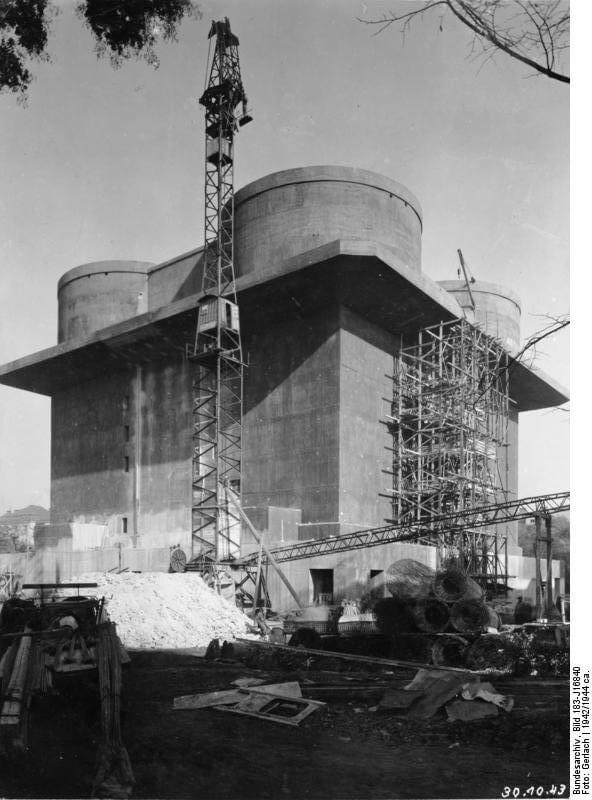

### Włochy

Wojna w Europie definitywnie się kończyła, dziś włoscy partyzanci wyparli faszystów i wojska niemieckie z Genui, Mediolanu i Turynu.

Włochy przestały być krajem okupowanym.

### Finlandia

Wojska fińskie wyparły z kraju resztki wojsk niemieckich, skończyła się wojna lapońska.

### Curtiss-Wright XP-55 Ascender

W 1939 kiedy Amerykanie zorientowali się wreszcie, jak wielkie zaległości mają wobec czołowych krajów lotniczych takich jak Niemcy i Wielka Brytania postanowili unowocześnić swoje lotnictwo. United States Army Air Corps rozpisał konkurs Request for Data R-40C, który był zamówieniem na myśliwiec przechwytujący o minimalnej prędkości maksymalnej 845 km/h i optymalnej 680 km/h.

Był to konkurs, który zaowocował najdziwniejszymi samolotami, jakie zaproponowano:

- Bell XP-52
- Vultee XP-54 Swoose Goose
- Northrop XP-56 Black Bullet
- Curtiss-Wright XP-55 Ascender

Ostatni był propozycją Curtiss-Wright Corporation. Dziś oblot trzeciego i ostatniego prototypu. Pierwszy prototyp oblatano w grudniu 1941. Drugi w lipcu 1943. W każdym wprowadzono bardzo poważne zmiany konstrukcyjne, niezmieniające jednak jego planu konstrukcyjnego. Zastosowano w nim silnik tłokowy, ale ze śmigłem pchającym, czyli umieszczonym z tyłu. Skrzydła miały ostry skos, więc stateczniki poziome były z przodu. Ponieważ silnik był w miejscu, gdzie zwykle jest usterzenie tylne, stateczniki pionowe znajdowały się na końcówkach skrzydeł.

Wyniki były zadowalające, ale po pierwsze był to już koniec wojny i wiadomo było, że żaden z przeciwników nie wprowadzi już nowych konstrukcji, a z dotychczasową techniką Amerykanie wygrywali. Po drugie zaś było również oczywiste, że przyszłością są samoloty odrzutowe i potrzebny jest myśliwiec uniwersalny mający dużą sprawność techniczną. Samoloty, które powstały w odpowiedzi na ten konkurs były już ślepą uliczką.

27 maja w bazie Wright Field ten prototyp roztrzaskał się i to był już koniec tego samolotu. Do dziś ocalał drugi prototyp, który można zobaczyć w muzeum lotnictwa Air Zoo w Kalamazoo (USA, Michigan).

- [Dark Skies "XP-55 Ascender - The Backwards Fighter" [YT 9:28]](https://www.youtube.com/watch?v=XC4lnrPRxtg)
- [Curtiss-Wright XP-55 Ascender](https://pl.wikipedia.org/wiki/Curtiss-Wright_XP-55_Ascender)

### Himmler

Tego dnia do Trumana i Churchilla dotarła wiadomość, w którą początkowo nie chcieli uwierzyć, była to wiadomość przekazana przez księcia Folke Bernadotte szefa szwedzkiego Czerwonego Krzyża i pochodząca od Heinricha Himmlera, jak go nazywał Hitler "der treue Heinrich", wiernego Henryka.

Przywódca SS donosił, iż Hitler znajduje się w ciężkim stanie i nawet jeżeli jeszcze żyje, to wkrótce umrze lub popełni samobójstwo. Wobec tego Himmler jest gotów podjąć negocjacje i skapitulować wobec aliantów zachodnich.

Propozycja ta bez żadnych rozważań została odrzucona i poinformowano o niej Stalina, który odpisał:
>Armia Czerwona będzie nadal nacierała na Berlin w interesie naszej wspólnej sprawy

Oczekiwany przez Hitlera "Cud domu brandenburskiego" (niem. Mirakel des Hauses Brandenburg) nie nastąpił.

### Obersalzberg

Generał Ritter von Greim w Berchtesgaden spotyka się z generałem Kollnerem i choć nie zgadza się z jego twierdzeniem, iż Göring nie jest winny zdrady, zgadza się przekazać jego prośbę o łaskę. Lot do Berlina jest śmiertelnie niebezpieczny, ale jego pilotem będzie Hanna Reitsch, po którą udał się do Monachium. Polecieli do Rechlin, Hanna liczyła, że znajdą tam śmigłowiec, którym można wylądować w mieście, ale jedyny dostępny był już zniszczony. Dopiero następnego dnia znaleźli samolot.

RAF bombarduje Berchtesgaden, ulubioną siedzibę Hitlera. 16 prowadzących Mosquito i 358 Lancasterów (tyle samo wysłali 10 dni wcześniej na Kilonię). Na miejscu był tylko Göring, już pod strażą SS. Nie wiadomo czym było spowodowane bombardowanie, alianci wiedzieli już, że Hitler jest i pozostanie w Berlinie.

Było to ostatnie duże bombardowanie na europejskim teatrze wojennym. Straty alianckiego lotnictwa zeszły do tak niskiego poziomu, że dwa dni później 27 kwietnia przybyły do Europy ostatnie uzupełnienia. Taki był finał Combined Bomber Offensive oficjalnie zakończonej rozkazem 12 kwietnia 1945.

- [Bombing of Obersalzberg](https://en.wikipedia.org/wiki/Bombing_of_Obersalzberg)
- Mark Felton Productions ["Get Göring - The US Mission to Capture Hitler's No. 2" [YT 29:12]](https://www.youtube.com/watch?v=pkC7fTVbWck) | ["Eagle's Nest - Hitler's Mountaintop Headquarters Today" [YT 20:52]](https://www.youtube.com/watch?v=u7Yy-NG2o_A)

### 2 Front Białoruski

2 Front Białoruski opanował ujście Wisły i zdobył Szczecin. Runęła niemiecka obrona na Odrze. Generał Heinrici udzielił pozwolenia dowódcy 3 Armii Pancernej generałowi von Manteuffelowi na wycofanie się.

### Spotkanie na Łabie

Porucznik Albert Kotzebue z amerykańskiej 69 Dywizji dowódca 26-osobowego patrolu nad Łabą w pobliżu miasteczka Strehla spotkał dziwnie wyglądającego jeźdźca. Pomyślał, że być może jest to żołnierz sowiecki. Tłumacz zapytał "*Jesteś Rosjaninem?*", na co ten odrzekł po rosyjsku, że tak. Zapytany gdzie jest jego oddział, wskazał za rzekę.

Po dotarciu do rzeki Kotzebue i jego ludzie znaleźli łódkę i przeprawili się przez Łabę, wiosłując kolbami karabinów. Na drugim brzegu ujrzeli rozciągające się na kilkaset metrów pobojowisko. Były tam zniszczone wozy, rozrzucona odzież i bagaże, martwi cywile, mężczyźni, kobiety i dzieci. Nie wiadomo kto dokonał tej zbrodni. Dalej napotkali oddział Armii Czerwonej. Obie strony zasalutowały.

Był 25 kwietnia godz. 1330. III Rzesza została rozcięta wpół.

Słynne i upamiętnione potem w mediach spotkanie w Torgau nastąpiło prawie trzy godziny później, o godz. 1620. Oddziały 58 Gwardyjskiej Dywizji Strzeleckiej 5 Armii Gwardyjskiej i amerykańskiej 69 DP 1 Armii generała Hodgesa nawiązały łączność.

- Mark Felton Productions ["East Meets West 1945 - US-Soviet Linkup at the Elbe" [YT 12:47]](https://www.youtube.com/watch?v=dHjhahGeB84)

### Berlin

Wczoraj okrążona została 9 Armia. Dziś dzięki połączeniu sił 1 Frontu Ukraińskiego (4 Gwardyjska Armia Pancerna) i 1 Frontu Białoruskiego (2 Gwardyjska Armia Pancerna i 47 Armia) w rejonie Ketzin nad Hawelą 10 km na północny zachód od Poczdamu Armia Czerwona okrążyła Berlin. 6 Gwardyjski Korpus Zmechanizowany spotkał 328 Dywizję Strzelecką z 65 Brygadą Pancerną. Teraz z Berlina można było wydostać się tylko drogą powietrzną, a ze względu na przewagę sowiecką i coraz silniejszy ogień plot było to niemalże samobójstwo.

Miasto pozbawione było zorganizowanego garnizonu i jednolitego dowództwa, obok siebie walczyły Volkssturm, SS, Hitlerjugend, policja i straż pożarna. Czasem jednego obiektu broniło kilka jednostek każda pod innym dowództwem. Wielu ludzi walczyło w ogóle nie wiedząc czyje rozkazy wykonuje. Generał Weidling usiłował jakoś nad tym zapanować, wzmocnił obrońców resztkami swojego 56 Korpusu. Chaos wynikał nie tylko z pośpiechu, ale również z ambicji wielu dowódców. Formalnie "Cytadelą" dowodził porucznik Seifert z Wehrmachtu, ale liczne w tym obszarze jednostki SS podlegały Hitlerowi. Do tego wcześniej Hitler na dowódcę "Cytadeli" wyznaczył generała SS Mohnke.

Ale nic już nie mogło zmienić sytuacji. Sowieci nie tracili czasu na walkę, korzystając z siły ognia niszczyli i palili wszystkie budynki, z których do nich strzelano. Place i ulice, lotniska Tempelhof i Gatow zastawione były artylerią i największym koszmarem Niemców "organami Stalina". Artyleria w amoku bitewnym mając nieograniczone zasoby amunicji, strzelała bez przerwy niszcząc ulicę po ulicy, systematycznie zamieniając Berlin w rumowisko i płonące zgliszcza. Jak to opisał później volkssturmista Edmund Heckesher:
>Było tak wiele pożarów, że nie było nocy. Można było czytać gazetę, gdyby się ją miało.

Po stronie obrońców niektóre oddziały zostały rozpuszczone do domów przez własnych dowódców, ponieważ z braku broni i doświadczenia do niczego się nie nadawały. Dezercja stała się normą. Rozpętało się znane z Wrocławia szaleństwo sprawiedliwości twierdzy. We Wrocławiu miało to przynajmniej pozory zachowania procedur, tu w Berlinie nie było na to czasu. Egzekucji dokonywano na miejscu albo bezpośrednio na rozkaz dowódcy. Po mieście krążyły patrole SS, policji i partii przeszukujące budynki w poszukiwaniu ukrywających się żołnierzy. Taki sam los czekał schwytanych żołnierzy sowieckich.

Ale były również takie sytuacje, że Wehrmacht, i to na rozkaz dowódców strzelał do lotnych sądów kapturowych szukających dezerterów.

Po wdarciu się sowieckich Armii do Berlina pozostały już tylko dwie linie obrony.

- zewnętrzna oparta o linię kolei miejskiej S-Bahn i kanały miejskie
- wewnętrzna czyli tzw Zitadelle - dzielnica rządowa ograniczoną Kanałem Landwehry i śródmiejskim biegiem Szprewy.

W południe Weidling wyznaczył nowy schemat obrony miasta:

- "A" oraz "B" (wschód) generał Mummert
- "C" (południowy wschód) generał SS Ziegler z Dywizji Grenadierów Pancernych Nordland
- "D" (rejon Tempelhof) pułkownik Wöhlermann
- "E" (południowy zachód i Las Grunewald) dowódca 20 Dywizji Grenadierów Pancernych, wkrótce potem zastąpiony przez generała Raucha z 18 Dywizji Grenadierów Pancernych
- "F" (Spandau i Charlottenburg) pułkownik Anton Eder
- "G" i "H" (północ) pułkownik Herrmann dowódca 9 Dywizji Spadochronowej
- "Z" (Zitadelle) porucznik Seifert (podejrzewam błąd w nazwisku - lexikon-der-wehrmacht nie wymienia nikogo takiego).

Wysadzono połowę z ponad dwustu czterdziestu mostów, ponieważ brakowało dynamitu, używano bomb lotniczych. W szaleństwie walki nikt nie pytał, po co się ją jeszcze toczy. Czego właściwie te resztki wojska i pośpiesznie zmobilizowani cywile bronią. Tak samo, jak we Wrocławiu obie strony niszczyły miasto, a postronne osoby ginęły tysiącami.

SS wysadziło kilkukilometrowy tunel kolei podziemnej biegnący pod Szprewą i kanałem Landwehry. I tu pojawiają się dwie wersje, w jednej z nich znajdowały się w nim cztery pociągi z rannymi i tysiące cywilów szukających bezpieczeństwa. Rozegrały się dantejskie sceny, kiedy ludzie deptali po sobie, uciekając przed walącą się na nich ścianą wody. Nieliczni ocaleli. W drugiej ta część metra była w zasadzie opuszczona, pozostali w niej tylko zmarli i ciężko ranni, których nie można było ewakuować.

Metro było zapchane ludźmi, którzy się dusili i umierali. Umarłych nie można było przenieść przez tłum. Toalety zostały natychmiast zatkane. Miejsca znajdujące się bliżej powierzchni były zagrożone na zniszczenie rakietami, opowiadano sobie, że sowieci wszędzie gdzie wchodzą. najpierw strzelają miotaczami ognia.

Tysiące cywilów koczowały w wieżach przeciwlotniczych wielkich żelbetowych monstrach rozstawionych wokół centrum miasta, które były najeżone bronią przeciwlotniczą. Teraz schowano w nich także najcenniejsze zbiory berlińskich muzeów.

Berlin nie zasłużył sobie na ten los, pomimo umizgów Hitlera i specjalnych starań NSDAP osiągało tu za czasów demokracji najgorsze wyniki. Na większe uroczystości partyjne trzeba było przywozić działaczy z Monachium. Poza tym teraz społeczeństwo Berlina to były prawie same kobiety. W 1939 miasto miało zrównoważoną charakterystykę demograficzną i około 4,3 mln mieszkańców, zapłaciło okrutną cenę za wojnę rozpętaną przez Partię. Z powodu strat w ludziach, poboru coraz większej liczby mężczyzn, a w końcu ucieczki tysięcy ludzi zawczasu przewidujących, jaki los czeka stolicę III Rzeszy, w styczniu 1945 pozostało w niej 2,9 mln ludzi, przy czym mężczyzn w wieku 18-30 lat było tylko 100 tys. Cornelius Ryan szacuje, że w wyniku strat wojennych pierwszych dni ataku wśród żywych wciąż pozostawało w obrębie miasta 2,7 mln ludzi, z czego około 2 miliony to były kobiety.

<SeeAlso txt="Berlin do 1945" url="/festung-breslau/article/berlin-opis" />

I co zadziwiające, nie wiadomo jak i po co, płacąc za to okrutną cenę, Berlin wciąż się bronił. Front od strony północnej stanął w miejscu. Znaczący postęp udało się sowietom uzyskać od południa i południowego wschodu.

### Flakturm

Jedynymi silnymi punktami obrony były Wieże Przeciwlotnicze (niem. Flakturm, l mn Flaktürme), zbudowane po 1940, kiedy Berlin stał się obiektem bombardowań. Były to ogromne jak średniowieczne zamczyska, żelbetowe wieże wysokie od 40 do 55 m, ze ścianami grubości 3.5 m.

Budowane były zawsze parami L-Turm (Leitturm) wieża naprowadzająca, na której znajdował się radar i G-Turm (Gefechtsturm) wieża bojowa z artylerią przeciwlotniczą. Podczas ataku urządzenia radarowe były chowane do wnętrza i ta wieża nie brała udziału w walce, natomiast wieża bojowa znając kierunek i siłę ataku, była już przygotowana.

Jej przestronne wnętrza były załadowane amunicją dowożoną windami. Maksymalna szybkostrzelność wieży to 8 tys. pocisków na minutę (230 na sekundę!) łącznie z wszystkich armat. Były tam i działa o kalibrze 2 cm, słynne 88, ale najgroźniejsze dla bombowców były armaty 12,8 cm FlaK 40 o zasięgu 15 km i szybkostrzelności 12 strzałów na minutę. Było to najgroźniejsze działo przeciwlotnicze tej wojny.

Niemcy zbudowali osiem takich wież, dwie były w Hamburgu, trzy w Wiedniu. Te wiedeńskie zachowały się ze zwykłego zaniechania w najlepszym stanie.

W Berlinie były trzy:

- **Tiergarten** nic z niej nie ocalało
- **Friedrichshain** poważnie zniszczona, resztki są przykryte ziemią i stanowią pagórki
- **Humboldthain** zachowana najlepiej, jedną z nich można zwiedzać.

Podczas bitwy doskonale się sprawdziły, stanowiły schronienie dla ludności cywilnej, podobno mogło się tam zmieścić 30 tys. ludzi i byli rzeczywiście dobrze chronieni. Sowieci nie mieli czym ich zniszczyć, nie mieli jeszcze rakiet na samolotach, nie dawały im rady nawet największe, jakie tam posiadali moździerze 203 mm. Na szczęście dla atakujących były tylko trzy i dało się je ominąć.

{/*
<BoxImageWrapper>

Wieża Przeciwlotnicza podczas budowy, 1942 
By Bundesarchiv, Bild 183-J16840 / CC-BY-SA 3.0, [CC BY-SA 3.0 de](https://creativecommons.org/licenses/by-sa/3.0/de/deed.en), [Link](https://commons.wikimedia.org/w/index.php?curid=5364773)
<BoxImageWrapper>
*/}

### Bitwa

Pół miliona żołnierzy, 11 tys. dział i moździerzy, 2 tys. wyrzutni artyleryjskich i półtora tysiąca czołgów i dział samobieżnych.

- Ze składu Frontu Białoruskiego walczyły 1 i 2 Gwardyjska Armia Pancerna, 3 i 5 Armia Uderzeniowa i 47 Armia
- natomiast ze składu 1 Frontu Ukraińskiego 2 i 4 Gwardyjska Armia Pancerna i część 28 Armii.

Tym razem sowieci przeszacowali siły obrońców - uznali że Berlina broni 300 tys. żołnierzy, 3 tys. dział i moździerzy i ćwierć tysiąca czołgów i dział szturmowych.

Główny marszałek lotnictwa Aleksandr Aleksandrowicz Nowikow na 25 i 26 kwietnia wyznaczył operację specjalną "Salut" - intensywne bombardowanie miasta. Pierwszy cios zadało 100 bombowców 18 Armii lotniczej, a potem dołączyła 16 Armia Lotnicza. Ogółem w operacji wzięło udział 1368 samolotów, w tym 569 znanych nam bombowców nurkujących Pe-2.

#### Od północy

3 Armia Uderzeniowa: 79 Korpus Strzelecki po sforsowaniu Kanału Hohenzollernów zdobył niesławne więzienie Plötzensee i uwolniła więźniów, ale dalszy postęp zatrzymało wysadzenie mostu Königsdammbrücke (obecnie Ludwig-Hoffmann-Brücke) łączącego z Moabit.

47 Armia: 125 Korpus Strzelecki nacierał na Spandau i lotnisko Gatow.

2 Gwardyjska Armia Pancerna z powodu braku piechoty z coraz większym trudem walczyła w Siemensstadt. Od 25 kwietnia miała wsparcie polskiej 2 Brygady Ciężkiej Artylerii i polskiej 6 Brygady pontonowo-mostowej. Dopiero 28 kwietnia udało się im przekroczyć Szprewę.

12 Gwardyjski Korpus Strzelecki przedarł się do Moabitu od wschodu przez Fennbrücke w porcie Nordhafen, ponosił ciężkie straty znajdując się pod ogniem Humboldhain Flakturm i walcząc w dzielnicy przemysłowej i gęstej zabudowie na północ od Invalidenstrasse. Obronę wzmocniła 9 Dywizja Spadochronowa.

#### Od wschodu

7 Korpus Strzelecki dotarł w rejon Aleksanderplatz. Obrona na tym odcinku była najsłabsza, w ostatniej chwili Weidling wysłał tam czołgi z Dywizji Pancernej Müncheberg.

5 Armia Uderzeniowa:

- 26 Gwardyjski Korpus Strzelecki nacierał Frankfurter Allee (na tym odcinku jest to obecnie Karl-Marx-Allee) w kierunku Friedrichshain Flakturm.
- 32 Korpus Strzelecki walczył w rejonie Schlesischer Bahnhof (obecny Berlin Ostbahnhof), marszałek Żukow uważał to za jedno z najtrudniejszych zadań podczas całej operacji berlińskiej.
- 9 Korpus Strzelecki przekroczył Kanał Landwehry i prowadził ciężkie walki w rejonie Görlitzer Bahnhof.

#### Od południowego wschodu

8 Gwardyjska Armia Pancerna generała Czujkowa przekroczyła Kanał Teltow i razem z 1 Gwardyjską Armią Pancerną atakowała lotnisko Tempelhof. Ważne dla Polaków i słynne w całej Polsce, bo tam kierowano porywane samoloty, ale chociaż zamknięte w 2004 jest ważne również w architekturze XX wieku: zbudowane na nowo specjalnie na Olimpiadę w 1936 stało się wzorem dla wszystkich lotnisk. Lotniska broniły czołgi Dywizji Pancernej Müncheberg. Na płycie lotniska były ustawione słynne armaty 88 mm, broń śmiertelnie niebezpieczna dla czołgów. Lotnisko atakował 28 Gwardyjski Korpus Strzelecki z dwoma brygadami pancernymi z 1 Gwardyjskiej Armii Pancernej.

Z lewej strony miał 39 Gwardyjski Korpus Strzelecki i 8 Gwardyjski Korpus Zmechanizowany, a z prawej 79 Gwardyjską Dywizję Strzelecką i 88 Gwardyjską Dywizję Strzelecką.

Bardziej w lewo 29 Gwardyjski Korpus Pancerny wsparty przez 8 Gwardyjski Korpus Pancerny przekroczył Kanał Teltow pomiędzy Tempelhofer Damm i linią kolejową, a po prawej 4 Gwardyjski Korpus Strzelecki wdarł się do Neukölln. Wygląda na to, że nie napotkały istotnego oporu i dopiero następnego dnia pojawiła się tam Dywizja SS Nordland.

Komendę nad tą dywizją na rozkaz Weidlinga przejął generał SS Krukenberg, w ten sposób Weidling usnunął generała SS Zieglera, nad którym nie miał żadnej kontroli. W tym momencie jak większość niemieckich jednostek była to już dywizja tylko z nazwy, składała się z dwóch pułków grenadierów pancernych 23 Norge i 24 Danmark, każdy po 600 do 700 żołnierzy. Tak więc 350 żołnierzy przywiezionych przez Krukenberga było poważnym wzmocnieniem.

To wtedy zaczęły pojawiać się przypadki ostrzeliwania czerwonoarmistów przez innych czerwonoarmistów. W walce o miasto pojawił się ogromny zamęt. Taka siła ognia i koncentracja ataku, dynamika wojny w dużym mieście powodowała zupełnie inne, dla dużej części żołnierzy nowe warunki walki. Lotnictwo nie było w stanie odnaleźć linii frontu. Miasto było spowite dymem i ogniem. Oddziały pancerne ponosiły duże straty od panzerfaustów. Niektóre załogi wierząc, że to je ochroni, mocowały do korpusów ramy stalowych łóżek ze sprężynami. Na pewno była skuteczna osłona piechoty. Wprowadzono znaną ze Stalingradu taktykę walk ulicznych - przede wszystkim siła ognia, broń maszynowa, granaty, miotacze ognia.

Czerwonoarmiści zawsze wybierali do ataku rejony bronione przez Volkssturm i bardzo chętnie korzystali ze schwytanych dezerterów jako źródła informacji.

Stawka wytyczyła nową linię podziału: Mittenwalde - Tempelhof - Potsdamer Bahnhof.

#### 1 Front Ukraiński

- 9 Korpus Zmechanizowany parł przez Steglitz aż prawie do Schöneberg
- 6 Gwardyjski Korpus Pancerny po uporaniu się z baterią flak na Königin-Luise-Platz przy Ogrodzie Botanicznym dotarł do granic Schmargendorf
- 7 Gwardyjski Korpus Pancerny zabezpieczył południowy pas przedmieść na zachód aż do Nikolassee i nacierał na Dahlem zdobywając po drodze sztab Luftgau III

Było oczywiste, że marszałek Koniew ulokował 3 Gwardyjską Armię Pancerną generała Rybałki w takim miejscu by miała szansę wedrzeć się do Mitte i zdobyć Reichstag. Rywalizacja pomiędzy marszałkami miała swoją mroczną stronę. Między jednostkami obu frontów nie ustanowiono żadnej łączności, nie było oficerów łącznikowych, a nakazana przez Stawkę linia podziału była tylko kreską na mapie. Ten chaos powodował coraz większe straty sowieckie i trudno było rozeznać się, gdzie jest linia frontu. Lotnictwo uderzało według danych dostarczonych tylko przez własny Front.

5 Gwardyjski Korpus Zmechanizowany i 13 Armia napierał z wydatną pomocą 1 Korpusu Lotnictwa Szturmowego 2 Armii Powietrznej na rozciągnięte linie 12 Armii generała Wencka.

### Hitler

Hitler akceptuje powołanie 21 Armii w Meklemburgii pod dowództwem generała Kurta von Tippelskircha. Jej zadaniem będzie przeciwdziałanie ewentualnemu uderzeniu brytyjskiej 21 Grupy Armii na Lubekę, które grozi odcięciem prowincji Schlezwig-Holstein i Danii. Na 21 Armię składały się dwa pułki.

Domagał się jak najszybszego deblokującego uderzenia na Berlin i dalej żył w iluzji karmionej przez Krebsa, Jodla i Keitla o 9 Armii zdolnej do ataku, o stabilnym froncie na Odrze. W berlińskim bunkrze 3 Armia Pancerna wciąż blokowała 2 Front Białoruski, a 9 Armia Bussego mogła przyjść z pomocą oblężonemu Berlinowi. Gdyby tylko Steiner wreszcie przeprowadził straszliwe uderzenie w kierunku Spandau, rozcinając siły sowieckie na Haweli i połączył się z 12 Armią Wencka, która również niewątpliwie podążała na pomoc - wtedy wojna byłaby wygrana.

Jodl skwapliwie donosił, że wszystkie te operacje są w toku, albo w końcowej fazie przygotowań.

### Steiner

Grupa Bojowa Steinera utraciła Oranienburg, ale wciąż trzymała się na Kanale, blokując 61 Armię i 1 Armię WP.

Nie tylko trzymał pozycję, ale i nacierał, no przynajmniej miał nacierać. W nocy 25 kwietnia 25 Dywizja Grenadierów Pancernych wyszła na przyczółek w Kremmen na południe od Ruppiner Kanal, stamtąd drogi wiodły do Nauen i Spandau. Jednak wciąż dwie trzecie sił Steinera były w drodze. 3 Dywizja Morska utknęła w transporcie kolejowym. 7 Dywizja Pancerna, która właśnie przybyła droga morską z Gdańska utknęła w rejonie Neubrandenburga z powodu braku paliwa i transportu.

### 9 Armia

Do pozostającej od wczoraj w okrążeniu 9 Armii generała Bussego dołączył garnizon Frankfurtu nad Odrą pod dowództwem pułkownika Biehlera.

Dołączyły również dwie grupy bojowe:

- Kampfgruppe Pipkorn składająca się z resztek 35 Dywizji Grenadierów Policji SS (niem. 5. SS- und Polizei-Grenadier-Division) i 10 Dywizji Pancernej SS Frundsberg (niem. 10. SS-Panzerdivision "Frundsberg"). Tego dnia zginął jej dowódca pułkownik Wehrmachtu Rüdiger Pipkorn, w 1943 delegowany do SS, nie należał do NSDAP.
- 125 Pułk Grenadierów Pancernych pod dowództwem pułkownika Hansa von Lucka.

### 2 Armia WP

Marszałek Iwan Koniew był świadom, że rola generała Świerczewskiego ma duże znaczenie polityczne, ma stworzyć wizerunek wodza, ale samo wysłanie generała Iwana Pietrowa to było za mało. Sytuacja stała się tak poważna, że wymagała jego osobistej interwencji. Dziś osobiście przejął dowodzenie masakrowaną, polską Armią, zapewnił jej porządek i zorganizował pomoc ze strony innych oddziałów Armii Czerwonej. Sytuacja 2 Armii przestała się pogarszać, została uratowana od kompletnej klęski. Nie jest to jeszcze koniec tragedii Armii. Po Dreznem wciąż stoi 9 Dywizja Piechoty.

### Samobójstwa hitlerowców

Walter Gross hitlerowski lekarz, antysemita, gorliwy zwolennik teorii rasowej, od 1932 szef Narodowo-Socjalistycznego Związku Lekarzy Niemieckich oraz Urzędu Polityki Rasowej NSDAP (niem. Rassenpolitisches Amt), w 1933 założył Aufklärungsamt für Bevölkerungspolitik und Rassenpflege, autor propagandy rasistowskiej i twórca sieci ponad 3000 agitatorów polityki rasowej NSDAP. Przed śmiercią zniszczył obciążającą ich dokumentację.

Zabił się w Berlinie.

### KL Stutthof

25 kwietnia odbył się o godzinie 10 apel, pierwszy podczas którego zaniechano przeliczenia więźniów. Nie sporządzono też ewidencji ewakuowanych. Obóz opuściło około 3300 osób. Więźniom wydano prowiant: pół bochenka chleba, ćwiartkę margaryny i kawałek suchej wędliny. Następnie podzielono ich na dwie grupy, pierwszą popędzono pieszo, drugą przewieziono kolejką do Mikoszewa (niem. Nickelswalde). Obydwie grupy zatrzymano na polanie u ujścia Wisły, gdzie przez noc i następny dzień oczekiwały na dalszy transport. Przed ewakuacją SS-mani strzelali do Żydówek.

### MBP okólnik o Volksdeutschach

25 kwietnia 1945 roku w życie wchodzi okólnik nr 42 ministra bezpieczeństwa publicznego Stanisława Radkiewicza i dyrektora Departamentu Więziennictwa i Obozów MBP Teodora Dudy w sprawie utworzenia centralnych obozów pracy w Jaworznie, Krzesimowie, Potulicach i Warszawie.
>III Departament Więziennictwa i Obozów równocześnie reguluje sprawę segregacji volksdeutschów i oskarżonych o współpracę z Niemcami w obozach pracy. Tworzy się następujące obozy centralne: 1. Obóz pracy - Warszawa; 2. Obóz pracy - Krzesimów, pow. Lublin; 3. Obóz pracy - Potulice, woj. pomorskie; 4. Obóz pracy - Jaworzno, woj. krakowskie. [...] W kwestii uregulowania wyżywienia więźniów, osadzonych w centralnych więzieniach i obozach, oraz zaprowadzania rygoru tychże wydane zostanie specjalne zarządzenie w najbliższym czasie.

(Archiwum Akt Nowych, MBP, 4/353, s. 170)

Instrukcja Kierownika Resortu Bezpieczeństwa Publicznego PKWN o przytrzymaniu i odesłaniu do obozów zdrajców narodu tzw. Volksdeutschów 30 września 1944

### Wrocław

Schron szpitalny projektu Richarda Konwiarza do dziś dominuje na pl. Strzegomskim. Toczyły się o niego dramatyczne walki, a jego zdobycie 25 kwietnia kończy walki we Wrocławiu:
>Rozpoczęła się gwałtowna strzelanina w pobliżu bunkra. Na razie nie groziło nam żadne niebezpieczeństwo za grubą ścianą betonu. Nie szkodził nam ogień radzieckich karabinów maszynowych, wzmagający się z godziny na godzinę. W pewnej chwili coś jakby zachwiało posadami naszego bunkra. Zbliżający się wał ogniowy ciężkiej artylerii ogarnął wyraźnie betonowy schron. Naliczyliśmy 9 potężnych detonacji na szczycie i ścianach, dziewiąta detonacja rozległa się już gdzieś we wnętrzu. Rozbite zostały akumulatory i zapanował ciemność. Przestały działać wentylatory, swąd groził uduszeniem. Padł rozkaz otwarcia bramy i opuszczenia bunkra. Nie łatwe to było zadanie, gdyż w pobliżu wejścia zapaliło się rozlane paliwo. Podoficer wyskakujący potknął się może też trafiony kulą, upadł i spłonął. Desperackim susem przeskoczyłem płonącą część korytarza. Ogarnęły mnie płomienie, ale wydostałem się na zewnątrz. Co sił biegłem przez plac na wprost siebie. Spalił mi się częściowo mundur i włosy, na razie jednak byłem uratowany. Koledzy, którzy za mną wybiegali w prawo i lewo, wpadli od razu w ręce żołnierzy radzieckich otaczających bunkier. Ja dostałem się do niewoli kilka dni po kapitulacji garnizonu.

Sowieckim saperom udało się odnaleźć podejście i mimo ciągłego ognia udało im się podłożyć pod ścianę w sumie około 300 kg ładunek, w ostatniej chwili wybuch ranił szeregowca Władimira Dimitriewa i rozerwał przygotowany sznur Pickforda, jednak przezwyciężając ból, saper podpalił go jeszcze raz i wybuch rozsadził dwumetrowej grubości mur. Saperzy zaczęli wrzucać do otworu granaty, świece dymne i butelki z mieszaniną zapalającą. Niemcy dusząc się od dymu, zaczęli uciekać ze schronu i byli chwytani w niewolę. Godzinę później Dimitriew został zabity przez niemieckiego snajpera.

<BoxImageWrapper>

Schron Konwiarza na pl. Strzegomskim, stan współczesny. 
By [Volens nolens kraplak](https://commons.wikimedia.org/w/index.php?title=User:Volens_nolens_kraplak&amp;action=edit&amp;redlink=1) - Praca własna, [CC BY-SA 4.0](https://creativecommons.org/licenses/by-sa/4.0), [Link](https://commons.wikimedia.org/w/index.php?curid=39189460)
</BoxImageWrapper>

Oddziały 74 Korpusu, które dzięki wsparciu 135 dywizji mogły wznowić natarcie wyszły na wysokość portu miejskiego na Odrze przy ul Długiej, oraz odcinka pomiędzy ulicami Inowrocławską a Młodych Techników a także ulicy Dobrej i Braniborskiej. Tak w zasadzie kształtowała się linia frontu do końca wojny.

To przełomowy moment. Po tych zwycięstwach walki we Wrocławiu zamarły.

Hugo Hartung jeszcze wczoraj zadowolony z sytuacji, w jakiej się znalazł, niemal nie myśląc o tym, co się dzieje naokoło i o tym, co się stanie wkrótce, dziś nieoczekiwania staje się świadkiem koszmaru twierdzy:
>Przyprowadzają do naszego sztabu dezertera. Jest to rzemieślnik z Wrocławia, ojciec kilkorga dzieci, który próbował się uchylić od walk w obronie twierdzy, by zając się swoją rodziną. Dobrze mu patrzy z twarzy i wygląda na porządnego człowieka. Gdy jednak pułkownik pyta go o powody jego zachowania, nie odpowiada. Wie, że jego los jest przesądzony. Przesłuchanie przyjmuje niemiły obrót wraz przybycia młodego podporucznika, który obrzuca aresztanta najplugawszymi wyzwiskami i mówi, że na takiego szkoda nawet naboi. Twierdzi, że powinno się go obsypać wapnem i wrzucić do latryny. Wieczorem podporucznik jeszcze raz przychodzi do sztabu, by dowiedzieć się, czy na dezerterze wykonano wyrok sądu wojennego.

