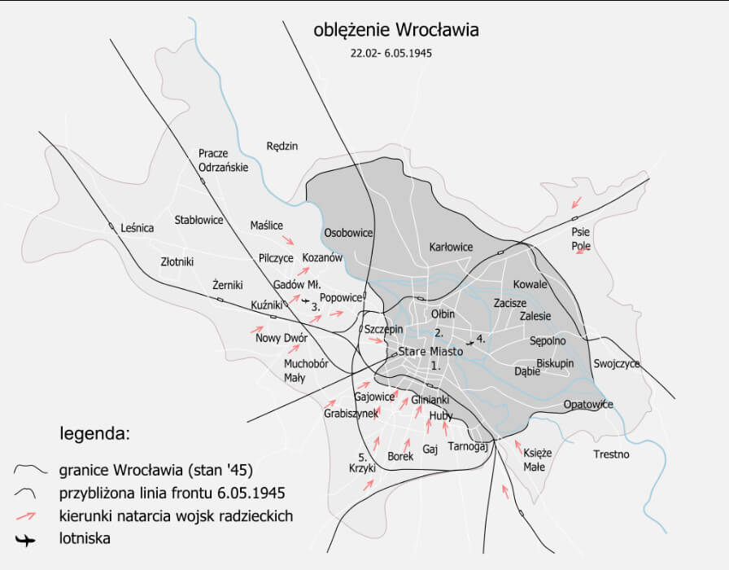

### ONZ

W San Francisco rozpoczęła się konferencja założycielska ONZ, w której wzięły udział delegacje 50 państw. Nie było wśród nich delegacji polskiej, choć Polska jako państwo znalazła się wśród członków-założycieli.

Konferencja trwała dwa miesiące, skończyła się 25 czerwca podpisaniem Karty Narodów Zjednoczonych, która weszła w życie 24 października 1945.

- ["65. rocznica konferencji Narodów Zjednoczonych w San Francisco"](https://dzieje.pl/aktualnosci/65-rocznica-konferencji-narodow-zjednoczonych-w-san-francisco)

### 2 Front Białoruski

Skończyły się walki w Szczecinie. Miasto zostało zdobyte przez 65 Armię.

- histmag ["Jak Stettin stał się Szczecinem"](https://histmag.org/jak-Stettin-stal-sie-Szczecinem-11384)

### 12 Armia

O świcie generał Wenck rozpoczął atak z linii Brandenburg - Bad Belzig na Poczdam, bo ten kierunek nie zapowiadał poważnego oporu.

Drogi były zatłoczone uciekinierami, więc posuwali się bocznymi drogami, unikając 5 Gwardyjskiego Korpusu Zmechanizowanego i 13 Armii sowieckiej. Niespodziewanie wbili się w nieosłoniętą flankę kolumn 6 Gwardyjskiego Korpusu Zmechanizowanego. Zdobyto tabory i park remontowy. W ciągu tego dnia pokonali ponad 20 km i dotarli do Beelitz 20 km od Poczdamu.

Przy okazji odbili wzięty do niewoli niemiecki szpital polowy z całą załogą i sprzętem medycznym; 3 tys. rannych. Szpital był w rękach sowieckich od trzech dni. Wywieźli rannych do bezpiecznej strefy nad Łabę.

### 9 Armia

Od wczoraj trwają próby połączenia 9 Armii z 12 Armią Wencka.

Bój rozgrywający się na południe od Berlina jest dramatyczny, bo dla 200 tys. żołnierzy jest to jedyna szansa na unikniecie sowieckiej niewoli. Dziś udało im się wedrzeć w styk 3 Gwardyjskiej Armii i 28 Armii, ale zostali zatrzymani pod Baruth.

### Torgau

- [Soviet and American soldiers share a dance upon their meet-up at the River Elbe near Torgau, Saxony, Germany. April 26th, 1945 / Elbe Day, April 25, 1945, is the day Soviet and American troops first met at the Elbe River, near Torgau in Germany, marking an important step toward the end of World War II in Europe. This contact between the Soviets, advancing from the East, and the Americans, advancing from the West, meant that the two powers had effectively cut Germany in two. / Elbe Day has never been an official holiday in any country, but in the years after 1945 the memory of this friendly encounter gained new significance in the context of the Cold War between the U.S. and the Soviet Union. ](https://www.facebook.com/jakoblagerweij/posts/pfbid02u2Ufb6H8U4kkh3rNU6thYft272DfjuGnputbdhLeMChkWuv9X3kFxFS7DVohnhC9l)

### Berlin

Siły obrońców topniały z każdą chwilą, a szans na posiłki nie było. Kończyła się amunicja.

<SeeAlso txt="Berlin do 1945" url="/festung-breslau/article/berlin-opis" />

Oba lotniska: Gatow i Tempelhof (Tegel zostało zbudowane dopiero po wojnie) były pod ogniem. Zdecydowano się więc oczyścić drogę pomiędzy Bramą Brandenburską a Kolumną Zwycięstwa i utworzyć tam prowizoryczne lotnisko śródmiejskie - podobnie jak we Wrocławiu.

24 kwietnia po południu teren był gotowy. O świcie 26 kwietnia eskadra Me Bf 109 zrzuciła 100 zasobników z amunicją na Tiergarten, ale tylko 1/5 udało się odzyskać, więc wysłano samoloty transportowe. O 1030 wylądowały dwa Ju 52 z ładunkiem, w drodze powrotnej zabrały rannych ze szpitala Charité, ale jeden z nich przy starcie uderzył w przeszkodę i roztrzaskał się, zabijając wszystkich na pokładzie.

Połączenie telefoniczne z resztą świata, które od dwóch dni szwankowało, ostatecznie zostało przerwane. Berlin został odcięty.

Ale wewnątrz miasta telefony działały. Podobnie jak we Wrocławiu brak komunikacji i chaos sprawił, że najlepszą metodą rozpoznania było dzownienie pod dowolny adres - jeśli odpowiadał nieprzyjaciel, był to teren utracony, jeśli swój można było rozpytać o sytuację.

Ogień był tak intensywny, że ciężko było zidentyfikować źródło, szczególnie w przypadku artylerii. Coraz większe góry ruin i coraz więcej trupów na ulicach. Mury pokryte były hasłami propagandowymi. Z relacji wiadomo o napisach "Najciemniejsza jest godzina przed świtem" i "Cofamy się, ale zwyciężamy!".

- Axis History Forum [propaganda writings on the walls](https://www.forum.axishistory.com/viewtopic.php?t=150523)

Drugi dzień Operacji Salut - na miasto uderzyło 563 bombowców z 18 Armii Lotniczej.

Coraz bardziej oczywiste było, że Armia Czerwona używa podziemnej sieci tuneli.

Opór stężał, gęsta miejska zabudowa była trudna do zdobycia. Napór wroga był bezlitosny. Generał Weidling przeniósł swoją kwaterę z Fehrbelliner Platz do budynków OKH na Bendlerstrasse (obecnie Stauffenbergstrasse, Bendlerblock). Również Axmann przeniósł sztab Hitlerjugend z Kaiserdamm 86 na Wilhelmstrasse 64.

#### Od północy

O świcie 79 Korpus Strzelecki ponowił próby przekroczenia Westhafenkanal. 3 batalion 756 Pułku Strzeleckiego usiłował przedostać się na wpół zniszczonym mostem pod osłoną ciężkiego ognia artylerii dywizyjnej. Poniósł przy tym poważne straty, tylko niewielu żołnierzom udało się przedostać, a i ci zostali odparci w kontratakach. Drugą falę ataku wspomogła kompania chemiczna, kładąc zaporę dymną i udało się ustanowić większy przyczółek niż poprzednio, a nawet przeciągnąć lekką artylerię. Ponieważ wszystkie konie zostały wybite w krzyżowym ogniu na moście, musieli ją ciągnąć żołnierze.

Silny punkt obrony na Stacji Beusselstraße trzymał się jakiś czas, ale czerwonoarmiści obeszli go i do wieczora wtargnęli do Moabitu. Zdobyli więzienie i wzięli do niewoli 100 strażników, uwolnili ponad 1200 schwytanych do niewoli żołnierzy sowieckich, którzy zostali nakarmieni, uzbrojeni i już następnego dnia rzuceni do walki.

#### Od wschodu

7 Korpus Strzelecki po szybkich postępach od Hohenschönhausen utknął przed Alexanderplatz.

SS Nordland atakowała pozycje 4 Gwardyjskiego Korpusu w Neukölln i 9 Korpusu Strzeleckiego w rejonie Görlitzer Bahnhof.

#### Od południa

8 Gwardyjska Armia Pancerna generała Czujkowa do południa zdobyła Tempelhof. Dotarła do Kreuzberga, gdzie zdobyła szpital z francuskimi jeńcami wojennymi oraz Viktoriapark, gdzie mogli umieścić artylerię. Już następnego dnia potężne 203 mm haubice wz. 1931 ostrzeliwały stamtąd Dworzec Anhalcki odległy o niewiele ponad kilometr.

Mając na prawej flance Kanał Landwehry wdarli się do Schöneberg i dotarli do Potsdamer Strasse, gdzie na południowo wschodnim rogu Heinrich-von-Kleist-Park (aka Kleistpark) 28 Gwardyjski Korpus Strzelecki w walce z silnym punktem obrony zdobył ważne skrzyżowanie. 34 Pułk Czołgów Ciężkich dotarł dalej w okolice kościoła 12 Apostołów na Kurfürstenstrasse.

Czujkow relacjonuje, że tego dnia jego żołnierze spostrzegli kolumnę 400 chłopców z Hitlerjugend paradującą z panzerfaustami, po chwili zaskoczenia otwarli ogień do dowódców i wszyscy się rozpierzchli.

Wystarczy rzut oka na mapę, żeby zobaczyć, że żołnierze Żukowa po raz kolejny przekroczyli linię graniczną wytyczoną przez Stawkę. Prąc na zachód, zdobywali obszar na południe od Landwehrkanal, z którego będzie można wyprowadzić atak bezpośrednio na Mitte, ale przy okazji blokowali Koniewowi drogę do Reichstagu. Co więcej i co bezpośrednio świadczy o intencjach ani 1 Front Ukraiński, ani walczące na południu Berlina jego oddziały, głównie 3 Gwardyjska Armia Pancerna generała Rybałki, nie zostały powiadomione o powyższych sukcesach. Pomiędzy oddziałami obu Frontów nie było żadnej łączności.

#### 1 Front Ukraiński

Tymczasem wojska 1 Frontu Ukraińskiego były kilometr na południe, przedzierały się przez gęstą zabudowę Friedenau i Schmargendorf bezpośrednio na południe od S-Bahn Ring i musiały przystosować się do nowych warunków walki w mieście.

55 Gwardyjska Brygada Pancerna po 15-minutowym bombardowaniu niemieckich pozycji na przedpolu Nikolassee i Havelberg ruszyła na północ, unikała otwartej przestrzeni magistrali AVUS i posuwała się wschodnim brzegiem Haweli przez Las Grunewald, po napotkaniu baterii flak osłaniającej lotnisko Gatow wezwano wsparcie lotnicze które ją zniszczyło. Z lasu wyjechali na zakręcie Heerstrasse (Ost-West-Achse), niedaleko od Stadionu Olimpijskiego i skręcili w prawo w kierunku Charlottenburga. Przedzierali się przez dzielnce mieszkaniowe. Napotykając coraz lepiej zorganizowany opór, do zmroku dotarli do składów amunicji przy nieukończonej Wehrtechnische Fakultät k. Teufelssee (planowany wydział wojskowy politechniki berlińskiej, obecnie Teufelsberg) i zajęli osiedle Eichkamp na południe od Messe Berlin. Sztab Brygady pozostał w lesie Grunewald.

10 Gwardyjski Korpus Pancerny 4 Gwardyskiej Armii Pancernej Koniewa pozostał w Berlinie, by zniszczyć resztki 20 Dywizji Grenadierów Pancernych i innych oddziałów grupy bojowej generała Reymanna: "Spree" w Wannsee i wyspy poczdamskiej.

18 Dywizja Grenadierów Pancernych, by nie zostać okrążona w paśmie jezior Grunewald, wycofała się do Wilmersdorf.

### Hitler

Do Berlina przyleciała hitlerowska walkiria Hanna Reitsch, Ślązaczka, urodzona w Jeleniej Górze (Hirschberg), która pierwsze doświadczenia lotnicze zdobywała na Górze Szybowcowej, doskonały pilot oblatywacz.

<SeeAlso txt="Kapitan Hanna Reitsch (1912-79)" url="/festung-breslau/article/hanna-reitsch" />

Reitsch i von Greim przylecieli z Rechlin do Berlina myśliwcem Focke-Wolf 190 w osłonie 20 myśliwców (7 z nich zostało zestrzelonych) w wersji szkoleniowej S, czyli dwumiejscowy - Greim był pasażerem a Reitsch była w luku bagażowym. Wylądowali na lotnisku Gatow. Stamtąd von Greim usiłował dodzwonić się do Hitlera, ale bez powodzenia.

Wsiedli do lekkiego samolotu obserwacyjnego Fieseler Fi 156 Storch. Pilotował go von Greim, Reitsch była pasażerką. Podczas startu osłaniały go myśliwce eskorty, ale zaraz potem zniknęli w gęstych dymach pożarów nad miastem. Nad Grunewald von Greim został poważnie ranny w stopę i zaczął tracić kontrolę nad sterami, Reitsch wychyliła się nad von Greimem, przejęła stery i wylądowała.

Natychmiast został zawieziony do Hitlera po to, tylko żeby się dowiedzieć, że ten mianował go dowódcą Luftwaffe w stopniu marszałka w miejsce Göringa zdymisjonowanego za zdradę. Miał natychmiast opuścić Berlin, ale był ranny i nie można było znaleźć transportu. Wszystkie sześć dostępnych Storchów wysłanych z Rechlin w eskorcie myśliwców zostało zestrzelone. Tak samo jak dwanaście Ju 52 z posiłkami SS.

Oboje przybyli, by przekonać Hitlera do ucieczki. Hanna bez chwili wahania ryzykowała życie, by w tych ostatnich chwilach być przy Hitlerze. Była zdecydowana zabić się z nim gdyby się na to zgodził.

### 2 Armia WP

Dopiero dziś polska 9 DP dostała rozkaz opuszczenia pozycji pod Dreznem. Jej dowódca pułkownik Aleksander Łaski zadecydował, że będą się poruszać w świetle dnia, bez rozpoznania jak na paradzie. Hitlerowcy zdobyli plany marszruty i zaatakowali w kilku miejscach, zabijając większość polskich żołnierzy: między Panschwitz-Kuckau i Crostwitz został zmasakrowany 26 pułk piechoty, w Guttau wymordowali cały szpital polowy, w którym było 300 rannych żołnierzy. Dowódca dostał się do niewoli, a cała dywizja straciła prawie połowę stanu.

W walkach pod Budziszynem poległo lub zaginęło prawie 8 tys. żołnierzy 2. Armii Wojska Polskiego, a 10,5 tysiąca zostało rannych.

### Czechosłowacja

Brno.

### Philippe Pétain

Ze Szwajcarii dobrowolnie powrócił i oddał się w ręce władz francuskich marszałek Philippe Pétain, szef kolaboracyjnego rządu Francji Vichy. Został umieszczony w fort de Montrouge tuż przy południowej granicy Paryża.

W lipcu odbył się proces przed Trybunałem Stanu. 15 sierpnia 1945 o czwartej rano poznał wyrok: karę śmierci przez rozstrzelanie. Z powodu wieku Petaina (89 lat) i jego zasług de Gaule zmienił wyrok na dożywocie. Petain zmarł w 1951 w wieku 95 lat.

### Sigmung Rascher i Karoline Diehl

Dziś na rozkaz Himmlera w KL Buchenwald zostali rozstrzelani Sigmung Rascher i jego żona monachijska śpiewaczka Karoline Diehl.

Rascher był lekarzem SS odpowiedzialnym za zbrodnicze eksperymenty na ludziach związane z lotnictwem. W 1941 mając 32 lata, ożenił się z 16 lat starszą Diehl, co wzbudziło niechęć Himmlera, podejrzewał bowiem, że ich dzieci nie będą zdrowe. Jednak mieli trójkę zdrowych chłopców, co poważnie przyspieszyło karierę Rachera. W 1943 została przyłapana podczas próby porwania niemowlęcia i okazało się, że wszystkie ciąże udawała, a dzieci pochodziły z sierocińca. W 1944 wydało się, że Rascher wiedział o tym oszustwie i też został aresztowany.

### Pawło Skoropadski

Od ran odniesionych podczas bombardowania zmarł w Bawarii Pawło Skoropadski ukraiński oficer i polityk. Oficer carski, podczas Wielkiej Wojny przeciwnik Petlury, zwolennik sojuszu z Niemcami, a potem połączenia Ukrainy z Rosją. Z tego powodu na emigracji od 1918. Podczas WWII był już pozbawiony złudzeń wobec hitlerowców, ale chciał ratować Ukraińców z obozów koncentracyjnych.

### Wrocław

Ukształtowana wczoraj linia frontu pozostała już do końca wojny, z relacji Ericha Schönfeldera:
>W kwietniu położenie twierdzy stało się wręcz tragiczne. Po zdobyciu lotniska, Gądowa, Pilczyc i Popowic Rosjanie rozwinęli od zachodu natarcie w głąb miasta i do 8 kwietnia wyszli na wysokość poznańskiej linii kolejowej. Zostali tu przejściowo zatrzymani zdecydowanymi kontratakami oddziału dział pancernych Rettera i batalionów Hitlerjugend, był to jednak sukces krótkotrwały. 18 kwietnia Rosjanie sforsowali wysoki nasyp linii kolejowej i nacierali w dwóch kierunkach. Po pierwsze – przez ogródki w stronę grobli odrzańskiej i strzelnicy wojskowej przy Długiej, następnie zaś koszary żandarmerii przy Poznańskiej. Po drugie – nacierali wzdłuż Legnickiej. W tym rejonie bronił się batalion wojsk kolejowych Pötsch oraz pododdziały pułku Mohr. 21 kwietnia mocno wykrwawiony pułk Mohr został zluzowany przez SS Besslein, który jednak również nie mógł całkowicie zatrzymać przeciwnika. Do końca kwietnia Rosjanie opanowali Plac Strzegomski i dotarli do Placu Solidarności i Placu Św Mikołaja oraz wyszli nad Odrę w rejonie stoczni rzecznej.

Do końca podobno rozważano przebicie się na południe do Sobótki. Takie plany były jednak tak nierealistyczne, że nie przystąpiono do realizacji, tym bardziej, że ostrzeżeni czerwonoarmiści zaminowali ruiny na froncie południowym, a generał Głuzdowski skierował tam główne siły, przede wszystkim 12 DP.

Verton wciąż dmie w trąbę:
>Z militarnego punktu widzenia, w danym momencie nie mieliśmy powodów do zaprzestania walki. Lecz sytuacja na tyłach dała o sobie znać w formie pierwszych poważnych wątpliwości, kiedy w naszej zdolności utrzymania ukazały się pierwsze, złożyliśmy przysięgę, która była dla nas świętością. Po drugie woleliśmy raczej umrzeć, niż stać się jeńcami wojennymi, przynajmniej u czerwonych. Ponadto nie mogliśmy nie myśleć o strasznej doli cywilów, takiej jakiej doznali już w Prusach Wschodnich i na Śląsku. Nie mogliśmy się poddać.

Ostateczna linia frontu przebiegała: od Lasku Osobowickiego do przystanku Osobowice, następnie na północny wschód od Polanowic, korytem Widawy do do Odry naprzeciw Wyspy Opatowickiej. W południowej części Opatowice, Nowy Dom i Bierdziany. Dalej Górna Oława na wysokości Parku Wschodniego i na zachód ulicami Piękną i Kamienną, łukiem do Lwowskiej, potem Skwierzyńska, Żelazna i Pereca do linii kolejowej w miejscu przecięcia się z Grabiszyńską; od Dworca Świebodzkiego, ulicą Braniborską do Inowrocławskiej i do Odry tak jak opisał Schönfelder w kierunku Kępy Mieszczańskiej.

*Linia frontu w końcu oblężenia Wrocławia. 
By [t](https://commons.wikimedia.org/w/index.php?title=User:Semper_fidelis~commonswiki&amp;action=edit&amp;redlink=1) - Praca własna, Domena publiczna, [Link](https://commons.wikimedia.org/w/index.php?curid=10619596)*

Dotychczasowy ostrzał artyleryjski i bombardowania wciąż były kontynuowane, tyle tylko, że odtąd bombardowano wrocławian i zrzucano na nich ulotki i sowiecką propagandę.

Laßmann:
>Przed wejściem do katedry i w jej wnętrzu piętrzą się sterty pocisków, które wyrządziły nam wielką łaskę, że nie eksplodowały. Jest ich bardzo dużo i są wśród nich niewybuchy całkiem dużego kalibru. Gdyby wszystkie eksplodowały, nic by już z Ostrowa Tumskiego nie zostało, a my wszyscy zostalibyśmy sproszkowani. Z oczywistych względów nie możemy grzebać zmarłych na cmentarzach miejskich. Ostatnie miejsce swojego wiecznego spoczynku znajdują najczęściej tam, gdzie zginęli. Żołnierze przy ulicy, której bronili w żarze płonących domów i trzasku pękających murów, ale obok nich także cywile, którzy zginęli tą samą śmiercią. Dla wszystkich rozumnych ludzi było jasne, że wojna jest przegrana. 
>Wszędzie w mieście widać małe, tymczasowe cmentarze: na wcześniejszych promenadach, skwerach, w ogrodach przed domami, na przykościelnych placach, na skrajach ulic, ale i pośrodku ruin. Gdzieniegdzie rzuca się w oczy nagrobek z małym, drewnianym krzyżem - to groby dzieci, które śmierć zaskoczyła, zanim zdążyły pojąć sens życia: groby małżonków, których śmierć zabrała razem: wiele grobów ludzi, którzy jedyne wyjście z bezmiaru tej niedoli znaleźli w samobójstwie, i na każdym kroku groby z napisem "Nieznany żołnierz" na zwykłym krzyżu. Na niektórych grobach leżą wiosenne kwiatki. 
>Dzisiejsza "Gazeta Frontowa" znów oferuje nam duby smalone: "Jak niezrównanie kieruje Führer obroną stolicy Rzeszy!". Wielki drań Joseph Goebbels, ten kłamca na potęgę, po raz ostatni zabiera tu głos. W odezwie do mieszkańców Berlina opublikowanej również w dzisiejszym wydaniu naszej "Gazety Frontowej" uderza w napuszony ton: "Nie potrzebuję specjalnie podkreślać, że naszym gorącym upragnionym celem jest i będzie oswobodzenie Berlina od bolszewickiego wroga całego świata, a tym samym uratowanie go przed zagładą. Bolszewizm w stolicy Rzeszy oznaczałby terror bez granic. Jestem przekonany, że Führerowi i ludności Berlina uda się wspólnym wysiłkiem odeprzeć nawałę mongolską. Sięgamy po nowe siły dla wsparcia obrony stolicy. Do ich nadejścia musimy zebrać wszystkie siły i całą naszą moc, aby się nie ugiąć. Naszym sercom nie wolno przy tym wahać się ani drżeć. Nasza duma i nasza ambicja ma przejawić się w tym, że doprowadzimy bolszewicki huragan, który ze wschodu uderza w serce Europy, do załamania na murach stolicy Rzeszy!
