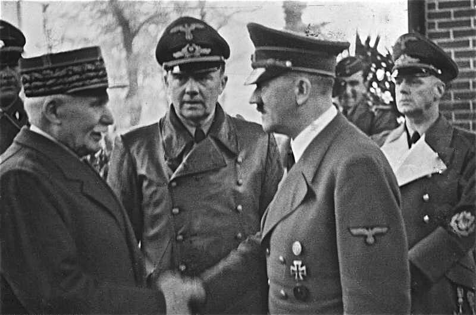
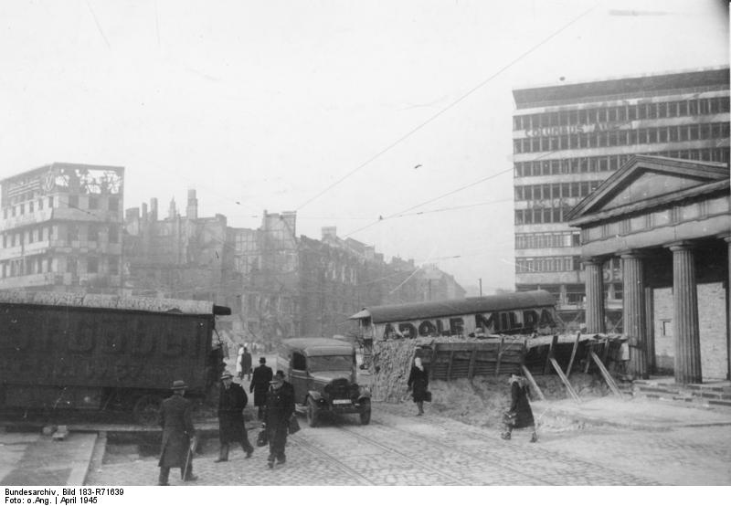

{/* 
*Henry Philippe Pétain, Paul Schmidt, Adolf Hitler, Joachim von Ribbentrop; Montoire-sur-le-Loir 1940-10-24 
By Bundesarchiv, Bild 183-H25217 / CC-BY-SA 3.0, [CC BY-SA 3.0 de](https://creativecommons.org/licenses/by-sa/3.0/de/deed.en), [Link](https://commons.wikimedia.org/w/index.php?curid=5364017)*  */}

### Argentyna

Wypowiedzenie wojny Niemcom. Argentyna w ostatniej chwili przyłączyła się do koalicji antyhitlerowskiej.

Równolegle rozpoczęła się wielka operacja ściągania Niemców, w tym także hitlerowców. Ruszą "szczurze ścieżki" (ang. ratlines) organizowane m.in. przez Watykan. Peronowska Argentyna stanie się hitlerowskim azylem.

- Powojnie ["Ucieczki nazistów do Argentyny po 1945 roku. Dlaczego Peron zapraszał do siebie Niemców?" [YT 12:39]](https://www.youtube.com/watch?v=9-i2KvRqiTk)

### Mussolini

Wczoraj Philippe Pétain opuścił Szwajcarię, by oddać się w ręce Francuzów. Od wczoraj Mussolini ucieka do Szwajcarii.

25 kwietnia Mussolini wygłosił ostatnie przemówienie w mediolańskim Teatro Lirico, a potem ukrył się w niemieckim transporcie zmierzającym do Austrii.

26 kwietnia kolumna pojazdów upuściła Como i jechała w stronę granicy.

27 kwietnia w Menaggio dołączyli faszyści z Mediolanu z Alessandro Pavolinim na czele.

Po południu konwój niemiecki został zatrzymany przez włoskich partyzantów komunistycznych w Dongo. Żadna ze stron nie chciała walki. Dla Niemców wojna się skończyła i od razu zgodzili się oddać wszystkich Włochów, jeżeli zostanie im zapewniona wolna droga. Dla Włochów Niemcy, którzy już nie walczą nie byli wrogiem.

Podczas przeszukania pojazdów Mussolini został rozpoznany, zatrzymano także jego kochankę Clarę Petacci. Oboje zostali przewiezieni do Mezzegra, gdzie umieszczono ich pod strażą na prywatnej kwaterze. To była ich ostatnia noc.

### Berlin

<SeeAlso txt="Bitwa o Berlin" url="/festung-breslau/article/berlin-1945" />

Mapa: [Die Schlacht um Berlin, 26. April bis 2. Mai 1945](https://www.bundeswehr.de/de/organisation/weitere-bmvg-dienststellen/zentrum-militaergeschichte-sozialwissenschaften/podcasts-und-karten/zmsbw-aktuelle-karte-schlacht-um-berlin-1945-2963814)

Poruszanie się w zniszczonym mieście było utrudnione, z powodu dużych ilości metalu kompasy nie działały sprawnie, ulice były zablokowane, niebo zasnute dymem, mapy, jeśli były, to były trudne w odczytaniu. Radio nie działało. 100 m czasem robiono w 2 godziny.

#### Od północy

Padło lotnisko Gatow (zbudowane w 1934 jako szkolne lotnisko Luftwaffe, późniejsza baza RAF). Sowieci doszli do Haweli, cały zachodni brzeg rzeki został oczyszczony.

2 Gwardyjska Armia Pancerna: 1 Zmechanizowany i 12 Gwardyjski Korpus Pancerny nadal walczyły w Siemensstadt i dotarły do brzegów Szprewy od połączenia z Hawelą po Westhafenkanal na wschodzie. Wszystkie mosty zostały wysadzone, ocalała tylko kładka piesza na śluzie na Szprewie. Części 35 Brygady Zmechanizowanej udało się dostać na tory wyścigowe Ruhleben (obecnie wodociągi) i przypadkowo zbiegło się to z uderzeniem od południa prowadzonym przez 55 Gwardyjską Brygadę Pancerną, wkrótce potem wzmocnioną przez rezerwy 7 Gwardyjskiego Korpusu Pancernego: piechotę zmechanizowaną, batalion rakietowy, 10 ciężkich czołgów IS-2, kompanię dział samobieżnych i dwie brygady artyleryjskie.

Gwoli wyjaśnienia - dlaczego nie ma mowy o synchronizacji ataku: otóż 55 Gwardyjska Brygada Pancerna była w składzie 7 Gwardyjskiego Korpusu Pancernego z 3 Gwardyjskiej Armii Pancernej generała Rybałki. Tak więc w rejonie Stadionu Olimpijskiego nic nie wiedząc o sobie, zetknęły się oddziały 1 Frontu Białoruskiego i 1 Frontu Ukraińskiego.

Obie brygady nawiązały kontakt w południe na Charlottenburger Chaussee. Po czym 35 Brygada Zmechanizowana wycofała się za Szprewę pozostawiając Westend żołnierzom Koniewa. Czekało ich trudne i ryzykowne zadanie, bo była to główna ewentualna droga ucieczki z Berlina, więc opór wzmacniały tu elementy 18 Dywizji Grenadierów Pancernych.

Tymczasem 79 Korpus Strzelecki podążał przez Moabit w kierunku południowo wschodnim - ku wielkiej nagrodzie, po drugiej stronie Szprewy była już dzielnica rządowa i bezpośrednio 500 metrów od Szprewy Reichstag. Oczyszczenie Moabitu Korpus pozostawił oddziałom 2 Gwardyjskiej Armii Pancernej. Walki wciąż trwały, można było ominąć punkty silnego oporu i zdobyć resztę. Pozostawieni w izolacji żołnierze wroga, pozbawieni wody i wsparcia przeżywali koszmar, szczególnie w nocy, kiedy dochodziły ich odgłosy pijanej orgii i krzyki gwałconych kobiet. Część z nich nie brała pod uwagę kapitulacji, byli to własowcy, którzy doskonale rozumieli, co krzyczą do nich czerwonoarmiści.

Choć regulaminy i instrukcje Stawki podkreślały wagę walki w nocy (doświadczenie stalingradzkie), w Berlinie noc była przeznaczona na pijatyki, grabież, morderstwa i gwałty. Szczególnie w rejonie operacji 12 Gwardyjskiego i 7 Korpusu Strzeleckiego sytuacja wymknęła się spod kontroli ich własnych oficerów. W nocy z przeciwnikiem walczyła tylko artyleria, nękając go nieustannym bombardowaniem.

W terenie operacji 3 Armii Uderzeniowej sytuacja była wciąż trudna. Walczyła tam 9 Dywizja Spadochronowa niemiecka i Humboldthain Flakturm, silnym punktem oporu był Stettiner Bahnhof (obecnie Nordbahnhof).

3 Armia Uderzeniowa zbliżała się do Prenzlauer Berg.

#### Od wschodu

W rejonie 5 Armii Uderzeniowej panował chaos, w całej okolicy rozrzucone były lokalne punkty oporu, walki toczyły się w rejonie Alexanderplatz aż po Szprewę, czerwonoarmiści ominęli Friedrichshain Flakturm i walczyli o Schlesischer Bahnhof (obecnie Ostbahnhof).

Po drugiej stronie Szprewy 9 Korpus Strzelecki w drodze przez Kreuzberg dotarł do Moritzplatz.

#### Od południa

Presja 8 Gwardyjskiej Armii Pancernej generała Czujkowa zmusiła Niemców do wycofania się za Landwehrkanal w nocy z 26 na 27 kwietnia. Do bunkra Hitlera było już tylko 2 km. Na wschodnim odcinku SS Nordland atakował 9 Korpus Strzelecki w rejonie Görlitzer Bahnhof. Bardziej na północ aż po Alexanderplatz broniła się Dywizja Pancerna Müncheberg.

Główne siły 8 Gwardyjskiej Armii Pancernej dotarły do linii Landwehrkanal. W centrum 28 Gwardyjski Korpus Strzelecki. Zabezpieczył cały teren od Heinrich-von-Kleist Park przez Nollendorfplatz do Lützowplatz (czyli linia obecnej Karl-Heinrich-Ulrichs-Straße), choć te dwa ostatnie pozostały w rękach niemieckich, a bateria artylerii na Lützowplatz prawie do samego końca stawiała opór. Ciężkie walki toczyły się o Corneliusbrücke na Budapester Strasse (przy Zoo). Sowieckie czołgi przełamały tam mur Zoo i strzelały do Tiergarten Flakturm.

Czujkow umieścił swój sztab w Schulenburgring 2, blisko zarówno do Lotniska Tempelhof jak i Victoriapark. Zdecydował, że następnego dnia jego wojska poświęcą na rozpoznanie i odpoczynek a obowiązek nękania przeciwnika przejmie artyleria. Przez Landwehrkanal wysłano kilka patroli. Meldunki niemieckie mówią tego dnia o walkach w rejonie Potsdamer Bahnhof i Hallesches Tor Brücke, kilka sowieckich czołgów wjechało na Wilhelmstrasse.

Czujkow miał we współpracy z 79 Korpusem Strzeleckim atakującym Reichstag od północy i 5 Armią Uderzeniową nacierającą z zachodu oczyścić południową część Tiergarten i rejon dworców Poczdamskiego i Anhalckiego.

#### Cytadela

Mohnke umieścił haubice 10,5 cm leFH na Gendarmenmarkt dla ostrzału Belle-Alliance-Platz (obecnie Mehringplatz), na Pariser Platz skierowane na Unter den Linden oraz na Leipziger Strasse wycelowane w Spittelmarkt. Każda miała tylko 12 pocisków, po wystrzeleniu ostatniego artylerzyści mieli wejść w skład piechoty.

Generał Krukenberg przeniósł siedzibę sztabu na stację Stadtmitte U-Bahn skrzyżowaniu Mohenstrasse i Friedrichstrasse.

#### Plac Poczdamski

Żeby uniemożliwić sowietom korzystanie z podziemnych tuneli, zatapiano je. Otwarto przepusty na Landwehrkanal między mostami Schöneberger i Möckern, ale spowodowało to zalanie siedziby sztabu obrony na Placu Poczdamskim. Napływ wody był tak nagły, że uniemożliwił ewakuację słabszych ludzi. Chorzy, dzieci, zadeptani pozostali pod wodą.

Już 24 kwietnia o zalewanie podziemnych tuneli dopytywał Martin Bormann i specjaliści z BVG odpowiedzieli mu, że efekt jest chwilowy i jest to działanie nieskuteczne. Ponieważ Berlin jest na piaskach woda szybko wsiąknie. Takie akcje przeprowadzał jednak kapitan Gerhard Boldt bezpośrednio na rozkaz Hitlera. W tunelach ukrywało się tysiące cywilów i rannych.

W pobliżu eksplodował skład panzerfaustów.

Bezpośrednie trafienie pociskiem rozsmarowało ciała ofiar na ścianach wejścia do stacji.

*Plac Poczdamski 
By Bundesarchiv, Bild 183-R71639 / CC-BY-SA 3.0, CC BY-SA 3.0 de, [Link](https://commons.wikimedia.org/w/index.php?curid=5368518)*

#### 1 Front Ukraiński

3 Gwardyjska Armia Pancerna generała Rybałki wkroczyła do Charlottenburga i Grunewaldu. Walczyła już w obębie wewnętrznej strefy obrony. Opór był zaciekły, szczególnie w rejonie stacji S-Bahn Schmargendorf i pobliskiego Hindenburgpark (obecnie Volkspark Wilmersdorf). Najcięższe walki toczyły się o Fehrbelliner Platz, gdzie Niemcy trzymali się jeszcze przez trzy dni. Kiedy wyeliminowano ostatni punkt oporu, oddziały Hitlerjugend na samochodach atakowały panzefaustami w całym obszarze Wilmersdorf.

Tu warto dodać, że Charlottenburg-Wilmersdorf to rejon, w którym znajduje się obecnie polska ambasada. Była to dawna siedziba polskiej misji wojskowej w Berlinie. Ambasadę kiedyś jeszcze za PRL-u mieliśmy na Unter den Linden, ale na początku lat 90. XX wieku budynek został rozebrany i od tamtego czasu Polska nie jest w stanie zbudować nowej siedziny ambasady. Mamy dziurę w ziemi i płot w najlepszym adresie w Niemczech. Natomiast ambasada i konsulat jest kilka km od centrum w słabo skomunikowanej dzielnicy willowej.

### Hitler

Bunkier Hitlera stracił łączność z ostatnimi jednostkami poza Berlinem. Byli już odcięci. Mogli tylko słuchać radia i mieli łączność telefoniczną w obrębie miasta. Słuchano niemieckiej rozgłośni BBC, która podawała wiarygodne informacje o przebiegu wojny oraz hitlerowskiej rozgłości Radia Hamburg.

Podczas wieczornej konferencji Hitlera nagle zaniepokoiła nieobecność generała Hermanna Fegeleina, oficera łącznikowego Himmlera i szwagra Evy Braun. Okazało się, że nie ma go już od trzech dni. Podejrzewając dezercję Hitler rozkazał by go odnaleźć.

Znaleziono go w apartamencie na Bleibtreustrasse (boczna Kurfürstendamm). Ponieważ nie odpowiedział na wezwanie, wysłano po niego żonierzy. Był pijany, nieogolony i nieodpowiednio ubrany. Obiecał się doprowadzić do porządku. Następny patrol zastał go już odpowiednio ubranego i ogolonego, ale jeszcze bardziej pijanego. W zasadzie nie mieli prawa go aresztować, bo był wyższy stopniem, ale rozkaz pochodził bezpośrednio od Hitlera. Zastali też kobietę i wyglądało na to, że się pakują. Kobieta pod pretekstem znalezienia czystych szklanek oddaliła się do kuchni. Po chwili okazało się, że uciekła przez okno. Fegelein ze znalezioną przy nim walizką został odprowadzony do Kancelarii Rzeszy i uwięziony w oczekiwaniu na proces, który nie mógł się odbyć natychmiast, bo musiał wytrzeźwieć.

W międzyczasie pułkownik SS z eskorty Fegeleina zameldował Bormanowi, że w walizce znajdują się kosztowności, pieniądze i dokumenty. Zaczęli podejrzewać, że to Fegeleien jest poszukiwanym przez nich od kilku miesięcy źródłem przecieków z bezpośredniego otoczenia Hitlera, a owa kobieta jest brytyjską agentką. Przekazali sprawę szefowi Gestapo Heinrichowi Müllerowi. Nad Fegeleinem zbierały się czarne chmury.

Kim była ta kobieta? Do dziś tego nie wiadomo.

### 1 Front Białoruski

Na drodze do Łaby 47 Armia sowiecka dotarła do Rathenow i Fehrbellin i wtedy się zatrzymała z powodu napotkania oporu ze strony XLI Panzerkorps generała Rudolfa Holste. Nie mogła nacierać dalej, nie mając wsparcia na flankach.

### 9 Armia

12 Armia Wencka walcząc o połączenie z 9 Armią wieczorem dotarła do Ferch. To był punkt krytyczny bitwy o wyrwanie się z sowieckiej niewoli, już nawet nie żołnierzy 9 Armii, ale setek tysięcy Niemców.

Propaganda hitlerowska wciąż pracowała, publikowano artykuły, wciąż drukowano Völkischer Beobachter (chociaż ostatnie numery z końca kwietnia nie były dystrybuowane), radio zapewniało o sensie walki i jakimś tam zwycięstwie. Ale nawet najbardziej zatwardziali hitlerowcy w zwycięstwo nie wierzyli.

Pierwotnie połączenie obu armii miało zapewnić przewagę niemiecką na południu Berlina i zablokować uderzenie 1 Frontu Ukraińskiego. Taki plan zaakceptował Hitler i być może w taki wojskowy sens tej operacji wierzył Jodl kiedy go przedstawiał. Jednak dla dowództw Armii i przede wszystkim dla 200 tys. żołnierzy nie była to już walka o zwycięstwo, walka z nieprzyjacielem, czy walka dla Niemiec, albo Führera - jedyne o co walczyli to niewola amerykańska, bezpieczne obozy przejściowe i ucieczka przed sowietami. Wciąż mieli na to nadzieję.

### Felix Steiner

Steiner został zmuszony przez generała Heinriciego do rezygnacji z 7 Dywizji Pancernej i 25 Dywizji Grenadierów Pancernych przydzielonych do latania resztek frontu na Odrze. Heinrici brew rozkazom Keitla umieścił je na linii Neubrandenburg - Neustrelitz, w celu osłony wycofujących się jednostek reszty Grupy Armii Wisła.

### Samobójstwa hitlerowców

Hitlerowiec się zabija: Hans Schleif, architekt, archeolog, SS-man. Był badaczem mającym międzynarodową reputację, nie był gorliwym hitlerowskim wandalem i nie wykonywał wszystkich zaleceń Gestapo.

Dziś o 11 rano w Berlinie zabił swoich synów bliźniaków i drugą żonę, którą poznał jako asystentkę z ramienia Ahnenerbe, a na końcu siebie.

### 1 Front Ukraiński

27 kwietnia 2009 w Podłej Górze koło Świebodzina rozpoczęto ekshumacje zwłok niemieckich żołnierzy i cywilów, zamordowanych przez Armię Czerwoną i zakopanych w masowych grobach w 1945.

### 2 Armia WP

W tym samym czasie kiedy porzucono resztkę wiary w pomoc Schörnera i nawet Niehoff zrozumiał, że feldmarszałek nie przyjdzie na piechotę, by podać mu rękę (choć przyznaje to tylko między wierszami swoich wspomnień). Grupa Armii Środek zadała swój ostatni śmiertelny cios.

Ta ostatnia kampania generała Karola "Waltera" Świerczewskiego kosztowała 2 Armię około 10 tysięcy zabitych, wielokrotnie większe straty w rannych i utratę większości sprzętu wojennego. W normalnym wojsku ktoś z brakiem doświadczenia i podobnym dorobkiem jak generał Walter nigdy by nie dostał całej Armii, a po takiej klęsce stanąłby przed sądem polowym, ale była to sytuacja podporządkowana potrzebom politycznym i Świerczewski był potrzebny nowym polskim i sowieckim władzom. Za masakrę pod Budziszynem nie spotkała go żadna kara, a dzieje tej bitwy zatuszowano. Co więcej, spadł na niego deszcz zaszczytów i 11 maja otrzymał awans na generała brygady. Walki w rejonie Budziszyna - choć już pozbawione znaczenia - trwały do końca kwietnia.

Po uporządkowaniu przez marszałka Koniewa kompletnego chaosu, w jakim znalazła się polska 2 Armia pod Budziszynem, nastąpił kolejny tragiczny rozdział tej kampanii.

9 Dywizja Piechoty, która bez żadnej przyczyny pozostała pod Dreznem, wczoraj dostała rozkaz wycofania się w rejon koncentracji, gdzie resztki polskich sił mogły spełnić przeznaczone im zadanie, czyli osłaniać lewą flankę 1 Frontu Ukraińskiego.

Być może biorąc przykład ze swojego słynnego dowódcy, szef dywizji pułkownik Aleksander Łaski zarządził odwrót jak na paradzie, nie dbając o zachowanie tajemnicy tajemnicy wojskowej i zabezpieczenie kolumn zwiadem i osłoną dopuścił do tego, że Niemcy zdobyli mapy sztabowe z naniesioną marszrutą i mogli przygotować kilka śmiertelnych zasadzek, w wyniku której Dywizja straciła prawie połowę stanu osobowego i cały sprzęt ciężki.

Najbardziej tragicznym epizodem tych walk była egzekucja (nie da się tego nazwać inaczej) ewakuowanego spod Drezna szpitala polowego, podczas której zamordowano ponad 300 ciężko rannych żołnierzy polskich.

### Operation Bodysnatch

W kopalni soli w Bernterode (Turyngia) Amerykanie odnaleźli osobliwy skarb III Rzeszy, oprócz dzieł sztuki i zabytków, ukryte tam tumby grobowe ewakuowane z Kościoła Garnizonowego w Poczdamie: Fryderyka II Wielkiego, Fryderyka Wilhelma I, Paula von Hindenburga i jego żony.

W marcu 1943 z powodu bombardowań i zagrożenia kościoła, który dla pruskiej państwowości i hitlerowców był rodzajem sanktuarium, przenieśli tumby do bunkra w Poczdamie, a kiedy zbliżała się Armia Czerwona, w marcu 1945 wywieźli do Turyngii i ukryli w kopalni soli.

I kiedy Amerykanie wydobyli trumny, zaczęły się problemy. Co z nimi zrobić? Sowiecka strefa okupacyjna i brytyjska odpadała. Zarówno jedni jak i drudzy mieli swoje ważne powody, dla których nie chcieli Hohenzollernów. Jedyne posiadłości Hohenzollernów znajdowały się w Zagłębiu Saary. Była to francuska strefa okupacyjna. Francuzi odmówili. W końcu dało się znaleźć jakiś zamek mający powiązanie z Hohenzollernami koło Frankfurtu nad Menem - Zamek Kronberg (Hesja). Ale po niezwykle śmiałej kradzieży klejnotów wartych ponad 100 mln dolarów dokonanej na zamku, nie był to już dobry pomysł.

Ostatecznie wybrano kościół pw. św. Elżbiety w Marburgu. Wszystkie trumny zostały tam umieszczone 19 sierpnia 1946. Minęło 479 dni. Pochówki zostały zabezpieczone stalowymi płytami i wielotonowym blokiem piaskowca.

We wrześniu 1952 Hohenzollernów przeniesiono do zamku Hohenzollern (Badenia-Württembergia).

Ostatecznie w 1991 w 205 rocznicę śmierci Fryderyka II spełniło się jego życzenie - został pochowany w przygotowanym przez siebie grobowcu w Sanssouci. Jest to prosta krypta znajdujaca się w pobliżu jego prywatnych pokojów w pałacu, ktory tak naprawdę jest parterowym ciągiem kilkunastu pomieszczeń na szczycie wzniesienia dawnej winnicy. Fryderyk ile razy wyglądał przez okno widział swój przyszły grób. Nie ma tam żadnych rzeźb czy pomników, tylko płyta z napisem "FRIEDRICH DER GROSSE". Zwykle jest obłożona ziemniakami. Stary Fryc bowiem miał przydomek "kartoflanego króla" ponieważ to jemu przypisuje się wprowadzenie powszechnej uprawy ziemniaków, które wielu jego poddanych uratowały od śmierci głodowej.

- [Operation Bodysnatch](https://uselessinformation.org/operation_bodysnatch/index.html)
- Mark Felton Productions ["Operation Bodysnatch 1945 － The Weirdest Monuments Men Mission" [8:44]](https://www.youtube.com/watch?v=yWVtJq_RRfc)

### Pilatus P-2

Dokonano oblotu szwajcarskiego samolotu szkolno-treningowego Pilatus P-2.

### KL Stutthof

Stutthof: 27 kwietnia z Helu wypłynęły 4 barki: "Wolfgang" i "Vaterland" (po ok 1000 osób) i dwie inne z 600 i 500 ludźmi. Nie były przystosowane do podróży pełnomorskiej, więźniów stłoczono w ładowniach. Nazwano je barkami śmierci.

W sumie w takich warunkach z KL Stutthof i podobozu w Gdyni ewakuowano 5 tys. ludzi. Śmiertelność wynosiła 50%.

### Dolny Śląsk

SS w rejonie Strzelina - rozkład sił i dezercje. [STREHLEN - STRZELIN 1945](https://www.facebook.com/bobr1945/posts/3468105069969798)

### Wrocław

Wiosna wreszcie zaatakowała z całą bezwzględnością, wśród ruin i niepochowanych zwłok rozkwitły kwiaty i zazieleniły się drzewa. Temperatura dochodzi do 25 stopni w cieniu. Śpiewały ptaki, a ciepłe powietrze wygoniło ludzi z piwnic. Wyszli tym chętniej, że sowieci najwidoczniej pogodzili się z tym, że twierdza Wrocław się nie podda. Nie miało to już żadnego znaczenia.

Wszyscy, którzy mieli dostęp do radia, otwarcie słuchali niemieckich audycji BBC i wiedzieli, że od kilku dni walki toczą się w Berlinie. Od razu dowiedzieli się o spotkaniu wojsk alianckich w Torgau. Uczyniono z tego wielkie wydarzenie z udziałem reporterów, którzy wykonali wiele historycznych zdjęć mających symbolizować siłę i trwałość sojuszu aliantów.

Armia Czerwona przestała atakować Wrocław, Głuzdowskiemu odebrano wojsko i amunicję do wykonania zupełnie niepotrzebnego zadania, bo była potrzebna Koniewowi w walce, która miała znaczenie. Nie ulegając kapitalistycznej przebiegłości w wyszukiwaniu celu i ważeniu strat do zysków, prostolinijny Stalin ani na moment nie dał się zbić z tropu i wiedział gdzie uderzyć, by zabić swojego dawnego sojusznika. Swój swego rozpozna, umysł tyrana wie, że tyran nie opuszcza gniazda, prędzej zginie niż ucieknie. Gdy Wehrmacht był pod Moskwą, Stalin pozostał na Kremlu. Gdy Armia Czerwona szła na Berlin, Hitler nie zamierzał opuścić stolicy. Czy Stalin wiedział, że Hitler jest w Berlinie? Możliwe. Ale nawet gdyby nie wiedział, zdawał sobie sprawę ze znaczenia, jakie będzie miało zdobycie stolicy. Nawet jeśli by Hitler uciekł, nawet gdyby niemieckie dowództwo przeniosło sztab, po zdobyciu stolicy pozostałoby mu tylko dobicie wroga. Dla Stalina na poziomie orwellowskiego kiszkoczucia było oczywiste znaczenie Berlina jako celu. Berlin był Moskwą, której Hitler nie zdobył.

O tym, jak bardzo awangardy obu Frontów wyprzedziły ostrożność świadczą dwie rzeczy - wczoraj zdobyty został Szczecin (Stettin) i do dziś wojska feldmarszałka Schörnera są pod Ślężą (niem. Zobtenberg). Uderzenie, które nakazał Stalin swoim marszałkom powiodło się tylko dlatego, że niemieckie wojsko było pozbawione zdolności ofensywnej a sztab podlegał rozkazom dowództwa politycznego, które najpierw popełniło serię poważnych błędów strategicznych, a potem pogrążyło się w zupełnym chaosie. Schörner pod Sobótką? Ale gdzie? Nikt we Wrocławiu tego nie wiedział, do ostatnich dni dowództwo twierdzy rozważało przebicie się do Schörnera, chociaż było oczywiste, że resztki wrocławskiego garnizonu wykrwawią się podczas tej próby ucieczki, ale nawet mała szansa na wydostanie się dla wielu żołnierzy była lepsza niż niewola.

Nikt nie wierzył w sowieckie gwarancje, tylko perspektywa śmierci i zupełny brak nadziei na inne rozwiązanie mogły przekonać do poddania się. Ostatecznie zarzucono ten plan, ale niekoniecznie ze względów czysto wojskowych. Okazało się bowiem, że ze względu na powszechną militaryzację pozostałych we Wrocławiu cywilów nie da się utrzymać żadnej ważnej operacji wojskowej w tajemnicy i natychmiast po wydaniu rozkazu o koncentracji sił na południu zjawią się tam tysiące cywilów, czyniąc walkę i ewakuację zupełnie niemożliwą. Żołnierz SS Georg Haas pisał:
>Tylko jedna pogłoska nas jeszcze trzyma [...] pogłoska o bliskim wyzwoleniu [...] tam na Ślęzy jest armia Schörnera [...] już wkrótce, może nawet jutro przyjdą nas wyzwolić. Do tego czasu musimy się trzymać.

Peikert w tych dniach wiele uwagi poświęca wyniszczającym bombardowaniom, lotnictwo sowieckie nie zaprzestało ataków. Ale bombardowani nie mieli wątpliwości, kto jest ich prawdziwym wrogiem. Zwycięstwo Armii Czerwonej było od dawna przesądzone, niewola z wszystkimi jej konsekwencjami była nieunikniona. Tego się nie dało zmienić. Tym co każdego dnia pogarszało sytuację, był upór dowództwa i bezwzględność tyranii twierdzy i prawa wojennego. Wszystkie te ofiary były niepotrzebne. Hartung z wyraźną niechęcią opisuje wziętych do niewoli lotników sowieckich, którzy palili papierosy z obojętnością, wiedząc, że ich niewola nie potrwa długo. Wszyscy wiedzieli, że to ostatnie dni, wszyscy też wiedzieli, że do końca będą ginąć ludzie. W tej sytuacji doszło do rzadkiego w społeczeństwie niemieckim buntu, jak pisze Hargreaves:
>Na Sępolnie i Biskupinie we wschodniej części miasta wiele kobiet otwarcie rzuciło wyzwanie panującemu reżimowi, demonstrując przed siedzibą lokalnej Ortsgruppe. Skandowały "Wir wollen keinen Krieg!" ("Nie chcemy więcej wojny!") oraz "Unsere Mãnner hier!" ("Oddajcie nam naszych mężczyzn!"). Pojawił się zastępca miejscowego lidera partyjnego. Zażądał żeby kobiety się rozeszły i stwierdził, że wbijają nóż w plecy własnym żołnierzom. Tłum wybuchnął śmiechem. Ludzie machali chusteczkami i kawałkami metalu radzieckim bombowcom, które przelatywały nad głowami. Rzucono wyzwanie władzy sprawowanej przez partię i partia na to wyzwanie odpowiedziała. Na Sępolno wysłano wojsko, żeby rozpędzić demonstrację. Kilka kobiet zostało aresztowanych. Niektóre źródła twierdzą, że później rozstrzelano osiem z nich. inne że siedemnaście, a jeszcze inne, że około setki.

Walter Laßmann pisze o tym 1 maja:
>Swemu przekonaniu o bezcelowości dalszej obrony Wrocławia i dalszego szafowania życiem ludzkim dali najpierw wyraz mieszkańcy Sępolna. W ostatnich dniach kwietnia tłumy wzburzonych kobiet manifestowały tam z białymi flagami w dłoniach przed lokalami partyjnymi i budynkami wojskowymi, żądając zaprzestania walk. SS aresztowała potem przywódczynie buntu, ale raz rozbudzony duch oporu nie dał się już stłumić.

Przypis do tego fragmentu podaje, że liczba protestujących mogła sięgnąć nawet 1500 osób, a do podobnych wystąpień doszło na Biskupinie i w Karłowicach.

Przypomina to dzieje innego protestu z 1943 w Berlinie - [Protest na Rosenstraße](https://pl.wikipedia.org/wiki/Protest_na_Rosenstra%C3%9Fe), który pokazał, że państwo hitlerowskie, chociaż świetnie radzi sobie z drobnymi grupkami takimi jak Biała Róża i potrafi okłamać lub zastraszyć społeczeństwo, natomiast jest bezradne wobec dużych protestów społecznych. Przemilczany, bo bardzo niewygodny politycznie, protest berliński pokazuje, że społeczeństwo obywatelskie nie pozwoliłoby na sukces tyranii. Ale ci wszyscy dobrzy Niemcy nie potrafili nauczyć się tego w porę, musieli ich tego nauczyć Amerykanie.

<SeeAlso txt="Sophie Scholl" url="/festung-breslau/article/sophie-scholl" />

Tymczasem jak pisze Laßmann propaganda hitlerowska właśnie pisała o kobietach:
>"Gazeta Frontowa" przynosi dwie ciekawe wiadomości: "Kobiety pomogą zwyciężyć! W ostatnich dniach wiele kobiet i dziewcząt zostało w naszej twierdzy żołnierzami, noszą mundury Wehrmachtu i dostały bezpośrednie przydziały wojskowe, zastępując wielu mężczyzn. Swoją służbę sprawują z zapałem i poczuciem obowiązku. Druga godna uwagi wiadomość brzmi: "Fuhrer pozbawił Goeringa stanowiska naczelnego dowódcy sił powietrznych." Snujemy w twierdzy na ten temat domysły i przeczuwamy rozkład w najwyższych kręgach władzy.

Hugo Hartung choć też przyznaje, iż bombardowania nie ustały, czuje się bezpiecznie:
>Po południu wspinam się na wieżę, gdzie dyżuruje wartownik z lornetą nożycową. Pozwala mi przez nią spojrzeć. Patrzę na terytorium wroga po drugiej stronie Widawy. Widzę stacjonujące tam rosyjskie samoloty i kopiasto wyładowane wozy drabiniaste, wśród których krzątają się małe postacie: "wróg"! Na północnym obszarze pomiędzy pozycjami wojsk panuje spokój i wiosenna zieleń. Serce boli gdy spoglądam na południe, ponad zniszczonymi domami i wypalonymi kikutami wież, aż po majaczące w oddali góry. Rozpoznaję wieżę ciśnień przy Alei Wiśniowej i tuż obok wieżę kościoła pw św Augustyna. Pomiędzy nimi znajdowało się nasze mieszkanie, w którym byliśmy tacy szczęśliwi. Wczoraj pułkownik pokazał mi w biurze zdjęcie lotnicze ul. Sudeckiej i wyraźnie na nim rozpoznałem ruiny naszego domu

Gwoli ścisłości - dokładnie pomiędzy wieżą ciśnień a kościołem pw. św. Augustyna znajduje się dawny szpital żydowski. Hartung zdaje się być kolejnym poczciwym wrocławianinem, który kompletnie nic nie wie, gdzie podziali się wrocławscy Żydzi, którzy z pewnością też mogli powiedzieć o Wrocławiu że było to miejsce "w którym byliśmy tacy szczęśliwi". Do czasu kiedy ogromna część poczciwych wrocławian zagłosowała na Hitlera.

Interesująca jest informacja o zdjęciu lotniczym, najwidoczniej Luftwaffe latała nad Wrocławiem także w dzień, jest to tym bardziej dziwne, że dwa dni temu, 25 kwietnie wg niekompletnych danych na Wrocław został zrzucony ostatni ładunek. Miało to być 23 tony amunicji w zasobnikach, co również jest zastanawiające, ponieważ od początku kwietnia z braku bombowców zaopatrzenie Wrocławia zrzucano z Messerschmittów Bf 109. Tym razem nad Wrocławiem pojawiła się poważna flota powietrzna w liczbie 12 samolotów He-111 i 18 Ju-52. Skąd się wzięły?

Z końca kwietnia pochodzi również najsłynniejsze zdjęcie z bitwy o Wrocław, jak pisze Richard Hargreaves:
>Fotograf pisma "Za cziest' Rodiny" Dmitrij Baltermanc został wysłany do Wrocławia, żeby zrobić kilka zdjęć z toczących się tam walk. Dołączył do oddziału saperów, którym zrobił kilka fotografii, ale w pewnym momencie usłyszał dźwięk melodii Czajkowskiego dobiegający z jednego ze zrujnowanych domów. Po cichu wszedł do pokoju, w którym brakowało jednej ściany i znalazł tam kilku frontowików zgromadzonych wokół pianina, na którym grał jakiś podporucznik. Żaden z mężczyzn nie zauważył Baltermanca ani tego że robi zdjęcie. Tego dnia zrobił jeszcze wiele zdjęć, a w czasie całej bitwy o stolicę Śląska kolejnych kilkaset, ale żadne z nich nie miało tej siły wyrazu co co fotografia zatytułowana po prostu "Czajkowski. Niemcy 1945"

Link do zdjęcia: [Festung Breslau broniła się do upadłego; "Śmierć w hańbie, czy w honorze"](https://wroclaw.wyborcza.pl/wroclaw/51,35771,22917202.html?i=1)

Peikert:
>W czasie nocnego nalotu w dniu 26 kwietnia bomba uderzyła w dom, w którym mieszkałem. Gdy rano doszedłem do kościoła Redemptorystów, zauważyłem, że w tym samym nalocie została zburzona ściana południowa i południowo-wschodnia także i tego kościoła. W czasie tego nalotu o mały włos i my postradalibyśmy życie. Noc rozjaśniały znów pociski świetlne, a wkrótce ozwał się w powietrzu gwizd i trzask nieprzyjacielskich bomb. Lekkie domki poczęły się chwiać. Nie mogliśmy zejść do piwnicy, bo te piwnice nie dawały najmniejszej ochrony i raczej były niebezpieczne. Staliśmy więc wszyscy w korytarzu gotowi każdej chwili wypaść na dwór, gdyby dom został trafiony. Zginęlibyśmy jednak zapewne wszyscy, gdyby bomba uderzyła w korytarz. Tego wieczoru nie mogłem już spać w moim mieszkaniu. Poszedłem zatem do sióstr szarytek, gdzie przydzielono mi pokoik tuż pod dachem. 
>O godz. 3 po północy ponownie stało się jasno jak w dzień. Na niebie zawisły znowu rakiety świetlne. Już można było słyszeć warkot, poszum i huk nadlatujących bombowców, wkrótce podmuch wyrwał zasłonę z okna i oślepiający blask padł prosto na moje posłanie. Przemęczony i skołatany przeżyciami wieczoru zdałem się całkowicie na łaskę Boga i pozostałem w łóżku. Wkrótce zagwizdały bomby nad naszymi głowami, dom kołysał się i chwiał. Brakło mi sił, aby udać się do piwnicy. W ciągu jednej nocy były dwa poważne naloty, w czasie których bomby uderzyły w bezpośrednim sąsiedztwie.
