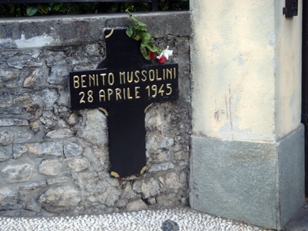

### Mussolini

27 kwietnia 1945 Mussolini, jego kochanka i 16 innych faszystowskich przywódców zostali wyciągnięci z niemieckiego konwoju, którego dowódca z chęcią się ich pozbył za prawo spokojnego przejazdu.

Byli przetrzymywani we wsi Dongo koło jeziora Como.

Przyjechali po nich dwaj komunistyczni partyzanci. Zabrali Mussoliniego i jego kochankę Clarę Petacci. Przywieźli do sąsiedniej wsi Giulino di Mezzegra, kazali stanąć pod murem posiadłości Villa Belmonte i jeden z nich zastrzelił oboje pistoletem maszynowym pożyczonym od kolegi, bo jego własny się zaciął. Była godz. 1610.

Nie wiadomo kto wydał wyrok śmierci. Palmiro Togliatti sekretarz generalny włoskiej partii komunistycznej (Partito Comunista Italiano) przypisuje sobie decyzję, w innej wersji była to inicjatywa lokalnego dowództwa partyzantki CLNAI (Comitato di Liberazione Nazionale Alta Italia) z Mediolanu.

*Giulino di Mezzegra. Miejsce śmierci Mussoliniego i Petacci 
By [Johnnyb11](https://en.wikipedia.org/wiki/User:Johnnyb11) z [angielskiej Wikipedii](https://en.wikipedia.org/wiki/),[CC BY-SA 3.0](http://creativecommons.org/licenses/by-sa/3.0/), [Link](https://commons.wikimedia.org/w/index.php?curid=1563083)*

Wieczorem ciała załadowano na ciężarówkę i zawieziono do Mediolanu. Rankiem 29 kwietnia zrzucono je na Piazzale Loreto, gdzie w sierpniu 1944 rozstrzelano 15 komunistów, a potem ich ciała zostawiono na widoku.

Teraz ten sam los spotkał faszystów, ale tym razem tłum nie pozostał obojętny. Rozgniewani ludzie kopali ciała, oddawali na nie mocz, bili kijami. W końcu zwłoki zostały powieszone na ramach nieskończonej stacji naprawczej Standard Oil. Podobno - tak mówią ci, którzy to zrobili - po to, by uchronić ciała od dalszego bezczeszczenia.

W podobny sposób zabito 16 innych faszystów schwytanych w Dongo.

- [Mark Felton Productions "The Death of Mussolini 1945" [6:11]](https://www.youtube.com/watch?v=s5m81WyLtYc)

### Berlin

<SeeAlso txt="Bitwa o Berlin" url="/festung-breslau/article/berlin-1945" />

#### Od północy

Po opanowaniu Gatow rano 175 Dywizja Strzelecka 125 Korpusu Strzeleckiego 47 Armii, ze wsparciem 50 Gwardyjskiej Brygady Pancernej i 23 Gwardyjskiej Brygady Zmechanizowanej zaatakowała Poczdam od północy.

W tej sytuacji dowódca garnizonu generał Reymann, nie mając szans na połączenie z Berlinem, podjął decyzję o ewakuacji 20 tys. załogi. Wycofali się, opuszczając miasto i dotarli do znajdującej się na południowym końcu Schwielowsee awangardy 12 Armii generała Wencka.

Otoczona fosą jedna z najlepiej zachowanych twierdz renesansowych w Europie i cel wielu wycieczek: Cytadela Spandau (niem. Spandauer Zitadelle) na ujściu Sprewy do Haweli skapitulowała przed 1 Korpusem Zmechanizowanym 2 Gwardyjskiej Armii Pancernej. Dowódca twierdzy i jego zastępca zginęli w atakach na czołgi sowieckie. Zniszczyli trzy panzerfaustami. Sowieci po tym, jak dowiedzieli się, że są tam składy gazów trujących, zrezygnowali z bombardowania (w rzeczywistości było to niewielkie ilości w laboratoriach). Wejście do twierdzy blokował stary francuski czołg, więc emisariusz dostał się do środka rozwiniętą mu drabiną sznurową. Z dominującej nad twierdzą Juliusturm rozciągał się znakomity widok na Charlottenbrücke - jedną z głównych potencjalnych dróg ucieczki z Berlina.

Generał Bogdanow dowódca 2 Gwardyjskiej Armii Pancernej po tym, jak pozostawił Ruhleben, przygotował swoje siły do trzech ataków z samego rana.

- 1 Korpus Zmechanizowany skoncentrował się na kolanie Sprewy na północ od ogrodów Schloss Charlottenburg, gdzie śluzy zapewniały przejście dla piechoty.
- 219 Brygada Pancerna na przylegającą stację S-Bahn Jungfernheide, silny punkt oporu, były tam przejścia podziemne przez ciąg torów kolejowych do Charlottenburga.
- 12 Gwardyjski Korpus Pancerny razem z 79 Korpusem Strzeleckim przekroczył Westhafenkanal i wdarł się do Moabit, gdzie walczył o teren miedzy Sprewą a ujściem Landwehrkanal. Tylko ten trzeci atak zakończył się sukcesem.

28 kwietnia 1945 po południu żołnierze 79 Korpusu Strzeleckiego posuwający się Alt Moabit są pierwszymi piechurami Armii Czerwonej, którzy dostrzegli Reichstag. Wywołało to wielkie poruszenie i dowódca Korpusu generał Pierwiertkin (FBTODO nie jestem pewien tego nazwiska, do sprawdzenia), pospieszył sprawdzić to osobiście. Co więcej, umieścił swój sztab w wysokich biurowcu Zollpackhof z widokiem na most Moltkego i podejście do Rechstagu.

150 Dywizja Strzelecka zajęła okolicę, 171 Dywizja Strzelecka rozlokowała się w ruinach Lehrter Bahnhof (obecnie znajduje się tam Hauptbahnhof) po drugiej stronie ulicy.

Bezpośrednio po lewej był Schiffahrtskanal, czyli granica terenu zajętego przez Korpus. Za nim wciąż trzymali się Niemcy na północ aż po Invalidenstrasse, stawiając opór 12 Gwardyjskiemu Korpusowi Strzeleckiemu.

Czerwonoarmiści z uwagą przypatrywali się przeszkodzie, która ich czekała. W tym miejscu Sprewa ma 50 m szerokości, oba brzegi są wysokie, licowane kamieniem. Masywny i szeroki Moltkebrücke, kamienny, niedający żadnej osłony, z barykadami na obu końcach, przeszkody z drutu kolczastego i miny. W widoczny sposób przygotowany do wysadzenia w powietrze.

Po drugiej stronie Sprewy zniszczone budynki dzielnicy rządowej i dalej w tle ich najważniejszy cel - masywny, ciemny gmach Reichstagu. Zwiad lotniczy informował, że cały teren przed Reichstagiem jest pokryty gęstą siecią przeszkód przeciwczołgowych, okopów i stanowisk ogniowych. Jest przecięty wielkim rowem przeciwczołgowym zalanym wodą. W Tiergarten jedno przy drugim stanowiska artylerii, wejścia do Reichstagu zamurowane, a na szczycie wokół kopuły stanowiska karabinów maszynowych.

Jak się okaże to jeszcze nie wszystko, co ich czekało.

Ze względu na niewielki obszar "Cytadeli" Armia Czerwona zrezygnowała ze wsparcia lotniczego w tej ostatniej walce. Ale artyleria otrzymała dostateczną ilość amunicji.

Zdecydowano się na atak z zaskoczenia. Plan polegał na wysłaniu po jednym batalionie z każdej dywizji awangardy i rozwinięciu przyczółka w lewą stronę. 150 Dywizja Strzelecka zdobędzie budynek pruskiego MSW, a 171 Dywizja Strzelecka oczyści resztę dzielnicy dyplomatycznej. To będzie baza do ataku na Reichstag.

Dotychczasowe straty zostały uzupełnione przez wcielonych jeńców wojennych i znowu każdy batalion miał 500 ludzi i trzy kompanie. Pod komendę 79 Korpusu Strzeleckiego oddano 10 niezależny batalion miotaczy ognia i 23 Brygadę Pancerną.

Obronę szacowano na 5 tys. żołnierzy. Było to głównie SS, ale był też batalion Kriegsmarine "Großadmiral Dönitz" składający się z techników radarowych, dwa bataliony Volkssturmu i elementy 9 Dywizji Spadochronowej. Wsparcie zapewniała artyleria, przede wszystkim działa 8,8 cm i moździerze.

Atak miał nastąpić o północy.

#### Od wschodu

5 Armia Uderzeniowa naciera w rejonie Friedrichshain Flakturm, jeden z korpusów dotarł na obrzeża Alexanderplatz, a inny pomimo zaciętej obrony zajął rejon Spittelmarkt. To mniej niż 1,5 km od Nowej Kancelarii Rzeszy.

Choć 5 Armia uderzeniowa utrzymywała postęp, nadal w rejonie Alexanderplatz i Giełdy (wówczas przez Sprewę sąsiadowała z Katedrą) panował chaos.

Zaciekłe walki trwały wokół Friedrichshain Flakturm i w całym rejonie Landsberger Allee i Frankfurter Allee. Wieża trzymała się do końca bitwy, ale cywilów wyrzucono w nocy 23 kwietnia. Przed opuszczeniem została wysadzona od środka i zawaliła się. Na szczęście ewakuowana z berlińskich muzeów kolekcja dzieł sztuki była przechowywana w sąsiedniej wieży radarowej i nie została uszkodzona.

Schlesischer Bahnhof (obecny Ostbahnhof) wciąż się bronił.

32 Korpus Strzelecki zaatakował Fischerinsel (południowa część Wyspy Muzealnej na południe od Getraudenstrasse). Marszałek Żukow uważał to za jednio z najtrudniejszych zadań podczas bitwy o Berlin. Niewiele wiadomo o tym ataku, najprawdopodobniej pomógł w nim oddział Flotylli Dnieprzańskiej i użyto miejscowych barek z Osthafen. Nie było tu mostów, a brzegi są wysokie i licowane kamieniem.

9 Korpus Strzelecki na zachodnim brzegu zdobył Spittelmarkt, który już przedtem zniszczony przez obrońców ogniem artyleryjskim. W końcu dnia awangarda 5 Armii Uderzeniowej znalazła się na wschodnim końcu Leipziger Strasse.

W tym momencie zarówno od północy, od wschodu, jak i od południa Armia Czerwona miała ok. 1,5 km do Hitlera.

#### Od południa

Żołnierze generała Czujkowa postawili zasłonę dymną i ustawili stanowiska ciężkiej artylerii na większych placach z dobrą ekspozycją na strefę celu. Bezpośrednio przy kanale ustawiono lekką artylerię. Amunicji nie brakowało. Trzeba było uważać, żeby nie przestrzelić, przeciwna linia frontu była niecałe 3 km na północ.

Strefa ataku rozciągała się od siedziby generała Weidlinga OKW w Benderblock do obecnego Mehringplatz. Było to ok. 2,5 km. Każda atakująca na tym odcinku jednostka musiała się dostosować do istniejących możliwości. Jedynym nietkniętym mostem był Potsdamer Brücke, atakiem na tym odcinku Czujkow zdecydował się pokierować osobiście.

Ogniem amfiladowym oczyścił teren z artylerii, czołgów i stanowisk pancerfaustów. Jak się później okazało w niedostatecznym stopniu. Zwiad nie znalazł dogodnych przejść podziemnych, ale zdecydowano się wysłać grupy sabotażu.

#### 1 Front Ukraiński

Z samego rana 3 Gwardyjska Armia Pancerna generała Rybałko przypuściła atak na prawą flankę: z rejonu Badensche Strasse między Kaiserallee (obecnie Bundesallee) i Potsdamer Strasse w kierunku Landwehrkanal, gdzie planowano dotrzeć do końca dnia. Dla wsparcia 55 Gwardyjska Brygada Pancerna została odwołana z blokady Westendu. Osią Kantstrasse miała nacierać w kierunku stacji Charlottenburg, Savignyplatz i Zoo.

Wtem, przygotowanie artyleryjskie wykazało, że na kierunku ataku są oddziały Armii Czerwonej! Przecież już od poprzedniego dnia Landwehrkanal aż po Zoo został opanowany przez 8 Gwardyjską Armię Pancerną generała Czujkowa. Oczywiście ani Koniew, ani Rybałko nie zostali o tym powiadomieni i 3 Armia nadziała się na oddziały 8 Gwardyjskiej Armii Pancernej. Rozpętała się bratobójcza walka. Jak to przyznał jeden z dowódców 1 Frontu Ukraińskiego:
>Bardziej niż wroga boimy się swoich. W Berlinie nie ma nic bardziej przygnębiającego niż zobaczyć sukces sąsiada.

Natychmiast, w trakcie ataku 9 Korpus Zmechanizowany i wspierająca go 61 Gwardyjska Dywizja Strzelecka przeszły na lewą flankę i uderzyły na Savignyplatz. Koniew zrozumiał, że został odcięty od Reichstagu i polecił Rybałce, by jak najlepiej wypełnił swoją rolę. Wiele zaryzykował, koncentrując całą siłę w jednym miejscu i pozostawiając tylko jedną brygadę pomiędzy Hawelą i Wilmersdorf.

W rezultacie w ciągu dwóch dni wiele oddziałów 1 Frontu Ukraińskiego bezpośrednim rozkazem Stawki została wycofanych z Berlina, co w odczuciu wszystkich żołnierzy Frontu było niehonorowym odebraniem im triumfu zdobywców Berlina. Marszałek Koniew poniósł klęskę w wyścigu do Reichstagu.

O północy czasu moskiewskiego (2200 w Berlinie) z Kremla przyszły nowe wytyczne: linia podziału biegła Mariendorf - Stacja Tempelhof- Viktoria-Luise-Platz - Stacja Savigny i dalej linią kolejową przez stacje Charlottenburg, Westkreuz i Witzleben.

Elementy 55 Gwardyjskiej Brygady Pancernej, które wciąż pozostały w Westendzie, żeby zająć obronę, wyprowadziły trzy ataki na Ruhleben:

- zdobyli stanowiska artylerii na terenie Reichsakademie für Leibesübungen  (hitlerowska AWF) na tym samym wzniesieniu co Stadion Olimpijski
- potem zepchnęli obronę przez poligon Ruhleben w stronę Schülerbergkaserne (po wojnie brytyjskie Alexander Barracks) gdzie mieściło sie dowództwo sektora "F", broniło się tam ok tysiąca żołnierzy, resztki sił broniących przedtem Spandau i Siemensstadt. Bronili linii baraków i stacji Ruhleben U-Bahn. Nagle dostali wsparcie około 2 tys chłopców z Hitlerjugend pospiesznie pozbieranych po okolicznych domach, w większości nieuzbrojonych. Broń mieli zbierać u zabitych.
- trzeci atak z użyciem czołgów wzdłuż Charlottenburger Chaussee dotarł aż do bramy koszar

O 2200 10 Gwardyjski Korpus Pancerny wsparty przez 350 Dywizję Strzelecką wyprowadził atak przez Teltowkanal na południowo-zachodni koniec "wyspy" Wannsee, w ciągu godziny powstał przyczółek. Zbudowali most pontonowy. Resztki 20 Dywizji Grenadierów Pancernych stawiały zaciekły opór. Koniew pisze, że nie była to jego inicjatywa i uznał to za marnowanie środków potrzebnych na walkę z 9 i 12 Armią.

Ta akcja nastąpiła po wzięciu "wyspy" przez elementy 47 Armii i 9 Gwardyjskiego Korpusu Pancernego tego samego dnia. Jeszcze tej nocy 9 Gwardyjski Korpus Pancerny wrócił pod komendę 2 Gwardyjskiej Armii Pancernej, która toczyła ciężkie walki w Charlottenburg i Moabit i od 1 Korpusu Zmechanizowanego przejął role rezerwy w Siemensstadt.

#### Obrona

Kronikarz Dywizji Pancernej Müncheberg:
>Te lotne sądy kapturowe pojawiały się dzisiaj szczególnie często. W większości to młodzi oficerowie SS bez odznaczeń, zaślepieni i fanatyczni. Nadzieja na pomoc i strach przed nimi trzyma naszych ludzi w akcji. Generał Mummert zażądał, żeby nie pojawiały się na naszym odcinku. Dywizja, w której jest tylu udekorowanych żołnierzy, nie zasługuje na prześladowanie ze strony młodzików. Postanowił, że rozstrzela każdy sąd kapturowwy, na który się natknie.

Na tym etapie Hitler stracił jakikolwiek wpływ na przebieg bitwy.

Siły Weidlinga były ograniczone do obszaru od Alexanderplatz na wschodzie, jakieś 15 km do Stadionu Olimpijskiego i brzegów Haweli na zachodzie. Nie więcej jak 3 do 5 km wszerz. Było to 30 tys. żołnierzy i niewielka liczba czołgów. Brakowało wszystkiego, przede wszystkim jedzenia i amunicji. Oceniał, że mogą wytrzymać jeszcze dwa dni. Wciąż liczył na wyrwanie się z okrążenia i połączenie z 12 Armią. Nawet przedstawił taki plan Hitlerowi, ale Hitler zadecydował, że mają wytrwać do końca. Weidling więc też nie miał już wpływu na wypadki, dowództwo przejął zbyt późno, by mógł zorganizować obronę. Jedyne co zdołał zrobić to wyznaczyć odpowiednich ludzi i uprosić organizację obrony.

### Grupa bojowa Steinera

O godz. 0400 Steiner zapewnia Keitla, że choć uzupełnienia się opóźniają, szykuje nakazane natarcie. Keitel obiecał mu uzupełnienie dywizją RAD Infanterie-Division Schlageter, która jednak już nie istniała. Steiner musiał być świadomy, że obaj blefują.

Hitler oczekiwał na to natarcie Steinera z rosnącą niecierpliwością. W końcu wyznaczył na miejsce Steinera generała Holste dowódcę 41 Korpusu Pancernego z rozkazem rozpoczęcia ataku w ciągu 48 godzin. Holste był w drodze.

Wracając do sztabu Jodla, Keitel odkrył, co się stało z 7 Dywizją Pancerną i 25 Dywizją Grenadierów Pancernych oraz to, że 3 Armia Pancerna wbrew rozkazom Hitlera jest w odwrocie.

Wsciekły wezwał Heinriciego i von Manteuffla na spotkanie na skrzyżowaniu na zachód od Neubrandenburga. Szef sztabu von Manteuffla podejrzewał podstęp i przygotował kontrzasadzkę na tym skrzyżowaniu. Ale doszło tylko do burzliwej wymiany zdań. Keitel oskarżył obu generałów o zdradę i sabotowanie rozkazów. Na co Heinrici odpowiedział, że nie można wykonać rozkazów oderwanych od rzeczywistości, wobec tego Keitel zarzucił im tchórzostwo, krzycząc że nie byli zdolni do rozstrzelania dla postrachu kilku tys. dezerterów. Wtedy Heinrici zaproponował Keitlowi, żeby sam zaczął ich rozstrzeliwać, zaczynając od żołnierzy, których całe kolumny zmierzały na zachód drogą, przy której się spotkali. Keitel zwiesił głowę i odszedł bez słowa.

### 12 Armia

Jedyną nadzieją dla Berlina była 12 Armia generała Wencka, 27 kwietnia wieczorem dotarł do wsi Ferch odległej od Poczdamu 14 km i wciąż trzymał tę pozycję. Nie mógł jednak posunąć się naprzód. Korzystając ze wsparcia 12 Armii Wencka z zachodu, Niemcy rozpoczęli odwrót wzdłuż jezior na południe od miasta.

Atak oddzielił 6 Gwardyjski Korpus Zmechanizowany, rozciągnięty w kolumnie o długości prawie 30 km, od reszty 4 Gwardyjskiej Armii Pancernej. 5 Gwardyjski Korpus Zmechanizowany i 13 Armia uformowały podwójny front. Spodziewano się, że 9 Armia niemiecka dokona próby przełamania, a reszta 4 Gwardyjskiej Armii Pancernej była wciąż zaangażowana w rejonie Poczdamu i "wyspy" Wannsee. Koniew ulokował korpusy odwodu 13 Armii w Jüterbog. Jak się później okaże, miejsce wybrał nieprzypadkowo. Oczekiwano tam 9 Armii.

### 9 Armia

Wieczorem 28 kwietnia zakończyły się przygotowania do wyrwania się z okrążenia. Po włączeniu elementów z innych jednostek jego formacja była gotowa do przedarcia się wąskim sektorem pomiędzy Halbe a Märkisch Buchholz na zachód od rzeki Dahme. Jego celem było uratowanie, ilu się tylko da od sowieckiej niewoli. Rozkazy od Hitlera mówiły o połączeniu się z 12 Armią k. Jüterbog w celu przyjścia z pomocą Berlinowi, ale od dawna był w kontakcie z generałem Wenckiem, który tak samo, jak on miał na celu tylko ewakuację. Wenck doradził mu marsz na Beelitz, gdzie jak uważano, linie sowieckie są najsłabsze. I rzeczywiście kończyła się tam strefa 5 Gwardyjskiego Korpusu Zmechanizowanego.

Punkt przełamania wybrano na Halbe, gdzie stykały się wojska obu Frontów. Stamtąd do pokonania było ponad 50 km terenów leśnych przez Luckenwalde. Trzeba było poruszać się w dzień i w nocy, bez przerwy, trzymając się lasu. Wszystko, co nie było niezbędne, zostało zniszczone. Przepompowano paliwo do sprawnych pojazdów i zniszczono resztę. Broń, do której nie było amunicji, została porzucona. Wszyscy żołnierze zostali uzbrojeni, nie było jednostek niebojowych. Planowano poruszanie się ciasnym klinem. Artyleria z zapasem kilku pocisków na lufę została skoncentrowana na Halbe. Mieli przeciwko sobie siły trzech Armii 1 Frontu Białoruskiego oraz dwóch 1 Frontu Ukraińskiego. Dziesiątki tysięcy cywilnych uchodźców mieszały się z wojskiem. Zaczynali rozumieć, jak niewielkie mają szanse na przeżycie. Sowieckie lotnictwo dostrzegło ruch wojska i przygotowało się do bombardowania przepraw na Dahme.

O zmroku zaczął się krótki artyleryjski baraż i XI. SS-Panzerkorps zaatakował, przecierając drogę. Na końcu lewego skrzydła 3 Armii Gwardyjskiej był 21 Korpus Strzelecki rozlokowany w lasach pomiędzy drogą Halbe - Teupitz a Teurow, nad rzeką Dahme, która nagle stała się linią frontu aż po Märkisch Buchholz gdzie znajdował się 120 Korpus Strzelecki tej samej armii.

Do likwidacji 9 Armii wyznaczono 1 Gwardyjską Dywizję Artylerii. Działania Armii Czerwonej ułatwiała autostrada Drezno - Berlin, która stała się główną drogą zaopatrzenia.

Po nocy rozpaczliwych walk o świcie dokonano przełamania. Rozpętała się gorączkowa walka, większość XI. SS-Panzerkorps i V Korpus przedostały się pod ogniem, ale w bardzo chaotyczny sposób, co utrudniało zadanie wszystkim jednostkom podążającym za nimi. Jak się wydaje, wyłamanie zostało zamknięte, zanim dotarł tam V. SS-Freiwilligen-Gebirgskorps. Główny korpus przedzierał się na zachód przez lasy, aby wieczorem dotrzeć do sowieckiego kordonu na drodze Zossen - Baruth.

### Grupa Armii Wisła

Ok. godz. 2300 von Manteuffel zadzwonił do Heinriciego z informacją, że połowa jego dywizji i cała obrona plot jest w odwrocie. Powiedział mu, że nie widział czegoś takiego od 1918. Sto tysięcy ludzi zmierzało na zachód. Zaproponował, by Jodl sam to obejrzał. Heinrici przekazał informację Keitlowi i poprosił o pozwolenie na opuszczenie Swinemünde (pl. Świnoujście), gdzie garnizon kadetów Marynarki był zagrożony odcięciem. Keitel oskarżył go o nieposłuszeństwo, na co Heinrici odrzekł, że rozkazy były niewykonalne. Keitel natychmiast zwolnił go z dowództwa i po czym oznajmił mu, że gdyby tylko mógł, to by go postawił przed sądem polowym.

### Hitler

Ok. godz. 2100 z Radia Stockholm, z serwisu BBC dotarło do Hitlera doniesienie Reutersa, że Heinrich Himmler, "*meine treue Heinrich*" (pl. mój wierny Henryk), jak o nim mówił Hitler, jego najlepszy człowiek, samodzielnie i bez jego wiedzy podjął negocjacje z aliantami, oferując kapitulację. Hitler doskonale wiedział, że nie istniał żaden zaufany telefon, z którego Himmler mógł skorzystać do nawiązania łączności. Jeżeli teraz o tym powiedzieli alianci, to znaczy, że rozważyli tę propozycję, zanim ją odrzucili, że dostali ją za pośrednictwem zaufanego łącznika, że Himmler znalazł takiego łącznika. To wszystko wymagało czasu, musiało trwać wiele tygodni. Przez cały ten czas Himmler był w pobliżu, wierny i gotowy do usług, a jednocześnie szukający własnej drogi do jego śmiertelnych wrogów. To był cios w samo serce.

Jakkolwiek sytuacja nie wydawałaby się przegrana, nawet w wigilię samobójstwa, nawet kiedy nie ma już nic do przegrania, ciągle jeszcze można wymierzać sprawiedliwość. Himmler był poza zasięgiem. Ale jego oficer łącznikowy był w Berlinie, jeszcze niedawno był w bunkrze. Jego można było dopaść. Gruppenfuhrer SS Hermann Fegeleien, mąż siostry Ewy Braun, więc niedoszły szwagier Hitlera został schwytany w domu, gdy przebierał się w cywilne ubranie i szykował się do ucieczki z Berlina. W każdym razie tak twierdzili żołnierze, którzy go zatrzymali. Jeszcze tego dnia z wyroku sądu wojskowego został skazany na śmierć i rozstrzelany. Jego żona przebywająca w Berghof, odmówiła wstawienia się za nim, choć był ojcem jej dziecka.

Siostry Braun to kolejny temat, który z braku czasu pozostał nieruszony. Była jeszcze trzecia, najstarsza siostra Ilse, która nie miała nic wspólnego z polityką. Nie należała do kręgu Hitlera, nie była w NSDAP. W 1941 po raz drugi wyszła za mąż i przyjechała do Wrocławia, gdzie pracowała w Schlesische Zeitung, nikt prawdopodobnie nie był świadomy jak blisko jej do Hitlera, nazwisko Braun nigdy nie pojawiło się w mediach. Kochała taniec, brała udział w mistrzostwach tańca towarzyskiego amatorów i osiągała mistrzowskie wyniki. Kiedy wybuchła panika w styczniu 1945, ten jeden raz skorzystała ze swojej uprzywilejowanej pozycji i uciekła w głąb Rzeszy. Umarła w Monachium w 1979 w wieku 70 lat.

Hanna Reitsch dwa dni temu przyleciała, by namówić Hitlera do ucieczki. Tylko ona potrafiła wyprowadzić bezpiecznie samolot ponad ogniem nieprzyjaciela. Spotkała się z odmową. Hitler był zdecydowany pozostać w bunkrze. Wobec tego gotowa była popełnić samobójstwo razem z nim. Ale oboje z von Greimem otrzymali wyraźne rozkazy. Mieli opuścić Berlin i schwytać tego zdrajcę Himmlera.

Hitler poinstruował von Greima, żeby użył wszystkich sił Luftwaffe do obrony Berlina, ale przede wszystkim ma znaleźć i ukarać Himmlera. Von Greim był ranny i cierpiał. Został odwieziony do Hermann-Göring-Strasse (obecnie Ebertstrasse), gdzie było prowizoryczne lotnisko. Wznieśli się na 4,5 tys. stóp. Poleciał do Rechlin.

Z tego samego improwizowanego lotniska polowego na Tiergarten wylecieli razem z von Greimem, udając się w ostatnią misję, samolotem Arado Ar 96. Wpadli w ogień 3 Armii Uderzeniowej, która zmierzała na Tiergarten z północy, ale udało im się opuścić Berlin. Sowieci zawzięcie strzelali do każdego samolotu, przypuszczali bowiem, że Hitler będzie chciał uciec z Berlina samolotem.

I tutaj kolejna zagadkowa kwestia - Tony Le Tissier, brytyjski historyk, który napisał najdokładniejszy opis bitwy berlińskiej, z jakiego korzystam "The Battle of Berlin 1945" cały czas pisze, że pilotem zarówno do lotniska Gatow, jak i z Berlina był "nieustraszony chorąży", którego nazwiska nie podaje. Przy czym Reitsch była cały czas pasażerką. Wszyscy w Niemczech wiedzieli, że Reitsch jest jednym z kilku najdoskonalszych i najodważniejszych pilotów. Uważam, że to ona pilotowała samolot von Greima na wszystkich trzech odcinkach. Jest to kwestia do sprawdzenia.

Jak powiedziała później, składając zeznania, był to "*najczarniejszy dzień, kiedy nie mogliśmy umrzeć u boku naszego Führera*" rozpłakała się "*powinniśmy uklęknąć z szacunkiem i oddać hołd świątyni ojczyzny*", zapytana przez przesłuchujących co ma na myśli, odrzekła zdumiona "*jak to, przecież bunkier Hitlera*".

Von Greim został schwytany przez aliantów 8 maja 1945. Po tym, jak dowiedział się, że jest przeznaczony do wymiany, tzn. zostanie przekazany sowietom, popełnił samobójstwo 24 maja 1945 w więzieniu w Salzburgu.

W nocy Hitler ogłosił chęć poślubienia Evy. Goebbels zaczął szukać wystarczająco ważnego urzędnika. Ok. godz. 0130 następnego dnia do bunkra przybył prosto z linii frontu zdumiony Gauamtsleiter Walter Wagner, ciągle miał założoną opaskę Volkssturmu.

- Dark Docs ["The Last Known Photo of Hitler" [YT 8:47]](https://www.youtube.com/watch?v=2Xe9goBnWBs)

### Freiheitsaktion Bayern FAB

Antyhitlerowski bunt w Dachau (mieście) i Monachium. Zdecydowani obalić rządy hitlerowców i poddać miasto Amerykanom, ratując je i jego mieszkańców przed skutkami walk. Chcieli też wyzwolić obóz koncentracyjny, pomóc więźniom. Obawiano się, że zostaną wysłani w marszu śmierci do rzekomej Alpenfestung.

W nocy z 27 na 28 kwietnia opanowali siedzibę radia w Schwabing (Monachium) i Erding. Ogłosili "Jagd auf die Goldfasane" (złote bażanty to bonzowie partyjni NSDAP, nazwa wzięła się od koloru mundurów). Kim byli ci ludzie? Żołnierze, urzędnicy, Volkssturm.

Niestety ideowi naziści zaalarmowali SS. Zdecydowane działania podjął gauleiter Górnej Bawarii Paul Giesler. Bunt został stłumiony po krótkiej walce, Volkssturm i cywile nie mieli szans w walce z trzema kompaniami 10. SS-Panzerdivision "Frundsberg", które wezwał Obergruppenführer Oswald Pohl, szef WVHA i administrator systemu obozów koncentracyjnych.

Część buntowników zginęła, większości udało się uciec, schwytanych rozstrzelano. W Monachium rozstrzelano 40 ludzi.

Sukcesem buntu była ucieczka strażników SS konwojujących marsz śmierci więźniów KL Dachau. Więźniowie rozproszyli się i doczekali wyzwolenia.

Gauleiter Paul Giesler 29 kwietnia razem z żoną uciekł do Berchtesgaden, gdzie 8 maja popełnili samobójstwo.

30 kwietnia 7 Armia amerykańska wkroczyła do Monachium. Pohl został w 1946 schwytany przez Brytyjczyków i osądzony w Norymberdze. Dostał wyrok śmierci, wykonany przez powieszenie 3 listopada 1947. Próbował błagać o łaskę, pisząc prośby o łaskę, nawet napisał książkę mającą świadczyć, że się zmienił: "Credo - Mein Weg zu Gott".

- [War Stories with Mark Felton "Freedom Action! - The Forgotten German Anti-Nazi Uprising 1945" [YT 12:42]](https://www.youtube.com/watch?v=US8U-zykz5A)
- [Rupprecht Gerngroß](https://en.wikipedia.org/wiki/Rupprecht_Gerngro%C3%9F)

### "Grupa z Wels"

Była to kodowa nazwa używana przez Gestapo określająca dużą i rozgałęzioną organizację podziemną rozpracowywaną od 1941. Działała na obszarze Linz - Ebensee - Steyr i składała się głównie z członków zdelegalizowanej w 1933 Austriackiej Partii Komunistycznej (Kommunistischen Partei Österreichs), choć w trakcie działania dołączyło do niej wielu ludzi niemających nic wspólnego z KPÖ.

W 1941 dokonano serii aresztowań działaczy komunistycznych i okazało się, że wciąż aktywnym centrum tego ruchu jest Wels (20 km na SW od Linzu) stąd nazwa tej grupy. Gestapo udało się wprowadzić swojego agenta jako przedstawiciela wiedeńskiej KPÖ i zdobył w Wels zaufanie. Organizacja zresztą nie stosowała się do zasad konspiracji. Organizowali zbiorowe zebrania, czasem na widoku publicznym i zachowywali się z dużą pewnością siebie.

7 września 1944 dokonano masowych aresztowań wszystkich ujawnionych członków organizacji. Kobiety uwięziono w Linz, mężczyzn wywieziono do KL Mauthausen.

Tego samego dnia Gestapo przeprowadziło akcje przeciwko innej austriackiej organizacji ruchu oporu Willy-Fred, ale skończyła się fiaskiem.

W południe 28 kwietnia 1945 na rozkaz Gauleitera Oberdonau Augusta Eigrubera dokonano egzekucji 42 Austriaków z "Grupy z Wels" w komorze gazowej KL Mauthausen. Było to ostatnie morderstwo dokonane w komorze gazowej KL Mauthausen i przedostatnia egzekucja w tym obozie. Następnego dnia zdemontowano instalację gazową i zamurowano po niej ślady, tak że z miejsce to wyglądało na prysznice.

KL Mauthausen został wyzwolony przez Amerykanów 5 maja 1945.

Najprawdopodobniej przyczyną decyzji o egzekucji był fakt, że już 27 kwietnia w Wiedniu został utworzony tymczasowy rząd demokratyczny partii ÖVP, SPÖ i KPÖ, na którego czele stał Karl Renner. Hitlerowcy wiedzieli, że wielu z trzymanych przez nich więźniów za kilka dni wejdzie w skład nowych władz.

August Eigruber ogłosił stolicę swojego Gau twierdzą, która ma być broniona do samego końca. Jednak kiedy 5 maja pod Linz dotarli Amerykanie, ogłosił że jest to miasto otwarte i uciekł. Udało mu się ukrywać dzięki fałszywym dokumentom, ale amerykański kontrwywiad dopadł go w Sankt Pankraz 11 sierpnia 1945. Podczas serii procesów załogi Mauthausen-Gusen (US kontra Franz Kofler i inni), które miały miejsce od 29 marca 1946 do 21 sierpnia 1947, 13 maja 1946 został skazany na śmierć przez powieszenie. Wyrok wykonano 26 maja 1947 w więzieniu w Landsberg am Lech, tym samym, w którym uwięziono Adolfa Hitlera po puczu monachijskim.

- [1945: Die Ermordung der "Welser Gruppe"](https://ooe.kpoe.at/article.php/20060421181531835)

### Kurt Knispel

Pod Znojmem zginął Kurt Knispel, niemiecki as pancerny wsławiony zniszczeniem 168 nieprzyjacielskich pojazdów.

### Marian Wójcik

Pod Rothenburgiem poległ kapral 2 Armii WP Marian Wójcik słynny szachista i kompozytor szachowy, działał w wielu organizacjach szachowych. związany ze Lwowem. Pochowany na cmentarzu wojskowym w Zgorzelcu.

### Československá samostatná obrněná brigáda

Powołana w 1941 czechosłowacka jednostka wojskowa (pl. 1 Czechosłowacka Brygada Pancerna, ang. 1st Czechoslovak Armoured Brigade), walcząca na froncie zachodnim wraca do kraju. Dziś wydzielony 140-osobowy oddział wciąż walczącej pod Dunkierką Brygady przyłączył się do 3 Armii amerykańskiej w marszu na wschód. 1 maja oddział pod dowództwem majora Sítka zawiesił flagę czechosłowacką na przejściu granicznym w Chebie.

### Szczecin

35-letni Piotr Zaremba przybył do Szczecina z zadaniem ustanowienia polskiej władzy w mieście. Jest to jeden z ludzi, którzy stworzyli polski Szczecin. Prezydent miasta do 1950.

Architekt, urbanista. 1953-60 profesor urbanistyki na Wydziale Architektury Politechniki Wrocławskiej. 1962-65 rektor Politechniki Szczecińskiej. Przeszedł na emeryturę w 1980, ale potem przez wiele lat był czynny zawodowo. Zmarł w 1993 - oczywiście w Szczecinie.

### Wrocław

28 kwietnia saperzy wysadzili wieżę ewangelickiego Kościoła Odkupiciela (niem. Erlöser Kirche) na pl. Staszica. Po wojnie, od 1947 używany był przez starokatolików (mariawitów), którzy licznie przybyli do Wrocławia osiedlając się na Nadodrzu. Zły stan techniczny spowodował rozbiórkę w 1956. [Imponujące wnętrze nieistniejącego już Kościoła Odkupiciela (Erlöser Kirche) przy pl. Staszica.](https://www.facebook.com/tajemniczy.wroclaw/posts/3664197260260699)

Wspomnienia z tego dnia księdza Laßmanna i dramatopisarza Hugo Hartunga, chociaż nie tylko przebywali w zupełnie innych miejscach, ale nawet w ogóle się nie znali, łączą się w całość narracyjną do tego stopnia, że można je ustawić obok siebie.

Laßmann:
>Dzisiaj pochowałem 19-letnią dziewczynę, która na Matejki zabił odłamek bomby. Jej narzeczony sporządził dla niej trumnę, którą z kolegami niósł potem do grobu. Wieczorem nawiedziła nas orzeźwiająca powietrze burza, po której spadł deszcz. Zmusiło to rosyjskie bombowce do pozostania na ziemi. Ale ich artyleria ostrzeliwuje miasto z dział dużego kalibru.

Hartung:
>Ostatniej nocy musiałem spisywać w sztabie raporty i dopiero o czwartej nad ranem mogłem się w biurze na chwilę położyć. Nie było jednak mowy o spaniu, bo do świtu nie ustawały przeraźliwe krzyki jakiegoś rannego.

a 29 kwietnia:
>Na willowych ulicach panuje spokój niedzielnego zmierzchu po tym, jak ucichł dzienny zgiełk walk. Zaczyna kwitnąć bez. Wracam z bukietem gałęzi okraszonych białymi, czerwonymi i łososiowymi girlandami. Zatracona wiosna.

Hornig o propagandzie:
>Carlowitz, zwykle dość spokojne przemieście na północy, przeżyło tej nocy z 25 na 26 kwietnia także ciężkie bombardowania. Ataki te były prawdopodobieństwem ostrych walk w dniu poprzednim. 25 kwietnia, o czym donosił raport Wehrmachtu: "Dzielna załoga Breslau odparła wszystkie ataki. Od 17 lutego we wzorowej wspólnocie walczących, złożonej z jednostek Wehrmachtu, Volkssturmu i administracji cywilnej, twierdza jest broniona przed nieustannym szturmem Sowietów dysponujących ogromną przewagą liczebną i materiałową". W takich ogólnikowych informacjach przemilczano wtargnięcie Rosjan, zwłaszcza na zachodzie, do Breslau i nasze ciężkie straty. Również raport dowództwa armii z 29 kwietnia brzmiał bardzo ogólnikowo: "Dzielni obrońcy Breslau odparli silne ataki na froncie zachodnim, przy stratach przeciwnika".