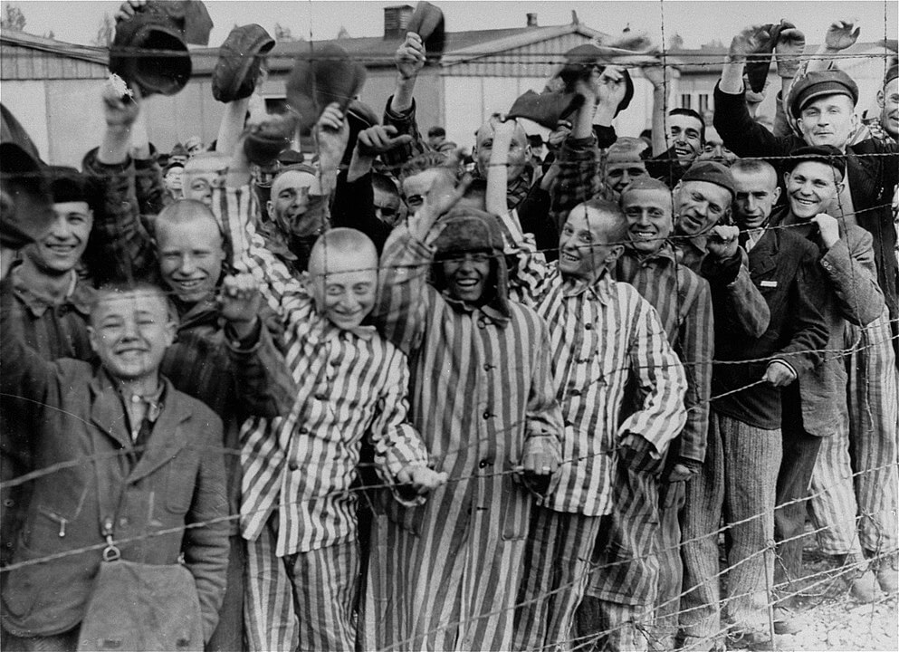

### Operacja Manna

W niektórych rejonach Europy głód spowodowany wojną był straszniejszy niż same działania wojenne.

Jednym z nich była zachodnia część Holandii będąca pod okupacją niemiecką aż do maja 1945. O Hongerwinter (pl. Głodowa Zima) byłą już mowa 5 marca. Władzę z ramienia NSDAP sprawował tam Arthur Seyss-Inquart, zatwardziały nazista i od 29 maja 1940 do 5 maja 1945 Komisarz Rzeszy (niem. Reichskommissar) okupowanej Holandii (niem. Reichskommissariat Niederlande). Holandia to gęsto zaludniony kraj uzależniony od dostaw żywności, polityka okupanta poważnie zubożyła i wyeksploatowała Holandię. 530 tys. Holendrów było na przymusowych robotach, 140 tys. holenderskich Żydów wywieziono do obozów koncentracyjnych. Po fiasku operacji Market Garden zostali dodatkowo ukarani embargiem na dostawy żywności, ciężka zima skuła lodem kanały, a linie kolejowe i cała infrastruktura transportowa ucierpiały na skutek działań wojennych. Już jesienią 1944 było jasne, że Holandia jest skazana na morderczy głód. Ocenia się, że głód tej zimy dotknął w Holandii 3 mln ludzi, od września 1944 do maja 1945 20 tys. z nich zmarło bezpośrednio z niedożywienia lub z powodu pogorszenia stanu zdrowia. Najgorzej było w marcu 1945. Problemy dotyczyły też dostaw gazu i elektryczności. Z braku węgla palono meble.

Kiedy działania wojenne zatrzymały się i jasne było, że nie można liczyć na szybki przełom, władze holenderskie na emigracji apelowały do Churchilla i Roosevelta o podjęcie jakiejś akcji humanitarnej. George Marshall, szef sztabu US Army, wydał wydał zgodę 23 kwietnia 1945. Przedstawicielem Holandii był książę Bernhard. Teraz sprawy potoczyły się błyskawicznie.

24 kwietnia alianci ogłosili przez radio, że wkrótce rozpoczną się zrzuty żywności. Przez holenderski ruch oporu alianci dotarli do generała Blaskowitza, głównodowodzącego Grupy Armii H, który zgodził się na negocjacje. 26 kwietnia ustalono, że wyznaczone zostaną korytarze powietrzne i strefy zrzutu a niemiecka plot nie będzie ingerować na tym obszarze. 28 kwietnia odbyło się spotkanie robocze w Achterveld (8 km na wschód od Amersfoort), na którym ustalono wszystkie szczegóły.

Pierwszy próbny zrzut z wysokości zaledwie 50 m miał odbył się 29 kwietnia. Były to trzy Avro Lancastery, dwa brytyjskie i kanadyjski Bad Penny. Następnego dnia przyszła formalna zgoda Seyss-Inquarta na operację Manna.

Ustalone strefy zrzutu wyznakowywały Mosquito. Ogółem w ramach Operacji Manna dokonano 3301 zrzutów. Bez spadochronów najczęściej z wysokości 120 do 150 m. W sumie 6680 ton ładunku.

Amerykańska część operacji miał nazwę Chowhound, brały w niej udział B-17, które dostarczyły dodatkowe 4 tys. ton ładunku.

Ustalono, że sam most powietrzny, nawet po powiększeniu do 2 maja do 11 stref zrzutu to za mało. Żeby uratować Holendrów. Potrzebny był transport lądowy. 2 maja pierwszych 200 wyładowanych po brzegi ciężarówek z alianckich magazynów w Wageningen wyjechało na niemiecką stronę do Rhenen i tam kierowcy zostali zamienieni na holenderskich, którzy dalej rozwieźli ładunek w głąb Holandii. Ta lądowa część operacji miała nazwę Faust.

5_356 lotów, w sumie 10_913 ton żywności i lekarstw.

Dalsze kontakty aliancko-hitlerowskie wykorzystano do ustalenia warunków kapitulacji całej Grupy Armii H.

Brytyjczycy podczas tej operacji utracili trzy samoloty, dwa się zderzyły, trzeciemu spłonął silnik. 7 maja amerykański B-17 spadł na Morze Północne, wszystkich 11 lotników zginęło. Niemiecka plot nie zadała żadnych strat, choć sporadycznie zdarzały się strzały i niektóre samoloty wracały z dziurami po kulach.

Seyss-Inquart był jednym z najbardziej inteligentnych nazistów, jego wynik testu IQ wynosił 141. Jedynym człowiekiem związanym z NSDAP, którego znany iloraz inteligencji był wyższy, był ekonomista Hitlera Hjalmar Schacht, który w 1937 popadł w niełaskę.

Arthur Seyss-Inquart został schwytany 7 maja w Hamburgu. Blaskowitza uwięziono zaraz po kapitulacji.

Obaj stanęli przed Międzynarodowym Trybunałem Wojskowym w Norymberdze. Seyss-Inquart został skazany na śmierć i powieszony 18 października 1946. Blaskowitz podczas procesu po tym, jak oskarżono go o liczne zbrodnie wojenne, 5 lutego 1948 popełnił samobójstwo, wyskakując z budynku.

- [Operations Manna and Chowhound](https://en.wikipedia.org/wiki/Operations_Manna_and_Chowhound)
- [Mark Felton Productions "Food Bombers - Allied Operations Behind German Lines, Netherlands 1945" [YT 10:30]](https://www.youtube.com/watch?v=wbt4e87DvWc)
- [The Bad Penny](https://www.ch2a.ca/the-bad-penny)

### KL Dachau

Amerykanie zajęli obóz koncentracyjny w Dachau. Jeden z pierwszych, najważniejszy w Niemczech i wzorcowy hitlerowski obóz koncentracyjny. To tu byli kierowani w Marszach Śmierci więźniowie Ravensbrück i wielu innych likwidowanych obozów koncentracyjnych. Zdobycie tego obozu jest symbolicznym końcem działania tego systemu. Więźniowie Dachau nie mieli już dokąd być ewakuowani. Tym razem Amerykanie nie byli tak zaskoczeni tym, co zobaczyli, słyszeli o podobnych i wiedzieli co się w nich działo. W obozie było 30 tysięcy jeszcze żywych więźniów.

Wyzwolenie Dachau związane jest z pewną kontrowersyjną opowieścią. Często mówi się, że sytuacja wymknęła się spod kontroli i Amerykanie bez sądu rozstrzelali pół tysiąca strażników obozu, głównie SS-manów. Czy naprawdę doszło do tej masakry? Otóż opis zdarzenia z tak wysoką liczbą zamordowanych pojawia się w jednej relacji opublikowanej długo po wojnie i nie znajduje żadnego potwierdzenia w innych dokumentach. Najwidoczniej jednak brzmi dość interesująco i kontrowersyjnie by budzić zaufanie.

- IrytujacyHistoryk [Masakra w Dachau [YT 11:54]](https://www.youtube.com/watch?v=sXJSO2wcSF0)
- Mark Felton Productions ["Liberating Dachau 1945" [YT 16:05]](https://www.youtube.com/watch?v=aRk2FZbsMxw)

<BoxImageWrapper>

Wyzwolenie KL Dachau 
By nieznany - [United States Holocaust Memorial Museum](https://www.ushmm.org), Zdjęcie fotograficzne #[45075](https://www.ushmm.org/search/results/?q=45075), Domena publiczna, [Link](https://commons.wikimedia.org/w/index.php?curid=542805)
</BoxImageWrapper>

### 12 Armia

12 Armia generała Wencka utknęła na południe od Poczdamu. Została zablokowana przez Armie Czerwoną

Wenck wysłał radiogram do Weidlinga, że nie da rady zbliżyć się bardziej do Berlina. Jego pozycja umożliwiła ewakuację garnizonu poczdamskiego, ale to wszystko, co mógł zrobić. Był zagrożony zarówno przez niespodziewany atak Amerykanów na Wittenbergę, jak i trwające od kilku dni próby 5 Gwardyjskiego Korpusu Zmechanizowanego i 13 Armii (1 Front Białoruski) odcięcia 12 Armii od Łaby.

Wieczorem wysłał wiadomość do Keitla, że atak na Berlin nie jest możliwy.

### 9 Armia

Generał Busse wiedział, że 12 Armia długo nie utrzyma pozycji. Jego 9 Armia, której część wyrwała się z okrążenia, zdołała się przebić przez pozycje 28 Armii sowieckiej i podążała na pozycje niemieckiej 12 Armii, była masakrowana przez sowiecką artylerię. Kierowała się na Luckewalde, dziś wieczorem brakowało jej 12 km do tej pozycji. Przedarcie się przez pierwsze linie obrony nie oznaczało przełamania kordonu. Teren był zadrzewiony, ale nie dość gęsto by można było ukryć wojsko.

Najgorsza była sytuacja cywilnych uciekinierów. Większość z nich już nie żyła lub zrezygnowała z ucieczki. Niemieckie wojsko nie mogło im dać żadnej ochrony, a wręcz przeciwnie - na całej drodze ucieczki ściągało ogień artylerii.

Kontakt z V. SS-Freiwilligen-Gebirgskorps i 21. Panzer-Division został utracony. Jednostki 9 Armii były w chaosie. Jatka trwała dwa dni do 30 kwietnia. Sowieci potem wyliczyli, że zabili 60 tys. żołnierzy, 120 tys. wzięli do niewoli, zdobyli 300 pojazdów pancernych i 1,5 tys. jednostek artylerii. Autostrada na całym tym odcinku była zatłoczona wrakami pojazdów i trupami.

Jeszcze tego samego dnia Busse powiadomił Wencka, że robią, co tylko mogą, ale zarówno morale, jak i sytuacja wyglądają fatalnie. Szczególnie cierpią cywile. Możliwość ataku i stawiania oporu jest na krawędzi wyczerpania.

Jeżeli pamiętamy historię "ruchomego kotła" Nehringa to jest coś podobnego tylko kilka razy bardziej. Ostatecznie do Głogowa dotarło ok. 100 tys. żołnierzy. Tu natomiast sama liczba ofiar śmiertelnych to 60 tys., a do niewoli dostało się 120 tys. żołnierzy. Walka była bez porównania bardziej bezwzględna, Niemcy nie mogli liczyć na to, że zasłonią ich chmury czy mgła.

### Grupa Armii Wisła

Generał von Manteuffel otrzymał rozkaz przejęcia dowództwa na Grupą Armii Wisła, ale zachowując lojalność wobec Heinriciego, odmówił. W tej sytuacji Keitel i Jodl na dowódcę wyznaczyli generała Studenta, ale ten był w Holandii. W tzw. międzyczasie, zanim Student obejmie komendę, dowódcą miał być von Tippelskirch, ale on też początkowo odmówił. W końcu się zgodził, ale prawdopodobnie tylko dlatego, że nie miało to już żadnego znaczenia.

2 Front Białoruski zdobył tereny do linii Anklam - Neubrandenburg - Neustrelitz oraz przekroczył Hawelę w rejonie Zehdenick - Liebenwalde. Od strony Łaby brytyjska 21 Armia utworzyła przyczółek w Lauenburg. Zagroziło to obszarowi Łaba - Lubeka, czyli pozycji Heeresgruppe Nordwest marszałka Ernsta Buscha.

### Berlin

#### Od północy

Z samego rana przełom na odcinku 2 Gwardyjskiej Armii Pancernej

1 Korpus Zmechanizowany: stacja S-Bahn Jungfernheide zdobyta, saperzy zbudowali rampy z gruzu, po których czołgi wjechały na tory kolejowe. Po przejechaniu mostu kolejowego na Sprewie wdarły się do ogrodów Schloss Charlottenburg.

12 Gwardyjski Korpus Pancerny z silnym wsparciem artylerii zdobywał zachodnią część Moabit, kierując się na ujście Landwehrkanal.

Walki w terenie zajętym przez 12 Gwardyjska i 7 Korpus Strzelecki 3 Armii Uderzeniowej były kontynuowane, ale w tym samym zamieszaniu i braku jasnego rozgraniczenia pozycji swój-obcy. Silną obronę napotkano w rejonie Stettiner Bahnhof (obecnie Nordbahnhof).

79 Korpus Strzelecki dokonał śmiałego i powodującego duże straty ataku przez most Moltkego, już o godz. 0200 został zdobyty budynek na rogu Moltkestrasse (odpowiada obecnej Willy-Brandt-Strasse) i nadbrzeża. Były to dawne ambasady Turcji i Węgier. Atak wspierała artyleria zgromadzona na Zollpackhof i Washingtonplatz. Pierwszą barykadę zepchnięto, reszta przeszkód pozostała, każde opóźnienie w biegu przez most kosztowało życie. Czerwonoarmiści byli rażeni również ogniem z tyłu, zza Lehrter Bahnhof gdzie wciąż były pozycje niemieckie. Niemcy w końcu wysadzili most, ale zniszczone zostało tylko pół przęsła, więc nawet czołgi mogły przejechać.

3 Armia Uderzeniowa: 150 Dywizja Strzelecka zdobywała kolejne budynki na Moltkestrasse, a 171 Dywizja Strzelecka czyściła przyczółek z pomocą 525 pułku po lewej na Kronprinzenufer (obecna Bettina-von-Arnim-Ufer) i 300 pułkiem w centrum.

O świecie już liczne pododdziały, w tym batalion miotaczy ognia były po południowej stronie Sprewy, saperzy przygotowali przejazdy dla czołgów. Samo zagęszczenie jednostek i straty świadczą o determinacji dowództwa sowieckiego. Są całe pułki, których numery po raz ostatni pojawiają się w meldunkach z walk o dostęp do Reichstagu. Przestały istnieć w ciągu kilku godzin.

Przyczółek znajdował się w trójkącie obecnej ulicy Willy Brandta, aż po ambasadę szwajcarską i od niej dokładnie na północ do Sprewy. Od Reichstagu dzieliło ich zaledwie 300 metrów.

O godz. 0700 po 10-minutowym barażu artyleryjskim 150 Dywizja Strzelecka zdobyła Pruskie MSW, jak to sowieci nazywali "Dom Himmlera". Obrona SS była tak zaciekła, że trzeba było wezwać jeszcze 674 pułk do zdobycia płonącego budynku.

Między 0300 a 1000 intensywne bombardowanie Reichstagu. Samo zdobycie pruskiego MSW zajęło 24h.

#### Od wschodu

5 Armia Uderzeniowa: na odcinku 26 Gwardyjskiego Korpusu Strzeleckiego, który był teraz po obu stronach Sprewy 1008 i 1010 Pułki Strzeleckie z 266 Dywizji Strzeleckiej z pomocą czołgów i dział samobieżnych atakowały siedzibę władz Berlina, znienawidzony przez Hitlera wielki Czerwony Ratusz zamieniony w punkt silnej obrony. Po wdarciu się do środka trzeba było walczyć o każde pomieszczenie w gęstym dymie pożaru.

Budynek ten znają wszyscy fani serialu "Babilon Berlin" ponieważ odgrywał rolę zniszczonej podczas wojny siedziby policji.

32 i 9 Korpus Strzelecki walczyły z SS Nordland Panzergrenadier Division i innymi oddziałami SS na drodze do Nowej Kancelarii Rzeszy.

#### Od południa

Już godzinę przed przygotowaniem artyleryjskim piechota zajęła pozycje na odcinku 29 Gwardyjskiej Dywizji Strzeleckiej przy Moście Poczdamskim. Piechota rzuci się wpław, korzystając z prowizorycznych tratw i skoczy przez most skryty w zasłonie dymnej. Był między nimi chorąży 220 Gwardyjskiego Pułku Strzeleckiego sierżant Nikołaj Masało i jego dwóch asystentów. Jak mówi legenda, kiedy usłyszał płacz dziecka po drugiej stronie, za pozwoleniem dowódcy oddał sztandar i przepłynął kanał, odnalazł dziecko płaczące przy zabitej matce i przepłynął z nim z powrotem.

Sowieccy pancerniacy zagrożeni przez wszechobecne w walce miejskiej panzerfausty od jakiegoś czasu stosowali prowizoryczne środki zabezpieczające, okładali czołgi workami z piaskiem, metalowymi ramami łózek ze sprężynami i płytami metalowymi. Tego dnia ta psychologiczna raczej niż wojenna praktyka bardzo się przydała. Saperzy rozbroili miny na moście, ale pierwszy szturm przez most zakończył się krwawym fiaskiem, zarówno piechota, jak i czołgi poniosły straty. Okazało się, że w ciągu ulicy byl wkopany Tygrys (a może sama wieża czołgowa, tzw. Panzerturm), który po kolei eliminował sowieckie T-34. Czerwonoarmiści uciekli się do podstępu, obłożyli czołg prowizoryczną osłoną i kanistrami z benzyną i podpalili. Czołg ruszył i przejechał przez most. Dla przeciwnika wyglądał jak zniszczony pojazd poruszający się po utracie kontroli, szkoda na niego amunicji. Niespodziewanie, dopiero kiedy był w dobrej pozycji strzeleckiej, otworzył ogień i zniszczył stanowisko Tygrysa.

29 Gwardyjska Dywizja Strzelecka z prawej flanki kanałami przedostała się na tyły wroga.

Inna jednostka z tej samej dywizji kompania 128 Gwardyjskiego Pułku Strzeleckiego przedostała się zniszczoną kładką na stację Möckernbrücke U-Bahn, za nimi podążyła reszta batalionu.

Bardziej na wschód na Hallesches Tor udało się skonstruować most pontonowy, przez który przejechały czołgi.

Straty tego dnia były ogromne. Obrońcy zręcznie ukryli stanowiska ogniowe, osłonięte przed ogniem na wprost raziły atakujących z flanki. Czujkow zdecydował o koncentracji artylerii bezpośrednio przy Kanale, żeby jak to określił "*wybić klina klinem*". Zadaniem artylerii było także wsparcie na dalszym planie, bo nie było już wsparcia powietrznego.

O świcie 301 Dywizja Strzelecka 5 Armii Uderzeniowej zaatakowała siedzibę gestapo na Prinz-Albrecht-Strasse (obecne Topographie des Terrors) i zdobyła ją, ale po kontrataku SS musiała się wycofać.

Na zachód od Wilhelmstrasse 8 Gwardyjska Armia sforsowały kanał Landwehry i rozpoczęła natarcie na Tiergarten.

Zasadniczo 1 Front Białoruski ulicę zdobywał całym pułkiem, po jednym batalionie na stronę, trzeci w odwodzie. Pas natarcia pułku było to ok. 200 m. Zwykle piechota nie posuwała się ulicą, ale zdobywała budynek piętro po piętrze, często ciągnąc ze sobą lekką artylerię. W przypadku napotkania mocno bronionego budynku atakujący dzielili się na dwie części, jedna brała piwnice, gdzie zwykle obrońcy chronili się przed bombardowaniem, a druga wyższe piętra.

#### 1 Front Ukraiński

55 Gwardyjska Brygada Pancerna została (z pewnym opóźnieniem wynikającym z zamieszania bitewnego) wycofana z Kantstrasse, przejętą przez 2 Gwardyjską Armię Pancerną oraz 55 Gwardyjską Dywizję Strzelecką. Wróciła do blokowania Westendu, który pozostał ziemią niczyją.

Trwały walki w rejonie Stadionu Olimpijskiego.

Na Fehrbelliner Platz Tygrysy z LSAAH przeprowadziły groźny kontratak. Broniła się tam 18 Dywizja Grenadierów Pancernych. Sytuacja rozwijała się dynamicznie. W tym rejonie spokój panował tylko na pozycji Halensee - Westkreuz.

Pułk Hitlerjugend na południu Spandau został dosłownie zdziesiątkowany, z 5 tys. uzbrojonych tylko w karabiny i panzerfausty chłopców po 5 dniach zostało tylko 500.

### OKW

Połączenie OKW z Berlinem zapewniało radio. Antena była wyciągana balonem, ale w nocy od deszczu balon namókł i opadł. Łączność zerwało. Od świtu poprawa pogody. Balon wzniósł się jak dumna tysiącletnia III Rzesza. Wtem nadleciały myśliwce z czerwonymi gwiazdami i balon zestrzeliły. W ten sposób w trakcie rozmowy Hitlera z Jodlem rano 29 kwietnia ostatni bezpieczny kanał łączności bunkra Hitlera ze światem zewnętrznym przestał istnieć.

Wróg był coraz bliżej. Sztab OKW czekała kolejna ewakuacja, mózg potężnego Wehrmachtu czekał na zmrok, żeby móc wyruszyć w drogę. Godzinę po tym, jak ruszyli do Waren, obóz zajęła Armia Czerwona.

### Hitler

W nocy z 28 na 29 kwietnia nocy Hitler oznajmił, że bierze ślub z Evą Braun. Goebbels z pewnym trudem znalazł wystarczająco godnego miejskiego urzędnika, prosto z linii frontu ściągnął Gauamtsleitera Waltera Wagnera, jeszcze z opaską Volkssturmu.

Około godz. 0130 w skromnej uroczystości w pokoju map w bunkrze zawarli związek małżeński. Tu warto dodać, że bunkier Hitlera to siatka 5x4,5 kwadratów 3x3m. Całość w sumie 15 na 13,5 m. Sześć pomieszczeń miało rozmiar 3x3 m. Największym pomieszczeniem był pokój konferencyjny, który miał 3x7,5 m. do niego przylegał pokój map 3x3 m.

Odbyła się równie skromna i krótka uroczystość, kameralny bankiet w bunkrze śmierdzącym potem i uryną.

Potem udał się z sekretarką Traudl Junge do osobnego pokoju i podyktował testamenty, jeden polityczny drugi prywatny. Pozostawił instrukcje polityczne dla trwania Rzeszy, jego rolę mieli pełnić admirał Karl Dönitz i Joseph Goebbels, podpisał wszystkie dokumenty o godz. 0400 i poszedł spać. To była zwykła pora na sen. Od wielu miesięcy zasypiał około 4 / 5 rano i wstawał w południe. Całe jego otoczenie musiało się do tego dostosować.

Bunkier pustoszał, ale nie wszyscy zostali odesłani z rozkazami. Byli ludzie, którym Hitler pozwolił umrzeć ze sobą. Byli to przede wszystkim Goebbelsowie oraz Eva Hitler (de domo Braun), która wbrew zakazom 15 kwietnia przyleciała z Monachium. Jak pisze Cornelius Ryan:
>Teraz było już jasne dla Hitlera, że koniec jest bliski. O świcie podyktował swój osobisty i polityczny testament, przekazując ster rządów w ręce Karla Doenitza, jako prezydenta, i Josepha Goebbelsa jako kanclerza Rzeszy. Poślubił także Ewę Braun. "Po tej ceremonii - wspomina Gertrud Junge - Hitler i jego świeżo poślubiona żona posiedzieli z godzinę z Goebbelsami, generałem Krebsem i Burgdorfem, doktorem Naumannem i pułkownikiem Luftwaffe, Nicolausem von Below". Gertrud Junge była z nim tylko piętnaście minut, tyle, by "złożyć nowożeńcom najlepsze życzenia". Mówi, że "Hitler rozmawiał o końcu narodowego socjalizmu i o tym, że niełatwo mu się będzie odrodzić. Powiedział "dla mnie śmierć oznacza tylko uwolnienie się od trosk i bardzo ciężkiego życia. Zawiedli mnie najbliżsi przyjaciele. Nie oszczędzono mi zdrady"".

Po południu dowiedział się, że jego sojusznik Benito Mussolini został zabity przez włoskich partyzantów. Komunistyczni partyzanci pod dowództwem jakiegoś nieznanego watażki rozstrzelali go, żeby nie dostał się w ręce Amerykanów. Rozstrzelali jego, jego kochankę i piętnastu współpracowników, a potem wszystkich powiesili za nogi jak jakieś upolowane zwierzęta na placu w Mediolanie. W dużej mierze Mussolini był jego nauczycielem, na pewnym etapie mentorem. To by najważniejszy sojusznik. Bez wątpienia to siebie zobaczył wiszącego na haku, a obok Evę Braun.

Ciało odmawiało mu posłuszeństwa "*był blady, miał zapuchnięte oczy i wyglądał, jakby stracił wszystko*". Jak to ujęła Eva Braun:
>Tego wieczoru wypłaczemy sobie oczy.

Od kilku dni mówił o samobójstwie. Teraz wiedział, że jeżeli nie zrobi tego teraz, już wkrótce będzie za późno. Był utwierdzony w przekonaniu, że nie może pozostawić ciała, z którego wróg miałby widowisko. Chciał byc pewny, że cyjanek, który 22 kwietnia dostał od dra Ludwiga Stumpfeggera, jest dobry. Kazał więc dr Haase przetestować go na jego psie Blondi, który rzeczywiście natychmiast zdechł.

O godz. 2200 w odpowiedzi na zapytanie Hitlera, generał SS Mohnke poinformował, że Rosjanie od północy dotarli do mostu Weidendammer, byli w Lustgarten na wschodzie, a od południa zajęli całą Saarlandstrasse (obecna Stresemannstraße), Potsdammer Strasse i południową część Wilhelmstrasse aż do Ministerstwa Lotnictwa (500 m do bunkra). Od zachodu zajęli Bismarckstrasse i zbliżali się do Kantstrasse. Hitler następnie zapytał, jak długo mogą wytrzymać, i powiedziano mu, że nie dłużej niż 24 godziny.

Weidling wspomina, że na naradzie Hitler poskarżył się, że pozycje własnych wojsk nanosili na mapie na podstawie informacji z zagranicznych stacji radiowych. Nikt już nie informował sztabu w bunkrze ani nie wykonywał jego rozkazów. Wciąż upierał się przy walce do końca. Nie wiedząc, czy jeszcze będzie rozmawiał z Hitlerem, generał Weidling nalegał na decyzję co zrobić, jeśli skończy się amunicja. Po konsultacji z Krebsem Hitler odpowiedział, że jedyne co wtedy można zrobić to ucieczka w małych grupach. Kapitulacja wciąż była wykluczona.

Nawet Hitler musiał dostrzec, że sytuacja jest rozpaczliwa i krótko przed północą wysłał do OKW następującą wiadomość:

>Muszę zostać niezwłocznie poinformowany:
>1. Gdzie jest szpica Armii Wencka?
>2. Kiedy wznowią atak?
>3. Gdzie jest 9 Armia?
>4. Kiedy się przebiją?
>5. Gdzie jest szpica 41 Korpusu Holste'a?

Zaskakująco szczera odpowiedź feldmarszałka Keitla została odebrana 30 stycznia o godz. 0100, brzmiała następująco:

> - 1\. Szpica Wencka została zatrzymana na południe od Schwielowsee. Silne ataki sowieckie na całej wschodniej flance. 
> - 2\. W konsekwencji 12. Armia nie może kontynuować ataku na Berlin. 
> - 3\. i 4. 9 Armia pozostaje otoczona. Grupa pancerna przedarła się na zachód; lokalizacja nieznana. 
> - 5\. Korpus Holste'a został zepchnięty do defensywy od Brandenburga przez Rathenow do Kremmen. Atak na Berlin nigdy się nie rozwinął, ponieważ Grupa Armii Wisła została zmuszona do obrony na całym froncie od północy Oranienburga przez Neubrandenburg do Anklam.

### Narcyz

Dwaj z najbardziej zaufanych ludzi Hitlera Göring i Himmler przeszli na drugą stronę ratując swoją bezwartościową skórę. Przecież powinni wiedzieć, że nie przedstawiają dla aliantów żadnej wartości wykraczającej poza demonstracyjny proces. Prawdopodobnie nie tylko oni. Każdy ratował się jak mógł. Pozostały tylko potakujące kreatury takie jak Jodl i Keitel.

Bunkier pustoszał, coraz mniej ludzi otaczało Hitlera. Pozostały przy nim wierne kobiety. Wiemy przynajmniej o trzech. Pierwszą i najważniejszą była oczywiście Eva Braun, nieoficjalna towarzyszka życia Führera, młodsza od niego 23 lata, w 1945 miała dokładnie 33 lata i była w związku z Hitlerem od 13 lat. Była to ścisła tajemnica państwowa, o ich związki wiedziało niewielkie grono najbliższych współpracowników i związani przysięgą żołnierze ochrony. Hitler oficjalnie był ożeniony z Ojczyzną, należał do całego narodu. Częścią magii, jaką wywierał na zahipnotyzowane tłumy była ekscytacja kobiet niemieckich, manipulowanie tłumem byłoby o wiele trudniejsze, gdyby posiadał jakieś życie osobiste, kobieta u boku odrywałaby uwagę od niego. Hitler był celebrytą zazdrosnej, niepozwalającej na nic poza nim miłości, uwodził, bo był niezdobyty i nie do zdobycia. Był bohaterem, który oddał się Ojczyźnie. Jak to ujął Henry Kissinger (co za nazwisko w tym kontekście!) "*Power is the ultimate aphrodisiac*". Lista kobiet, które powiódł za sobą Hitler, jest długa. Kilka najważniejszych przykładów:

- Cosima Wagner, córka Franza Liszta i druga żona Richarda Wagnera.
- Leni Riefenstahl, genialny filmowiec, była pod jego wpływem i dopiero masakra w Końskich wyrwała ją z tego zauroczenia. Ale to było otrzeźwienie niestety dostępne tylko dla nielicznych.
- Być może kobietą, która dla Hitlera poświęciła najwięcej, była Magdalena Ritschel, mogłaby być gwiazdą filmową, według niektórych była zauroczona nim do tego stopnia, że wyszła za mąż za gauleitera Berlina, by być bliżej Führera i dlatego znana jest bardziej jako Magda Goebbels. Niezależnie od tego, czy to prawda, czy nie, już wkrótce dokona największego poświęcenia z możliwych by ani ona, ani jej dzieci nie musiały zaznać życia w świecie bez Hitlera.

Cosima zmarła w 1930 w wieku 93 lat, Leni odkąd ujrzała niemieckich żołnierzy rozstrzeliwujących polskich zakładników, nie miała nic wspólnego z Hitlerem. Ale w bunkrze była do końca wierna Eva Braun, która łamiąc zakaz, przybyła z Monachium 15 kwietnia, była oczywiście Magda Goebbels z mężem i dziećmi sprowadzonymi do bunkra 22 kwietnia. Dwa dni temu przybyła kolejna walkiria przegranej sprawy pilotka Hanna Reitsch. Chciała namówić Hitlera do ucieczki, a kiedy to się nie udało, była zdecydowana z nim umrzeć, otrzymała jednak inne rozkazy i wczoraj opuściła Berlin.

Z podjęciem ostatnich decyzji Hitler zwlekał tak długo, jak się dało, ale najpierw podejrzenie, że Göring go zdradził, a potem wieść, że zrobił to Himmler, sprawiły, że nie miał już się na nikim oprzeć. Pozostały przy nim tylko miernoty, fanatycy i zakochane kobiety. Hitler nie nawiązywał z ludźmi normalnych relacji, nie wiedział co to przyjaźń, miłość. Istniała dla niego tylko obojętność albo podporządkowanie. Poza Evą Braun z całej, długiej listy zakochanych w nim kobiet nie ma ani jednego pewnego romansu. Blisko był z Magdą Goebbels, ale wyznaczył jej rolę przyjaciółki. Jak pisał jej mąż, kiedy po dwóch dniach po urodzeniu drugiego dziecka wreszcie odwiedził ją w szpitalu "*Hitler już tam był*". Możliwe, że umarł w wieku 56 lat, będąc prawiczkiem.

Teraz był już pewien, że otaczają go miernoty i zdrajcy. Łaskawie przyjmował wyrazy oddania, rozumiał, że tylu ludzi chce się z nim zabić. To było tak oczywiste dla Narcyza, który raz w 1920 wskoczył na scenę manipulacji, i już nigdy z niej nie zszedł. Całe jego życie to była działalność publiczna, przemówienie, rozmowy, tyrady raczej, godzinami trwające monologi. Kiedy schodził ze sceny, był już tak zmęczony, że mógł tylko spać. Hitler nie miał życia prywatnego. Chciał się upodabniać, najbardziej do Fryderyka II Wielkiego woził się z jego portretem, miał go stale przy sobie. Miał też psy tak jak Fryderyk.

Ale scena dramatu od Stalingradu tragicznie malała. Trzeba było przyspieszyć wojnę z Żydami. Wszyscy byli przeciwko niemu. Te miliony podludzi pod bolszewickim batem Stalina, nie mogły stanowić rzeczywistej przeszkody. Przecież to gorszy rasowo wróg, i to nie tylko narodu niemieckiego, Germanów, ale w ogóle ludzkości. Odkąd niezwyciężony Wehrmacht zaczął przegrywać coraz bardziej niezbędny by jego osobisty nadzór nad armią. Cholerna generalska klika nic nie rozumiała. Banda tchórzy i defetystów po akademiach i z dyplomami. On nie miał żadnego, a był od nich lepszy! Musiał ich motywować, nieustannie poprawiać błędy, wskazywać właściwą drogę, kierować, a w końcu, kiedy nie było innego wyjścia zamieniać na lepszych sztabowców, lepszych dowódców, takich, którzy go rozumieli, nie oponowali i zawsze mieli dobre wieści. Ale i tego było za mało! 20 lipca 1944 okazało się, że ta podstępna banda gryzipiórków, arystokratów i filistrów zaplanowała ZDRADĘ! Usiłowali go zabić. Tylko Opatrzność, jak zwykle, go uratowała. Było jak w 1918, a nawet gorzej. Wreszcie się z nimi rozprawił, raz na zawsze.

Było jednak już za późno, bolszewicka nawała, plutokratyczne elity amerykańskie i ten cholerny Churchill osiągnęli pewne sukcesy. Musiał się wesprzeć na SS. Tylko SS mógł ufać. W tym momencie zaczyna się niniejsza kronika. Bolszewickie hordy ruszają znad Wisły, jeszcze władca świata przesuwa pionki, planuje roszady, łata dziurawy front, ale Wehrmacht z każdym dniem topnieje. Scena dla Narcyza jest mała, coraz mniejsza. Nie ma już Narcyza nawet, została tylko rola, jaką ma wypełnić. Hitler był miłośnikiem Wagnera, uwielbiał dramę i miał do niej wyczucie. Gdyby ratował siebie, czym by został - aktorzyną, który spadł ze sceny i musiał opuścić rolę? Do końca parł na kontynuację walki, już nie chodziło o zwycięstwo, każdy dzień walki był darowanym dniem życia. Każdy jego oddech to kolejna sekunda trwania wojny, kolejne dziesiątki i setki żywotów wrzucone na ołtarz całopalny. Ale koniec już nadszedł. Właśnie zdradziło go SS, a bolszewickie hordy są na Placu Poczdamskim w teoretycznym zasięgu mausera. Nie miał już więcej ludzi, których życie można by poświęcić dla trwania. Nie dalszego trwania, po prostu trwania. Nie było już kolejnych dni, zostały mu godziny.

Ostatecznie informacja, że sowieci szykują się do ataku z Placu Poczdamskiego na Nową Kancelarię Rzeszy, oznaczała, że jeżeli chce być panem swojej śmierci (a panem swojego życia już nie mógł być) to musi działać szybko. Teraz. Przecież Wódz nie może robić tego, co mu inni każą. Lepsze samobójstwo niż klęska. Nie powtórzy losu Mussoliniego. 

### Karl Hanke

Była jeszcze jedna decyzja Hitlera, o której Ryan nie napisał, a która jest dla nas szczególnie ważna. Kiedy Himmler zdradził, na jego miejsce w hierarchii zaszczytów został wyznaczony Gauleiter Dolnego Śląska Karl Hanke, fanatycznie wierny i bezwarunkowo posłuszny, wreszcie po wielu latach służby na zesłaniu doczekał się swojej wielkiej chwili.

Osiem dni wcześniej, otrzymał najwyższe partyjno-państwowe odznaczenie Order Niemiecki (Deutscher Orden). Ponieważ wielu odznaczonych (w tym dwaj pierwsi: Fritz Todt i Reinhard Heydrich) otrzymało go pośmiertnie lub krótko przed swoją śmiercią nosi nazwę "orderu umrzyków". Wiadomo o jedenastu przyznanych z całą pewnością, z czego siedem było pośmiertnych. Nie jest pewne czy zachował się choć jeden oryginał orderu; ponieważ zachowały się oryginalne matryce, wszystkie istniejące egzemplarze są to, jak by to ująć - oryginalne kopie. Jak się wkrótce okaże również i Hanke nie umknął przekleństwa, jakie niosło to odznaczenie.

Ale zanim to nastąpi, dziś 29 kwietnia otrzymał mianowanie na Reichsführera SS i szefa policji niemieckiej. Był to awans podobny do tego, który spotkał Greima, który został szefem nieistniejącej Luftwaffe. Policja niemiecka już nie istniała, została wcielona do Volkssturmu. Resztki SS to były porozrzucane po całej Rzeszy oddziały, które walczyły w izolacji. Hanke nie miał żadnej metody, żeby przekazać im swoje rozkazy. Zresztą, jakie mógł wydać rozkazy?

### Testament Hitlera

Ponieważ 3 Armia Pancerna znajdowała się w odwrocie, a Steiner nie miał dość sił, by ruszyć z pomocą, nie było już mowy o dotarciu do Berlina od północy zapadła decyzja, że dwa egzemplarze osobistego i politycznego testamentu Hitlera zostaną wysłane przez dwóch niezależnych kurierów do admirała Dönitza.

Bormann wybrał do tego zadania:

- swojego osobistego doradcę, SS-Standartenführera (pułkownika) Wilhelma Zandera
- Heinza Lorenza z Ministerstwa Propagandy.
- trzeci zestaw kopii miał trafić do feldmarszałka Schörnera przez adiutanta Hitlera, majora Willa Johannmeiera, który wraz ze swoim ordynansem miał eskortować pozostałych przez linie rosyjskie.

Wyruszyli w południe 29 stycznia, powoli przedostali się przez Tiergarten do Zoo i wzdłuż Kantstrasse do Stadionu Olimpijskiego, przez pozycje pułku Hitlerjugend na Heerstrasse, gdzie odpoczywali do zmroku, po czym wypłynęli dwoma łodziami w dół Haweli.

Podpułkownik Weiss, major Bernt Freiherr Freytag von Loringhoven i rotmistrz Gerhard Boldt otrzymali pozwolenie na przyłączenie się do armii Wencka. Wyszli między godziną 1400 a 1500, podążyli tą samą trasą, co poprzednia grupa. Boldt odnotował, że minęli kilkanaście dział artyleryjskich w Tiergarten, wszystkie porzucone z powodu braku amunicji.

O północy pułkownik von Below i jego adiutant, eskortowani przez ordynansów, również opuścili bunkier Führera, zabierając ze sobą list od Hitlera do feldmarszałka Keitla w sprawie mianowania admirała Dönitza na jego następcę. List ten zawierał pochwały dla pracy Marynarki Wojennej i Luftwaffe, a także zwykłych żołnierzy, oraz zwyczajową krytykę generałów. Tuż przed świtem grupa ta dogoniła przyjęcie podpułkownika Weissa na Stadionie Olimpijskim, skąd kontynuowali podróż z patrolem Hitlerjugend do pozycji pułku Hitlerjugend na Haweli. Tam musieli poczekać do zmroku, zanim mogli płynąć łodzią w dół rzeki.

W międzyczasie grupa Johannmeiera dotarła na "wyspę" Wannsee przed świtem 30 kwietnia. Tam znaleźli resztki 20. Dywizji Grenadierów Pancernych, z której pomocą udało im się wysłać drogą radiową prośbę do admirała Dönitza o wysłanie samolotu. Następnie przenieśli się na Pfaueninsel (Peacock Island), aby poczekać na jego przybycie i następnego ranka dołączyła do nich grupa Weissa.

Von Below wylądował po drugiej stronie rzeki w pobliżu lotniska Gatow i ruszył na zachód w stronę Łaby. Potem gdy zdał sobie sprawę, że jego misja jest daremna, spalił dokumenty.

### Kapitulacja wojsk niemieckich we Włoszech

Oberstleutnant Schweinitz i Sturmbannführer Wenner z upoważnienia generała Heinricha von Vietinghoffa i SS Obergruppenführera Karla Wolffa podpisali w Pałacu Królewskim w Casercie akt kapitulacji Grupy Armii C (niem. Heeresgruppe C).

Odbyło się to po długich i nieautoryzowanych negocjacjach, także z podejrzeniami ze strony sowieckiej czy nie dochodzi do separatystycznego pokoju. Niemcy po prostu chcieli podpisać kapitulację i móc legalnie przerwać walkę. Od podpisania trwało zawieszenie broni.

Już od początku kwietnia Grupa Armii C znajdowała się w stanie faktycznej izolacji, alianci zniszczyli drogi transportu. 11 kwietnia zaprzestano realizacji nakazanej rozkazem Hitlera taktyki spalonej ziemi.

Kapitulacja wchodziła w życie 2 maja o godzinie 1400. Milion niemieckich żołnierzy we Włoszech dostało się do niewoli.

### 1 Armia WP

1 Armia WP zajmowała pozycje w pobliżu Oranienburga 60 km na północ od Berlina. Głównodowodzący WP generał Rola-Żymierski wieczorem poprosił Żukowa "w imieniu Partii i Rządu Polskiego" o to by polscy żołnierze wzięli udział w walkach o Berlin. Żukow odpowiedział, że "*w tej sprawie zwróci się do Naczelnego Dowódcy*".

Stalin wyraził zgodę.

### Austria

Karl Renner został po raz drugi pierwszym powojennym kanclerzem Austrii (pierwszy raz to był od 30 października 1918 do 7 lipca 1920) socjolog prawa, teoretyk austromarksizmu, prawicowy socjaldemokrata.

### Adriano Visconti

Adriano Visconti, włoski as myśliwski w czasie II wojny światowej jeden z asów myśliwskich, z co najmniej 10 zestrzeleniami. W kwietniu 1945 roku negocjował warunki kapitulacji swojej jednostki. Poddał się do niewoli po otrzymaniu gwarancji bezpieczeństwa. Został uwięziony w Mediolanie w barakach Savoia Cavalleria.

O godz. 1400 wyprowadzono go razem z jego oficerem i współpracownikiem Valerio Stefaninim na rutynowe przesłuchanie. Eskortujący ich rosyjski ochroniarz dowódcy partyzantki komunistycznej zastrzelił obu strzałami w tył głowy. Został oskarżony o morderstwo, ale potem uwolniono go od zarzutu, ponieważ wydarzyło się to przed 8 maja 1945, kiedy to oficjalnie we Włoszech zakończyła się wojna, więc można było to uznać za akt wojny.

### Samobójstwa hitlerowców

Hitlerowiec się zabija: Matthias Kleinheisterkamp w SS od 1933, SS-Obergruppenführer dowódca dywizji i korpusów SS, schwytany wczoraj do niewoli sowieckiej. W obawie przed torturami zastrzelił się dzisiaj.

### Przekrój nr 3

Sensacją tego dnia jest trzeci już numer "Przekroju" datowany właśnie na 29 kwietnia 1945, dostępny pod tym adresem [Przekrój. 1945, nr 3 (29 IV)](http://mbc.malopolska.pl/dlibra/doccontent?id=58538). Znajduje się tam fotoreportaż z przynajmniej dwoma zdjęciami z Wrocławia, jest to relacja z przybycia ekipy dr Bolesława Drobnera do Wrocławia, czasem w podpisie pojawia się nazwa miejscowości: Kęty (Kanthen, przetłumaczone na podobieństwo miejscowości podkrakowskiej, obecnie Kąty Wrocławskie miasto odległe o ok. 15 km od granic Wrocławia). W rzeczywistości wszystkie zdjęcia, na których są Polacy, wykonane są w Kątach Wrocławskich, najwidoczniej Drobner do Wrocławia w ogóle tego dnia nie dojechał.

Jako ciekawostkę można zobaczyć zdjęcie z rynku w Kątach Wrocławskich gdzie najbardziej po prawej stoi człowiek w mundurze Wehrmachtu. Otóż bardzo długo, chyba jeszcze do 1946 zarówno milicjanci, jak i urzędnicy miejscy używali niemieckich mundurów z założonymi biało-czerwonymi opaskami na ramieniu. Ze wspomnień wynika, że przybyli do Wrocławia dopiero po kapitulacji. Zawartość tego numeru Przekroju jest tematem na osobny artykuł. Na razie tak to zostawię tak.

<SeeAlso txt="Grupa Drobnera" url="/festung-breslau/article/grupa-drobnera" />

Warto jeszcze dodać, że w chwili ukazania się tego numeru od 9 dni w leżącej po drugiej stronie Wrocławia Trzebnicy rezydują już lokalne władze polskie wojewody dolnośląskiego Stanisława Piaskowskiego. Wiadomo, że ekipa Drobnera pierwszy rekonesans odbyła 13 kwietnia, o czym pisałem we wpisie [13 kwietnia. piątek. "wszyscy przepowiadali koniec wojny w ten piątek, a walka trwa nadal"](/festung-breslau/blog/04-13/), ale dojechali tylko do pl. Powstańców Śląskich i jest niemożliwe, żeby wykonali zdjęcia na Tauenzienstraße (może opisana tak ulica jest w Kątach Wrocławskich, przecież do czasu kapitulacji ta ulica we Wrocławiu była w rękach niemieckich, ulica prawdopodobnie jest źle opisana). Mógł to być kolejny nieudany rekonesans, ale dziwne by było, żeby nikt o tym nie wspomniał, skoro pojechali sporą gromadą. Jak widać Drobner miał do dyspozycji przynajmniej 5 samochodów. Piaskowski bardzo długo nie miał żadnego. Z całą pewnością długo nie nawiązali żadnej łączności.

### Odnośniki:

- [Was befahl Hitler?](http://www.zeit.de/zeit-geschichte/2017/01/holocaust-adolf-hitler-befehle-forschung-streit)
- [Wie Hitler starb Stimmen aus dem Führerbunker](http://www.spiegel.de/einestages/wie-hitler-starb-a-948691.html)