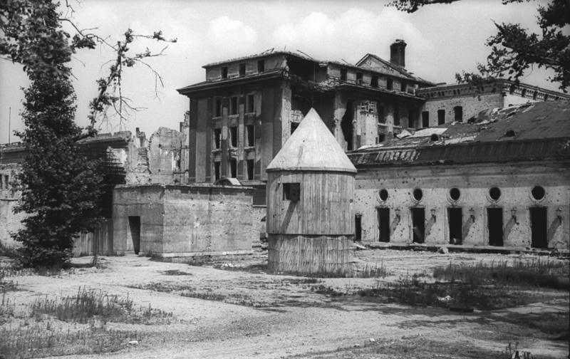

### Hitler

W nocy z 29 na 30 kwietnia Hitler wysłał ostatnią depeszę z pytaniem o sytuację na froncie. Odpowiedź upewniła go, że już pora. O godz. 0100 generał Keitel zameldował, że wszystkie oddziały wojskowe, z którymi wiązano nadzieję na odsiecz, są albo okrążone albo zepchnięte do defensywy.

Około godz. 0230 Hitler pojawił się w korytarzu, gdzie oczekiwało na niego około 20 osób przygotowanych do opuszczenia bunkra, w większości kobiety. Zebrali się, żeby go pożegnać. Przeszedł cały korytarz i wszystkim uścisnął dłonie, po czym wrócił do siebie. Ucieczka wiązała się z ogromnym ryzykiem, ale przynajmniej dawała szanse na przeżycie, na wtopienie się między cywilów i przeczekanie.

Nie było już nic więcej do zrobienia; samobójstwo było jedynym rozwiązaniem. Hitler spędził niespokojną noc, o godzinie 0600 wezwał generała Mohnke, który poinformował go, że Rosjanie są już w słynnym hotelu Adlon na skrzyżowaniu Wilhelmstrasse i Unter den Linden. Znajdowali się również w tunelach U-Bahn na Friedrichstrasse i tuż za Kancelarią, pod Voßstraße. Opór się kończył. Oczekiwano zmasowanego frontalnego ataku na Kancelarię najpóźniej o świcie następnego dnia, 1 maja. Generał Mohnke oświadczył Hitlerowi, że garnizon nie jest w stanie bronić miasta dłużej niż dwa dni. Hitler przyjął to wszystko spokojnie, pogodził się ze swoim losem. Potem przekazał Mohnke kopie swoich testamentów w celu dostarczenia ich admirałowi Dönitzowi.

Później Hitler miał spotkanie z komendantem miasta generałem Weidlingiem, który powiedział mu, że prawdopodobnie tej nocy skończy się amunicja, a garnizon nie jest w stanie walczyć dłużej niż 24 godziny. Weidling ponowił prośbę o przełamanie tej nocy, chciał uciec. Hitler milczał, nie odpowiedział i w końcu Weidling wrócił do swojej kwatery w Bendlerblock.

Rano 30 kwietnia młody porucznik SS dostarczył generałowi Weidlingowi w jego kwaterze głównej przy Bendlerstrasse list od Hitlera, który brzmiał:
>W przypadku braku amunicji lub zapasów w stolicy Rzeszy wyrażam zgodę, aby nasze wojska podjęły próbę ucieczki. Operacja ta powinna być zorganizowana w możliwie najmniejszych zespołach bojowych. Należy dołożyć wszelkich starań, aby połączyć się z jednostkami niemieckimi, które nadal walczą poza Berlinem. Jeśli nie można ich zlokalizować, siły Berlina muszą schronić się w lesie i tam kontynuować opór.

Na porannej odprawie w bunkrze Führera generał Krebs poinformował, że Rosjanie kontrolowali teraz obie strony Leipziger Strasse, a pozycja na Dworcu Anhalckim właśnie padła. Zewsząd zbliżali się czerwonoarmiści.

W południe generał Weidling zwołał konferencję dowódców Sektora Obrony, na której poinformował ich o rozkazie zezwalającym na próbę ucieczki. Poinstruował ich, aby zaplanowali ucieczkę o godz. 2200 tej nocy.

### Samobójstwo

Hitler, dwie sekretarki i jego osobisty kucharz zajęli się posiłkiem. Zjedli spaghetti w szarym sosie i Hitler jeszcze raz pożegnał się ze wszystkimi. Do Gertrud Junge powiedział:
>Teraz to już wszystko zaszło tak daleko, że to już koniec. Do zobaczenia

Ze wszystkimi pożegnała się także Eva Hitler i oboje udali się na kwaterę. Była godz. 1430.

Pułkownik Otto Gunsche zajął miejsce przed drzwiami, to była jego pora warty. Jak później opisywał:
>Była to jedna z najtrudniejszych rzeczy, jakie kiedykolwiek przyszło mi wykonywać. Była godzina 3.30 może 3.40. Starałem się uporać ze swoimi uczuciami. Zdawałem sobie sprawę, że musi popełnić samobójstwo. Innego wyjścia nie było.

Ale jeszcze zanim padł strzał, nastąpił, jak to opisuje Cornelius Ryan:
>przykry zgrzyt. Nagle podbiegła do niego Magda Goebbels, jakby oszalała, żądając widzenia się z Hitlerem. Gunschemu nie udało się jej tego wyperswadować, toteż zapukał do pokoju Hitlera. "Führer stał w swoim gabinecie. Ewy nie było w pokoju, ale z łazienki dochodził szum wody. Pomyślałem, że jest tam. Hitlera zirytowało moje nagłe wejście. Zapytałem go, czy zechce przyjąć Frau Goebbels. "Nie chcę z nią więcej mówić" - powiedział. Wyszedłem. W pięć minut później usłyszałem strzał.

Kilka minut potem lokaj Hitlera Heinz Linge i Bormann weszli do kwatery Hitlera, Linge potem zeznał, że od razu poczuł zapach palonych migdałów charakterystyczny dla kwasu pruskiego. Adjutant Hitlera SS-Sturmbannführer Otto Günsche odnalazł oba ciała na sofie, Hitler miał otwór na prawej skroni i był zakrwawiony, zastrzelił się ze swojego Walthera PPK 7.65, który leżał na podłodze. Günsche and SS-Brigadeführer Wilhelm Mohnke potwierdzili, że nikt z zewnątrz nie miał dostępu do kwatery Hitlera w czasie samobójstwa (tj. między 15 a 16).

Günsche opuścił kwaterę i ogłosił, że Hitler nie żyje. Zgodnie z wcześniejszymi, spisanymi i ustnymi wskazówkami Hitlera oba ciała zawinięte w koce zostały przez wyjście bezpieczeństwa wyniesione na zewnątrz do ogrodu na tyłach Kancelarii Rzeszy, oblane benzyną i spalone uprzednio przygotowaną benzyną.

Misch zameldował o śmierci Hitlera Franzowi Schädle i wrócił do łącznicy telefonicznej. Linge wrócił do bunkra po papier, bo same ciała nie chciały zająć się ogniem. Bormann zapalił zwój papieru i cisnął na zwłoki, a kiedy zapłonęły wszyscy tam obecni: Bormann, Günsche, Linge, Goebbels, Erich Kempka, Peter Högl, Ewald Lindloff i Hans Reisser unieśli ręce w hitlerowskim pozdrowieniu.

C. Erich Kempka wspomina:
>byliśmy znowu uwięzieni przez samą obecność zwłok Hitlera

Swąd spalonych ciał rozszedł się po systemie wentylacyjnym
>Nie mogliśmy się go pozbyć. Śmierdziało jak przypalający się boczek.

Dopiero w momencie śmierci Hitlera żołnierze niemieccy byli zwolnieni z przysięgi, która zobowiązywała ich do walki na rozkaz Partii (niem. Führereid). Wbrew powszechnemu mniemaniu ta osobliwa, nieznana gdzie indziej formuła przysięgi nie była inicjatywą Hitlera. Werner von Blomberg szef ministerstwa Reichswehry wprowadził ją 2 sierpnia 1934 po Nocy Długich Noży i śmierci Hindenburga.

Około godz. 1615 Linge rozkazał SS-Untersturmführer Heinzowi Krügerowi i SS-Oberscharführer Wernerowi Schwiedelowi spalić zakrwawiony dywan z pokoju Hitlera. Jakiś czas później zwęglone ciała zakopano w pobliskim kraterze po wybuchu. Cała sprawa była utrzymywana w ścisłej tajemnicy w gronie nielicznych wtajemniczonych.

<BoxImageWrapper>

Bunkier Hitlera przed zniszczeniem, ciała Evy i Adolfa Hitler zostały spalone po lewej stronie od widocznego wejścia. 
By Bundesarchiv, Bild 183-V04744 / CC-BY-SA 3.0, [CC BY-SA 3.0 de](https://creativecommons.org/licenses/by-sa/3.0/de/deed.en), [Link](https://commons.wikimedia.org/w/index.php?curid=5437633)
</BoxImageWrapper>

### Joseph Goebbels

W tej sytuacji Goebbels, który jako wyznaczony testamentem Hitlera jego następca i kanclerz miał formalny tytuł do ustanowienia nowego rządu, zainicjował negocjacje z Armią Czerwoną. Musiał wyprzedzić ewentualne działania Himmlera. Ani Goebbels, ani Himmler nie rozumieli, że alianci z każdej strony uważali wszystkich nazistowskich przywódców za zbrodniarzy wojennych i nie mieli zamiaru z nimi negocjować. Poza tym, co takiego Goebbels albo Himmler mogli im zaproponować? Nawet Dönitz zdecydował, że Goebbels, Bormann i Himmler nie wejdą do nowego rządu.

Bormann o godz. 1835 wysłał depeszę do Dönitza, nie było tam informacji o śmierci Hitlera:
>Führer wyznaczył ciebie, Admirale, na swojego następcę w miejsce marszałka Rzeszy Göringa. Wysłane zostało pisemne potwierdzenie. Niniejszym jesteś upoważniony do podjęcia wszelkich działań, których wymaga sytuacja.

Tak zresztą zrozumiał to Dönitz, bo jeszcze następnego dnia o godz. 0122 zasygnalizował dalszą deklarację lojalności wobec Hitlera.

W międzyczasie generał Weidling, który kontynuował przygotowania do zerwania władzy Hitlera, otrzymał od Krebsa wiadomość, w której nakazał mu zgłosić się do bunkra Führera i cofnął pozwolenie na ucieczkę. Weidling odebrał wiadomość około godz. 1900 i jak później opisał, prawie godzinę zabrało mu dotarcie do bunkra, gdzie czekali na niego Goebbels, Bormann i Krebs. Ten ostatni powiedział, że Hitler się zabił, jego ciało zostało spalone, a sprawa samobójstwa musi zostać utrzymana w tajemnicy.

Dowódca sektora porucznik Seifert skontaktował się z nieprzyjacielem w sprawie bezpiecznego przejścia dla generała Krebsa do sowieckiego sztabu.

Zaczęły sę negocjacje, więc ucieczka tego dnia została odwołana.

### Berlin

#### Reichstag

Rosjanie wyrzucili z piwnic cywilów i trzymając ich ma muszce, kazali oczyścić przeszkody, wielu z nich zginęło od ognia wciąż broniących się żołnierzy niemieckich.

O godz. 0400 150 Dywizja Strzelecka zakończyła oczyszczanie Ministerstwa Spraw Wewnętrznych, a 171 Dywizja Strzelecka w zachodniej części Dzielnicy Dyplomatycznej. Jej 525 pułk parł wzdłuż Alsenstrasse, a 380 pułk zajął budynek ambasady szwajcarskiej z widokiem na Königsplatz i ich ostateczny cel. Straty po obu stronach były ogromne, 469 pułk strzelecki 150 Dywizji Strzeleckiej zniknął na zawsze.

Nie było wytchnienia w walce. Zaledwie pół godziny później, o godz. 0600 bez rozpoznania, ani nawet przygotowania artyleryjskiego, ci sami żołnierze którzy właśnie zakończyli walki w budynku, zostali rzuceni na otwartą przestrzeń w ogień wroga. Dotychczasowy ostrzał okolicy Reichstagu dał niewiele. Co więcej, okazało się wtedy, że Opera Krolla, wielki (nieistniejący obecnie) budynek naprzeciwko Reichstagu została zamieniona w fortecę, z karabinami maszynowymi i artylerią. Atakujący Reichstag czerwonoarmiści znaleźli się w krzyżowym ogniu z trzech stron naraz. Pierwszy atak momentalnie został zniszczony.

Tak więc, żeby zdobyć Reichstag, trzeba było zdobyć Operę Krolla, ale żeby zdobyć Operę Krolla, trzeba było wyprzeć Niemców z budynków przy Schlieffenufer (obecnie nadbrzeże i zachodnia część John-Foster-Dulles-Allee). To wszystko wymagało czasu i krwi. Wzmocniono artylerię w zdobytym już rejonie pruskiego MSW, w sumie o ok. 90 luf. Do ataku wyznaczono 597 i 598 pułki 207 Dywizji Strzeleckiej.

O godz. 1130 150 Dywizja Strzelecka, która walczyła z niewielkimi przerwami od północy, po przygotowaniu artyleryjskim kolejny atak. 380 pułk z poselstwa szwajcarskiego ominął zalany rów przeciwczołgowy i dotarł aż do zalanej stacji U-Bahn Bellevue. Niemcy przeprowadzili kilka lokalnych kontrataków, m.in. przez Alsenstrasse (obecnie nieistniejąca, jest to Spreebogenpark) odparty przez 525 pułk.

O godz. 1300 ta sama 150 Dywizja Strzelecka po poważnym 30-minutowym przygotowaniu artyleryjskim kolejny atak. Prawe skrzydło ataku zostało przygwożdżone ogniem z Tiergarten Flakturm, ale na lewym 171 pułk oczyścił wschodnią część dzielnicy dyplomatycznej i zabezpieczył pozycje na Kronprinzenbrücke. Udało się również wprowadzić czołgi i działa samobieżne na linię rowu przeciwczołgowego, żeby zapewnić ogień amfiladowy do ataku na Reichstag.

Piechotę czekało ostatnie 200 m najeżone przeszkodami, minami, drutem kolczastym i okopami. Potrzebowali osłony ciemności.

Kolejny atak nastąpił po godz. 1800 i dzięki bezpośredniemu wsparciu ognia broni pancernej udało się doskoczyć do Reichstagu. Drzwi były zamurowane, ale mieli ze sobą lekkie moździerze i ustawiając je poziomo, wywalili przejście i z gromkim URAAA! wdarli się do głównego holu.

Chorąży wbiegli ze sztandarem pułkowym, łączność ze sztabem udało się nawiązać, kiedy byli już na drugim piętrze. Okazało się, że Rada Wojskowa 3 Armii Uderzeniowej miała przygotowany na tę okazję specjalny Czerwony Sztandar nr 5 i wysłała delegację członków partii i Komsomołu, by natychmiast powiesić go na Reichstagu. W tym czasie zapadły ciemności, rozgorzały walki w płonącym i bombardowanym od wielu dni budynku. Czerwonoarmiści walczyli w kompletnie nieznanym otoczeniu, nie wiadomo było kto swój a kto wróg, strzały padały zewsząd.

#### Od zachodu

30 kwietnia doszło do szczególnie zaciętych walk w Charlottenburg i Wilmersdorf, gdy na linii S-Bahn spotkały się 2 i 3 Gwardyjska Armia. Niemcy zaciekle walczyli o utrzymanie przejścia na zachód. To była ich ostatnia droga ucieczki.

55 Gwardyjska Brygada Pancerna po powrocie na Westend napotykała na coraz większą presję oddziałów niemieckich nacierających na zachód. 1 Korpus Zmechanizowany wysłał resztki 19 i 35 Brygady Zmechanizowanej w dół Schlossstrasse, aby oczyścić obszary na północ i południe od Kantstrasse, kierując się w stronę Zoo, podczas gdy 219. Brygada Pancerna zmierzała Berliner Strasse (obecnie Otto-Suhr-Allee) w kierunku Am Knie.

Straty piechoty 2 Armii Pancernej Gwardii osiągnęły 90%, dlatego zdecydowano się na wsparcie 1 DP z 1 Armii WP.

- 1 pułk piechoty został podzielony na zespoły bojowe przydzielone do 19 i 35 Brygady Zmechanizowanej
- 2 pułk piechoty do 219 Brygady Pancernej walczącej na północ od Bismarckstrasse
- 3 pułk piechoty został przydzielony do 66 Gwardyjskiej Brygady Pancernej 12 Gwardyjskiego Korpusu Pancernego, która z powodu braku wsparcia piechoty straciła już 82 czołgi, większość już w Berlinie.

Poza pojedynczymi punktami oporu chaotycznie rozrzuconymi po mieście jedyne wciąż bronione obszary to budynek Reichstagu, dworzec kolejowy Friedrichstrasse, Gendarmenmarkt, Ministerstwo Lotnictwa i Kancelaria Rzeszy. Było to wciąż 10 tys. żołnierzy, policji i Volkssturmu, w tym zagraniczni ochotnicy z Waffen-SS (Dywizja Grenadierów Pancernych SS Nordland oraz 15 Batalion Fizylierów SS łotewski).

#### Od południa

O północy 30 kwietnia bitwa nagle ucichła. Zaczął się maj, największe święto sowieckie.

Marszałek Żukow ponaglił Czujkowa do działania, ale ten odparł, że jego ludzie mają już dość, wojna jest wygrana i nikt nie chce umierać w Berlinie.

Wygląda na to, że poza walkami o Reichstag nastąpiło odprężenie. Zdarzały się jeszcze krótkie i gwałtowne starcia, ale czerwonoarmiści zaczęli już świętować, a Niemcy szykowali się do ucieczki lub niewoli.

### 9 Armia

W międzyczasie resztki 9 Armii generała Busse, kierując się otrzymanymi przez radio wskazówkami generała Wencka, dotarły do wsi Wittbrietzen 6 km na południe od Beelitz. 30 kwietnia do południa dotarli do wsi Kummersdorf Gut, gdzie na poligonie krótko odpoczęli.

Zaatakowali sowiecki kordon na drodze Berlin - Luckenwalde i usiłowali przebić sę na zachód. Cały czas ostrzeliwani przez lotnictwo i artylerię nieprzyjaciela. Nieustające, uporczywe ataki nękające.

Podobno pojawiły się tam także słynne Seydlitz-Truppen, czyli walczące u boku Armii Czerwonej oddziały Niemców w niemieckich mundurach. Jednak istnienie większych tego typu formacji nie jest w ogóle potwierdzone. Mały oddział tego typu pojawi się wkrótce we Wrocławiu, ale powołanie jednostek bojowych jest w świetle dokumentów historycznych wątpliwe. Nazwa bierze się od nazwiska generała Walthera von Seydlitz-Kurzbacha, który rozczarowany postawą Hitlera i Paulusa po wzięciu do niewoli w Stalingradzie poszedł na pełną współpracę z sowietami. Stanął na czele organizacji niemieckich jeńców wojennych współpracujących z Armią Czerwoną. Relacje o tym, że takie oddziały pojawiły się w bitwie o Berlin, są zawsze tego typu, że ktoś wspomina, że słyszał od kogoś.

- ["Mysteriöse "Seydlitz-Truppen": Kämpften die Sowjets wirklich mit deutschen Truppen gegen die Nazis?"](https://de.rbth.com/geschichte/80066-seydlitz-truppen-kaempften-sowjets-wirklich-mit-deutschen)

Wcześnie rano kilka razy natknęli się na sowieckie zgrupowania m in oddziały 5 Gwardyjskiego Korpusu Zmechanizowanego i musieli je wyminąć. 1 maja napotkali szpice 12 Armii generała Wencka, mając już tylko jednego Tygrysa.

Busse oszacował później, że do Wencka dotarło około 40 tys. żołnierzy i kilka tysięcy uchodźców. Inne szacunki są niższe. Koniew: z 200 tys 9 Armii generała Bussego do Beelitz dotarło 30 tys., ale ostatecznie do Wencka mogło się przedostać 3 może 4 tys.

### 1 Armia WP

Żukow, mając zgodę Stalina, rozkazał, żeby przewieźć 1 DP im Tadeusza Kościuszki w rejon walk i przydzielenia im odcinków. Zameldowali się o godz. 0730 i weszli do walki m.in. w zachodniej części Tiergarten i w rejonie Politechniki.

Dziś do walki wszedł 2 pułk piechoty, atakując z północy, przez Franklinstraße w kierunku Politechniki. W nocy zdobyli silnie broniony zespół Politechniki.

- ["Szturm Berlina 1945"](https://historiamniejznanaizapomniana.wordpress.com/2015/04/30/szturm-berlina-1945/)

### 2 Front Białoruski

2 Front Białoruski po zdobyciu Szczecina rozdzielił atak, kierując część sił w kierunku Berlina, a resztę na zachód w kierunku Łaby.

### Demmin

Wysadzenie mostów na Pianie (niem. Peene) zatrzymało Armię Czerwoną w niewielkim mieście 80 km na zachód od Świnoujścia.

Tej nocy rozpętała się orgia szaleństwa i zbrodni trwająca aż do rana. Gwałty, morderstwa, podpalenia doprowadziły kilkuset mieszkańców Demmin do samobójstwa. Prawie całe centrum miasta zostało wypalone.

### KL Ravensbrück

2 Front Białoruski wyzwolił ostatni duży hitlerowski obóz koncentracyjny - Ravensbrück. Kiedy weszły tam wojska sowieckie wciąż żyło 3,5 tys. więźniów, poinformowali żołnierzy, że obóz opuściła liczna kolumna Marszu Śmierci, jak się później okazało ponad 24 tysiące więźniów konwojowanych w kierunku północnej Meklemburgii.

Wszystkich odnalazł i uratował pościg.

- ([Ravensbrück - hitlerowskie piekło kobiet](http://www.polskieradio.pl/39/156/Artykul/1430352,Ravensbr%C3%BCck-hitlerowskie-pieklo-kobiet)).

### Völkischer Beobachter

Ukazał się ostatni numer Völkischer Beobachter (Narodowy Obserwator), oficjalnego organu prasowego NSDAP. Prawdopodobnie pismem najbardziej kojarzonym z narodowym socjalizmem był Der Sturmer, ale słynące z propagandy nienawiści dzieło Juliusa Streichera było tylko brukowcem, który przygotowywał społeczeństwo do rasistowskich ustaw i eksterminacji.

Nawet jeżeli tezy Sturmera nie były akceptowane w szerokich kręgach społecznych, samo istnienie takiej szczekaczki w przestrzeni publicznej zatruło społeczeństwo i po raz kolejny większość dobrych ludzi nie zrobiła nic, by zatrzymać słowa nienawiści, co było znakomitym wstępem do sytuacji, kiedy ta większość dobrych ludzi była bezradna wobec zbrodni, która poszła za tymi słowami. Sturmer był tak agresywny i wulgarny, że zdarzało się, że członkowie NSDAP mieli zakaz czytania go, bo niektórzy gauleiterzy nie chcieli by ich partię kojarzono z potokiem plugastwa i tak prymitywną propagandą. Właściwym narzędziem propagandy i wizerunku Partii był właśnie Obserwator, choć to Szturmowiec w większym stopniu przyczynił się do tworzenia nastrojów społecznych. Dziś ta większość dobrych ludzi, obojętnie którą z gazet czytała, patrzyła na bomby spadające na ich domy, nagle dowiadywała się o obozach zagłady, które przez całe lata funkcjonowały za płotem a jedyna nadzieja, jaką mogła mieć, było to, że dostaną się do tej "lepszej niewoli". Mieszkańcy (w większości - mieszkanki) Berlina w tej sytuacji byli bez szans.

Gazeta partyjna NSDAP jest o tyle interesująca, że pokazuje pewną specyfikę mediów niemieckich i samych Niemiec. Był to lokalny monachijski tygodnik zatytułowany Münchner Beobachter. Kiedy umarł właściciel, wdowa sprzedała tytuł za 5 tys. marek Rudolfowi von Sebottendorf i tygodnik przeszedł na własność Towarzystwa Thule. Zmiana tytułu na Völkischer Beobachter nastąpiła w sierpniu 1919. Od 1920 jest to pismo NSDAP, a rok później formalnym właścicielem stał się Hitler. Od 1923 dziennik. No dobrze, co w tym interesującego? Interesujące jest to, że tak naprawdę jest to pierwsze ogólnokrajowe pismo w historii Niemiec. Ukazywało się jednocześnie w Berlinie, Monachium a od Anschlusu także w Wiedniu. Do tej pory wszystkie pisma miały charakter wyłącznie regionalny, nie było żadnej ogólnoniemieckiej gazety.

### Brygada Świętokrzyska NSZ

Po dwóch dniach marszu wysłany z Všekar czteroosobowy patrol Brygady Świętokrzyskiej do dowództwa amerykańskiej 2 DP (3 Armia Pattona) i nawiązał łączność radiową z Brygadą.

Od tej pory trwająca od połowy stycznia oficjalna kolaboracja NSZ z SS będzie wstydliwie pomijanym okresem w historii jednostki. Brygada Świętokrzyska będzie budować swoją legendę niepokornych antykomunistów i patriotów.

### Arthur Kobus

Generał Arthur Kobus zabił się w kwietniu po wkroczeniu Armii Czerwonej do Berlina, w kwietniu, nie jest znana data dzienna.

### William Darby

10 Dywizja Górska znowu ma pecha, śmiertelnie ranny odłamkiem został generał William Darby zastępca dowódcy dywizji. Służbę frontową miał za sobą, do Włoch powrócił na własną prośbę.

### Adam Tomaszewski

Podczas powrotu z obozu koncentracyjnego zmarł Adam Tomaszewski językoznawca, badacz gwar wielkopolskich i mazurskich.

### Monachium

Matecznik Partii zdobyty przez 7 Armię Amerykańską. Tylko lokalnie napotkała opór.

- [On April 30, 1945, the US Seventh Army captured Munich in Germany. They were promptly congratulated by Supreme Headquarters Allied Expeditionary Force on the destruction of the "Cradle of the Nazi Beast." On May 3, 1945, the second battalion was in Thalham. In the following days we advanced at a slow pace through streams of German soldiers who walked slowly to Munich or simply lay along the Autobahn. From time to time we encountered occasional gunfire, a symbolic backlash from a dying regime. At other times there were more armed German soldiers moving north than paratroopers from the 506th going south. As we drove into Bavaria as quickly as possible, literally thousands of Germans clogged the highways. American and German soldiers exchanged curious looks. I am convinced that both armies thought the same: leave me alone, I just want the war to end so I can go home. That evening we received a message that we would go to Berchtesgaden at 9:30 the next morning. The regiment ordered us to bring extra ammunition and rations.](https://www.facebook.com/joelstoppelsbftours/posts/3155660744703204)

### Wrocław

Przed świtem na lotnisku na pl. Grunwaldzkim podczas próby lądowania rozbił się ostatni samolot z 7 tonami amunicji (FBTODO trzeba sprawdzić tę informację, Niemcy nie mieli takiego samolotu).

Wiadomość o śmierci Hitlera dotrze do Wrocławia jutro wieczorem.

W kwietniu powstaje pierwszy obiekt powojennego Wrocławia - Cmentarz Oficerów Radzieckich we Wrocławiu.

W końcowych dniach kwietnia kształtuje się też ostateczna linia frontu: zachodnim skrajem lasu Osobowickiego do przystanku tramwajowego na p[poznańskiej trasie kolejowej i dalej na północny wschód od Polanowic dochodziła do Widawy jej lewym brzegiem do rowu powodziowego, na północny wschód od Swojczyc i do Odry naprzeciwko Wyspy Opatowickiej. Na południu zaś w rękach niemieckich przekształcone w silne punkty oporu były Opatowice, Nowy Dom i Bierdzany dalej na zachód linia frontu biegła Oławą, Piękną, Kamienną i na północ od Borowskiej do Lwowskiej i na skrzyżowaniu z Gajowicką ruinami Skwierzyńskiej i Pereca do nasypu średnicowej linii kolejowej w miejscu przecięcia z ulicą Grabiszyńską, dalej do Dworca Świebodzkiego i okolicami ulicy Inowrocławskiej ku Odrze w kierunku Wyspy Mieszczańskiej.

W ostatnich dniach wojny nasilono akcję propagandową, wszędzie słychać było gigantofony nawołujące do kapitulacji i oddania się w niewolę, coraz częściej też samoloty zrzucały ulotki zamiast bomb.

### Odnośniki

- Andy Snowslayer ["Traudl Junge, Albert Speer Interviews 1973 World at War" [YT 46:38]](https://www.youtube.com/watch?v=tuQAuGO9bnc)
- Mark Felton Productions ["Hitler's Fuhrerbunker - Episode 1" [YT 8:30]](https://www.youtube.com/watch?v=vatUvGAJQdk) | [Mark Felton Productions "Hitler's Fuhrerbunker - Episode 2" [YT 9:93]](https://www.youtube.com/watch?v=rcZU5fnqgHg) | ["Nazi Time Capsule Berlin Bunker" [YT 3:26]](https://www.youtube.com/watch?v=FBxRIjOcFdY) | ["Destroying the Fuhrerbunker - 30th Anniversary" [5:17]](https://www.youtube.com/watch?v=VhgY2xKdNSo) | ["Inside The Fuhrerbunker - The Photographs 1945 - 1988" [YT 4:08]](https://www.youtube.com/watch?v=ymWyPX7ARD0) | ["Hitler's Dog Blondi" [YT 2:31]](https://www.youtube.com/watch?v=-rX2TicL5eg)
- Martin b.brown ["Adolf Hitler Berlin bunker" [YT 7:14]](https://www.youtube.com/watch?v=8BgKowYvUhE) | ["Adolf Hitler Berlin bunker part 2 /https://www.youtube.com/watch?v=8BgKowYvUhE" [YT 4:30]](https://www.youtube.com/watch?v=xsqWYdx7v5U)
- NORD XR ["Führerbunker VR - Experience the End of the Third Reich in Hitler's Last Hideout" [YT 1:08]](https://www.youtube.com/watch?v=fr2zEQFTUCk)
- Panorama-b Sightseeing Berlin ["Hitler's Bunker and old Reich Chancellery" [YT 6:44]](https://www.youtube.com/watch?v=kanOomagwBw) | ["Führerbunker & Alte Reichskanzlei" [YT 6:41]](https://www.youtube.com/watch?v=5yBNBrtKNYk) | ["Hitler’s New Reich Chancellery" [5:25]](https://www.youtube.com/watch?v=O2OKMi7MceY)
- Mario Faroldi ["Die Neue Reichskanzlei" [YT 5:44]](https://www.youtube.com/watch?v=UFgfge4gN1o)
- Ruiter Productions ["Berlin Now & Then - Episode 8: Reich Offices | Reichs Chancellery" [YT 5:18]](https://www.youtube.com/watch?v=Xpdgfmj7uNc) | ["Berlin Now & Then - Episode 9: Reich Offices | Ministry of Propaganda" [YT 5:25]](https://www.youtube.com/watch?v=jLh3EnbTz1g) | ["Berlin Now & Then: the Reichshauptstadt of Adolf Hitler" [YT 1:46:54]](https://www.youtube.com/watch?v=fy3NVwcDD5g) | ["Berlin Now & Then - Episode 18: Battle of Berlin | Führerbunker" [YT 4:10]](https://www.youtube.com/watch?v=6yBEmFCFLiA) | ["Berlin Now & Then - Episode 19: Battle of Berlin | Capitulation" [YT 4:46]](https://www.youtube.com/watch?v=GHuVou2kYwY) | ["Berlin Now & Then: the Reichshauptstadt of Adolf Hitler" [1:46:54]](https://www.youtube.com/watch?v=fy3NVwcDD5g) | ["Obersalzberg Now & Then: the Mountain Retreat of Adolf Hitler" [YT 52:49]](https://www.youtube.com/watch?v=n63u-iHggSA)
- History Wench ["Breaking into Hitler's Fuhrerbunker: The Forbidden Photographs" [YT 4:21]](https://www.youtube.com/watch?v=a0uf3GRWS0g)