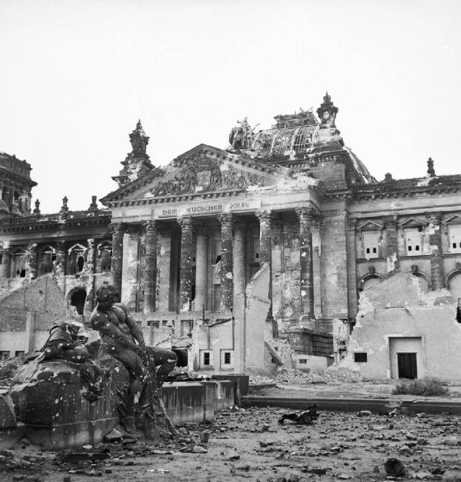

### Negocjacje

W nocy z 30 kwietnia na 1 maja Niemcy wysłali wiadomość, na długości radiowej używanej przez Armię Czerwoną, prosząc o spotkanie.

Krótko po północy generał SS Mohnke poprowadził grupę generała Krebsa do dowództwa sektora obrony podpułkownika Seiferta, a ten zapewnił bezpieczne przejście na linie radzieckie. Z Krebsem był pułkownik von Dufving, szef sztabu Weidlinga, a jako tłumacz, porucznik SS Neilands z 15 łotewskiego batalionu fizylierów SS, który nie był potrzebny, bo rzeczywistości Krebs mówił doskonale po rosyjsku.

Grupa Krebsa bezpiecznie dotarła na stanowisko dowodzenia 102 pułku 35 Gwardyjskiej Dywizji Strzeleckiej, 4 Gwardyjskiego Korpusu Strzeleckiego i została zabrana jeepem do kwatery głównej pułkownika Czujkowa w Tempelhof, gdzie dotarła o 0350.

Nikt się nie przedstawiał, głównym rozmówcą ze strony sowieckiej był generał Czujkow, który był tak zaskoczony prośbą o spotkanie, że nie zdążył nawet zebrać własnego sztabu, a co dopiero reprezentacji Frontu. Czujkow nie wyróżniał się w grupie innych oficerów, m.in. byli to pełniący rolę korespondentów wojennych pisarz Wsiewołod Wiszniewski, poeta Jewgienij Aronowicz Dolmatowski i kompozytor Matwiej Isaakowicz Błanter (jeden szlachcic i dwóch Żydów). Dłuższą chwilę Krebs nie wiedział, kto jest dowódcą ani z kim rozmawia.

W pierwszym zdaniu Krebs poinformował:
>Moim zadaniem jest dostarczyć pismo nadzwyczajnej wagi i o poufnym charakterze. Chciałbym, żeby pan wiedział że jest pierwszym cudzoziemcem, który dowiaduje się, że 30 kwietnia Hitler popełnił samobójstwo.

Czujkow był zaskoczony, ale żeby nie dać Niemcom przewagi, odpowiedział że wie o tym. Zdumiony Krebs powiedział: "*Skąd pan o tym wie? Hitler popełnił samobójstwo zaledwie kilka godzin temu*". Potem dodał:
>29 kwietnia Hitler poślubił Ewę Braun. Ona także popełniła samobójstwo. Ich ciała spalono i pogrzebano. Miało to miejsce w bunkrze Führera.

Sowieci byli zaskoczeni, nie wiedzieli nic o bunkrze Hitlera, do tej pory wcale nie byli pewni czy Hitler w ogóle jest w Berlinie. Rozmowa była długa, Krebs chciał uznania nowego rządu Goebbelsa i oświadczył, że nie ma uprawnień do negocjowania bezwarunkowej kapitulacji - a było to jedyne, co mogli zaakceptować sowieci. Nalegał na uznanie grupy oficerów jako swego rodzaju rządu tymczasowego i zawieszenie broni. Warunkiem kapitulacji było uznanie przez sowietów rządu admirała Dönitza przez Związek Radziecki. Dokumenty przekazane przez Krebsa zostały natychmiast przesłane do sztabu Żukowa w Strausbergu, a ten natychmiast zadzwonił do Stalina.

Na bezpośrednie polecenie Stalina Czujkow odrzucił propozycje Krebsa, na podstawie umów sojuszniczych mogli przyjąć tylko bezwarunkową kapitulację. Wiedział, że choć opór sił niemieckich w Berlinie jest poważny, nie istnieje dowództwo garnizonu Berlin, że są to izolowane punkty oporu. Tak samo walki w rejonie Berlina zamieniły się w serię potyczek w terenie najczęściej podejmowanych w celu wyrwania się na zachód do niewoli amerykańskiej. Pojedyncze oddziały wciąż walczyły, ale Niemcy zostały pokonane.

Jedyne co wtedy ustalono to nawiązanie stałej łączności - pułkownik von Dufving został odesłany z sowieckim majorem łącznościowcem celem ułożenia kabla. Zostali jednak ostrzelani przez Niemców, major został ranny, a kabel okazał się zbyt krótki. Potem von Dufving został aresztowany przez SS, które uwolniło go dopiero po naleganiach, by skontaktować się z Mohnke. Zgłosił się do Goebbelsa i Bormanna. Kiedy przekazał informację, że sowieci akceptują tylko bezwarunkową kapitulację wobec wszystkich aliantów, Goebbels powiedział, że nie może się na to zgodzić i nakazał ściągnąć Krebsa. Goebbels wydawał się spokojny, Bormann był przestraszony.

Von Dufving wyruszył ponownie o godz. 1100 i zatelefonował do Krebsa ze stanowiska dowodzenia pułku. Krebs powiedział, że wciąż czekają na telefon z Moskwy, a tymczasem von Dufving powinien ponowić próbę nawiązania łączności telefonicznej z bunkrem Führera. Von Dufving wziął kolejny kabel polowy i podłączył go do pierwszego, ale prawie natychmiast ten drugi został przecięty ostrzałem. Znowu zatelefonował do Krebsa i powiedziano mu, że dzwoniono z Moskwy i że Krebs jest w drodze powrotnej. Kiedy razem bezpiecznie wrócili przez linie, Krebs zwolnił von Dufvinga, mówiąc, że niemiecka odpowiedź dla Rosjan zostanie przesłana na piśmie.

Kiedy Krebs wrócił do bunkra, cała okolica stała się celem koncentracji ognia artyleryjskiego. Sowieci wiedzieli, że Hitler nie żyje i gdzie znajduje się dowództwo. Żądanie natychmiastowej i bezwarunkowej kapitulacji wywołało wściekłość Goebbelsa, a wkrótce potem załamanie pozostałych w bunkrze i panikę.

Nie była to jedyna próba negocjacji Goebbelsa z sowietami. Pułkownik W. S. Antonow, dowódca 301 Dywizji Strzeleckiej 9 Korpusu Strzeleckiego, 5 Armii Uderzeniowej, również przyjął tego ranka delegację 4 oficerów pod dowództwem pułkownika. Wówczas dywizja Antonowa znajdowała się na prawym skrzydle korpusu i zbliżała się do Wilhemplatz (obecnie zachodnia część Mohrenplatz) od wschodu, a 248 i 230 Dywizja Strzelecka posuwała się odpowiednio na północ i południe od Leipziger Strasse. Kiedy pułkownik Antonow zameldował o przybyciu misji, dostał rozkaz, aby nie negocjował, ale kontynuował atak na Kancelarię. W międzyczasie niemiecki pułkownik skontaktował się z Kancelarią za pośrednictwem cywilnej sieci telefonicznej i otrzymał polecenie powrotu. Pułkownik Antonow pozwolił mu wrócić z jednym oficerem, dwóch pozostałych zatrzymał. Całość zajęła 3 do 4 godzin w trakcie chwilowego zawieszenia ognia.

### Goebbelsowie

Obie próby negocjacji zakończyły się niepowodzeniem. Stanowisko Armii Czerwonej było jednoznaczne, więc Goebbels zgodnie z wcześniejszym postanowieniem przygotował siebie i swoją rodzinę na śmierć. Generał Krebs, generał Burgdorf i pułkownik Franz Schaedl z gwardii honorowej Hitlera również wybrali samobójstwo.

Magda Goebbels miała ważny powód by spotkać się z Hitlerem, to była jej ostatnia szansa - choć bez żadnych perspektyw na powodzenie - by odwlec Hitlera od samobójstwa. Wiedziała, że od dawna życie jej, jej męża i jej dzieci zależy od Führera. Kiedy on się zabije, oni będą musieli pójść za nim. Wiadomość o żądaniu bezwarunkowej kapitulacji nie pozostawiła jej innego wyjścia.

Miała sześcioro dzieci, wszystkie miały imiona na literę H (jak Hitler). Nie było łatwo znaleźć lekarza, który się podejmie zabicia dzieci. W obecnej sytuacji w ogóle niewielu było dostępnych. W morderstwie pomógł Helmut Kunz dentysta, który zapewnił morfinę i doktor SS Ludwig Stumpfegger, który dostarczył ampułki z cyjankiem.

Istnieje kilka wersji, jak przebiegło samobójstwo Goebbelsów, ale najbardziej prawdopodobne było to, że dzieci zostały przekonane, że w podanym napoju są witaminy, a był tam środek usypiający. Było to ok. godz. 1800. Po krótkiej rozmowie o dawnych czasach ze znajomymi, kiedy dzieci zasnęły, Magda zabiła je wszystkie, wciskając im do ust kapsułki z cyjankiem. Jak potem się okazało, najstarsze dziecko walczyło. W innej wersji Magda dała im czekoladki ze środkiem usypiającym, a potem zabito je zastrzykiem.

Jak wspomina dr Naumann około godziny 2030 Magda Goebbels "*wstała i wyszła do pokojów dzieci. Po chwili wróciła pobladła i wstrząśnięta*" Goebbels natychmiast zaczął się ze wszystkimi żegnać, dodał żartobliwym tonem:
>Nie zmuszajmy naszych przyjaciół do wynoszenia ciał, wyjdziemy.

Goebbelsowie włożyli odzież wierzchnią i wyszli po schodach, aby popełnić samobójstwo w ogrodzie Kancelarii. Magda była "*tak wstrząśnięta, że ledwo mogła iść po schodach*". Najpierw Magda zagryzła kapsułkę z cyjankiem i osunęła się na ziemię. Joseph Goebbels strzelił jej w tył głowy. Ugryzł własną kapsułkę i strzelił sobie w głowę. Ich ciała następnie spalono w dole podobnie jak ciała Evy i Adolfa Hitlerów. W innej wersji wydarzeń Joseph zastrzelił żonę, a potem siebie, w jeszcze innej oboje zażyli truciznę, a żołnierz SS rozstrzelał ich pistoletem maszynowym.

Dzieci Goebbelsów znaleziono martwe, tylko Magda mogła je zabić. Goebbels przed śmiercią poprosił adiutanta, by ten spalił ciała jego i jego rodziny. Gunther Schwagermann, Werner Naumann pamiętnik Goebbelsa, 4 kwietnia 1970 wszystkie ich szczątki spalono i wrzucono do rzeki Ehle k Biederitz.

- [Mark Felton Productions "The Goebbels Government - Berlin 1945" [YT 19:16]](https://www.youtube.com/watch?v=gz8s-Zm1xIQ)

### Berlin

<SeeAlso txt="Berlin do 1945" url="/festung-breslau/article/berlin-opis" />

O północy 30 kwietnia bitwa nagle ucichła. Zaczął się maj, największe święto sowieckie. Marszałek Żukow ponaglił Czujkowa do działania, ale ten odparł, że jego ludzie mają już dość, wojna jest wygrana i nikt nie chce umierać w Berlinie.

Wygląda na to, że poza walkami o Reichstag nastąpiło odprężenie, zdarzały się jeszcze krótkie i gwałtowne starcia, ale czerwonoarmiści zaczęli już świętować, a Niemcy szykowali się do ucieczki lub niewoli.

Wobec fiaska dotychczasowych negocjacji Stalin nakazał wznowienia walk, które rozpoczęło przygotowanie artyleryjskie o godz. 1630.

Pułkownik Antonow miał właśnie rozpocząć swój atak na Kancelarię, kiedy niemiecki pułkownik pojawił się ponownie z białą flagą, ogłaszając, że Goebbels i jego rodzina popełnili samobójstwo, a jedynym następcą Hitlera był teraz admirał Dönitz. Bieg wydarzeń nie jest jasny, ale wydaje się, że na tym odcinku walki się skończyły.

Nie istniała już linia frontu. Walczyły pojedyncze, rozproszone punkty oporu. Głównie Reichstag i jego otoczenie i Zoo z Tiergarten Flakturm. Nadal trwały walki w dzielnicy rządowej. Wielkie żelbetowe gmachy ministerialne świetnie nadawały się do obrony: ministerstwa sprawiedliwości, spraw zagranicznych, poczty, Kancelarii Rzeszy. Inne punkty obrony stanowiły: Zeughaus, Biblioteka Państwowa, Opera, Bank Rzeszy, cała północna strona alei Unter den Linden, kwatera Gestapo i RSHA na Prinz-Albrecht-Strasse.

29 Gwardyjski Korpus Strzelecki zameldował przekroczenie Budapester Strasse i wdarcie się do Zoo, gdzie trwały walki. Zajęli również Kaiser-Wilhelm-Gedächtniskirche (Kościół Pamięci) na wschodnim końcu Kurfürstendamm (byli tam snajperzy i obserwatorzy artyleryjscy).

12 Gwardyjski Korpus Pancerny - tor wyścigowy (nieistniejący obecnie) po zachodniej stronie nasypu kolejowego między stacją Zoo a Szprewą.

28 Gwardyjski Korpus Strzelecki - obszar mieszkalny Tiergarten na północ od Landwehrkanal.

Zoo było okrążone i odcięte od kwatery Weidlinga i reszty Zitadelle.

79 Gwardyjska Dywizja Strzelecka zameldowała zdobycie Dworca Poczdamskiego i walczyła o stację U-Bahn.

Inne oddziały przekroczyły Bellevuestrasse z Potsdamer Platz na południowy kraniec Siegesallee. Zdobyte zostały skrzyżowanie Wilhelmstrasse i Leipziger Strasse oraz siedziba SS i Gestapo na Prinz-Albrecht-Strasse.

2 Gwardyjska Armia Pancerna ze wsparciem polskich pułków poczyniła postępy.

66 Gwardyjska Brygada Pancerna oczyściła obszar na północ od Landwehrkanal i zajęła stację S-Bahn Tiergarten.

219 Brygada Pancerna zaatakowała teren Politechniki. Na Am Knie (obecnie Ernst-Reuter-Platz) artylerię rozmontowano, a potem złożono na trzecim piętrze dla zapewnienia ognia na wprost w ataku na rozległej otwartej przestrzeni, gdzie Hitler przyjmował paradę z okazji 50 urodzin w 1939.

19 i 35 Brygada Zmechanizowana posuwały się na wschód, na kościół Trinitatiskirche Berlin-Charlottenburg na Karl-August-Platz i rejon stacji Charlottenburg.

3 Gwardyjska Armia Pancerna po drugiej stronie Kurfürstendamm nacierała w stronę nasypu kolejowego wyznaczającego granicę między Frontami, wieczorem czyszcząc budynki otaczające nasyp, a następnie spotykając się z oddziałami 2 Gwardyjskiej Armii Pancernej na Savignyplatz 2 maja o godz. 0830.

Wraz z zapadnięciem ciemności walki ponownie ucichły, a czerwonoarmiści wznowili świętowanie, na Pariser Platz upiekli wołu, a poeta Dolmatowski w mundurze marynarki wojennej, stojąc na czołgu, recytował niektóre ze swoich popularnych utworów rozentuzjazmowanej publiczności.

### 1 Armia WP

1 Dywizja Piechoty WP

- 2 pułk piechoty skierował atak na Dworzec ZOO i przez Hardenbergstraße nawiązano łączność z 1 Gwardyjską Armią Pancerną, w rejonie mostu na Kanale Landwehry z innymi oddziałami sowieckimi, cały obszar pomiędzy został zajęty przez pułk.
- 3 pułk piechoty rozpoczął natarcie z Franklinstraße i kierując się na południowy zachód dotarł do Englische Straße
- 1 pułk piechoty nacierał wzdłuż Bismarckstraße, Schillerstraße, Goethestraße w kierunku Zoo, przekroczył Leibnizstraße, w rejonie Karl-August-Platz nawiązał styczność z 1 pp.

### Reichstag

30 kwietnia pierwszy atak na Reichstag. Z powodu dymu zmrok zapadł wcześniej niż zwykle i walki zostały wstrzymane.

Bój o Reichstag miał się zakończyć 1 maja. Wyścig o zawieszenie czerwonej flagi na Reichstagu na poziomie Frontów został już rozstrzygnięty. Stawka odesłała wojska marszałka Koniewa. Ale teraz rywalizacja rozgrywała się na poziomie pułków. Oczywista była obsesja czerwonoarmistów, by zatknąć czerwoną flagę na budynku Reichstagu jeszcze 1 maja w robotnicze święto. Po jednej stronie kilka zmotywowanych do walki, doświadczonych i dobrze wyposażonych pułków sowieckich. Po drugiej kilka tysięcy żołnierzy niemieckich głównie SS i Hitlerjugend oraz pododdziały spieszonych marynarzy.

O godz. 1800 do natarcia na Reichstag ruszyły trzy pułki piechoty 150 Dywizji Strzeleckiej ze wsparciem czołgów i artylerii. Udało im wedrzeć się do wnętrza i zdobywać piętro po piętrze. Niemcy stopniowo cofali się na górne kondygnacje lub do piwnic. Pomimo tego zwycięstwa walki o budynek trwały całą noc i cały następny dzień.

Wielokrotnie podczas pisania tej kroniki pisałem o krwawych lub zażartych walkach, ale tego, co się rozegrało wtedy wokół budynku Reichstagu, nie odda żadne słowo. To była wściekła jatka. Armia Czerwona skoncentrowała cały ogień artyleryjski na budynku i broniących go barykadach, a obrońcy umocnieni, zdesperowani i dobrze zaopatrzeni w broń i amunicję strzelali z góry do atakujących falami czerwonoarmistów, zamieniając przestrzeń wokół budynku w pole śmierci.

- 674 i 756 pułk 150 Dywizji Strzeleckiej walczyły w budynku Reichstagu
- 380 pułk 171 Dywizji Strzeleckiej zabezpieczał przedpole, szczególnie wschodni róg Tiergarten aż do Pariser Platz i Hotelu Adlon
- Pozostałe dwa pułki 171 Dywizji Strzeleckiej zabezpieczyły brzeg rzeki i podejście do Siegesallee
- 207 Dywizja Strzelecka zabezpieczyła zachodnią flankę na północ od linii Charlottenburger Chaussee (obecnie Strasse des 17. Juni), która stanowiła granicę dla zbliżającej się od południa 8 Gwardyjską Armią Pancerną generała Czujkowa

Walki w Reichstagu trwały cały dzień 1 maja. Niemiecka obrona walczyła rozpaczliwie pod dowództwem SS-Obersturmführera (porucznika) Babicka, którego stanowisko dowodzenia znajdowało się w połączonej tunelem piwnicy budynku po drugiej stronie ulicy. Reichstagu płonął, żołnierze mdleli z braku wody i duszeni przez kurz i dym. Pomieszczenie po pomieszczeniu zdobywano, ale obrońcy wciąż walczyli i kontratakowali. Dopiero 2 maja o 1300 po otrzymaniu rozkazów od dowódcy garnizonu 1500 obrońców złożyło broń.

79 Korpus Strzelecki wziął ok. 2,6 tys. jeńców i zameldował 2,5 tys. zabitych przeciwników. Straty własne nie zostały podane, ale pomnik radziecki wzniesiony w pobliżu Reichstagu to grób 2500 żołnierzy. Projektanci pomnika to architekt Mikołaj Siergiejewski i rzeźbiarze Władmir Zigal oraz Lew Kerbel. Użyto bloków i elementów architektonicznych z ruin nowej Kancelarii Rzeszy. Ukończono go 11 listopada 1945 i była to pierwsza zakończona budowa w powojennym Berlinie. Z powodu lokalizacji pomnika w amerykańskiej strefie okupacyjnej każda celebracja była punktem zapalnym. Ilu czerwonoarmostów ma uczestniczyć w uroczystościach, czy mogą być sprawdzani, czy mogą mieć broń, czy mogą mieć amunicję, itd itp.

Jest kwestią sporną czy sowietom udało się zawiesić czerwoną flagę na Reichstagu przed północą. Według oficjalnych informacji Armii Czerwonej była godz. 2250 1 maja, kiedy czerwona flaga zawisła nad najważniejszym dla atakujących budynkiem Berlina. Marszałek Żukow triumfował.

*Reichstag po walkach o Berlin, 1945 
By No 5 Army Film &amp; Photographic Unit. Hewitt (Sgt)Post-Work: [User:W.wolny](https://commons.wikimedia.org/wiki/User:W.wolny) - (https://commons.wikimedia.org/wiki/File:IWMLondonThumbnail.jpg)This is photograph [BU 8573](https://www.iwm.org.uk/collections/search?query=BU+8573) from the collections of the [Imperial War Museums](https://www.iwm.org.uk/).(https://commons.wikimedia.org/wiki/File:Flag_of_the_United_Kingdom.svg), Domena publiczna, [Link](https://commons.wikimedia.org/w/index.php?curid=640204)*

### Kapitulacja

Generał Weidling zwołał spotkanie dowódców sektorów obrony wieczorem w Bendlerblock. Odnowiono połączenie telefoniczne ze stanowiskiem dowodzenia w Zoo. Wezwano stamtąd pułkownika Wöhlermanna, który dotarł z wielkim trudem. Zdecydowano, że nie ma alternatywy dla kapitulacji i wkrótce po północy rozpoczną negocjacje z Sowietami.

Kiedy Wöhlermann wrócił do Zoo, okazało się że część załogi już uciekła, ale wciąż ma 2 tys. żołnierzy i kilkadziesiąt tys. cywilów. Kiedy zrobiło się jasno, wymaszerowali do niewoli, Wöhlermann był zdumiony liczbą czołgów i czerwonoarmistów. Ci szczęśliwi z zakończenia wojny zachowywali się przyjaźnie i bez problemu zaakceptowali propozycję, by chłopców z Hitlerjugend puścić do domów.

Weidling chciał poddać się nie wcześniej jak o północy z 1 na 2 maja, by umożliwić przeprowadzenie próby wyrwania się z miasta pod osłoną nocy. Czas akcji wyznaczono na godz. 2200.

O godz. 2240 1 maja 79 Gwardyjska Dywizja Strzelecka odebrała następującą wiadomość radiową w języku rosyjskim powtórzoną 5 razy:
>Tu niemiecki LVI Korpus Pancerny. Prosimy o wstrzymanie ognia. O 0500 czasu berlińskiego wysyłamy posłów na pertraktację na Moście Poczdamskim. Sygnał rozpoznawczy to biały kwadrat z czerwonym światłem. Czekamy na odpowiedź.

Odpowiedź:

>Twoja wiadomość otrzymana, wiadomość otrzymana. Prośba została przekazana do przełożonego.

Niemcy potwierdzili:

>Rosyjska stacja odbieram cię. Zgłaszasz się do przełożonego.

Generał Czujkow rozkazał zaprzestać walk w rejonie, w którym mieli się pojawić wysłannicy. Pułkownik Theodor von Dufving udał się jednak do pozostałości Bendlerbrücke, gdzie był sowiecki przyczółek i przekazał wiadomość, że generał Weidling jest gotowy na kapitulację. Pułkownik Szemczewko, p/o dowódcy dywizji zapytał, ile czasu będą potrzebować na przygotowanie się, na co dostał odpowiedź, że 3 do 4 godzin i muszą to zrobić w ciemności, bo Goebbels rozkazał strzelać do poddających się, a wciąż było wielu fanatycznych hitlerowców.

Wtedy nadeszła wiadomość od generała Czujkowa, że pułkownik von Dufving ma wrócić do generała Weidlinga i poinformować go, że jego propozycja kapitulacji została przyjęta. Gwarantowano honorowe warunki; oficerowie mogliby zachować broń boczną, każdy mógł zabrać tyle bagażu podręcznego, ile mógł unieść, a sowieckie Naczelne Dowództwo zapewniało ochronę ludności cywilnej i opiekę nad rannymi.

W międzyczasie dr Hans Fritzsche, stały podsekretarz w Ministerstwie Propagandy, jako najwyższy rangą cywilny urzędnik rządowy postanowił działać. Poprosił sowietów o opiekę nad cywilami. Jego delegacja przybyła do siedziby Czujkowa o godz. 0530 z prośbą, by nadać do cywilów wiadomość radiową. uzyskał zgodę i przydzielono mu eskortę do stacji radiowej.

Z 47 Gwardyjskiej Dywizji Strzeleckiej dotarł meldunek, że Niemcy ustawiają się w kolumnach. Czujkow zarządził natychmiastowe zawieszenie broni na swoim obszarze działań.

2 maja o godz. 0400 przybył generał Weidling, mówiąc że postanowił nie konsultować się z Goebbelsem w sprawie kapitulacji garnizonu (nie wiedział, że Goebbels już nie żyje). Generał Czujkow zapytał Wieldinga, gdzie jest Krebs, na co ten odpowiedział, że nie wie, ostatni raz widział go wczoraj, ale chyba popełnił samobójstwo. Z kwatery głównej marszałka Żukowa w Strausbergu przybył generał Sokołowski i po udzieleniu odpowiedzi na kilka pytań generał Weidling napisał rozkaz kapitulacji:
>30 kwietnia Führer, któremu wszyscy złożyliśmy przysięgę wierności, porzucił nas, popełniając samobójstwo. Wierni Führerowi, żołnierze niemieccy, byliście gotowi kontynuować bitwę o Berlin, mimo że brakowało wam amunicji i ogólna sytuacja sprawiła, że dalszy opór stał się bezsensowny. Teraz nakazuję natychmiastowe zaprzestanie oporu. Z każdą godziną walki powiększa się straszliwe cierpienie ludności cywilnej i rannych. W porozumieniu z Naczelnym Dowództwem Sił Radzieckich wzywam was do natychmiastowego zaprzestania walki. 
>Weidling 
>Generał artylerii 
>Były Komendant 
>Obszaru obrony Berlina

Treść została zaakceptowana i sztab generała Weidlinga dostał misję ogłoszenia rozkazu. Weidling został następnie przewieziony do siedziby Wydziału Politycznego w Johannisthal, gdzie nagrał swój rozkaz kapitulacji, odtwarzany potem przez sowieckie pojazdy propagandowe.

### Operacja berlińska

2 Front Białoruski osiągnął linię Wittenberge - Parchim - Bad Doberan 2 maja, wypierając resztki 3 Armii Pancernej i 21 Armii.

W międzyczasie brytyjska 21 Grupa Armii zajęła Lubekę i Wismar, a amerykańska 9 Armia zajęła Ludwigslust i Schwerin.

Siły niemieckie zajmowały już tylko teren o szerokości zaledwie 20 do 30 km.

Tej nocy generałowie von Manteuffel i von Tippelskirch poddali swoje armie Amerykanom.

1 Front Białoruski musiał jeszcze dokończyć oczyszczanie do Łaby, aby zakończyć swoją część operacji berlińskiej.

1 maja flankujące armie posunęły się naprzód, aby następnego dnia można było utrzymać postęp w kierunku zachodnim. 33 Armia wyruszyła z Kropstädt, 69 Armia z Niemegk, 3 Armia z Brandenburga, 47 Armia z Rathenow, 1 Armia WP z południa a 61 Armia z północy Havelberg.

Do 6 maja dotarli do Łaby na całej długości z wyjątkiem odcinka 12 Armii Wencka, gdzie XX Korpus trzymał ich na dystans przez kolejny dzień, aby umożliwić dokończenie ewakuacji.

Operacja berlińska zakończyła się. Liczby podane przez Armię Czerwoną dla trzech frontów:

- 480 tys. jeńców, 1500 czołgów i dział samobieżnych, 8600 dział i moździerzy oraz 4500 samolotów.
- Straty własne 305 tys. zabitych, rannych i zaginionych w okresie od 16 kwietnia do 8 maja 1945, strata 2165 czołgów i dział samobieżnych.
- Medal za zdobycie Berlina (ros. Медаль "За взятие Берлина") został przyznany 1 082 000 osobom, dotyczy też jednostek zaplecza.
- Sowieckie cmentarze wojskowe w Berlinie (Treptow, Pankow i Tiergarten) łącznie 20 tys zmarłych.

### Śmierć Hitlera

Przed godz. 2100 Goebbels i Bormann zasygnalizowali Dönitzowi wiadomość o śmierci Hitlera, 29 godzin po wydarzeniu, wraz ze szczegółami zawartymi w testamencie Hitlera.

Wtedy Dönitz już jako oficjalnie prezydent III Rzeszy, przekazał wieczorem Radio Hamburg wiadomość o śmierci Hitlera, nie ujawniając przyczyny śmierci, a następnie przemówił do narodu niemieckiego. Pierwszą oficjalną informacją o śmierci Radio Hamburg podało o godz. 2226.

Wieści te dotarły do wojsk w Berlinie z opóźnieniem, chociaż już wcześniej krążyły plotki.

Nikt nie wątpił w śmierć Hitlera, informację o niej podała ostatnia działająca oficjalna rozgłośnia hitlerowska w Hamburgu. Śmierć Führera miała dla oporu niemieckiego decydujące znaczenie. Jak już pisałem, Wehrmacht powstał w 1935 w miejsce Reichswery w efekcie nowej ustawy o poborze powszechnym, ale już wcześniej od 2 sierpnia 1945 wszyscy żołnierze niemieccy składali następującą przysięgę:
>Składam wobec Boga tę świętą przysięgę, iż wodzowi Niemieckiej Rzeszy i Narodu Adolfowi Hitlerowi, naczelnemu dowódcy sił zbrojnych, bezwzględnie będę posłuszny i jako dzielny żołnierz gotowy będę za tę przysięgę w każdej chwili życie swoje poświęcić.

Była to osobista przysięga wierności wobec konkretnego człowieka, która z Wehrmachtu tworzyła pozbawione jakiejkolwiek kontroli narzędzie woli tyrana. Jego śmierć wyzwalała żołnierzy z osobistego poddaństwa. Ale znajdowali się już w innej pułapce stworzonej przez Hitlera, który od dawna odsuwał do rezerwy dowódców, którzy byli zbyt samodzielni, którzy nie byli dostatecznie fanatyczni, w ten sposób w wyniku selekcji negatywnej po śmierci Hitlera rozkazy wydawali dowódcy wierni Partii tacy jak feldmarszałek Ferdinand Schörner.

### 12 Armia

W międzyczasie główny korytarz na zachód został zamknięty. Tego ranka 12 Armia Wencka zaczęła wycofywać się nad Łabę w kierunku na Tangermünde, podejmując walkę tylko kiedy było to potrzebne. Uciekinierzy z 9 Armii Bussego i grupy Reymanna, a także tysiące uchodźców.

Wenck wysłał generała Maximiliana Freisherra von Edelsheima, aby negocjował kapitulację z amerykańską 9 Armią. Jej dowódca generał William H. Simpson, zgodził się przepuścić przez rzekę tylu żołnierzy, ilu będzie w stanie (oprócz SS) i zaoferował pomoc przy rannych, ale absolutnie odmówił przyjęcia uchodźców cywilnych. Prawdopodobnie wynikało z problemów z wyżywieniem. Ale sytuację zmienił gwałtowny atak sowiecki, w wyniku którego Amerykanie musieli się wycofać i przejścia przez Łabę znalazły się pod kontrolą niemiecką.

Przejście trwało od 4 do północy 7 maja. XX Korpus był osłoną. Wenck podaje, że ewakuowano pomyślnie około 100 tys. żołnierzy i 300 tys. cywilów.

- [Captain J. McMahon of the U.S. Ninth Army carrying a little German girl over a destroyed bridge. May 1, 1945, Tangermünde, Germany.](https://www.facebook.com/veteransfoundation/posts/pfbid0xN4LrodAU26gH7myRW25fReLMtWz8dAkESxsy5nQiCR5xEV5WYKF3kp69veks1tyl)

### 9 Armia niemiecka

To ostatni dzień wojny dla 9 Armii generała Bussego. Mimo największych wysiłków nie udało im się przedrzeć do 12 Armii Wencka. Brakowało im 3 km. Grupce żołnierzy pod osłoną ostatniego działającego czołgu udało się przeskoczyć tę odległość, ale to było wszystko. Armia została rozbita, dalszy opór nie miał sensu. 60 tys. żołnierzy zginęło, 120 tys. dostało się do sowieckiej niewoli.

Od tej pory 12 Armia Wencka zmienia charakter i cel działania. Ponieważ połączenie i pomoc dla 9 Armii była niemożliwa, jedyne co pozostaje do zrobienia to ratować się. Połączyli się z uciekającym garnizonem twierdzy poczdamskiej. Pod ochronę żołnierzy niemieckich zgłaszały się tysiące cywilów. Armia Czerwona atakując na odcinku pomiędzy Havelbergiem a Rathenow, usiłowała rozbić oddział przed dojściem go Łaby.

- [Mark Felton Productions "Hitler's Last Army - Ninth Army Breakout 1945" [YT 11:57]](https://www.youtube.com/watch?v=rPCWO-wZaLo)

### Bunkier

Samobójstwo popełnią także szef sztabu OKH generał Krebs, adiutant Hitlera generał Burgdorf, oraz kapitan Franz Schädle szef ochrony osobistej Hitlera (niem. Führerbegleitkommando, FBK).

Pozostali usiłowali uciec. Komandor Alwin-Broder Albrecht, adiutant Hitlera zginął podczas ucieczki. O godz. 2200, czyli jeszcze zanim czerwona flaga miała zawisnąć na Reichstagu, przez radio poinformowano, że Hitler nie żyje. Tak wyglądało święto pierwszomajowe w Berlinie.

Tego dnia w Berlinie zaginął szef Gestapo Heinrich Müller ostatni raz widziany tego dnia w bunkrze. Prawdopodobnie zginął już po przebraniu się w cywilne ubranie.

- [Mark Felton Productions ""Gestapo" Müller - Hunting Hitler's Secret Police Chief" [YT 28:12]](https://www.youtube.com/watch?v=j--Ci3d9RWU)

### Saksonia

Gauleiter Saksonii Mutschmann ostatnie publiczne wystąpienie w Miśni, deklaracja woli walki.

### Złoto Ribbentropa

6,6 tony złota w zamku Ribbentropa Schloss Fuschl. Tuż przed wkroczeniem Amerykanów zostały ukryte w pobliskich miejscowościach. Część została odkryta i przekazana 15 czerwca 1945, ale reszta... cóż większość zaginęła.

- Mark Felton Productions ["Ribbentrop's Gold - Hunting Missing Nazi Treasure" [YT 8:53]](https://www.youtube.com/watch?v=6HUYoLIVxs8)

### Delfzijl

- [The task of eliminating the last pocket of German resistance located between Delfzijl and Farmsum in the Netherlands fell to the Irish Regiment of Canada. Delfzijl had already been captured by the Cape Breton Highlanders and the tanks of the 8th New Brunswick Hussars. During their attack they had driven many fleeing Germans ahead of them to Farmsum, where it was very busy. The "Irish" went for it and would eventually fight the last battle of the Canadians against the Germans in the Netherlands. Private Wilson Lewis Lemmon of the Pioneer Platoon was attached to “D” Company. The Company was leading the attack on Farmsum in the night of 1/2 May 1945. The leading platoon encountered an unknown antitank personal minefield. The Platoon Commander and Platoon Sergeant were killed and the entire Pioneer Section attached to the Platoon were either killed, wounded of knocked out by exploding mines. Private Lemmon suffering from shock was being evacuated by stretcher bearers when he learned that the Commander of another Platoon was about to try and clear a path through the minefield. Realizing that he was the only person remaining who was experienced in mine-lifting, Private Lemmon although badly shaken and suffering from shock volunteered to return and assist in clearing a lane through the minefield. Returning to the minefield, which was now under heavy machine gun and mortar fire, Private Lemmon worked upon the task of lifting the mines. This task proved to be a most hazardous one as the field contained a high proportion of German Riegel mines, these mines would explode at the slightest shock. Here, Private Lemmon’s Pioneer’s training and skill were invaluable and saved the lives of inexperienced men who were assisting in the task, which he knew was extremely dangerous. Immediately after having been blown up by a mine, he showed very great courage and contributed to the success of the attack on Farmsum. On the morning of May 2, 1945, the German garrison commander Wolters surrendered with 400 soldiers to Lieutenant Col. Payne of the Irish Regiment. After this there was great chaos in Farmsum. Hundreds of German soldiers emerged to surrender. In total 1386 Germans including 38 officers were taken prisoner in Farmsum. Private Lemmon survived the war and was awarded a Military Medal for his action at Farmsum.](https://www.facebook.com/joelstoppelsbftours/posts/3154952821440663)
- [The Dutch harbor city of Delfzijl was captured on May 1, 1945 by the Cape Breton Highlanders and the 8th New Brunswick Hussars. During their attack they had driven many fleeing Germans ahead of them to the village of Farmsum. Private Charles Joseph Harte was a stretcher-bearer in “A” Company and when a platoon from the Company was engaged in clearing the Germans from the village of Farmsum, they were attacked from the north and cut off from the remainder of the Company in Delfzijl. While fighting their way back the platoon sustained a number of casualties of which all except one were evacuated safely. The remaining casualty was lying only thirty yards in front of an active German machinegun post. Private Harte volunteered to cross the canal and bring back the wounded man. Despite the knowledge that two other men had been killed trying to evacuate the wounded men. Private Harte dashed across the bullet swept bridge in full view of the enemy and reached the wounded man who was lying three hundred yards from the bridge. Private Harte lifted him on his back and crawled to the shelter of a house. Then  having provided first aid, Private Harte carried the wounded man back across the bridge to safety. Private Harte received the Military Medal for his action. On the morning of May 2, 1945, the German garrison commander Wolters surrendered with 400 soldiers to Lieutenant Col. Payne of the Irish Regiment. After this there was great chaos in Farmsum. Hundreds of German soldiers emerged to surrender. In total 1386 Germans including 38 officers were taken prisoner in Farmsum.](https://www.facebook.com/joelstoppelsbftours/posts/3154951791440766)
- [Then and now photo of German prisoners in the Oude Schans after the liberation of Delfzijl on May 2, 1945. During the fierce fighting for Delfzijl the Cape Breton Highlanders regiment captured 1,520 prisoners, somewhat more than 35% of the total for the whole of the division. Lieutenant-Colonel Somerville about the battle of Delfzijl: Our last operation, though short in duration, namely 48 hours, proved highly successful, and though our casualties were 19 killed and 54 wounded (the majority from D-Company that was pinned down for several hours). The ground over which we operated offered practically no cover necessitating most of the operation to be done at night, and the town of Delfzijl was crowded with Dutch woman and children, hampering full-scale use of artillery.](https://www.facebook.com/joelstoppelsbftours/posts/3154977738104838)

### Neuschwanstein

W 1943 alianci ustanowili Monuments, Fine Arts, and Archives program, którego celem było ratowanie kradzionych przez hitlerowców dóbr kultury. Rozumiano, że podczas inwazji w Europie kontynentalnej trzeba będzie zabezpieczyć składy kradzionych dzieł sztuki. Znani byli jako Monuments Men, w dużej części byli to zawodowi znawcy sztuki, historycy, konserwatorzy, muzealnicy.

Jednym z nich był James Rorimer, projektant i kurator Met Cloisters, kolekcji średniowiecznej Metropolitan Museum of Art. 1 maja na czele dowodzonego przez siebie oddziału zajął legendarny i bajkowy zamek Neuschwanstein, z ogromnym składem dzieł sztuki.

- [Mark Felton Productions "Raiders of the Lost Art - Hitler's Secret Treasure Castle" [YT 6:39]](https://www.youtube.com/watch?v=RxjCPHe1kyQ)
- [James Moske "Stolen Treasure: Art and Archives at Neuschwanstein Castle"](https://www.metmuseum.org/blogs/collection-insights/2019/provenance-research-james-rorimer-neuschwanstein-castle-archives)

### "Świerszczyk"

Spółdzielnia Wydawnicza "Czytelnik" pierwszy numer "Świerszczyka". Tytuł wymyśliła Ewa Szelburg-Zarembina, późniejsza inicjatorka budowy Szpitala-Pomnika Centrum Zdrowia Dziecka. Winietę zaprojektował Eryk Lipiński satyryk i redaktor naczelny "Szpilek".

W 1951 połączyło się z warszawskimi "Iskrami" i przeszło do "Naszej Księgarni". W latach 50 i 60 kilka tys. listów dziennie. Na początku lat 70. miał 900 tys. nakładu.

### Krasnosielec

W nocy z 1 na 2 maja w Krasnosielcu (wieś w województwie mazowieckim) 60-osobowy oddział NSZ pod dowództwem Romana Dziemieszkiewicza pseudo "Pogoda" odbił z aresztu Powiatowego Urzędu Bezpieczeństwa Publicznego 42 żołnierzy NSZ i AK przeznaczonych do wywózki w sowiety tracąc jednego zabitego i zabijając 9 ubeków. Kilkunastu dostało się do niewoli, z nich komendant posterunku i jego zastępca zostali skazani na śmierć.

Żołnierze podziemnego państwa polskiego nie byli traktowani przez władze okupacyjne dużo lepiej niż jeńcy niemieccy. W tej tajnej, okrutnej i rzadko kiedy dającej się jednoznacznie ocenić wojnie zginą tysiące ludzi. Ofiary nie ograniczą się tylko do zabitych i okaleczonych.

Już działają polskie obozy koncentracyjne - Centralne Obozy Pracy utworzone oficjalnie 6 kwietnia 1945. Do końca kwietnia 1945 osadzonych w nich jest już prawie 28 tys ludzi. To więcej niż uwolniono dziś w Ravensbrück. Tak rodzi się nowa, ludowa Polska.

### "Uskok"

Za dwa lata oddział WiN pod dowództwem Zdzisława Brońskiego ps. "Uskok" zastrzeli w lesie na drodze Lubartów - Serniki (Lubelszczyzna) 7 członków ZMW wracających z demonstracji pierwszomajowej.Mieli od 16 do 27 lat. Jak to Uskok napisał: "1 maja (1947) patrole "Wiktora" i "Strzały" przechwyciły i zlikwidowały w walce siedmiu "działaczy rozkopaczewskich". Działacze ci powracali z pierwszomajowych demonstracji w Lubartowie. Wszyscy zabici byli pepeerowcami, członkami ORMO, ZMW i dotychczasowymi czynami zasłużyli na poniesioną karę..."

Wkrótce potem w wyniku donosu UB dokonało obławy, podczas której zginęło trzech żołnierzy Uskoka, przeprowadzono akcję odwetową w nocy z 2 na 3 lipca, podczas której zastrzelono 22 osoby w Puchaczowie. 18 sierpnia w Lublinie odbyła się rozprawa, wśród oskarżonych było 2 bezpośrednich sprawców zbrodni, obu skazano na śmierć.

### Wyścig Pokoju

Za trzy lata, 1 maja 1948, rozpoczął się pierwszy kolarski Wyścig Pokoju na trasie Warszawa - Praga.

### Wrocław

30 kwietnia przed świtem na lotnisku na pl. Grunwaldzkim podczas próby lądowania rozbił się ostatni samolot z 7 tonami amunicji (FBTODO znacznie zawyżona liczba).

1 maja był pierwszym dniem bez zrzutów. Luftwaffe nie istniała. Wiadomość o śmierci Hitlera dotrze do Wrocławia wieczorem, do niektórych dopiero 2 maja.

1 maja to w hitlerowskich Niemczech Dzień Pracy Narodowej. Ale tym razem nikt nie świętuje, nawet na szczeblu lokalnym. Już 10 dni temu urodziny Hitlera fetowane były w oblężonym Wrocławiu zaledwie skromną akademią. A dziś jak pisze ksiądz Walter Laßmann:
>Z samego rana zaskakuje wiadomość, że Mussolini nie żyje. Na temat okoliczności jego śmierci nie można się niczego dowiedzieć. Wszyscy jesteśmy pełni oczekiwania na dalszy rozwój wydarzeń. Każdy jest przekonany o bliskim już końcu. Ale jakim końcu? Widać tego dnia pewne rozluźnienie, nawet nienaturalną swobodę. Mamy 1 maja, a więc tzw. święto narodu niemieckiego. Każdy świętuje na swój sposób. Nasz lekarz dr Franz jest kompletnie pijany i nie nadaje się do niczego. Widać też wielu żołnierzy niepewnie trzymających się na nogach. Dotychczasowe napięcie ulatnia się i zamienia się w pełny luz. Z ulicy dobiegają pijane okrzyki "używajcie życia!". Gdzieś dalej gra akordeon. Umundurowani żołnierze tańczą ze sobą. Widziałem też jednego, który na bosaka, ale za to w cylindrze wyczyniał najdziksze łamańce. Ludzie sprawiają wrażenie, jak gdyby jeszcze nietrzeźwi wracali do domów po jakiejś rozpasanej hulance.

Tak wyglądało święto pierwszomajowe we Wrocławiu.

We wpisie z 2 maja przekazuje dzisiejszy rozkaz Dönitza:
>Wielki admirał Dönitz z kolei wydał 1 maja następujący rozkaz dzienny dla Wehrmachtu 
>"Żołnierze Niemieckiego Wehrmachtu! Moi towarzysze broni! 
>Führer poległ. Wierny swojej wielkiej idei uchronienia narodów Europy przed bolszewizmem położył na szali swoje życie i poniósł bohaterską śmierć. Przeszedł do historii jako jeden z największych bohaterów. W dumnej czci i żałobie chylimy przed nim sztandary.

Hugo Hartung korzystając z pięknej pogody, nawet nie przejmując się ostrzałem, wybiera się w odwiedziny do starych znajomych, m.in. znanego nam już detektywa-rusznikarza.
>Gdy zaglądam do izby kaprala-rusznikarza J. zastaję u niego w łóżku kobietę: sklepowy manekin z zastygłym, chłodnym uśmiechem. Zbiór jego małej biblioteczki powiększył się o tomik z listami Lenina. - Czas to ustawiać na półce - mówi J. Biorę książkę do ręki - przetłumaczył ją nasz stary monachijski przyjaciel, A. E. Rutra, którego przed kilkoma laty osadzono w obozie koncentracyjnym.

Jest to chyba pierwsza wzmianka o systemie obozów koncentracyjnych, na jaką sobie pozwala w swoim pamiętniku Hartung, interesujące, że dokładnie w dniu, kiedy ostatni z nich przestaje istnieć. Dalej pisze:
>Wszystko teraz kręci się wokół tego, co "potem". W podziemiach opery stacjonował oddział patrolowy, ale żaden z funkcjonariuszy nie gorszył się już, że po korytarzach piwnic niosą się głośno niemieckojęzyczne wiadomości radia BBC. Tylko w taki sposób można dowiedzieć się prawdy. Kończą się walki o Berlin. Amerykanie są w Monachium i w Garmisch. Ale co będzie z nami?

W niektórych miejscach we Wrocławiu można ujrzeć pozostałości systemu obrony przeciwlotniczej, schrony już nie istnieją, ale przetrwała część znaków informujących o ich istnieniu m.in. na budynku Uniwersytetu Ekonomicznego. Na tyłach Muzeum Narodowego, od strony Odry mamy w dwóch miejscach napis LSR (Luftschutzraum) oznaczający miejsce schronienia, napis ten oznacza schron przeciwlotniczy. W tym okresie z sarkastycznym odruchem humoru Niemcy wyjaśniali ten skrót jako "Lern schnell Russisch" - ucz się szybko rosyjskiego. W rzeczywistości ten napis na Muzeum powstał po wojnie na potrzeby filmu, schronienia plot oznaczane były ukośnymi pasami tworzącymi literę "V".

Fronzeitung der Festung Breslau donosił:
>Dzisiaj nie mamy ani czasu, ani możliwości, by uczcić nasz 1 maja. [...] Dzisiaj jest to dla nas głównie święto nadziei i pamięci.

Wieczorem tego dnia radio niemieckie, ostatnia działająca hitlerowska rozgłośnia radiowa w Hamburgu (Hamburgsender) poinformowało o śmierci Hitlera. Wiadomość ta spadła na wrocławian jak piorun. W piwnicy artylerzysty Klausa Frankego wszyscy stali podekscytowani "*No i co teraz, ludzie?*" zapytał oficer "*Teraz bardziej niż kiedykolwiek, Herr Oberleutenant!*" odkrzyknęli. Hans Gottwald leżący w szpitalu na Ruskiej pisze: "*Większość z nas początkowo zamarła z przerażenia, ale niektórzy towarzysze także otwarcie wyrażali swój zachwyt*", jeden z nich powiedział "*Dzięki Bogu, ta świnia już nie żyje*". Niestety dla wszystkich reakcje Gauleitera Karla Hanke i feldmarszałka Schörnera były zupełnie inne. 1 maja zginęło około 40 żołnierzy niemieckich i sześciu oficerów Armii Czerwonej, historia milczy na temat liczby poległych sołdatów. Jeszcze kilka dni ludzie będą ginąć na froncie walki, która niczego nie mogła zmienić.

Po staremu bije bęben propagandy, tak jak przez ostatnie miesiące idą żołnierze do walki. Ale coś się zmienia na samej górze. Tak przynajmniej wynika z treści wywiadu, którego Niehoff udzielił w 1965, czy mówi szczerze, czy to jest może autokreacja w celu stworzenia sobie alibi i pokolorowaniu wizerunku, to niech rozstrzygnie czytelnik:
>Nadszedł dzień 1 maja - dzień, w którym dowiedzieliśmy się, że Berlin upadł, a Hitler nie żyje. Tym samym sytuacja stała się dla mnie jasna. Moja decyzja była teraz jedna: kapitulacja, przekazanie miasta, dobrowolne udanie się w niewolę. Ale nie mogłem na razie jej upubliczniać. Musiałem najpierw naj najszybciej dla niej przygotować zaplecze, aby uniknąć strasznego chaosu. Najważniejsze było jedno: przez kilka dni podtrzymać jeszcze dla pozoru walkę na wszystkich odcinkach okrążenia, utrzymać dyscyplinę - tak na frontach walki, jak i w samej twierdzy - i prowadzić w tym samym czasie rokowania z nieprzyjacielem na temat uporządkowanego i honorowego przekazania miasta. Tylko tak można było zapobiec mściwej jatce ze strony sowietów. O tych moich planach wiedzieli tylko mój szef sztabu i kilku wyższych oficerów. Wszyscy inni sądzili, że chcę dalej walczyć. Zatelefonowałem do Schornera. Marszałek polny obiecał mi równo da miesiące temu w Ostrawie: "Za kilka dni uścisnę Panu rękę we Wrocławiu, przybywając na czele nowo uformowanych sił". Dzisiaj powiedział do mnie: "Niehoff, oswobodzimy twierdzę. Ma Pan walczyć do ostatniego naboju i ostatniego żołnierza" - "Panie marszałku, mam zamiar przerwać walkę i poddać miasto" - "Oczekuję od Pana, Niehoff, że dochowa Pan wierności także nieżyjącemu Fuhrerowi" - Była to odpowiedź krótka i jednoznaczna. Nic na to nie odpowiedziałem, odłożyłem słuchawkę i kazałem rozłączyć. Kiedy potem 4 maja najwyżsi duchowni dostojnicy obydwu wyznań poprosili o rozmowę, odebrałem to - będąc wierzącym chrześcijaninem - jako dany mi od Boga znak, aby wystąpić przeciwko obowiązującemu mnie rozkazowi

### Project Manhattan

W maju 1945 powstaje Interim Committee jako ciało doradcze w sprawie wojennego i powojennego zastosowania techniki atomowej. Składa się z polityków i uczonych, przy czym panel naukowy przedstawiał swoje opinie również w sprawach wojskowych i politycznych. Pamiętajmy, że choć Niemcy są już pokonane i program atomowy jest wyłączną własnością USA, Japonia wciąż jest niebezpiecznym wrogiem, którego pokonanie będzie - jak się wtedy wydawało - wymagać wielu ofiar, a na horyzoncie coraz wyraźniej kształtuje się konflikt z drugim światowym mocarstwem sowietami.

Rozbudowa ośrodka w Oak Ridge wiązała się z wieloma nieoczekiwanym aspektami. We wrześniu 1942 władze nabyły na potrzeby ośrodka 23 tys. ha. Część ziemi była już zajęta, więc ludzie ci dostali odszkodowanie i 2 tygodnie na wyprowadzkę. Niektóre rodziny mieszkały tam od pokoleń. Część z mieszkańców byłą już wcześniej wysiedlona w latach 20. i 30., a teraz znowu musieli opuścić swoją ziemię. Do 1945 Oak Ridge rósł nieprzerwanie, w maju sam tylko Clinton Engineer Works zatrudniał już 82 tys. ludzi. Roane-Anderson dodatkowe 10 tys. W Oak Ridge mieszkało już 75 tys. ludzi.

### Odnośniki

- Olaf Popkiewicz ["Wędrówki po Mierzei Wiślanej część 1" [YT 13:43]](https://www.youtube.com/watch?v=6KcanTXPlzU)
- Mark Felton Productions ["British WW1 Tanks - Battle of Berlin 1945" [YT 4:00]](https://www.youtube.com/watch?v=ElzZ7KZW9M0) | [""Excellent" - The WWI Tank That Fought in WW2" [3:36]](https://www.youtube.com/watch?v=hkwDKrtGyP4)
- ["Ostatni Tygrys"](https://www.facebook.com/OkruchyHistorii.Blog/posts/4563177040378921)