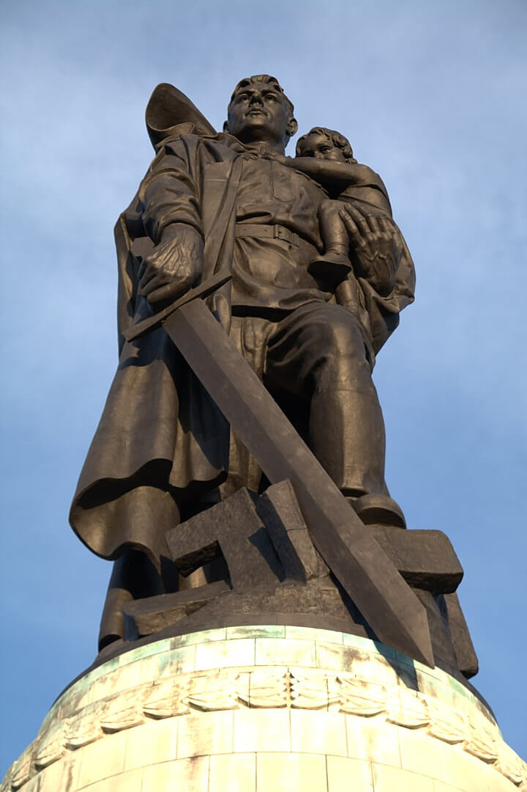

### Japonia

Japończycy skapitulowali w Rangunie (największe miasto Birmy).

Ta kronika nie obejmuje kapitulacji Japonii 2 września 1945, ale warto zauważyć, że warunki kapitulacji postawione Japończykom nie były tak bezwzględne. Na ile było to możliwe, przynajmniej w sferze symbolicznej, zostały zachowane pewne elementy systemu cesarskiego. Natomiast niemiecka Rzesza stała się normalną, współczesną demokracją, z systemu kajzerowskiego i hitlerowskiego nie pozostawiono nic.

3 maja 1946 Międzynarodowy Trybunał Wojskowy dla Dalekiego Wschodu rozpoczął pracę w Tokio. Dokładnie rok później, 3 maja 1947, w Japonii weszła w życie napisana przez prawników generała Douglasa George'a MacArthura nowa konstytucja (tzw. pokojowa). Od 1948 Japończycy świętują Dzień Konstytucji.

<SeeAlso txt="Wojna na Pacyfiku 1945" url="/festung-breslau/article/pacyfik-1945" />

### Hamburg

3 maja bez walki skapitulował Hamburg. Zamilkła ostatnia działająca hitlerowska rozgłośnia radiowa (Hamburgsender).

### Leer

- [On the early morning of May 3, 1945, the Germans mounted a strong counter attack of about 100 men on the village of Rorichum near Leer in Germany. This village was held by the “A” and “C” Companies of the Stormont Dundas & Glengarry Highlanders. Private Chesley Roy Mathews section first noticed the advance of the Germans, covered by intense artillery fire, at about 05:00 hours. Thirty Germans, led by an officer, tried to storm the sections position in the first house of the village by charging across a small field. Private Mathews quickly organized his defense and the enemy was halted by Bren gun and small arms fire. They were then compelled to withdraw leaving many dead and wounded on the ground. A few minutes later Private Mathews noticed a German officer leading six or seven Germans up a deep ditch on the section’s left flank. This ditch could not be effectively covered from the section’s position. Private Mathews without hesitation left his covered position and dashed down a hedgerow and across a wide road. He came under heavy fire from his right as he moved, but pressed forward and leaped into the ditch up which the Germans were advancing. He worked up this ditch, still under fire, until he was in a position to engage the Germans with his Sten gun. Then he opened fire at extremely close range, killing the German officer, wounding one other German and driving the remainder back. This vigorous and fearless counter action completely demoralized the Germans, who cowered under his fire for some time and then surrendered in batches. During this short action at the end of the war, nine Germans were killed and many were wounded, twenty prisoners were taken. For his brave action, private Mathews was awarded the Military Medal (MM) on July 10, 1945.](https://www.facebook.com/joelstoppelsbftours/posts/3156359064633372)

### Masakra w Zatoce Lubeckiej

W Zatoce Lubeckiej samoloty RAF zatopiły kilka statków: SS Cap Arcona, Thielbek i SS Deutschland. W dwóch pierwszych byli więźniowie z obozów koncentracyjnych umieszczeni na statkach po Marszach Śmierci, statki te miały zostać zatopione na głębokim morzu, aby ukryć zbrodnię.

SS Cap Arcona był przeznaczony do przewozu 700 ludzi. Ale mimo sprzeciwu kapitana załadowano tam 4,5 tys. więźniów różnych narodowości, gł. z KL Neuengamme. Było tam wielu Polaków, m.in. powstańcy warszawscy i harcerze z Szarych Szeregów z Gdyni. 

2 maja marynarze otrzymali oa aliantów ultimatum: biała flaga lub bombardowanie. Wiedzieli, że jeżeli wywieszą białą flagę, zostaną zaatakowani przez własną marynarkę wojenną. Jeżeli jej nie wywieszą zbombardują ich samoloty alianckie. Alianci nie wiedzieli, kto jest na statkach. Uznali, że są to żołnierze Wehrmachtu usiłujący uciec do Norwegii w celu kontynuowania walki.

3 maja o godz. 1500 3 dywizjony RAF - 9 brytyjskich myśliwców Hawker Typhoon - zaatakowały statki, które nie wywiesiły białych flag. W śródokręcie Arcony uderzyły rakiety, każda miała 60 funtów materiału wybuchowego. Pożar rozprzestrzeniał się błyskawicznie, załoga nie miała czasu na rozwinięcie węży strażackich. Szalupy ratownicze zaczęły płonąć, blacha wyginała się i pękała z hukiem. Podpłynęły kutry rybackie ale zabierano tylko ludzi w niemieckich mundurach, SS strzelało do więźniów usiłujących uciec. Wybuchły resztki paliwa. Statek położył się na bok i osiadł na lewej burcie. Ocaleli rzucili się do wody, byli dziesiątkowani przez ogień z kutrów torpedowych. Część z ocalałych usiłowała dopłynąć do brzegu, ale tam strzelało do nich SS.

Brytyjskie myśliwce zaatakowały również statki Thielbek i Deutschland. Tego dnia na wszystkich statkach więzieniach w Zatoce Lubeckiej zginęło prawie 8 tysięcy osób. Z 4,5 tys. więźniów na Cap Arcona ocalało niecałe 400 osób.

### Berlin

Berlin był zrujnowany przez kilkaset nalotów dokonywanych przez Amerykanów, Brytyjczyków od sierpnia 1940, a intensywnie w ramach operacji "Battle of Berlin" (analogicznie do Bitwy o Anglię) od 1943. Od sierpnia 1941 bombardowali go sowieci z terenów obecnej Estonii, ale potem z powodu utraty terytoriów utracili taką możliwość, powtórnie zaczęli go bombardować dopiero od 28 marca 1945.

<SeeAlso txt="Berlin do 1945" url="/festung-breslau/article/berlin-opis" />

Z powodu chaosu, jakim był koniec wojny, nie da się wiarygodnie oszacować strat żadnej ze stron. Zginęło ponad 20 tysięcy żołnierzy niemieckich. 70 tysięcy żołnierzy dostało się do niewoli. W ogóle podczas operacji berlińskiej do niewoli dostało się prawie pół miliona żołnierzy. Sowieci stracili 100 tysięcy zabitych i ponad 200 tysięcy rannych, przerażająca proporcja zabitych do rannych świadczy o zaciekłości walk. Zwykle jest to 1 do 5.

Zginęło ponad 120 tys. cywilnych mieszkańców Berlina, w kilka dni tyle, co we Wrocławiu przez trzy miesiące. Ponad 20 tysięcy umarło ze stresu na atak serca, ponad 6 tysięcy popełniło samobójstwo, w ogóle samobójstwo stało się nie tylko w Berlinie normalnie dyskutowaną opcją, Partia dystrybuowała cyjanek w nieoficjalny, ale otwarty sposób. Nie trzeba było uzasadniać potrzeby posiadania śmiertelnej trucizny.

Pozbawieni wpływów i kontaktów cywile, najczęściej bez dostępu do broni mieli do dyspozycji arszenik, przedawkowanie środków nasennych, wisielczą pętlę, albo utopienie się w najbliższym zbiorniku wodnym. Nie tylko berlińczycy zabijali się na wszystkie możliwe sposoby. Zabijali się ze strachu przed sowietami, zabijali się też po tym, co im sowieci zrobili.

Berlin został wydany władzy żołnierskiej czerni. Jak już pisałem w tym czasie z niewiele ponad dwóch i pół miliona ludności cywilnej w Berlinie, było dwa miliony kobiet. Gwałty za linią frontu są codziennością każdej wojny, dramatem pomijanym w opisie wydarzeń wojennych, nieobecnym w filmach i podręcznikach historii. Gunter Grass zapytany, dlaczego opisuje okrucieństwa jakich dopuszczała się Armia Czerwona w zdobytym Gdańsku odparł: "*bo miały miejsce*".

### Gwałty

Kobiety wiedziały, co je czeka. Ukrywały się, brudziły twarz, maskowały urodę. Relacje są bardzo do siebie podobne. Oddziały frontowe zachowywały się wobec ludności cywilnej bez zarzutu. Czasem dochodziło do rabunków, brutalnych przeszukań i sytuacja była niebezpieczna, jeśli znaleźli broń lub porzucone mundury. Ale była to strefa wojny.

Najgorsze przychodziło, kiedy linia frontu posuwała się o kolejne kilometry, a za nią nadchodziła druga linia. Żołnierze nierzadko pozbawieni dowództwa, niejednolicie umundurowani i uzbrojeni, z nie wiadomo jakich jednostek, dziesiątki tysięcy sałdatów, nad którymi nie mogła zapanować żandarmeria, szli masą i zaprowadzali swój porządek. Nocą nikt ich nie kontrolował. Najczęściej pijani, szukali zegarków, kosztowności i kobiet. Niewiele można było przed nimi ukryć.

W Treptower Park w czwartą rocznicę zakończenia wojny odsłonięto Pomnik Żołnierzy Radzieckich. Dwunastometrowy monument przedstawia żołnierza Armii Czerwonej trzymającego dziewczynkę i depczącego swastykę. Nazywany bywa Pomnikiem Nieznanego Gwałciciela. Jak oceniają historycy, zwycięzcy żołnierze Stalina zgwałcili około 2 milionów kobiet w całych Niemczech, z tego ponad sto tysięcy w samym Berlinie. Niektóre kobiety gwałcone były kilkadziesiąt razy. Około ćwierć miliona kobiet zmarło w wyniku obrażeń, z tego w samym Berlinie 10 tysięcy.

Żołnierze Armii Czerwonej mieli na to przyzwolenie ze strony swoich władz. Skarżącemu się na okrucieństwa w Jugosławii Miłowanowi Dzilasowi, który był wówczas szefem misji wojskowej w Moskwie, Stalin odrzekł:
>czy nie rozumiecie tego, że żołnierz, który przeszedł tysiące kilometrów przez krew i ogień, chce się trochę zabawić z kobietami i pobaraszkować z nimi?

Wyjątkowo brutalnie były traktowane kobiety w mundurach, praktycznie nie miały szans dostać się do niewoli. Na Niemcy spadł ogień okrucieństwa i zemsta za wszystko to, czego dokonał Wehrmacht w licznych rozpętanych przez Hitlera wojnach, wszystko to, czego dokonał żołnierz niemiecki, szczególnie na froncie wschodnim, a o czym nie chcieli wiedzieć dobrzy Niemcy znoszący cierpliwie ciężar wojny. Teraz tylko cierpliwość im pozostała, bo na to, co ich spotkało, nie mogli się nikomu skarżyć. Zbrodniarze w mundurach Armii Czerwonej byli anonimowi i nieuchwytni.

<BoxImageWrapper>

Statua Żołnierza Wyzwoliciela odsłonięta 8 maja 1946, dłuta Jakowa Biełopolskiego. Treptower Park, Berlin. 
By [Sly07192909](https://commons.wikimedia.org/w/index.php?title=User:Sly07192909&amp;action=edit&amp;redlink=1) - Praca własna, [CC BY-SA 3.0](https://creativecommons.org/licenses/by-sa/3.0), [Link](https://commons.wikimedia.org/w/index.php?curid=20630560)
</BoxImageWrapper>

### Propaganda

Częściowo za okrucieństwa odpowiedzialna była propaganda, której zadaniem było zmotywowanie żołnierza do walki - znaczący udział miał tu Ilia Erenburg, którego wściekłe filipiki prasa publikowała na pierwszych stronach - charakterystyczny jest przykład z krytycznego momentu wojny, z lipca 1942:
>Nie liczcie dni, nie liczcie kilometrów. Liczcie tylko Niemców, których zabiliście. Zabij Niemca - to twojej matki modlitwa. Zabij Niemca - to wezwanie rosyjskiej ziemi. Nie wahaj się. Nie poddawaj. Zabij.

Już w kwietniu 1945 Erenburg popadł w niełaskę i zaczęto publikować artykuły, przekonujące, że to nie Niemcy są wrogiem a hitleryzm.

### Gieorgij Żukow

Głównodowodzący 1 Frontu Białoruskiego, zdobywca Berlina wybrał się dzisiaj na inspekcję zrujnowanego wojną miasta: Reichstag, Brama Brandenburska, Nowa Kancelaria Rzeszy, Kolumna Zwycięstwa, nierozpoznany przeze mnie kościół, również nierozpoznany pomnik konny oraz na końcu Wyspa Muzealna.

Pojawia się tam interesujący wątek dublera Hitlera. Najpewniej pomyłka, z tego co wiem, Hitler nie miał dublerów.

- CHRONOS-MEDIA History ["Sensationelle Filmaufnahmen von Berlin nach der Kapitulation (3. Mai 1945)" [YT 5:26]](https://www.youtube.com/watch?v=zmVJTWMIlQg)

### 12 Armia

12 Armia Wencka nawiązała kontakt z amerykańską 9 Armią, która z rozkazu Eisenhowera pozostała na Łabie. Generał von Edelsheim przepłynął Łabę schwimmwagenem, by wynegocjować kapitulację. Rozmowy i decyzja jutro w ratuszu w Stendal (Saksonia-Anhalt).

### 1 Dywizja Pancerna (PSZ)

Polska 1 Dywizja Pancerna pod dowództwem generała Stanisława Maczka opanowała rejon Westerstede.

### Obersalzberg

- [On May 3, 1945, Colonel Robert Sink was ordered to prepare the 506th Parachute Infantry Regiment of the 101st Airborne Division to leave for Berchtesgarden at 9:30 am the next day. Situated in the mountains above Berchtesgaden was Obersalzberg, a mountainside retreat where Adolf Hitler and top-level henchmen such as Martin Bormann, Albert Speer, and Herman Goering had homes. Rising roughly 3,000 feet above Hitler's Berghof home was the Eagle's Nest. On May 4, the 101st Airborne Division took off in convoy on the highway between Munich and Salzburg, with the 2nd Battalion leading the way. On May 5, the battalion, with the Easy Company in the lead, arrived in Berchtesgaden a day after 7th IR (3rd ID) who captured the town and hours after French 2nd Armoured Division had arrived. Even though the buildings in the area were largely destroyed, the men discovered well stocked pantries, still intact, that contained enormous amounts of liquor, wines, cheese, and canned foods.](https://www.facebook.com/joelstoppelsbftours/posts/3157004924568786)

### 1 Armia WP

1 Armia WP, która miała o wiele więcej szczęścia co do dowódców niż nieszczęsna 2 Armia, po zawieszeniu polskich flag w Berlinie wczoraj dotarła do Łaby w rejonie Spandau.

### Michał Żymierski

Michał "Rola" Żymierski podczas Wielkiej Wojny żołnierz Legionów, generał Wojska Polskiego II RP, w czasie przewrotu majowego stanął po stronie rządowej, rok później w 1927 skazany za ustawianie przetargów i zdegradowany. Od 1932 agent sowiecki, od 21 lipca 1944 Naczelny Dowódca Wojska Polskiego - 3 maja 1945 został mianowany na marszałka.

W latach 1945-49 minister obrony narodowej. W opinii podwładnych sprzeciwiał się sowietyzacji wojska polskiego i polityczne wyroki śmierci zamieniał na kary więzienia.

Pełnił potem wiele oficjalnych funkcji we władzach PRL, ale najdłużej, bo od 1973 aż do śmierci w 1989 był Honorowym Prezesem Zarządu Głównego Związku Bojowników o Wolność i Demokrację.

Stopień marszałka w Polsce otrzymało zaledwie sześciu ludzi. Pierwszym był oczywiście Józef Piłsudski (19 marca 1920), potem ten stopień otrzymał wielki przyjaciel i stronnik Polski również Marszałek Francji - Ferdinand Foch. Już po śmierci Piłsudskiego trzecim polskim marszałkiem został w 1936 Wódz Naczelny Edward Śmigły-Rydz. Wzbudziło to wiele kontrowersji. Wobec późniejszego haniebnego zachowania się w 1939 można powiedzieć, że z cała pewnością była to pomyłka.

Trzy kolejne nominacje są już z innego rozdania: 3 maja 1945 Michał "Rola" Żymierski, w 1949 Konstanty Rokossowski, który również był marszałkiem CCCP. I na końcu w 1963 Marian Spychalski.

### 2 Armia WP

2 Armia LWP, która w zupełnie niepotrzebnej bitwie pod Budziszynem straciła 1/5 do 1/3 ludzi (trudno o rzetelne statystyki, w tak zapomnianej przez późniejszą historię bitwie) i połowę sprzętu, została skierowana do udziału w następnej operacji - praskiej.

### Rada Jedności Narodowej

Powstała 9 stycznia 1945 w wyniku porozumienia niekomunistycznych sił politycznych podziemia. Miała pełnić funkcję tymczasowego parlamentu państwa podziemnego.

3 maja 1945 powołano nową Komisję Główną RJN. W jej skład weszli: Stanisław Wójcik (SL), Jan Matłachowski (SN), Zygmunt Zaremba (PPS), Józef Kwasiborski (SP) i Stanisław Wójcik (SL). Ten ostatni opuścił RJN 7 maja 1945.

Wobec przebiegu wydarzeń w Polsce i marginalizacji rządu na emigracji dalsze istnienie RJN nie miało sensu. Ostatnie posiedzenie odbyło się 1 lipca 1945.

### Wrocław

W tym miejscu jest pora by rozważyć przyczyny, dla których wciąż nie poddał się Wrocław. Od dawna 9ściśle rzecz biorąc od zakończenia operacji opolskiej) nie mogło być żadnych nadziei na odsiecz Schörnera i wyrwanie się z oblężenia. To wiemy dziś, ale zamknięci w twierdzy ludzie z powodów psychologicznych żyli tą nadzieją aż do końca kwietnia, wielu już słyszało chrzęst gąsienic. Krążyły niesamowite plotki. Równie absurdalne było przypuszczenie, że stawiając opór, można sobie wywalczyć lepsze warunki pokoju, lepsze traktowanie w sowieckiej niewoli. Sowiecka 6 Armia nie miała, żadnych powodów ani kompetencji, aby dawać takie gwarancje, a jeszcze mniejsze chęci czy możliwości, by ich dotrzymać. Decydująca o wszystkim elita oficerów nie mogła sobie wywalczyć honorowego traktowania, dopóki walczyli, byli śmiertelnym wrogiem, po poddaniu się byli tylko jeńcami. Pomiędzy jednym a drugim nie było żadnego pola manewru.

Do pewnego momentu mógł ich odstraszać przykład komendanta twierdzy Królewiec, który za kapitulację został skazany na śmierć, on sam był co prawda poza zasięgiem hitlerowskiego wymiaru sprawiedliwości, ale jego rodzina, która została aresztowana, już nie. To był odstraszający przykład. Po śmierci Hitlera przestało to być argumentem, bo zapanował zbyt wielki chaos.

Nad przyczynami dalszego oporu zastanawia się Ernst Horning:
>Z jakiego powodu militarne dowództwo Wrocławia nie chce po prostu dostosować swoich decyzji do zaistniałej sytuacji? Jest tylko jedno wyjaśnienie tej wrogiej już wręcz wobec narodu postawy: przymus i ucieczka! We Wrocławiu podobnie jak i wszędzie indziej wielu ważnych funkcjonariuszy partyjnych było włączonych do dowództwa wojskowego. Oni właśnie mieli interes w tym, aby wojna trwała jak najdłużej, ponieważ bali się odpowiedzialności przed narodem. Ta właśnie klika podtrzymuje aparat terroru i nie pozwala dojść do głosu rozsądkowi i sumieniu. Z tego powodu rozpowszechniano wiadomość, że komendant Twierdzy Królewiec, Lasch, został skazany na szubienicę za zbyt wczesne poddanie twierdzy. wyrok ten co prawda nie dosięgnie go osobiście, ale za to miał odgrywać rolę bata na jemu podobnych i działać odstraszająco. Nasza "Festungzeitung" (wcześniej "Schlesische Zeitung") zawsze dokładnie drukowała propagandę Goebbelsa, również informacje o wymierzonych karach, rozstrzelaniach osób wojskowych i cywilnych, aby zdusić w zarodku jakikolwiek odruch politycznego sprzeciwu. Na specjalny rozkaz Hitlera każda próba nakłonienia przez ludność cywilną komendanta twierdzy do poddania się podlegała karze. Stąd też tragedia tej twierdzy musiała trwać dalej.

Informacje o wyrokach śmierci, wydanych i wykonanych przestano zamieszczać w prasie już w drugiej połowie marca, okazało się, że nie pełnią funkcji odstraszającej, a ich ilość jest sprzeczna z linią propagandy, która zachwalała bohaterstwo i jedność wrocławian w godzinie próby. Co nie znaczy, że przestano zabijać ludzi z byle powodu, typowy jest opisywany przez nas przypadek rozstrzelania odznaczonego Żelaznym Krzyżem żołnierza, który zabrał sobie materac z domu przeznaczonego do wyburzenia. Główną siedzibą gestapo było więzienie na Kleczkowskiej i egzekucje wykonywano tam do ostatnich dni. Są informacje, że zabito przywódczynie protestów jakie miały miejsce pod koniec kwietnia, aczkolwiek na tym etapie wojny zamieszanie było tak wielkie, że niewiele wiadomo na pewno.

Wydaje się, że wyjaśnienie dalszego trwania w oporze nawet w pierwszych dniach maja jest proste. Wojnę prowadziło mocno zideologizowane, podporządkowane Partii wojsko. Wrocław miał straszliwego pecha, dostając z Berlina Gauleitera Hankego. Traktował on swoje zadanie w stolicy Dolnego Śląska jak zesłanie na prowincję i robił wszystko, żeby zasłużyć sobie na powrót na berlińskie salony. To, że Hitler już nie żył, że Berlin był zniszczony i poddał się, nie miało znaczenia. Fanatyzm nie rozlicza się z faktami. Dowódcą wojskowym był komendant Hermann Niehoff, do końca posłuszny swojemu przełożonemu, którym był - i to kolejne nieszczęście Wrocławia - feldmarszałek Ferdinand Schörner, znany tak samo z bezwzględności wobec swoich żołnierzy, jak i bezgranicznego posłuszeństwa wobec Partii. W Berlinie miał opinię narodowo-socjalistycznego oficera i to do tego stopnia, że w testamencie Hitlera został wyznaczony głównodowodzącym sił lądowych. Oficjalnie pełnił tę funkcję do 7 maja, chociaż siły lądowe nie tylko nie stanowiły wówczas jednolitej formacji, ale nawet nie miały już własnego sztabu. Jedyną jednostką, jaką realnie dowodził była topniejąca z każdym dniem Grupa Armii Środek.

Te ostatnie dni we Wrocławia były więc serią surrealistycznych awansów godnych dramatu Witkacego.

Generał Greims dowódca 6 Luftflotte odpowiedzialnej za zaopatrzenie twierdzy Wrocław został awansowany na feldmarszałka i został dowódcą Luftwaffe po tym, jak Göring zdradził, a Luftwaffe już nie istniało.

Generał Schörner został awansowany na feldmarszałka i został dowódcą sił lądowych, które już nie miały sztabu i z którymi już nie miał żadnej łączności.

Gauleiter Karl Hanke przywódca partyjny Wrocławia dostał najwyższe odznaczenie partyjnopaństwowe, a po zdradzie Himmlera został awansowany na dowódcę SS i Policji, kiedy policja już nie istniała, a SS składała się z pojedynczych oddziałów nieposiadających żadnej łączności.

Dalsze trwanie twierdzy wynikało z - paradoksalnie - dobrej sytuacji na froncie. Na północy poza sporadycznymi przypadkami przenikania patroli nie było żadnych walk. Sytuacja na południu została opanowana, sowieci utknęli w gruzach, dwie-trzy ulice od nasypu kolejowego i już od miesiąca nie zaszły tam żadne zmiany. Najpoważniejsza sytuacja była na zachodzie, od początku kwietnia 6 Armia wdarła się głęboko i przekroczyła linię nasypu kolejowego. Ale była już tak wycieńczona walką, że po odebraniu zasobów potrzebnych do operacji berlińskiej przestała skutecznie atakować.

Dochodzi do tego czynnik ludzki, żołnierze nie widzieli już żadnego sensu w walce, nie ma żadnego wojskowego, ani politycznego znaczenia. Wrocław od początku był pobocznym i drugorzędnym celem na drodze do Berlina i takim pozostał. Teraz kiedy Berlin padł, wzięcie Wrocławia było kwestią czasu. Oczywiste było, że zwolnione po zdobyciu Berlina zasoby wojny powrócą do Wrocławia i jeżeli miasto samo się nie podda, zostanie zniszczone samym tylko ogniem artylerii i lotnictwa. Upadek Berlina budził we Wrocławiu obawy przed kolejną ofensywą.

### Wolne Niemcy

Dziś we Wrocławiu pojawił się zwiastun nowego, komunistycznego porządku - oddział niemieckich żołnierzy-antyfaszystów. Jego dowódcą był Horst Viedt, oficer Wehrmachtu oburzony niemieckimi zbrodniami wojennymi na froncie wschodnim, kiedy otrzymał rozkaz pacyfikacji wsi, jeszcze w 1941 zbiegł na stronę nieprzyjaciela. Tam przeszedł kurs marksizmu-leninizmu i związał się z komitetem Wolne Niemcy. Na początku 1945 stanął na czele oddziału dywersyjnego, składającego się z trzech plutonów. Przechodzili szkolenie w Rudniku nad Sanem, w połowie kwietnia zostali przerzuceni do Krakowa i teraz do Wrocławia.

Sowieci spośród wziętych do niewoli żołnierzy niemieckich sformowali trzon zależnych od nich władz przyszłego państwa niemieckiego - Narodowy Komitet Wolne Niemcy (Nationalkomitee Freies Deutschland; NKFD), nazywany czasem skrótowo Wolne Niemcy. Jego zbrojną formacją był Związek Oficerów Niemieckich. Wolne Niemcy tworzyło około pół setki byłych żołnierzy Wehrmachtu przekonanych o nieuchronnej klęsce nazistowskich Niemiec. Część z nich była komunistami. Ta powstała w lipcu 1943 organizacja przypominała istniejący od marca tego samego roku Związek Patriotów Polskich (ZPP), notabene ich pismo nazywało się "Wolna Polska", od maja 1943 trwało formowanie 1 Dywizji w Sielcach nad Oką.

W ten sposób Stalin tworzył przyszłość obu zależnych od siebie państw: PRL i DDR. Współpraca niemiecko-sowiecka nie była wcale rzeczą nową, jej podstawy tworzył Traktat w Rapallo z 1922, pierwszy traktat międzynarodowy, jakie zawarło wówczas w ogóle nieuznawane państwo sowieckie. W latach 30. XX wieku w najlepsze rozwijała się niemiecko-sowiecka współpraca wojskowa, to na rozległych rosyjskich poligonach ćwiczyli manewry żołnierze niemieckich wojsk pancernych i lotnictwa wojskowego których oficjalnie nie było. Funkcjonował również poligon chemiczny. Przejęcie władzy przez hitlerowców na kilka lat ochłodziło relacje niemiecko-sowieckie. W przededniu wojny nastąpił nagły zwrot akcji i 23 sierpnia 1939 podpisano w Moskwie pakt Ribbentrop-Mołotow. Wkrótce potem 17 września 1939 sowieci dotrzymali warunków paktu, ostatecznie łamiąc opór polski. I aż do 22 czerwca 1941 przyjaźń niemiecko-sowiecka kwitła w wymiarze politycznym, gospodarczym i wojskowym. Dwa lata później już po przesileniu pod Stalingradem organizacja złożona z jeńców wojennych wykuwała nową sojuszniczą przyszłość.

Stosowane często określenie "antyfaszyści" - stosowane głównie przez lewicę do określenia prawicowych dyktatur. Faszyzm był ustrojem politycznym Narodowej Partii Faszystowskiej (Partito Nazionale Fascista, PNF) Benito Mussoliniego. Hitlerowcy nigdy wobec siebie nie używali tego słowa. Na dobrą sprawę nie używali nawet skrótowca: naziści, zawsze mówili narodowy socjalizm, czasem Ruch (niem. Bewegung). Bardzo trudno wybrać wspólne elementy faszyzmu i nazizmu, które jednocześnie w jakimś stopniu nie pasowałyby do sowieckiego komunizmu. Obecnie każdy prawicowy autorytaryzm jest określany tym mianem.

- George Orwell ["What is Fascism?"](https://www.orwell.ru/library/articles/As_I_Please/english/efasc).
- Rafał Kuzak ["Określenie "naziści" w języku polskim. Historyczny termin czy sztuczna nowomowa i przejaw poprawności politycznej?"](https://wielkahistoria.pl/okreslenie-nazisci-w-jezyku-polskim-historyczny-termin-czy-sztuczna-nowomowa-i-przejaw-poprawnosci-politycznej/)

O Seydlitz-Truppen juz pisałem, warto też obejrzeć film Irytującego Historyka ["Niemieccy kolaboranci z frontu wschodniego: BDO, NKFD i Antifa" [YT 25:31]](https://www.youtube.com/watch?v=4o3o0mQmrpc)

### Odnośniki

- Tagesspiegel [Die Schlacht um Berlin: Wettlauf zum Reichstag – die letzten Tage des Zweiten Weltkriegs](https://www.tagesspiegel.de/berlin/die-schlacht-um-berlin-wettlauf-zum-reichstag-die-letzten-tage-des-zweiten-weltkriegs/25770846.html)
- [War Stories with Mark Felton "The Great Rabbit Hunt: Soviet POW Breakout Mauthausen 1945 (Episode 1)" [YT 15:46]](https://www.youtube.com/watch?v=NsbO7xWvFB4) | [War Stories with Mark Felton "The Great Rabbit Hunt: Soviet POW Breakout Mauthausen 1945 (Episode 2)" [YT 12:02]](https://www.youtube.com/watch?v=j2OOvabmJ_8)
