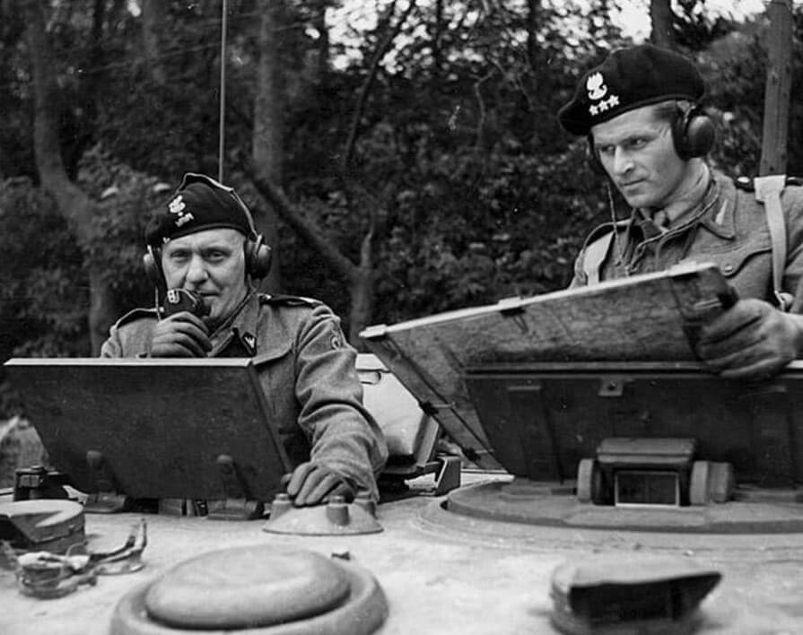

### USA

5 maja 1945 nastąpił jedyny śmiertelny wybuch bomby balonowej fu-go. Żeby dosięgnąć Amerykę, wymyślono bomby niesione na balonach, które opadając losowo, mogły narobić jakieś zniszczenia. Myślano też o wysyłaniu okrętów podwodnych - w tym celu skonstruowano tzw. podwodne lotniskowce, czyli ogromne okręty podwodne z hangarami wodnosamolotów na pokładzie. Było to jednak bardzo skomplikowane i wodnosamoloty nie miały wielkiego udźwigu.

Okazało się jednak, że na wysokości ok. 10 km istnieją prądy powietrzne (polarny prąd strumieniowy) pozwalające przerzucić balony tak daleko na wschód z Japonii. Od listopada 1944 do kwietnia 1945 wysłano prawie 10 tys. tych bomb.

Dziś w Oregonie na taką bombę leżącą od kilku dni na ziemi natknęli się uczestnicy sobotniego pikniku. W eksplozji zginęła ciężarna żona pastora i pięcioro dzieci ze szkółki niedzielnej.

Były to jedyne ofiary śmiertelne działań wojennych na terenie USA.

### Uniwersytet Kiusiu, Fukuoka

Niezależnie od tego, jak bardzo powszechnie stosowane podczas WWII bombardowania dywanowe koncentrowały się na celach wojskowych bądź strategicznych. Przy prędkości, jaką osiągały bombowce i pułapie minimalizującym skuteczność artylerii plot, zrzucały bomby kilka km od celu. Stosowano wyrafinowane i skomplikowane celowniki, metody nalotu, zrzucano wskaźniki celu, namierzanie radiolatarniami, radarowe, ale wszystkie te metody doprowadziły do tego, że tylko 8% bomb lądowało w strefie celu.

Oznacza to, że nawet jeśli celem nie były cywilne dzielnice mieszkaniowe to i tak większość bomb lądowała na cywilach. A często same miasta jako takie (Berlin, Hamburg, Drezno, Tokio) były celem bombardowania. Bezpośrednim skutkiem tego był przerażający los lotników, których samoloty zostały strącone nad terytorium nieprzyjaciela, w Japonii datujący się już od pierwszego bombardowania Tokio - rajd Dolittle'a w 1942. Często byli linczowani przez cywilów jeszcze zanim zostali aresztowani przez władze. Również po aresztowaniu zdarzały się tortury i egzekucje. W Niemczech i Japonii rutynowo stosowano wyrok śmierci za akt terroryzmu.

Ale w Japonii do okrucieństwa i zemsty dodano niezrównany sadyzm. Znany jest przypadek wystawienia nagich lotników w klatce Zoo na pośmiewisko publiczności. Tortury były bardziej powszechne niż w Niemczech.

Wszystko jednak co spotkało lotników w Niemczech czy Japonii blednie w porównaniu z losem załogi B-29 szóstej eskadry 29th Bomb Group z bazy na Guam, która 5 maja 1945 bombardowała lotnisko na wyspie Kiusiu. Ich samolot został staranowany. Trzech lotników zginęło przy lądowaniu. Po wzięciu do niewoli kapitana zabrano do Tokio celem przesłuchania, a pozostałych ośmiu członków załogi umieszczono w szpitalu uniwersyteckim w Fukuoce. Wydawałoby się, że mają szczęście.

Okazało się jednak, że nie umieszczono ich w szpitalu dla ich dobra. Byli materiałem eksperymentalnym w rękach sadystów. Krew zastępowano im soloną wodą, przeprowadzano na nich wiwisekcję bez znieczulenia, usuwano płuca, kawałki mózgu, wątrobę. Żaden z tych "eksperymentów" nie miał żadnego znaczenia naukowego. Wątrobę podobno zjedzono, ale potem wycofano ten zarzut z materiałów procesowych z braku dowodów. Pozostałości po lotnikach umieszczono w formaldehydzie, miały służyć studentom.

Nie byli jedynymi lotnikami trzymanymi tam w niewoli. 15 sierpnia, kiedy Japonia ogłosiła zawieszenie broni, 12 żołnierzy wywieziono na miejsce egzekucji i ścięto im głowy. Potem władzom okupacyjnym mówiono, że zostali wywiezieni do Hiroszimy i tam zginęli.

Sprawa jednak się wydała i w 1948 doszło do procesu 30 lekarzy i przedstawicieli władz wojskowych. 23 z nich uznano za winnych stawianych im zarzutów, pięciu dostało karę śmierci, czterech dożywocie. Ostatecznie do egzekucji skazańców nie doszło, bo Japonia była ważnym sojusznikiem w Zimnej Wojnie i sprawa została bardzo skutecznie zamieciona pod dywan. W 1958 na polecenie Trumana wypuszczono wszystkich zbrodniarzy wojennych na wolność. Winy zostały darowane.

- War Stories with Mark Felton ["Shot Down Over Japan - The Kyushu University Atrocity (Ep. 3)" [YT 9:35]](https://www.youtube.com/watch?v=gsUYzUjv3OQ)
- ["Japan revisits its darkest moments where American POWs became human experiments"](https://www.theguardian.com/world/2015/aug/13/japan-revisits-its-darkest-moments-where-american-pows-became-human-experiments)

### Muhammad Amin al-Husajni

Weteran Wielkiej Wojny, zagorzały nacjonalista arabski i antysemita. Od 1922 Wielki Mufti Jerozolimy. W 1931 został wybrany na prezydenta Światowego Kongresu Islamskiego. Po dojściu do władzy Hitlera Arabowie zawarli tajny sojusz z hitlerowcami.

Był przywódcą i organizatorem powstania arabskiego (antybrytyjskiego i antyżydowskiego), które wybuchło w 1936. W latach 1940-41 organizował prohitlerowski zamach stanu w Iraku. Ścigany przez Brytyjczyków znalazł schronienie w faszystowskiej Italii. 27 października 1941 spotkał się z Mussolinim. 8 listopada 1941 przyjechał do Berlina i rozpoczęły się rozmowy z hitlerowcami. 20 listopada spotkał się z Ribbentropem, a 28 listopada 1941 z Hitlerem, który zapewnił go, że choć hitlerowskie Niemcy nie ogłoszą deklaracji poparcia dla organizacji arabskich, to będą zmierzać do "rozwiązania kwestii żydowskiej", najpierw w Europie, potem w Azji Mniejszej:
>as deutsche Ziel Würde lediglich dann die Vernichtung des im Arabischen Raum der unter der Protektion britischen Macht lebenden Judentums sein.

Później Wielki Mufti kilkukrotnie blokował lub usiłował zablokować ewakuacje dzieci żydowskich zagrożonych Holokaustem.

Po ewentualnym przełamaniu frontu pod El-Alamein i zniszczeniu sił brytyjskich w Egipcie planowano powołanie Einsatzkommando Ägypten, którego celem była likwidacja miejscowej społeczności żydowskiej.

Wielki Mufti Jerozolimy był zaangażowany w mobilizację społeczności muzułmańskiej po stronie hitlerowskiej i formowanie muzułmańskich jednostek SS:

- 13. Waffen-Gebirgs-Division der SS "Handschar" (kroatische Nr. 1)
- 23. Waffen-Gebirgs-Division der SS "Kama" (kroatische Nr. 2)

1 marca 1945 w Radio Berlin powiedział:
>Arabowie, powstańcie jak jeden mąż i walczcie o swoje prawa. Zabijajcie Żydów, gdziekolwiek ich znajdziecie. To podoba się Bogu, historii i religii. To ocali wasz honor. Allah jest z wami.

Kiedy wojna się kończyła, uciekł do bezpiecznej Szwajcarii, ale został stamtąd wydalony.

5 maja 1945 został aresztowany przez francuskie wojska okupacyjne w Konstancji (Badenia-Wirtembergia). W tym czasie był poszukiwany przez władze brytyjskie i jugosłowiańskie jako zbrodniarz wojenny. Być może schwytanie przez Francuzów uratowało mu życie.

19 maja został przewieziony do Paryża, gdzie w areszcie domowym zapewniono mu luksusowe warunki: samochód z szoferem, sekretarze. Był potrzebny Francji do powojennego ułożenia stosunków ze społecznościami islamskimi północnej Afryki i Azji Mniejszej. W rejonie Paryża przebywał przez ponad rok i nikt nie mówił o ukaraniu go.

Po wojnie o ekstradycję al-Husajniego starali się Brytyjczycy, Jugosłowianie i Żydzi. Żeby zapewnić mu bezpieczeństwo, Francja w maju 1947 wysłała go do Egiptu. W 1948 był zaangażowany w tworzenie szerokiego politycznego ruchu arabskiego mającego na celu zniszczenie Izraela. Klan Husajni tworzył rząd Palestyny w Strefie Gazy, opozycyjny wobec federacji tworzonej przez Transjordanię.

Apogeum i jednocześnie końcem jego kariery politycznej było powołanie Palestyńskiej Rady Narodowej 30 września 1948 w Gazie. Król Transjordanii Abd Allah I uznał to za wejście w jego kompetencje i Legion Arabski 3 października 1948 rozbroił oddziały wierne Husajniemu. Husajni zorganizował zamach na króla. Członek klanu Husajni zastrzelił go podczas piątkowych modłów w meczecie Al-Aksa w Jerozolimie. W rezultacie jego następcy (syn a potem wnuk) doprowadzili do marginalizacji Husajniego. Resztę życia spędził w Bejrucie, gdzie zmarł w 1974. Jego siostrzeńcem był Jasir Arafat.

- [Al-Hadżdż Muhammad Amin al-Husajni](https://pl.wikipedia.org/wiki/Al-Had%C5%BCd%C5%BC_Muhammad_Amin_al-Husajni)

### Herbert Giesecke

Był to jeden z tych lotników, którzy sami wybrali kraj, w którym się poddają. I był to dość ryzykowny wybór. Oberfeldwebel (starszy sierżant) Giesecke zdecydował się uciec z Grove w środkowej Danii do... Irlandii. Oczywiste ryzyko polegało na tym, że musiał przelecieć nad Anglią. Do tego dysponował ciężkim dwusilnikowym Ju 88. Był to samolot uniwersalny, najbardziej znany jest jako bombowiec. Samolot Giesecke był nocnym myśliwcem. Jego maksymalna prędkość to zaledwie 470 km/h. Do Irlandii mieli tysiąc kilometrów.

O godz. 0515 wystartował z Danii. Była to dokładnie godzina wschodu Słońca. Anglię przeciął na linii Middlesbrough - Liverpool. Dowództwo obrony plot otrzymało wiele meldunków o wrogim bombowcu nad brytyjską ziemią, ale Giesecke leciał bardzo nisko, jego samolotu nie wykryły ani radary, ani myśliwce. Bez przeszkód wylądował na lotnisku Gormanston Camp i poddał się do niewoli wraz z załogą.

Zgodnie z oczekiwaniami zostali potraktowani dobrze. Internowano ich do czasu kapitulacji, a potem uwolniono. Gieseke udał się do RPA, gdzie mieszkała jego żona i tam spędził resztę życia.

Irlandczycy zgłosili niemiecki samolot Brytyjczykom. Po Ju 88 przyleciał pilot oblatywacz kapitan Eric "Winkle" Brown. Zabrał go do Anglii, gdzie był intensywnie testowany do 1947.

- Mark Felton Productions ["German Night Fighter Defection - Junkers 88, Ireland 1945" [YT 8:32]](https://www.youtube.com/watch?v=5uqN8zIOMpY)

### 1 Dywizja Pancerna

1 Dywizja Pancerna gen. Stanisława Maczka opanowała rejon Westerstede. Od 1 maja 10 Brygada Kawalerii Pancernej i 3 Brygada Strzelców działały wspólnie. 4 maja czołowe oddziały dywizji dotarły do fortów twierdzy Wilhelmshaven.

Atak przerwano o godz. 0800 5 maja, ponieważ na odcinku brytyjsko-kanadyjskiej 21 Grupy Armii wojska niemieckie skapitulowały. Dywizja straciła ponad 500 zabitych. W porcie Wilhelmshaven zakończyła szlak bojowy.

W porcie poddało się dowództwo: twierdzy, 10 DP, bazy Kriegsmarine, wiele okrętów w tym krążownik Köln i 10 U-Bootów.

6 maja dywizja zajęła teren, wieszając nad miastem i portem polskie flagi.

### Haren - Maczków

Już wkrótce w tym rejonie na zachód od Bremy powstanie istniejąca do września 1947 nieformalna polska (w ramach brytyjskiej) strefa okupacyjna w Niemczech, 6,5 tys km2 (1/3 województwa dolnośląskiego) w Emsland: powiaty Aschendorf, Meppen, Lingen i hrabstwa Bentheim, Bensbrück i Cloppenburg.

Stolicą tej tzw. Republiki Maczkowskiej stało się miasto Haren wysiedlone 19 maja 1945, przemianowane najpierw na Lwów potem na Maczków.

Na tym obszarze przebywało 40 tys. dipisów (ang. displaced person), wymagających repatriacji. Republika była małym państwem polskim z własnymi szkołami, gospodarką i życiem kulturalnym.

- [Maczków. Polska enklawa w północnych Niemczech](https://www.porta-polonica.de/pl/atlas-miejsc-pamięci/maczkow-polska-enklawa-w-polnocnych-niemczech)
- Kurier Historyczny ["Polska strefa okupacyjna w Niemczech" [YT 7:15]](https://www.youtube.com/watch?v=DE7G3s7Le0U)

*Generał Maczek 
By unknown-anonymous - [Centralne Archiwum Wojskowe](https://pl.wikipedia.org/wiki/Centralne_Archiwum_Wojskowe), Domena publiczna, [Link](https://commons.wikimedia.org/w/index.php?curid=61556673)*

### 12 Armia

Trwała pospieszna ewakuacja przez główne przeprawy, które od tego dnia znalazły się pod ogniem sowieckiej artylerii

- most kolejowy między Stendal a Schönhausen
- most drogowy pod Tangermünde
- prom w Ferchland

Po przeprawieniu rannych saperzy otrzymali rozkaz, by wszelkimi sposobami pomóc przedostać się na drugą stronę cywilom. Były miejsca, gdzie Amerykanie przymykali na to oko, ale w innych ich zawracano.

Waffen SS zgromadziło się w Redekin i ruszyło do Fischbeck, gdzie budowano prowizoryczny most o szerokości 2 m. Ukończono go dopiero 6 maja. Do tego czasu zgromadziła się tam masa pojazdów wojskowych i pozostałej broni ciężkiej. 

Tymczasem sowiecka artyleria, strzelając na oślep, zaczęła uderzać w zachodni brzeg Łaby, co zmusiło Amerykanów do wycofania posterunków po swojej stronie. Jakakolwiek istniejąca dotąd kontrola nad tym, kto ucieka przez Łabę przestała istnieć. Strumień uciekinierów: cywile, robotnicy przymusowi, SS i Wehrmacht, parł na zachód przez rzekę wszelkimi metodami.

### Kapitulacja Wehrmachtu w Holandii

O godz. 1600 w Wageningen generał Johannes Blaskowitz, głównodowodzący sił niemieckich w Holandii złożył kapitulację kanadyjskiemu generałowi Charlesowi Foulkesowi, w obecności księcia Bernharda (który pełnił tu rolę głównodowodzącego sił holenderskich).

- [On May 2, 1945, Canadian Lieutenant General Foulkes had selected the damaged Hotel de Wereld in Wageningen for the reading of the Orders to German Commanders on Surrender for implementation of the Document of Surrender. In the morning of 5 May, the German commander in the Netherlands, Generaloberst J. Blaskowitz, was summoned to Wageningen. The photo (top left) shows how German Lieutenant General Reichelt arrives at Hotel de Wereld at 11:00 AM. This first contact was attended by Canadian Chief of Staff Major-General Kitching and an interpreter. The conversation was short. Reichelt was ordered by a disgruntled Foulkes to return that same day at 4:00 PM with Superior Generaloberst Blaskowitz.](https://www.facebook.com/joelstoppelsbftours/posts/3157347844534494)

### KL Mauthausen-Gusen

Dziś Amerykanie wyzwolili obóz Mauthausen-Gusen, którego liczba ofiar (tu są bardzo różne szacunki) waha się od ponad stu do nawet 300 tysięcy. Następnego dnia zajęto podobozy.

### Saksonia

Gauleiter Saksonii Martin Mutschmann zebrał przywódców okręgowych NSDAP w centrum dowodzenia w Lockwitz w Dreźnie i nakazał zniszczenie wszystkich ważnych dokumentów. Rozkazał bronić Drezna do ostatniego żołnierza i otoczyć opieką uchodźców.

Zapowiedział, że wkrótce ruszy wielka niemiecka ofensywa na froncie wschodnim. Na jego rozkaz SS wysadza wszystkie mosty w mieście.

Dwa dni później, 7 maja, rozpoczęły się walki o miasto. Mutschmann uciekł.

### Powstanie w Pradze

Wybuchło powstanie w Pradze, jedno z najdziwniejszych powstań tej wojny. Wyprowadzenie wojsk niemieckich było przesądzone, nie o to toczyły się walki. Starcia wybuchły spontanicznie i szybko kontrolę nad nimi przejęli miejscowi działacze komunistyczni. Czechosłowacki ruch komunistyczny był od lat 20 XX bardzo silny i do czasów Gottwalda niezależny od Stalina. Celem walki było opanowanie kluczowych pozycji i zablokowanie Niemców w Pradze, tak żeby nie mogli poddać się do niewoli amerykańskiej. Niemcy w tej sytuacji zdecydowali, że stłumią powstanie za wszelką cenę i wprowadzili do walki wszystkie oddziały, jakie mieli do dyspozycji, w tym także broń ciężką.

Niespodziewanie w walce wzięła niemiecka 600 Dywizja (własowcy) po stronie czeskiej. Chcieli w ten sposób wywalczyć sobie lepsze traktowanie w niewoli. Być może właśnie udział Rosyjskiej Armii Wyzwoleńczej (niem. Russische Befreiungsarmee, ros. Русская освободительная армия, ROA) zdecydował o uratowaniu Pragi, ponieważ tylko oni posiadali broń ciężką i przeciwpancerną, którą można było przeciwstawić czołgom SS atakującym miasto.

Walki trwały do 8 maja. Wobec groźby zniszczenia miasta i ogromnych strat w ludności cywilnej strona czeska ogłosiła kapitulację, zawierając z Niemcami ugodę, która mówiła o przerwaniu walk oraz o swobodnym przejściu oddziałów niemieckich, oraz ich cywilów. Było to pozorne zwycięstwo niemieckie, z czego prawdopodobnie obie strony zdawały sobie sprawę. Sowieci byli tak blisko, że Niemcy nie mieli czasu na wycofanie się.

9 maja do Pragi wkroczyła Armia Czerwona.

Powstanie praskie było być może pierwszym konfliktem zbrojnym czasu Zimnej Wojny. Kiedy wybuchło Amerykanie byli tak blisko, że mogli udzielić pomocy właściwie natychmiast, ich czołówka była na przedmieściach miasta. Nie zrobili nic, ponieważ ograniczały ich polityczne ustalenia między sojusznikami koalicji antyhitlerowskiej. Ponieważ Praga była częścią dominium Stalina, US Army nie mogła do niej wejść. Zrobili to natomiast Rosjanie z ROA, do niedawna część Wehrmachtu. Prawdopodobnie to ich pomoc uratowała powstańców i ochroniła Pragę od poważnych zniszczeń.

Po walkach tak szybko, jak to było możliwe, wycofali się na zachód, oddając się do niewoli amerykańskiej. Nie zyskali nic. Zostali przekazani stronie sowieckiej i w większości rozstrzelani za zdradę lub wykończeni w gułagach.

- Hledání ztraceného času ["Hledání ztraceného času - Květen 1945 (1)" [YT 20:02]](https://www.youtube.com/watch?v=UNa6W5jSJvI) | ["Hledání ztraceného času - Květen 1945 (2)" [YT 19:44]](https://www.youtube.com/watch?v=gyqFIqWGFpE)

### Javoříčko

Czechy (Morawy): z zamku Bouzov wyjeżdża oddział SS. Obstawiają wieś Javoříčko i zabijają wszystkich dorosłych mężczyzn. 38 osób zamordowanych.

### Brygada Świętokrzyska NSZ

Nie tylko własowcy chcą się zasłużyć nowej, amerykańskiej władzy. Brygada Świętokrzyska nie ma już opiekunów z ramienia SS. SS już nie istnieje jako organizacja.

Udało im się bez strat przemaszerować w rejon Pilzna, tu mieli wspomóc Czechów w powstaniu, ale ponieważ Amerykanie byli wciąż daleko nic z tego nie wyszło.

Dowiedzieli się, że w pobliżu, w Holiszowie znajduje się obóz pracy (Aussenlager Holleischen), w którym przetrzymywanych jest kilkaset kobiet różnych narodowości, m.in. Polek. Zajęli go bez walki. Akcja ta w niektórych przekazach urosła wręcz do rangi bohaterskiego starcia, ale fakty są takie, że kobietom nie groziła śmierć. Załoga obozu kilka dni wcześniej usiłowała uciec, było to kilkudziesięciu ludzi. Okazało się jednak, że wszędzie już są Amerykanie, więc wrócili do obozu, czekając na poddanie się do niewoli.

Do oddziału dołączyły Polki i Rosjanki, część była żydowskiego pochodzenia ale:
>Kilka godzin później, żydowskie kobiety wróciły do obozu. Partyzanci powiedzieli im, że Żydówki nie są mile widziane w ich oddziale.

Brygada zyskała poważny argument w rozmowach z Amerykanami, bo teraz mogli się przedstawiać jako bojownicy strony alianckiej. Żeby zmniejszyć prawdopodobieństwo wydania ich sowietom, kłamali, że należą do AK.

- [Nieznane fakty o Brygadzie Świętokrzyskiej NSZ. Ustalenia polskiego historyka"](https://www.se.pl/wiadomosci/polska/niezwykle-odkrycie-polskiego-historyka-zmieni-wiele-w-mysleniu-o-wojnie-aa-VaRH-4c1o-ymBv.html)
- ["Wyzwolenie obozu w Holiszowie: Prawdziwa, ale naciągana historia"](https://dzialhistoryczny.wordpress.com/2021/04/11/wyzwolenie-obozu-w-holiszowie-prawdziwa-ale-naciagana-historia/)

### Samobójstwa hitlerowców

Po wybuchu powstania praskiego popełnił samobójstwo Emanuel Moravec, czeski pułkownik, polityk i najbardziej aktywny czeski kolaborant. W 1918 wstąpił do Korpusu Czechosłowackiego, przeszedł cały szlak bojowy na Syberii i w 1920 powrócił drogą morską wraz z pozostałymi żołnierzami Legionu poprzez Władywostok do niepodległej Czechosłowacji. W latach 30 był wykładowcą w wyższej szkole wojskowej w Pradze.

Po utworzeniu Protektoratu Czech i Moraw w marcu 1939 służył hitlerowcom. W 1942 został ministrem szkolnictwa i oświaty. Symbol kolaboracji, "czeski Quisling". W maju 1942 utworzył Kuratorium do spraw wychowania młodzieży w Czechach i na Morawach, zajmujące się reedukowaniem i germanizowaniem czeskiej młodzieży w wieku od 10 do 18 lat pochodzącej z "czystych rasowo" rodzin. 1997 nakręcono film dokumentalny "Až na dno zrady – Emanuel Moravec" reż Karel Fuksa.

Po zajęciu Lubeki przez Brytyjczyków zabił się w Mölln (Schleswig-Holstein) Otto-Heinrich Drechsler gauleiter Meklemburgii i Lubeki, a później Generalkommissar Łotwy odpowiedzialny za wymordowanie łotewskich i polskich Żydów.

### Itter

Jedna z dziwniejszych bitew tej wojny. Żołnierze amerykańscy, francuscy jeńcy i kilkunastu żołnierzy Wehrmachtu broniło zamku Itter w Tyrolu, w którym znajdowali się jeńcy. Zabić ich chcieli esesmani atakujący zamek, mając przewagę, byli już bliscy zdobycia zamku, ale odsiecz amerykańska udaremniła ich plany. Podczas walk zginął dowódca niemiecki major Josef Gangl.

- [Mark Felton Productions "The Battle of Castle Itter - US & German Troops Join Forces to Fight the SS" [YT 11:29]](https://www.youtube.com/watch?v=80ZyPeoDUqk)
- Dark Docs ["The Battle of Castle Itter: When the US and Germany Fought Together in WW2" [YT 17:54]](https://www.youtube.com/watch?v=IRx7KkrT1QU)

### Tytus Czyżewski

W Krakowie zmarł Tytus Czyżewski, poeta i malarz, jeden z teoretyków formizmu.

### Wrocław

Wygląda na to, że wczorajsza wizyta przedstawicieli niczego w istocie nie zmieniła. Jej uczestnicy mogli dzięki niej wystawić komendantowi Niehoffowi laurkę "wysłuchał nas i nie zabił". Rzeczywiście miał prawo, a nawet obowiązek każdego defetystę oddać w ręce gestapo. A naleganie czy nawet proponowanie kapitulacji to był defetyzm. Decyzja o trwaniu w obronie była nadal w mocy. Wydarzenia tego dnia opisuje Jacek Solarz:
>Niehoff nie dał się przekonać. Powołując się na patriotyzm i honor niemieckiego żołnierza, stwierdził że nie może złożyć broni. Jego pogląd na popołudniowej odprawie dowódców poszczególnych pułków broniących twierdzy poparli dowódcy jednostek SS. Następnego dnia w komendanturze odbyła się kolejna narada. Prócz Niehoffa wzięli w niej udział dowódca 609. Dywizji generał Ruff, z ramienia Luftwaffe pułkownik von Friedeburg, podpułkownik Mohr, major Lindeschmidt, dowódca Volkssturmu SA-Obergruppenfuhrer Herzog, adiutant komendanta porucznik Fischer, główny kwatermistrz major Fuchs oraz szef sztabu pułkownik Tiesler. Niehoff przedstawił obecnym rozkaz marszałka Schörnera o obronie miasta do ostatniego człowieka i naboju, równocześnie jednak po raz pierwszy poddał pod dyskusję i rozwagę zamiar trwania na zajmowanych pozycjach. Tajemnicą zapewne już na zawsze pozostanie powód, który skłonił Niehoffa do zmiany zdania. Czy było to w końcu realne spojrzenie na sytuację umierającego miasta, czy też niejasne dyspozycje od przełożonych. Różne były reakcja podkomendnych Niehoffa. Jedni (Ruff, Herzog) chcieli walczyć do końca, łudząc się, że wraz z nadejściem wojsk angloamerykańskich wezmą udział w wojnie przeciwko Rosjanom, inni nie wdawali się w polemikę, mając po prostu dość wojny. Właśnie wtedy podczas tej narady, nadszedł dalekopis z rozkazem dowództwa 17 Armii, której bezpośrednio podlegał garnizon twierdzy, wyrażający zgodę jej dowódcy, generała Hasse, na kapitulację garnizonu Twierdzy "Wrocław". Gdy wydawało się, że dalekopis rozstrzygnął spór, na naradzie pojawił się Gauleiter Hanke i próbował odwieść Niehoffa od podjętej decyzji o kapitulacji. Imał się różnych sposobów w tym także gróźb, ale nic nie osiągnął. Wtedy widząc, że nie przekona generała, poprosił go o pomoc w opuszczeniu miasta.

Depesza generała Hasse brzmiała patetycznie i absurdalnie:
>Flagi Niemiec opadają powoli, w dumnym smutku, oddając hołd wytrwałości dzielnych obrońców i cywilnych mieszkańców Wrocławia 
>Podpisano: generał Wilhelm Hasse 17 Armia.

Niehoff pisze we wspomnieniach, że już kilka dni wcześniej dzwonił do marszałka Schörnera, mówiąc że bierze pod uwagę kapitulację, ale odpowiedzią było jedynie - jak pisze - to że w "niezrozumiałej reakcji", Schörner żądał by twierdza walczyła do ostatniego żołnierza i ostatniej kuli, gdyż dopiero wtedy zostanie oswobodzona. Niehoff pisze też, że decyzja o kapitulacji została podjęta już 4 maja. Czemu zatem czekano aż do depeszy Hassego? Komendant Niehoff oznajmił na ostatnim spotkaniu sztabu:
>Panowie, wezwałem was tutaj razem na ostatni apel. To co osiągnęliście wy, wasi ludzie i ludność cywilna, nie wymaga żadnych słów. Pewnego dnia historia wyda swój osąd w tej sprawie. Hitler nie żyje. Berlin padł. Alianci ze Wschodu i Zachodu podali sobie dłonie w sercu Niemiec. Nie ma już żadnego powodu, żeby kontynuować bitwę o Wrocław. Jakiekolwiek dalsze poświęcenie byłoby zbrodnią. Postanowiłem zakończyć walkę i zaproponować wrogowi kapitulacje miasta orz garnizonu na honorowych warunkach. Wystrzeliliśmy nasz ostatni nabój. Wypełniliśmy obowiązek jak nakazywało prawo

Dowódca Volkssturmu Otto Herzog wyłamał się z posłuszeństwa wobec komendanta i nie uznał decyzji o kapitulacji, mówiąc że za kilka tygodni wybuchnie wojna amerykańsko-sowiecka i armia niemiecka znów stanie do walki. Opuścił kwaterę dowództwa, a jego dalszy los jest nieznany. Niehoff pisze, że popełnił samobójstwo.

Walter Laßmann:
>Gauleiter Hanke dowiedział się tymczasem o akcji duchownych i podjął przeciwdziałania. Kolejny i ostatni numer "Gazety Frontowej" przyniósł pogróżki przeciwko elementom defetystycznym. - Rosjanie stawiają ostatnie ultimatum, Druzgocące uderzenie spaść ma na miasto 7 maja w poniedziałek. Sam gauleiter chce się trzymać ostatniego hasła Goebbelsa "Zemsta jest naszą cnotą, a nienawiść naszym obowiązkiem". W mieście grozi wybuch paniki.

Tego dnia odwiedza również najbardziej zapomniany front tej wojny, znany nam już szpital bonifratrów na ul Traugutta, pisząc, że ponieważ biegną tamtędy rury centralnego ogrzewania i temperatura sięga 40 stopni, umierający leżą nadzy, w powietrzu tak gęstym, że można je kroić, w smrodzie potu, krwi, uryny, karbonu i chloroformu, majacząc i żebrząc "*Kolego, masz jeszcze kulkę dla mnie?*", martwi wynoszeni są na zewnątrz, a do jeszcze ciepłych łózek kładzeni są następni umierający. Szpital na pl. Katedralnym pozbawiony był elektryczności i wody bieżącej, nie było też lekarstw ani środków znieczulających, nie było nawet alkoholu do sterylizacji narzędzi chirurgicznych. Operacje przeprowadzano w świetle lamp naftowych, kończyły się bandaże.

Hartung bez emocji opisuje banalne gesty kończące wojnę:
>Pułkownik zwołuje apel i oznajmia, że jutro wchodzi w życie kapitulacja Wrocławia. Żegna się podaniem ręki z każdym członkiem żałosnej zdziesiątkowanej kompanii sztabowej. Wieczorem z sowieckich megafonów rozbrzmiewają nad miastem przeplatane muzyką obwieszczenia o warunkach kapitulacji. Tej ciepłej nocy wszędzie wzbijają się w powietrze rakiety i amunicja smugowa. Zwycięskie fajerwerki Rosjan. Architekt wynosi na cmentarz ostatnie krzyże nagrobne, potem zaś pakuje plecak, szykując się do niewoli.

### Rocznica

5 maja wypada rocznica podpisania w 1934 protokołu przedłużającego polsko-sowiecki pakt o nieagresji do 31 grudnia 1945. Do 5 lipca 1945 londyński Rząd Rzeczypospolitej Polskiej na uchodźstwie był uznawany przez aliantów zachodnich, więc formalnie obowiązywał. Moskwa jednak miała własny, polski rząd więc mogli mieć w tej kwestii oddzielne zdanie.
