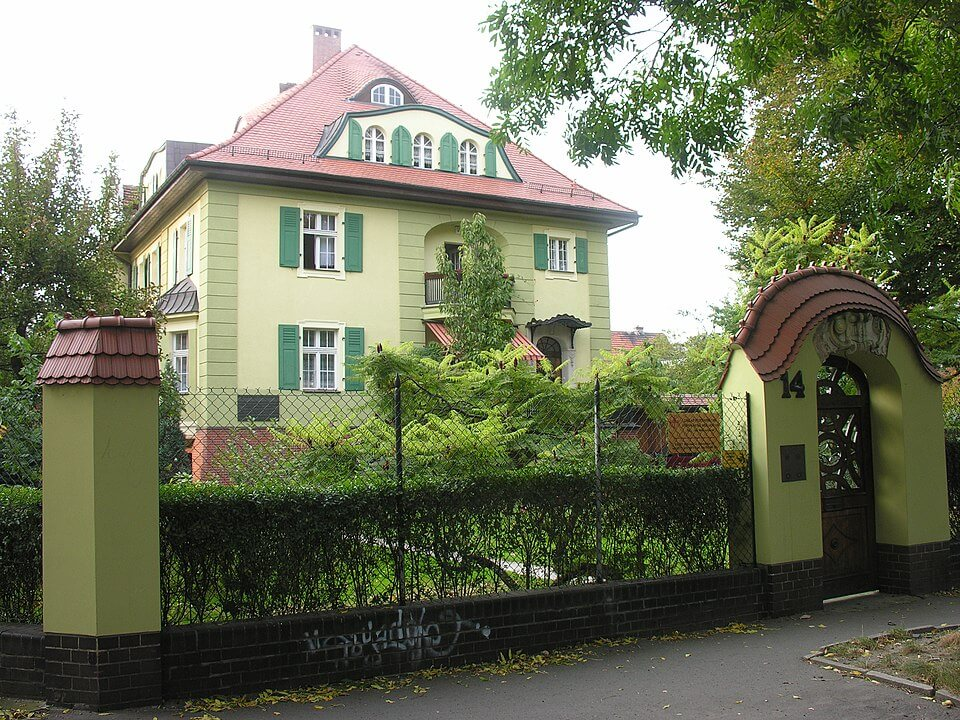

Kapitulacje, ale zanim o kapitulacjach, niecodzienny incydent:

### Wolne Niemcy

W ostatnich godzinach wojny we Wrocławiu doszło do dość tajemniczej operacji wojskowej. Sprowadzony 3 maja oddział dywersantów Viedta miał dokonać wyłomu w linii frontu, udając niemiecki Wehrmacht.

Istnieją dwie wersje wydarzeń:
- w jednej mieli zniszczyć sztab SS pułku broniącego tej części frontu, ale przy próbie przeniknięcia przez linie niemieckie zostali zdekonspirowani; doszło do strzelaniny i musieli się wycofać.
- w drugiej celem było połączenie się wszystkich grup po drugiej stronie linii niemieckich i atak z obu stron otwierający linię frontu na tym odcinku; do połączenia jednak nie doszło i po wzięciu jeńców wrócili do siebie.

Były dwie ofiary śmiertelne w oddziale dywersantów, sam dowódca, porucznik Horst Viedt i jeden z jego żołnierzy Josef Wagner. Obaj, jako jedyni Niemcy są pochowani na Cmentarzu Oficerów Radzieckich we Wrocławiu.

### Hermann Göring

Na granicy niemiecko-austriackiej Hermann Göring wraz z żoną i córką poddał się do niewoli generałowi Carlowi Spaatzowi dowódcy amerykańskiego lotnictwa w Europie. Razem z Himmlerem był w tym momencie najwyższym rangą hitlerowcem.

### 12 Armia

Po załamaniu się amerykańskiej kontroli na lewym brzegu Łaby Niemcy sami zorganizowali punkty zbiorcze dla żołnierzy 12 Armii.

Sztab dywizji Theodor Körner ulokował się w Schönhausen, posiadłości Bismarcków.

Zaciekłe walki prowadzono na linii drogi 188 Rathenow - Tangermünde. Na odcinku Wust sowietom udało się przedrzeć i rzucono wszystkie rezerwy by utrzymać pozycję. W obozie RAD żołnierze z panzerfaustami zatrzymali sowieckie czołgi. Obie strony poniosły poważne straty. W nocy Niemcy wycofali się za strumieniem na zachód od Wust.

Wust było siedzibą szlacheckiego rodu von Katte. Tam w 1704 urodził się Hans Hermann von Katte, jak to byśmy dzisiaj powiedzieli bliski przyjaciel Fryderyka Ii Wielkiego, towarzysz jego nieudanej ucieczki przed ojcem tyranem - za karę ścięty praktycznie rzecz biorąc na jego oczach w Twierdzy Kostrzyn. Fryderyk miał wówczas 17 lat.

Ponieważ amunicja była już na wyczerpaniu generał Wenck rozkazał przyspieszyć ewakuację, tak by najpóźniej 7 maja rano mogły się przeprawić ostatnie walczące jednostki. Obszar, na którym się bronili, to było tylko 6 na 2 km.

- [“By the late morning large groups of Germans began to appear in patches of woods on the horizon. They seemed to be milling about indecisively and to be not particularly desirous to fight. It was an eerie sight for those of us who had fought for more than three years all the way from Africa, for the mere sight of that bucket helmet meant certain death, unless one reacted instantly and instinctively, taking cover and firing. So, taking our lives into our hands, we drove right to them. They wanted to surrender. As we went on, their numbers increased by the hundreds and then thousands.” General James M. Gavin, 82nd Airborne Museum. May 1945.](https://www.facebook.com/joelstoppelsbftours/posts/3156667864602492)

### KL Mauthausen-Gusen

- [Disabled prisoners of Mauthausen concentration camp photographed in front of a tank from the 11th Armored Division, US Army on the 6 May 1945 following the liberation of the camp.](https://www.facebook.com/HistoryColored/posts/446473154028219)

### 1 Dywizja Pancerna WP

Dziś dowódca 1 Dywizji Pancernej generał Stanisław Maczek przyjął w porcie wojennym Wilhelmshaven kapitulację dowództwa bazy Kriegsmarine.

### Kapitulacja Wehrmachtu

Ostatni dzień negocjacji w sprawie całkowitej kapitulacji Wehrmachtu. Dowództwo wiedziało o desperackiej ewakuacji 12 Armii Wencka. Być może również z tego wynikało przeciąganie tej sytuacji.

<SeeAlso txt="Kapitulacja - Dzień Zwycięstwa" url="/festung-breslau/article/kapitulacja" />

Głównodowodzący sił niemieckich przybył do kwatery głównej aliantów zachodnich w Reims (Supreme Headquarters Allied Expeditionary Force) i zgodnie z instrukcjami admirała Dönitza zaoferował kapitulację wojsk niemieckich walczących z aliantami zachodnimi. Głównodowodzący SHAEF generał Dwight D. Eisenhower zagroził zerwaniem wszelkich rozmów z Niemcami, żądając natychmiastowej, bezwarunkowej kapitulacji całego wojska niemieckiego wobec wszystkich walczących stron alianckich. Takie były uzgodnienia Wielkiej Trójki, żadnego separatystycznego pokoju a jedynym końcem jest bezwarunkowa kapitulacja i ta umowa została dotrzymana przez wszystkie strony porozumienia. To stanowisko generał Jodl przedstawił admirałowi Dönitzowi, który wskazany przez Hitlera w testamencie jako jego następca od 3 maja we Flensburgu (południowy Szlezwig) tworzył posthitlerowski rząd nieuznawany przez nikogo poza Wehrmachtem.

Krótko po północy (czyli było to już 7 maja) Dönitz wysłał depeszę uprawniającą Jodla do podpisania kapitulacji w takiej formie, jakiej zażądał Eisenhower. W ten sposób wojna w Europie się skończyła. Ale to dopiero jutro.

Walki wciąż toczyły się we wschodniej Austrii, zachodnich Czechach, Meklemburgii, Chorwacji. Dönitz starał się odwlec moment generalnej kapitulacji, bo trwa kolejna Wielka Ucieczka, tym razem żołnierzy niemieckich przed sowiecką niewolą.

### Operacja praska

Na wieść o wybuchu powstania w Pradze Armia Czerwona rozpoczyna operację praską.

### Samobójstwa hitlerowców

Hitlerowiec się zabija: Franz Budka SS-Untersturmführer dowódca 1./SS-Festungs-Regiment 1 "Besslein" 19 kwietnia otrzymał krzyż żelazny, nie cieszył się nim długo. Dzisiaj usiłował uciec z Berlina, ale nastąpił na minę. Ranny uznał, że zostanie schwytany lub umrze z ran, więc się zastrzelił.

### KRN

Natomiast dziś Krajowa Rada Narodowa wydała ustawę konstytucyjną uchylającą Statut Organiczny Województwa Śląskiego, co likwidowało autonomię Województwa Śląskiego.

### Wrocław

Inny hitlerowiec ucieka. Gauleiter Karl Hanke mroczne widmo komendantów widzi, że wojna skończona, kapitulacja już za chwilę i musi pójść droga wszystkich gauleiterów i uciec. Verton:
>Gaulaiter Hanke w swojej nacjonalistycznej pysze i arogancji oświadczył, że zamierza aresztować generała Niehoffa za jego defetystyczną decyzję, ale potem zmienił zdanie. Bardzo szybko zaakceptował sytuację, dokonując równie szybkiej decyzji, aby mu podstawiono Fieselera Storcha. Samolot był wyłącznie do osobistego użytku dowódcy garnizonu, generała Niehoffa, lecz Hanke bez jego wiedzy wykorzystał maszynę, aby samemu odlecieć z Wrocławia. Generał Niehoff chciał ze swoim sztabem dzielić los mieszkańców miasta i był zadowolony z tego, że Hanke uciekł, gdyż jego obecność mogłaby się przyczynić do zakłócenia negocjacji. 6 maja około szóstej rano widziano Storcha w powietrzu. W godzinach rannych generał Niehoff otrzymał wiadomość z Kirchbergu: "Gauleiter Hanke lekko ranny wylądował tutaj w uszkodzonej maszynie”. Nic więcej o tym człowieku już nie słyszano.

Verton pisze prawdę, uciekł samolotem Fieseler Fi-156C Storch, który nie wymagał długiego pasa, i już więcej o nim nie słyszano. Nic pewnego w każdym razie. Jest wiele teorii na temat jego późniejszych losów. Tak samo, jak nie jest wcale oczywiste, skąd wystartował. Mógł użyć pasa startowego na pl. Grunwaldzkim, ale najprawdopodobniej był to teren przed Halą Stulecia. Iglicę postawili dopiero Polacy w 1948.

*Willa Colonia, w której podpisano kapitulację Wrocławia 
By [Bonio](https://commons.wikimedia.org/wiki/User:Bonio) - Praca własna, [CC BY-SA 3.0](https://creativecommons.org/licenses/by-sa/3.0), [Link](https://commons.wikimedia.org/w/index.php?curid=2830161)*

### Kapitulacja Wrocławia

Jak pisze Malinowski
>pierwsze kontakty w sprawie kapitulacji nawiązano 4 maja. 5 maja dowództwo 6 Armii wystosowało do garnizonu hitlerowskiego ultimatum z żądaniem kapitulacji, jednak jak meldował generałowi Głuzdowskiemu dowódca 22 Korpusu: "Z przesłuchania jeńców wziętych dziś do niewoli, wynika, że oficerowie poinformowali ich o odrzuceniu ultimatum radzieckiego i przygotowaniu przez garnizon "twierdzy" przebicia się przez południową część miasta w kierunku Świdnicy.

Ostatecznie jednak wieczorem 5 maja lub w nocy z 5 na 6 maja, generał Niehoff podjął decyzję o kapitulacji. Upoważnił go od tego radiogram dowódcy 17 Armii generała Hasse, zgodnie z którym dowódca "Festung Breslau" został uprawniony do podjęcia każdej decyzji, którą uzna za konieczną".

Przez megafon Niemcy przekazali informację, że komendant Niehoff jest gotowy do rozmów. Rosjanie poinformowali, że czekają. Rozpoczęło się nieformalne zawieszenie broni.

Urzędy Twierdzy niszczyły dokumenty, zgromadzone zapasy wydawano ludności cywilnej. Żołnierze zaczęli niszczyć broń lub ją ukrywać. Niektórzy popełniali samobójstwo.

Stronę niemiecką reprezentował kapitan von Blück i zastępca dowódcy twierdzy pułkownik Tiesler, obecny był też tłumacz.
Ze strony radzieckiej dowódca 22 Korpusu, na którego terenie miały toczyć się negocjacje, wyznaczył majora Omara Jachiajewa z asystentem i tłumaczem, major napisał później:
>Rozkazem dowódcy 6 Armii gen. Głuzdowskiego i dowódcy 22 Korpusu Piechoty gen. Zacharowa zostałem wyznaczony jako parlamentariusz na rozmowy z przedstawicielami oblężonego zgrupowania, do którego miałem się udać w towarzystwie asystenta-adiutanta, tłumacza i korespondentów. Wiedzieliśmy, że wśród faszystów nie było jednomyślności w sprawie zawieszenia broni i kapitulacji. Za kapitulacją był Wermacht i jego żołnierze i większość oficerów. Esesmani występowali przeciwko kapitulacji. Jak tylko doszedłem do środka ulicy, faszyści otworzyli ogień. Nie zważając na grożące niebezpieczeństwo, kontynuowałem swoją drogę do oznaczonego celu już ostrożniej – ryzykowałem nie tylko swoim życiem, ale także życiem moich współtowarzyszy, którzy już do mnie dołączyli. 
>Spotkanie odbyło się w pasie neutralnym. Działo się to na skrzyżowaniu ulic Powstańców Śląskich i Lwowskiej. I tu niemieccy parlamentariusze pogwałcili konwencję genewską, która określa, iż w tego rodzaju rozmowach mogą brać udział osoby bez broni. Po mojej uwadze na ten temat Niemcy powyciągali z kabur swoje pistolety Parabellum i wręczyli je mnie, przepraszając za swoje zapominalstwo. Demonstracyjnie wyrzuciłem tę broń natychmiast w gruzy, po czym zaczęliśmy mówić o warunkach kapitulacji. Dowództwo radzieckie żądało natychmiastowej kapitulacji, a faszyści prosili o odłożenie jej o dobę. Strona radziecka odrzuciła tę prośbę”

Po krótkiej dyskusji na temat zasad kapitulacji trzeba było sporządzić pisemny zapis. Niemieckich oficerów zaprowadzono z opaskami na oczach do sztabu pułku przy ul. Kamiennej 46. Tam spisano dokument i potem odprowadzono ich do pasa neutralnego. Przekazanie podpisanych dokumentów miało odbyć się o godz. 1400.

Żołnierze skończyli wojnę:
>Zarówno nasi, jak i niemieccy żołnierze wyszli z okopów, piwnic i innych kryjówek, porozsiadali się na gruzach domów (a wszystko to na pierwszej linii), palili, przekrzykiwali się, kto jak mógł, jak gdyby nigdy nie byli wrogami.

Wtedy doszło do incydentu, który mógł poważnie opóźnić poddanie Wrocławia. Niemieccy oficerowie w drodze powrotnej nastąpili na minę i eksplodowała. Nie wszyscy widzieli, że to mina. Chociaż znajdowali się już na swoim terenie, pierwszej pomocy udzielili im czerwonoarmiści. Esesmani oskarżali czerwonoarmistów o ostrzeliwanie parlamentarzystów moździerzami. Co gorsza, podczas reanimacji doszło do drugiego niefortunnego przypadku, otóż jeden z żołnierzy sowieckich uruchomił miotacz ognia. Natychmiast zareagowało SS. Ale Wehrmacht ich powstrzymał. Ponieważ parlamentariusze byli ranni, jeden z nich zresztą wkrótce potem zmarł, przesunięto umówioną godzinę na 1500.

W końcu spotkanie się odbyło ok. 1530. Warunki postawione przez dowództwo sowieckie wyglądały dobrze, więc zostały zaakceptowane przez stronę niemiecką:

>1. Wszystkie wojska pozostające pod dowództwem generała Niehoffa zaprzestaną działań wojennych w dniu 6 maja o godz. 14 czasu moskiewskiego (tj. 13 czasu miejscowego)
>2. Składy jednostek, broń, wszelkie środki bojowe, transportowe i urządzenia techniczne przekazane zostaną w stanie nieuszkodzonym.
>3. Komendantowi, jego oficerom i żołnierzom, którzy zaniechali oporu, zagwarantowane zostaje życie, żywność, pozostawienie własności osobistej i odznaczeń, a po zakończeniu wojny – powrót do ojczyzny. Całemu korpusowi oficerskiemu zezwala się na noszenie białej broni.
>4. Wszystkim rannym i chorym udzielona zostanie natychmiastowa pomoc lekarska środkami radzieckimi.
>5. Komendantowi i innym generałom pozostawia się do dyspozycji samochody osobowe wraz z obsługą, jak i odpowiednią obsługę w czasie niewoli.

Co interesujące - jak wynika z relacji Horniga - sam dokument stanowił gwarancję dotrzymania umowy, ale stało się to dla sowietów solą w oku. Do 1946 oficerowie mogli się posługiwać odpisami tego dokumentu sporządzonymi przez majora Otto. Jednak wszystkie zostały zniszczone. W końcu odebrano oryginał Niehoffowi. Najpierw przekonywano go, że potrzebny jest do archiwum wojennego. Kiedy odmówił wydania dokumentu, brutalnie go przeszukano i sprawdzono wszystkie jego rzeczy, choć był starannie ukryty, udało im się odnaleźć. Komisarz polityczny wyjaśnił mu zasady walki:
>Te tak zwane warunki pokojowego przekazania Breslau nie są żadną umową. To nic innego jak tylko udany podstęp wojenny.

Piwnicami i okopami Rosjanie na zaproszenie Niehoffa udali jego samochodem się do Biblioteki Uniwersyteckiej na Piasku. Jak zauważyli oficerowie sowieccy, za pierwszą linią prawie połowa żołnierzy była okaleczona. Po krótkiej wizycie w sztabie Twierdzy
>Zgodnie z poleceniem generała Głuzdowskiego, wracając, zabraliśmy ze sobą w dwóch samochodach Niehoffa, 10 pułkowników, wszystkie ważniejsze dokumenty sztabowe, a szczególnie mapy pól minowych. Dowódcę Festung Breslau zawieziono do sztabu 22 Korpusu, mieszczącego się willi Colonia, gdzie podpisał uzgodnione poprzednio przez parlamentariuszy warunki kapitulacji. W willi Colonia przebywał generał Niehoff jeszcze przez cały tydzień. Generał Głuzdowski miał o to pretensje do generała Zacharowa.

### Zawieszenie broni

Niemcy przestali walczyć. O godzinie 2100 lub nawet wcześniej pojedynczy żołnierze Armii Czerwonej, głównie oficerowie weszli na teren Twierdzy.

Ustalono także miejsca koncentracji rozbrojonych żołnierzy niemieckich:

Jońca, Konieczny, "Upadek..." s, 236:
>Uzgodniono także techniczny przebieg rozbrojenia garnizonu i wyprowadzenie wojsk niemieckich z Wrocławia. Postanowiono mianowicie, że jednostki niemieckie, rozmieszczone wzdłuż bezpośredniej główne linii frontu, zbiorą się w pobliskim miejscu wyznaczonym przez dowódcę wschodniego odcinka frontu, pozostałe oddziały w poczwórnych szeregach: 
> a) Grupa południowa na dz. placu Powstańców Śląskich. 
> b) Grupa zachodnia w miejscowości Szczepanów. 
> c) Grupa północna w miejscowości Rogóż. 
> d) Generałowie i oficerowie w Strzeszowie. 
> e) Sztab komendanta na placu Powstańców Śląskich.

Wieczorem po podpisaniu o godzinie 18.20 kapitulacji obie strony spotkały się na bankiecie zorganizowanym przez Rosjan w gmachu byłego niemieckiego okręgu wojskowego na Krzykach.

Verton:
>Rosjanie nie mogli się oprzeć pokusie. Zbyt wiele by sobie odmówili. Tak oto generał Niehoff i jego sztab zostali zaproszeni na uroczysty obiad. Zwycięzcy i pokonani usiedli przy jednym stole, nakrytym tym co najlepsze. To była ostentacyjna wystawność. Świece migotały ponad górami zimnych specjałów łącznie z kawiorem, mięsem, vol-au-vents, zaś wódka przelewała się. Jej butelki stały tuzinami między talerzami

Do niewoli dostało się 2 generałów, 1113 oficerów i 43861 podoficerów i szeregowców.

Hartung:
>O dziewiątej słychać jeszcze raz kilka eksplozji na froncie. Pesymiści twierdzą, że znowu się zaczyna. Potem cisza. Zawieszenie broni. Chwała Bogu.

Helena Pleczko:
>W ostatnich dniach oblężenia koczowałam po pl. Katedralnym, siostry niemieckie i pracujące tam kobiety niemieckie doskonale mnie znały i darzyły sympatią, a znajomy ksiądz pocieszał, że koniec wojny już blisko. I rzeczywiście nareszcie 6 maja zapadła w mieście cisza tak wszystkim potrzebna. Czekaliśmy spokojnie na przybycie wojsk rosyjskich i polskich. W przewidywaniu tej radosnej godziny odnalazłam schowane kiedyś wino mszalne podarowane mi niegdyś przez żołnierza niemieckiego 
>9 maja na pl. Katedralnym pojawili się żołnierze i towarzyszący im cywile, którzy znali teren. Dziwili się, że tyle ludzi mieszało w tych ruinach. 
>Mój powrót do Zawiercia nie był na razie możliwy, ponieważ pociągi nie kursowały, a zresztą samotne podróże dla młodej kobiety były bardzo niebezpieczne. 
>Zaangażowałam się chwilowo jako kucharka przy polskiej jednostce wojskowej, która kwaterowała w budynku przy ulicy Szczytnickiej 29. Gotowałam tam dla ok. 30 osób, a do pomocy miałam kilka Niemek. Po pewnym czasie kiedy ta jednostka odjeżdżała do Krakowa, zabrałam się z nimi.

Stanisław Klatko robotnik przymusowy Famo-Werke, obóz pracy Pomorska 50:
>Dnia 6 maja 1945 r. rozeszła się wieść, że Niemcy podpisali kapitulację Festung Breslau. Zebrano nas wszystkich w kościele przy pl. Strzeleckim, w którym odbyła się ogólna spowiedź. Niemiecki ksiądz przeprowadził publiczny rachunek sumienia. Kto poczuwał się do winy, w odpowiednim momencie bił się w piersi. Tłumacze stojący pod amboną tłumaczyli spowiedź. Później przyjęliśmy Komunię Święta. 
>Tegoż wieczoru żołnierze niemieccy w zorganizowanych grupach schodzili z linii frontu. Szli czwórkami przez ulicę Pomorską w pełnym uzbrojeniu pod komendą prowadzących ich oficerów. Na pl. 1 Maja pod pomnikiem Herkulesa z lwami rzucali swoje uzbrojenie. Tyle tego było, że w końcu nie było widać pomnika. Rozbrojonych Niemców żołnierze radzieccy odprowadzali na punkt zborny mieszczący się przy ulicy Cybulskiego, w byłym Arbeitsamcie. Na podwórzu przy stołach siedziała komisja wojskowa. Niemcy rozbierali się do pasa, podchodzili do stołu i załatwiali formalności. Każdy z nich musiał podnieść ręce do góry, gdyż w ten sposób wyławiano członków SS, którzy mieli pod pachą wytatuowany numer swojej tożsamości. Wielu zwykłych żołnierzy i członków Volkssturmu puszczano od razu do domów. Komisja działała 3-4 dni po kapitulacji. Takich komisji było w mieście kilka. Ulicą Cybulskiego nie można było przejść, bo tyle kobiet i dzieci czekało na zwolnienie swoich bliskich. 
>Wieczorem w moim obozie zapanowała wielka radość, ściskaliśmy się i całowaliśmy wzajemnie. Następnego dnia pojawił się polski oficer, którego omal nie udusiliśmy z radości. Przyszli także żołnierze radzieccy. Byliśmy ciekawi, co się dzieje w mieście, baliśmy się jednak zbyt oddalać od obozu. Zdarzało się, że niektórzy niemieccy żołnierze ukryli się i strzelali do nas. Cały obóz przetransportowano na Sołtysowice (Burgweide) i tam został on rozwiązany. 
>Zachodziła obawa, że w mieście może dojść do wybuchu epidemii. Zabici leżeli jeszcze na ulicach, pełno było też padłych koni. Jadący samochód rozgniatał na ulicy muchy i komary, których było mnóstwo. Trudno było w to uwierzyć, ale z rozjeżdżonych owadów tworzyły się koleiny. Oczyszczanie miasta zaczęło się od ulic, aby można było w jakiś sposób poruszać się. Niemcy wywieszali w oknach żółte chorągiewki na znak, że w tym domu panuje tyfus. Zwalniało to ich od udziału w odgruzowaniu.

### Viedt

I jeszcze na zakończenie tego szczególnego dnia, jedna uwaga - co interesujące w przeciwieństwie do np. Połbina Horst Viedt nie został w żaden sposób upamiętniony w PRL-owskiej martyrologii bitwy o Wrocław. Generał Iwan Połbin dostał swoją ulicę, Viedt nie dostał nawet tablicy pamiątkowej.

Na to pytanie nasuwa się odpowiedź, która wiele mówi o powojennej ideologii Wrocławia. Ideologii jako pewnej symbolicznej wizji, a nie zestawu doktryn. Otóż Viedt był co prawda tym dobrym, ale jednak Niemcem. Pamięć niemieckiego Wrocławia została w przestrzeni symbolicznej kompletnie zatarta przez powojenne polskie władze. Niemieckość jakakolwiek musiała być wymazana. W PRL-u nie było żadnej ulicy wrocławskiej, która ma niemieckiego patrona. Nawet z pozoru tak neutralne politycznie i ważne dla kultury postaci jak Goethe czy Brahms (obaj we Wrocławiu byli, więc jest pretekst) są we Wrocławiu nieobecne.

To ciąży na Wrocławiu do dziś, ogromne kontrowersje budzi propozycja nadania wzgórzu w Parku Południowym jako patrona dawnego nadburmistrza Wrocławia Georga Bendera, który stworzył Wrocław jako nowoczesne miasto. Dopiero w XXI wieku zaczęło się to ostrożnie się to zmieniać:

- pomnik Eichendorffa został ustawiony poza przestrzenią publiczną, w Ogrodzie Botanicznym.
- Karl von Holtei ma skromną tablicę na ul Rzeźniczej.
- pomnik Schillera został przywrócony w Parku Szczytnickim.

Ale nie mamy we Wrocławiu ulicy Berlińskiej, Frankfurckiej czy Saksońskiej, chociaż reprezentowanych jest wiele krajów świata, także takich, z którymi Wrocław nie miał nic wspólnego.
