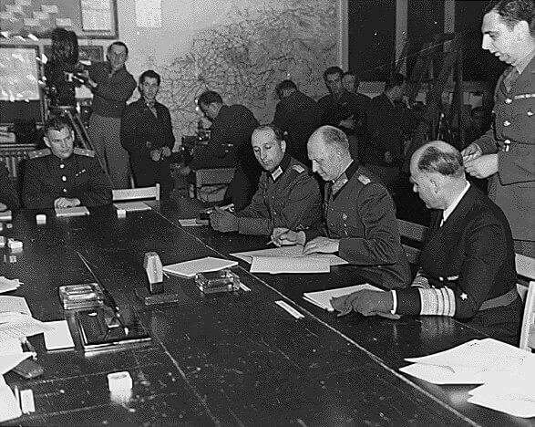

### Project Manhattan

Przygotowania do pierwszej eksplozji nuklearnej, która nastąpiła 16 lipca. Dzisiaj test kalibracyjny. Na poligonie umieszczono 108 ton TNT wymieszanego ze zużytym paliwem jądrowym. Eksplozja potwierdziła założenia projektu.

### Okinawa

- [US Marine Colonel Francis Fenton conducting the funeral of his son Private First Class Mike Fenton, Okinawa, 1945](https://rarehistoricalphotos.com/us-marine-colonel-francis-fenton-funeral-1945/)

### 12 Armia

2 batalion pułku Malow z dywizji Ulrich von Hutten, który bronił pozycji na zachód od Wust, otrzymał rozkaz bronić się do południa. Byli ostatnim oddziałem przeznaczonym do ewakuacji.

O godz. 0915 weszło w życie zawieszenie broni między 12 Armią niemiecką i 9 Armią amerykańską. Do godz. 1000 dalsza obrona nie była możliwa. Wycofano się do Fischbeck, którego do południa wciąż broniło 30 żołnierzy 2 batalionu.

Wciąż działały przeprawy:

- most drogowy w Tangermünde
- most kolejowy w Schönhausen
- prowizoryczny most w Ferchland

Późnym popołudniem sowieci wdarli się do Ferchland. W ostatniej łodzi znajdowali się oficerowie sztabu 12 Armii m.in. generał Wenck, jego szef sztabu Reichhelm, oficer operacyjny Freiherr von Humboldt i inni. Zostali ostrzelani z pepeszy.

Ostatnim oddziałem, który walczył na wschodnim brzegu była grupa bojowa Denk na przeprawie w Tangermünde. Dotrwali do wieczora. Osaczeni przez sowietów otrzymali propozycję wycofania się za Łabę, jeżeli przestaną walczyć. Na samym brzegu, kiedy byli już bezbronni, zostali wyłapani i wzięci do niewoli sowieckiej.

### Kapitulacja

Dziś dokładnie o godz. 0241 w kwaterze głównej SHAEF w Reims nastąpiło podpisanie bezwarunkowej kapitulacji Niemiec. Kapitulację ze strony niemieckiej podpisali generaloberst Alfred Jodl oraz w imieniu marynarki admirał Kriegsmarine Hans-Georg von Friedeburg. Jodl reprezentował innego marynarza admirała Karla Dönitza, który w testamencie Hitlera został wyznaczony na Prezydenta Rzeszy. W ten sposób alianci zachodni rzeczywiście podpisali kapitulację z ludźmi reprezentującymi władze hitlerowskie.
>All forces under German control to cease active operations at 2301 hours Central European Time on May 8, 1945.

Chociaż kapitulacja rzeczywiście weszła w życie, była wiążąca i zaspokajała wszelkie dotychczasowe ustalenia międzysojusznicze, w tym historycznym momencie brakowało na niej odpowiedniej rangi przedstawicieli strony sowieckiej. Dlatego na żądanie Stalina całą ceremonię powtórzono w innym składzie dzień później. Odbyło się to następnego dnia w Berlinie i podpisany został tym razem przez przedstawicieli aliantów zachodnich, strony niemieckiej oraz sowieckiej krótko przed północą 8 maja. W tym czasie w Moskwie był już 9 maja.

To jest przyczyna, dla której świat zachodni świętuje pokonanie Niemiec hitlerowskich 7 maja (faktyczne podpisanie kapitulacji, które miało miejsce w Reims), natomiast Moskwa i wszystkie podległe jej kraje Dzień Zwycięstwa mają 9 maja (bo kiedy podpisywano drugi akt kapitulacji już z przedstawicielami strony sowieckiej, to w Moskwie był 9 maja). Trudno o lepszy symbol powojennej sytuacji Polski jak to, że w PRL świętowano zakończenie wojny jako Dzień Zwycięstwa i to według czasu moskiewskiego.

<SeeAlso txt="Kapitulacja" url="/festung-breslau/article/kapitulacja" />

Jodl i Dönitz zostali uznani za zbrodniarzy wojennych, Jodl skazany na karę śmierci został powieszony, Dönitz dostał 10 lat, które w całości odsiedział. W 1953 niemiecki sąd uznał, że działania Jodla nie stanowiły zbrodni wojennych. Friedeburg nie został osądzony, jeszcze 9 maja został zdymisjonowany. Po wejściu w życie kapitulacji i ustanowieniu stref okupacyjnych status rządu Dönitza był cały czas podważany, w końcu 23 maja wszyscy zostali aresztowani i wtedy podczas próby przesłuchania Friedeburg popełnił samobójstwo.

Wiadomość ta natychmiast relacjonowana jest na całym świecie. Rozpoczęło się wielkie święto zwycięstwa nad hitlerowskimi Niemcami: VE-Day (czasem zapisywany jako V-E Day; Victory in Europe).

*Podpisanie kapitulacji w Reims 
By nieznany - [Franklin D. Roosevelt Library](http://docs.fdrlibrary.marist.edu:8000/BROWSE.cgi?db=2&amp;pos=551&amp;inc=50) ([https://www.archives.gov](http://docs.fdrlibrary.marist.edu/images/photodb/23-0313a.gif)), Domena publiczna, [Link](https://commons.wikimedia.org/w/index.php?curid=274179)*

### Delegatura Sił Zbrojnych na Kraj

Powstała 7 maja 1945 z rozkazu p.o. Naczelnego Wodza gen. Władysława Andersa. Jej zadaniem jest organizacja i centralizacja tworzącej się partyzantki antykomunistycznej. Na jej czele stanął pułkownik Jan Rzepecki. Główne zadania to była koordynacja na szczeblu krajowym, nawoływanie do pozostania w konspiracji i rozbijanie więzień, w których trzymano schwytanych partyzantów. Już wkrótce głównym zadaniem było samo zapewnienie bezpieczeństwa prześladowanym. Kiedy mocarstwa zachodnie wycofały uznanie dla rządu polskiego na emigracji, DSZ straciła umocowanie prawne.

2 sierpnia 1945 pułkownik Rzepecki powołał Wolność i Niezawisłość

- [Delegatura Sił Zbrojnych na Kraj](https://pl.wikipedia.org/wiki/Delegatura_Si%C5%82_Zbrojnych_na_Kraj)

### Masakra w Amsterdamie

Ostatni i tragiczny epizod wojny w Holandii.

W Amsterdamie wszyscy już wiedzieli, że w nocy Niemcy podpisali kapitulację. Do miasta zbliżali się Alianci. Panowała radosna atmosfera, świętowano koniec wojny i wolność. Tańczono na ulicach, machano flagami. Przed pałacem królewskim na placu Dam zgromadził się tłum rozentuzjazmowanych Holendrów.

Obserwowali to oficerowie niemieckiej marynarki zgromadzeni w pobliskiej kamienicy. O godz. 1500 podczas próby rozbrojenia otworzyli ogień, rozpętała się strzelanina trwająca dwie godziny. Po stronie holenderskiej doliczono się 32 zabitych.

Wydarzenie uznano za akt wojny, nigdy nie osądzono sprawców.

### Drezno

Władzę w Dreźnie objęło SS. To właśnie SS wysadziło prawie wszystkie mosty.

### Bitwa pod Kuryłówką

Bitwa pod Kuryłówką, oddziały Narodowej Organizacji Wojskowej odparły atak NKWD, po czym wycofały się ze wsi. Do bitwy doszło w następujący sposób:

2 maja w Biłgoraju zdezerterował cały oddział 3 Samodzielnego Batalionu Operacyjnego Wojsk Wewnętrznych. W pościg za dezerterami wyruszył batalion 11. pułku pogranicznego NKWD.

Podczas poszukiwań 6 maja oddział NKWD prowadzony przez Stepana Wołczastego z Piskorowic (członka UPA i byłego policjanta ukraińskiego), zaatakował posterunek MO w Cieplicach, po czym uprowadzono i zamordowano 4 milicjantów.

Jeden z oddziałów NKWD dotarł również do Kuryłówki, w której znajdował się oddział Narodowej Organizacji Wojskowej pod dowództwem majora Franciszka Przysiężniaka, ps. "Ojciec Jan". Odparto trzy ataki, w których napastnicy stracili 17 zabitych, przy stracie 7 żołnierzy. Po tym, jak NOW się wieczorem wycofał, następnego dnia wkroczyło NKWD i zamordowało 7 ludzi.

### Władimir Bojarski

50 km na południowy zachód od Pragi, w Příbram, czechosłowaccy komunistyczni partyzanci schwytali pułkownika Władimira Bojarskiego jednego z rosyjskich kolaborantów.

W czerwcu 1942 będąc dowódcą 41 Dywizji Strzeleckiej, dostał się do niewoli i 3 sierpnia razem z generałem Andriejem Własowem podpisał list otwarty do dowództwa niemieckiego o konieczności sformowania rosyjskiej armii antykomunistycznej. Od 1 września do października 1942 dowodził Rosyjską Narodową Armią Ludową (RNNA). Pod koniec 1944 przystąpił do Komitetu Wyzwolenia Narodów Rosji (KONR) i potem organizował jego siły zbrojne.

Był w drodze do 600 DP własowców, która dziś się wycofała z Pragi na zachód do niewoli amerykańskiej. Bojarski wszedł w konflikt z dowódcą oddziału komunistycznego czerwonoarmistą Smirnowem i spoliczkował go. Został natychmiast powieszony.

600 DP dotarła do Amerykanów i po poddaniu się została wydana w ręce Armii Czerwonej. Większość jej oficerów została rozstrzelana.

### Leon Degrelle

Hitlerowski kolaborant i do samego końca wyznawca Hitlera ucieka do Hiszpanii. Jest w Polsce niezwykle popularny.

24 kwietnia po raz ostatni awansowany, otrzymuje stopień SS Standartenführera. Wizytuje swój oddział.

28 kwietnia bez zgody przełożonego oddalił się z jednostki. Razem z kilkoma oficerami uciekli samochodem. 1 maja pojawił się w Kalkhorst (Meklemburgia - Pomorze Przednie). W Bad Segeberg (Szlezwik-Holsztyn) spotkał się z również uciekającym Himmlerem, który zmierzał do Dönitza, żeby zając jakąś bezpieczną pozycję w nowym, pohitlerowskim rządzie, który formował się w Flensburgu.

Degrelle nic by na tym nie zyskał, bo z Himmlerem nikt już nie chciał mieć nic wspólnego. W rejonie Kilonii w nocy z 2 na 3 maja kierowca Degrelle'a zgubił konwój Himmlera i od tej pory musieli uciekać na własną rękę. Do tego popsuł im się samochód więc trochę zajęło zanim znaleźli następny.

Już 3 maja jest w Danii, 4 maja w Kopenhadze. Żadne miejsce nie jest bezpieczne. Degrelle boi się, że zostanie wydany sowietom, boi się również, że alianci schwytają go i wydadzą jego rodakom. Jest pewien, że w powojennej Belgii czeka go wyrok śmierci. Nawet Szwecja nie wydaje u się dość bezpieczna. 

Płynie statkiem do Oslo, tam na lotnisku być może z pomocą Speera dostaje się do He 111 w wersji pasażerskiej. Leci tylko on i jego oficer oraz czteroosobowa załoga. Degrelle decyduje się na lot do Hiszpanii, co jest ogromnym ryzykiem. Przede wszystkim przelecą przez wrogą przestrzeń powietrzną, gdzie każdy napotkany myśliwiec z łatwością cih zestrzeli. Do tego mają do przebycia w najlepszym razie 2200 km, co daje im tylko 100 km zapasu w razie problemów.

Na miejsce lądowania wybrali San Sebastian. Kiedy okazało się, że nie ma w pobliżu żadnego lotniska, pilot wylądował na płyciźnie przy brzegu rozbijając samolot. Byli ranni, Degrelle złamał rękę. Hiszpanie pospieszyli im z pomocą i zabrali do szpitala.

Franco nie pozwolił na ekstradycję hitlerowca. Degrelle w 1954 otrzymał obywatelstwo hiszpańskie. Jawnie, także w miejscach publicznych nosił mundur SS i odznaczenia. Nawet po śmierci Franco był zaangażowany w ruch neonazistowski i do końca pozostał nazistą.

- [Mark Felton Productions "Nazi Leader's Daring Escape to Spain 1945" [YT 7:34]](https://www.youtube.com/watch?v=YkNvOb2nMQc)

### Samobójstwa hitlerowców

Hitlerowiec się zabija: Jakob Sprenger antysemita, od 1922 w NSDAP, gauleiter Hesji-Nassau. Uciekali razem z żoną aż z Frankfurtu do Austrii. Tam okazało się, że nie ma już dokąd uciekać. Zabili się.

### Wrocław

Tu już żegnamy pamiętnik księdza Peikerta, na dzień dzisiejszy zapisuje rzecz bardzo dziwną, różni się od wszystkich innych wspomnień z tego dnia, jak to rozumieć, jakieś zabłąkane pociski, PTSD, lub co najbardziej prawdopodobne pomyłka w zapisie daty, lub pomyłka tłumacza:
>Ale nawet tam na Biskupinie należało się spodziewać niemal codziennie wieczornych nalotów, a pod koniec mnożyły się przede wszystkim dzienne. Jeszcze w dniu 7 maja, gdy odwiedzałem chorego, musiałem się podczas tych dziennych nalotów czterokrotnie rzucić na ziemię, aby się jako tako ratować przed odłamkami bomb. 
>Prałat Lange, kurator „Domu Dobrego Pasterza” donosił, że 7 maja grupa Rosjan przedostała się przez uszkodzoną ścianę do klasztoru Kaiserstrasse, gdzie znajdowały się dwie starsze wiekiem siostry zakonne. Jedna z nich uciekła, ale ta druga nawet się nie starała, sądząc, że jej podeszły wiek uchroni ją przed każdą fizyczną zniewagą. Siostra Felizita została obezwładniona przez grupę, zastrzelona i zgwałcona. ”Pochowaliśmy ją w ogrodzie klasztornym. Miała 81 lat".

Majewski, Sozańska "Bitwa o Wrocław. Styczeń - maj 1945 r.":
>7 maja na wszystkich frontach wokół Wrocławia zamilkły nieliczne już wystrzały. 
>Pisze ppłk Malinin: "Na ulicach cicho. Nie słychać trzasku karabinów maszynowych. wybuchów min i pocisków. Palą się domy pożarami wznieconymi w czasie walk. Obok napisów, których pełno na ulicach: Stój! Linia frontu! - ciągną tysięczne rzesze niemieckich jeńców. Jedni idą z głowami opuszczonymi, inni uśmiechają się przymilnie do radzickich żołnierzy i powtarzają jak bezmyślne papugi: Hitler kaputt, Breslau kaputt, Krieg kaputt! Na skrzyżowaniach ulic stosy broni, amunicji, granatów" 
>Wspomina mjr Sawczenko: "Ulice wrocławskie zalane słońcem. Idą kolumny jeńców. Na skrzyżowaniach ulic rosną stosy nikomu niepotrzebnej już niemieckiej broni. Robimy porządki. W nocy rozlega się strzelanina, słychać wszystkie rodzaje broni. Zwycięstwo. Wojna zakończona. Nikt tej nocy nie spał".

### Bolesław Drobner

Zbliżamy się do końca kroniki wojennej (która nie ma podsumowania ani puenty), więc można trochę wybiec naprzód. Bolesław Drobner wyznaczony przez polskie władze komunistyczne na prezydenta Wrocławia miał poważny problem w skompletowaniu ekipy pionierskiej, której zadaniem było tworzenie polskiego miasta od podstaw. Podstawowa trudność polegała na znalezieniu w praktycznie niezniszczonym wojną Krakowie chętnych do przeprowadzki w ruiny niemieckiego jeszcze miasta, a nowa władza wcale, jak się okaże i co od początku nie było tajemnicą, nie miała wiele do zaoferowania. To nie były lukratywne kontrakty, ale poważne i czasem niebezpieczne wyzwanie wymagające ogromnego poświęcenia i oferujące niepewną przyszłość

Po raz pierwszy do Wrocławia przyjechał na rekonesans jeszcze w trakcie trwania walki, 13 kwietnia. Dotarli do pl. Powstańców Śląskich, kilka ulic dalej wciąż trwała wojna. Więcej czasu spędzili w Kątach Wrocławskich, gdzie spotkali się z sowieckim komendantem wojskowym miasta podpułkownikiem Liapunowem i po trzech dniach wrócili do Krakowa. To zdjęcia z tej ekspedycji oglądaliśmy w "Przekroju" 29 kwietnia.

<SeeAlso txt="Grupa inicjatywna Drobnera" url="/festung-breslau/article/grupa-drobnera" />

Walki we Wrocławiu zakończyły się 6 maja. Minęły dwa dni, zanim udało się zorganizować pierwszą powojenną wyprawę polską do Wrocławia. 9 maja, rano z Krakowa wyjechała jedna ciężarówka załadowana prowiantem na kilka pierwszych dni z polską flagą oraz skromną ekipą pod dowództwem Kazimierza Kuligowskiego. Jest to temat na osobną opowieść. Pora zakończyć naszą.

### Karl Hanke

Ze wszystkich głównych bohaterów naszej opowieści najszybciej zakończyła się historia Gauleitera Hansa Franka. Krążą rozmaite wersje jego końca, ale według najbardziej prawdopodobnej z nich uciekł samolotem rozpoznawczym Storch, startując sprzed Hali Stulecia (obecną Iglicę postawili dopiero Polacy w 1948) i szybko udało mu się przedostać do Czech. Tam jednak dostał się do niewoli i wciąż nierozpoznany został zastrzelony podczas próby ucieczki.

### Hans von Ahlfen

Hans von Ahlfen, komendant twierdzy do początku marca 1945, 17 kwietnia dostał się do niewoli alianckiej, z której zwolniono go 30 czerwca 1947. Jego następca generał Hermann Niehoff w niewoli sowieckiej był do 1956, wtedy zwolniono resztę wciąż żywych jeńców niemieckich. Bardzo szybko nawiązuje kontakt z Ahlfenem i jako reprezentanci mitu "dobrego Wehrmachtu" żywego w środowiskach kombatanckich i ziomkowskich piszą pierwszą wersję wspomnień z obrony Wrocławia "Der Kampf der Festung Breslau" wydaną przez Verlag Ernst Siegfried Mittler w 1957. Na fali sukcesu, jaki osiągnęła ta książka, piszą poprawioną, rozszerzoną wersję wydaną dwa lata później w 1959 przez Verlag Gräfe und Unzer "So kämpfte Breslau". To właśnie tę książkę znamy jako "Festung Breslau w ogniu" (Wydawnictwo Dolnośląskie 2008). Ahlfen natychmiast przystępuje do pracy nad następną książką opisującą walki na Śląsku, wydaną w 1961 również przez Verlag Gräfe und Unzer pod tytułem "Kampf um Schlesien" ("Walka o Śląsk 1944/1945" Wydawnictwo Dolnośląskie 2009). Umiera kilka lat później w 1966 w wieku 69 lat. Niehoff, jego rówieśnik, jest długowieczny, umiera w 1980, mając 83 lata.

### Paul Peikert

Najważniejszym kronikarzem oblężenia Wrocławia i bardzo długo jednym znanym stronie polskiej, jest ksiądz Paul Peikert, proboszcz parafii św. Maurycego. Znana nam książka z licznych wydań od 1964 roku "Kronika dni oblężenia Wrocław 22 I - 6 V 1945" jest skróconą i ocenzurowana wersją jego pamiętnika, który pozostawił w parafii. Prawdopodobnie nie wiedział, czy jego pamiętnik w ogóle ocalał, po wojnie wyjechał do Westfalii, gdzie nadal pełnił funkcję proboszcza aż do śmierci w 1949 w wieku 60 lat. Z chęcią przeczytalibyśmy cały jego pamiętnik, niestety nie wiadomo nic o planach wydania go w krytycznej wersji. Polską wersję "Kroniki" znał i korzystał z niej inny wrocławski kronikarz Ernst Horning, autor wydanej w 1975 "Breslau 1945: Erlebnisse in der eingeschlossenen Stadt" ("Breslau 1945. Wspomnienia z oblężonego miasta", Via Nova 2009). Horning, ksiądz luterański i przywódca lokalnego Kościoła Wyznającego został wysiedlony z Wrocławia późno, bo w grudniu 1947 i nie wyjechał daleko, przeniósł się do Görlitz, gdzie mimo problemów stwarzanych przez władze DDR pełnił funkcję biskupa aż do przejścia na emeryturę w 1963. Umarł w 1976 w wieku 82 lat. Walter Laßmann, inny ksiądz katolicki, proboszcz parafii św. Józefa a później następca Paula Peikerta w parafii św. Maurycego, został z Wrocławia deportowany we wrześniu 1946. Swoją relację opracował w 1969, ale nie została ona wydana za jego życia. Oryginał niemiecki wydano dopiero w 2012, a rok później ukazało się wydanie polskie.

### Hugo Hartung

Hugo Hartung był cywilem, pisarzem i dramaturgiem, który w czasie wojny został zmobilizowany w wojskach naziemnych Luftwaffe, to komplikowało jego los. Ale nie dostał się do niewoli sowieckiej i granicę polsko-enerdowską udało mu się przekroczyć już w 8 lipca 1945. Jest autorem pierwszych wspomnień z oblężonego Wrocławia. Najpierw książki beletrystycznej wydanej już w 1951 "Der Himmel war unten" ("Gdy niebo zstąpiło pod ziemię" Via Nova 2008), oraz pamiętnika opublikowanego w 1956 "Schlesien 1944/45 Aufzeichnungen und Tagebücher" ("Śląsk 1944/1945 zapiski i pamiętniki", Via Nova 2009). W Niemczech najpierw udał się do Turyngii, ale później z rodziną przeniósł się do Monachium. W 1956 został wyróżniony Nagrodą Literacką im. Heinricha Drostego. Umarł w 1972 w wieku 70 lat.

### Hendrik Verton

Hendrik Verton, był człowiekiem, którego związek z Wrocławiem był zupełnie przypadkowy. Jako holenderski ochotnik SS dostał się do garnizonu twierdzy i tu stoczył swoją ostatnią walkę. Udało mu się uniknąć sowieckiej niewoli i 20 września 1945 otrzymał dokument zwalniający go do domu, chociaż nie wrócił od razu, bo jako były żołnierz SS nie miał dokąd wracać. Przyjechał do Wrocławia jeszcze raz, w latach 70. Swoje wspomnienia opisuje w książce "In the Fire of the Eastern Front: The Experiences of a Dutch Waffen-SS Volunteer, 1941-45", której polskie tłumaczenie wydała Bellona w 2010.

