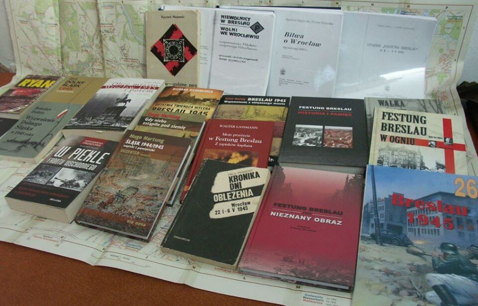

### Edycja 2022 - podsumowanie

119 dni wojny, od 12 stycznia do 10 maja 1945. Wrocław, Dolny Śląsk, Polska, Europa, świat.

### Co się udało?

- Przejrzenie treści i usunięcie całej masy literówek, błędów, poprawienie brzmienia. Skrócenie zdań.
- Korekta chronologiczna. W kilku przypadkach wydarzenie było źle przypisane do dnia, wszystkie takie przypadki, które zidentyfikowałem, są poprawione.
- Uzupełnienie o nową treść. Nie jest to co prawda skok, tak jak w ubiegłym roku o jakieś 30%, raczej o 10%.
- Jako nową treść, w sumie nową kategorię treści należy też doliczyć serię artykułów o poszczególnych krajach europejskich podczas wojny. Kontekst tego co się działo np. w Europie płd-wsch nie jest jak sądzę dobrze w Polsce znany. Jak większość treści na tym blogu mają one charakter rozwojowy i jest to początek pewnej ogólnej narracji.
- Zmiana mechanizmu aktualizacji bloga, przedtem musiałem zmieniać parametr we frontmatterze, robić commita i puszować go na GH, że się tak wyrażę. Tym razem celem była całkowicie automatyczna aktualizacja. To niestety udało się połowicznie, o ile sam mechanizm jest OK to istotną cechą statycznej strony (a takie generuje Gatsby) jest... statyczność. Tzn. że każda zmiana wymaga rekompilacji (przebudowy) strony na serwerze. To, owszem, można robić automatycznie przy użyciu takich narzędzi jak [IFTTT](https://ifttt.com/). To jednak, jak się okazuje, nie działa. Tzn. działa, ale nie daje efektu, bo musiałoby przy okazji wyczyścić bufor. Czemu jednak kiedy ja wrzucam aktualizację, to nie muszę czyścić bufora żeby weszła? Ostatecznie nie był to jedna tak wielki problem, bo i tak codziennie coś poprawiałem i były zmiany do skomitowania. Trzeba jednak będzie tę sprawę dokładnie zbadać.
- Nowe właściwości bloga. Zaliczam to do tego co się udało, bo ważniejsza część się udała. Działają tagi i linkowanie komponentem "Więcej na ten temat w osobnym artykule:". Brakujące wymieniam poniżej.

To wszystko i prawdę mówiąc nie jestem z tym szczęśliwy, mogło się udać więcej. I na pewno by się udało gdybym miał więcej czasu.

### Co się (jeszcze) nie udało?

#### Plany z 2020:

- Dociągnięcie kalendarium do 10 maja przynajmniej.
- Uzupełnienie bibliografii.
- Biografie narratorów i innych postaci związanych z bitwą o Wrocław.
- Opis broni i składu garnizonu i oblegającej Twierdzę 6 Armii.
- Opis wojny na Śląsku; w kilku artykułach, bo wątpię by jeden wystarczył, więc trzeba będzie to podzielić na oddzielne operacje.
- I na końcu rzecz, do której zabieram się od dawna, powstawanie Polski powojennej, w kilku częściach, pierwsza od 1 września do Armii Andersa, druga tworzenie przyszłej Polski komunistycznej aż do zajęcia Lublina, trzecia Rzeczpospolita Lubelska i czwarta to, co było potem do Poczdamu. Zasadniczą i osobną częścią powyższego będzie najdokładniejszy, jak się da opis zadomawiania się Polaków we Wrocławiu, tu trzeba będzie również wspomnieć o tych, których przywieziono przemocą, i już pozostali, więc wszystkie obozy pracy.

#### Plany z 2021

- Pewne dość oczekiwane w przypadku bloga właściwości, te brakujące wymieniam poniżej.
- Newsletter, którego powstanie miało być praktyką po kursie [Mailketingu](https://mailketing.pl/) (który polecam). Przygotowałem infrastrukturę: maile, przekierowania na gmailu i skonfigurowany profil na MailerLite, ale żeby można było z tym ruszyć, trzeba było mieć wystarczający zapas napisanych na 100% wpisów i czas na korektę treści (błędy składni czy literówki w newsletterze to straszna, bo nienaprawialna wtopa). Może w przyszłym roku.

### A zatem co teraz?

OK, zatem jak przedstawiają się dalsze plany? Co do samej kroniki wojennej:

- W tym roku powinny dojść Biografia, Kalendarium, kilka biogramów i dodatkowe artykuły, wszystkie ukończone będę wrzucał na Facebooka.
- Mowa treść, tak, bo wbrew pozorom całkiem spora część wojny przeleciała bez wzmianki i tu nawet nie będę wymieniał całej serii zagadnień, które powinienem dodać.
- Brakujące ficzery bloga: chmura tagów, wyszukiwarka, następny/poprzedni, komponent z listą najpopularniejszych wpisów, menu hamburger dla artykułów, tryby ciemny jasny (jasny w tym wypadku), przyciski do publikacji na Facebooku i Twitterze i być może komentarze.
- Newsletter, to zależy od tego, czy będę miał czas i uznam to za potrzebne, ale całkiem możliwe, że w przyszłym roku od samego początku kolejnej edycji, czy nastąpi w przyszłym roku, to zależy od tego w jakim stopniu uda mi się zapewnić coś istotnie nowego.

Wszystko to powinno powstać i zostać dodane systematycznie - element po elemencie - w ciągu roku.

Powiązane:
- Jak zrobić stronę w Gatsby'm opisuję w serii wpisów na blogu [Hello, Gatsby!](https://dygresje.info/blog/gatsby), jeden z wpisów dotyczy mechanizmu bloga MDX, w tym roku dopiszę kolejne opisujące dość dokładnie powyższe ficzery / elementy.
- Strona o [Akcji T4](https://github.com/tdudkowski/t4), tu niestety przerosła mnie powaga tematyki, ale podobnie jak ze wszystkim ważnym na mojej stronie, będzie musiało poczekać
- Zupełnie nowy projekt, o którym napiszę, ale dopiero jak zacznie powstawać: Kartografia Terroru.

### Na zakończenie PODZIĘKOWANIA!

Przede wszystkim dla wszystkich cierpliwych czytelników niniejszej kroniki. Gdybym nie uznał, że kogoś może to zainteresować, to bym tego nie napisał. Więc: tak - na 100% bez Was by nie powstała.

Wszystkim, którzy przyczynili się do napisania bloga:

- autorzy licznych książek.
- niezliczona rzesza wikipedystów mrówczą pracą zbierających ogrom ludzkiej wiedzy.
- [Echa z Festung Breslau](https://www.facebook.com/EchazFestungBreslau) godny polecenia profil FB związany z GRH Festung Breslau, tłumaczą monumentalne dzieło Horsta Gleissa "Breslauer Apokalypse" i cały czas publikują na Facebooku fragmenty wspomnień rzucających nowe światło na historię bitwy o Wrocław.
- [Bóbr 1945](https://www.facebook.com/bobr1945) profil FB Wydawnictwa Archwium System, Macieja Szczerepy i Roberta Primke, którzy opublikowali wiele książek o wojnie na Dolnym Śląsku i Łużycach, mi szczególnie przydała się "Kierunek Festung Breslau. Natarcie 6 Armii na Wrocław w lutym 1945 r." wydana w 2017. Jest to dokładny opis oblężenia Wrocławia od strony zachodniej. Ten profil też warto zalajkować, bo ciągle pojawiają się wpisy o niezliczonych epizodach wojny na Dolnym Śląsku.
- [Podcast Wojenne Historie](https://www.youtube.com/channel/UC31eKWaS-IGeIJ59TZwHHXw/) profesjonalny, rzetelny, dokładny i bezkompromisowo rozprawiający się z mitami
- [IrytujacyHistoryk](https://www.youtube.com/user/IrytujacyHistoryk) człowiek zasłużona legenda.
- [Leszek Adamczewski](https://replika.eu/autor/adamczewski-leszek/) pisarz i dziennikarz, autor kilku książek, zbiorów artykułów o Polsce okresu wojny.
- Bernhard Kast, austriacki historyk specjalizujący się w niemieckiej broni, ma dwa profile na YT [Military History Visualized](https://www.youtube.com/c/MilitaryHistory/) oraz [Military History not Visualized](https://www.youtube.com/c/MilitaryHistoryVlogs/).
- Mark Felton, brytyjski historyk zajmujący się WWII, ma dwa profile na YT [Mark Felton Productions](https://www.youtube.com/channel/UCfCKvREB11-fxyotS1ONgww/) oraz [War Stories with Mark Felton](https://www.youtube.com/channel/UCR3L1IGpxPDuHWQjqfz608g/).
- Tony Le Tissier, brytyjski historyk mający za sobą służbę wojskową w Berlinie, jego "The Battle of Berlin 1945" (pierwsze wydanie 1987, potem 2008 i 2013) jest najdokładniejszym opisem bitwy berlińskiej. Peter Antill mocno się nim, że pozwolę sobie na eufemizm "inspiruje" w "Berlin 1945. The end of a Thousend Years Reich" (Osprey Campaign), a "Berlin 1945. Upadek" Daviesa jest baaardzo ogólna i zajmuje się raczej kontekstem bitwy.
- Wilhelm Tieke "Pomiędzy Odrą a Łabą. Bitwa o Berlin 1945", doskonałe i nowsze uzupełnienie książki Tissiera, niestety pospieszne tłumaczenie utrudnia lekturę
- [Linfamy](https://www.youtube.com/c/Linfamy/) - aczkolwiek treść kanału poza trzema filmami o bitwie na Okinawie nie ma bezpośredniego związku z treścią kroniki, to jednak świetnie przedstawia i historię i kulturę Japonii, a więc ma ogromne znaczenie dla zrozumienia fenomenu Japonii okresu wojny. Zainteresowanym Japonią polecam również kanały: [Let's ask Shogo -Your Japanese friend in Kyoto](https://www.youtube.com/c/LetsaskShogoYourJapanesefriendinKyoto) oraz [The Shogunate](https://www.youtube.com/c/TheShogunate/)

### Polecam

Kanały YT powiązane z powyższą tematyką, które również polecam:

- [Oblicza XX Wieku](https://www.youtube.com/c/ObliczaXXWieku)
- [Powojnie](https://www.youtube.com/channel/UC1t8ZKKaEXKyE86ga4xFFTg/) historia powojenna, wiele mało znanych wątków
- [Okupowana Polska](https://www.youtube.com/c/OkupowanaPolska) dawniej znana jako Okupowany Kraków
- [Dark Skies](https://www.youtube.com/channel/UCwx8xyh6ZlDI5ZQpbIWKnUg/) historia lotnictwa od WWI
- [Military Aviation History](https://www.youtube.com/user/Bis18marck70)
- [Zabytki Nieba](https://www.youtube.com/c/ZabytkiNieba/) historia konstrukcji polskiego (a ostatnie nie tylko polskiego) lotnictwa
- Indy Neidell, historyk i aktor, trzy profesjonalnie prowadzone kanały: [The Great War](https://www.youtube.com/c/TheGreatWarSeries/) | [World War Two](https://www.youtube.com/c/WorldWarTwo/) | [TimeGhost History](https://www.youtube.com/c/TimeGhost/)
- [Forgotten Weapons](https://www.youtube.com/c/ForgottenWeapons/) broń strzelecka

<BoxImageWrapper>

źródła
</BoxImageWrapper>

{/*
- [Olaf Popkiewicz](https://www.youtube.com/channel/UCRHf8oiAU0N7rsn8L94n6ZQ/) archeolog, redaktor programu Poszukiwacze Historii - WWII w północnej Polsce.

Uważam, że całkiem nieźle. Na jakiś czas zamykam tę kronikę w takim stanie jak jest teraz. Będę wprowadzał poprawki i edytował treść, ale w archiwum na Githubie, nie w Bloggerze (no, chyba że jakiś babol się trafi); więc treść bloga do następnego stycznia (przeżyjemy 2020?) pozostanie bez zmian. Co się udało to to, co było najważniejsze - jest korpus tekstu bloga. Wymaga niezliczonej liczby poprawek, uzupełnień, ale też trzeba tu zachować pewną proporcję, bo codzienne odcinki nie mogą być za długie. Temu ma m in służyć wyrzucenie komentarzy i wtrąceń do osobnych artykułów. Taki właśnie charakter mają artykuły i Hannie Reitsch, niemieckiej armii, państwie hitlerowskim i klasztorze augustianów.

Co się nie udało, czego brakuje i co trzeba uzupełnić. Najpierw co trzeba uzupełnić: kalendarium i bibliografię. Nie udało się napisać biogramów głównych narratorów kroniki. Brakuje map, opisów broni, opisanego w oddzielnym artykule składu garnizonu i oblegających, jeszcze raz map. Nie jest opisana dość dobrze, czasem w ogóle wojna na Śląsku. Tak samo jak we Wrocławiu i w Berlinie brakuje wytyczenia dziennych postępów frontu. W ogóle jest za mało Berlina.

Tak więc plan jest taki: zostawiam ten blog na rok w takiej postaci, jak jest teraz. Z rzeczy, które na pewno pojawią się (ale nie daję terminów) to:

- dociągnięcie kalendarium do 10 maja przynajmniej
- uzupełnienie bibliografii
- biografie narratorów i innych postaci związanych z bitwą o Wrocław
- opis broni i składu garnizonu i oblegającej Twierdzę 6 Armii
- opis wojny na Śląsku; w kilku artykułach, bo wątpię, by jeden wystarczył, więc trzeba będzie to podzielić na oddzielne operacje
- więcej Berlina, coś wymyślę
- i na końcu rzecz, do której zabieram się od dawna, powstawanie Polski powojennej, w kilku częściach, pierwsza od 1 września do Armii Andersa, druga tworzenie przyszłej Polski komunistycznej aż do zajęcia Lublina, trzecia Rzeczpospolita Lubelska i czwarta to, co było potem do Poczdamu
- zasadniczą i osobną częścią powyższego będzie, najdokładniejszy jak się da opis zadomawiania się Polaków we Wrocławiu, tu trzeba będzie również wspomnieć o tych, których przywieziono przemocą i już pozostali, więc wszystkie obozy pracy

Jak widać, jest sporo do zrobienia, być może więcej niż jest już zrobione. Ale ponieważ udało się to projekt w zasadniczej części zrealizować, mam nadzieję, że podobnie pójdzie z resztą.
Za rok natomiast znowu wszystkie wpisy skazuję i będę je publikował codziennie, dla aktualnego dnia.

Kompletnym rozczarowaniem jest Blogger, wygląda na to, że Google przez nierozwijanie jej stosuje tzw. odszczurzanie, czyli redukcję puli użytkowników do poziomu usprawiedliwiającego zamknięcie tego biznesu. Prawdopodobnie przyszłoroczne wydanie kroniki wojennej będzie już na jakiejś innej platformie, przede wszystkim przyjaźniejszej użytkownikowi, ale również zależy mi na większych możliwościach publikacji.

Póki co (i jest to powód, dla którego nie mogę określić żadnych terminów) muszę również dociągnąć przynajmniej do stadium wczesnej realizacji projekt strony o Akcji T4. Tekst brudnopis już jest - [Teksty na stronę o Akcji T4](https://github.com/tdudkowski/t4), projekt layoutu też [CRW copycat](https://tdudkowski.github.io/Layouts/Layout05/), więc - biorąc pod uwagę ograniczenia czasu - jest to kwestia kilku tygodni. Zobaczymy czy na kilku się skończy.

### Poczdam

W 1945 r. na konferencji w Poczdamie postanowiono pozbyć się 267,5 tys. ton bomb, pocisków i min zawierających broń chemiczną. Najtańszym sposobem było zatopienie tego arsenału w Bałtyku, głównie w Basenie Bornholmu (ok. 105 m. p.p.m. ) i Głębi Gotlandzkiej (okolice Głębi Landsort 459 m. p.p.m.). Wokół Bornholmu Rosjanie zatopili 40 tys. ton różnego typu kontenerów z adamsytem, clarkiem I i II, iperytem siarkowym, fosgenem, tabunem, solami cyjanowymi oraz kwasem pruskim. W 1945 r. w wodach Małego Bełtu (między duńskimi wyspami Aero i Fionia a Półwyspem Jutlandzkim) Brytyjczycy zatopili 69 tys. ton artyleryjskich nabojów z tabunem i 5 tys. ton bomb zawierających tabun i fosgen. Rok później Amerykanie w dwóch punktach Cieśnin Duńskich zatopili 42 okręty ze 130 tys. tonami niemieckiej amunicji chemicznej. Także wybrzeże niemieckie zostało narażone na katastrofę ekologiczną. Na początku lat 50. ZSRR i NRD zatopiły na pobliskich wodach 65 tys. ton bojowych środków trujących.Jak myslicie ile nam czasu zostało do katastrofy ekologicznej?

### FB

[ https://www.facebook.com/bobr1945/posts/3307459346034372 ]

Ile pojazdów pancernych straciła Armia Czerwona podczas walk o Festung Breslau?

Przeglądając materiały dotyczące walk o Festung Breslau, natrafiliśmy na ciekawy dokument. Jest to zbiorczy wykaz strat sowieckich pułków pancernych i artylerii pancernej za okres luty – kwiecień 1945 r. Wynika z niego, że Armia Czerwona podczas walk o Wrocław w tym okresie straciła 81 pojazdów (spalone, uszkodzone itd.), w tym 47 ciężkich dział pancernych ISU-152. Największe straty Rosjanie ponieśli podczas kwietniowych walk. Szczegóły na zamieszczonym wykazie (źródło: CAMO FR). Dane te wymagają jeszcze weryfikacji. Zdjęcia sowieckich pojazdów na ulicach Festung Breslau - https://waralbum.ru/, https://fotopolska.eu/.
Robert Primke, Maciej Szczerepa

- [Armia Czerwona "uratowała" 196 skrzyń. Polsce oddała 2 obrazy."](https://www.radiowroclaw.pl/articles/view/100220/Armia-Czerwona-uratowala-196-skrzyn-Polsce-oddala-2-obrazy)
- [The U.S. Army in Czechoslovakia 1945: An Operational Overview](https://www.militaryhistoryonline.com/WWII/USArmyCzechOpOverview)
- [ciekawehistorie "Stalinowska propaganda na przykładzie filmu "Upadek Berlina"" [YT 12:56]](https://www.youtube.com/watch?v=-1lwDb6VqV8)
- [Kolyaska](http://www.kolyaska.pl/index.html) 

### 2021
- Przeniesienie całej treści z Blogspota na Gatsby'ego. Blogspot to niekonfigurowalna ramota bez żadnej przyszłości. W Gatsbym można zrobić wszystko. Co prawda ma to tę wadę, że trzeba umieć to napisać, ale nie jest to takie trudne. Przede wszystkim można napisać wygodny system blogowy - trzymanie wszystkich wpisów w jednym katalogu w postaci plików .mdx jest najwygodniejsze. No i w przeciwieństwie do Blogspota można napisać to responsywnie, tak żeby treść była czytelna nawet na najmniejszym telefonie. Już kilka lat temu w Polsce telefony stały się większym sektorem urządzeń www niż komputery, a na mojej stronie, której blog jest częścią wg analytics.google za ostatnie 90 dni: telefony komórkowe 58%, komputery 40,6%, tablety 1,4%.
- 119 codziennych wpisów, 24 artykuły (jak dotąd, bo kilka kolejnych jest w drodze), przejrzane, uzupełnione i podzielone na rozdziały, co ułatwia lekturę i organizację treści. Dotychczasowa treść z roku poprzedniego w zasadzie była zintegrowana z nowym blogiem już w końcu stycznia, ale było to bardzo "w zasadzie", bo nowa treść była w surowej formie i trzeba było ją napisać na nowo, zresztą cały czas na bieżąco znajdowałem nowe rzeczy i tak naprawdę pisanie tego bloga skończyłem dopiero dziś, a to jeszcze nie koniec. Dla przykładu: opis bitwy berlińskiej skończyłem w trakcie jej trwania, w końcu kwietnia. Do tego czasu była to dyktowana pośpiechem codzienna rutyna zabierająca przynajmniej 2 godziny każdego dnia.
- Dodatkowa treść: w rezultacie uzupełnień objętość wpisów zwiększyła się średnio 20% do 30% (nie mam jak tego wyliczyć, to tak "na oko"). W trzech zakresach tematycznych przyrost treści jest szczególnie znaczący: [Wunderwaffe](/festung-breslau/article/wunderwaffe), wojna na Pacyfiku (którą w końcu podzieliłem na części) i bitwa berlińska (w tym wypadku osobny artykuł jeszcze nie powstał). 

*/}