###

w styczniu krotkie przygotowania do obrony
1943 kto mogl wyjechal, zima 1944/45 uciekinierzy
przed wojna 4,5 mln kwiecien 1945 2,7 mln z tego 2 kobiety

potrzeba 200 tys zolnierzy
60 tys vs

25 tys t pociskow dziennie
alianci od sierpnia 1940 lacznie 45 tys 

23 kwietnia koniew otrzymal rozkaz 11074 granice pomiedzy frontami, 150 m od Reichstagu
3 Armia Pancerna Rybałki ostzrelana przez zukowa
tuz potem 28 kwietnia koniew na 1 armii i 8 armii pancernej 
obaj depesze do Stalina
29 kwietnia w poludnie 300 m od reichstagu zukow widzi czolgi koniewa 
czy nie widzicie ze wasze czolgi i wasze samoloty 
widze tylko dym i kurz

anhalt 28 kwietnia czujkow ostrzeliwuje a zajeta przez koniewa o czym wiedzial
2 maja rozkaz weidlinga

100 tys niemcow zginelo
100 tys czerwonoarmistow a salmanow mowi ze 600 tys

- Mark Felton Productions ["King Tiger Last Stand: Berlin 1945" [YT 4:12]](https://www.youtube.com/watch?v=zVM471V9Iyc) | ["The Berlin Airlift - The Cold War Mission to Save a City" [YT 17:05]](https://www.youtube.com/watch?v=gzTDbsQKKpo)
- Military History not Visualized ["Flak Towers: Useless? Response with @Military Aviation History" [YT 13:53]](https://www.youtube.com/watch?v=8c-ziTzJl4I)
- ["Sensacje XX Wieku "Berlin 45 cz.2"" [YT 24:25]](https://www.youtube.com/watch?v=FjnVfaYMy5g)
- Polska Duma/Polish Pride ["Sensacje 20 Wieku- Odc.110: Tajemnica Berlińskiego Bunkra.Wszystkie Części (2000)" [YT 1:10:51]](https://www.youtube.com/watch?v=dviQHRiv1BE)
- [Mauerwächter [YT (6)]]](https://www.youtube.com/channel/UCD6mL1442gr96FPNz-WxydA/)
- [Fire of Learning "Full History of Prussia - Documentary" [YT 1:00:04]](https://www.youtube.com/watch?v=vBu6A0CcXdk)
- [The Film Detective "The Big Lift - Full Movie | Montgomery Clift, Paul Douglas, Cornell Borchers, Bruni Löbel" [YT 1:59:07]](https://www.youtube.com/watch?v=R_O94G8Qbpo)
- Киноконцерн "Мосфильм" ["Падение Берлина. Серия 1 (военный, реж. Михаил Чиаурели, 1949 г.)" [YT 1:11:10]](https://www.youtube.com/watch?v=t-hZam8dXHU) | ["Падение Берлина. Серия 2 (военный, реж. Михаил Чиаурели, 1949 г.)" [YT 1:14:48]](https://www.youtube.com/watch?v=1AHUQ1QRVn4)
- History on YouTube ["Brandenburg Gate in Berlin : a short history" [YT 10:18]](https://www.youtube.com/watch?v=kthp_MBcVmw)
- Stalingrad Battle Data ["Dramatic Conference in the Bunker | The Road To Berlin Part II" [33:50]](https://www.youtube.com/watch?v=8atAD-MSu5M) | ["The Road to Berlin: Setting the Stage to the Final Battle of the War" [YT 38:15]](https://www.youtube.com/watch?v=ehXmin9Q6ZE)
- Panorama-b Sightseeing Berlin ["Brandenburg Gate: History" [YT 6:31]](https://www.youtube.com/watch?v=XtGomgy0m7s) | ["Germania – Hitler’s redevelopment plans for Berlin" [YT 5:56]](https://www.youtube.com/watch?v=Vbuf20xmPKo)
- The Northern Historian ["The Berlin Party Crashers | When the RAF Ruined Goering's Parade!" [YT 9:10]](https://www.youtube.com/watch?v=kJD38t9noxE) 30 stycznia 1943
- Third Reich in Ruins [Berlin](http://www.thirdreichruins.com/berlin.htm)
- [Stadtplan von Berlin 1:25.000 [1944]](https://www.landkartenarchiv.de/historischestadtplaene2.php?q=landkartenarchiv_berlin_25T_1944)
- Stalingrad Battle Data ["Seelow Heights: Eve of D-Day | The Road To Berlin Part III" [YT 23:46]](https://www.youtube.com/watch?v=oTtFLM-Onxo)

Po tym, jak Dalai Lama przyjął szczepionkę na COVID, wielu z obecnych uznało, że czas wyrzuć jego książĸi.
Tutaj kilka z nich cytatów i wypowiedzi, które może wam umknęły:
"I wish to emphasize to the millions of my fellow Buddhists worldwide the need to take science seriously and to accept its fundamental discoveries within their worldview."
“If scientific analysis were conclusively to demonstrate certain claims in Buddhism to be false, then we must accept the findings of science and abandon those claims.”
"If there's good, strong evidence from science that such and such is the case and this is contrary to Buddhism, then we will change."
"If as spiritual practitioners we ignore the discoveries of science, our practice is also impoverished, as this mind-set can lead to fundamentalism."
"no credible understanding of the natural world or our human existence—what I am going to call in this book a worldview—can ignore the basic insights of theories as key as evolution, relativity, and quantum mechanics."
"The specific areas of science that I have explored most over the years are subatomic physics, cosmology, and biology, including neuroscience and psychology."
"Scientists have a special responsibility, a moral responsibility, in ensuring that science serves the interests of humanity in the best possible way."
"Uncompromising commitment to truth and a total dedication to discovering the nature of reality are things that both Buddhism and science have in common."

### 04-16

### Operacja berlińska

Ale bez wątpienia najważniejszym dziś wydarzeniem na świecie jest początek operacji berlińskiej.

Według pierwotnych założeń sowieckich miała się rozpocząć dużo wcześniej, na początku lutego i miała być po prostu drugą częścią operacji wiślańsko-odrzańskiej. Potem kiedy jednak okazało się, że hitlerowcy stawili większy opór niż zakładano (albo inaczej mówiąc postęp okazał się zbyt kosztowny w ludziach i sprzęcie), ta druga część operacji Wisła - Odra została ograniczona w skali i ostatecznie została nazwana operacją odrzańską zakończoną w końcu lutego 1945.

Na odcinkach walki obu Frontów sowieckich zapanował spokój i przystąpiono do zabezpieczania zdobytych pozycji, umacniania zaplecza i odbudowywania sił. Straty w operacji wiślańsko-odrzańskiej były ogromne, w największym przybliżeniu można mówić o tym że Armia Czerwona straciła połowę ludzi i połowę pojazdów. Zaplecze było słabe, przez Wisłę prowadziły tylko trzy wyreperowane i prowizoryczne mosty kolejowe. Na dodatek na terenach polskich rozstaw torów był inny (często te kluczowe linie przekuwano na rozmiar rosyjski), węzły komunikacyjne zrujnowane, Warszawa i Poznań obrócone w gruzy. Sowieci byli rozciągnięci na prawie całym granicznym biegu Odry (mowa o obecnych granicach) i Nysy Łużyckiej. Berlin - zdawałoby się - był na wyciągnięcie ręki. Kwadrans lotu samolotem, dwie godziny jazdy kolumny pancernej, dwa do trzech dni marszu piechoty. Co więcej, jak się później okazało, nic go nie broniło. Nie było żadnych fortyfikacji, garnizonu, planów obrony. Zaś w środku Berlina na tyłach nowego gmachu Kancelarii Rzeszy dwa bunkry, w jednym z nich z garstką ludzi Adolf Hitler.

Niestety obie armie były wykrwawione. Tak jak Niemcy nie byli w stanie obronić Berlina, sowieci nie byli w stanie go zaatakować. Ofensywę odkładano na okolice maja. Wydarzenia dość nieoczekiwanie przyspieszyła [Depesza Eisenhovera (SCAF 252)](/festung-breslau/article/depesza-eisenhovera/) i w pierwszych dniach kwietnia obaj marszałkowie Żukow i Koniew dostali bezwzględny rozkaz Stalina - zaatakować NATYCHMIAST!

Dzień rozpoczęcia ofensywy wyznaczono na 16 kwietnia. Od 24 lutego (koniec operacji odrzańskiej) do dziś minęło 52 dni. Niemcy również nie zmarnowali tego czasu. Przede wszystkim udało się usunąć Himmlera z pozycji głównodowodzącego GA Wisła. Jego miejsce 20 marca zajmuje generał Gotthard Heinrici, doświadczony sztabowiec i oficer frontowy, pozbawiony złudzeń i mający poważanie wśród kadry oficerskiej. Żukow ma niebezpiecznego przeciwnika.

Główny ciężar ofensywy wypadł na 1 Front Białoruski na odcinku brandenburskim i 1 Front Ukraiński na odcinku saksońskim, role pomocniczą pełnił również 2 Front Białoruski. W sumie 2.5 mln ludzi (w tym prawie 200 tys Wojsko Polskie, 1 i 2 Armia), ponad 6 tys pojazdów pancernych i ponad 7 tys samolotów. Armia Czerwona miała absolutne panowanie w powietrzu i to nie dzięki liczbie samolotów, a z powodu braku zaopatrzenia Luftwaffe w paliwo. Zadania Luftwaffe były od 17 stycznia ograniczone do zwiadu, niszczenia czołgów i nocnego transportu. Również jeżeli chodzi o siły pancerne, Niemcy posiadali już tylko to co dało się wyremontować i rzucić na front. Coraz częściej porzucali pojazdy w powodu braku paliwa. Pomimo ogromnych strat mieli jeszcze sporą armię. 400 tys garnizon w Norwegii, który w spokoju doczekał końca wojny, ponad milion żołnierzy nieewakuowanych z Prus Wschodnich pozostawiono w nadziei odzyskania tego terenu. Elitarne oddziały pancerne zostały zmarnowane w daremnych bojach o Budapeszt. Na najważniejszym odcinku frontu GA Wisła zaś pozostały niewielkie siły często ograbiane z najlepszych oddziałów a na ich czele Hitler osobistym rozkazem postawił niekompetentnego szaleńca - Himmlera. Bo mu ufał.

W niecały miesiąc Heinrici zrobił co mógł. Przygotował się do nieuniknionego ataku. Zdecydowanie odmówił jakichkolwiek prób obrony samego Berlina. Stolicę uważał za obiekt niewojskowy, który ma być broniony za wszelką cenę, ale na przedpolu. Do dyspozycji miał ponad 700 tys żołnierzy, ok półtora tysiąca pojazdów pancernych, ponad dwa tysiące samolotów i prawie 10 tys luf artylerii (sowieci ponad 40 tys).

Dzisiaj przed świtem oba Fronty ruszyły od ataku, zaczęło się od przygotowania artyleryjskiego, wysunięte na przód elitarne gwardyjskie armie pancerne zaatakowały masą czołgów. Pierwsza linia, często wypełniona Volkssturmem nie stawiła żadnego oporu.

### 1 Front Białoruski

Marszałek Żukow dowodzący 1 Frontem Białoruskim do oślepienia wroga użył 133 reflektorów przeciwlotniczych, przyniosło to pożałowania godny efekt, bo reflektory wskazywały nacierające czołgi. Na czele ataku znajdowała się osławiona 8 Gwardyjska Armia generała Wasilija Czujkowa, bohatera ze Stalingradu, twórcy stalingradzkiej szkoły walki. Wspomagały ją 3 i 5 Armie Uderzeniowe oraz 69 Armia ogólnowojskowa.

Dla Żukowa ten dzień był katastrofą. Heinrici znający dobrze taktykę sowiecką wprowadził w życie plan von Xylandera opracowany jeszcze w 1944 dla obrony na linii Wisły, tzw operacja Schlittenfahrt (jazda na saniach - o której mowa była [12 stycznia, piątek. "W tym piekle pełnym ognia, dymu i ciemności"](/festung-breslau/blog/01-12/)) - czyli wyczekania do ostatniej chwili i w momencie sowieckiego ataku wycofania się na drugą przygotowaną linię obrony, w ten sposób gigantyczna siła ognia i pierwsze uderzenie trafi w pustkę, a nacierające oddziały natrafia na dobrze przygotowaną, kompletnie nierozpoznaną obronę. Tak też się stało. Początkowo atakujące armie raportowały postępy, ale potem na przedpolach wzgórz Seelow napotkały dobrze zorganizowany, zaciekły opór. Siły atakujących topniały, Żukow rzucił do walki trzymane w odwodzie ataku oddziały 1 i 2 Armii Pancernej Gwardii.

Dopiero wieczorem zameldowano o pewnych sukcesach (8 kilometrów zdobytego terenu), ale cała niemiecka linia obrony była nieruszona. Na koniec tego fatalnego dnia musiał zameldować Stalinowi, że nic nie idzie zgodnie z planem i co gorsza Stalin poinformował go, że jego konkurentowi z południa idzie o wiele lepiej i pozwolił mu na wyprowadzenie uderzenia na Berlin.

Rozpoczęła się bitwa o wzgórza Seelow, jedno z najbardziej makabrycznych starć tej wojny.

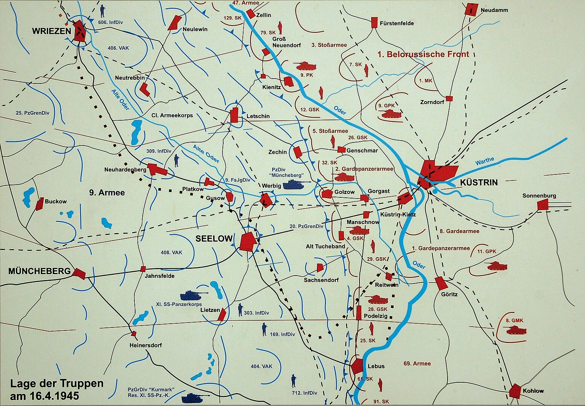
*Stan wojny w rejonie Wzgórz Seelow 16 kwietnia 1945 
By [de:User:Ralf Roletschek](https://de.wikipedia.org/wiki/User:Ralf_Roletschek) [Fahrradmonteur.de](http://www.fahrradmonteur.de) - Praca własna, [GFDL 1.2](http://www.gnu.org/licenses/old-licenses/fdl-1.2.html), [Link](https://commons.wikimedia.org/w/index.php?curid=8537596)*

Walki w Forst i forsowanie Nysy Łużyckiej w dniachh 16-17 kwietnia. [BÓJ O ZASIEKI (FORST) 1945](https://www.facebook.com/bobr1945/posts/3449419175171721).

### 1 Front Ukraiński

Jego konkurentem, rywalem i obiektem zazdrości był marszałek Koniew głównodowodzący 1 Frontu Ukraińskiego. Jego przygotowanie artyleryjskie było dłuższe, nie spieszył się tak bardzo i dokładnie przygotował atak. Nie używał reflektorów plot, zamiast tego położył zasłonę dymną na Nysie Łużyckiej, na dużo większym odcinku niż sam atak, nieprzyjaciel miał nie wiedzieć skąd atak nadejdzie. Ponadto zastosował trik znany z rozpoczęcia operacji wiślańsko-odrzańskiej. Artyleria po wstrzelaniu się pozostawiła w nawale ogniowej korytarze szerokie na 200 do 300 metrów, które zostały zbombardowane najpierw. Potem ogień przeniesiono w inne miejsca, tak żeby elita frontu jeszcze w trakcie nawały mogła wjechać prosto na niespodziewających się żołnierzy nieprzyjaciela.

Atak nastąpił w 150 miejscach na szerokości 90 km. Bezpośrednio po ataku będąc jeszcze pod ogniem nieprzyjaciela saperzy przystąpili do budowy przepraw dla pierwszego rzutu strategicznego. Udało się wedrzeć w niemiecką linię obrony i przełamać ją na szerokości 26 km i głębokości 16 km. Kontratak niemieckich sił pancernych został powstrzymany. Tu sytuacja była inna niż u Żukowa, Niemcy korzystając z geograficznej przewagi jaką dawała im przeszkoda rzeczna i tego, że wschodni brzeg Nysy Łużyckiej był płaski zaś zachodni stromy postanowili bronić się na Nysie. Choć więc oba fronty zdobyły porównywalną powierzchnię to Koniew miał przełamanie pierwszej linii obrony, przed sobą drugą słabszą linię i pokonał korpusy pancerne wroga, a Żukow utknął przed największą przeszkodą, obsadzoną najlepszym wojskiem jakie generał Heinrici miał do dyspozycji. Za nimi był już tylko Berlin. Ale będą walczyli do ostatniego żołnierza.

Pomimo oporu natarcie przebiegało zgodnie z planem. Jeszcze tego samego dnia sowieci doszli do Cottbus (Chociebuż) i 17 kwietnia zdobyli to miasto i jego okolice. Marzenie Koniewa spełniało się, znalazł własną autostradę do Berlina.

### 04-17

### Hitler

Państwo niemieckie już nie istniało. Tę przerażającą prawdę zrozumiał generał Heinrici na naradzie w bunkrze Hitlera. Kiedy zażądał wzmocnienia frontu odrzańskiego obecni tam funkcjonariusze zaczęli się licytować w liczbie żołnierzy, których mogą posłać na śmierć, jak pisze Cornelius Ryan:
>Zaofiarowali niewyszkolone, bez wyposażenia, niezdolne do walki oddziały z własnych prywatnych imperiów, płacąc życiem zamiast pieniędzy na tym swego rodzaju upiornym przetargu. Licytowali się nie po to żeby uratować Niemcy, ale żeby zrobić wrażenie na Hitlerze

Rzeczywiście, to co było niegdyś jednym z najpotężniejszych państw na świecie zniszczyła wojna, a resztki zostały rozdarte i zawłaszczone przez potężnych bonzów partyjnych mających własne służby, pałace pełne nakradzionych dóbr i przede wszystkim tak cenne w krytycznej chwili zasoby: łączność, transport i paliwo. Przestała działać poczta, z ulic zniknęła policja. Wciąż działały służby miejskie, banki i sklepy, ale to odbywało się już tylko siłą rozpędu. Żyły wciąż poszczególne komórki tego organizmu, ale zawłaszczone przez Partię państwo już od dawna nie było przez nikogo kierowane. Organy decyzyjne nie pełniły swoich funkcji. Najważniejsi ludzie w państwie potajemnie i w panice zaczęli realizować swoje sekretne przygotowywane od miesięcy plany ewakuacji, ratunku siebie, swoich rodzin i majątków.

### Operacja berlińska

Bunkier Hitlera był oderwaną od życia psychodeliczną Czerwoną Królową zajętą przemieszczaniem urojonych wojsk po wytartej od potu mapie. Urzędnicy niższego szczebla wciąż realizowali plany i procedury powstałe w zupełnie innej sytuacji. Z Berlina ewakuowano ministerstwa i zasoby państwowe, ale tylko jeżeli były jeszcze ciężarówki i było jeszcze do nich paliwo. Chaos zapanował w gabinetach Berlina, a od dziś zaczął władać berlińską ulicą. Piekło wojny dotarło do stolicy Rzeszy. Ofensywa poprzedniego dnia nie została usłyszana w Berlinie, było to za daleko i Berlin wtedy jeszcze spał. Ale bardzo dobrze została usłyszana w przygranicznych miasteczkach. Przerażeni funkcjonariusze Partii i urzędnicy zaczęli dzwonić do Berlina z prośbą o polecenia, posiłki, wsparcie. Pierwsze o ofensywie dowiedziały się berlińskie telefonistki z porannej zmiany - "*Zaczęło się!*" - i już za chwilę wiedzieli o tym wszyscy w mieście. "*Zaczęło się!*". O godzinie 8 rano podano przez radio:
>na froncie nad Odrą trwają ciężkie ataki rosyjskie

Ofiary, które otrzymał w bunkrze Hitlera generał Heinrici były bez znaczenia. To było tylko daremne poświęcenie ludzkiego życia. Dywizja spadochronowa Göringa, z której był tak dumny składała się z ludzi, którzy nigdy nie widzieli walki, służyli w kwatermistrzostwie. Spieszeni lotnicy i mechanicy nie wiedzieli nic o wojnie w okopach. Tysiące marynarzy miało walczyć bronią, której obsługi ich nie nauczono. Wielu z nich tej broni w ogóle nie dostało. Heinrici z wściekłością odmówił wzmocnienia swojej armii dziećmi z Hitlerjugend, ale kilkuset chłopców już było w okopach i rozjechały ich czołgi, bo nie dotarł do nich rozkaz że mają się wycofać do Berlina. Przestała działać łączność.

Mgła wojny i groza dni ostatnich jak przekleństwo rzucone przez Stalina napłynęły znad Odry. Na początku kwietnia odebrano generałowi Heinriciemu siedem niesłychanie cennych dywizji pancernych, wysyłając je na południe pod dowództwo feldmarszałka Schörnera "bo tam zostanie skierowany atak Iwana". W tej sytuacji on sam pozbawił wszystkich pojazdów bojowych dowódcę Grupy Armii Północ Manteuffla, teraz już generała wojsk pancernych bez jednego czołgu. Berlin błagał go o jakąkolwiek pomoc.

"*Czy nie widzicie, że robię wszystko żeby trzymać wojnę jak najdalej od Berlina?*" - Heinrici nie mógł wprowadzić swoich czołgów do miasta gdzie straciłyby wartość bojową, ale przede wszystkim nie mógł pozwolić by Berlin stał się drugim Stalingradem.
"*Nie spodziewajcie się nas*"" - wyjaśnił pułkownik Artur Hõlz, szef sztabu generała Bussego dowódcy niemieckiej Dziewiątej Armii - "*Dziewiąta Armia stoi i będzie stać nad Odrą, a gdy zajdzie potrzeba polegniemy tam, ale się nie cofniemy*".

I tak się stało. Heinrici dokładnie przewidział kiedy nastąpi atak Żukowa i wprowadził w życie plan opracowany na potrzeby operacji styczniowej przez generała Xylandera Schlittenfahrt (jazda saniami) polegający na wycofaniu się w momencie ataku na drugą, właściwą linię obrony. Xylander przewidywał natychmiastowy powrót na pierwszą linię, przynajmniej na niektórych odcinkach, ale Heinrici wiedział, że zostanie w całości zniszczona. Obronę ulokował tylko w jednym miejscu, na Wzgórzach Seelow. Udało mu się tam zatrzymać nacierające siły sowieckie. Jak relacjonował generał Popiel, marszałek Żukow dał wyraz swojej wściekłości "*w potoku szczególnie mocnych słów*" i rozkazał rzucić do walki trzymane w zapasie armie pancerne, które miały wejść do akcji dopiero po zdobyciu wzgórz oraz natychmiast zbombardować wzgórza czym się dało, miał do dyspozycji całą flotę bombowców i samolotów szturmowych.

Od rana trwało intensywne przygotowanie artyleryjskie. 800 samolotów bombardowało pozycje nieprzyjaciela. W zmasowanym ataku oddziały Armii Czerwonej przemieszały się, na wąskim odcinku nacierały 2 Armia Pancerna Gwardii i 5 Armia Uderzeniowa. Wszyscy wiedzieli, że Seelow jest ostatnią pozycją obrony na drodze do Berlina. Do zmroku czerwonoarmiści atakując fala za falą uzyskali przełamanie drugiej linii obrony, kosztem ogromnych strat w ludziach udało się wyrwać Niemcom kolejne 8 km terenu.

### 04-18

### Wzgórza Seelow

Jak pisze Ryan o bitwie na Wzgórzach Seelow:
>Z niektórych odcinków oficerowie meldowali, że przewaga liczebna nieprzyjaciela wynosi jak 10 do 1. "Idą na nas hurmem fala za falą, nie zważając na straty w ludziach - telefonował jeden z dowódców dywizji. - strzelamy z karabinów maszynowych na odległość strzału bezpośredniego dopóki lufy nie rozpalą się do czerwoności. Moi żołnierze walczą do ostatniego naboju. A potem zostają rozbici w proch i rozjechani. Nie wiem jak długo to może potrwać". Podobnie brzmiał każdy meldunek.

Już wczoraj z centum obrony w Seelow nieustanne naloty bombowców i samolotów szturmowych zrobiły miazgę. Miasto przestało istnieć. Ale pomimo lokalnych postępów (dziś też na północnym odcinku walk około 8 km) front utrzymywał się w odległości 10-15 km od obecnej polsko-niemieckiej granicy. Z grubsza rzecz biorąc wytyczała go droga krajowa 167 Seelow - Bad Freienwalde. Ale! Niewielki sukces na północy czyli zdobycie Wriezen utworzyło szansę na przełamanie linii obrony na tym odcinku, w istocie była to już trzecia i ostatnia linia i taka sytuacja groziła okrążeniem głównych sił 4 Armii Pancernej. Trzeci dzień relatywnie niewielkie siły niemieckie stawiały opór i choć raport dzienny z punktu widzenia Żukowa był niezadowalający, to w kategoriach strategicznych był przełomowy - to był ostatni dzień niemieckiego oporu, od jutra Niemcy zaczną się już wycofywać.

### 04-19

### Wzgórza Seelow

Koniec bitwy o Wzgórza Seelow. Droga do Berlina otwarta!

Po kolejnym dniu zaciekłych, krwawych walk do wieczora 19 kwietnia okolice miasteczka Seelow zostały zdobyte przez Armię Czerwoną. To była krwawa jatka, wszędzie leżały zwłoki poległych, płonęły pojazdy i budynki, sowieci wciąż byli ostrzeliwani przez artylerię i rozproszone oddziały niemieckie. W amoku walki oddziały sowieckie przemieszały się. Teraz potrzebowali kilku dni, żeby oczyścić teren z niedobitków, umocnić się, ale przede wszystkim przegrupować się i odzyskać porządek bitewny.

Żukow zwyciężył, ale było to zwycięstwo dalekie od oczekiwań. Co więcej dostał wiadomość, której obawiał się najbardziej. Jego konkurent, marszałek Iwan Koniew, wystrzelił pancerną strzałę w centrum dowodzenia w Zossen i w sam Berlin. Mogło być gorzej, podobno na wieść o problemach w Seelow Stalin rozważał zmianę głównodowodzącego Frontem. Bitwa zakończyła się sukcesem, ale straty i czas, który pochłonęła to była klęska. 1 Front Białuruski utracił ponad 30 tys zabitych, trzykrotnie więcej niż Niemcy.

Co gorsza, wprawdzie wszystkie trzy linie obrony, po kolei zostały przełamane i zniszczone, to siły niemieckie ciągle nie były rozbite. Wycofywali się zachowując łączność i porządek bitewny. Ponieśli ogromne straty, ale nadal było to niebezpieczne wojsko. Cała 9 Armia została rozcięta na trzy zgrupowania, lokalnie zdolne do kontrataku.

### Goebbels

Radio:
>Naród niemiecki musi wygrać tę próbę, inaczej zasłuży na bytowanie, którego powstydziłyby się najprymitywniejsze ludy Afryki. Bezgraniczna wierność dla Führera – oto co pokażemy wrogiemu światu. Można nas zranić, ale nie zabić, uderzyć do krwi, ale nie powalić.

### 1 Armia WP

1 Armia WP przełamała pozycje na Starej Odrze i zajęła wieś Neugaul (obecnie północna część miasta Wriezen przy drodze 167).

### 1 Front Ukraiński

Na Berlin zmierzała również pancerna elita 1 Frontu Ukraińskiego. 19 kwietnia byli już w Spreewaldzie na linii Lübbenau - Luckau. Jest to obszar śmiertelnie niebezpieczny dla sił pancernych, z mnogością przeszkód wodnych, zupełnie płaski i zalesiony. Jest niewiele dróg do wyboru. Do Berlina jest stamtąd już tylko dwadzieścia parę km. Wojska niemieckie były jednak w zupełnej defensywie. Gromadziły się przy głównych miejscowościach i drogi przez las były najczęściej bezpieczne.

### 2 Front Białoruski

Do 19 kwietnia 2. Front Białoruski opanował cały wschodni brzeg Odry na południe od Szczecina i utworzył przyczółki do ataku na zachód.

### 12 Armia niemiecka

Dwa tygodnie temu, 7 kwietnia przebywający na rehabilitacji w samym sercu rzekomej Twierdzy Narodowej, w Bechrtesgaden, generał Walther Wenck również otrzymał dziwny rozkaz. Wenck był szefem sztabu Guderiana i najmłodszym generałem Wehrmachtu, ale 13 lutego został poważnie ranny w wypadku samochodowym. Miał złamanych wiele żeber i wciąż nosił gipsowy gorset.

Otrzymał depeszę nakazującą mu natychmiast zadzwonić do kwatery głównej i kiedy to zrobił adiutant Hitlera generał Burgdorf rozkazał mu jak najszybciej stawić się w Berlinie, powiedział mu
>Hitler mianował pana dowódcą 12 Armii

Tego właśnie Wenck nie zrozumiał, nigdy nie słyszał o 12 Armii. Istotnie, taka armia jeszcze nie istniała. Kiedy Wenck był w drodze do Berlina była dopiero w stadium formowania. O tym, że został ostatnim obrońcą zachodniej rubieży Berlina generał Wenck dowiedział się na miejscu.

Historia 12 Armii jest kwintesencja ostatnich dni III Rzeszy. Coś co w zamierzeniu tyrana miało być zachodnim bastionem obrony Berlina, zostało ruchomym obozem uciekinierów zmierzającym do poddania się w niewolę. Wenck nie wykonał rozkazu, był dowódcą misji humanitarnej.

### Berlin

Berlin, już poważnie zniszczony licznymi bombardowaniami czekał los Wrocławia, miasta bronionego za wszelką cenę. Komendant miasta generał Reymann miał, wzorem Wrocławia i Królewca, zbudować lotnisko w centrum miasta - pomiędzy Bramą Brandenburską a Kolumną Zwycięstwa. Garnizon Twierdzy Berlin był przypadkową zbieraniną ludzi i sprzętu.

Reymann wielokrotnie domagał się przedstawienia planu ewakuacji ludności cywilnej i nieustannie otrzymywał zapewnienia, że takowy istnieje i zostanie wprowadzony w życie na rozkaz Goebbelsa. W końcu dotarł do tego planu, była to mapa w skali 1:300 000 z wyrysowanymi drogami ewakuacji, mieszkańcy Berlina mieli pieszo przebyć 20 do 30 km do najbliższych podmiejskich stacji kolejowych, gdzie miały na nich oczekiwać składy kolejowe. Nie przewidziano żadnych służb które miałyby tę ewakuację zorganizować, żadnych punktów sanitarnych, transportu dla chorych i słabych, nie przewidziano przede wszystkim skąd weźmie się te pociągi. Miała powtórzyć się sytuacja z Wrocławia. Podobnie jak Wrocław Berlin otoczony był przez trzy źle poprowadzone, istniejące fragmentarycznie i nieobsadzone linie obronne. Ale była jedna istotna różnica, o Wrocław walczyła trzeciorzędna, słaba 6 Armia, a na Berlin nacierała siła dwóch Frontów, całe wojsko jakie mógł rzucić do walki Stalin.

Podobnie jak Wrocław miasto oficjalnie zostało ogłoszone twierdzą, choć w rzeczywistości nie posiadało własnego garnizonu. Dotychczasowy przebieg wojny pozbawił społeczeństwo niemieckie rezerw mobilizacyjnych. Według ocen generała Reymanna do obrony Berlina potrzebny była załoga około 200 tysięcy przygotowanych do walki i dobrze uzbrojonych żołnierzy. Dysponował pewną trudną do ustalenia liczbą jednostek jeśli nie dobrze wyposażonych to przynajmniej zmotywowanych do walki, jak np. SS, ale większość załogi to było około 60 tysięcy pospiesznie zmobilizowanych i niewyszkolonych żołnierzy Volkssturmu. Formacja ta w ogóle nie podlegała dowództwu wojskowemu, była do dyspozycji Gauleitera i wojsko mogło im wydawać rozkazy dopiero w bezpośredniej strefie walki. Gauleiterem Berlina od początku aż do końca istnienia gau był zaś Joseph Goebbels, który nie miał czasu na takie drobnostki. Nie mieli mundurów, kuchni polowych, pojazdów ani własnej łączności. Niewiele ponad połowa w ogóle posiadała jakąś broń, a nawet ci którzy byli uzbrojeni nie zawsze wiedzieli jak się tą bronią posługiwać. Ich uzbrojenie było mieszaniną tego co się udało zebrać w magazynach i pochodziło z całej Europy. Jak to podliczył komendant posiadali co najmniej 15 typów karabinów i 10 typów karabinów maszynowych. Znalezienie do nich amunicji było koszmarnie trudnym zadaniem. W najlepszej sytuacji były bataliony wyposażone we włoskie karabiny - dysponowali 20 nabojami na żołnierza. W pierwszym dniu natarcia statystyczny Volkssturmista posiadał około 5 naboi. Później sytuacja się pogarszała.

Miasto opasane było kilkoma liniami umocnień:

- Pierwszy, najbardziej rozległy, istniał tylko częściowo, tam gdzie był pod bezpośrednim nadzorem armii. Nawet gdyby był ukończony nie miał szans odegrać żadnej roli - do obrony takiego obszaru Niemcy nie mieli już sił. Zgodnie z najlepszą tradycją propagandy sukcesu wystarczyło przygotować teren do umieszczenia stanowisk CKM, żeby zaznaczyć na mapie "silny punkt oporu".
- Trzy związane z miastem:
  - Zewnętrzny był prowizoryczną linią składającą się z przeszkód naturalnych, i w pośpiechu montowanych barykad, zapór, punktów ogniowych. Wszystko to konstruowano i montowano ręcznie, paliwo bowiem było zarezerwowane dla wojsk pancernych, zresztą maszyn już prawie nie było. Brakowało ludzi do budowy fortyfikacji, z planowanych 100 tysięcy udało się wysłać do pracy tylko 30 tysięcy. Nawet dla tej liczby brakowało łopat i prostych narzędzi. Prasa apelowała o kilofy i łopaty, ale jak to powiedział jeden z dowódców: "*berlińscy ogrodnicy najwyraźniej doszli do wniosku, że kopanie ich działek kartofli jest ważniejsze niż kopanie pułapek czołgowych*"
  - Środkowy - najlepszy z nich - zbudowany na bazie systemu kolejowego był prawdziwą przeszkodą, wymagał tylko obsadzenia załogą, wyposażenia w działa przeciwpancerne i zaminowania. Ale kto miał to zrobić skoro rozkazy wychodzące z bunkra Hitlera do jednostek polowych były jednoznaczne: pozostać na pozycjach, ani kroku w tył. Również dowódca Grupy Armii Wisła, generał Gotthard Heinrici, za wszelką cenę chciał uniknąć wprowadzenia swoich wojsk do miasta, a innych nie było.
  - Wewnętrzyny rejon umocnień, tzw Cytadela wytyczał kanał Landwehry i Szprewa, była to dzielnica rządowa.
  
Z różnych przyczyn żadna z tych linii umocnień nie odegrała żadnej roli w obronie Berlina, dwie zewnętrzne praktycznie nie istniały, środkowa nie została obsadzona, obrona wewnętrznej nie miała żadnego sensu, kiedy sowieci tam dotarli dowództwo już nie istniało.

Wiadomość o rozpoczętej ofensywie i sukcesach Armii Czerwonej wywołała zrozumiałą panikę. Komunikacja nie działała, więc ulice zaczęły się zapełniać uciekinierami, którzy już wkrótce utworzyli prawdziwe kolumny blokując i tak utrudniony ruch wojska. Podobnie jak we Wrocławiu nie wszyscy uciekali. Nie było już dokąd uciekać. Istniała grupa ludzi, która nie mogła opuścić miasta bez pozwolenia, elita urzędników i funkcjonariuszy partyjnych, państwowych, miejskich. Urząd komendanta zaczęły zasypywać prośby o takie pozwolenie uzasadniane często w sposób, który budził sarkastyczny śmiech. Szef sztabu komendanta wydawał je od ręki:
>Było coś niemal komicznego, jeśli chodzi o powody, jakimi funkcjonariusze partyjni i państwowi uzasadniali swe prośby o opuszczenie miasta. I chociaż Goebbels zarządził, że "żaden mężczyzna zdolny do noszenia broni nie może opuścić Berlina" nie robiliśmy trudności [...] Większość ludności pozostała. Nie mieli takich możliwości, a w każdym razie i tak nie było czym uciekać, brakowało środków transportu.

Korzystając z uprzywilejowanej pozycji i niedostępnych innym zasobów elity finansowe i polityczne, w tym wielu zagorzałych nazistów, uciekały jak tylko mogły daleko na zachód. Uciekali ludzie bogaci i wpływowi. Berlińczycy ironicznie nazwali to "ucieczką złotych bażantów".

### 04-20

### Bombardowanie Berlina

Amerykanie urządzili urodzinowe bombardowanie Berlina. I jednocześnie pożegnalne. Własnie oddali miasto Iwanowi, odtąd loty nad Berlin będą obciążone zbyt dużym ryzykiem starcia, którego nikt nie chce.

### Urodziny Hitlera

W artykule [Państwo hitlerowskie](/festung-breslau/article//panstwo-hitlerowskie) opisywałem rok ceremonialny hitlerowskiech Niemiec, rytualny patos partyjnych i państwowych świąt nasyconych treściami ideologicznymi. Do końca wojny będą jeszcze dwa takie święta: pierwszomajowe z oczywistych powodów nie zaistnieje. Natomiast dziś jest ostatnie, ostatnie, naprawdę ostatnie nazistowskie święto - urodziny Hitlera (niem. Führergeburtstag). Najhuczniej świętowane były 50 urodziny - 20 kwietnia 1939 z uroczystą paradą w Berlinie i fetą w całym państwie. Było to święto flag, składania życzeń Führerowi i deklaracji partyjnych oraz narodowych. w ten dzień chłopcy licznie zapisywali się do Hitlerjugend, a niemieckie rodziny dostawały dodatkowe racje wojenne.

Dziś są 56 urodziny Hitlera, nikt nie ma wątpliwości, że ostatnie. Od kilku lat dostęp do Hitlera jest ściśle regulowany, brak jest wystąpień publicznych. Wszyscy, którzy go widzieli po zamachu 20 lipca 1944 po kilkuletniej przerwie mówili to samo: od zwycięstwa we Francji do zamachu niebywale się postarzał. Sam zamach przeżył właściwie bez szwanku, ale fala uderzeniowa poczyniła szkody w jego organiźmie. Niezdrowy tryb życia, oddanie się felczerowi (Morell to był raczej dr Feelgood, niż prawdziwy lekarz) i niebywały wręcz stres wojenny odcisnęły swoje piętno. Hitler był 56-letnim wrakiem człowieka. Nie panował nad lewą reką, która cały czas drżała i dlatego trzymał ją sztywno przy ciele, skurczył się i zgarbił.

Dzisiaj propaganda usiłuje robić swoje, ale są to już frazesy w które nikt nie wierzy. Niemcy dostają przydziałową marmoladę i butelkę wina, ostatni gest III Rzeszy, ale to już jest koniec i nawet w bunkrze Hitlera nie ma co do tego złudzeń. Ostatnim podrygiem nadziei była śmierć Roosevelta. Ale trzy dni po tym jak ta nowina dotarła do bunkra zaatakował Iwan. Do bunkra napływały życzenia urodzinowe głównie od najważniejszych bonzów partyjnych ale także od Mussoliniego. Odbyła się skromna i ostatnia uroczystość na zewnątrz upamiętniona przez kamerę filmową. Jest to ostatni film z Hitlerem. Widać jak usiłuje ukryć trzęsącą się dłoń. Na tyłach Nowej Kancelarii Rzeszy znaleziono teren jeszcze nie zryty bombami i pod murem ustawiono wybranych przez szefa Hitlerjugend Arthura Axmanna kilkunastu gierojów nazistowskiego oporu, chłopców, którzy odznaczyli się zniszczeniem sowieckich czołgów. Najmłodszym z nich jest 12-letni wówczas Alfred Czech. Był tam też znany z Lubania 16-latek Wilhelm "Willi" Hübner. Obaj chłopcy przeżyli wojnę i umarli w latach 2010-11. Axmann pojmany w Lubece jako nazista dostał przysłowiowe trzy lata jak dla brata, nie został uznany za zbrodniarza wojennego i również dożył słusznych lat umierając dopiero w 1996. Hitler będzie żył jeszcze 10 dni.

Po rozdaniu Żelaznych Krzyży, zdawkowych życzeniach i uściśnięciu ręki Hitler ponownie schronił się w czeluściach bunkra, z których już nie wyszedł. W bunkrze zaś wieczorem odbyła się skromna, groteskowa uroczystość w niewielkim gronie najbardziej zaufanych osób zorganizowana przez Evę Braun. Szampan, muzyka i tańce. Do dziś nikt jeszcze nie znał odpowiedzi na pytanie czy Hitler planuje ucieczkę, czy pozostanie w bunkrze do końca.

Jutro przedostatnia szansa na ucieczkę.

- [The Bunker Boys - Hitler's Child Soldiers, Berlin 1945 "The Bunker Boys - Hitler's Child Soldiers, Berlin 1945" [YT 11:16]](https://www.youtube.com/watch?v=OqFhvKarYjU)

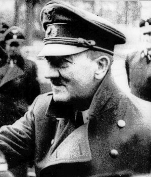
*Hitler na ostatnim filmie, 20 kwietnia 1945. 
By Source, [Fair use](https://en.wikipedia.org/wiki/File:Hitler_20_April_1945.jpg), [Link](https://en.wikipedia.org/w/index.php?curid=46200095)*

### Berlin

Z okazji urodzin Hitlera a murach Berlina pojawiły się okolicznościowe banery:
>Unsere Mauern Brachen, Aber Unsere Herzen Nicht

Zamknięto dopływ wody do berlińskiego ZOO.

### Samobójstwa hitlerowców

Hitlerowiec się zabija: Erwin Bumke prezes Sądu Najwyższego (niem. Reichsgericht) w Lipsku. Usłużny hitlerowcom prawnik wysokiej rangi. Gorliwie brał udział w dopasowaniu prawa do potrzeb NSDAP, np w związku z ustawami norymberskimi czy Akcją T4. W RFN dotknięty damnatio memoriae. Dwa dni po wkroczeniu Amerykanów do Lipska. Miał dwóch synów, obaj zginęli na wojnie.

Lipsk ma dobry rezultat, to już w sumie dziewiąte samobójstwo hitlerowskie z tego miasta znane z imienia i nazwiska.

### 1 Front Ukraiński

Wieczorem 20 kwietnia marszałek Iwan Koniew, dowódca 1 Frontu Ukraińskiego wpatrywał się w swój wymarzony cel. Teraz jeszcze na mapie. Już wkrótce będą tam jego ludzie. I on, marszałek Koniew w Berlinie. Deszcz orderów zaszczytów i między nimi wszystkimi ten najcenniejszy - triumf zdobywcy Berlina. Wszystko było gotowe. Zadzwonił do swojego najlepszego dowódcy:
>Pawle Siemionowiczu, nie martwcie się, nacierajcie dalej

Tymi słowami wystrzelił pancerną strzałę kierując swoją elitarną jednostkę na Zossen - siedzibę OKH czyli tzw Maybach I oraz OKW czyli Maybach II. Adresatem tych słów był generał Rybałko, dowódca 3 Gwardyjskiej Armii Pancernej znamy nam już z manewru, który zadecydował o rozstrzygnięciu bitwy o Górny Śląsk, gwałtownym nie dającym się przewidzieć manewrem z okolic Częstochowy uderzył na tyły niemieckiej 17 Armii, która znalazłszy się w krzyżowym ogniu, atakowana z obu stron musiała się wycofać. Ale wtedy ryzyko było niewielkie, choć zawrócenie i zmiana kierunku ataku o 90 stopni wymagała wielkich umiejętności i dyscypliny, operacja odbywała się w ramach nacierającego frontu.

Teraz zadaniem, które postawił marszałek Koniew przed 3 Armią Pancerną był marsz naprzód, nieprzerwany i bez zmiany kierunku. Ale wymagało to oderwania się od własnych sił, uderzenia na wrogim terenie o przewidywalnym kierunku i przede wszystkim operacji bez zabezpieczenia boków. Z rubieży na linii Lübbenau - Luckau do Zossen było ok 50 km, do Berlina następne 20 km. Na płaskim, zalesionym terenie z wątłą siecią dróg. Według zasad taktyki wojskowej, biorąc pod uwagę planowaną głębokość natarcia zadanie które postawił Koniew przed swoim pupilem było samobójcze. Ale jak to po latach napisał generał Rybałko
>Szliśmy z południa gdy za nami pozostawały jeszcze nie dobite dywizje niemieckie. Nie obawialiśmy się jednak o losy naszych komunikacji, ponieważ byliśmy pewni, że wyższe dowództwo podejmie niezbędne kroki w celu likwidacji tych niedobitków. Skrzydła i tyły były w ciągu całej operacji skutecznie osłonięte.

24 godziny później, wieczorem 21 kwietnia, po morderczym i rekordowym marszu na północ i pokonaniu ponad 50 km mając nieprzyjaciela z każdej strony generał Rybałko zameldował:
>Towarzyszu marszałku, walczymy na przedmieściach Zossen

Czołgi Koniewa były u wrót Berlina. Jeszcze tego dnia czołgi sowieckiej 3 Armii Pancernej zgłosiły pozycje 5 km od lotniska Shõnefeld co oznaczało zamknięcie niemieckiej 9 Armii w oblężeniu.

### 1 Front Białoruski

Marszałek Żukow zdopingowany jak nigdy dotąd nie czekał na uporządkowanie pobojowiska pod Seelow. Mniej zaangażowane w walkę jednostki ciągle zachowujące szyk bitewny wysforowały się naprzód, prosto w stronę Berlina. 5 Armia Uderzeniowa zdobyła Strausberg (w połowie drogi z Seelow do Berlina) i wieczorem zameldowała się z Atlandsberg oddzielonego od Berlina kilkoma km lasu. 2 Gwardyjska Armia Pancerna kierowała się bardziej na północ na Werneuchen żeby po dotarciu do Berliner Ring otaczać miasto od północy i północnego wschodu.

2 Front Białoruski nacierał z północy. Kierunki uderzeń Armii Czerwonej i ich dynamika nie pozostawiały złudzeń co do taktyki. 

Po bojach o Seelow celem nie jest zniszczenie wojsk niemieckich, ale jak najszybsze dotarcie do Berlina. Sowieci ufali w swoją kilkukrotną przewagę, w to że w przeciwieństwie do Niemców mieli zaplecze. Pozostawiali rozdzielone trzymające się większych miejscowości zgrupowania niemieckie i parli na Berlin.

### 04-21

### Nalot na Berlin

Już tylko dwa tygodnie do pokonania hitlerowskich Niemiec. W nocy z 20 na 21 kwietnia ostatni nalot RAF - 78 bombowców Mosquito - oznaczało to oddanie miasta sowietom. Jeszcze tylko rano przylecą Brytyjczycy i od tej pory ani brytyjskie ani amerykańskie samoloty nie pojawiały się nad Berlinem.

W ostatnich dniach już dochodziło do incydentów. Ike uznał, że to zbędne ryzyko. Niebo nad Berlinem przejęły samoloty z czerwonymi gwiazdami. Armia Czerwona wkroczyła do Berlina naraz z trzech kierunków.

### Berlin

Berlin już wczoraj 20 kwietnia stał się oficjalnie linią frontu, takie było znaczenie operacji Clausewitz rozpoczętej na rozkaz Hitlera, czyli zupełnej ewakuacji instytucji wojskowych i SS w mieście.

Obronę miasta powierzono generałowi Helmuthowi Weidlingowi, który miał do dyspozycji z różnych dywizji Wehrmachtu i SS łącznie 45 tys żołnierzy. Dołączono do nich policję, Hitlerjugend, oraz 40 tys Volkssturmu. Garnizon ten przedstawiał się gorzej niż wrocławski. Weidling podzielił miasto na osiem sektorów oznaczonych literami od A do H (Adolf Hitler w każdym calu?), na czele każdego postawił pułkownika lub generała, większość z nich nie miała doświadczenia bojowego.

- XX DP na zachodzie
- IX dywizja Spadochronowa na północy
- Dywizja Pancerna Müncheberg północny wschód
- XI Dywizja Grenadierów Pancernych SS Nordland południowy wschód aż do lotniska Tempelhof

Rrezerwa to 18 Dywizja Grenadierów w centrum. Dodatkowo pod dowództwem SS-Brigadeführera Wilhelma Mohnke LSSAH dla dzielnicy rządowej.

Ale zaraz, przecież dwa dni temu pisałem, że komendantem miasta jest generał Reymann, skąd tu nagle Weidling?

- Helmuth Reymann był komendantem obrony Berlina od 6 marca
- 19 kwietnia został zastąpiony na tym stanowisku przez pułkownika Ernsta Kaethera, który specjalnie na tę okazję dostał awans generalski (przypadek Ahlfena).
- Kaether nie zdążył objąć stanowiska, bo jeszcze tego samego dnia Hitler wycofał tę decyzję i nominację i w swoim najlepszym stylu sam wyznaczył się na dowódcę obrony Berlina, mianując swoim zastępcą również promowanego na tę okoliczność generałem Ericha Bärenfängera.
- 23 kwietnia nagle dowódcą obrony miasta zostanie generał Weidling, który jeszcze kilka godzin wcześniej był skazany na śmierć. Nieoczekiwany awans.

Od 20 kwietnia Weidling jest dowódcą LVI Korpusu Pancernego. Już wkrótce za niewykonanie rozkazu zostanie skazany na śmierć. Ale w akcie zdumiewającej odwagi Weidling zamiast po prostu walczyć jakby nigdy nic i mieć nadzieję, że egzekucja nie dojdzie do skutku, zameldował się w bunkrze Hitlera i wyjaśnił, że zaszło nieporozumienie. Zdumiony tym Hitler, pod wrażeniem postawy generała mianował go komendantem miasta. Na tym stanowisku Weidling pozostanie już do końca, to on podda garnizon.

2 Gwardyjska Armia Pancerna razem z 3 i 5 Armią Uderzeniowa przerwały słabą na swoim odcinku obronę i przedarły się przez Berliner Ring z kierunku północno-wschodniego. Byli pierwszymi czerwonoarmistami w Berlinie.

1 Gwardyjska Armia Pancerna i 8 Gwardyjska Armia nacierały dokładnie od wschodu na Erkner.

2 Gwardyjska Armia Pancerna zdobyła Werneuchen zmierzając od okrążenia Berlina od północy.

### Berlin na linii frontu

Berlin był miastem z oczywistych powodów bombardowanym od dawna i z upodobaniem. Od czterech miesięcy bombardowania przeprowadzane były według precyzyjnego schematu: Anglicy bombardowali miasto w nocy, Amerykanie pojawiali się punktualnie po 9.00. Dlatego berlińczycy tak się spieszyli z porannymi zakupami i w drodze do pracy. Nikt o tej porze, niezależnie od utrudnień komunikacyjnych, nie chciał znaleźć się na ulicy. Pomimo ogromu zniszczeń jakoś dawało się z tym żyć, można było przewidzieć porę, a czasem nawet obszar który zostanie zbombardowany.

28 marca, dokładnie w dniu kiedy aresztowanych zostało 16 przedstawicieli władz polskiego państwa podziemnego, nastąpił niespodziewany, pierwszy atak lotnictwa sowieckiego na Berlin. Inny niż dotychczasowe, nagły i wywołujący panikę. Myśliwce i samoloty szturmowe ostrzeliwały miasto z broni pokładowej. Od tej pory atakowali go regularnie.

21 kwietnia dokładnie o godzinie 11.30 berlińczycy po raz pierwszy usłyszeli ten charakterystyczny, świdrujący, pochodzący jakby z innego świata dźwięk. Gwałtownie zmieniał wysokość, zamienił się w gwizd i wtedy eksplozja rozerwała się na ulicy pełnej ludzi czekających w kolejce. Strzępy ciał, bryzgająca krew, nieludzkie wrzaski umierających i przerażonych ludzi. Po chwili to samo, znów ten dziwny dźwięk i znów eksplozja. To Armia Czerwona dostarczyła spóźniony prezent na urodziny Hitlera - Berlin znalazł się w zasięgu sowieckiej artylerii. Zaledwie kilka godzin wcześniej kończył się rozpoczęty zgodnie z harmonogramem o godzinie 9.25 amerykański nalot. Był to ostatni z 363 alianckich nalotów. Od dziś Berlin jest w wyłącznym, sowieckim władaniu.

Ostrzał artyleryjski to było coś zupełnie nowego. Nieprzewidywalny, morderczy, nieprzerwany. Dokładnie tak samo jak we Wrocławiu od tej pory w Berlinie ludzie zamieszkali na stałe w piwnicach. Tłumy zaczęły gromadzić się w metrze. Według niektórych źródeł już 20 kwietnia sowieci ostrzeliwali centrum Berlina artylerią, ale wieczorem 20 kwietnia dotarli do Atlandsberg - 20 km od Mitte. Natomiast dziś mogli rozładować artylerię w Marzahn - dzielnicy Berlina słynącej z blokowiska, nazistów i chuliganów, wtedy natomiast to były berlińskie dzikie pola a do Mitte było 10 km.

Wczorajsze urodziny Hitlera po raz pierwszy od dwunastu lat odbyły się bez pompy partyjno-państwowej, nawet w bunkrze Hitlera zapanował nieład. Od rana przyjmował życzenia od ludzi, którzy należeli do ścisłego grona współpracowników. Później wyszedł na zewnątrz na "przegląd wojsk", przed bunkrem była zebrana grupka SS-manów i chłopców z Hitlerjugend. Przedstawiał straszny widok, nic nie zostało z człowieka, który jak sprężyna podskakiwał pod wieżą Eiffla. Zgarbiony, bez sił, z trudem ukrywając trzęsącą się lewą dłoń przeszedł przed krótkim szeregiem żołnierzy, zamienił kilka słów i wrócił do bunkra na naradę wojenną. Było to ostatnie publiczne pojawienie się Hitlera. Następne 10 dni aż do śmierci spędził pod ziemią.

### Seraglio / Seraj

Przedostatnia okazja na ucieczkę z Berlina. Na lotnisku Schönwalde czeka ogromny Junkers Ju 290, na liście 23 pasażerów dzisiejszego lotu... Adolf Hitler i Eva Braun, poza tym Goebbels z żoną i dziećmi, Heinrich "Gestapo" Muller, Hermann Fegelein, Burgdorf i inni. Ale lot się nie odbył. Samolot czekał. Dowódca samolotu kapitan Braun 2 maja, zwolniony z zadania samą śmiercią Hitlera, poleciał do Hradec Králové, który wciąż był w rękach niemieckich. Kiedy wojna się skończyła zabrał na pokład 70 kobiet i dzieci i odleciał do Monachium.

Trwa operacja Seraglio, ucieczka ostatniej szansy dla najważniejszych ludzi III Rzeszy, trzeba wywieżć najważniejsze dokumenty, co się da ukryć a resztę zniszczyć. Berlin jest pułapką. Już jest albo za chwilę zostanie otoczony przez sowietów. Sytuacja jest dynamiczna i zmienia się z minuty na minutę, zawsze na gorszą.

Tego dnia samolot z Hitlerem nie startuje. Decyduje się pozostać w Berlinie. Wszystkie wymienione przeze mnie powyżej osoby w ciągu 10 dni zostaną zabite lub popełnią samobójstwo. Nieznany jest los Mullera. Ale o tym później.

21 kwietnia startują inne samoloty. Dwa Ju 350 zabierają na południe do bezpiecznej wciąż Bawarii ludzi i ładunek. Jeden z nich dociera bezpiecznie do celu. Drugi, którego pilotem jest major Friedrich-Anton Gundlfinger zostaje zestrzelony w Saksonii i o 6 rano rozbija się w Börnersdorf tuż przy granicy czeskiej. I tu zaczyna się historia, która da początek wielu teoriom spiskowym. Ju 350 to była oszczędnościowa konstrukcja okresu końca wojny, to samo co Ju 250 tylko z drewnianymi skrzydłami i kadłubem. Przy lądowaniu kapotował i się roztrzaskał, ocalał tylko jeden człowiek. Pierwsi przy wraku byli robotnicy przymusowi. Potem pojawiła się policja. Nie wiadomo co się stało z najważniejszą częścią ładunku - 10 metalowymi, ocynkowanymi skrzyniami. Nie wiadomo też co w nich było.

Dla przykładu - afera z rzekomymi pamiętnikami Hitlera. Konrad Kujau, oszust który sprzedał je Sternowi za 9 mln DM, twierdził, że były właśnie w tych skrzyniach, potem weszły w posiadanie STASI, a on jest tylko pośrednikiem.

- [Mark Felton Productions "Hitler's Lost Secret Documents - MILLION SUBSCRIBER SPECIAL" [YT 23:03]](https://www.youtube.com/watch?v=i65GDSXy9H4)
- [Gundlfinger, Friedrich-Anton](https://www.tracesofwar.com/persons/23443/Gundlfinger-Friedrich-Anton.htm)

### 1 Front Ukraiński

3 Gwardyjska Armia Pancerna generała Rybałki zameldowała się z Zossen. Oba sztaby były puste, opuszczone w panice. Dotarli do Königs Wusterhausen 5 km od lotniska Schönefeld - nie miało ono obecnego znaczenia, wtedy było to pozbawione większego znaczenia, istniejące od 11 lat lotnisko fabryczne Henschela. Dopiero w latach 50 zostało ze względu na położenie głównym lotniskiem międzynarodowym NRD. Wynikało to z umów międzynarodowych ograniczających ruch lotniczy tylko dla linii lotniczych krajów okupacyjnych, cały personel latający musiał mieć paszporty tych krajów. Schönefeld leżało wówczas poza Berlinem, więc mogły go używać enerdowskie linie lotnicze. Do dziś jego specjalizacją jest Europa wschodnia i południowa. W sąsiedztwie trwa nieszczęsna budowa nowego lotniska Brandenburg, które miało zastąpić wszystkie obecne berlińskie lotniska. No cóż inwestycja w atmosferze skandalu, oskarżeń, procesów sadowych i niedających się skompletować odbiorów trwa w najlepsze.

### Kummersdorf Gut

Innym niebywale ważnym wojskowym obiekcie zdobytym 21 kwietnia przez Armię Czerwoną był Kummersdorf Gut (istotne rozróżnienie, bo sam Kummersdorf znajduje się 40 km na SE).

W 1871 pruski minister wojny zadecydował o przeniesieniu testowego poligonu artyleryjskiego z Tegel do Kummersdorf Gut, udało się to zrealizować cztery lata później kiedy dotarła tam linia kolejowa. Cały teren miał prawie 900 ha. W okresie Wielkiej Wojny sprawdzano tam skutki bombardowań. Kiedy w 1935 powstał Wehrmacht cały obiekt pod nazwą Heeresversuchsanstalt Kummersdorf aż do 1945 miał jedno, główne przeznaczenie: prace nad nowymi czołgami, to właśnie tam powstały wszystkie czołgi z serii Panzer od od I do VIII, tak ten słynny Maus (Panzer VIII Maus) ważący niemal 200 ton i mogący rozwinąć w terenie oszałamiającą prędkość 13 km/h był również zbudowany w Kummersdorf. To właśnie stamtąd kadłub i wieżę (niepasującą) zabrali sowieci do Kubinki.

W latach 1935-37 był tam również poligon rakietowy, później przeniesiono go do Peenemünde na wyspie Uznam.

Była tam również cała masa czołgów zdobycznych i innych prototypów. Część generał Heinrici kazał wysłać do obrony w okolice Szczecina, część wzięło udział w walce w rejonie Berlina i samym Berlinie.

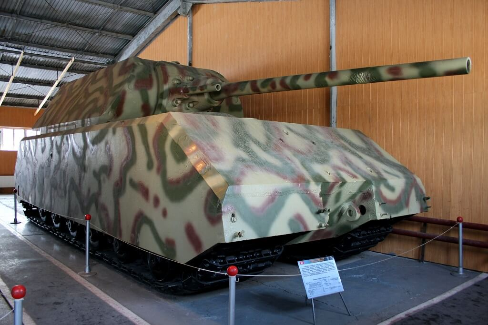
*Maus w muzeum w Kubince 
By [ru:User:Superewer](https://ru.wikipedia.org/wiki/User:Superewer) - [ru:Файл:Metro-maus1.jpg](https://ru.wikipedia.org/wiki/%D0%A4%D0%B0%D0%B9%D0%BB:Metro-maus1.jpg), Domena publiczna, [Link](https://commons.wikimedia.org/w/index.php?curid=6706951)*

### Polsko-sowiecki układ o przyjaźni

Natomiast przebywający jak zawsze na Kremlu Józef Stalin dodał dziś kolejne trofeum do kolekcji zwycięstw.

Pospiesznie i idąc na pewne ustępstwa (których jednak nie zamierzał przestrzegać) zorganizował podpisanie w Moskwie polsko-sowieckiego układu o przyjaźni, wzajemnej pomocy i współpracy powojennej. W delegacji polskiej był Bolesław Bierut, Edward Osóbka-Morawski i Władysław Gomułka. Układ podpisał ze strony Rządu Tymczasowego jego premier Osóbka-Morawski a ze strony sowieckiej osobiście Józef Stalin.

Gwarancje oprócz niezłomnej przyjaźni obejmowały nieingerowanie w wewnętrzne sprawy drugiego państwa. Ponieważ władze sowieckie uważały sprawy polskie za kwestię polityki wewnętrznej można mówić, że przynajmniej ze strony polskiej układ został dotrzymany. Rząd w niewielkim stopniu ingerował w politykę władz sowieckich na swoim terytorium, raczej starał się wyprzedzać jej życzenia.

Pośpiech w przygotowaniu i podpisaniu układu mógł wynikać ze śmierci Roosevelta i oczekiwania rychłego upadku Niemiec. Rzeczywiście Truman był zwolennikiem ostrzejszego kursu wobec sowietów i skrytykował niedopuszczenie do układów polityków związanych z rządem na emigracji.

### Żołnierze wyklęci

Przyczynek do dziejów tzw Żołnierzy Wyklętych. We wsi Brzostówka rozstrzelali trzech członków PPR i spaloli bramę triumfalną postawioną w lipcu 1944 na cześć Armii Czerwonej. Akcją dowodził kapitan Zdzisław Broński "Uskok".

### 2 Armia WP

Tego dnia rozpoczął się również ostatni i tragiczny rozdział w wojennej historii 2 Armii LWP. Ścieżkę bojową rozpocząć miała operacja na Wale Pomorskim, 2 Armia była tyłową zaporą, do której walki nie doszły. Później - jak pamiętamy - została skierowana w rejon Trzebnicy, skąd miała przypuścić atak na Wrocław. Ale w ostatniej chwili otrzymali nowe rozkazy, bo Stalin nakazał obu czołowym Frontom przypuścić natychmiastowy atak na Berlin. Dlatego 2 Armia, cały czas pieszo, nocnymi marszami w kilka dni udała się na nowy rejon ześrodkowania na wschód i północ od Zgorzelca.

Tam po raz pierwszy wzięli udział w walkach. Po przełamaniu obrony zostali skierowani na Drezno. Podstawowym zadaniem Armii działającej w ramach operacji łużyckiej była podobnie jak w przypadku operacji na Wale Pomorskim osłona, ale tym razem nie zaplecza tylko lewej flanki głównych sił Frontu. Cele ofensywne były drugorzędne, podstawowym była ochrona 1 Frontu Ukraińskiego od południa gdzie znajdowało się największe i najbardziej niebezpieczne zgrupowanie sił niemieckich Grupa Armii Środek pod dowództwem znanego nam już marszałka Ferdinanda Schõrnera.

21 kwietnia siły 2 Armii rozciągnięte były od okolic Goerlitz aż na 50 km w kierunku zachodnim. Jej dowódca generał Karol "Walter" Świerczewski, politycznie zasłużony generał jeszcze z czasów wojny domowej w Hiszpanii, znany z alkoholizmu i niekompetentny dowódca, zlekceważył meldunki o nacierających siłach niemieckich. Nie miał żadnego doświadczenia w dowodzeniu związkami operacyjnymi większymi niż dywizja, a ostatnia dywizja którą dowodził została wybita do nogi (ocalało mniej niż 700 żołnierzy). Polacy mieli zdecydowaną przewagę liczebną, ale nie byli uformowani w szyk bitewny, piechota była pozbawiona osłony wojsk pancernych, przede wszystkim zaś w przeciwieństwie do Niemców nie mieli doświadczenia bojowego. Nacierały na nich jednostki przerzedzone wojną, ale zdeterminowane i doświadczone. Zaczęła się rzeź, znana jako bitwa pod Budziszynem. Dziś pierwszy akt tragedii, wojsko pozbawione porządku bitewnego jest atakowane przez nieprzyjaciela. Dowódca całkowicie to lekceważy i znajdującym się na przedzie jednostkom uderzeniowym (1 Korpus Pancerny i 3 dywizje piechoty) rozkazuje kontynuować marsz na wyznaczony cel.

- [History Hustle "The Battle of Bautzen (1945) – The Last German Victory of World War II" [YT 6:15]](https://www.youtube.com/watch?v=gopuA43oMd8)

### 04-22

### Kurt Dittmar

22 kwietnia z samego rana przez Łabę w okolicach Magdeburga przeprawiło się trzech żołnierzy Wehrmachtu w celu poddania się do niewoli. Był to rejon zatrzymanej na Łabie amerykańskiej 9 Armii.

Kiedy zaczęto ich przesłuchiwać okazało się, że jednym z nich jest generał porucznik Kurt Dittmar - oficer, który każdego dnia przez radio nadawał komunikaty z frontu i znany był jako "głos niemieckiego Wehrmachtu". Był cennym źródłem i chętnie mówił. Z miejsca zaczęto go pytać o rzeczy najważniejsze: co wie o Twierdzy Narodowej, jakie są tam siły, jak wygląda przygotowanie do obrony i czy jest tam Hitler.

Był bardzo zaskoczony tymi pytaniami. Jaka Twierdza Narodowa? Pytający byli uparci i nie od razu zaakceptowali wyjaśnienie Dittmara, że ta tak zwana Twierdza Narodowa jest mrzonką, nie istnieje, samo pojęcie zna, ale tylko raz o tym przeczytał w jakiejś szwajcarskiej gazecie.

Hitler natomiast - wyjaśniał Dittmar - jest w Berlinie, cały czas tam był i jest zdecydowany pozostać, zginie lub popełni samobójstwo, ale nigdzie nie zamierza uciekać. Obie te wiadomości były dla aliantów kompletnym zaskoczeniem, trudno powiedzieć która większym.

Z pewnością wiadomość, że w Berlinie jest Hitler była zaskoczeniem niezwykle gorzkim. Właśnie wjechały tam sowieckie czołgi.

### Berlin

Przede wszystkim kiedy mowa o Berlinie musimy sobie uświadomić jedną rzecz - ustawa o Wielkim Berlinie z 1920 powiększyła go dziesięciokrotnie i stolica Niemiec z relatywnie niewielkiego miasta pośrodku miejsko-wiejskiej aglomeracji administracyjnie urosła do molocha trzykrotnie większego od obecnego Wrocławia i prawie dwukrotnie większego od takich stolic jak obecne Warszawa czy Praga. Berlin ma prawie 900 km2. Otacza go Berliner Ring, zewnętrzna obwodnica autostradowa, częściowo zbudowana w 1936 w ramach RAB (niem. Reichsautobahn) Fritza Todta, nosiła wtedy oznaczenie RAB 7. W latach 70 NRD dokończył tę inwestycję od zachodu i północy, obecnie jest to BAB 10.

Wewnątrz jest ogromny obszar o bardzo zróżnicowanej historii i charakterystyce, z dużą ilością lasów, labiryntem cieków wodnych i całkowicie płaski. Zabudowa co do zasady jest niewysoka. Najwyższą wówczas budowlą była wieża radiowa Funkturm 147 m na terenach wystawowych. Najwyższym budynkiem Katedra, której kopuła wznosiła się wówczas na wysokość 116 m. Ale tam gdzie są kamienice są one wysokie. Tak więc nie ma żadnych wyraźnych punktów orientacyjnych, żadnych geograficznych wyróżników dla poszczególnych części Berlina. Dla obcej armii Berlin jest płaskim molochem pełnym pułapek i przeszkód.

Berlin jest niejednorodny w nieprzewidywalny sposób, wynika to z tego, że ustawa o Wielkim Berlinie połączyła kilkadziesiąt wsi i 8 miast, niektóre z nich (np. Köpenick) były starsze od Berlina, wszystkie miały własną strukturę urbanistyczną, rynki i ratusze. Otoczenie miasta natomiast to niewielkie miejscowości i wszędzie pełno lasów i przeszkód wodnych. Jest to idealna okolica dla zablokowania wojsk pancernych. Taki był pierwotny plan - wykorzystując znajomość terenu w rozproszony sposób blokować natarcie wszędzie gdzie się da. Hitler jednak, ten nieoceniony geniusz strategii, zadecydował inaczej. Berlin będzie cytadelą o jednolitej, potężnej linii obrony.

### "Upadek"

Dziś o 15.00 w bunkrze odbyła się słynna, najbardziej z filmu "Upadek" narada w bunkrze. Byli tam Bormann, Keitel, Jodl i Krebs.

O co chodziło? Felix Steiner był dowódcą III. (germanische) SS-Panzerkorps, ale już na samym początku bitwy głównodowodzący Grupą Armii Wisła generał Heinrici pozbawił tę jednostkę najważniejszych oddziałów m in dywizji SS Nordland, wykrwawionej później w bojach o Wzgórza Seelow, jej resztki broniły potem Berlina. Steinerowi pozostało kilka batalionów i niewielka liczba czołgów. Steiner otrzymał rozkaz zebrania wszystkich sił jakie są do dyspozycji, wszystkiego co napotka i utworzenia grupy bojowej Steinera (niem. Armeeabteilung Steiner) i trzymania pozycji na Kanale Finow. Jest to jedna z najstarszych sztucznych dróg wodnych w Europie, został zbudowany w 1605 i łączy Odrę z Hawelą na wysokości Cedyni. Zaczyna się w Liepe a kończy w Liebenwalde. Jak widać jest to pozycja dalekiej północnej flanki przedpola Berlina. Po wszystkich niepowodzeniach i klęskach jakie wydarzyły się na froncie to zgrupowanie o nazwie, z której nijak nie wynika rzeczywista wielkość urosło w umyśle Hitlera do gigantycznej siły bojowej i dostało misję zmiażdżenia sowieckiego ataku, który po bitwie na Wzgórzach Seelow zmierzał do okrążenia miasta od północy. Steiner miał spaść na nich z północy i zniszczyć, a potem łącząc się z IX Armią atakująca od południa doprowadzić do rozbicia zgrupowania sowieckiego.

Tak to przedstawił na naradzie i wtedy pada ta słynna kwestia:
>"Mein Fuhrer, Steiner..." 
>"Steiner konnte nicht genügend Kräfte für einen Angriff massieren. Der Angriff Steiner ist nicht erfolgt

Słysząc to Hitler wpadł w furię i we wściekłej tyradzie oświadczył, że wojna jest przegrana i to z winy generałów, a on w Berlinie pozostanie do samego końca.

Po powrocie do prywatnej kwatery zadzwonił do Goebbelsa proponując by Goebbelsowie przenieśli się do bunkra, do jego starszej, gorzej chronionej części. Propozycja ta została przyjęta. Natychmiast przybyli do bunkra. Dostali się tunelem łączącym Ministerstwo Propagandy z Nową Kancelarią Rzeszy. Podczas rozmowy ustalili, że popełnią samobójstwo. Magda Goebbels dodała, że zabije przedtem własne dzieci, była na to zdecydowana choć Hitler oponował.

Potem o 19.00 wezwał do siebie Keitla i Jodla, oświadczył im że pozostaje w Berlinie i zabije się jeśli miasto wpadnie w ręce czerwonoarmistów. Potem przeszli do planowania dalszej walki i uzgodnili, że skoro 12 Armia nie jest zagrożona przez Amerykanów może wziąć udział w obronie Berlina. To, że Amerykanie zatrzymają się na Łabie wiadome było też dzięki przechwyceniu planów Eclipse (powojenne urządzenie Niemiec przez aliantów). Konferencja zakończyła się o 20.00.

Ok 23.00 w bunkrze po nominację na szefa Niemieckiego Czerwonego Krzyża przybył Obergruppenführer prof Karl Gebhardt, osobisty lekarz Himmlera. Zaoferował 600 osobowy batalion SS przydzielony natychmiast do "Cytadeli". Zaoferował pomoc w ewakuacji kobiet i dzieci. Hitler odpowiedział mu, że każdy kto przebywa w bunkrze robi to z własnej woli.

- [Shout! Factory "Downfall (2004) - Clip 1: Steiner's Attack" [YT 4:16]](https://www.youtube.com/watch?v=xBWmkwaTQ0k)
- [The Great War "That Downfall Scene Explained - What Is Hitler Freaking Out About? I 16 Days In Berlin" [YT ]](https://www.youtube.com/watch?v=3Uc4_ATDjoU)

### Pamiętniki Hitlera

Warto wspomnieć o wypadającej na dziś rocznicy jednego z największych skandali w dziejach prasy RFN, to właśnie 21 kwietnia 1983 "Stern" zapowiedział opublikowanie nieznanych, obszernych pamiętników Adolfa Hitlera z lat 1932-1945. Zakupione za 9,9 mln marek pamiętniki okazały się fałszerstwem.

### Ucieczki

Już 20 kwietnia Hitler ogłosił, że nie ucieka, pozostaje w Berlinie. Bunkier jest przerażającym miejscem. Jest duszno i odkąd nawaliła kanalizacja strasznie śmierdzi uryną. Od wczoraj nieustannie słychać ostrzał artyleryjski. Żadne miejsce na zewnątrz nie jest bezpieczne, więc od dawna wszyscy już siedzą w bunkrze.

Zaczynają się ucieczki. Ludzie, którzy nie są niezbędni do obrony zaczynają być odprawiani. Tego dnia 40 osób ze sztabu Kancelarii opuściło Berlin w samolotach lecących do Berchtesgaden.

- kamerdyner Hitlera Wilhelm Arndt lubiany przez wszystkich ze względu na wygląd (wysoki blondyn z niebieskimi oczyma), tego samego dnia wieczorem zginął lecąc do Bawarii zestrzelony nad Saksonią.
- Morell osobisty lekarz Hitlera.
- Julius Schaub, adiutant, któremu Hitler powierzył zadanie zniszczenia wszelkich rzeczy osobistych należących do niego, zrobił to w Nowej Kancelarii Rzeszy, dziś udał się z taką samą misją do Monachium, na końcu miał zniszczyć pociąg Hitlera.
- Odprawione zostały sekretarki Shroeder, Wolf i kilka innych osób.

### Reichsbank

Trzecia i ostatnia ewakuacja Banku Rzeszy.

SS-Standartenführer Josef Spacil, zbrodniarz wojenny i dowódca SD w Holandii, na rozkaz szefa RSHA Kaltenbrunnera dokonał dziś ze swoimi podkomendnymi napadu z bronią w ręku na Bank Rzeszy. Tak, większość (ponad 90%) złota wywieziono jeszcze 9 lutego do Merkers. Ten skarb w całości wpadł w ręce Amerykanów 4 kwietnia. 14 kwietnia wywieziono resztę w dwóch pociągach do bezpiecznej jak się wtedy wydawało Bawarii. Ale to nie oznacza, że Bank Rzeszy był pusty. Spacil nie przedstawiał żadnych dokumentów, grożąc bronią zmusił pracowników Banku Rzeszy do wydania pozostałych zasobów złota, kosztowności i obcej waluty. Był to trzeci i najbardziej tajemniczy transport ładunku Banku Rzeszy.

Spacil dotarł do samolotu czekającego na niego pod Berlinem i przez Pragę udał się do Salzburga, gdzie 4 maja spotkał się z gauleiterem Gustavem Scheelem. Wiedząc, że sowieci są w Wiedniu i Berchtesgaden niechybnie wpadnie w ręce wroga postanowili ukryć skarb w pobliżu. Jedna ze znanych lokalizacji to Rauris. W ciągu kilku następnych dni Spacil odbywa dość tajemnicze spotkania m in z SS Hauptsturmführerem Franzem Konradem i Otto Skorzenym. Szczególnie to drugie spotkanie jest ważne, wiąże się bowiem bezpośrednio z transferem całej fortuny na rzecz organizacji zajmującej się ewakuacją zbroniarzy hitlerowskich do Ameryki Południowej.

Spacil w przebraniu żołnierza Wehrmachtu poddał się do niewoli amerykanskiej, ale został rozpoznany. Dlatego częściowo wiemy co i gdzie ukrył. Ale jego misja do dziś skrywa wiele tajemnic.

9 listopada 1945 zeznawał na procesie norymberskim przeciwko swojemu przełożonemu Kaltenbunnerowi. Zmarł w 1967 w Monachium.

### Operacja berlińska - 1 Front Białoruski

Krebs przekazał Heinriciemu pozwolenie dla garnizonu Frankfurtu nad Odrą na wycofanie się i połaczenie z przygotowaną do obrony okrężnej 9 Armią generała Busego. Htler dorzucił do tego swoje rojenia o współdziałaniu z 12 Armią i głębokich kontratakach, ale w obecnej sytuacji celem przełamania linii mogło być tylko wyrwanie się z kotła, co zresztą wynikało z sugestii Heinriciego.

Grupa Steinera broniła pozycji w rejonie Oranienburga i Ruppiner Kanal.

9 Gwardyjski Korpus Pancerny i 125 Dywizja Strzelecka nacierały na linii Zepernick, Schönerlinde, Mühlenbeck, Schönfliess, Hohen Neuendorf i dotarły do mostu w Henningsdorf na Haweli.

Bardziej na północ 1 Armia WP zajęła rejon między Bernau bei Berlin i Biesenthal i nacierała wzdłuż Kanału w stronę Oranienburga - dotarła do przedmieścia Oranienburga i wyzwoliła KL Sachsenhausen.

Równolegle szło uderzenie 61 Armii na południe od Kanału.

8 Armia Gwardyjska i 1 Gwardyjska Armia Pancerna wdarły się na wschodnie przemieścia Berlina: Dahlwitz, Schöneiche bei Berlin (tu czasem osobno wymienia się Fichtenau) i Rahnsdorf.

### Operacja berlińska - 1 Front Ukraiński

5 Gwardyjski Korpus Zmechanizowany w sektorze 4 Gwardyjskiej Armii Pancernej utworzył osłonę na linii Beelitz, Treuenbrietzen, Kropstädt i został wzmocniony 13 Armią. 6 Zmechanizowany Korpus Gwardii dotarł do Beelitz a 10 Gwardyjski Korpus Pancerny przez Saarmund i Schenkenhorst (gdzie Armia ulokowała sztab) dotarł do przedpola Poczdamu i odciął drogę ucieczki przez Caputh i Babelsberg.

6 Gwardyjska Dywizja Strzelecka zdobyła Jüterbog.

3 Gwardyjska Armia Pancerna przekroczyła Notte Kanal w rejonie Zossen i wieczorem tego dnia elementy 6 i 7 Gwardyjskiego Korpusu Pancernego dotarły do Teltow Kanal w odpowiednio Teltow i Stahnsdorf. Po ich prawej stronie już o 9 rano 9 Korpus Zmechanizowany przekroczył linię autostrady i do zmroku wdarł się w przemieścia Lichtenrade, Marienfelde oraz Lankwitz.

### KL Sachsenhausen

2 Dywizja Piechoty 1 Armii Wojska Polskiego dotarła do obozu koncentracyjnego Sachsenhausen w Oranienburgu, położonym 30 km na północ od Berlina.

Sachsenhausen to było samo centrum hitlerowskiego systemu obozów koncentracyjnych i zagłady, tam właśnie mieściła się siedziba IKL (Inspektion der Konzentrationslager). W ciągu poprzednich dwóch dni SS wyprowadziło w Marszach Śmierci ponad 30 tysięcy więźniów.

Kiedy do obozu weszli Polacy, zastali tam jeszcze 3 tysiące ludzi.

W sierpniu NKWD na terenie dawnego obozu koncentracyjnego założyło swój własny - Obóz Specjalny nr 7 (Speziallager Nr. 7). Jednym z jego komendantów był Roman Rudenko główny prokurator strony sowieckiej podczas procesów norymberskich. W obozie NKWD trzymało nazistów, oficerów niemieckich, antykomunistów i ludzi, którymi z różnych względów się interesowali. Przez pięć lat istnienia obozu przewinęło się przez niego 60 tysięcy ludzi, z których 12 tysięcy umarło, głównie z chorób i niedożywienia. Za czasów hitlerowskich zginęło tam około 30 tysięcy ludzi, w większości żołnierzy Armii Czerwonej.

### 2 Armia WP

Tymczasem na południu, na odcinku Niesky - Bautzen rozegrała się tragedia 2 Armii WP. Pozbawiona wsparcia piechoty artyleria zmotoryzowana, piechota oddzielnie bez artylerii i elita uderzeniowa Armii daleko z przodu, wszystkie oddziały rozciągnięte w dużej odległości jak na spacerze były idealnym celem egzekucji. Zawiodła łączność, komenda, koordynacja. Armia nie miała żadnego doświadczenia bojowego. Do niewoli został pojmany Aleksander Waszkiewicz generał WP, Białorusin od 1919 w Armii Czerwonej, skierowany do WP we wrześniu 1944. od 22 września organizator i dowódca 5 DP. Schwytany w trakcie przebijania się na południe. Torturowany i zamordowany, ciało odnaleziono dopiero 4 maja.

Dopiero w południe pada spóźniony rozkaz zawrócenia spod Drezna 1 Korpusu Pancernego i 8 DP. 9 DP pozostała na miejscu. Do wieczora udało im się dotrzeć w okolice Budziszyna. Jatka trwa.

### 04-23

### Wstęp

Poprzedni dzień zakończył się na tym, że 1 Front Białoruski wdarł się do Berlina od wschodu aż do Dahlwitz i okrążał go od północy docierając do mostu w Henningsdorf. Natomiast 1 Front Ukraiński zablokował Poczdam od południa i wschodu i dotarł do Kanału Teltow i bardziej na wschód przekroczył linię autostrady. Miał przy tym wręcz niemożliwie rozciągnięty obszar działania, począwszy od nieszczesnej 6 Armii, która od ponad dwóch miesięcy nie mogła zdobyć Wrocławia, przez 2 Armię WP, która była właśnie masakrowana przez wojska marszałka Schörnera pod Budziszynem, przez całe Łużyce aż po przedmieścia Berlina.

Główne siły niemieckie to była 9 Armia generała Busego odparta właśnie od Odry, pobita na wzgórzach Seelow i okrążona na południowy-wschód od Berlina oraz cała reszta, którą na ostatnią chwilę udało się zebrać czyli 12 Armia Wencka rozciągnięta na obszarze od Poczdamu po Lipsk.

Wciąż istniała grupa bojowa Steinera w rejonie Oranienburga i resztki Grupy Armii Środek prowadzone przez Schörnera od południa w stronę Berlina. Bardziej na północ od Berlina walczyły resztki Grupy Armii Wisła generała Heinriciego.

Sztab OKW przeniesiono z Krampnitz do Neuroofen 60 km na północ od Berlina. Byął tam jedna z baz Himmlera na wciąż bezpiecznym zapleczu 3 Armii Pancernej.

Do Berlina został wysłany batalion Kriegsmarine "Großadmiral Dönitz" - byli to marynarze świeżo po kursie obsługi radarów i niemający żadnego pojęcia jak wygląda wojna lądowa.

Sytuacja zmieniała się zbyt dynamicznie by ktokolwiek mógł to kontrolować. Hitler, Jodl i Keilet wciąż roili o przegrupowaniach, kontratakach i rozbiciu sił sowieckich. Ale dowodzący jednostkami frontowymi generałowie Heinrici, Wenck i Buse widzieli już tylko jedyny możliwy kierunek działania: połączenie 9 i 12 Armii a potem skierowanie ich na Łabę do niewoli amerykańskiej. Nikt nie chciał walczyć o Berlin. To już nie miało sensu.

Obrońcy Berlina również byli tego świadomi. Dezercja osiągnęła rozmiary masowe, grupy żołnierzy ukrywały się, gorączkowo poszukiwano cywilnych ubrań. Reakcja była bezwględna, każdego nawet tylko podejrzanego o dezercję wieszano bez sądu. Zabijano również ich domniemanych pomocników. Na drogach postawiono posterunki składające się z żandarmerii, SS, policji i partii. Sprawdzały wszystkich. Nie wolno było uciec z Berlina. Ludność cywilna mogła się przemieszczać tylko w obrębie miata. Doszło do tego, że cywile nie udzielali pomocy rannym żołnierzom Wehrmachtu nie chcąc ściągnąć na siebie podejrzenia, że pomagają w dezercji.

Komunikacja miejska przestała działać. Ponieważ podejrzewano, że sowieci wykorzystają tunele metra żeby przedrzeć się do centrum, barykadowano je i wysadzano. Pod ziemią schronili się cywile.

W nocy LVI Korpus Pancerny przedostał się przez Szprewę i zatrzymał się w Rudow. Dowódca obrony Berlina generał Weindling ustanowił sztab w budynkach sztabu korpusu na Hohenzollerndamm. Z powodu postępów sowieckich już 25 kwietnia musiał przenieść sztab do jego ostatecznej siedziby w Bendlerblock (między Kanałem Landwehry a Tiergartenstrasse).

"*Hitler jest z wami! Berlińczycy, trzymacie się!*" - woła Radio Hamburg.

### 1 Front Białoruski

- 47 Armia, 9 Gwardyjski Korpus Pancerny 2 Gwardyjskiej Armii Pancernej i 7 Gwardyjski Korpus Kawaleryjski kontynuowały natarcie okrążające Berlin od północy i po przekroczeniu Haweli w Henningsdorf do zmroku dotarły do Nauen, które jest już na zachód od Berlina.
- 1 Korpus Zmechanizowany (2 Gwardyjska Armia Pancerna) atakował od północy na linii Hermsdorf, Waidmannlust, Wittenau.
- bezpośrednio na wschód od niego 12 Gwardyjski Korpus Pancerny - Blankenfelde, Lübars, Rosenthal
- 79 Korpus Strzelecki 3 Armii Uderzeniowej - Niederschönhausen
- 7 Korpus Strzelecki - Hochenschönhausen
- 5 Armia Uderzeniowa - Biesdorf i Kaulsdorf
- 9 Korpus Strzelecki - Karlhorst i elektrownia Rummelsburg
- 4 Gwardyjski Korpus Strzelecki (8 Armia Gwardyjska) zajął tereny przemysłowe w Oberschöneweide i przygotowywał się do przekroczenia Szprewy w Johannisthal.
- 29 Gwardyjski Korpus Strzelecki zdobył most na Szprewie w Alderhof oraz Köpenick z mostami przez Szprewę i Dahme
- 125 Korpus Strzelecki nacierał na Spandau i Gatow gdzie znajowało się lotnisko. Wobec zagrożenia jakie stanowił ten atak dla poligonu Döberitz (niem. Truppenübungsplatz Döberitz aka Heeresschule Döberitz) wysadzono znajdujące się tam ogromne składy amunicji, nie było już możliwości przewiezienia ich do miasta.
- 8 Gwardyjska Armia legendarnego obrońcy Stalingradu generała Wasilija Czujkowa oraz 1 Gwardyjska Armia Pancerna atakowały od południowego wschodu, po przekroczeniu Szprewy i Dahme na południe od Kopenick, wzdłuż linii komunikacyjnych zdobyły Johannisthal i nacierały w kierunku centrum miasta na Britz i Neukolln.
- Od wschodu atakowała Berlin 5 Armia Uderzeniowa na Lichtenberg i Treptow.
- 3 Armia Uderzeniowa od północnego wschodu na Pankow i Wedding.
- 5 Gwardyjska Armia i 13 Armia zbliżały się do Łaby, pierwsza z nich w rejonie Torgau, a druga Wittenbergi.

### 1 Front Ukraiński

3 Gwardyjska Armia Pancerna generała Rybałki przekazała Zossen oddziałom tyłowym i nacierała już na terenie miasta na Kanał Teltow, który był dla nich poważną przeszkodą. Szeroki, z wysokimi betonowymi brzegami. Od północnej strony umocnione magazyny. Co gorsza Volkssturm został tu wzmocniony elementami 18 i 20 Dywizji Grenadierów Pancernych.

Wsparcie się spóźniało, długo oczekiwali na wsparcie 28 Armii, dotarli do Mariendorf, 4 km na południe od Tempelhof.

Do wieczora dotarła piechota i artyleria w sile 3 tys luf. Takiej koncentracji ognia na tak niewielkim, w sumie liczącym 5 km odcinku nie było nawet przy przekraczaniu Nysy Łużyckiej.

4 Gwardyjska Armia Pancerna nacierała na Poczdam.

3 Gwardyjska Armia oraz 4 Gwardyjski Korpus Pancerny zostały przesunięte do rezerwy jeśli trzeba będzie powstrzymać niemiecki kontratak na Spremberg, który rozdzielił 52 Armię i 2 Armię WP. Sytuacja w Górnych Łużycach stawała się coraz bardziej problematyczna w skali całego frontu. 

### Linia frontu w Berlinie

Siły niemieckie bez chwili przerwy znajdujące się pod atakiem, wobec miażdżącej przewagi Armii Czerwonej były pozbawione inicjatywy taktycznej i trwale zepchnięte do defensywy.

23 kwietnia berlińska linia frontu biegła Kanałem Teltow i dalej Szprewą, a potem na północ biegiem drogi B 96 aż do zetknięcia się z Schifffahrtskanal (BSK) do Jeziora Tegel i Hawelą na południe.

Tego dnia osobisty rozkaz Stalina (nr 11074) wyznaczył linię rozgraniczającą ten zdumiewający wyścig do flagi jaki prowadzili konkurujący ze sobą sowieccy marszałkowie: Lubben, Teuplitz, Mittewalde i tu wchodziła do Berlina na Mariendorf i tu lekko skręcała na północ do Dworca Anhalckiego (Berlin Anhalter Bahnhof). Marszałek Koniew patrzył na to rozgraniczenie z desperacją. Flagą do której się ścigali był oczywiście budynek Reichstagu leżący dokładnie półtora kilometra na północ od Dworca Anhalckiego, więc chociaż rozgraniczenie nie rozstrzygało definitywnie kto jest bliżej, ale sama konfiguracja sił mówiła mu, że decydujące zwycięstwo tej wojny właśnie wymknęło mu się z rąk. Żukow nacierał zewsząd, z północy, od wschodu i południowego wschodu, właśnie na tym ostatnim kierunku szło główne uderzenie. Nietrudno było zauważyć, że Czujkow najlepszy człowiek Żukowa specjalnie został umieszczony przy linii rozdzielającej, żeby wojska Koniewa "przypadkiem" nie wdarły się na jego teren znajdując szybszą drogę do Reichstagu.

### Hitler

Ani marszałek Koniew, ani marszałek Żukow nie wiedzieli, że prawdziwy cel znajduje się w połowie drogi z Dworca Anhalckiego do Reichstagu, w sąsiedztwie Kancelarii Rzeszy, gdzie w dziurze w ziemi chroniony przez żelbet i resztkę wiernych sobie ludzi umierał feldfebel Adolf Hitler.

Teraz już tylko umierał, bo podczas wczorajszej odprawy wpadł w furię, kompletnie stracił panowanie nad sobą, a na końcu załamał się i po raz pierwszy przyznał, że wojna jest przegrana. Generał Weidling, który przyszedł złożyć raport opisuje go tak:
>Zobaczyłem nalaną twarz z rozgorączkowanymi oczami. Kiedy usiłował wstać, zauważyłem ku swemu przerażeniu, że trzęsą mu się ręce i nogi. Wreszcie z wielkim trudem udało mu się podnieść. [...] jego lewa noga chodziła jak wahadło zegara tylko szybciej

Wkrótce Weidling kilka godzin wcześniej zaocznie skazany na śmierć został kolejnym komendantem obrony Berlina. Wyrok został wydany bo jego 56 Korpus utracił łączność i panowało przekonanie, że zdezerterował, podobno korpus był widziany na zachód od Berlina. Generał Reymann został wcześniej odwołany ku swojemu zaskoczeniu osobiście przez Hitlera, na jego miejsce powołano człowieka który cały dzień dzwonił do znajomych opowiadając o tym jaki zaszczyt go spotkał, ale i jego Hitler odwołał sam stając na czele garnizonu stolicy. Później i z tego zrezygnował.

Zmiany te obrazują styl dowodzenia Führera, który wprawiał doświadczonych oficerów w zdumienie i wściekłość. Wbrew wszelkim sugestiom kazał bronić każdej pozycji za wszelką cenę, tracąc w systemie twierdz poważną ilość związków bojowych. Jedną z tych twierdz był Wrocław.

Kiedy sztabowcy wskazywali na zagrożenie ze wschodu krzyczał, że to papierowa armia, komunistyczna propaganda, a za klęski na wschodzie odpowiadają zdrajcy, że ofensywa Armii Czerwonej musi się załamać. Nie załamała się aż do dziś, co mógł przewidzieć każdy kto wiedział, że 80% strat armii niemieckiej to front wschodni. Na każdych pięciu poległych żołnierzy niemieckich, czterech ginęło na wschodzie. Tymczasem większość armii umieścił na zachodzie, i to każąc bronić się przed linią Renu, zamiast za nią.

Zamiast umocnić front na Odrze wysłał wojsko na Węgry z zadaniem odbicia pól naftowych. Himmlera postawił na czele Grupy Armii Wisła.

Kiedy generał Heinrici usiłował stworzyć jakąś obronę przed gigantyczną armią marszałka Żukowa w ostatniej chwili odebrał mu siedem dywizji pancernych kierując je na południe, bo według niego tam miała rozstrzygnąć się wojna.

Teraz choć Heinrici stanowczo tego żądał i to grożąc oddaniem dowództwa, odmawiał zgody na wycofanie 9 Armii, która mogła uszczelnić obronę na przedpolu stolicy. To Hitler podał Berlin na tacy Stalinowi. Miasta nie bronił żaden regularny związek bojowy. Była pośpiesznie sformowana 12 Armia generała Wencka, która ledwo miała dość sił by się bronić, oraz zebrany z resztek Związek Armijny Steinera (Armeeabteilung Steiner) generała SS Felixa Steinera czyli 6 batalionów piechoty, 5 dywizja pancerna i dywizja spieszonej marynarki. Były też resztki Grupy Armii Wisła. Wszystko to bez wzajemnej łączności i żadnego planu. Oprócz tego luźna sieć punktów oporu tworzonych ad hoc z tego co było.

Wszędzie tam gdzie jeszcze sowieci nie dotarli meldowano generalne rozprzężenie. Żołnierze grupami i pojedynczo kierowali się na tyły, wszyscy twierdząc, że właśnie zostali polecenie dostarczenia czegoś albo udają się do nowego rejonu koncentracji.

### Weidling

Dowódca obrony Berlina po raz kolejny został wezwany do bunkra Hitlera o godz. 18.00, byli tam Krebs i Burgdorf.

Zameldował, że przejął dowodzenie, zapoznał się z terenem i ma pełną kontrolę nad południowym i południowo-wschodnim sektorem obrony - "A" do "E" na łuku Lichtenberg – Karlshorst – Niederschöneweide – Tempelhof – Zehlendorf.

- "A" Lichtenberg 9 Dywizja Spadochronowa
- "B" Karlshorst Dywizja Pancerna Müncheberg
- "D" Tempelhof Dywizja Grenadierów Pancernych SS Nordland
- "E" Zehlendorf 20 Dywizja Grenadieróœ Pancernych
- 18 Dywizja Grenadierów Pancernych na północ od Lotniska Tempelhof
- artyleria Korpusu w rejonie Tiergarten

### Göring

Po wczorajszym fiasku grupy Steinera nadzieją stały się armie znajdujące się na południe od Berlina. Krebs oznajmił iż 12 Armia Wencka jest już w drodze. Hitler zapytał czy już doszło do połączenia z 9 Armią. To obrazuje rozszczepienie z rzeczywistością, w której Wenck wprost mówił, że do 25 kwietnia 12 Armia nie będzie zdolna do żadnych manewrów.

Tego dnia spadł na Hitlera kolejny cios: otrzymał depeszę od Hermanna Göringa, w której marszałek Rzeszy proponował podjęcie negocjacji w imieniu Führera, depesza kończyła się słowami
>jeżeli nie otrzymam odpowiedzi do godziny 10 wieczorem dzisiejszego dnia, uznam, że nie ma Pan swobody działania i zacznę działać w najlepiej pojętym interesie naszej ojczyzny i narodu

Do wysłania tej wiadomości Göringa namówił generał Kollner, który poprzedniego dnia przybył do Berchtesgaden z Berlina i zrelacjonował mu ostatnie wydarzenia a w szczególności napad wściekłości podczas wczorajszej narady. W samej depeszy nie było nic co wychodziłoby poza dotychczasowe ustalenia i nie była to próba przejęcia władzy czy marginalizacji Berlina.

Treść tej depeszy została mu podana przez Bormanna z oczywistym komentarzem, ale i bez tego reakcja była by ta sama. Hitler podarł depeszę i wrzasnął że jeżeli Göring natychmiast nie złoży dymisji to zostanie rozstrzelany. W radio - które jeszcze działało - ogłoszono iż marszałek Göring ze względu na chorobę serca poprosił o zwolnienie go z licznych obowiązków a Führer przychylił się do tej prośby.

Reakcję Hitlera i dalszy przebieg wydarzeń znamy z relacji Speera, który tego dnia dotarł do Berlina by wyznać, że sabotował tzw Neronbefehl z 19 marca 1945 - czego już nie mógł dłużej ukrywać. Spodziewał się poważnej kary, ale Hitler tylko machnął ręką.

### Sytuacja w mieście

Radio jeszcze działało, ale 22 kwietnia przestał działać funkcjonujący nieprzerwanie od ponad stu lat telegraf, ostatnia depesza pochodziła z Tokio i brzmiała "*życzymy wam wszystkim szczęścia*". W ostatniej chwili z lotniska Tempelhof odleciał ostatni samolot z 9 pasażerami kierując się do Sztokholmu.

Goebbels wysłał straż pożarną na zachód, bo nie chciał by wozy wpadły w ręce sowietów. Kilka dni później komendant straży generał Walter Golbach, nie wiedząc kto wydał ten rozkaz, odwołał go i część wozów wróciła do Berlina. Kiedy się dowiedział przerażony świadomością, że odwołał rozkaz Goebbelsa usiłował popełnić samobójstwo. Jednak SS zdążyło go dopaść i dokonać przepisowej egzekucji.

Policja już dawno w całości była zmilitaryzowana i przestała pełnić funkcje porządkowe. W mieście zapanował chaos. Przerażeni perspektywą oblężenia i śmierci głodowej ludzie zaczęli w biały dzień rabować składy kolejowe i sklepy. Pracy natomiast nie przerwała stacja meteorologiczna w Poczdamie i 11 z siedemnastu browarów.

20 kwietnia zamknięto dopływ wody do berlińskiego ZOO.

Berlińczycy przeklinali bombardujące ich samoloty, ale ich nienawiść była skierowana na bezosobową maszynę wojny, w gruncie rzeczy od początku sowieckiej ofensywy w styczniu 1945 mieli nadzieję, na to że Armia Czerwona zostanie zatrzymana, że utknie, a nagle znad Renu ruszą alianci i że nic ich na tej drodze nie zatrzyma. Wojna była przegrana, to wiedział każdy cywil, nie trzeba było być strategiem, żeby to dostrzec.

Ale była ogromna różnica między przegraną wobec aliantów zachodnich a koszmarem nadciągającym ze wschodu. Kiedy na początku kwietnia Amerykanie przełamali front i ruszyli na wschód robiąc kilkadziesiąt kilometrów dziennie, na kótko wydawało się to być w zasięgu ręki. Wszyscy słuchali niemieckich komunikatów radia BBC i śledzili posuwanie się jednostek US Army, niemalże jak wyzwolicieli. Bo w wizji berlińczyków tylko Amerykanie mogli ich wyzwolić, ale nie od reżimu Hitlera, nie od wojny, mieli ich uratować przed Armią Czerwoną, przed bestiami z goebbelsowskiej propagandy która z Nemmersdorf zrobiła symbol żywy w wyobraźni każdego Niemca. I nagle, z zupełnie niezrozumiałych przyczyn Amerykanie stanęli, zatrzymali się na Łabie.

Chwilę później ruszyła bolszewicka nawała i wszystkie nadzieje umarły. Amerykanie nie nadeszli i nie było ani jak ani dokąd uciekać. Znany nam z przemówienia we Wrocławiu doktor Werner Naumann przyznał:
>nasza propaganda na temat jacy są Rosjanie, czego ludność Berlina może się po nich spodziewać, była tak skuteczna, że wprawiliśmy berlińczyków w przerażenie. [...] posunęliśmy się za daleko, nasza propaganda rykoszetem trafiła w nas.

Jednym z sukcesów tej propagandy stała się popularność rozmów i rozmyślań na temat samobójstwa. Funkcjonariusze partyjni, urzędnicy szczebla ministerialnego, oficerowie z łatwością mogli się zaopatrzyć w truciznę, najbardziej popularną tej wiosny był cyjanek w kapsułkach znany jako KCB. Produkowano go masowo i już wkrótce wystarczyło pójść do lekarza pod byle pozorem i zapytać się o jakiś środek ostateczny. Ci którzy nie mieli dostępu do cyjanku gromadzili barbiturany, trutkę na szczury, albo lekarstwa, które łatwo było przedawkować. Popularne, szczególnie wśród kobiet stały się żyletki ukrywane dyskretnie w przyborach toaletowych. Rozmowy na temat samobójstw stały się powszechną rzeczą, chociaż oczywiście starano się nie mówić o tym przy dzieciach.

### Zagra-lin

Warto wspomnieć o czymś co wydarzyło się nie w 1945 ale dwa lata wcześniej, otóż 23 kwietnia 1943 pododdział "Zagra-lin" Organizacji Specjalnych Akcji Bojowych Armii Krajowej dokonał zamachu bombowego na Dworcu Głównym we Wrocławiu. Celem był stojący na peronie pociąg z żołnierzami Wehrmachtu, zginęły 4 osoby, a kilkanaście zostało rannych. Była to jedna z nielicznych operacji wojskowych Armii Krajowej przeprowadzonych za granicą. Zamachów AK na dworcu wrocławskim było więcej, ale nie ma zbyt wielu informacji na ten temat. Następny przeprowadzono 12 maja 1943.

### KL Flossenbürg

Dzisiaj Amerykanie dotarli do obozu koncentracyjnego we Flossenbürgu, w Bawarii. Napotkali tam półtora tysiąca ledwo żywych więźniów. Liczba ofiar obozu oceniana jest podobnie jak w Sachsenhausen na 30 tysięcy. 20 kwietnia SS rozpoczęła ewakuację więźniów do Dachau, uformowali Marsz Śmierci składający się z 22 tysięcy ludzi, 7 tysięcy z nich nie dotarło do Dachau.

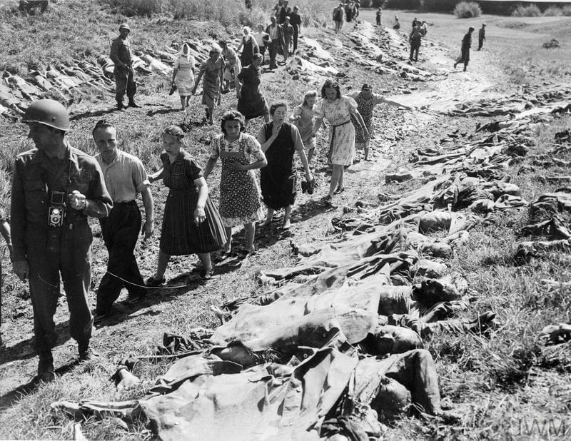
*Powszechną praktyką stosowaną przez Amerykanów było przyprowadzanie okolicznej ludności do obozów koncentracyjnych, pokazywanie im ofiar i obozu, a potem zmuszanie do grzebania ofiar. Tak też było w KL Flossenbürg 
By unknown US Army Signal Corps photographer - Imperial War Museum - Collection No.: 4700-06, Domena publiczna, [Link](https://commons.wikimedia.org/w/index.php?curid=5306496)*

### 2 Armia WP

Na południe zaś od Berlina pomiędzy Dreznem a Zgorzelcem właśnie trwała masakra polskiej 2 Armii. Polacy pod dowództwem generała Świerczewskiego ginęli tysiącami.

Powaga sytuacji z pewnością dotarła już do sztabu Koniewa, który dotąd ograniczał się do wydania ścisłych dyrektyw i przydzielenia oficerów, którzy mieli kontrolować poczynania znanego z niekompetencji generała "Waltera". Koniew wiedząc, że jest to człowiek politycznie ważny dla przyszłych polskich władz nie chciał psuć mu wizerunku. Ale Świerczewski nie zrozumiał w ogóle, że jego głównym zadaniem jest osłona Koniewa i ruszył na Drezno w zupełnym chaosie. Kiedy uderzyły na 2 Armię siły Schörnera zlekceważył zagrożenie i dopiero kompletne rozbicie jednostek w pobliżu Budziszyna uświadomiło mu co się dzieje. A może i to nie. W tym momencie nie miało to już żadnego znaczenia, 2 Armia nie istniała już jako działająca jednolicie formacja.

Jeszcze wczoraj rano 1 Korpus Pancerny nacierał na Drezno i dostał rozkaz cofnięcia się do Budziszyna, dotarł tam wieczorem i był to pierwszy znak poprawy sytuacji, ale zmieniło to dramatycznego położenia. Z 1300 żołnierzy polskiej 16 Brygady Pancernej przeżyło tylko 100, z 65 czołgów ocalały 3.

Pod Dreznem wciąż pozostawała nie wiadomo w jakim celu polska 9 Dywizja Piechoty, a tymczasem artyleria 2 Armii była pozbawiona osłony piechoty.

### 04-24

### Hitler

Hitler ochłonął po wstrząsie doznanym 22 kwietnia. Naszkicował rozkaz ogłoszony następnego dnia.

- OKW jest odpowiedzialne za wszystkie operacje i odpowiada przede mną
- wydaje rozkazy zgodnie z moimi poleceniami, które będę przekazywał przez szefaf sztabu OKH
- Sztab "A" (północ) pod dowództwem wielkiego admirała Dönitza przejmie swoje funkcje na mój rozkaz
- główne zadanie OKW to ustanowienie połączenia z Berlinem przez ataki z południowego wschodu, północnego wschodu i południa i doprowadzenie bitwy o Berlin do pomyślnego zakonczenia

Sztab "B" (południe) został przekazany generałowi Winterowi i bezpośrednio podporządkowany pod OKW. Podział na OKW i OKH został zlikwidowany.

Do bunkra Hitlera został wezwany dowódca 6 Luftflotte generał Robert Ritter von Greim.

### Francuskie SS

Francuska dywizja SS (niem. 33. Waffen-Grenadier-Division der SS „Charlemagne“ (französische Nr. 1), fr. 33e division SS Charlemagne), z której w tym czasie pozostało już tylko 750 ludzi stacjonowala w Neustrelitz.

Jej dowódca SS-Brigadeführer Gustav Krukenberg otrzymał w nocy z 23 na 24 kwietnia rozkaz z Berlina i odesłał 400 żołnierzy do innych zadań, a z pozostałych 350 (tyle było miejsca na ciężarówkach) sformował Batalion Szturmowy Charlemange (pl. Karol Wielki) i ruszył do walki w Berlinie. O 22.00 dotarli do miasta.

[Mark Felton Productions "French SS - Berlin 1945" [12:02]](https://www.youtube.com/watch?v=UJpWB5hi3hQ)

### Bitwa w Berlinie

Dowódca 5 Armii Uderzeniowej generał Nikołaj Erastowicz Bierzarin został wyznaczony na komendanta Berlina i dowódcę garnizonu berlińskiego. W Hermsdorf ustanowił pierwszą cywilną administrację z niemieckim burmistrzem.

Armia Czerwona od wczoraj już na szerokim froncie walcząca w Berlinie znalazła się z nowej sytuacji. Walczyli w śmiertelnie niebezpiecznym otoczeniu gęstej zabudowy, artyleria nie miała dość miejsca by rozstawić działa, obserwatorzy artyleryjscy a często i sami artylerzyści znajdowali się bezpośrednio pod ogniem nieprzyjaciela. Często operowali ogniem na wprost, celując przez lufę, bywało że armaty wnoszono na piętra i strzelano z klatki schodowej, a wymontowane wyrzutnie katiusz umieszczano na dachach. 

Wróg był wszędzie naokoło, a bez ściśle wyznaczonych obszarów działań łatwo było o wejście w obszar własnego ognia sąsiedzkiej jednostki. Czerwonoarmiści szybko uczyli się znaczenia dobrej łączności między jednostkami. Działali bez wyznaczonego planu, orientując się mapą i kompasem na punkt centralny ich ostatniej bitwy - Reichstag. Tempo natarcia uległo znacznemu spowolnieniu, straty rosły. Czołgi nie mogły nacierać bez wsparcia piechoty, ta zaś nie mogła pozostawić za sobą nieprzeszukanych piwnic i budynków. To dawało przeciwnikowi czas na otrząśnięcie się z szoku i przygotowanie obrony.

W wielu mniejscach pomiędzy atakujacymi jednostkami znajdowały się spore odstępy, czasem spowodowane chaotyczną topografią Berlina i ogromną liczbą cieków wodnych, a czasem zmienną dynamiką natarcia. Nie istniała jakaś określona linia frontu, spora część Berlina to była ziemia niczyja.

### Obrona Berlina

Od wczoraj aż do samego końca walk dowódcą obrony jest generał Weidling

Jego własny LVI Korpus Pancerny jest tak naprawdę jedyną ważną jednostką biorąca udział w walkach o miasto. Ale z pięciu dywizji wchodzących w jego skład tylko dwie stanowiły rzeczywistą siłę bojową: 11 Dywizja Grenadierów Pancernych SS Nordland i 18 Dywizja Grenadierów Pancernych. Do tego dochodziły elementy LSAAH i kilkuset francuskich esesmanów z 33 Dywizji Grenadierów Pancernych SS Charlemange. Reszta to była zbieranina gorsza od wrocławskiej. Bronić mieli miasta kilkukrotnie większego, a nieprzyjaciel był po pierwsze przynajmniej dziesięciokrotnie silniejszy a po drugie zdeterminowany. Wszyscy czerwonoarmiści wiedzieli i czuli to każdym wystrzałem, że jest to już ostatnia bitwa i koniec tej strasznej wojny.

Weidling uprościł strukturę dowodzenia pozbywając się niekompetentnych dowódców i zmniejszając liczbę sektórów obrony. Większość działajacych instytucji wojskowych zostało zamkniętych a personel wysłano na front.

Kobiety sformowały grupę bojową Mohnke ulokowaną w "Cytadeli".

5 tys chłopców z Pułku Hitlerjugend dowodzonego przez Obergebietsführera dra Schlündera obsadziło dwa południowe z czterech mostów na Haweli (do Spandau) z zadaniem trzymania ich aż do nadejścia 12 Armii generała Wencka. Który jak już wiemy ani myślał by wysłać jakiekolwiek wojsko do Berlina.

Dywizja SS Nordland została wycofana z okolic Lotniska Tempelhof i przeniesiona w pobliże "Cytadeli" w rejonie Neukölln - Kreuzberg. Natomiast do Tempelhof skierowano Dywizję Pancerną Müncheberg. 20 Dywizja Grenadierów Pancernych zajęła pozycje w Wannsee, a jej miejsce w Zehlendorf zajęła 18 Dywizja Grenadierów Pancernych.

### Berlin - 1 Front Białoruski

76 i 60 Dywizje Strzeleckie ze 125 Korpusu Strzeleckiego atakowały Spandau z północy i zachodu. Walki w Spandau były tak zaciekłe i chaotyczne, że choć w zasadzie zdobyte zostało do wieczora opuszczone przez czerwonoarmistów po to tylko, żeby je jeszcze raz porządnie zbombardować.

175 Dywizja Strzelecka nacierała na Lotnisko Gatow (po wojnie baza RAF Gatow, obecnie Militärhistorisches Museum Flugplatz Berlin-Gatow), którego obroną dowodził major Komorowski. Cała obrona to był pospiesznie sformowany batalion składający się z Volkssturmu i żołnierzy z oddziałów budowlanych, którzy nie umieli walczyć, do tego kilka armat. Do wieczora Volkssturm zdezerterował, a reszta jego żołnierzy w ciągu następnego dnia została zabita lub wzięta do niewoli.

Atakujące od północy oddziały 2 Gwardyjskiej Armii Pancernej wczoraj dotarły do Wittenau, dziś do popołudnia zajęły Jungfernheide, poligon (późniejsze lotnisko) Tegel i do wieczora dotarły do Hohenzollern Kanal w kilku miejscach zdobyły przyczółki w Siemensstadt.

Równolegle po jej lewej stronie, bardziej na wschód nacierała 3 Armia Uderzeniowa

- 79 Korpus Strzelecki zajął Reinickendorf z opuszczonymi Koszarami Goeringa w Wedding (obecnie Julius-Leber-Kaserne)
- 12 Gwardyjski Korpus Strzelecki posuwał się przez Wedding i dotarł do silnej obrony w rejonie stacji Wedding S-Bahn i Wieży Przeciwlotniczej Humboldthain (niem. Humboldthain Flakturm). Broniła się tam 9 Dywizja Spadochronowa.
- 7 Korpus Strzelecki atakował przez Prenzlauer Berg, okolicę podobną do Wedding i dwoma głównymi drogami: Prenzlauer Allee z Blankenburg i Greifswalder Strasse z Weissensee kierował się na Alexanderplatz.

5 Armia Uderzeniowa zaczęła dzień od przygotowania artyleryjskiego i desantu piechoty przez Wuhle, dopływ Szprewy. Dzięki uchwyceniu przyczółka można było przystąpić do budowy mostów i przejechać nimi czołgami.

- Po obu stronach Frankfurter Allee atakowały 26 Gwardyjski i 32 Korpus Strzelecki. Zniszczyły przy tym całą zabudowę tej ulicy. Zdobyły teren Rzeżni znajdujący się już w wewnętrzym obszarze obrony. Kontratak został powstrzymany i udało się tego dnia dotrzeć do linii obwodowej S-Bahn. Dalsze postępy zatrzymał ogień z Friedrichshain Flakturm.
- Z samego rana 9 Korpus Strzelecki przekroczył Szprewę na wysokości Parku Treptow. Miał wsparcie 1 Brygady Flotylli Dnieprzańskiej, która przy pomocy pontonów i 10 amfibii przeprawiła 16 tys żołnierzy, 100 dział i moździerzy, 27 czołgów i 700 ciężarówek.
- 301 Dywizja Strzelecka zdobyła Elektrownię Rummelsberg, nie tylko nietkniętą, ale i działającą co wprawiło dowództwo w zachwyt i zapewniło oficerom deszcz odznaczeń.

Bardziej na południe atakowała najważniejsza jednostka 1 Frontu Białoruskiego - 3 Gwardyjska Armia Pancerna generała Czujkowa mająca wsparcie 28 Armii. Bez wątpienia Żukow umieścił ją w tym miejscu by zapewnić skuteczne odcięcie 9 Armii niemieckiej od Berlina, ale być może także by zablokować ewentualne wejście oddziałów 1 Frontu Ukraińskiego do Berlina.

### Berlin - 1 Front Ukraiński

Ewentualne? Otóż dziś w Bohnsdorf (na wschód od Schönefeld) 2 km na południe od Kanału Teltow doszło do spotkania wojsk sowieckich obu Frontów. Żołnierze Żukowa całkiem niespodziewanie natknęli się na czerwonoarmistów z 3 Gwardyjskiej Armii Pancernej generała Rybałki. Do tej pory Żukow nic nie wiedział o tym, że żołnierze Koniewa już są w Berlinie! To był dla niego wstrząs, wywołało to serię depeszy gwałtownej treści w łańcuchu dowodzenia, skarga Żukowa dotarła do Stalina i Stalin rozstrzygnał: wytyczył linię podziału, która biegła przez Lubben, Teuplitz, Mittenwalde, Marieindorf i kończyła się na Dworzcu Anhalckim, droga do Reichstagu była otwarta.

Spotkanie obu Frontów w Berlinie oznaczało również zamknięcie okrążenia 9 Armii i odcięcie jej od Berlina. Zarówno 9 Armia i 4 Armia Pancerna podjęły próbę odblokowania miasta, ale nie mogły się już powieść. Ale najwyższych dowódców Armii Czerwonej Niemcy już nic nie obchodzili, byli tylko masą i siłą ogniową nieprzyjaciela stanowiącą przeszkodę na drodze do pokonania najważniejszego przeciwnika - rywala w takim samym mundurze.

3 Gwardyjska Armia Pancerna wciąż borykała się z Kanałem Teltow. Atak rozpoczęty godzinnym przygotowaniem artyleryjskim o godz. 0420. Każdy z korpusów miał ok 1,5 km odcinek frontu.

- 9 Korpus Zmechanizowany i 61 Gwardyjska Dywizja Strzelecka ustanowiły przyczółek w Lankwitz, ale został zlikwidowany z dużymi stratami.
- 6 Gwardyjski Korpus Pancerny wdarł się do Teltow korzystając z resztek mostu i pontonów. Do piątej rano dołączyła do nich 22 Gwardyjska Zmechanizowana Brygada Strzelecka. A potem 48 Gwardyjska Brygada Strzelecka. Do godz. 1100 saperzy przygotowali most na przewiezienie artylerii i czołgów. Do końca dnia przyczółek sięgał aż po południowe granice Zehlendorf.
- 7 Gwardyjski Korpus Pancerny zdobył przyczółek w Stahnsdorf, ale zaciekły opór i w końcu zniszczenie mostu spowodowały problemy w kontynuacji ataku.

Uderzeniem na Kanał Teltow dowodził osobiście marszałek Koniew. Wobec powodzenia na tylko jednym kierunku natarcia wydał rozkaz by tą drogą pchnąć wszystkie siły. Później nawet 10 Gwardyjski Korpus Pancerny 4 Gwardyjskiej Armii PAncernej właśnie przez przyczółek Teltow uderzył na Poczdam.

Walczyła z nimi 18 i przybyła tego dnia 20 Dywizja Grenadierów Pancernych, oraz elementy LVI Korpusu Pancernego w sile 6 tys żołnierzy, mieli 2 Panthery i 20 PzKw IV.

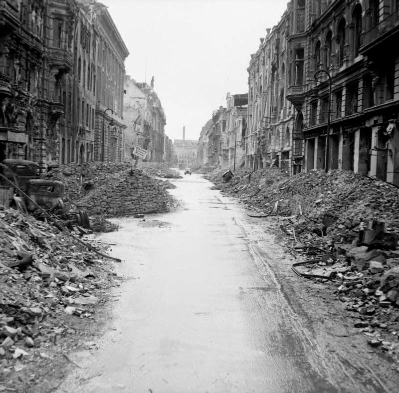
*Berlin po walkach. 
By No 5 Army Film &amp; Photographic Unit, Wilkes A (Sergeant) - (https://commons.wikimedia.org/wiki/File:IWMLondonThumbnail.jpg)This is photograph [BU 8604](https://www.iwm.org.uk/collections/search?query=BU+8604) from the collections of the [Imperial War Museums](https://www.iwm.org.uk/) (collection no. 4700-30) (https://commons.wikimedia.org/wiki/File:Flag_of_the_United_Kingdom.svg), Domena publiczna, [Link](https://commons.wikimedia.org/w/index.php?curid=640213)*

### Steiner

W końcu udało mu się dokonać nakazanego ataku, siłą 7 batalionów wyprowadził natarcie z przyczółków w Kreuzbruch i Zerpenschleuse, Zaskoczona 61 Armia sowiecka zareagowała z opónieniem i dotarli aż do Zehlendorf i Klosterfelde czyli 6 km zanim zostali odparci. Zwycięstwo na miarę epoki.

### Okolice Berlina - 1 Front Ukraiński

13 Armia sowiecka dotarła do Wittenbergi na Łabie, rozpoczęły się walki z XX Korpusem 12 Armii Wencka. Były tam dywizje Ulrich von Hutten, Theodor Körner i Scharnhorst. Rozpętały się walki tak zaciekłe, że trzeba było wezwać na pomoc rezerwy z 5 Gwardyjskiego Korpusu Zmechanizowanego i 1 Korpusu Lotnictwa Szturmowego.

4 Gwardyjska Armia Pancerna:

- 10 Gwardyjski Korpus Pancerny dotarł na przedmiescia Poczdamu, ale został zatrzymany z powodu braku mostów.
- 6 Gwardyjski Korpus Zmechanizowany dotarł do Brandenburga, w którym zdobył więzienie. Uwolniono więźniów, wielu z nichh było ważnymi działaczami partii komunistycznej.

O świcie 2 Brygada Dnieprzańska położyła na Odrze zaporę dymną i 33 Armia przekroczyła rzekę i zdobyła Fürstenberg (obecnie część Eisenhüttenstadt). V Górski Korpus SS wycofał się.

2 Armia Lotnicza przeniosła bazy bombowców na zachód od Nysy Łużyckiej.

1 Gwardyjski Korpusem Kawalerii pod dowództwem generała Wiktora Kiriłłowicza Baranowa dotarł do Łaby i wykonał misję zleconą przez starego i wciąż wpływowego przyjaciela Stalina, znanego wszystkim Polakom marszałka Budionnego. Zdobył stado koni ukradzionych przez Niemców w Północnym Kaukazie w 1942.

### 9 Armia

W Teupitz (20 km na południe od Berlina) 3 Armia 1 Frontu Białoruskiego połaczyła się z 28 Armią 1 Frontu Ukraińskiego zamykając w ten sposób okrążenie 9 Armii niemieckiej generała Bussego.

Od 22 kwietnia priorytetem wojsk hitlerowskich było połączenie 12 Armii Wencka z 9 Armią, dramatyczna walka rozegra się w najbliższych kilku dniach. Rozpoczęła się bitwa pod Halbe czyli próba przedarcia się na zachód i połączenia się z 12 Armią Wencka a potem dotarcia do Łaby i poddania się Amerykanom. Była to jedyna nadzieja dla 80 tys żołnierzy ze zgrupowania pod dowództwem generała Theodora Bussego

- [Mark Felton Productions "The Last German WWII Attack - Operation Potsdam 1945" [YT 12:38]](https://www.youtube.com/watch?v=LHT2y4QKVMo)

### 2 Armia WP

Dziś Niemcy wyparli Polaków z rejonu Budziszyna. Było to ostatnie (tej wojny i w ogóle) zakończone sukcesem natarcie niemieckich sił pancernych.

Na pole bitwy dotarła 8 DP zawrócona spod Drezna oraz 7 i 10 DP wysłana znad Nysy Łużyckiej przez wysłanego interwencyjnie generała Iwana Pietrowa. Sytuacja zaczęła budzić zaniepokojenie marszałka Iwana Koniewa. Ze względów politycznych nie chciał przejmować komendy osobiście, ale sukcesy niemieckie na tym odcinku stanowiły zagrożenie dla Frontu.

Wprawdzie 5 Armia Gwardyjska zatrzymała ofensywę niemiecką w kierunku Spremberga, ale walki na tym odcinku będą trwały jeszcze kilka dni.

### Puławy

W Puławach dziś jak na filmie akcji, udający czerwonoarmistów i ich więźniów żołnierze WiN pod dowództwem Mariana Bernaciaka ps. "Orlik" dokonali napadu na Powiatowy Urząd Bezpieczeństwa Publicznego.

Uwolnili 107 więźniów, zabili 1 czerwonoarmistę, 5 ubeków i 2 milicjantów. Stracili 2 zabitych i kilku rannych. W zamieszaniu żołnierze komunistyczni strzelali do siebie.

W 1946 ranny i otoczony przez UB "Orlik" popełni samobójstwo.

### Opawa

Armia Czerwona i czechosłowacka zdobyła Opawę.

### Samobójstwa hitlerowców

W Poczdamie kolejne samobójstwo hitlerowca; Ernst-Robert Grawitz. Ochotnik z Wielkiej Wojny, żołnierz freikorpsów. Profesor uniwersytetu berlińskiego. od 1931 w SS. W 1935 szef wydziału sanitarnego w Głównym Urzędzie SS i naczelny lekarz SS. Zwierzchnik Niemieckiego Czerwonego Krzyża oraz główny chirurg Himmlera. Odpowiedzialny za wdrożenie zabijania ludzi w komorach gazowych i liczne zbrodnicze eksperymenty dokonywane na potrzeby wojska, oraz związane z planami masowej sterylizacji. Karierowicz pogardzany przez przełożonych i bezwzględny dla podwładnych. Himmler popierał go chociaż nim gardził. Człowiek z pewnością uprzywilejowany i przedstawiciel berlińskiej elity.

Usiadł wieczorem do kolacji i kiedy wszyscy zajęli miejsca wyszarpnął zawleczki dwóch granatów zabijając wszystkich, całą rodzinę na miejscu.

Przez miasto przetoczyła się fala samobójstw. To wszystko co znaliśmy z Wrocławia spadło na Berlin z o wiele większą prędkością i na większą skalę.

### Friedrich Kayssler

Podczas bitwy o Berlin usiłując ochronić swoją żonę zabity został Friedrich Kayssler, popularny i mający wiele sukcesów aktor teatralny i filmowy, znajdujący się na specjalnej liście Hitlera Gottbegnadeten z września 1944. Urodził się w Nowej Rudzie, Ukończył gimnazjum we Wrocławiu, studiował we Wrocławiu i Monachium.

### 04-25

### Himmler

Tego dnia do Trumana i Churchilla dotarła wiadomość w którą początkowo nie chcieli uwierzyć, była to wiadomość przekazana przez księcia Folke Bernadotte szefa szwedzkiego Czerwonego Krzyża i pochodząca od Heinricha Himmlera, jak go nazywał Hitler "der treue Heinrich", wiernego Henryka.

Przywódca SS donosił iż Hitler znajduje się w ciężkim stanie i nawet jeżeli jeszcze żyje, to wkrótce umrze lub popełni samobójstwo. Wobec tego Himmler jest gotów podjąć negocjacje i skapitulować wobec aliantów zachodnich.

Propozycja ta bez żadnych rozważań została odrzucona i poinformowano o niej Stalina, który napisał: "*Armia Czerwona będzie nadal nacierała na Berlin w interesie naszej wspólnej sprawy*". Oczekiwany przez Hitlera "Cud domu brandenburskiego" (niem. Mirakel des Hauses Brandenburg) nie nastąpił.

### Obersalzberg

Generał Ritter von Greim w Berchtesgaden spotyka się z generałem Kollnerem i choć nie zgadza się z jego twierdzeniem iż Göring nie jest winny zdrady zgadza się przekazać jego prośbę o łaskę. Lot do Berlina jest śmiertelnie niebezpieczny, ale jego pilotem będzie Hanna Reitsch, po którą udał się do Monachium. Polecieli do Rechlin, Hanna liczyła, że znajdą tam śmigłowiec, którym można wylądować w mieście, ale jedyny dostępny był już zniszczony. Dopiero następnego dnia znaleźli samolot.

RAF bombarduje Berchtesgaden, ulubioną siedzibę Hitlera. 16 prowadzących Mosquito i 358 Lancasterów (tyle samo wysłali 10 dni wcześniej na Kilonię). Na miejscu był tylko Göring, już pod strażą SS. Nie wiadomo czym było spowodowane bombardowanie, alianci wiedzieli już że Hitler jest i pozostanie w Berlinie.

Było to ostatnie duże bombardowanie na europejskim teatrze wojennym. Straty alianckiego lotnictwa zeszły do tak niskiego poziomu, że dwa dni później 27 kwietnia przybyły do Europy ostatnie uzupełnienia. Takie było zakończenie Combined Bomber Offensive oficjalnie zakończonego rozkazem 12 kwietnia 1945.

- [Bombing of Obersalzberg](https://en.wikipedia.org/wiki/Bombing_of_Obersalzberg)
- Mark Felton Productions ["Get Göring - The US Mission to Capture Hitler's No. 2" [YT 29:12]](https://www.youtube.com/watch?v=pkC7fTVbWck) | ["Eagle's Nest - Hitler's Mountaintop Headquarters Today" [YT 20:52]](https://www.youtube.com/watch?v=u7Yy-NG2o_A)

### 2 Front Białoruski

2 Front Białoruski opanował ujście Wisły i zdobył Szczecin. Runęła niemiecka obrona na Odrze. Generał Heinrici udzielił pozwolenia dowódcy 3 Armii Pancernej generałowi von Manteuffelowi na wycofanie się.

### Spotkanie na Łabie

Porucznik Albert Kotzebue z amerykańskiej 69 Dywizji dowódca 26-osobowego patrolu nad Łabą w pobliżu miasteczka Strehla spotkał dziwnie wyglądającego jeźdźca. Pomyślał, że być może jest to żołnierz sowiecki. Tłumacz zapytał "*Jesteś Rosjaninem?*", na co ten odrzekł po rosyjsku, że tak. Zapytany gdzie jest jego oddział wskazał za rzekę.

Po dotarciu do rzeki Kotzebue i jego ludzie znaleźli łódkę i przeprawili się przez Łabę wiosłując kolbami karabinów. Na drugim brzegu ujrzeli rozciągające się na kilkaset metrów pobojowisko, byli tam zniszczone wozy, rozrzucona odzież i bagaże, martwi cywile, mężczyźni, kobiety i dzieci. Nie wiadomo kto dokonał tej zbrodni. Dalej napotkali oddział Armii Czerwonej, obie strony zasalutowały.

Był 25 kwietnia, godzina 13.30. III Rzesza została rozcięta wpół.

Słynne spotkanie w Torgau prawie trzy godziny później o 16.20. Oddziały 58 Gwardyjskiej Dywizji Strzeleckiej 5 Armii Gwardyjskiej i amerykańskiej 69 DP 1 Armii generała Hodgesa nawiązały łączność.

- [Mark Felton Productions "East Meets West 1945 - US-Soviet Linkup at the Elbe" [YT 12:47]](https://www.youtube.com/watch?v=dHjhahGeB84)

### Berlin

Wczoraj okrążona została 9 Armia. Dziś dzięki połączeniu sił 1 Frontu Ukraińskiego (4 Gwardyjska Armia Pancerna) i 1 Frontu Białoruskiego (2 Gwardyjska Armia Pancerna i 47 Armia) w rejonie Ketzin nad Hawelą 10 km na północny zachód od Poczdamu Armia Czerwona okrążyła Berlin. 6 Gwardyjski Korpus Zmechanizowany spotkał 328 Dywizję Strzelecką z 65 Brygadą Pancerną. Teraz ze stolicy III Rzeszy można było wydostać się tylko droga powietrzną, a ze względu na przewagę powietrzną i coraz silniejszy ogień plot było to niemalże samobójstwo.

Miasto pozbawione było zorganizowanego garnizonu i jednolitego dowództwa, obok siebie walczyły Volkssturm, SS, Hitlerjugend, policja i straż pożarna. Czasem jednego obiektu broniło kilka jednostek każda pod innym dowództwem, wielu ludzi walczyło nie wiedząc w ogóle czyje rozkazy wykonuje. Generał Weidling usiłował jakoś nad tym zapanować, wzmocnił obrońców resztkami swojego 56 Korpusu. Chaos wynikał nie tylko z pośpiechu, ale również z ambicji wielu dowódców. Formalnie "Cytadelą" dowodził porucznik Seifert z Wehrmachtu, ale liczne w tym obszarze jednostki SS podlegały Hitlerowi, do tego wcześniej Hitler na dowódcę "Cytadeli" wyznaczył generała SS Mohnke. 

Ale nic już nie mogło zmienić sytuacji. Sowieci nie tracili czasu na walkę, korzystając z siły ognia niszczyli i palili wszystkie budynki, z których do nich strzelano. Place i ulice, lotniska Tempelhof i Gatow zastawione były artylerią i największym koszmarem Niemców "organami Stalina". Artyleria w amoku bitewnym mając nieograniczone zasoby amunicji strzelała bez przerwy niszcząc ulicę po ulicy, systematycznie zamieniając Berlin w rumowisko i płonące zgliszcza. Jak to opisał później volkssturmista Edmund Heckesher "*Było tak wiele pożarów, że nie było nocy. można było czytać gazetę gdyby się ją miało*".

Po stronie obrońców niektóre oddziały zostały rozpuszczone do domów przez własnych dowódców, ponieważ z braku broni i doświadczenia do niczego się nie nadawały. Dezercja stała się normą. Rozpętało się znane z Wrocławia szaleństwo sprawiedliwości twierdzy. We Wrocławiu miało to przynajmniej pozory zachowania procedur, tu w Berlinie nie było na to czasu. Egzekucji dokonywano na miejscu albo bezpośredni na rozkaz dowódcy. Po mieście krążyły patrole SS, policji i partii przeszukujące budynki w poszukiwaniu ukrywających się żołnierzy. Taki sam los czekał schwytanych żołnierzy sowieckich.

Ale były róœnież takie sytuacje, że Wehrmacht i to na rozkaz dowódców strzelał do lotnych sądów kapturowych szukających dezerterów.

Po wdarciu się sowieckich Armii do Berlina pozostały już tylko dwie linie obrony.

- zewnętrzna oparta o linię kolei miejskiej S-Bahn i kanały miejskie
- wewnętrzna czyli tzw Zitadelle - dzielnica rządowa ograniczoną Kanałem Landwehry i śródmiejskim biegiem Szprewy.

W południe Weidling wyznaczył nowy schemat obrony miasta:

- "A" oraz "B" (wschód) generał Mummert
- "C" (południowy wschód) generał SS Ziegler z Dywizji Grenadierów Pancernych Nordland
- "D" (rejon Tempelhof) pułkownik Wöhlermann
- "E" (południowy zachód i Las Grunewald) dowódca 20 Dywisji Grenadierów Pancernych, wkrótce potem zastąpiony przez  generała Raucha z 18 Dywizji Grenadierów Pancernych
- "F" (Spandau i Charlottenburg) pułkownik Anton Eder
- "G" i "H" (północ) pułkownik Herrmann dowódca 9 Dywizji Spadochronowej
- "Z" (Zitadelle) porucznik Seifert (podejrzewam błąd w nazwisku - lexikon-der-wehrmacht nie wymienia nikogo takiego).

Wysadzono połowę z ponad dwustu czterdziestu mostów, ponieważ brakowało dynamitu używano bomb lotniczych. W szaleństwie walki nikt nie pytał po co się ją jeszcze toczy. Czego właściwie te resztki wojska i pośpiesznie zmobilizowani cywile bronią. Tak samo jak we Wrocławiu obie strony niszczyły miasto a postronne osoby ginęły tysiącami.

SS wysadziło kilkukilometrowy tunel kolei podziemnej biegnący pod Szprewą i kanałem Landwehry. I tu pojawiają się dwie wersje, w jednej z nich znajdowały się w nim cztery pociągi z rannymi i tysiące cywilów szukających bezpieczeństwa. Rozegrały się dantejskie sceny kiedy ludzie deptali po sobie uciekając przed walącą się na nich ścianą wody. Nieliczni ocaleli. W drugiej ta część metra była w zasadzie opuszczona, pozostali w niej tylko zmarli i cięzko ranni, których nie można było ewakuować.

Metro było zapchane ludźmi, którzy się dusili i umierali. Umarłych nie można było przenieść przez tłum. Toalety zostały natychmiast zatkane. Miejsca znajdujące się bliżej powierzchni były zagrożone na zniszczenie rakietami, opowiadano sobie, że sowieci wszędzie gdzie wchodzą najpierw strzelają miotaczem ognia.

Tysiące cywilów koczowały w wieżach przeciwlotniczych wielkich żelbetowych monstrach rozstawionych wokół centrum miasta, które były najeżone bronią przeciwlotniczą. Teraz schowano w nich także najcenniejsze zbiory berlińskich muzeów.

Berlin nie zasłużył sobie na ten los, pomimo umizgów Hitlera i specjalnych starań NSDAP osiągało tu za czasów demokracji najgorsze wyniki. Na większe uroczystości partyjne trzeba było przywozić działaczy z Monachium. Poza tym teraz społeczeństwo Berlina to były prawie same kobiety. W 1939 miasto miało zrównoważoną charakterystykę demograficzną i około 4,3 mln mieszkańców, zapłaciło okrutną cenę za wojnę rozpętaną przez Partię. Z powodu strat w ludziach, poboru coraz większej liczby mężczyzn, a w końcu ucieczki tysięcy ludzi zawczasu przewidujących jaki los czeka stolicę III Rzeszy w styczniu 1945 pozostało w niej 2,9 mln ludzi, przy czym mężczyzn w wieku 18-30 lat było tylko 100 tys. Cornelius Ryan szacuje, że w wyniku strat wojennych pierwszych dni ataku wśród żywych wciąż pozostawało w obrębie miasta 2,7 mln ludzi z czego około 2 miliony to były kobiety. I co zadziwiające, nie wiadomo jak i po co, płacąc za to okrutną cenę Berlin wciąż się bronił. Front od strony północnej stanął w miejscu. Znaczący postęp udało się sowietom uzyskać od południa i południowego wschodu.

### Flakturm

Jedynymi silnymi punktami obrony były Wieże Przeciwlotnicze (niem. Flakturm, l mn Flaktürme), zbudowane po 1940 kiedy Berlin stał się obiektem bombardowań. Były to ogromne jak średniowieczne zamczyska, żelbetowe wieże wysokie od 40 do 55 m, ze ścianami grubości 3.5 m.

Budowane były zawsze parami L-Turm (Leitturm) wieża naprowadzająca na której znajdował się radar i G-Turm Gefechtsturm wieża bojowa z artylerią przeciwlotniczą. Podczas ataku urządzenia radarowe były chowane do wnętrza i ta wieża nie brała udziału w walce, natomiast wieża bojowa znając kierunek i siłę ataku była już przygotowana.

Jej przestronne wnętrza były załadowane amunicją, która jechała ku górze windami. Maksymalna szybkostrzelność wieży to 8 tys pocisków na minutę (230 na sekundę!) z wszystkich armat. Były tam i działa o kalibrze 2 cm, słynne 88, ale najgroźniejsze dla bombowców były armaty 12.8 cm FlaK 40 o zasięgu 15 km i szybkostrzelności 12 strzałów na minutę. Było to najgroźniejsze działo przeciwlotnicze tej wojny.

Niemcy zbudowali osiem takich wież, dwie były w Hamburgu, trzy w Wiedniu. Te wiedeńskie zachowały się ze zwykłego zaniechania w najlepszym stanie.

W Berlinie były trzy:

- **Tiergarten** nic z niej nie ocalało
- **Friedrichshain** poważnie zniszczona, resztki są przykryte ziemią i stanowią pagórki
- **Humboldthain** zachowana najlepiej, jedną z nich można zwiedzać.

Podczas bitwy doskonale się sprawdziły, stanowiły schronienie dla ludności cywilnej, podobno mogło się tam zmieścić 30 tys ludzi i byli rzeczywiście dobrze chronieni. Sowieci nie mieli czym ich zniszczyć, nie mieli jeszcze rakiet na samolotach, nie dawały im rady nawet największe jakie tam posiadali moździerze 203 mm. Na szczęście dla atakujących były tylko trzy i dało się je ominąć.

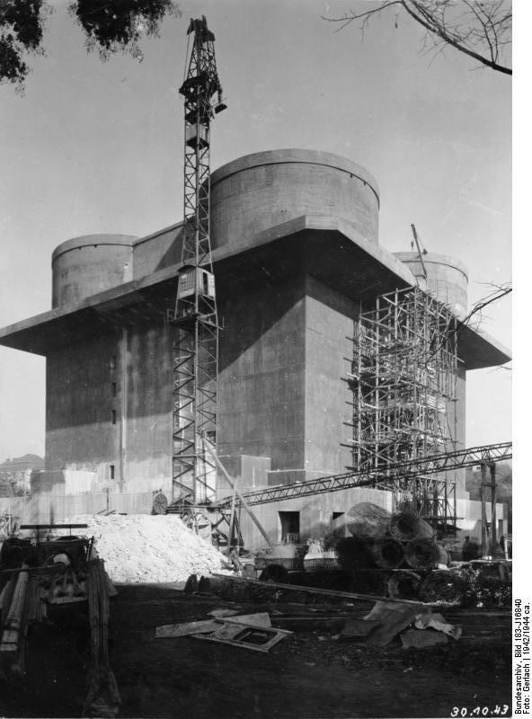
*Wieża Przeciwlotnicza podczas budowy, 1942 
By Bundesarchiv, Bild 183-J16840 / CC-BY-SA 3.0, [CC BY-SA 3.0 de](https://creativecommons.org/licenses/by-sa/3.0/de/deed.en), [Link](https://commons.wikimedia.org/w/index.php?curid=5364773)*

### Bitwa

Pół miliona żołnierzy, 11 tys dział i moździerzy, 2 tys wyrzutni artyleryjskich i półtora tysiąca czołgów i dział samobieżnych.

- Ze składu Frontu Białoruskiego walczyły 1 i 2 Gwardyjska Armia Pancerna, 3 i 5 Armia Uderzeniowa i 47 Armia
- natomiast ze składu 1 Frontu Ukraińskiego 2 i 4 Gwardyjska Armia Pancerna i część 28 Armii.

Tym razem sowieci przeszacowali siły obrońców - uznali że Berlina broni 300 tys żołnierzy, 3 tys dział i moździerzy i ćwierć tysiąca czołgów i dział szturmowych.

Główny marszałek lotnictwa Aleksandr Aleksandrowicz Nowikow na 25 i 26 kwietnia wyznaczył operację specjalną "Salut" - intensywne bombardowanie miasta. Pierwszy cios zadało 100 bombowców 18 Armii lotniczej, a potem dołączyła 16 Armia Lotnicza. ogółem w operacji wzięło udział 1368 samolotów, w tym 569 znanych nam bombowców nurkujących Pe-2.

#### Od północy

3 Armia Uderzeniowa: 79 Korpus Strzelecki po sforsowaniu Kanału Hohenzollernów zdobył niesławne więzienie Plötzensee i uwolniła więźniów, ale dalszy postęp zatrzymało wysadzenie mostu Königsdammbrücke (obecnie Ludwig-Hoffmann-Brücke) łączącego z Moabit.

47 Armia: 125 Korpus Strzelecki nacierał na Spandau i lotnisko Gatow.

2 Gwardyjska Armia Pancerna z powodu braku piechoty z coraz większym trudem walczyła w Siemensstadt. Od 25 kwietnia miała wsparcie polskiej 2 Brygady Ciężkiej Artylerii i polskiej 6 Brygady pontonowo-mostowej. Dopiero 28 kwietnia udało się im przekroczyć Szprewę.

12 Gwardyjski Korpus Strzelecki przedarł się do Moabitu od wschodu przez Fennbrücke w porcie Nordhafen, ponosił cięzkie straty znajdujac się pod ogniem Humboldhain Flakturm i walcząc w dzielnicy przemysłowej i gęstej zabudowie na północ od Invalidenstrasse. Obronę wzmocniła 9 Dywizja Spadochronowa.

#### Od wschodu

7 Korpus Strzelecki dotarł w rejon Aleksanderplatz. Obrona na tym odcinku była najsłabsza, w ostatniej chwili Weidling wysłał tam czołgi z Dywizji Pancernej Müncheberg.

5 Armia Uderzeniowa:

- 26 Gwardyjski Korpus Strzelecki nacierał Frankfurter Allee (na tym odcinku jest to obecnie Karl-Marx-Allee) w kierunku Friedrichshain Flakturm.
- 32 Korpus Strzelecki walczył w rejonie Schlesischer Bahnhof (obecny Berlin Ostbahnhof), marszałek Żukow uważał to za jedno z najtrudniejszych zadań podczas całej operacji berlińskiej.
- 9 Korpus Strzelecki przekroczył Kanał Landwehry i prowadził ciężkie walki w rejonie Görlitzer Bahnhof.

#### Od południowego wschodu

8 Gwardyjska Armia Pancerna generała Czujkowa przekroczyła Kanał Teltow i razem z 1 Gwardyjską Armią Pancerną atakowała lotnisko Tempelhof. Ważne dla Polaków i słynne w całej Polsce, bo tam kierowano porywane samoloty, ale chociaż zamknięte w 2004 jest ważne również w architekturze XX wieku: zbudowane na nowo specjalnie na Olimpiadę w 1936 stało się wzorem dla wszystkich lotnisk. Lotniska broniły czołgi Dywizji Pancernej Müncheberg. Na płycie lotniska były ustawione słynne armaty 88 mm, broń śmiertelnie niebezpieczna dla czołgów. Lotnisko atakował 28 Gwardyjski Korpus Strzelecki z dwoma brygadami pancernymi z 1 Gwardyjskiej Armii Pancernej.

Z lewej strony miał 39 Gwardyjski Korpus Strzelecki i 8 Gwardyjski Korpus Zmechanizowany, a z prawej 79 Gwardyjską Dywizję Strzelecką i 88 Gwardyjską Dywizję Strzelecką.

Bardziej w lewo 29 Gwardyjski Korpus Pancerny wsparty przez 8 Gwardyjski Korpus Pancerny przekroczył Kanał Teltow pomiędzy Tempelhofer Damm i linią kolejową, a po prawej 4 Gwardyjski Korpus Strzelecki wdarł się do Neukölln. Wygląda na to, że nie napotkały istotnego oporu i dopiero następnego dnia pojawiła się tam Dywizja SS Nordland.

Komendę nad tą dywizją na rozkaz Weidlinga przejął generał SS Krukenberg, w ten sposób Weidling usnunął generała SS Zieglera, nad którym nie miał żadnej kontroli. W tym momencie jak większość niemieckich jednostek była to już dywizja tylko z nazwy, składała się z dwóch pułków grenadierów pancernych 23 Norge i 24 Danmark, każdy po 600 do 700 żołnierzy. Tak więc 350 żołnierzy przywiezionych przez Krukenberga było poważnym wzmocnieniem.

To wtedy zaczęły pojawiać się przypadki ostrzeliwania czerwonoarmistów przez innych czerwonoarmistów. W walce o miasto pojawił się ogromny zamęt. Taka siła ognia i koncentracja ataku, dynamika wojny w dużym mieście powodowała zupełnie inne, dla dużej części żołnierzy nowe warunki walki. Lotnictwo nie było w stanie odnaleźć linii frontu. Miasto było spowite dymem i ogniem. Oddziały pancerne ponosiły duże straty od panzerfaustów. Niektóre załogi wierząc, że to je ochroni mocowały do korpusów ramy stalowych łóżek ze sprężynami. Na pewno była skuteczna osłona piechoty. Wprowadzono znaną ze Stalingradu taktykę walk ulicznych - przede wszystkim siła ognia, broń maszynowa, granaty, miotacze ognia.

Czerwonoarmiści zawsze wybierali do ataku rejony bronione przez Volkssturm i bardzo chętnie korzystali ze schwytanych dezerterów jako źródła informacji.

Stawka wytyczyła nową linię podziału: Mittenwalde - Tempelhof - Potsdamer Bahnhof.

#### 1 Front Ukraiński

- 9 Korpus Zmechanizowany parł przez Steglitz aż prawie do Schöneberg
- 6 Gwardyjski Korpus Pancerny po uporaniu się z baterią flak na Königin-Luise-Platz przy Ogrodzie Botanicznym dotarł do granic Schmargendorf
- 7 Gwardyjski Korpus Pancerny zabezpieczył południowy pas przedmieść na zachód aż do Nikolassee i nacierał na Dahlem zdobywając po drodze sztab Luftgau III

Było oczywiste, że marszałek Koniew ulokował 3 Gwardyjską Armię Pancerną generała Rybałki w takim miejscu by miała szansę wedrzeć się do Mitte i zdobyć Reichstag. Rywalizacja pomiedzy marszałkami miała swoją mroczną stronę. Pomniędzy jednostkami obu frontów nie ustabnowiono żadnej łaczności, nie było oficerów łącznikowych, a nakazana przez Stawkę linia podziału była tylko kreską na mapie. Ten chaos powodował coraz większe straty sowieckie i trudno było rozeznać się gdzie jest linia frontu. Lotnictwo uderzało według danych dostarczonych tylko przez własny Front.

5 Gwardyjski Korpus Zmechanizowany i 13 Armia napierał z wydatną pomocą 1 Korpusu Lotnictwa Szturmowego 2 Armii Powietrznej na rozcągnięte linie 12 Armii generała Wencka.

### Hitler

Hitler akceptuje powołanie 21 Armii w Meklebmburgii pod dowództwem generała Kurta von Tippelskircha. Jej zadaniem będzie przeciwdziałanie ewentualnemu uderzeniu brytyjskiej 21 Grupy Armii na Lubekę, które grozi odcięciem prowincji Schlezwig-Holstein i Danii. Na 21 Armię składały się dwa pułki.

Domagał się jak najszybszego deblokującego uderzenia na Berlin i dalej żył w iluzji karmionej przez Krebsa, Jodla i Keitla o 9 Armii zdolnej do ataku, o stabilnym froncie na Odrze. W berlińskim bunkrze 3 Armia Pancerna wciąż blokowała 2 Front Białoruski, a 9 Armia Bussego mogła przyjść z pomocą oblężonemu Berlinowi. Gdyby tylko Steiner wreszcie przeprowadził straszliwe uderzenie w kierunku Spandau rozcinając siły sowieckie na Haweli i połączył się z 12 Armią Wencka, która również niewątpliwie podążała na pomoc - wtedy wojna byłaby wygrana.

Jodl skwapliwie donosił, że wszystkie te operacje są w toku, albo w końcowej fazie przygotowań.

### Steiner

Grupa Bojowa Steinera utraciła Oranienburg, ale wciąż trzymała się na Kanale blokując 61 Armię i 1 Armię WP.

Nie tylko trzymał pozycję ale i nacierał, no przynajmniej miał nacierać. W nocy 25 kwietnia 25 Dywizja Grenadierów Pancernych wyszła na przyczółek w Kremmen na południe od Ruppiner Kanal, stamtąd drogi wiodły do Nauen i Spandau. Ale wciąz dwie trzecie sił Steinera były w drodze. 3 Dywizja Morska utknęła w transporcie kolejowym. 7 Dywizja Pancerna, która właśnie przybyła droga morską z Gdańska utknęła w rejonie Neubrandenburga z powodu braku paliwa i transportu.

### 9 Armia

Do pozostającej od wczoraj w okrążeniu 9 Armii generała Bussego dołączył garnizon Frankfurtu nad Odrą pod dowództwem pułkowinika Biehlera.

Dołączyły również dwie grupy bojowe:

- Kampfgruppe Pipkorn składająca się z resztek 35 Dywizji Grenadierów Policji SS (niem. 5. SS- und Polizei-Grenadier-Division) i 10 Dywizji Pancernej SS Frundsberg (niem. 10. SS-Panzerdivision "Frundsberg"). Tego dnia zginął jej dowódca pułkownik Wehrmachtu Rüdiger Pipkorn, w 1943 delegowany do SS, nie należał do NSDAP.
- 125 Pułk Grenadierów Pancernych pod dowództwem pułkownika Hansa von Lucka.

### 2 Armia WP

Marszałek Iwan Koniew był świadom, że rola generała Świerczewskiego ma duże znaczenie polityczne, ma stworzyć wizerunek wodza, ale samo wysłanie generała Iwana Pietrowa to było za mało. Sytuacja stała się tak poważna, że wymagała jego osobistej interwencji. Dziś osobiście przejął dowodzenie masakrowaną, polską Armią, zapewnił jej porządek i zorganizował pomoc ze strony innych oddziałów Armii Czerwonej. Sytuacja 2 Armii przestała się pogarszać, została uratowana od kompletnej klęski. Ale nie jest to jeszcze koniec tragedii Armii. Po Dreznem wciąż stoi 9 Dywizja Piechoty.

### Samobójstwa hitlerowców

Walter Gross hitlerowski lekarz, antysemita, gorliwy zwolennik teorii rasowej, od 1932 szef Narodowo-Socjalistycznego Związku Lekarzy Niemieckich oraz Urzędu Polityki Rasowej NSDAP (niem. Rassenpolitisches Amt), w 1933 założył Aufklärungsamt für Bevölkerungspolitik und Rassenpflege, autor propagandy rasistowskiej i twórca sieci ponad 3000 agitatorów polityki rasowej NSDAP. Przed śmiercią zniszczył obciążającą ich dokumentację. Zabił się w Berlinie.

### 04-26

### 2 Front Białoruski

Skończyły się walki w Szczecinie. Miasto zostało zdobyte przez 65 Armię.

- histmag ["Jak Stettin stał się Szczecinem"](https://histmag.org/jak-Stettin-stal-sie-Szczecinem-11384)

### 12 Armia

O świcie generał Wenck rozpoczął atak z linii Brandenburg - Bad Belzig na Poczdam, bo ten kierunek nie zapowiadał poważnego oporu.

Drogi były zatłoczone uciekinierami więc posuwali się bocznymi drogami unikając 5 Gwardyjskiego Korpusu Zmechnanizowanego i 13 Armii sowieckiej. Niespodziewanie wbili się w nieosłoniętą flankę kolumn 6 Gwardyjskiego Korpusu Zmechanizowanego. Zdoobyto tabory i park remontowy. W ciągu tego dnia pokonali ponad 20 km i dotarli do Beelitz 20 km od Poczdamu.

Przy okazji odbili wzięty do niewoli niemiecki szpital polowy z całą załogą i sprzetem medycznym; 3 tys rannych. Szpital był w rękach sowieckich od trzech dni. Wywieźli rannych do bezpiecznej strefy nad Łabę.

### 9 Armia

Od wczoraj trwają próby połączenia 9 Armii z 12 Armią Wencka.

Bój rozgrywający się na południe od Berlina jest dramatyczny, bo dla 200 tys żołnierzy jest to jedyna szansa na unikniecie sowieckiej niewoli. Dziś udało im się wedrzeć w styk 3 Gwardyjskiej Armii i 28 Armii, ale zostali zatrzymani pod Baruth.

### Berlin

Siły obrońców topniały z każdą chwilą, a szans na posiłki nie było. Kończyła się amunicja.

Oba lotniska: Gatow i Tempelhof (Tegel zostało zbudowane dopiero po wojnie) były pod ogniem. Zdecydowano się więc oczyścić drogę pomiędzy Bramą Brandenburską a Kolumną Zwycięstwa i utworzyć tam prowizoryczne lotnisko śródmiejskie - podobnie jak we Wrocławiu.

24 kwietnia po południu teren był gotowy. O świcie 26 kwietnia eskadra Me Bf 109 zrzuciła 100 zasobników z amunicją na Tiergarten, ale tylko 1/5 udało się odzyskać, więc wysłano samoloty transportowe. O 1030 wylądowały dwa Ju 52 z ładunkiem, w drodze powrotnej zabrały rannych ze szpitala Charité, ale jeden z nich przy starcie uderzył w przeszkodę i roztrzaskał się zabijając wszystkich na pokładzie.

Połączenie telefoniczne z resztą świata, które od dwóch dni szwankowało ostatecznie zostało przerwane. Berlin został odcięty.

Ale wewnątrz miasta telefony działały. Podobnie jak we Wrocławiu brak komunikacji i chaos sprawił, że najlepszą metodą rozpoznania było dzownienie pod dowolny adres - jeśli odpowiadał nieprzyjaciel był to teren utracony, jeśli swój można było rozpytać o sytuację.

Ogień był tak intensywny, że ciężko było zidentyfikować źródło, szczególnie w przypadku artylerii. Coraz większe góry ruin i coraz więcej trupów na ulicach. Mury pokryte były hasłami propagandowymi. Z relacji wiadomo o napisach "Najciemniejsza jest godzina przed świtem" i "Cofamy się, ale zwyciężamy!".

- Axis History Forum [propaganda writings on the walls](https://www.forum.axishistory.com/viewtopic.php?t=150523)

Drugi dzień Operacji Salut - na miasto uderzyło 563 bombowców z 18 Armii Lotniczej.

Coraz bardziej oczywiste było że Armia Czerwona używa podziemnej sieci tunelów.

Opór stężał, gęsta miejska zabudowa była trudna do zdobycia. Ale napór wroga był bezlitosny. Generał Weidling przeniósł swoją kwaterę z Fehrbelliner Platz do budynków OKH na Bendlerstrasse (obecnie Stauffenbergstrasse, Bendlerblock), również Axmann przeniósł sztab Hitlerjugend z Kaiserdamm 86 na Wilhelmstrasse 64.

#### Od północy

O świcie 79 Korpus Strzelecki ponowił próby przekroczenia Westhafenkanal. 3 batalion 756 Pułku Strzeleckiego usiłował przedostać się na wpół zniszczonym mostem pod osłoną ciężkiego ognia artylerii dywizyjnej. Poniósł przy tym poważne straty, tylko niewielu żołnierzom udało się przedostać a i ci zostali odparci w kontratakach. Drugą falę ataku wspomogła kompania chemiczna kładąc zaporę dymną i udało się ustanowić większy przyczółek niż poprzednio, a nawet przeciągnąć lekką artylerię. Ponieważ wszystkie konie zostały wybite w krzyżowym ogniu na moście, musieli ją ciągnąć żołnierze.

Silny punkt obrony na Stacji Beusselstraße trzymał się jakiś czas, ale czerwonoarmiści obeszli go i do wieczora wtargnęli do Moabitu. Zdobyli więzienie i wzięli do niewoli 100 strażników, uwolnili ponad 1200 schwytanych do niewoli żołnierzy sowieckich, którzy zostali nakarmieni, uzbrojeni i już następnego dnia rzuceni do walki.

#### Od wschodu

7 Korpus Strzelecki po szybkich postępach od Hohenschönhausen utknął przed Alexanderplatz.

SS Nordland atakowała pozycje 4 Gwardyjskiego Korpusu w Neukölln i 9 Korpusu Strzeleckiego w rejonie Görlitzer Bahnhof.

#### Od południa

8 Gwardyjska Armia Pancern generała Czujkowa do południa zdobyła Tempelhof. Dotarła do Kreuzberga gdzie zdobyła szpital z francuskimi jeńcami wojennymi oraz Viktoriapark gdzie mogli umieścić artylerię i już następnego dnia potężne 203 mm haubice wz. 1931 ostrzeliwały stamtąd Dworzec Anhalcki odległy o niewiele ponad kilometr.
Mając na prawej flance Kanał Landwehry wdarli się do Schöneberg i dotarli do Potsdamer Strasse, gdzie na południowo wschodnim rogu Heinrich-von-Kleist-Park (aka Kleistpark) 28 Gwardyjski Korpus Strzelecki w walce z silnym punktem obrony zdobył ważne skrzyżowanie. 34 Pułk Czołgów Cieżkich dotarł dalej w okolice kościoła 12 Apostołów na Kurfürstenstrasse.

Czujkow relacjonuje, że tego dnia jego żołnierze spostrzegli kolumnę 400 chłopców z Hitlerjugend paradujacą z panzerfaustami, po chwili zaskoczenia otwarli ogień do dowódców i wszyscy się rozpierzchli.

Wystarczy rzut oka na mapę, żeby zobaczyć że żołnierze Żukowa po raz kolejny przekroczyli linię graniczną wytyczoną przez Stawkę. Prąc na zachód zdobywali obszar na południe od Lanwehrkanal, z którego będzie można wyprowadzić atak bezpośrednio na Mitte, ale przy okazji blokowali Koniewowi drogę do Reichstagu. Co więcej i co bezpośrednio świadczy o intencjach, ani 1 Front Ukraiński ani walczące na południu Berlina jego oddziały, głównie 3 Gwardyjska Armia Pancerna genrała Rybałki nie zostały powiadomione o powyższych sukcesach. Pomiędzy oddziałami obu Frontów nie było żadnej łączności.

#### 1 Front Ukraiński

Tymczasem wojska 1 Frontu Ukraińskiego były kilometr na południe, przedzierały się przez gęstą zabudowę Friedenau i Schmargendorf bezpośrednio na południe od S-Bahn ring i musiały przystosować się do nowych warunków walki w mieście.

55 Gwardyjska Brygada Pancerna po 15 minutowym bombardowaniu niemieckich pozycji na przedpolu Nikolassee i Havelberg ruszyła na północ, unikała otwartej przestrzeni magistrali AVUS i posuwała się wschodnim brzegiem Haweli przez Las Grunewald, po napotkaniu baterii flak osłaniającej lotnisko Gatow wezwano wsparcie lotnicze które ją zniszczyło. Z lasu wyjechali na zakręcie Heerstrasse (Ost-West-Achse), niedaleko od Stadionu Olimpijskiego i skręcili w prawo w kierunku Charlottenburga i przedzierali się przez dzielnce mieszkaniowe. Napotykając coraz lepiej zorganizowany opór do zmroku dotarli do składów amunicji przy nieukończonej Wehrtechnische Fakultät k Teufelssee (planowany wydział wojskowy politechniki berlińskiej, obecnie Teufelsberg) i zajęli osiedle Eichkamp na południe od Messe Berlin. Sztab Brygady pozostał w lesie Grunewald.

10 Gwardyjski Korpus Pancerny 4 Gwardyskiej Armii Pancernej Koniewa pozostał w Berlinie by zniszczyć resztki 20 Dywizji Grenadierów Pancernych i innych oddziałów grupy bojowej generała Reymanna: "Spree" w Wannsee i wyspy poczdamskiej.

18 Dywizja Grenadierów Pancernych by nie zostać okrążona w paśmie jezior Grunewald wycofała się do Wilmersdorf.

### Hitler

Do Berlina przyleciała hitlerowska walkiria [Hanna Reitsch](/festung-breslau/article/hanna-reitsch/), Ślązaczka, urodzona w Jeleniej Górze (Hirschberg), która pierwsze doświadczenia lotnicze zdobywała na Górze Szybowcowej, doskonały pilot oblatywacz.

Reitsch i von Greim przylecieli z Rechlin do Berlina myśliwcem Focke-Wolf 190 w osłonie 20 myśliwców (7 z nich zestrzelonych) w wersji szkoleniowej S, czyli dwumiejscowy - Greim był pasażerem a Reitsch była w luku bagażowym. Wylądowali na lotnisku Gatow, stamtąd von Greim usiłował dodzwonić się do Hitlera ale bez powodzenia.

Wsiedli do lekkiego samolotu obserwacyjnego Fieseler Fi 156 Storch. Pilotował go von Greim, Reitsch była pasażerką. Podczas startu osłaniały go myśliwce eskorty, ale zaraz potem zniknęli w gęstych dymach pożarów nad miastem. Nad Grunewald von Greim został poważnie ranny w stopę i zaczął tracić kontrolę nad sterami, Reitsch wychyliła się nad von Greimem, przejęła stery i wylądowała.

Natychmiast został zawieziony do Hitlera po to tylko, żeby się dowiedzieć, że ten mianował go dowódcą Luftwaffe w stopniu marszałka w miejsce zdymisjonowanego za zdradę Göringa. Miał natychmiast opuścić Berlin, ale był ranny i nie można było znaleźć transportu. Wszystkie sześć dostępnych Storchów wysłanych z Rechlin w eskorcie myśliwców zostało zestrzelone. Tak samo dwanaście Ju 52 z posiłkami SS.

Oboje przybyli by przekonać Hitlera do ucieczki. Hanna bez chwili wahania ryzykowała życie by w tych ostatnich chwilach być przy Hitlerze.

### 2 Armia WP

Dopiero dziś polska 9 DP dostała rozkaz opuszczenia pozycji pod Dreznem, jej dowódca pułkownik Aleksander Łaski zadecydował, że będą się poruszać w świetle dnia, bez rozpoznania jak na paradzie. Hitlerowcy zdobyli plany marszuty i zaatakowali w kilku miejscach, zabijając większość polskich żołnierzy: między Panschwitz-Kuckau i Crostwitz został zmasakrowany 26 pułk piechoty, w Guttau wymordowali cały szpital polowy, w którym było 300 rannych żołnierzy. Dowódca dostał się do niewoli, a cała dywizja straciła prawie połowę stanu.

W walkach pod Budziszynem poległo lub zaginęło prawie 8 tys. żołnierzy 2. Armii Wojska Polskiego, a 10,5 tysiąca zostało rannych.

### 04-27

### Berlin

Mapa: [Die Schlacht um Berlin, 26. April bis 2. Mai 1945](https://www.bundeswehr.de/de/organisation/weitere-bmvg-dienststellen/zentrum-militaergeschichte-sozialwissenschaften/podcasts-und-karten/zmsbw-aktuelle-karte-schlacht-um-berlin-1945-2963814)

Poruszanie się w zniszczonym mieście było utrudnione, z powodu dużych ilości metalu kompasy nie działały sprawnie, ulice były zablokowane, niebo zasnute dymem, mapy jeśli były, to były trudne w odczytaniu. Radio nie działało. 100 m czasem robiono w 2 godziny.

#### Od północy

Padło lotnisko Gatow (zbudowane w 1934 jako szkolne lotnisko Luftwaffe, późniejsza baza RAF). Sowieci doszli do Haweli, cały zachodni brzeg rzeki został oczyszczony.

2 Gwardyjska Armia Pancerna: 1 Zmechanizowany i 12 Gwardyjski Korpus Pancerny nadal walczyły w Siemensstadt i dotarły do brzegów Szprewy od połączenia z Hawelą po Westhafenkanal na wschodzie. Wszystkie mosty zostały wysadzone, ocałała tylko kładka piesza na śluzie na Szprewie. Części 35 Brygady Zmechanizowanej udało się dostać na tory wyścigowe Ruhleben (obecnie wodociągi) i przypadkowo zbiegło się to z uderzeniem od południa prowadzonym przez 55 Gwardyjską Brygadę Pancerną, wkrótce potem wzmocnioną przez rezerwy 7 Gwardyjskiego Korpusu Pancernego: piechotę zmechanizowaną, batalion rakietowy, 10 ciężkich czołgów IS-2, kompanię dział samobieżnych i dwie brygady artyleryjskie.

Gwoli wyjaśnienia - dlaczego nie ma mowy o synchronizacji ataku: otóż 55 Gwardyjska Brygada Pancerna była w składzie 7 Gwardyjskiego Korpusu Pancernego z 3 Gwardyjskiej Armii Pancernej generała Rybałki. Tak więc w rejonie Stadionu Olimpijskiego nic nie wiedząc o sobie zetknęły się oddziały 1 Frontu Białoruskiego i 1 Frontu Ukraińskiego.

Obie brygady nawiązały kontakt w południe na Charlottenburger Chaussee. Po czym 35 Brygada Zmechanizowana wycofała się za Szprewę pozostawiając Westend żołnierzom Koniewa. Czekało ich trudne i ryzykowne zadanie bo była to główna ewentualna droga ucieczki z Berlina, więc opór wzmacniały tu elementy 18 Dywizji Grenadierów Pancernych.

Tymczasem 79 Korpus Strzelecki podążał przez Moabit w kierunku południowo wschodnim - ku wielkiej nagrodzie, po drugiej stronie Szprewy była już dzielnica rządowa i bezpośrednio 500 metrów od Szprewy Reichstag. Oczyszczenie Moabitu Korpus pozostawił oddziałom 2 Gwardyjskiej Armii Pancernej. Walki wciąż trwały, można było ominąć punkty silnego oporu i zdobyć resztę. Pozostawieni w izolacji żołnierze wroga, pozbawieni wody i wsparcia przeżywali koszmar, szczególnie w nocy kiedy dochodziły ich odgłosy pijanej orgii i krzyki gwałconych kobiet. Część z żołnierzy walczących w tym rejonie nie brała pod uwagę kapitulacji, byli to własowcy, ktorzy doskonale rozumieli co krzyczą do nich czerwonoarmiści.

Choć regulaminy i instrukcje Stawki podkreślały wagę walki w nocy (doświadczenie stalingradzkie), w Berlinie noc była przeznaczona na pijatyki, grabież, morderstwa i gwałty. Szczególnie w rejonie operacji 12 Gwardyjskiego i 7 Korpusu Strzeleckiego sytuacja wymknęła się spod kontroli ich własnych oficerów. W nocy z przeciwnikiem walczyła tylko artyleria nękając go nieustannym bombardowaniem.

W terenie operacji 3 Armii Uderzeniowej sytuacja była wciąż trudna. Walczyła tam 9 Dywizja Spadochronowa niemiecka i Humboldthain Flakturm, silnym punktem oporu był Stettiner Bahnhof (obecnie Nordbahnhof).

3 Armia Uderzeniowa zbliżała się do Prenzlauer Berg.

#### Od wschodu

W rejonie 5 Armii Uderzeniowej panował chaos, w całej okolicy rozrzucone były lokalne punkty oporu, walki toczyły się w rejonie Alexanderplatz aż po Szprewę, czerwonoarmiści ominęli Friedrichshain Flakturm i walczyli o Schlesischer Bahnhof (obecnie Ostbahnhof).

Po drugiej stronie Szprewy 9 Korpus Strzelecki w drodze przez Kreuzberg dotarł do Moritzplatz.

#### Od południa

Presja 8 Gwardyjskiej Armii Pancernej generała Czujkowa zmusiła Niemców do wycofania się za Landwehrkanal w nocy z 26 na 27 kwietnia. Do bunkra Hitlera było już tylko 2 km. Na wschodnim odcinku SS Nordland atakował 9 Korpus Strzelecki w rejonie Görlitzer Bahnhof. Bardziej na północ aż po Alexanderplatz broniła się Dywizja Pancerna Müncheberg.

Główne siły 8 Gwardyjskiej Armii Pancernej dotarły do linii Landwehrkanal. W centrum 28 Gwardyjski Korpus Strzelecki. Zabezpieczył cały teren od Heinrich-von-Kleist Park przez Nollendorfplatz do Lützowplatz (czyli linia obecnej Karl-Heinrich-Ulrichs-Straße), choć te dwa ostatnie pozostały w rękach niemieckich, a bateria artylerii na Lützowplatz prawie do samego końca stawiała opór. Ciężkie walki toczyły się o Corneliusbrücke na Budapester Strasse (przy Zoo). Sowieckie czołgi przełamały tam mur Zoo i strzelały do Tiergarten Flakturm.

Czujkow umieścił swój sztab w Schulenburgring 2, blisko zarówno do Lotniska Tempelhof jak i Victoriapark. Zdecydował, że następnego dnia jego wojska poświęcą na rozpoznanie i odpoczynek, obowiązek nękania przeciwnika przejmie artyleria. Przez Landwehrkanal wysłano kilka patroli. Meldunki niemieckie mówią tego dnia o walkach w rejonie Potsdamer Bahnhof i Hallesches Tor Brücke, kilka sowieckich czołgów wjechało na Wilhelmstrasse.

Czujkow miał we współpracy z 79 Korpusem Strzeleckim atakujacym Reichstag od północy i 5 Armią Uderzeniową nacierającą z zachodu oczyścić południową część Tiergarten i rejon dworców Poczdamskiego i Anhalckiego.

#### Cytadela

Mohnke umiescił haubice 10,5 cm leFH na Gendarmenmarkt dla ostrzału Belle-Alliance-Platz (obecnie Mehringplatz), na Pariser Platz skierowane na Unter den Linden oraz na Leipziger Strasse wycelowane w Spittelmarkt. Każda miała tylko 12 pocisków, po wystrzeleniu ostatniego artylerzyści mieli wejść w skład piechoty.

Generał Krukenberg przeniósł siedzibe sztabu na stację Stadtmitte U-Bahn skrzyżowaniu Mohenstrasse i Friedrichstrasse.

#### Plac Poczdamski

24 kwietnia o zalewanie podziemnych tuneli dopytywał Martin Bormann i specjaliści z BVG odpowiedzili mu, że jest to chwilowe i nieskuteczne. Ponieważ Berlin jest na piaskach woda szybko wsiąknie. Takie akcje przreprowadzał jednak kapitan Gerhard Boldt bezpośrednio na rozkaz Hitlera. W tunelach ukrywało się tysiące cywlilów i rannych.

Żeby uniemożliwić sowietom korzystanie z podziemnych tuneli, zatapiano je. Otwarto przepusty na Landwehrkanal między mostami Schöneberger i Möckern, ale spowodowało to zalanie siedziby sztabu obrony na Placu Poczdamskim, napływ wody był tak nagły, że uniemożliwił ewakuację słabszych ludzi. Chorzy, dzieci, zadeptani pozostali pod wodą.

W pobliżu eksplodował skład panzerfaustów.

Bezpośrednie trafienie pociskiem rozsmarowało ciała ofiar na ścianach wejścia do stacji.

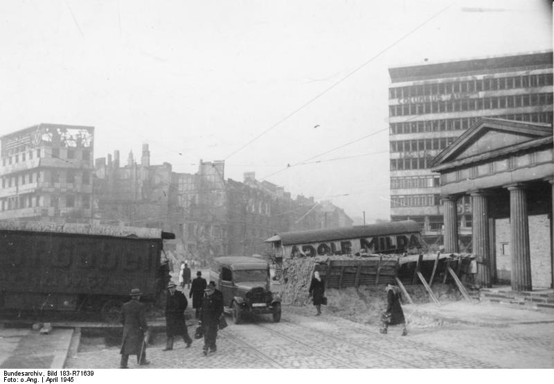
*Plac Poczdamski 
By Bundesarchiv, Bild 183-R71639 / CC-BY-SA 3.0, CC BY-SA 3.0 de, [Link](https://commons.wikimedia.org/w/index.php?curid=5368518)*

#### 1 Front Ukraiński

3 Gwardyjska Armia Pancerna generała Rybałki wkroczyła do Charlottenburga i Grunewaldu. Walczyła już w obębie wewnętrznej strefy obrony. Opór był zaciekły, szczególnie w rejonie stacji S-Bahn Schmargendorf i pobliskiego Hindenburgpark (obecnie Volkspark Wilmersdorf). Najcięższe walki toczyły się o Fehrbelliner Platz, gdzie Niemcy trzymali się jeszcze przez trzy dni. Kiedy wyeliminowano ostatni punkt oporu, oddziały Hitlerjugend na samochodach atakowały panzefaustami w całym obszarze Wilmersdorf.

Tu warto dodać, że Charlottenburg-Wilmersdorf to rejon w którym znajduje się obecnie polska ambasada.

### Hitler

Bunkier Hitlera stracił łączność z ostatnimi jednostkami poza Berlinem. Byli już odcięci. Moglin tylko słuchac radia i mieli łączność telefoniczną w obrębie miasta.

Podczas wieczornej konferencji Hitlera nagle zaniepokoiła nieobecność generała Hermanna Fegeleina, oficera łącznikowego Himmlera i szwagra Evy Braun. Okazało się, że nie ma go już od trzech dni. Podejrzewając dezercję Hitler rozkazał by go odnaleźć.

Znaleziono go w apartamencie na Bleibtreustrasse (boczna Kurfürstendamm), ponieważ nie dpowiedział na wezwanie wysłano po niego żonierzy. Był pijany, nieogolony i nieodpowiednio ubrany. Obiecał się doprowadzić do porządku. Następny patrol zastał go już odpowiednio ubranego i ogolonego, ale jeszcze bardziej pijanego. W zasadzie nie mieli prawa go aresztować bo był wyższy stopniem, ale rozkaz pochodził bezpośrednio od Hitlera. Zastali też kobietę i wyglądało na to że się pakują. Kobieta pod pretekstem znalezienia czystych szklanek oddaliła się do kuchni, ale po chwili okazało się, że uciekła przez okno. Fegelein ze znalezioną przy nim walizką został odprowadzony do Kancelarii Rzeszy i uwięziony w oczekiwaniu na proces, który nie mógł się odbyć natychmiast bo musiał wytrzeźwieć.

W międzyczasie pułkownik SS z eskorty Fegeleina zameldował Bormanowi, że w walizce znajdują się kosztowności, pieniądze i dokumenty. Zaczęli podejrzewać że to Fegeleien jest poszukiwanym przez nich od kilku miesięcy źródłem przecieków z bezpośrednego otoczenia Hitlera, a owa kobieta jest brytyjską agentką. Przekazali sprawę szefowi Gestapo Heinrichowi Müllerowi. Nad Fegeleinem zbierały się czarne chmury.

Kim była ta kobieta? Do dziś tego nie wiadomo.

### Operacja berlińska

Na drodze do Łaby 47 Armia sowiecka dotarła do Rathenow i Fehrbellin i wtedy się zatrzymała z powodu napotkania oporu ze strony XXXXI Panzerkorps generała Rudolfa Holste. Nie mogła nacierać dalej nie mając wsparcia na flankach.

### 9 Armia

12 Armia Wencka walcząc o połączenie z 9 Armią wieczorem dotarła do Ferch. To był punkt krytyczny bitwy o wyrwanie się z sowieckiej niewoli, już nawet nie żołnierzy 9 Armii, ale setek tysięcy Niemców.

Propaganda hitlerowska wciąż pracowała, publikowano artykuły, wciąż drukowano Völkischer Beobachter (chociaż ostatnie numery z końca kwietnia nie były dystrybuowane), radio zapewniało o sensie walki i jakimś tam zwycięstwie. Ale nawet najbardziej zatwardziali hitlerowcy w zwycięstwo nie wierzyli.

Pierwotnie połączenie obu armii miało zapewnić przewagę niemiecką na południu Berlina i zablokować uderzenie 1 Frontu Ukraińskiego. Taki plan zaakceptował Hitler i być może w taki wojskowy sens tej operacji wierzył Jodl kiedy go przedstawiał. Ale i dla dowództw Armii i przede wszystkim dla 200 tys żołnierzy nie była to już walka o zwycięstwo, walka z nieprzyjacielem, czy walka dla Niemiec, albo Fuhrera - jedyne o co walczyli to niewola amerykańska, bezpieczne obozy przejściowe i ucieczka przed sowietami. Wciąż mieli na to nadzieję.

### Steiner

Steiner został zmuszony przez generała Heinriciego dorezygnacji z 7 Dywizji Pancernej i 25 Dywizji Grenadierów Pancernych przydzielonych do latania resztek frontu na Odrze. Heinrici brew rozkazom Keitla umieścił je na linii Neubrandenburg - Neustrelitz, w celu osłony wycofujących sie jednostek reszty Grupy Armii Wisła.

### Samobójstwa hitlerowców

Hitlerowiec się zabija: Hans Schleif, architekt, archeolog, SS-man. Był badaczem mającym międzynarodową reputacje, nie był gorliwym hitlerowskim wandalem i nie wykonywał wszystkich zaleceń Gestapo. Dziś o 11 rano w Berlinie zabił swoich synów bliźniaków i drugą żonę, którą poznał jako asystentkę z ramienia Ahnenerbe, a na końcu siebie.

### 1 Front Ukraiński

27 kwietnia 2009 w Podłej Górze koło Świebodzina rozpoczęto ekshumacje zwłok niemieckich żołnierzy i cywilów, zamordowanych przez Armię Czerwoną i zakopanych w masowych grobach w 1945.

### 2 Armia WP

W tym samym czasie kiedy porzucono resztkę wiary w pomoc Schörnera i nawet Niehoff zrozumiał, że feldmarszałek nie przyjdzie na piechotę by podać mu rękę (choć przyznaje to tylko między wierszami swoich wspomnień). Grupa Armii Środek zadała swój ostatni śmiertelny cios.

Ta ostatnia kampania generała Karola "Waltera" Świerczewskiego kosztowała 2 Armię około 10 tysięcy zabitych, wielokrotnie większe straty w rannych i utratę większości sprzętu wojennego. W normalnym wojsku ktoś z brakiem doświadczenia i podobnym dorobkiem jak generał Walter nigdy by nie dostał całej Armii, a po takiej klęsce stanąłby przed sądem polowym, ale była to sytuacja podporządkowana potrzebom politycznym i Świerczewski był potrzebny nowym polskim i sowieckim władzom. Za masakrę pod Budziszynem nie spotkała go żadna kara, a dzieje tej bitwy zatuszowano. Co więcej, spadł na niego deszcz zaszczytów i 11 maja otrzymał awans na generała brygady. Walki w rejonie Budziszyna - choć już pozbawione znaczenia - trwały do końca kwietnia.

Po uporządkowaniu przez marszałka Koniewa kompletnego chaosu w jakim znalazła się polska 2 Armia pod Budziszynem nastąpił kolejny tragiczny rozdział tej kampanii.

9 Dywizja Piechoty, która bez żadnej przyczyny pozostała pod Dreznem, wczoraj dostała rozkaz wycofania się w rejon koncentracji, gdzie resztki polskich sił mogły spełnić przeznaczone im zadanie czyli osłaniać lewą flankę 1 Frontu Ukraińskiego.

Być może biorąc przykład ze swojego słynnego dowódcy szef dywizji pułkownik Aleksander Łaski zarządził odwrót jak na paradzie, nie dbając o zachowanie tajemnicy tajemnicy wojskowej i zabezpieczenie kolumn zwiadem i osłoną dopuścił do tego że Niemcy zdobyli mapy sztabowe z naniesioną marszrutą i mogli przygotować kilka śmiertelnych zasadzek w wyniku której Dywizja straciła prawie połowę stanu osobowego i cały sprzęt ciężki.

Najbardziej tragicznym epizodem tych walk była egzekucja (nie da się tego nazwać inaczej) ewakuowanego spod Drezna szpitala polowego podczas której zamordowano ponad 300 ciężko rannych żołnierzy polskich.

### 04-28

### Berlin

#### Od północy

Po opanowaniu Gatow rano 175 Dywizja Strzelecka 125 Korpusu Sytrzeleckiego 47 Armii, ze wsparciem 50 Gwardyjskiej Brygady Pancernej i 23 Gwardyjskiej Brygady Zmechanizowanej zatakowała Poczdam od połmnocy.

W tej sytuacji dowódca garnizonu generał Reymann, nie mając szans na połączenie z Berlinem podjął decyzję o ewakuacji 20 tys załogi. Wycofali się, opuszczając miasto i dotarli do znajdującej się na południowym końcu Schwielowsee awangardy 12 Armii generała Wencka.

Otoczona fosą jedna z najlepiej zachowanych twierdz renesansowych w Europie i cel wielu wycieczek: Cytadela Spandau (niem. Spandauer Zitedelle) na ujściu Sprewy do Haweli skapitulowała przed 1 Korpusem Zmechanizowanym 2 Gwardyjskiej Armii Pancernej. Dowódca twierdzy i jego zastępca zginęli w atakach na czołgi sowieckie. Zniszczyli trzy panzerfaustami. Sowieci po tym jak dowiedzieli się, że są tam składy gazów trujących zrezygnowali z bombardowania (w rzeczywistości było to niewielkie ilości w laboratoriach). Wejście do twierdzy blokował stary francuski czołg więc emisariusz dostał się do środka rozwiniętą mu drabiną sznurową. Z dominującej nad twierdzą Juliusturm rociagał się znakomity widok na  Charlottenbrücke - jedną z głównych potencjalnych dróg ucieczki z Berlina.

Generał Bogdanow dowódca 2 Gwardyjskiej Armii Pancernej po tym jak pozostawił Ruhleben przygotował swoje siły do trzech ataków z samego rana.

- 1 Korpus Zmechanizowany skoncentrował się na kolanie Sprewy na północ od ogrodów Schloss Charlottenburg gdzie śluzy zapewniały przejscie dla piechoty.
- 219 Brygada Pancerna na przylegającą stację S-Bahn Jungfernheide, silny punkt oporu, były tam przejścia podziemne przez ciąg torów kolejowych do Charlottenburga
- 12 Gwardyjski Korpus Pancerny razem z 79 Korpusem Strzeleckim przekroczył Westhafenkanal i wdarł się do Moabit gdzie walczył o teren miedzy Sprewą a ujściem Landwehrkanal. Tylko ten trzeci atak zakończył się sukcesem.

28 kwietnia 1945 po południu żołnierze 79 Korpusu Strzeleckiego posuwający się Alt Moabit są pierwszymi piechurami Armii Czerwonej, którzy dostrzegli Reichstag. Wywolało to wielkie poruszenie i dowódca Korpusu generał Pierwiertkin (sprawdzić ot nazwisko), pospieszył sprawdzić to osobiście. Co więcej umieścił swój sztab w wysokich biurowcu Zollpackhof z widokiem na most Moltkego i podejście do Rechstagu.

150 Dywizja Strzelecka zajęła okolicę, 171 Dywizja Strzelecka rozlokowała się w ruinach Lehrter Bahnhof (obecnie znajduje się tam Hauptbahnhof) po drugiej stronie ulicy.

Bezpośrednio po lewej był Schiffahrtskanal czyli granica terenu zajętego przez Korpus. Za nim wciąż trzymali się Niemcy na północ aż po Invalidenstrasse stawiajac opór 12 Gwardyjskiemu Korpusowi Strzeleckiem.

Czerwonoarmiści z uwagą przypatrywali się przeszkodzie, która ich czekała. W tym miejscu Sprewa ma 50 m szerokości, oba brzegi są wysokie, licowane kamieniem. Masywny i szeroki Moltkebrücke, kamienny, nie dający żadnej osłony, z barykadami na obu końcach, przeszkody z drutu kolczastego i miny. W widoczny sposób przygotowany do wysadzenia w powietrze.

Po drugiej stronie Sprewy zniszczone budynki dzielnicy rządowej i dalej w tle ich najważniejszy cel - masywny gmach Reichstagu. Zwiad lotniczy informował, że cały teren przed Reichstagiem jest pokryty gęstą siecią przeszkód przeciwczołgowych, okopów i stanowisk ogniowych. Jest przecięty wielkim rowem przeciwczołgowym zalanym wodą. W Tiergarten jedno przy drugim stanowiska artylerii, wejścia do Reichstagu zamurowane, a na szczycie, wokół kopuły stanowiska karabinów maszynowych.

Jak się okaże to jeszcze nie wszystko co ich czekało.

Ze względu na niewielki obszar "Cytadeli" Armia Czerwona zrezygnowała ze wsparcia lotniczego w tej ostatniej walce. Ale artyleria otrzymała dostateczną ilość amunicji.

Zdecydowano się na atak z zaskoczenia, plan polegał na wysłaniu po jednym batalionie z każdej dywizji awangardy i rozwinięciu przyczółka w lewą stronę. 150 Dywizja Strzelecka zdobędzie budynek pruskiego MSW, a 171 Dywizja Strzelecka oczyści resztę dzielnicy dyplomatycznej. To będzie baza do ataku na Reichstag.

Dotychczasowe straty zostały uzupełnione przez wcielonych jeńcow wojennych i znowu każdy batalion miał 500 ludzi i trzy kompanie. Pod komende 79 Korpusu Strzeleckiego oddano 10 niezależny batalion miotaczy ognia i 23 Brygade Pancerną.

Obronę szacowano na 5 tys żołnierzy. Było to głównie SS, ale był też Batalion Marynarki Grossadmiral Dönitz składający się z techników radarowych. dwa bataliony Volkssturmu i elementy 9 Dywizji Spadochronowej. Wsparcie zapewniała artyleria, przede wszystkim dziala 8,8 cm i możdzierze.

Atak miał nastąpić o północy.

#### Od wschodu

5 Armia Uderzeniowa naciera w rejonie Friedrichshain Flakturm, jeden z korpusów dotarł na obrzeża Alexanderplatz, a inny pomimo zaciętej obrony zajął rejon Spittelmarkt. To mniej niż 1,5 km od Nowej Kancelarii Rzeszy.

Choć 5 Armia uderzeniowa utrzymywała postep, nadal w rejonie Alexanderplatz i Giełdy (wówczas przez Sprewę sąsiadowała z Katedrą) panował chaos.

Zaciekłe walki trwały wokół Friedrichshain Flakturm i w całym rejonie Landsberger Allee i Frankfurter Allee. Wieża trzymała się do końca bitwy, ale cywilów wyrzucono w nocy 23 kwietnia. Przed opuszczeniem została wysadzona od środka i zawaliła się. Na szczęście ewakuowana z berlińskich muzeów kolekcja dzieł sztuki była przechowywana w sąsiedniej wieży radarowej i nie została uszkodzona.

Schlesischer Bahnhof (obecny Ostbahnhof) wciąż się bronił.

32 Korpus Strzelecki zaatakował Fischerinsel (południowa część Wyspy Muzealnej na południe od Getraudenstrasse). Marszałek Żukow uważał to za jednio z najtrudniejszych zadań podczas bitwy o Berlin. Niewiele wiadomo o tym ataku, najprawdopodobniej pomógł w nim oddział Flotylli Dnieprzańskiej i użyto miejscowych barek z Osthafen. Nie było tu mostów, a brzegi są wysokie i licowane kamieniem.

9 Korpus Strzelecki na zachodnim brzegu zdobył Spittelmarkt, który już przedtem zniszczony przez obrońców ogniem artyleryjskim. W końcu dnia awangarda 5 Armii Uderzeniowej znalazła się na wschodnim końcu Leipziger Strasse.

W tym mmomencie zarówno od północy, od wschodu jak i od południa Armia Czerwona miała ok 1,5 km do Hitlera.

#### Od południa

Żołnierze generała Czujkowa postawili zasłonę dymną i ustawili stanowiska ciężkiej artylerii na większych placach z dobrą ekspozycją na strefę celu. Bezpośrednio przy kanale ustawiono lekką artylerię. Amunicji nie brakowało. Trzeba było uważać, żeby nie przestrzelić, przeciwna linia frontu była niecałe 3 km na północ.

Strefa ataku rozciągała się od siedziby generała Weidlinga OKW w Benderblock do obecnego Mehringplatz. Było to ok 2,5 km. Każda atakująca na tym odcinku jednostka musiała się dostosować do istniejących możliwości. Jedynym nietkniętym mostem był Potsdamer Brücke, atakiem na tym odcinku Czujkow zdecydował się pokierować osobiście.

Ogniem amfiladowym oczyścił teren z artylerii, czołgów i stanowisk pancerfaustów. Jak się później okazało w niedostatecznym stopniu. Zwiad nie znalazł dogodnych przejść podziemnych, ale zdecydowano się wysłać grupy sabotażu.

#### 1 Front Ukraiński

Z samego rana 3 Gwardyjska Armia Pancerna generała Rybałko przypuściła atak na prawą flankę: z rejonu Badensche Strasse między Kaiserallee (obecnie Bundesallee) i Potsdamer Strasse w kierunku Landwehrkanal, gdzie planowano dotrzeć do końca dnia. Dla wsparcia 55 Gwardyjska Brygada Pancerna została odwołana z blokady Westendu. Osią Kantstrasse miała nacierać w kierunku stacji Charlottenburg, Savignyplatz i Zoo.

Wtem, przygotowanie artyleryjskie wykazało, że na kierunku ataku jest Armia Czerwona! Przecież już od poprzedniego dnia Landwehrkanal aż po Zoo został opanowany przez 8 Gwardyjską Armię Pancerną generała Czujkowa. Oczywiście ani Koniew ani Rybałko nie zostali o tym powiadomieni i 3 Armia nadziała się na oddziały 8 Gwardyjskiej Armii Pancernej. Rozpętała się bratobójcza walka. Jak to przyznał jeden z dowódców 1 Frontu Ukraińskiego:
>Bardziej niż wroga boimy się swoich. W Berlinie nie ma nic bardziej przygnębiającego niż zobaczyć sukces sąsiada

Natychmiast, w trakcie ataku 9 Korpus Zmechanizowany i wspierajaca go 61 Gwardyjska Dywizja Strzelecka przeszły na lewą flankę i uderzyły na Savignyplatz. Koniew zrozumiał, że został odcięty od Reichstagu i polecił Rybałce by jak najlepiej wypełnił swoją rolę. Wiele zaryzykował koncentrując całą siłę w jednym miejscu i pozostawiając tylko jedną brygadę pomiędzy Hawelą i Wilmersdorf.

W rezultacie w ciągu dwóch dni wiele oddziałów 1 Frontu Ukraińskiego bezpośrednim rozkazem Stawki została wycofanych z Berlina, co w odczuciu wszystkich żołnierzy Frontu było niehonorowym odebraniem im triumfu zdobywców Berlina. Marszałek Koniew poniósł klęskę w wyścigu do Reichstagu.

O północy czasu moskiewskiego (2200 w Berlinie) z Kremla przyszły nowe wytyczne: linia podziału biegła Mariendorf - Stacja Tempelhof- Viktoria-Luise-Platz - Stacja Savigny i dalej linią kolejową przez stacje Charlottenburg, Westkreuz i Witzleben.

Elementy 55 Gwardyjskiej Brygady Pancernej, które wciąż pozostały w Westendzie żeby zająć obronę wyprowadziły trzy ataki na Ruhleben:

- zdobyli stanowiska artylerii na terenie Reichsakademie für Leibesübungen  (hitlerowska AWF) na tym samym wzniesieniu co Stadion Olimpijski
- potem zepchnęli obronę przez poligon Ruhleben w stronę Schülerbergkaserne (po wojnie brytyjskie Alexander Barracks) gdzie mieściło sie dowództwo sektora "F", broniło się tam ok tysiąca żołnierzy, resztki sił broniących przedtem Spandau i Siemensstadt. Bronili linii baraków i stacji Ruhleben U-Bahn. Nagle dostali wsparcie około 2 tys chłopców z Hitlerjugend pospiesznie pozbieranych po okolicznych domach, w większości nieuzbrojonych. Broń mieli zbierać u zabitych.
- trzeci atak z użyciem czołgów wzdluż Charlottenburger Chaussee dotarł aż do bramy koszar

O 2200 10 Gwardyjski Korpus Pancerny wsparty przez 350 Dywizję Strzelecką wyprowadził atak przez Teltowkanal na południowo zachodni koniec "wyspy" Wannsee, w ciągu godziny powstał przyczółek. Zbudowali most pontonowy. Resztki 20 Dywizji Grenadierów Pancernych stawiały zaciekły opór. Koniew pisze, że nie była to jego inicjatywa i uznał to za marnowanie środkow potrzebnych na walkę z 9 i 12 Armią.

Ta akcja nastapiła po wzieciu "wyspy" przez elementy 47 Armii i 9 Gwardyjskiego Korpusu Pancernego tego samego dnia. Jeszcze tej nocy 9 Gwardyjski Korpus Pancerny wrócił pod komendę 2 Gwardyjskiej Armii Pancernej, która toczyła ciężkie walki w Charlottenburg i Moabit i od 1 Korpusu Zmechanizowanego przejał role rezerwy w Siemensstadt.

#### Obrona

Kronikarz Dywizji Pancernej Müncheberg:
>Te lotne sądy kapturowe pojawiały się dzisiaj szczególnie często. W większości to młodzi oficerowie SS bez odznaczeń, zaślepieni i fanatyczni. Nadzieja na pomoc i strach przed nimi trzyma naszych ludzi w akcji. Generał Mummert zażądał żeby nie pojawiały się na naszym odcinku. Dywizja, w której jest tylu udekorowanych żołnierzy nie zasługuje na prześladowanie ze strony młodzików. Postanowił, że rozstrzela każdy sąd kapturowwy, na który się natknie.

Na tym etapie Hitler stracił jakikolwiek wpływ na przebieg bitwy.

Siły Weidlinga były ograniczone do obszaru od Alexanderplatz na wschodzie, jakies 15 km do Stadionu Olimpijskiego i brzegów Haweli na zachodzie. Nie więcej jak 3 do 5 km wszerz. Było to 30 tys żołnierzy i niewielka liczba czołgów. Brakowało wszystkiego, przede wszystkim jedzenia i amunicji. Oceniał, że mogą wytrzymać jeszcze dwa dni. Wciąż liczył na wyrwanie się z okrążenia i połączenie z 12 Armią. Nawet przedstawił taki plan Hitlerowi, ale Hitler zadecydował, że mają wytrwać do końca. Weidling więc też nie miał już wpływu na wypadki, dowództwo przejął zbyt późno by mógł zorganizować obronę. Jedyne co zdołał zrobić to wyznaczyć odpowiednich ludzi i uproscić organizację obrony. 

### Grupa bojowa Steinera

O 0400 Steiner zapewnia Keitla, że choć uzupełnienia się opoźniaja szykuje nakazane natarcie. Keitel obiecał mu uzpełnienie dywizją RAD Infanterie-Division Schlageter, która jednak już nie istniała. Steiner musiał być świadomy, że obaj blefują. 

Hitler oczekiwał na to natarcie Steinera z rosnacą niecierpliwością. W końcu wyznaczył na miejsce Steinera generała Holste dowódcę 41 Korpusu Pancernego z rozkazem rozpoczęcia ataku w ciagu 48 godzin. Holste był w drodze.

Wracając do sztabu Jodla Keitel odkrył co się stało z 7 Dywizją Pancerną i 25 Dywizją Grenadierów Pancernych oraz to, że 3 Armia Pancerna wbrew rozkazom Hitlera jest w odwrocie. Wsciekły wezwał Heinriciego i von Manteuffla na spotkanie na skrzyżowaniu na zachód od Neubrandenburga. Szef sztabu von Manteuffla podejrzewał podstęp i przygotował kontrzasadzkę na tym skrzyżowaniu. Ale doszło tylko do burzliwej wymiany zdań. Keitel oskarżył obu generałów o zdradę i sabotowanie rozkazów. Na co Heinrici odpowiedział że nie można wykonać rozkazów oderwanych od rzeczywistości, wobec tego Keitel zarzucił im tchórzostwo krzycząc, że nie byli zdolni do rozstrzelania dla postrachu kilku tys dezerterow. Wtedy Heinrici zaproponował Keitlowi, żeby sam zaczął ich rozstrzeliwać zaczynając od żołnierzy, których całe kulumny zmierzały na zachód drogą przy której się spotkali. Keitel zwiesił głowę i odszedł bez słowa.

### 12 Armia

Jedyną nadzieją dla Berlina była 12 Armia generała Wencka, 27 kwietnia wieczorem dotarł do wsi Ferch odległej od Poczdamu 14 km i wciąż trzymał tę pozycję. Nie mógł jednak posunąć się naprzód. Korzystając ze wsparcia 12 Armii Wencka z zachodu, Niemcy rozpoczęli odwrót wzdłuż jezior na południe od miasta.

Atak oddzielił 6 Gwardyjski Korpus Zmechanizowany, rozciągnięty w kolumnie o długości prawie 30 km, od reszty 4 Gwardyjskiej Armii Pancernej. 5 Gwardyjski Korpus Zmechanizowany i 13 Armia uformowały podwójny front. Spodziewano się, że 9 Armia niemiecka dokona próby przełamania, a reszta 4 Gwardyjskiej Armii Pancernej była wciąż zangażowana w rejonie Poczdamu i "wyspy" Wannsee. Koniew ulokował korpusy odwodu 13 Armii w Jüterbog. Jak się później okaże, miejsce wybrał nieprzypadkowo, oczekiwano tam 9 Armii.

### 9 Armia

Wieczorem 28 kwietnia zakończyły się przygotowania do wyrwania się z okrążenia. Po włączeniu elementów z innych jednostek jego formacja była gotowa do pzredarcia sie wąskim sektorem pomiedzy Halbe a Märkisch Buchholz na zachód od rzeki Dahme. Jego celem było uratowanie ilu się tylko da od sowieckiej niewoli. Rozkazy od Hitlera mówiły o połaczeniu się z 12 Armią k Jüterbog w celu przyjścia z pomocą Berlinowi, ale od dawna był w kontakcie z generałem Wenckiem, który tak samo jak on miał na celu tylko ewakuację. Wenck doradził mu marsz na Beelitz, gdzie jak uważano linie sowieckie sa najsłabsze. I rzeczywiscie konczyła się tam strefa 5 Gwardyjskiego Korpusu Zmechanizowanego.

Punkt przełamania wybrano na Halbe, gdzie stykały się wojska obu Frontów. Stamtąd do pokonania było ponad 50 km terenów leśnych przez Luckenwalde. Trzeba było poruszać się w dzień i w nocy, bez przrwy, trzymajac sie lasu. Wszystko co nie było niezbędne zostało zniszczone. Przepompowano paliwo do sprawnych pojazdów i zniszczono resztę, broń do której nie było amnunicji została porzucona. Wszyscy żołnierze zostali uzbrojeni, nie było jednostek niebojowych. Planowano poruszanie się ciasnym klinem. Artyleria z zapasem kilku pocisków na lufę została skoncentrowana na Halbe. Mieli przeciwko sobie siły trzech Armii 1 Frontu Białoruskiego oraz dwóch 1 Frontu Ukraińskiego. Dziesiątki tysięcy cywilnych uchodźców mieszały się z wojskiem. Zaczynali rozumieć jak niewielkie mają szanse na przeżycie. Sowieckie lotnictwo dostrzegło ruch wojska i przygotowało się do bombardowania przepraw na Dahme.

O zmroku zaczął się krótki artyleryjski baraż i XI. SS-Panzerkorps zaatakował przecierając drogę. Na końcu lewego skzydła 3 Armii Gwardyjskiej był 21 Korpus Strzelecki rozlokowany w lasach pomiędzy drogą Halbe - Teupitz a Teurow, nad rzeką Dahme, która nagle stała sią linią frontu aż po Märkisch Buchholz gdzie znajdował się 120 Korpus Strzelecki tej samej armii. 

Do likwidacji 9 Armii wyznaczono 1 Gwardyjską Dywizję Artylerii. Działania Armii Czerwonej ułatwiała autostrada Drezno - Berlin, która stała się główną drogą zaopatrzenia.

Po nocy rozpaczliwych walk o świcie dokonano przełamania. Rozpętała się gorączkowa walka, wiekszość XI. SS-Panzerkorps i V Korpus przedostały się pod ogniem, ale  w bardzo chaotyczny sposób, co utrudniało zadanie wszystkim jednostkom podązającym za nimi. Jak się wydaje, wyłamanie zostało zamknięte zanim dotarł tam V. SS-Freiwilligen-Gebirgskorps. Główny korpus przedzierał się na zachód przez lasy, aby wieczorem dotrzeć do sowieckiego kordonu na drodze Zossen - Baruth.

### Grupa Armii Wisła

Ok 2300 von Manteuffel zadzownił do Heinriciego z informacją, że połowa jego dywizji i cała obrona plot jest w odwrocie. Powiedział mu, że nie widział czegoś takiego od 1918. Sto tysięcy ludzi zmierzało na zachód. Zaproponował by Jodl sam to obejrzał. Heinrici przekazal informacj Keitlowi i poprosił o pozwolenie na opuszczenie Swinemünde (pl Świnoujście) gdzie garnizon kadetów Marynarki był zagrożony odcięciem. Keitel oskarżył go o nieposłuszeństwo, na co Heiinrici odrzekł, że rozkazy były niewykonalne. Keitel natychmiast zwolnił go z dowództwa i po czym oznajmił mu, że gdyby tylko mógł to by go postawił przed sądem polowym.

### Hitler

Ok 2100 z Radia Stockholm, z serwisu BBC dotarło do Hitlera doniesienie Reutersa, że Heinrich Himmler, "*meine treue Heinrich*" (pl. mój wierny Henryk), jak o nim mówił Hitler, jego najlepszy człowiek, samodzielnie, bez jego wiedzy podjął negocjację z aliantami oferując kapitulację. Hitler doskonale wiedział, że nie istniał żaden zaufany telefon z którego Himmler mógł skorzystać do nawiązania łączności. Jeżeli teraz o tym powiedzieli alianci, to znaczy, że rozważyli tę propozycję zanim ją odrzucili, że dostali ją za pośrednictwem zaufanego łącznika, że Himmler znalazł takiego łącznika. To wszystko wymagało czasu, musiało trwać wiele tygodni. Przez cały ten czas Himmler był w pobliżu, wierny i gotowy do usług, a jednocześnie szukający własnej drogi do jego śmiertelnych wrogów. To był cios w samo serce.

Jakkolwiek sytuacja nie wydawałaby się przegrana, nawet w wigilię samobójstwa, nawet kiedy nie ma już nic do przegrania, ciągle jeszcze można wymierzać sprawiedliwość. Himmler był poza zasięgiem. Ale jego oficer łącznikowy był w Berlinie, jeszcze niedawno był w bunkrze. Jego można było dopaść. Gruppenfuhrer SS Hermann Fegeleien, mąż siostry Ewy Braun, więc niedoszły szwagier Hitlera został schwytany w domu gdy przebierał się w cywilne ubranie i szykował się do ucieczki z Berlina. W każdym razie tak twierdzili żołnierze, którzy go zatrzymali. Jeszcze tego dnia z wyroku sądu wojskowego został skazany na śmierć i rozstrzelany. Jego żona przebywająca w Berghof, odmówiła wstawienia się za nim, choć był ojcem jej dziecka.

Siostry Braun to kolejny temat, który z braku czasu pozostał nieruszony. Była jeszcze trzecia, najstarsza siostra Ilse, która nie miała nic wspólnego z polityką. Nie należała do kręgu Hitlera, nie była w NSDAP. W 1941 po raz drugi wyszła za mąż i przyjechała do Wrocławia gdzie pracowała w Schlesische Zeitung, nikt prawdopodobnie nie był świadomy jak blisko jej do Hitlera, nazwisko Braun nigdy nie pojawiło się w mediach. Kochała taniec, brała udział w mistrzostwach tańca towarzyskiego amatorów i osiągała mistrzowskie wyniki. Kiedy wybuchła panika w styczniu 1945, ten jeden raz skorzystała ze swojej uprzywilejowanej pozycji i uciekła w głąb Rzeszy. Umarła w Monachium w 1979 w wieku 70 lat.

Hanna Reitsch 2 dni temu przyleciała by namówić Hitlera do ucieczki. Tylko ona potrafiła wyprowadzić bezpiecznie samolot ponad ogniem nieprzyjaciela. Spotkała się z odmową. Hitler był zdecydowany pozostać w bunkrze, wobec tego gotowa była popełnić samobójstwo razem z nim. Ale oboje z von Greimem otrzymali wyraźne rozkazy, mieli opuścić Berlin i schwytać tego zdrajcę Himmlera.

Hitler poinstruował von Greima żeby użyc wszystkich sił Luftwaffe do obrony Berlina, a przede wszystkim znaleźć i ukarać Himmlera. Von Greim był ranny i cierpiał. Zostal odwieziony do Hermann-Göring-Strasse (obecnie Ebertstrasse) gdzie było prowizoryczne lotnisko. Wznieśli sie na 4,5 tys stóp. Poleciał do Rechlin.

Z tego samego improwizowanego lotniska polowego na Tiergarten wylecieli razem z von Greimem, udając się w ostatnią misję, samolotem Arado Ar 96. Wpadli w ogień 3 Armii Uderzeniowej która zmierzała na Tiergarten z północy, ale udało im się opuścić Berlin. Sowieci zawzięcie strzelali do każdego samolotu, przypuszczali bowiem, że Hitler będzie chciał uciec z Berlina samolotem.

I tutaj kolejna zagadkowa kwestia - Tony Le Tissier, brytyjski historyk, który napisał najdokładniejszy opis bitwy berlińskiej z jakiego korzystam "The Battle of Berlin 1945" cały czas pisze, że pilotem zarówno do lotniska Gatow, jak i z Berlina był "nieustrażony chorąży", którego nazwiska nie podaje. Przy czym Reitsch była cały czas pasażerką. Wszyscy w Niemczech wiedzieli, że Reitsch jest jednym z kilku najdoskonalszych i najbardziej nieustraszonych pilotów. Uważam, że to ona pilotowała samolot von Greima na wszystkich trzech odcinkach. Jest to kwestia do sprawdzenia.

Jak powiedziała później, składając zeznania, był to "*najczarniejszy dzień, kiedy nie mogliśmy umrzeć u boku naszego Führera*" rozpłakała się "*powinniśmy uklęknąć z szacunkiem i oddać hołd świątyni ojczyzny*", zapytana przez przesłuchujących co ma na myśli odrzekła zdumiona "*jak to, przecież bunkier Hitlera*".

Von Greim został schwytany przez aliantów i po tym jak dowiedział się, że jest przeznaczony do wymiany, tzn zostanie przekazany sowietom, 24 maja popełnił samobójstwo.

W nocy Hiler ogłosił chęć poślubienia Evy. Goebbels zaczął szukać wystarczajaco ważnego urzędnika. Ok 0130 następnego dnia do bunkra przybył prosto z linii frontu zdumiony Gauamtsleiter Walter Wagner, ciągle miał założoną opaskę Volkssturmu. 

### 04-29

### 12 Armia

12 Armia generała Wencka utknęła na południe od Poczdamu. Została zablokowana przez Armie Czerwoną. Wenck wysłał radiogram do Weidlinga, że nie da rady zbliżyć się bardziej do Berlina. Jego pozycja umożliwiła ewakuację garnizonu poczdamskiego, ale to wszystko co mógł zrobić. Był zagrożony zarówno przez niespodziewany atak Amerykanów na Wittembergę jak i trwające od kilku dni próby 5 Gwardyjskiego Korpusu Zmechanizowanego i 13 Armii (1 Front Białoruski) odcięcia 12 Armii od Łaby.

Wieczorem wysłał wiadomość do Keitla, że atak na Berlin nie jest możliwy.

### 9 Armia

Generał Busse wiedział, że 12 Armia długo nie utrzyma pozycji. Jego 9 Armia, której część wyrwała się z okrążenia, zdołała się przebić przez pozycje 28 Armii sowieckiej i podążała na pozycje niemieckiej 12 Armii, była masakrowana przez sowiecką artylerię. Kierowała się na Luckewalde, dziś wieczorem brakowało jej 12 km do tej pozycji. Przedarcie się przez pierwsze linie obrony nie oznaczało przełamania kordonu. Teren był zadrzewiony, ale nie dość gęsto by można było ukryć wojsko. Najgorsza była sytuacja cywilnych uciekinierów. Większość z nich już nie żyła lub zrezygnowała z ucieczki, niemieckie wojsko nie mogło im dać żadnej ochrony, a wręcz przeciwnie - na całej drodze ucieczki ściągało ogień artylerii.

Kontakt z V. SS-Freiwilligen-Gebirgskorps i 21. Panzer-Division został utracony. Jednostki 9 Armii były w chaosie. Jatka trwała dwa dni do 30 kwietnia. Sowieci potem wyliczyli, że zabili 60 tys żołnierzy, 120 tys wzięli do niewoli, zdobyli 300 pojazdów pancernych i 1,5 tys jednostek artylerii. Autostrada na całym tym odcinku była zatłoczona wrakami pojazdów i trupami.

Jeszcze tego samego dnia Busse powiadomił Wencka, że robią co tylko mogą, ale zarówno morale jak i sytuacja wyglądają fatalnie. Szczegónie cierpią cywile. Możliwość ataku i stawiania oporu jest na krawędzi wyczerpania.

Jeżeli pamiętamy historię "ruchomego kotła" Nehringa to jest coś podobnego tylko kilka razy bardziej. Ostatecznie do Głogowa dotarło ok 100 tys żołnierzy, tu natomiast sama liczba ofiar śmiertelnych to 60 tys, a do niewoli dostało się 120 tys żołnierzy. Walka była bez porównania bardziej bezwzględna, Niemcy nie mogli liczyć na to że zasłonią ich chmury czy mgła.

### Grupa Armii Wisła

Generał von Manteuffel otrzymał rozkaz przejęcia dowództwa na Grupą Armii Wisła, ale lojalny wobec Heinriciego odmówił. W tej sytuacji Keitel i Jodl na dowódcę wyznaczyli generała Studenta, ale ten był w Holandii. W międzyczasie zanim Student obejmie komendę, dowódcą miał być von Tippelskirch, ale on też początkowo odmówił. W końcu się zgodził, ale prawdopodobnie tylko dlatego, że nie miało to już żadnego znaczenia.

2 Front Białoruski zdobył tereny do linii Anklam - Neubrandenburg - Neustrelitz oraz przekroczył Hawelę w rejonie Zehdenick - Liebenwalde. Od strony Łaby brytyjska 21 Armia utworzyła przyczółek w Lauenburg. Zagroziło to obszarowi Łaba - Lubeka, czyli pozycji Heeresgruppe Nordwest marszałka Ernsta Buscha.

### Berlin

#### Od północy

Z samego rana przełom na odcinku 2 Gwardyjskiej Armii Pancernej

1 Korpus Zmechanizowany: stacja S-Bahn Jungfernheide zdobyta, saperzy zbudowali rampy z gruzu, po których czołgi wjechały na tory kolejowe. Po przejechaniu mostu kolejowego na Sprewie wdarły się do ogrodów Schloss Charlottenburg.

12 Gwardyjski Korpus Pancerny z silnym wsparciem artylerii zdobywał zachodnią część Moabit kierując się na ujście Landwehrkanal.

Walki w terenie zajętym przez 12 Gwardyjska i 7 Korpus Strzelecki 3 Armii Uderzeniowej były kontynuowane, ale w tym samym zamieszaniu i braku jasnego rozgraniczenia pozycji swój-obcy. Silną obronę napotkano w rejonie Stettiner Bahnhof (obecnie Nordbahnhof).

79 Korpus Strzelecki śmiały i krwawy atak przez most Moltkego, już o 0200 budynek na rogu Moltkestrasse (odpowiada obecnej Willy-Brandt-Strasse) i nadbrzeża zdobyty. Były to dawne ambasady Turcji i Węgier. Atak wspierała artyleria zgromadzona na Zollpackhof i Washingtonplatz. Pierwszą barykadę zepchnięto, reszta przeszkód pozostała, każde opóźnienie w biegu przez most ksoztowało życie. Czerwonoarmiści byli rażeni również ogniem z tyłu, zza Lehrter Bahnhof gdzie wciąż były pozycje niemieckie. Niemcom udało się w końcu wysadzić most, ale zniszczone zostało tylko pół przęsła, więc nawet czołgi mogły przejechać.

3 Armia Uderzeniowa: 150 Dywizja Strzelecka zdobywała kolejne budynki na Moltkestrasse, a 171 Dywizja Strzelecka czyściła przyczółek z pomocą 525 pułku po lewej na Kronprinzenufer (obecna Bettina-von-Arnim-Ufer) i 300 pułkiem w centrum.

O świecie już liczne pododdziały, w tym batalion miotaczy ognia były po południowej stronie Sprewy, saperzy czyścili przejścia dla czołgów. Samo zagęszczenie jednostek i straty świadczą o determinacji dowództwa sowieckiego. Są całe pułki, których numery po raz ostatni pojawiają się w meldunkach z walk o dostęp do Reichstagu.

Przyczółek znajdował się w trójkącie obecnej ulicy Willy Brandta, aż po ambasadę szwajcarską i od niej dokładnie na północ do Sprewy. Od Reichstagu dzieliło ich zaledwie 300 metrów.

O 0700 po 10-minutowym barażu artyleryjskim 150 Dywizja Strzelecka zdobyła Pruskie MSW, jak to sowieci nazywali "Dom Himmlera". Obrona SS była tak zaciekła, że trzeba było wezwać jeszcze 674 pułk do zdobycia płonącego budynku.

Między 0300 a 1000 intensywne bombardowanie Reichstagu. Samo zdobycie pruskiego MSW zajeło 24h.

#### Od wschodu

5 Armia Uderzeniowa: na odcinku 26 Gwardyjskiego Korpusu Strzeleckiego który był teraz po obu stronach Sprewy 1008 i 1010 Pułki Strzeleckie z 266 Dywizji Strzeleckiej z pomocą czołgów i dział samobieżnych atakowały siedzibę władz Berlina, znienawidzony przez Hitlera wielki Czerwony Ratusz zamieniony w punkt silnej obrony. Po wdarciu się do środka trzeba było walczyć o każde pomieszczenie w gęstym dymie pożaru.

32 i 9 Korpus Strzelecki walczyły z SS Nordland Panzergrenadier Division i innymi oddziałami SS na drodze do Kancelarii Rzeszy.

#### Od południa

Już godzine przed przygotowaniem artyleryjskim piechota zajęła pozycje na odcinku 29 Gwardyjskiej Dywizji Strzeleckiej przy Moście Poczdamskim. Piechota rzuci się wpław korzystając z prowizorycznych tratw i skoczy przez most skryty w zasłonie dymnej. Był między nimi chorąży 220 Gwardyjskiego Pułku Strzeleckiego sierżant Nikołaj Masało i jego dwóch asystentów. Jak mówi legenda kiedy usłyszał płacz dziecka po drugiej stronie, za pozwoleniem dowódcy oddał sztandar i przełynął kanał, odnalazł dziecko płaczące przy zabitej matce i przepłynął z nim z powrotem.

Sowieccy pancerniacy zagrożeni przez wszechobecne w walce miejskiej panzerfausty od jakiegoś czasu stosowali prowizoryczne środki zabezpieczajace, okładali czołgi workami z piaskiem, metalowymi ramami łózek ze sprężynami i płytami metalowymi. Tego dnia ta psychologiczna raczej niż wojenna praktyka bardzo się przydała. Saperzy rozbroili miny na moście, ale pierwszy szturm przez most zakończył się krwawym fiaskiem, zarówno piechota jak i czołgi poniosły straty. Okazało się, że w ciągu ulicy byl wkopany Tygrys który po kolei eliminował sowieckie T-34. Czerwonoarmiści uciekli się do podstępu, obłozyli taką prowizoryczną osłonę kanistrami z benzyną podpalili. Czołg ruszył i przejechał przez most. Dla przeciwnika wyglądał jak zniszczony pojazd poruszający się po utracie kontroli, szkoda na niego amunicji. Niespodziewanie, dopiero kiedy był w dobrej pozycji strzeleckiej otworzył ogień i zniszczył stanowisko Tygrysa.

29 Gwardyjska Dywizja Strzelecka z prawej flanki kanałami przedostała się na tyły wroga.

Inna jednostka z tej samej dywizji kompania 128 Gwardyjskiego Pułku Strzeleckiego przedostała się zniszczoną kładką na stację Möckernbrücke U-Bahn, za nimi podążyła reszta batalionu.

Bardziej na wschód na Hallesches Tor udało się skonstruować most pontonowy, przez który przejechały czołgi.

Straty tego dnia były ogromne. Obrońcy zręcznie ukryli stanowiska ogniowe, osłonięte przed ogniem na wprost raziły atakujących z flanki. Czujkow zdecydował o koncentracji artylerii bezpośrednio przy Kanale, żeby jak to określił "*wybić klina klinem*". Zadaniem arrtylerii było także wsparcie na dalszym planie, bo nie było już wsparcia powietrznego.

O świcie 301 Dywizja Strzelecka 5 Armii Uderzeniowej zaatakowała kwaterę gestapo na Prinz-Albrecht-Strasse (obecne Topographie des Terrors) i zdobyła ją, ale po kontrataku SS musiała się wycofać.

Na zachód od Wilhelmstrasse 8 Gwardyjska Armia sforsowały kanał Landwehry i rozpoczęła natarcie na Tiergarten.

Zasadniczo 1 Front Białoruski ulicę zdobywał całym pułkiem, po jednym batatlionie na strone, trzeci w odwodzie. Pas natacia pułku było to ok 200 m. Zwykle piechota nie posuwała się ulicą, ale zdobywała budynek pietro po piętrze, czesto ciągnąc ze soba lekką artylerię. W przypadku napotkania mocno bronionego budynku atakujacy dzielili sie na dwie części, jedna brała piwnice gdzie zwykle obrońcy chronili sie przed bombardowaniem, a druga wyższe piętra.

#### 1 Front Ukraiński

55 Gwardyjska Brygada Pancerna została (z pewnym opóźnieniem wynikającym z zamieszania bitewnego) wycofana z Kantstrasse, przejętą przez 2 Gwardyjską Armię Pancerną oraz 55 Gwardyjską Dywizję Strzelecką. Wróciła do blokowania Westendu, który pozostał ziemią niczyją.

Trwały walki w rejonie Stadionu Olimpijskiego.

Na Fehrbelliner Platz Tygrysy z LSAAH przeprowadziły groźny kontratak, broniła sie tam 18 Dywizja Grenadierów Pancernych. Sytuacja rozwijała się dynamicznie. W tym rejonie spokój panował tylko na pozycji Halensee - Westkreuz.

Pułk Hitlerjugend na południu Spandau został dosłownie zdziesiątkowany, z 5 tys uzbrojonych tylko w karabiny i panzerfausty chłopców po 5 dniach zostało tylko 500.

### OKW

Połączenie OKW z Berlinem zapewniało radio, antena była wyciągana balonem, w nocy od deszczu balon namókł i opadł, łączność zerwało. Od świtu poprawa pogody. Balon wzniósł się jak dumna tysiącletnia III Rzesza. Wtem nadleciały myśliwce z czerwonymi gwiazdami i balon zestrzeliły. W ten sposób w trakcie rozmowy Hitlera z Jodlem rano 29 kwietnia ostatni bezpieczny kanał łączności bunkra Hitlera ze światem zewnętrznym przestał istnieć.

Wróg był coraz bliżej. Sztab OKW czekała kolejna ewakuacja, mózg potężnego Wehrmachtu czekał na zmrok, żeby móc wyruszyć w drogę. Godzinę po tym jak ruszyli do Waren obóz zajęła Armia Czerwona.

### Hitler

W nocy z 28 na 29 kwietnia nocy Hiler oznajmił, że bierze ślub z Evą Braun. Goebbels z pewnym trudem znalazł wystarczająco godnego miejskiego urzędnika, prosto z linii frontu ściągnął Gauamtsleitera Waltera Wagnera, jeszcze z opaską Volkssturmu.

Krótko po północy w skromnej uroczystości w pokoju map w bunkrze zawarli związek małżeński.

Odbyła się równie skromna i krótka uroczystość, mały bankiet w bunkrze.

Potem udał się z sekretarką Traudl Junge do osobnego pokoju i podyktował testamenty, jeden polityczny drugi prywatny. Pozostawił instrukcje polityczne dla trwania Rzeszy, jego rolę mieli pełnić admirał Karl Dönitz i Joseph Goebbels, podpisał wszystkie dokumenty o 4 rano i poszedł spać. To była zwykła pora na sen. Od wielu miesięcy zasypiał około 4, 5 rano i wstawał w południe. Całe jego otoczenie musiało się do tego dostosować.

Bunkier pustoszał, ale nie wszyscy zostali odesłani z rozkazami. Byli ludzie, którym Hitler pozwolił umrzeć ze sobą. Byli to przede wszystkim Goebbelsowie oraz Eva Hitler (de domo Braun), która wbrew zakazom 15 kwietnia przyleciała z Monachium. Jak pisze Cornelius Ryan:
>Teraz było już jasne dla Hitlera, że koniec jest bliski. O świcie podyktował swój osobisty i polityczny testament, przekazując ster rządów w ręce Karla Doenitza, jako prezydenta, i Josepha Goebbelsa jako kanclerza Rzeszy. Poślubił także Ewę Braun. "Po tej ceremonii - wspomina Gertrud Junge - Hitler i jego świeżo poślubiona żona posiedzieli z godzinę z Goebbelsami, generałem Krebsem i Burgdorfem, doktorem Naumannem i pułkownikiem Luftwaffe, Nicolausem von Below". Gertrud Junge była z nim tylko piętnaście minut, tyle, by "złożyć nowożeńcom najlepsze życzenia". Mówi, że "Hitler rozmawiał o końcu narodowego socjalizmu i o tym, że niełatwo mu się będzie odrodzić. Powiedział "dla mnie śmierć oznacza tylko uwolnienie się od trosk i bardzo ciężkiego życia. Zawiedli mnie najbliżsi przyjaciele. Nie oszczędzono mi zdrady"".

Po południu dowiedział się, że jego sojusznik Benito Mussolini został zabity przez włoskich partyzantów. Komunistyczni partyzanci pod dowództwem jakiegoś nieznanego watażki rozstrzelali go, żeby nie dostał się w ręce Amerykanów. Rozstrzelali jego, jego kochankę i piętnastu współpracowników, a potem wszystkich powiesili za nogi jak jakieś upolowane zwierzęta na placu w Mediolanie. W dużej mierze Mussolini był jego nauczycielem, na pewnym etapie mentorem. To by najważniejszy sojusznik. Bez wątpienia to siebie zobaczył wiszącego na haku, a obok Evę Braun.

Ciało odmawiało mu posłuszeństwa "*był blady, miał zapuchnięte oczy i wyglądał jakby stracił wszystko*". Jak to ujęła Eva Braun "*Tego wieczoru wypłaczemy sobie oczy*".

Od kilku dni mówił o samobójstwie. Teraz wiedział, że jeżeli nie zrobi tego teraz już wkrótce będzie za późno. Był utwierdzony w przekonaniu, że nie może pozostawić ciała, z którego wróg miałby widowisko. Chcąc byc pewnym że cyjanek, który 22 kwietnia dostał od dr Ludwiga Stumpfeggera jest dobry, kazał dr Haase przetestować go na jego psie Blondi, który rzeczywiście natychmiast zdechł.

O godzinie 22:00 w odpowiedzi na zapytanie Hitlera, generał SS Mohnke poinformował, że Rosjanie od północy dotarli do mostu Weidendammer, byli w Lustgarten na wschodzie, a od południa zajęli całą Saarlandstrasse (obecna Stresemannstraße), Potsdammer Strasse i południową część Wilhelmstrasse aż do Ministerstwa Lotnictwa (500 m do bunkra). Od zachodu zajęli Bismarckstrasse i zbliżali się do Kantstrasse. Hitler następnie zapytał, jak długo mogą wytrzymać, i powiedziano mu, że nie dłużej niż 24 godziny.

Weidling wspomina, że na naradzie Hitler poskarżył się, że pozycje własnych wojsk nanosili na mapie na podstawie informacji z zagranicznych stacji radiowych. Nikt już nie informował sztabu w bunkrze, ani nie wykonywał jego rozkazów. Wciąż upierał się przy walce do końca. Nie wiedząc czy jeszcze będzie rozmawiał z Hitlerem, generał Weidling nalegał na decyzję co zrobić jeśli skończy się amunicja. Po konsultacji z Krebsem Hitler odpowiedział, że jedyne co wtedy można zrobić to ucieczka w małych grupach. Kapitulacja wciąż była wykluczona.

Nawet Hitler musiał dostrzec, że sytuacja jest rozpaczliwa i krótko przed północą wysłał do OKW następującą wiadomość:

>Muszę zostać niezwłocznie poinformowany:
>1. Gdzie jest szpica Armii Wencka?
>2. Kiedy wznowią atak?
>3. Gdzie jest 9 Armia?
>4. Kiedy się przebiją?
>5. Gdzie jest szpica 41 Korpusu Holste'a?

Zaskakująco szczera odpowiedź feldmarszałka Keitla została odebrana 30 stycznia o godzinie 0100 i brzmiała następująco:

>1. Szpica Wencka została zatrzymana na południe od Schwielowsee. Silne ataki sowieckie na całej wschodniej flance
>2. W konsekwencji 12. Armia nie może kontynuować ataku na Berlin.
>3. i 4. 9 Armia pozostaje otoczona. Grupa pancerna przedarła się na zachód; lokalizacja nieznana.
>5. Korpus Holste'a został zepchnięty do defensywy od Brandenburga przez Rathenow do Kremmen. Atak na Berlin nigdy się nie rozwinął, ponieważ Grupa Armii Wisła została zmuszona do obrony na całym froncie od północy Oranienburga przez Neubrandenburg do Anklam.

### Narcyz

Dwaj z najbardziej zaufanych ludzi Hitlera Göring i Himmler przeszli na drugą stronę ratując swoją bezwartościową skórę. Przecież powinni wiedzieć, że nie przedstawiają dla aliantów żadnej wartości wykraczającej poza demonstracyjny proces. Prawdopodobnie nie tylko oni. Każdy ratował się jak mógł. Pozostały tylko potakujące kreatury takie jak Jodl i Keitel.

Bunkier pustoszał, coraz mniej ludzi otaczało Hitlera. Pozostały przy nim wierne kobiety. Wiemy przynajmniej o trzech. Pierwszą i najważniejszą była oczywiście Eva Braun, nieoficjalna towarzyszka życia Führera, młodsza od niego 23 lata, w 1945 miała dokładnie 33 lata i była w związku z Hitlerem od 13 lat. Była to ścisła tajemnica państwowa, o ich związki wiedziało niewielkie grono najbliższych współpracowników i związani przysięgą żołnierze ochrony. Hitler oficjalnie był ożeniony z Ojczyzną, należał do całego narodu. Częścią magii jaką wywierał na zahipnotyzowane tłumy była ekscytacja kobiet niemieckich, manipulowanie tłumem byłoby o wiele trudniejsze gdyby posiadał jakieś życie osobiste, kobieta u boku odrywałaby uwagę od niego. Hitler był celebrytą zazdrosnej, niepozwalającej na nic poza nim miłości, uwodził bo był niezdobyty i nie do zdobycia. Był bohaterem, który oddał się Ojczyźnie. Jak to ujął Henry Kissinger (co za nazwisko w tym kontekście!) "*Power is the ultimate aphrodisiac*". Lista kobiet które uwiódł i powiódł za sobą Hitler jest długa.

- Cosima Wagner, córka Franza Liszta i druga żona Richarda Wagnera.
- Riefenstahl, genialny filmowiec, była pod jego wpływem i dopiero masakra w Końskich wyrwała ją z tego zauroczenia. Ale to było otrzeźwienie niestety dostępne tylko dla nielicznych.
- Być może kobietą, która dla Hitlera poświęciła najwięcej była Magdalena Ritschel, mogłaby być gwiazdą filmową, według niektórych była zauroczona nim do tego stopnia, że wyszła za mąż za gauleitera Berlina by być bliżej Führera i dlatego znana jest bardziej jako Magda Goebbels. Niezależnie od tego czy to prawda, czy nie, już wkrótce dokona największego poświęcenia z możliwych by ani ona ani jej dzieci nie musiały zaznać życia w świecie bez Hitlera.

Cosima zmarła w 1930 w wieku 93 lat, Leni odkąd ujrzała niemieckich żołnierzy rozstrzeliwujących polskich zakładników nie miała nic wspólnego z Hitlerem. Ale w bunkrze była do końca wierna Eva Braun, która łamiąc zakaz przybyła z Monachium 15 kwietnia, była oczywiście Magda Goebbels z mężem i dziećmi sprowadzonymi do bunkra 22 kwietnia. Dwa dni temu przybyła kolejna walkiria przegranej sprawy pilotka Hanna Reitsch. Chciała namówić Hitlera do ucieczki, a kiedy to się nie udało była zdecydowana z nim umrzeć, otrzymała jednak inne rozkazy i wczoraj opuściła Berlin.

Z podjęciem ostatnich decyzji Hitler zwlekał tak długo jak się dało, ale najpierw podejrzenie, że Goring go zdradził, a potem informacja, że zrobił to Himmler sprawiły, że nie miał już się na nikim oprzeć. Pozostały przy nim tylko miernoty, fanatycy i zakochane kobiety. Hitler nie nawiązywał z ludźmi normalnych relacji, nie wiedział co to przyjaźń, miłość. Istniała dla niego tylko obojętność albo podporządkowanie. Poza Evą Braun z całej, długiej listy zakochanych w nim kobiet nie ma ani jednego pewnego romansu. Blisko był z Magdą Goebbels. Ale wyznaczył jej rolę przyjaciółki. Jak pisał jej mąż, kiedy po dwóch dniach po urodzeniu drugiego dziecka wreszcie odwiedził ją w szpitalu "*Hitler już tam był*". Możliwe, że umarł w wieku 56 lat będąc prawiczkiem.

Teraz był już pewien otaczają go miernoty i zdrajcy. Łaskawie przyjmował wyrazy oddania, rozumiał że tylu ludzi chce się z nim zabić. to było tak oczywiste dla Narcyza, który raz w 1920 wskoczył na scenę manipulacji i już nigdy z niej nie zszedł. Całe jego życie to była działalność publiczna, przemówienie, rozmowy, tyrady raczej, godzinami trwające monologi, kiedy schodził ze sceny był już tak zmęczony, że mógł tylko spać. Hitler nie miał życia prywatnego. Chciał się upodabniać, najbardziej do Fryderyka II Wielkiego woził się z jego portretem, miał go stale przy sobie. Miał tez psy, tak jak Fryderyk.

Ale scena dramatu od Stalingradu tragicznie malała. Trzeba było przyspieszyć wojnę z Żydami. Wszyscy byli przeciwko niemu. Te miliony podludzi pod bolszewickim batem Stalina, nie mogły stanowić rzeczywistej przeszkody. Przecież to gorszy rasowo wróg i to nie tylko narodu niemieckiego, Germanów, ale w ogóle ludzkości. Odkąd niezwyciężony Wehrmacht zaczął przegrywać coraz bardziej niezbędny by jego osobisty nadzór nad armią. Cholerna generalska klika nic nie rozumiała. Banda tchórzy i defetystów po akademiach i z dyplomami. On nie miał żadnego, a był od nich lepszy! Musiał ich motywować, nieustannie poprawiać błędy, wskazywać właściwą drogę, kierować, a w końcu kiedy nie było innego wyjścia zamieniać na lepszych sztabowców, lepszych dowódców, takich którzy go rozumieli, nie oponowali i zawsze mieli dobre wieści. Ale i tego było za mało! 20 lipca 1944 okazało się, że ta podstępna banda gryzipiórków, arystokratów i filistrów zaplanowała ZDRADĘ! Usiłowali go zabić. Tylko Opatrzność, jak zwykle, go uratowała. Było jak w 1918, a nawet gorzej. Wreszcie się z nimi rozprawił, raz na zawsze.

Ale było już za późno, bolszewicka nawała, plutokratyczne elity amerykańskie i ten cholerny Churchill osiągnęli pewne sukcesy. Musiał się wesprzeć na SS. Tylko SS mógł ufać. W tym momencie zaczyna się niniejsza kronika. Bolszewickie hordy ruszają znad Wisły, jeszcze władca świata przesuwa pionki, planuje roszady, łata dziurawy front, ale Wehrmacht z każdym dniem topnieje. Scena dla Narcyza jest mała, coraz mniejsza. Nie ma już Narcyza nawet została tylko rola jaką ma wypełnić. Hitler był miłośnikiem Wagnera, uwielbiał dramę i miał do niej wyczucie. Gdyby ratował siebie, czym by został - aktorzyną, który spadł ze sceny i musiał opuścić rolę? Do końca parł na kontynuację walki, już nie chodziło o zwycięstwo, każdy dzień walki był darowanym dniem życia. Każdy jego oddech to kolejna sekunda trwania wojny, kolejne dziesiątki i setki żywotów wrzucone na ołtarz całopalny. Ale koniec już nadszedł. Właśnie zdradziło go SS, a bolszewickie hordy są na Placu Poczdamskim w teoretycznym zasięgu mausera. Nie miał już więcej ludzi, których życie możnaby poświęcić dla trwania. Nie dalszego trwania, po prostu trwania. Nie było już kolejnych dni, zostały mu godziny.

Ostatecznie informacja, że sowieci szykują się do ataku z Placu Poczdamskiego na Nową Kancelarię Rzeszy oznaczała, że jeżeli chce być panem swojej śmierci (a panem swojego życia już nie mógł być) to musi działać szybko. Teraz. Przecież Wódz nie może robić tego co mu inni każą. Lepsza śmierć niż klęska.

### Karl Hanke

Była jeszcze jedna decyzja Hitlera, o której Ryan nie napisał, a która jest dla nas szczególnie ważna. Kiedy Himmler zdradził, na jego miejsce w hierarchii zaszczytów został wyznaczony Gauleiter Dolnego Śląska Karl Hanke, fanatycznie wierny i bezwarunkowo posłuszny, wreszcie po wielu latach służby na zesłaniu doczekał się swojej wielkiej chwili.

Osiem dni wcześniej, otrzymał najwyższe partyjno-państwowe odznaczenie Order Niemiecki (Deutscher Orden). Ponieważ wielu odznaczonych (w tym dwaj pierwsi: Fritz Todt i Reinhard Heydrich) otrzymało go pośmiertnie lub krótko przed swoją śmiercią nosi nazwę "orderu umrzyków". Wiadomo o jedenastu przyznanych z całą pewnością, z czego siedem było pośmiertnych. Nie jest pewne czy zachował się choć jeden oryginał orderu; ponieważ zachowały się oryginalne matryce wszystkie istniejące egzemplarze są to, jak by to ująć - oryginalne kopie. Jak się wkrótce okaże również i Hanke nie umknął przekleństwa jakie niosło to odznaczenie.

Ale zanim to nastąpiło dziś 29 kwietnia otrzymał mianowanie na Reichsführera SS i szefa policji niemieckiej. Był to awans podobny do tego, który spotkał Greima, który został szefem nieistniejącej Luftwaffe. Policja niemiecka już nie istniała, została wcielona do Volkssturmu, resztki SS to były porozrzucane po całej Rzeszy oddziały które walczyły w izolacji. Hanke nie miał żadnej metody żeby przekazać im swoje rozkazy. Zresztą jakie mógł wydać rozkazy?

### Testament Hitlera

Ponieważ 3 Armia Pancerna znajdowała się w odwrocie, a Steiner nie miał dość sił by ruszyć z pomocą nie było już mowy o dotarciu do Berlina od północy zapadła decyzja, że dwa egzemplarze osobistego i politycznego testamentu Hitlera zostaną wysłane przez dwóch niezależnych kurierów do admirała Dönitza.

Bormann wybrał do tego zadania:

- swojego osobistego doradcę, SS-Standartenführera (pułkownika) Wilhelma Zandera
- Heinza Lorenza z Ministerstwa Propagandy.
- trzeci zestaw kopii miał trafić do feldmarszałka Schörnera przez adiutanta Hitlera, majora Willa Johannmeiera, który wraz ze swoim ordynansem miał eskortować pozostałych przez linie rosyjskie.

Wyruszyli w południe 29 stycznia, powoli przedostali się przez Tiergarten do Zoo i wzdłuż Kantstrasse do Stadionu Olimpijskiego, prze zpozycje pułku Hitlerjugend na Heerstrasse, gdzie odpoczywali do zmroku, po czym wypłynęli dwoma łodziami w dół Haweli.

Podpułkownik Weiss, major Bernt Freiherr Freytag von Loringhoven i rotmistrz Gerhard Boldt otrzymali pozwolenie na przyłączenie się do armii Wencka. Wyszli między godziną 1400 a 1500, podązyli tą samą trasą, co poprzednia grupa. Boldt odnotował, że minęli kilkanaście dział artyleryjskich w Tiergarten, wszystkie porzucone z powodu braku amunicji.

O północy pułkownik von Below i jego adiutant, eskortowani przez ordynansów, również opuścili bunkier Führera, zabierając ze sobą list od Hitlera do feldmarszałka Keitla w sprawie mianowania admirała Dönitza na jego następcę. List ten zawierał pochwały dla pracy Marynarki Wojennej i Luftwaffe, a także zwykłych żołnierzy, oraz zwyczajową krytykę generałów. Tuż przed świtem grupa ta dogoniła przyjęcie podpułkownika Weissa na Stadionie Olimpijskim, skąd kontynuowali podróż z patrolem Hitlerjugend do pozycji pułku Hitlerjugend na Haweli. Tam musieli poczekać do zmroku, zanim mogli płynąć łodzią w dół rzeki

W międzyczasie grupa Johannmeiera dotarła na "wyspę" Wannsee przed świtem 30 kwietnia. Tam znaleźli resztki 20. Dywizji Grenadierów Pancernych, z pomocą której udało im się wysłać drogą radiową prośbę do admirała Dönitza o wysłanie samolotu. Następnie przenieśli się na Pfaueninsel (Peacock Island), aby poczekać na jego przybycie i następnego ranka dołączyła do nich grupa Weissa.

Von Below wylądował po drugiej stronie rzeki w pobliżu lotniska Gatow i ruszył na zachód w stronę Łaby. Potem gdy zdał sobie sprawę, że jego misja jest daremna spalił dokumenty.

### Kapitulacja wojsk niemieckich we Włoszech

Oberstleutnant Schweinitz i Sturmbannführer Wenner z upoważnienia generała Heinricha von Vietinghoffa i SS Obergruppenführera Karla Wolffa podpisali w Pałacu Królewskim w Casercie akt kapitulacji Grupy Armii C (niem. Heeresgruppe C). Odbyło się to po długich i nieautoryzowanych negocjacjach, także z podejrzeniami ze strony sowieckiej czy nie dochodzi do separatystycznego pokoju. Niemcy po prostu chcieli podpisać kapitulację i móc legalnie przerwać walkę. Od podpisania trwało zawieszenie broni.

Już od początku kwietnia Grupa Armii C znajdowała się w stanie faktycznej izolacji, alianci zniszczyli drogi transportu. 11 kwietnia zaprzestano realizacji nakazanej rozkazem Hitlera taktyki spalonej ziemi.

Kapitulacja wchodziła w życie 2 maja o godzinie 2 po południu. Milion niemieckich żołnierzy we Włoszech dostało się do niewoli.

### 1 Armia WP

1 Armia WP zajmowała pozycje w pobliżu Oranienburga 60 km na północ od Berlina. Głównodowodzący WP generał Rola-Żymierski wieczorem poprosił Żukowa "w imieniu Partii i Rządu Polskiego" o to by polscy żołnierze wzięli udział w walkach o Berlin. Żukow odpowiedział, że "*w tej sprawie zwróci się do Naczelnego Dowódcy*". Stalin wyraził zgodę.

### 04-30

### Hitler

W nocy z 29 na 30 kwietnia Hitler wysłał ostatnią depeszę z pytaniem o sytuację na froncie. Odpowiedź upewniła go, że już pora. O 0100 generał Keitel zameldował, że wszystkie oddziały wojskowe, z którymi wiązano nadzieję na odsiecz, są albo okrążone albo zepchnięte do defensywy.

Około 0230 Hitler pojawił się w korytarzu gdzie oczekiwało na niego około 20 osób przygotowanych do opuszczenia bunkra, w większości kobiety, zebrali się żeby go pożegnać, przeszedł cały korytarz i wszystkim uścisnął dłonie po czym wrócił do siebie. Ucieczka wiązała się z ogromnym ryzykiem, ale przynajmniej dawała szanse na przeżycie, na wtopienie się między cywilów i przeczekanie.

Nie było już nic więcej do zrobienia; samobójstwo było jedynym rozwiązaniem. Hitler spędził niespokojną noc, o godzinie 0600 wezwał generała Mohnke, który poinformował go, że Rosjanie są już w słynnym hotelu Adlon na skrzyżowaniu Wilhelmstrasse i Unter den Linden. Znajdowali się również w tunelach U-Bahn na Friedrichstrasse i tuż za Kancelarią, pod Voßstraße. Opór się kończył. Oczekiwano zmasowanego frontalnego ataku na Kancelarię najpóźniej o świcie następnego dnia, 1 maja. Generał Mohnke oświadczył Hitlerowi, że garnizon nie jest w stanie bronić miasta dłużej jak dwa dni. Hitler przyjął to wszystko spokojnie, pogodził się ze swoim losem. Potem przekazał Mohnke kopie swoich testamentów w celu dostarczenia ich admirałowi Dönitzowi.

Później Hitler miał spotkanie z komendantem miasta generałem Weidlingiem, który powiedział mu, że prawdopodobnie tej nocy skończy się amunicja, a garnizon nie jest w stanie walczyć dłużej niż 24 godziny. Weidling ponowił prośbę o przełamanie tej nocy, chciał uciec. Hitler milczał, nie odpowiedział i w końcu Weidling wrócił do swojej kwatery w Bendlerblock.

Rano 30 kwietnia młody porucznik SS dostarczył generałowi Weidlingowi w jego kwaterze głównej przy Bendlerstrasse list od Hitlera, który brzmiał:

>W przypadku braku amunicji lub zapasów w stolicy Rzeszy, wyrażam zgodę, aby nasze wojska podjęły próbę ucieczki. Operacja ta powinna być zorganizowana w możliwie najmniejszych zespołach bojowych. Należy dołożyć wszelkich starań, aby połączyć się z jednostkami niemieckimi, które nadal walczą poza Berlinem. Jeśli nie można ich zlokalizować, siły Berlina muszą schronić się w lesie i tam kontynuować opór.

Na porannej odprawie w bunkrze Führera generał Krebs poinformował, że Rosjanie kontrolowali teraz obie strony Leipziger Strasse, a pozycja na Dworcu Anhalckim właśnie padła. Zewsząd zbliżali się czerwonoarmiści.

W południe generał Weidling zwołał konferencję dowódców Sektora Obrony, na której poinformował ich o rozkazie zezwalającym na próbę ucieczki. Poinstruował ich, aby zaplanowali ucieczkę o godzinie 22:00 tej nocy.

### Samobójstwo

Hitler, dwie sekretarki i jego osobisty kucharz zajęli się posiłkiem. Zjedli spaghetti w szarym sosie i Hitler jeszcze raz pożegnał się ze wszystkimi. Do Gertrud Junge powiedział:
>Teraz to już wszystko zaszło tak daleko, że to już koniec. Do zobaczenia

Ze wszystkimi pożegnała się także Eva Hitler i oboje udali się na kwaterę. Była 14.30.

Pułkownik Otto Gunsche zajął miejsce przed drzwiami, to była jego pora warty. Jak później opisywał:
>Była to jedna z najtrudniejszych rzeczy jakie kiedykolwiek przyszło mi wykonywać. Była godzina 3.30 może 3.40. Starałem się uporać ze swoimi uczuciami. Zdawałem sobie sprawę, że musi popełnić samobójstwo. Innego wyjścia nie było.

Ale jeszcze zanim padł strzał nastąpił jak to opisuje Cornelius Ryan:
>przykry zgrzyt. Nagle podbiegła do niego Magda Goebbels, jakby oszalała, żądając widzenia się z Hitlerem. Gunschemu nie udało się jej tego wyperswadować, toteż zapukał do pokoju Hitlera. "Führer stał w swoim gabinecie. Ewy nie było w pokoju, ale z łazienki dochodził szum wody. Pomyślałem, że jest tam. Hitlera zirytowało moje nagłe wejście. Zapytałem go czy zechce przyjąć Frau Goebbels. "Nie chcę z nią więcej mówić" - powiedział. Wyszedłem. W pięć minut później usłyszałem strzał.

Kilka minut potem lokaj Hitlera Heinz Linge i Bormann weszli do kwatery Hitlera, Linge potem zeznał, że od razu poczuł zapach palonych migdałów charakterystyczny dla kwasu pruskiego. Adjutant Hitlera SS-Sturmbannführer Otto Günsche pierwszy odnalazł oba ciała na sofie, Hitler miał otwór na prawej skroni i był zakrwawiony, zastrzelił się ze swojego Walthera PPK 7.65, który leżał na podłodze. Günsche and SS-Brigadeführer Wilhelm Mohnke potwierdzili, że nikt z zewnątrz nie miał dostępu do kwatery Hitlera w czasie samobójstwa (tj między 15 a 16).

Günsche opuścił kwaterę i ogłosił że Hitler nie żyje. Zgodnie z wcześniejszymi spisanymi i ustnymi wskazówkami Hitlera oba ciała zawinięte w koce zostały przez wyjście bezpieczeństwa wyniesione na zewnątrz do ogrodu na tyłach Kancelarii Rzeszy, oblane benzyną i spalone uprzednio przygotowaną benzyną.

Misch zameldował o śmierci Hitlera Franzowi Schädle i wrócił do łącznicy telefonicznej. Linge wrócił do bunkra po papier, bo same ciała nie chciały zająć się ogniem. Bormann zapalił zwój papieru i cisnął na ciała, a kiedy zapłonęły wszyscy: Bormann, Günsche, Linge, Goebbels, Erich Kempka, Peter Högl, Ewald Lindloff i Hans Reisser unieśli ręce w hitlerowskim pozdrowieniu.
C. Erich Kempka wspomina:
>byliśmy znowu uwięzieni przez samą obecność zwłok Hitlera

swąd spalonych ciał rozszedł po systemie wentylacyjnym
>Nie mogliśmy się go pozbyć. Śmierdziało jak przypalający się boczek.

Dopiero w momencie śmierci Hitlera żołnierze niemieccy byli zwolnieni z przysięgi, która zobowiązywała ich do walki na rozkaz Partii (niem. Führereid). Wbrew powszechnemu mniemaniu ta osobliwa, nieznana gdzie indziej formuła przysięgi nie byłą inicjatywą Hitlera. Werner von Blomberg szef ministerstwa Reichswhery wprowadził ją 2 sierpnia 1934 po Nocy Długich Noży i śmierci Hindenburga.

Około 16.15 Linge rozkazał SS-Untersturmführer Heinzowi Krügerowi i SS-Oberscharführer Wernerowi Schwiedelowi spalić zakrawiony dywan z pokoju Hitlera. Jakiś czas później zwęglone ciała zakopano w pobliskim kraterze po wybuchu. Cała sprawa była utrzymywana w ścisłej tajemnicy wśród nielicznych wtajemniczonych.

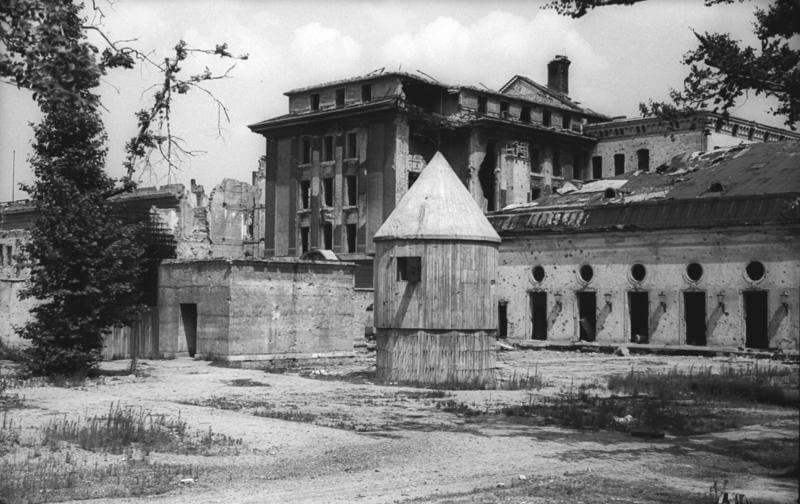
*Bunkier Hitlera przed zniszczeniem, ciała Evy i Adolfa Hitler zostały spalone po lewej stronie od widocznego wejścia. 
By Bundesarchiv, Bild 183-V04744 / CC-BY-SA 3.0, [CC BY-SA 3.0 de](https://creativecommons.org/licenses/by-sa/3.0/de/deed.en), [Link](https://commons.wikimedia.org/w/index.php?curid=5437633)*

### Goebbels

W tej sytuacji Goebbels, który jako wyznaczony testamentem Hitlera jego następca i kanclerz miał formalny tytuł do ustanowienia nowego rządu, zainicjował negocjacje z Armią Czerwoną. Musiał wyprzedzić ewentualne działania Himmlera. Ani Goebbels, ani Himmler nie rozumieli, że alianci z każdej strony uważali wszystkich nazistowskich przywódców za zbrodniarzy wojennych i nie mieli zamiaru z nimi negocjować. Poza tym, co takiego Goebbels albo Himmler mogli im zaproponować? Nawet Dönitz zdecydował, że Goebbels, Bormann i Himmler nie wejdą do nowego rządu.

Bormann o 1835 wysłał depeszę do Dönitza, nie było tam informacji o śmierci Hitlera:
>Führer wyznaczył ciebie, Admirale, na swojego następcę w miejsce marszałka Rzeszy Göringa. wysłane zostało pisemne potwierdzenie. Niniejszym jesteś upoważniony do podjęcia wszelkich działań, których wymaga sytuacja.

Tak zresztą zrozumiał to Dönitz, bo jeszcze następnego dnia o 0122 zasygnalizował dalszą deklarację lojalności wobec Hitlera.

W międzyczasie generał Weidling, który kontynuował przygotowania do zerwania władzy Hitlera, otrzymał od Krebsa wiadomość, w której nakazał mu zgłosić się do bunkra Führera i cofnął pozwolenie na ucieczkę. Weidling odebrał wiadomość około godziny 1900, i jak później opisał prawie godzine zabrało mu dotarcie do bunkra, gdzie czekali na niego Goebbels, Bormann i Krebs. Ten ostatni powiedział, że Hitler się zabił, jego ciało zostało spalone, sprawa samobójstwa musi zostać utrzymana w tajemnicy. Dowóda sektora porucznik Seifert skontaktował się z nnieprzyjacielem w sprawie bezpiecznego przejścia dla generała Krebsa do sowieckiego sztabu. Zaczęły sę negocjacje, więc ucieczka została odwołana.

### Berlin

#### Reichstag

Rosjanie wyrzucili z piwnic cywilów i trzymając ich ma muszce kazali oczyścić przeszkody, wielu z nich zginęło od ognia wciąż broniących się żołnierzty niemickich.

O 0400 150 Dywizja Strzelecka zakończyła oczyszczanie Ministerstwa Spraw Wewnętrznych, a 171 Dywizja Strzelecka w zachodniej części Dzielnicy Dyplomatycznej. Jej 525 pułk parł wzdłuż Alsenstrasse a 380 pułk zajął budynek ambasady szwajcarskiej z widokiem na Königsplatz i ich ostateczny cel. Straty po obu stronach były ogromne, 469 pułku strzelecki 150 Dywizji Strzeleckiej zniknął na zawsze.

Nie było wytchnienia w walce. Zaledwie pół godziny później, o godz. 0600 bez rozpoznania, ani nawet przygotowania artyleryjskiego, ci sami żołnierze którzy własnie zakończyli walki w budynku zostali rzuceni na otwartą przestrzeń w ogień wroga. Dotychczasowy ostrzał okolicy Reichstagu dał niewiele. Co więcej okazało się wtedy, że Opera Krolla, wielki nieistniejący obecnie budynek naprzeciwko Reichstagu został zamieniony w fortecę, z karabinami maszynowymi i artylerią. Atakujący Reichstag czerwonoarmiści znaleźli się w krzyżowym ogniu z trzech stron naraz. Pierwszy atak momentalnie został zanihilowany.

Tak więc, żeby zdobyć Reichstag, trzeba było zdobyć Operę Krolla, ale żeby zdobyć Operę Krolla, trzeba było wyprzeć Niemców z budynków przy Schlieffenufer (obecnie nadbrzeże i zachodnia część John-Foster-Dulles-Allee). To wszystko wymagało czasu i krwi. Wzmocniono artylerię w zdobytym już rejonie pruskiego MSW, w sumie o ok 90 luf. Do ataku wyznaczono 597 i 598 pułki 207 Dywizji Strzeleckiej.

O 1130 150 Dywizja Strzelecka po przygotowaniu artyleryjskim kolejny atak. 380 pułk z poselstwa szwajcarskiego ominął zalany rów przeciwczołgowy i dotarł aż do zalanej stacji U-Bahn Bellevue. Niemcy przeprowadzili kilka lokalnych kontrataków, m in przez Alsenstrasse (obecnie nieistniejąca, jest to Spreebogenpark) odparty przez 525 pułk.

O 1300 150 Dywizja Strzelecka po poważnym 30 minutowym przygotowaniu artyleryjskim kolejny atak, prawe skrzydło ataku zostało przygwożdżone ogniem z Tiergarten Flakturm, ale na lewym 171 pułk oczyścił wschodnią część dzielnicy dyplomatycznej i zabezpieczył pozycje na Kronprinzenbrucke. Udało się również wprowadzić czołgi i działa samobieżne na linię rowu przeciwczołgowego żeby zapewnić ogień amfiladowy do ataku na Reichstag.

Piechotę czekało ostatnie 200 m najeżone przeszkodami, minami, drutem kolczasym i okopami. Potrzebowali osłony ciemności.

Kolejny atak nastąpił po 1800 i dzięki bezpośredniemu wsparciu ognia broni pancernej udało się doskoczyć do Reichstagu. Drzwi były zamurowane, ale mieli ze sobą lekkie moździerze i ustawiając je poziomo wywalili przejście i z gromkim URAAA! wdarli się do głównego holu.

Chorąży wbiegli ze sztandarem pułkowym, łączność ze sztabem udało się nawiązać kiedy byli już na drugim piętrze. Okazało się, że Rada Wojskowa 3 Armii Uderzeniowej miała przygotowany na tę okazję specjalny Czerwony Sztandar nr 5 i wysłała delegację członków partii i konsomołu by natychmiast powiesić go na Reichstagu. W tym czasie zapadły ciemności, rozgorzały walki w płonącym i bombardowanym od wielu dni budynku. Czerwonoarmiści walczyli w kompletnie nieznanym otoczeniu, nie wiadomo było kto swój a kto wróg, strzały padały zewsząd.

#### Od zachodu

30 kwietnia doszło do szczególnie zaciętych walk w Charlottenburg i Wilmersdorf, gdy na lini S-Nahn spotkały się 2 i 3 Gwardyjska Armia. Niemcy zaciekle walczyli od utrzymanie przejścia na zachód. To była ich ostatnia droga ucieczki.

55 Gwardyjska Brygada Pancerna po powrocie na Westend napotykała na coraz większą presję oddziałów niemieckich nacierajacych na zachód. 1 Korpus Zmechanizowany wysłał resztki 19 i 35 Brygady Zmechanizowanej w dół Schlossstrasse, aby oczyścić obszary na północ i południe od Kantstrasse, kierując się w stronę Zoo, podczas gdy 219. Brygada Pancerna zmierzała Berliner Strasse (obecnie Otto-Suhr-Allee) w kierunku Am Knie.

Straty piechoty 2 Armii Pancernej Gwardii osiągnęły 90%, dlatego zdecydowano się na wsparcie 1 DP z 1 Armii WP.

- 1 pułk piechoty został podzielony na zespoły bojowe przydzielone do 19 i 35 Brygady Zmechanizowanej
- 2 pułk piechoty do 219 Brygady Pancernej walczącej na północ od Bismarckstrasse
- 3 pułk piechoty został przydzielony do 66 Gwardyjskiej Brygady Pancernej 12 Gwardyjskiego Korpusu Pancernego, która z powodu braku wsparcia piechoty straciła już 82 czołgi, większość już w Berlinie.

Poza pojedynczymi punktami oporu chaotycznie rozrzuconymi po mieście jedyne wciąż bronione obszary to budynek Reichstagu, dworzec kolejowy Friedrichstrasse, Gendarmenmarkt, Ministerstwo Lotnictwa i Kancelaria Rzeszy. Było to wciąż 10 tys żołnierzy, policji i Volkssturmu, w tym zagraniczni ochotnicy z Waffen-SS (Dywizja Grenadierów Pancernych SS Nordland oraz 15 Batalion Fizylierów SS Łotewski).

#### Od południa

O północy 30 kwietnia bitwa nagle ucichła. Zaczął się maj, największe święto sowieckie. Marszałek Żukow ponaglił Czujkowa do działania, ale ten odparł, że jego ludzie mają już dość, wojna jest wygrana i nikt nie chce umierać w Berlinie. Wygląda na to, że poza walkami o Reichstag nastąpiło odprężenie. Zdarzały się jeszcze krótkie i gwałtowne starcia, ale czerwonoarmiści zaczęli już świętować, a Niemcy szyykowali się do ucieczki lub niewoli.

### 9 Armia

W międzyczasie resztki 9 Armii generała Busse, kierując się otrzymanymi przez radio wskazówkami generała Wencka, dotarły do wsi Wittbrietzen 6 km na południe od Beelitz. 30 kwietnia do południa dotarli do wsi Kummersdorf Gut, gdzie na poligonie krótko odpoczęli.

Zaatakowali sowiecki kordon na drodze Berlin - Luckenwalde i usiłowali przebić sę na zachód. Cały czas ostrzeliwani przez lotnictwo i artylerię nieprzyjaciela. Nieustające, uporczywe ataki nękające.

Podobno pojawiły się tam także słynne Seydlitz-Truppen, czyli walczące u boku Armii Czerwonej oddziały Niemców w niemieckich mundurach. Jednak istnienie większych tego typu formacji nie jest w ogóle potwierdzone. Mały oddział tego typu pojawi się wkrótce we Wrocławiu, ale powołanie jednostek bojowych jest w świetle dokumentów historycznych wątpliwe. Nazwa bierze się od nazwiska generała Walthera von Seydlitz-Kurzbacha, który rozczarowany postawą Hitlera i Paulusa po wzięciu do niewoli w Stalingradzie poszedł na pełną współpracę z sowietami. Stanął na czele organizacji niemieckich jeńców wojennych współpracujących z Armią Czerwoną. Relacje o tym, że takie oddziały pojawiły się w bitwie o Berlin są zawsze tego typu, że ktoś wspomina, że słyszał od kogoś.

- ["Mysteriöse "Seydlitz-Truppen": Kämpften die Sowjets wirklich mit deutschen Truppen gegen die Nazis?"](https://de.rbth.com/geschichte/80066-seydlitz-truppen-kaempften-sowjets-wirklich-mit-deutschen)

Wczesnie rano kilka razy natknęli się na sowieckie zgrupowania m in oddziały 5 Gwardyjskiego Korpusu Zmechanizowanego i musieli je wyminąć. 1 maja napotkali szpice 12 Armii generała Wencka mając już tylo jednego Tygrysa.

Busse oszacował później, że do Wencka dotarło około 40 tys żołnierzy i kilka tysięcy uchodźców. Ale inne szacunki są niższe. Koniew: z 200 tys 9 Armii generała Bussego do Beelitz dotarło 30 tys, ale ostatecznie do Wencka mogło się przedostać 3 może 4 tys.

### 1 Armia WP

Żukow mając zgodę Stalina rozkazał, żeby przewieźć 1 DP im Tadeusza Kościuszki w rejon walk i przydzielenia im odcinków. Zameldowali się o 7.30 i weszli do walki m in w zachodniej części Tiergarte i w rejonie Politechniki.

Dziś do walki wszedł 2 pułk piechoty atakując z północy, przez Franklinstraße w kierunku Politechniki. W nocy zdobyli silnie broniony zespół Politechniki.

- ["Szturm Berlina 1945"](https://historiamniejznanaizapomniana.wordpress.com/2015/04/30/szturm-berlina-1945/)

### 2 Front Białoruski

2 Front Białoruski po zdobyciu Szczecina rozdzielił atak kierując część sił w kierunku Berlina a resztę na zachód w kierunku Łaby.

### Demmin

Wysadzenie mostów na Pianie (niem. Peene) zatrzymało Armię Czerwoną w niewielkim mieście 80 km na zachód od Świnoujścia. Tej nocy rozpętała się orgia szaleństwa i zbrodni trwająca aż do rana. Gwałty, morderstwa, podpalenia doprowadziły kilkuset mieszkańców Demmin do samobójstwa. Prawie całe centrum miasta zostało wypalone.

### KL Ravensbrück

2 Front Białoruski wyzwolił ostatni duży hitlerowski obóz koncentracyjny - Ravensbrück. Kiedy weszły tam wojska sowieckie wciąż żyło 3,5 tys więźniów, poinformowali żołnierzy, że obóz opuściła liczna kolumna Marszu Śmierci, jak się później okazało ponad 24 tysiące więźniów konwojowanych w kierunku północnej Meklemburgii, wszystkich odnalazł i uratował pościg ([Ravensbrück - hitlerowskie piekło kobiet](http://www.polskieradio.pl/39/156/Artykul/1430352,Ravensbr%C3%BCck-hitlerowskie-pieklo-kobiet)).

### Völkischer Beobachter

Ukazał się ostatni numer Völkischer Beobachter (Narodowy Obserwator), oficjalnego organu prasowego NSDAP. Prawdopodobnie pismem najbardziej kojarzonym z narodowym socjalizmem był Der Sturmer, ale słynące z propagandy nienawiści dzieło Juliusa Streichera było tylko brukowcem, który przygotowywał społeczeństwo do rasistowskich ustaw i eksterminacji.

Nawet jeżeli tezy Sturmera nie były akceptowane w szerokich kręgach społecznych samo istnienie takiej szczekaczki w przestrzeni publicznej zatruło społeczeństwo i po raz kolejny większość dobrych ludzi nie zrobiła nic by zatrzymać słowa nienawiści co było znakomitym wstępem do sytuacji kiedy ta większość dobrych ludzi była bezradna wobec zbrodni, która poszła za tymi słowami. Sturmer był tak agresywny i wulgarny, że zdarzało się że członkowie NSDAP mieli zakaz czytania go bo niektórzy gauleiterzy nie chcieli by ich partię kojarzono z potokiem plugastwa i tak prymitywną propagandą. Właściwym narzędziem propagandy i wizerunku Partii był właśnie Obserwator, choć to Szturmowiec w większym stopniu przyczynił się do tworzenia nastrojów społecznych. Dziś ta większość dobrych ludzi, obojętnie którą z gazet czytała, patrzyła na bomby spadające na ich domy, nagle dowiadywała się o obozach zagłady które przez całe lata funkcjonowały za płotem i jedyna nadzieja jaką mogła mieć było to, że dostaną się do tej "lepszej niewoli". Mieszkańcy (w większości - mieszkanki) Berlina w tej sytuacji byli bez szans.

Gazeta partyjna NSDAP jest o tyle interesująca, że pokazuje pewną specyfikę mediów niemieckich i samych Niemiec. Był to lokalny monachijski tygodnik zatytułowany Münchner Beobachter. Kiedy umarł właściciel wdowa sprzedała tyttuł za 5 tys marek Rudolfowi von Sebottendorf i tygodnik przeszedł na własność Towarzystwa Thule. Zmiana tytułu na Völkischer Beobachter w sierpniu 1919, od 1920 jest to pismo NSDAP, a rok później formalnym właścicielem stał się Hitler. Od 1923 dziennik. No dobra, co w tym interesującego? Interesujące jest to, że tak naprawdę jest to pierwsze ogólnokrajowe pismo w historii Niemiec. Ukazywało się jednocześnie w Berlinie, Monachium a od anschlusu takżę w Wiedniu. Do tej pory wszystkie pisma miały charakter wyłącznie regionalny, nie było żadnej ogólnoniemieckiej gazety.

### 05-01

### Negocjacje

W nocy z 30 kwietnia na 1 maja Niemcy wysłali wiadomość na długości radiowej używanej przez Armię Czerwoną prosząc o spotkanie.

Krótko po północy generał SS Mohnke poprowadził grupę generała Krebsa do dowództwa sektora obrony podpułkownika Seiferta, a ten zapewnił bezpieczne przejście na linie radzieckie. Z Krebsem był pułkownik von Dufving, szef sztabu Weidlinga, a jako tłumacz, porucznik SS Neilands z 15 łotewskiego batalionu fizylierów SS, który nie był potrzebny bo rzeczywistości Krebs mówił doskonale po rosyjsku.

Grupa Krebsa bezpiecznie dotarła na stanowisko dowodzenia 102 pułku 35 Gwardyjskiej Dywizji Strzeleckiej, 4 Gwardyjskiego Korpusu Strzeleckiego i została zabrana jeepem do kwatery głównej pułkownika Czujkowa w Tempelhof, gdzie dotarła o 0350.

Nikt się nie przedstawiał, głównym rozmówcą ze strony sowieckiej był generał Czujkow, który był tak zaskoczony prośbą o spotkanie, że nie zdążył nawet zebrać własnego sztabu, a co dopiero reprezentacji Frontu. Czujkow nie wyróżniał się w grupie innych oficerów, m in byli to pełniący rolę korespondentów wojennych pisarz Wsiewołod Wiszniewski, poeta Jewgienij Aronowicz Dolmatowski i kompozytor Matwiej Isaakowicz Błanter (jeden szlachcic i dwóch Żydów). Dłuższą chwilę Krebs nie wiedział kto jest dowódcą, ani z kim rozmawia.

W pierwszym zdaniu Krebs poinformował:
>Moim zadaniem jest dostarczyć pismo nadzwyczajnej wagi i o poufnym charakterze. Chciałbym, żeby pan wiedział że jest pierwszym cudzoziemcem, który dowiaduje się, że 30 kwietnia Hitler popełnił samobójstwo.

Czujkow był zaskoczony, ale żeby nie dać Niemcom przewagi odrzekł, że wie o tym. Zdumiony Krebs powiedział: "*Skąd pan o tym wie? Hitler popełnił samobójstwo zaledwie kilka godzin temu*". Potem dodał
>29 kwietnia Hitler poślubił Ewę Braun. Ona także popełniła samobójstwo. Ich ciała spalono i pogrzebano. Miało to miejsce w bunkrze Führera

Sowieci byli zaskoczeni, nie wiedzieli nic o bunkrze Hitlera, do tej pory wcale nie byli pewni czy Hitler w ogóle jest w Berlinie. Rozmowa była długa, Krebs chciał uznania nowego rządu Goebbelsa i oświaddczył, że nie ma uprawnień do negocjowania bezwarunkowej kapitulacji - a było to jedyne co mogli zaakceptować sowieci. Nalegał na uznanie grupy oficerów jako swego rodzaju rządu tymczasowego i zawieszenie broni. Warunkiem kapitulacji było uznanie przez sowietów rządu admirała Dönitza przez Związek Radziecki. Dokumenty przekazane przez Krebsa zostały natcyhmiast przesłane do sztabu Żukowa w Strausbergu, a ten natychmiast zadzwonił do Stalina.

Na bezpośrednie polecenie Stalina Czujkow odrzucił propozycje Krebsa, na podstawie umów sojuszniczych mogli przyjąć tylko bezwarunkową kapitulację. Wiedział że choć opór sił niemieckich w Berlinie jest poważny nie istnieje dowództwo garnizonu Berlin, że są to izolowane punkty oporu. Tak samo walki w rejonie Berlina zamieniły się w serię potyczek w terenie najczęściej podejmowanych w celu wyrwania się na zachód do niewoli amerykańskiej. Pojedyncze oddziały wciąż walczyły, ale Niemcy zostały pokonane.

Jedyne co wtedy ustalono to nawiązanie stałej łączności - pułkownik von Dufving został odesłany z sowieckim majorem łącznościowcem celem ułożenia kabla. Zostali jednak ostrzelani przez Niemców, major został ranny, a kabel okazał się zbyt krótki. Potem von Dufving został aresztowany przez SS, które uwolniło go dopiero po naleganiach by skontaktować się z Mohnke. Zgłosił się do Goebbelsa i Bormanna. Kiedy przekazał informację, że sowieci akceptują tylko bezwarunkową kapitulację wobec wszystkich aliantów, Goebbels powiedział, że nie może się na to zgodzić i nakazał ściągnąć Krebsa. Goebbels wydawał się spokojny, Bormann był przestraszony.

Von Dufving wyruszył ponownie o 1100 i zatelefonował do Krebsa ze stanowiska dowodzenia pułku. Krebs powiedział, że wciąż czekają na telefon z Moskwy, a tymczasem von Dufving powinien ponowić próbę nawiązania łączności telefonicznej z bunkrem Führera. Von Dufving wziął kolejny kabel polowy i podłączył go do pierwszego, ale prawie natychmiast ten drugi został przecięty ostrzałem. Znowu zatelefonował do Krebsa i powiedziano mu, że dzwoniono z Moskwy i że Krebs jest w drodze powrotnej. Kiedy razem bezpiecznie wrócili przez linie, Krebs zwolnił von Dufvinga, mówiąc, że niemiecka odpowiedź dla Rosjan zostanie przesłana na piśmie.

Kiedy Krebs wrócił do bunkra, cała okolica stała się celem koncentracji ognia artyleryjskiego. Sowieci wiedzieli, że Hitler nie żyje i gdzie znajduje się dowództwo. Żądanie natychmiastowej i bezwarunkowej kapitulacji wywołało wściekłość Goebbelsa, a wkrótce potem załamanie pozostałych w bunkrze i panikę.

Nie była to jedyna próba negocjacji Goebbelsa z sowietami. Pułkownik W. S. Antonow, dowódca 301 Dywizji Strzeleckiej 9 Korpusu Strzeleckiego, 5 Armii Uderzeniowej, również przyjął tego ranka delegację 4 oficerów pod dowództwem pułkownika. Wówczas dywizja Antonowa znajdowała się na prawym skrzydle korpusu i zbliżała się do Wilhemplatz (obecnie zachodnia część Mohrenplatz) od wschodu, a 248 i 230 Dywizja Strzelecka posuwała się odpowiednio na północ i południe od Leipziger Strasse. Kiedy pułkownik Antonow zameldował o przybyciu misji, dostał rozkaz, aby nie negocjował, ale kontynuował atak na Kancelarię. W międzyczasie niemiecki pułkownik skontaktował się z Kancelarią za pośrednictwem cywilnej sieci telefonicznej i otrzymał polecenie powrotu. Pułkownik Antonow pozwolił mu wrócić z jednym oficerem, dwóch pozostałych zatrzymał. Całość zajęła 3 do 4h w trakcie chwilowego zawieszenia ognia.

### Goebbelsowie

Obie próby negocjacji zakończyły się niepowodzeniem. Stanowisko Armii Czerwonej było jednoznaczne, więc Goebbels zgodnie z wcześniejszym postanowieniem przygotował siebie i swoją rodzinę na śmierć. Generał Krebs, generał Burgdorf i pułkownik Franz Schaedl z gwardii honorowej Hitlera również wybrali samobójstwo.

Magda Goebbels miała ważny powód by spotkać się z Hitlerem, to była jej ostatnia szansa - choć bez żadnych perspektyw na powodzenie - by odwlec Hitlera od samobójstwa. Wiedziała, że od dawna życie jej, jej męża i jej dzieci zależy od Führera. Kiedy on się zabije, oni będą musieli pójść za nim. Wiadomość o żądaniu bezwarunkowej kapitulacji nie pozostawiła jej innego wyjścia.

Miała sześcioro dzieci, wszystkie miały imiona na literę H (jak Hitler). Nie było łatwo znaleźć lekarza, który się podejmie zabicia dzieci. W obecnej sytuacji w ogóle niewielu było dostępnych. W morderstwie pomógł Helmut Kunz dentysta, który zapewnił morfinę i doktor SS Ludwig Stumpfegger, który dostarczył ampułi z cyjankiem.

Istnieje kilka wersji jak przebiegło samobójstwo Goebbelsów, ale najbardziej prawdopodobne było to, że dzieci zostały przekonane, że w podanym napoju są witaminy, a był tam środek usypiający. Było to ok 1800. Po krótkiej rozmowie o dawnych czasach ze znajomi kiedy dzieci zasnęły Magda zabiła je wszystkie, wciskając im do ust kapsułki z cyjankiem. Jak potem się okazało najstarsze dziecko walczyło. W innej wersji Magda dała im czekoladki ze środkiem usypiającym, a potem zabito je zastrzykiem.

Jak wspomina dr Naumann około godziny 2030 Magda Goebbels "*wstała i wyszła do pokojów dzieci. Po chwili wróciła pobladła i wstrząśnięta*" Goebbels natychmiast zaczął się ze wszystkimi żegnać, dodał żartobliwym tonem "*nie zmuszajmy naszych przyjaciół do wynoszenia ciał, wyjdziemy*" i powoli wyszli na zewnątrz do ogrodu, Magda była "*tak wstrząśnięta, że ledwo mogła iść po schodach*". Goebbels i jego żona włożyli odzież wierzchnią i wyszli po schodach, aby popełnić samobójstwo w ogrodzie Kancelarii. Najpierw Magda zagryzła kapsułkę z cyjankiem i osunęła się na ziemię. Joseph Goebbels strzelił jej w tył głowy, ugryzł własną kapsułkę i strzelił sobie w głowę. Ich ciała następnie spalono w dole podobnie jak ciała Evy i Adolfa Hitlerów. W innej wersji wydarzeń Joseph zastrzelił żonę a potem siebie, w jeszcze innej oboje zażyli truciznę a żołnierz SS rozstrzelał ich pistoletem maszynowym.

Dzieci Goebbelsów znaleziono martwe, tylko Magda mogła je zabić. Goebbels przed śmiercią poprosił adiutanta by ten spalił ciała jego i jego rodziny. Gunther Schwagermann, Werner Naumann pamietnik Goebbelsa, 4 kwietnia 1970 wszystkie ich szczątki spalono i wrzucono do rzeki Ehle k Biederitz.

- [Mark Felton Productions "The Goebbels Government - Berlin 1945" [YT 19:16]](https://www.youtube.com/watch?v=gz8s-Zm1xIQ)

### Berlin

O północy 30 kwietnia bitwa nagle ucichła. Zaczął się maj, największe święto sowieckie. Marszałek Żukow ponaglił Czujkowa do działania, ale ten odparł, że jego ludzie mają już dość, wojna jest wygrana i nikt nie chce umierać w Berlinie. Wygląda na to, że poza walkami o Reichstag nastąpiło odprężenie, zdarzały się jeszcze krótkie i gwałtowne starcia, ale czerwonoarmiści zaczęli już świętować, a Niemcy szykowali się do ucieczki lub niewoli.

Wobec fiaska dotychczasowych negocjacji Stalin nakazał wznowienia walk, które rozpoczęło przygotowanie artyleryjskie o 1630.

Pułkownik Antonow miał właśnie rozpocząć swój atak na Kancelarię, kiedy niemiecki pułkownik pojawił się ponownie z białą flagą, ogłaszając, że Goebbels i jego rodzina popełnili samobójstwo, a jedynym następcą Hitlera był teraz admirał Dönitz. Bieg wydarzeń nie jest jasny, ale wydaje się, że na tym odcinku walki się skończyły.

Nie istniała już linia frontu. walczyły pojedyncze punkty oporu, głównie Reichstag i jego otoczenie, oraz Zoo z Tiergarten Flakturm. Nadal trwały walki w dzielnicy rządowej. Wielkie żelbetowe gmachy ministerialne świetnie nadawały się do obrony: ministerstwa sprawiedliwości, spraw zagranicznych, poczty, Kancelarii Rzeszy. Inne punkty obrony stanowiły: Zeughaus, Biblioteka Państwowa, Opera, Bank Rzeszy, cała północna strona alei Unter den Linden, kwatera Gestapo i RSHA na Prinz-Albrecht-Strasse.

29 Gwardyjski Korpus Strzelecki zameldował przekroczenie Budapestester Strasse i wdarcie się do Zoo, gdzie trwały walki. Zajęli również Kaiser-Wilhelm-Gedächtniskirche (Kościół Pamięci) na wschodnim końcu Kurfürstendamm (byli tam snajperzy i obserwatorzy artyleryjscy). 

12 Gwardyjski Korpus Pancerny - tor wyścigowy (nieistniejący obecnie) po zachodniej stronie nasypu kolejowego między stacją Zoo a Szprewą.

28 Gwardyjski Korpus Strzelecki - obszar mieszkalny Tiergarten na północ od Landwehrkanal

Zoo było okrążone i odcięte od kwatery Weidlinga i reszty Zitadelle.

79 Gwardyjska Dywizja Strzelecka zameldowała zdobycie Dworca Poczdamskiego i walczyła o stację U-Bahn.

Inne oddziały przekroczyły Bellevuestrasse z Potsdamer Platz na południowy kraniec Siegesallee. Zdobyte zostały skrzyżowanie Wilhelmstrasse i Leipziger Strasse, oraz siedziba SS i Gestapo na Prinz-Albrecht-Strasse.

2 Gwardyjska Armia Pancerna ze wsparciem polskich pułków poczyniła postępy.

66 Gwardyjska Brygada Pancerna oczyściła obszar na północ od Landwehrkanal i zajęła stację S-Bahn Tiergarten.

219 Brygada Pancerna zaatakowała teren Politechniki. Na Am Knie (obecnie Ernst-Reuter-Platz) artylerię rozmontowano a potem złożono na trzecim piętrze dla zapewnienia ognia na wprost w ataku na rozległej otwartej przestrzeni gdzie Hitler przyjmował paradę z okazji 50 urodzin w 1939.

19 i 35 Brygada Zmechanizowana posuwały się na wschód, na kościół Trinitatiskirche Berlin-Charlottenburg na Karl-August-Platz i rejon stacji Charlottenburg.

3 Gwardyjska Armia Pancerna po drugiej stronie Kurfürstendamm nacierała w stronę nasypu kolejowego wyznaczającego granicę między Frontami, wieczorem czyszcząc budynki otaczające nasyp, a następnie spotykając się z oddziałami 2 Gwardyjskiej Armii Pancernej na Savignyplatz 2 maja o godzinie 0830.

Wraz z zapadnięciem ciemności walki ponownie ucichły, a czerwonoarmiści wznowili świętowanie, na Pariser Platz upiekli wołu, a poeta Dolmatowski w mundurze marynarki wojennej, stojąc na czołgu recytował niektóre ze swoich popularnych utworów rozentuzjazmowanej publiczności.

### 1 Armia WP

1 Dywizja Piechoty WP

- 2 pułk piechoty skierował atak na Dworzec ZOO i przez Hardenbergstraße nawiązano łączność z 1 Gwardyjską Armią Pancerną, w rejonie mostu na Kanale Lanwehry z innymi oddziałami sowieckimi, cały obszar pomiędzy został zajęty przez pułk.
- 3 pułk piechoty rozpoczął natarcie z Franklinstraße i kierując się na południowy zachód dotarł do Englische Straße
- 1 pułk piechoty nacierał wzdłuż Bismarckstraße, Schillerstraße, Goethestraße w kierunku Zoo, przekroczył Leibnizstraße, w rejonie Karl-August-Platz nawiązał styczność z 1 pp.

### Reichstag

30 kwietnia pierwszy atak na Reichstag. Z powodu dymu zmrok zapadł wcześniej niż zwykle i walki zostały wstrzymane.

Bój o Reichstag miał się zakończyć 1 maja. Wyścig o zawieszenie czerwonej flagi na Reichstagu na poziomie Frontów został już rozstrzygnięty. Stawka odesłała wojska marszałka Koniewa. Ale teraz rywalizacja rozgrywała się na poziomie pułków. Oczywista była obsesja czerwonoarmistów by zatknąć czerwoną flagę na budynku Reichstagu jeszcze 1 maja w robotnicze święto. Po jednej stronie kilka zmotywowanych do walki, doświadczonych i dobrze wyposażonych pułków sowieckich, po drugiej kilka tysięcy żołnierzy niemieckich, głównie SS i Hitlerjugend, oraz pododdziały spieszonych marynarzy.

O 18 do natarcia na Reichstag ruszyły trzy pułki piechoty 150 Dywizji Strzeleckiej ze wsparciem czołgów i artylerii. Udało im wedrzeć się do wnętrza i zdobywać piętro po piętrze. Niemcy stopniowo cofali się na górne kondygnacje lub do piwnic. Pomimo tego zwycięstwa walki o budynek trwały całą noc i cały następny dzień.

Wielokrotnie podczas pisania tej kroniki pisałem o krwawych lub zażartych walkach, ale tego co się rozegrało wtedy wokół budynku Reichstagu nie odda żadne słowo. To była wściekła jatka. Armia Czerwona skoncentrowała cały ogień artyleryjski na budynku i broniących go barykadach, a obrońcy umocnieni, zdesperowani i dobrze zaopatrzeni w broń i amunicję strzelali z góry do atakujących falami czerwonoarmistów zamieniając przestrzeń wokół budynku w pole zagłady.

- 674 i 756 pułk 150 Dywizji Strzeleckiej walczyły w budynku Reichstagu
- 380 pułk 171 Dywizji Strzeleckiej zabezpieczał przedpole, szczególnie wschodni róg Tiergarten aż do Pariser Platz i Hotelu Adlon
- Pozostałe dwa pułki 171 Dywizji Strzeleckiej zabezpieczyły brzeg rzeki i podejście do Siegesallee
- 207 Dywizja Strzelecka zabezpieczyła zachodnią flankę na północ od linii Charlottenburger Chaussee (obecnie Strasse des 17. Juni), która stanowiła granicę dla zbliżającej się od południa 8 Gwardyjską Armią Pancerną generałą Czujkowa.

Walki w Reichstagu trwały cały dzień 1 maja. Niemiecka obrona walczyła rozpaczliwie pod dowództwem SS-Obersturmführera (porucznika) Babicka, którego stanowisko dowodzenia znajdowało się w połączonej tunelem piwnicy budynku po drugiej stronie ulicy. Reichstagu płonął, żołnierze mdleli z braku wody i duszeni przez kurz i dym. Pomieszczenie po pomieszczeniu zdobywano, ale obrońcy wciąż walczyli i kontratakowali. Dopiero 2 maja o 1300 po otrzymaniu rozkazów od dowodcy garnizonu 1500 obrońców złożyło broń.

79 Korpus Strzelecki wziął ok 2,6 tys jeńców i zameldował 2,5 tys zabitych przeciwników, straty własne nie zostały podane, ale pomnik radziecki wzniesiony w pobliżu Reichstagu to grób 2200 żołnierzy.

Jest kwestią sporną czy sowietom udało się zawiesić czerwoną flagę na Reichstagu przed północą. Według oficjalnych informacji Armii Czerwonej była godzina 2250 1 maja kiedy czerwona flaga zawisła nad najważniejszym dla atakujących budynkiem Berlina. Marszałek Żukow triumfował.

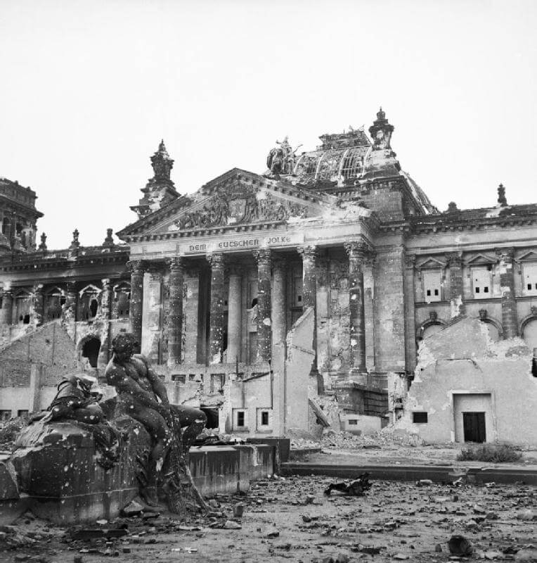
*Reichstag po walkach o Berlin, 1945 
By No 5 Army Film &amp; Photographic Unit. Hewitt (Sgt)Post-Work: [User:W.wolny](https://commons.wikimedia.org/wiki/User:W.wolny) - (https://commons.wikimedia.org/wiki/File:IWMLondonThumbnail.jpg)This is photograph [BU 8573](https://www.iwm.org.uk/collections/search?query=BU+8573) from the collections of the [Imperial War Museums](https://www.iwm.org.uk/).(https://commons.wikimedia.org/wiki/File:Flag_of_the_United_Kingdom.svg), Domena publiczna, [Link](https://commons.wikimedia.org/w/index.php?curid=640204)*

### Kapitulacja

Generał Weidling zwołał spotkanie dowódców sektorów obrony wieczorem w Bendlerblock. Odnowiono połaczenie telefoniczne ze stanowiskiem dowodzenia w Zoo. Wezwano stamtąd pułkownika Wöhlermanna, który dotarł z wielkim trudem. Zdecydowano, że nie ma alternatywy dla kapitulacji i wkrótce po północy rozpoczną negocjacje z Sowietami.

Kiedy Wöhlermann wrócił do Zoo okazało się że część załogi już uciekła, ale wciąż ma 2 tys żołnierzy i kikadziesiąt tys cywilów. Kiedy zrobiło się jasno wymaszerowali do niewoli, Wöhlermann był zdumiony liczbą czołgów i czerwonoarmistów. Ci szczęsliwi z zakończenia wojny zachowywali się przyjaźnie i bez problemu zaakceptowali propozycję by chłopców z Hitlerjugend puścić do domów.

Weidling chciał poddać się nie wcześniej jak o północy z 1 na 2 maja, by umożliwić przeprowadzenie próby wyrwania się z miasta pod osłoną nocy, która miała się rozpocząć o 2200.

O godzinie 2240 1 maja 79 Gwardyjska Dywizja Strzelecka odebrała następującą wiadomość radiową w języku rosyjskim powtórzoną 5 razy:

>Tu niemiecki LVI Korpus Pancerny. Prosimy o wstrzymanie ognia. O 0500 czasu berlińskiego wysyłamy posłów na pertraktację na Moście Poczdamskim. Sygnał rozpoznawczy to biały kwadrat z czerwonym światłem. Czekamy na odpowiedź.

Odpowiedź:

>Twoja wiadomość otrzymana, wiadomość otrzymana. Prośba została przekazana do przełożonego.

Niemcy potwierdzili:

>Rosyjska stacja odbieram cię. Zgłaszasz się do przełożonego.

Generał Czujkow rozkazał zaprzestać walk w rejonie, w którym mieli się pojawić wysłannicy. Pułkownik Theodor von Dufving udał się jednak do pozostałości Bendlerbrücke, gdzie był sowiecki przyczółek i przekazał wiadomość, że generał Weidling jest gotowy na kapitulację. Pułkownik Szemczewko, p/o dowódcy dywizji, zapytał ile czasu będą potrzebować na przygotowanie się, na co dostał odpowiedź, że 3 do 4 godzin i muszą to zrobić w ciemności, bo Goebbels rozkazał strzelać do poddających się, a wciąż było wielu fanatycznych hitlerowców.

Wtedy nadeszła wiadomość od generała Czujkowa, że ​​pułkownik von Dufving ma wrócić do generała Weidlinga i poinformować go, że jego propozycja kapitulacji została przyjęta. Gwarantowano honorowe warunki; oficerowie mogliby zachować broń boczną, każdy mógł zabrać tyle bagażu podręcznego, ile mógł unieść, a radzieckie Naczelne Dowództwo zapewniało ochronę ludności cywilnej i opiekę nad rannymi.

W międzyczasie dr Hans Fritzsche, stały podsekretarz w Ministerstwie Propagandy, jako najwyższy rangą cywilny urzędnik rządowy postanowił działać. Poprosił sowietów o opiekę nad cywilami. Jego delegacja przybyła do siedziby Czujkowa o godzinie 0530 z prośbą by nadać do cywilów wiadomość radiową, na co uzyskał zgodę i dostał eskortę do stacji radiowej.

Z 47 Gwardyjskiej Dywizji Strzeleckiej dotarł meldunek, że Niemcy ustawiają się w kolumnach. Czujkow zarządził natychmiastowe zawieszenie broni na swoim obszarze działań.

2 maja o 0400 przybył generał Weidling, mówiąc, że postanowił nie konsultować się z Goebbelsem w sprawie kapitulacji garnizonu (nie wiedział, że Goebbels już nie żyje). Generał Czujkow zapytał Wieldinga gdzie jest Krebs, na co ten odpowiedział, że nie wie, ostatni raz widział go wczoraj, ale chyba popełnił samobójstwo. Z kwatery głównej marszałka Żukowa w Strausbergu przybył generał Sokołowski i po udzieleniu odpowiedzi na kilka pytań generał Weidling napisał rozkaz kapitulacji:
>30 kwietnia Führer, któremu wszyscy złożyliśmy przysięgę wierności, porzucił nas, popełniając samobójstwo. Wierni Führerowi, żołnierze niemieccy, byliście gotowi kontynuować bitwę o Berlin, mimo że brakowało wam amunicji i ogólna sytuacja sprawiła, że ​​dalszy opór stał się bezsensowny. Teraz nakazuję natychmiastowe zaprzestanie oporu. Z każdą godziną walki powiększa się straszliwe cierpienie ludności cywilnej i rannych. W porozumieniu z Naczelnym Dowództwem Sił Radzieckich wzywam was do natychmiastowego zaprzestania walki. 
>Weidling 
>Generał artylerii 
>Były Komendant 
>Obszaru obrony Berlina

Treść została zaakceptowana i sztab generała Weidlinga dostał misję ogłoszenia rozkazu. Weidling został następnie przewieziony do siedziby Wydziału Politycznego w Johannisthal, gdzie nagrał swój rozkaz kapitulacji, odtwarzany potem przez sowieckie pojazdy propagandowe.

### Operacja berlińska

2 Front Białoruski osiągnął linię Wittenberge - Parchim - Bad Doberan 2 maja, wypierając resztki 3 Armii Pancernej i 21 Armii.

W międzyczasie brytyjska 21 Grupa Armii zajęła Lubekę i Wismar, a amerykańska 9 Armia zajęła Ludwigslust i Schwerin.

Siły niemieckie zajmowały już tylko teren o szerokości zaledwie 20 do 30 km.

Tej nocy generałowie von Manteuffel i von Tippelskirch poddali swoje armie Amerykanom.

1 Front Białoruski musiał jeszcze dokończyć oczyszczanie do Łaby, aby zakończyć swoją część operacji berlińskiej.

1 maja flankujące armie posunęły się naprzód, aby następnego dnia można było utrzymać postęp w kierunku zachodnim. 33 Armia wyruszyła z Kropstädt, 69 Armia z Niemegk, 3 Armia z Brandenburga, 47 Armia z Rathenow, 1 Armia WP z południa a 61 Armia z północy Havelberg. Do 6 maja dotarli do Łaby na całej długości za wyjątkiem odcinka 12 Armii Wencka, gdzie XX Korpus trzymał ich na dystans przez kolejny dzień, aby umożliwić dokończenie ewakuacji.

Operacja berlińska zakończyła się. Liczby podane przez Armię Czerwoną dla trzech frontów:

- 480 tys jeńców, 1500 czołgów i dział samobieżnych, 8600 dział i moździerzy oraz 4500 samolotów.
- Straty własne 305 tys zabitych, rannych i zaginionych w okresie od 16 kwietnia do 8 maja 1945, strata 2165 czołgów i dział samobieżnych.
- Medal za zdobycie Berlina (ros. Медаль "За взятие Берлина") został przyznany 1 082 000 osobom, dotyczy też jednostek zaplecza.
- Sowieckie cmentarze wojskowe w Berlinie (Treptow, Pankow i Tiergarten) łącznie 20 tys zmarłych.

### Śmierć Hitlera

Przed 2100 Goebbels i Bormann zasygnalizowali Dönitzowi wiadomość o śmierci Hitlera, 29 godzin po wydarzeniu, wraz ze szczegółami zawartymi w testamencie Hitlera.

Wtedy Dönitz już jako oficjalnie prezydent III Rzeszy, przekazał wieczorem Radio Hamburg wiadomość o śmierci Hitlera, nie ujawniając przyczyny śmierci, a następnie przemówił do narodu niemieckiego.

22.26 niemieckie radio informacja o śmierci Hitlera.

Wieści te dotarły do ​​wojsk w Berlinie z opóźnieniem, chociaż już wcześniej krążyły plotki.

Nikt nie wątpił w śmierć Hitlera, informację o niej podała ostatnia działająca oficjalna rozgłośnia hitlerowska w Hamburgu. Śmierć Führera miała dla oporu niemieckiego decydujące znaczenie. Jak już pisałem Wehrmacht powstał w 1935 w miejsce Reichswery w efekcie nowej ustawy o poborze powszechnym, ale już wcześniej od 2 sierpnia 1945 wszyscy żołnierze niemieccy składali następującą przysięgę:
>Składam wobec Boga tę świętą przysięgę iż wodzowi Niemieckiej Rzeszy i Narodu Adolfowi Hitlerowi, naczelnemu dowódcy sił zbrojnych, bezwzględnie będę posłuszny i jako dzielny żołnierz gotowy będę za tę przysięgę w każdej chwili życie swoje poświęcić

Była to osobista przysięga wierności wobec konkretnego człowieka, która z Wehrmachtu tworzyła pozbawione jakiejkolwiek kontroli narzędzie woli tyrana. Jego śmierć wyzwalała żołnierzy z osobistego poddaństwa. Ale znajdowali się już w innej pułapce stworzonej przez Hitlera, który od dawna odsuwał do rezerwy dowódców, którzy byli zbyt samodzielni, którzy nie byli dostatecznie fanatyczni, w ten sposób w wyniku selekcji negatywnej po śmierci Hitlera rozkazy wydawali dowódcy wierni Partii tacy jak feldmarszałek Ferdinand Schörner.

### 12 Armia

W międzyczasie główny korytarz na zachód został zamknięty. Tego ranka 12 Armia Wencka zaczęła wycofywać się nad Łabę w kierunku na Tangermünde, podejmując walkę tylko kiedy było to potrzebne. Uciekinierzy z 9 Armii Bussego i grupy Reymanna, a także tysiące uchodźców.

Wenck wysłał generała Maximiliana Freisherra von Edelsheima, aby negocjował kapitulację z amerykańską 9 Armią. Jej dowódca generał William H. Simpson, zgodził się przepuścić przez rzekę tylu żołnierzy, ilu będzie w stanie (oprócz SS) i zaoferował pomoc przy rannych, ale absolutnie odmówił przyjęcia uchodźców cywilnych. Prawdopodobnie wynikało z problemów z wyżywieniem. Ale sytuację zmienił gwałtowny atak sowiecki w wyniku którego Amerykanie musieli się wycofać i przejścia przez Łabę znalazły się pod kontrola niemiecką.

Przejście trwało od 4 do północy 7 maja. XX Korpus był osłoną. Wenck podaje, że ewakuowano pomyślnie około 100 tys żołnierzy i 300 tys cywilów.

### 9 Armia niemiecka

To ostatni dzień wojny dla 9 Armii generała Bussego. Mimo największych wysiłków nie udało im się przedrzeć do 12 Armii Wencka. Brakowało im 3 km. Grupce żołnierzy pod osłoną ostatniego działającego czołgu udało się przeskoczyć tę odległość, ale to było wszystko. Armia została rozbita, dalszy opór nie miał sensu. 60 tys żołnierzy zginęło, 120 tys dostało się do sowieckiej niewoli.

Od tej pory 12 Armia Wencka zmienia charakter i cel działania. Ponieważ połączenie i pomoc dla 9 Armii była niemożliwa, jedyne co pozostaje do zrobienia to ratować się. Połączyli się z uciekającym garnizonem twierdzy poczdamskiej. Pod ochronę żołnierzy niemieckich zgłaszały się tysiące cywilów. Armia Czerwona atakując na odcinku pomiędzy Havelbergiem a Rathenow usiłowała rozbić oddział przed dojściem go Łaby.

- [Mark Felton Productions "Hitler's Last Army - Ninth Army Breakout 1945" [YT 11:57]](https://www.youtube.com/watch?v=rPCWO-wZaLo)

### Bunkier

Samobójstwo popełnią także szef sztabu OKH generał Krebs, adiutant Hitlera generał Burgdorf, oraz kapitan Franz Schädle szef ochrony osobistej Hitlera (niem. Führerbegleitkommando, FBK).

Pozostali usiłowali uciec. Komandor Alwin-Broder Albrecht, adiutant Hitlera zginął podczas ucieczki. O godzinie 22.00, czyli jeszcze zanim czerwona flaga miała zawisnąć na Reichstagu przez radio poinformowano, że Hitler nie żyje. Tak wyglądało święto pierwszomajowe w Berlinie.

Tego dnia w Berlinie zaginął szef Gestapo Heinrich Müller ostatni raz widziany tego dnia w bunkrze. Prawdopodobnie zginął już po przebraniu się w cywilne ubranie.

- [Mark Felton Productions ""Gestapo" Müller - Hunting Hitler's Secret Police Chief" [YT 28:12]](https://www.youtube.com/watch?v=j--Ci3d9RWU)

### 05-02

### Berlin

Działania wojenne miały ustać do 1300, ale była już prawie 1700 kiedy ucichły ostatnie strzały.

Niekończące się kolumny więźniów rozpoczęły długą wędrówkę na wschód. Sowieci twierdzą, że tego dnia wzięli 134 tys jeńców w Berlinie, ale prawdopodobnie był to wynik łapanki wszystkich pełnosprawnych mężczyzn, a czasem także i kobiet, do obozów pracy. Cały dzień trwało przeszukiwanie miasta i wyłapywanie niemieckich żołnierzy.

Tego samego dnia marszałek Koniew rozpoczął wycofywanie swoich sił z rejonu Berlina w ramach przygotowań do kolejnej dużej operacji połączonej z 2 i 4 Frontem Ukraińskim, która miała rozpocząć się 6 maja przeciwko Grupie Armii Środek w Czechosłowacji.

1 Dywizja WP została również wycofana z Berlina w południe 2 maja, aby dołączyć do swojej macierzystej formacji w Nauen, ale dopiero wtedy polscy żołnierze zawiesili swoje czerwono-białe flagi narodowe na Siegessäule.

W odizolowanych budynkach żołnierze SS wciąż stawiali opór. Sowieci nie podejmowali walki, likwidowali je artylerią. Niezależnie od prób przebicia i ciągle trwających gdzieniegdzie walk dziś zakończyła się bitwa o Berlin, w życie weszła bezwarunkowa kapitulacja jaką złożył dowódca garnizonu generał Weidling w ręce generała Czujkowa, który dwa lata wcześniej bił się w oblężonym Stalingradzie.

9 Korpus Strzelecki 5 Armii Uderzeniowej zajął budynek Kancelarii Rzeszy. Skapitulowała niemiecka załoga Reichstagu i 350-osobowa załoga ZOO Flakturm.

Tak wyglądała kapitulacja Berlina. Stolica III Rzeszy była w rękach Stalina.

- [Mark Felton Productions "Reichstag Assault 1945" [YT 10:16]](https://www.youtube.com/watch?v=qiFvWoM5Sb0)

### Sztandar nad Reichstagiem

Jewgienij Ananjewicz Chałdiej wykonał jedną z najbardziej znanych fotografii II wojny światowej przedstawiającą żołnierzy Armii Czerwonej zawieszających flagę Związku Radzieckiego na dachu Reichstagu (ros. Знамя Победы над рейхстагом). Zjęcie było rekonstrukcją wydarzenia z 30 kwietnia, które nie zostało sfotografowane. Fotografia Chałdeja stała się symbolem pokonania III Rzeszy i zwycięstwa Armii Czerwonej w Wielkiej Wojnie Ojczyźnianej. Została opublikowana 13 maja czasopiśmie Ogoniok.

Ze względu na żydowskie pochodzenie Chałdiej znalazł się w niełasce władz sowieckich, więc przez cały okres powojenny aż do upadku ZSRR nie było prawidłowej atrybucji zdjęcia. Dopiero po upadku ZSRR na szczęście wciąż żyjący autor doczekał się uznania. W 1995 organizowano spotkanie z Joe Rosenthalem, autorem Sztandaru nad Iwo Jimą, którym Chałdiej się inspirował. Zmarł w 1997.

- [Sztandar nad Reichstagiem](https://pl.wikipedia.org/wiki/Sztandar_nad_Reichstagiem)

### Bunkier

Pierwszą rzeczą jaką zrobili sowieci było odnalezienie bunkra Hitlera i jego zwłok. Nie było to łatwe, bo ci którzy znali dokładną lokalizację właśnie uciekali.

Pytając napotkanych ludzi i przeszukując Kancelarię Rzeszy jak to pisze Ryan "w labiryncie piwnic i korytarzy" w końcu znaleźli do niego wejście. Znaleźli tam ciała generałów Krebsa i Burgdorfa oraz nadpalone ciała Josepha i Magdy Goebbelsów wraz ze zwłokami ich sześciorga dzieci.

Po przeszukaniach okolicy odnaleziono częściowo spalone ciało mężczyzny w płytkim grobie, ale nie było pewności czy to on. Potem jednak znaleziono jeszcze jedno ciało również w mundurze, ale ten drugi mężczyzna choć podobny do Hitlera miał pocerowane skarpetki. Zebrani świadkowie nie potrafili rozpoznać, którym z zabitych jest Hitler.

Wobec tych wątpliwości kilka dni później generał Wasilij Sokołowski nakazał oględziny stomatologiczne. Znaleziono i sprowadzono Fritza Echtmanna i Kathe Heusermann, techników dentystycznych doktora Blaschkego, który był dentystą Hitlera. Echtmann otrzymał polecenie narysowania szkicu uzębienia Hitlera i stwierdzono zgodność, a Heusermann pokazano szczękę i mostki. Rozpoznała je z łatwością bo sama je wykonała.

Wszystkie szczegóły dotyczące identyfikacji ciała Hitlera ujawnił w wydanej w 1968 roku "Śmierci Adolfa Hitlera" Lew Bezymeński lekarz, który brał w niej udział. Przechowywane w sowiekciej bazie w NRD szczątki Hitlera i Goebbelsów zostały spalone w 1970, popioły wrzucono do rzeki.

### 1 Armia WP

1 Dywizja Piechoty WP

- 3 pułk jeszcze w nocy zdobył stację kolejową Tiergarten, gdzie wziął 450 jeńców, potem skierował atak przez park Tiergarten i około 6:55 dotarł w rejon Bramy Brandenburskiej, gdzie zetknął się z oddziałami radzieckiej 8 Gwardyjskiej Armii. Mówi się czasem o polskich flagach na Bramie Brandenburskiej, ale jest to niepotwierdzone (tym bardziej historie typu, że Polacy zawiesili a czerwonoarmiści zrzucili te flagi).
- 2 batalion i część 1 batalionu 3 pułku piechoty, batalion czołgów z 66 Brygady Pancernej i 7 bateria 1 pułku artylerii lekkiej zdobył Siegessäule. Polscy żołnierze zatknęli biało-czerwone flagi na środku trzeciej kondygnacji i na balkonie drugiej.
- 1 pułk o świcie przekroczył Grolmanstrasse i dotarł do Hardenbergstraße.

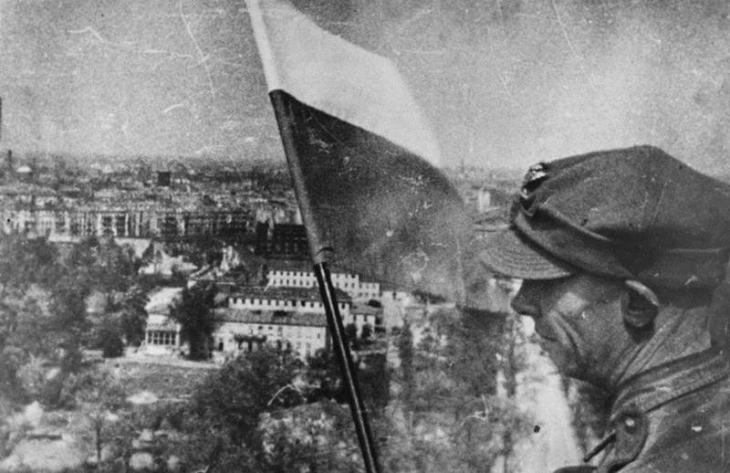
*Polska flaga na Kolomnie Zwycięstwa. Tiergarten, Berlin. 2 maja 1945. 
By Polish Army - Encyklopedia Powszechna PWN 1975, Domena publiczna, [Link](https://commons.wikimedia.org/w/index.php?curid=49369104)*

### Ucieczki

Weidling wstrzymywał negocjacje jak długo się dało aż do północy by dać szansę ucieczki pod osłoną nocy, tym którzy jeszcze mogli.

#### Jebenstrasse

Grupa 300 żołnierzy z Jebenstrasse uciekła tunelami U-Bahn ze stacji Zoo na Adolf-Hitler-Platz (obecnie Theodor-Heuss-Platz), co zajęło im dwie godziny, a potem na Heerstrasse. Kiedy ktoś nieostrożnie zapalił zapałkę ostrzelano ich serią z kaemu. Skręcili w stronę Ruhleben, gdzie natknęli się na austriacką jednostkę czołgów z 15 Tygrysami i udali się z nimi na Stresowplatz, który był zatłoczony uchodźcami czekającymi na przejście przez most Charlottenbrücke do Spandau. Nagle zostali ostrzelani z dachów i pod ogniem w biegu przedarli się do Döberitz, gdzie otoczeni po wystrzelaniu całej amunicji musieli się poddać ok 0500 2 maja

#### Zoo

W nocy z 1 na 2 maja generał dywizji Luftwaffe Otto Sydow z 1. Flak-Division zorganizował próbę ucieczki z Zoo. Pozostałe czołgi i transportery opancerzone Dywizji Pancernej Müncheberg i 18 Dywizji Grenadierów Pancernych zostały wysłane przez Kantstrasse do Adolf-Hitler-Platz (obecnie Theodor-Heuss-Platz), a następnie przez Reichsstrasse i Stadion Olimpijski do Ruhleben. Oddział kilkuset żołnierzy piechoty z rannymi i kilkuset cywilami przeszedł 7 km tuneli U-Bahn do Ruhleben i kolejne 3 km do mostów Spandau. Cudem plan zadziałał. Wędrówka przez tunele musiała odbywać się w ciszy i bez świateł, ponieważ praktycznie cała trasa przebiegała pod liniami radzieckimi, a w tunelu było wiele otworów prowadzących do ulic. Chociaż szli wolno, przed północą dotarli do celu.

Na Haweli wciąż były dwa mosty. Freybrücke został wysadzony o 1800 tego wieczoru, kiedy przypadkowy pocisk uderzył w komorę detonacyjną. Nie ma relacji o przejściu przez Schulenburgbrücke w centrum, prawdopodobnie był zbyt strzeżony.
Siły rosyjskie na przeciwległym brzegu przy moście Charlottenbrücke były stosunkowo słabe. Gdy tylko wojska przedarły się, uchodźcy zaczęli się zbierać i czekali, a kiedy droga była wolna, tłumy przedarły się przez most. Wiele osób zostało zmiażdżonych przez przejeżdżające w pośpiechu pojazdy wojskowe. Cały czas byli ostrzeliwani. Żołnierze skierowali się do Brunsbüttler Damm na Lotnisko Staaken, które stało się węzłem dróg ewakuacji. Większość jednostek kierowała się na poligon Döberitz. Panowała zasada "ratuj się kto może" (fr. sauve-qui-peut). Większość z żołnierzy została zabita lub wzięta do niewoli. Niewielu udało się dotrzeć do Łaby.

#### Czołgi

Wkrótce po zapadnięciu zmroku generał Wasilij Iwanowicz Kuzniecow (tak, ten od słynnego lotniskowca) dowódca 3 Armii Uderzeniowej (tak, tej która zdobyła Reichstag) zadzwonił do marszałka Żukowa z informacją, że około 20 niemieckich czołgów przedarło się przez linie 52 Dywizji Strzeleckiej Gwardii na północny zachód. Żukow zaalarmował 47, 61 i 1 Armię WP z poleceniem zablokowania wszystkich tras na zachód i północ, a 2 Gwardyjska Armia Pancerna i 3 Armia Uderzeniowa otrzymały rozkaz zorganizowania pościgu. O świcie 2 maja niemieckie czołgi zostały znalezione porzucone z braku paliwa i zniszczone około 15 km na północny zachód od Berlina.

#### Generał Bärenfänger

Generał Bärenfänger dowodzący siłami między Alexanderplatz i Szprewą ("Ost") zorganizował ucieczkę żołnierzy na północ, ale czerwonoarmiści z powodu poprzedniego incydentu zablokowali drogę przez Schönhauser Allee. Bärenfänger, jego żona i szwagier popełnili samobójstwo w bocznej uliczce.

#### Generał Mohnke

Wyrwanie z Kancelarii Rzeszy zostało opóźnione o 24 godziny przez generała dywizji SS Mohnke z powodu przecięcia osi wschód-zachód przez Sowietów 30 kwietnia. Planując nową trasę, poradził swoim ludziom, aby trochę odpoczęli. Skontaktował się z generałami Krebsem i Burgdorfem, ale obaj zdecydowali sę na samobójstwo. Zadzwonił również do generała Weidlinga, aby poinformować go o swoich zamiarach i uzyskał jego zgodę na unikanie kapitulacji do świtu 2 maja.

Ucieczka rozpoczęła się 1 maja o 2300 w 10 nieregularnych grupach, z Mohnke na czele pierwszej. Planował, że będą wyruszać w dziesięciominutowych odstępach i podążać tunelami U-Bahn i S-Bahn aż do Stettiner Bahnhof (obecnie Nordbahnhof), która jak sądził, znajdowała się już a liniami sowieckimi. Stamtąd mieli dotrzeć na stację Gesundbrunnen k Humboldhain Flakturm, po czym każda grupa osobno i na własną rekę przez Neuruppin do głównych sił niemieckich. Ten plan wynikał z niechęci czerwonoarmistóow do nieznanych sobie tuneli, ale również pokazywał jak niewiele Mohnke wie o sytuacji na północy Berlina.

Grupa Mohnkego przez Wilhelmplatz dotarła do stacji metra Kaiserhof, gdzie chronili się cywile i w całkowitych ciemnościach do stacji Stadtmitte, północną linią dotarli do stacji Friedrichstrasse. Tam godzinę musieli przeczekać z powodu silnego ostrzału. Przeszli na tunel S-Bahn na stacji Friedrichstrasse, ale na odcinku pod Szprewą ich i grupę cywilów zatrzymali dwa ściśle przestrzegający regulaminu strażnicy. Nie ma przejścia i już. Szukali innej drogi. Weidendammer Brücke był zablokowany przez niemiecką barierę przeciwpancerną i ostrzeliwany przez czerwonoarmistów, więc przeszli kładką pieszą w moście kolejowym nad Szprewą. Idąc zrujnowaną okolicą dotarli do ruin Muzeum Historii Naturalnej, dopiero wtedy zorientowali się, że przekroczyli Invalidenstrasse. Jak dotąd nie widzieli czerwonoarmistów. Dołączyło do nich kilku niemieckich maruderów. Cywile, których napotkali, powiedzieli im, że choć szpital Charité po ich lewej jest zatłoczony to w okolicy jest niewiele sowieckich patroli. Ostrzał, który ucichł o godzinie 0130, wznowiono nagle o godzinie 0230 i patrząc wstecz, zobaczyli, że Friedrichstrasse i obszar mostu Weidendammer były pod ostrzałem ciężkiej artylerii i rakiet z Tiergarten oraz oświetlony przez szperacze.

Ten wybuch ognia został sprowokowany przez inne grupy z Kancelarii Rzeszy, które przedostały się nad ziemię, przyciągając w ten sposób uwagę sowietów. Trzecia grupa zgubiła drogę na stacji Stadtmitte, gdzie podzieliła się na dwie oddzielne sekcje, a następnie zdecydowała się podróżować nad ziemią.

Generał dywizji SS Krukenberg, którego żołnierze walczyli w tym terenie, wściekły że Mohnke uciekł nie informując go o niczym, teraz, gdy sowieci zostali zaalarmowani, był zmuszony skorzystać z okazji i wyrwać się póki można z tymi których udało mu się zebrać, pozostawiając innych na pastwę losu. Ostatnie 5 Tygrysów użył do przebicia się przez most Weidendammer i od razu w bitwie wszystkie te czołgi stracił, ponieśli ciężkie straty. Tylko kilku przedarło się z generałem.

Mohnke skorzystał z odwrócenia uwagi, i zabrał swoich ludzi na Chausseestrasse, północną kontynuację Friedrichstrasse, ale kiedy dotarli do Maikäferkaserne (po wojnie Walter-Ulbricht-Stadion, a obecnie siedziba Bundesnachrichtendienstes) okazało się że są tam czołgi wroga i zawrócili na Invalidenstrasse. Przypadkowym pociskiem zabity został generał dywizji SS Jürgen Ziegler, poprzednik Krukenberga. Schronili się na nieczynnym placu towarowym w pobliżu Stettiner Bahnhof (obecnie Nordbahnhof), gdzie ostatecznie dołączył do nich Krukenberg i ocaleni z jego grupy wraz z innymi oddziałami ukrywających się w okolicy.

O 0700 grupa Mohnkego, licząca 150-200 osób, podążała opuszczonymi ulicami Bernauer Strasse i Brunnenstrasse, by dotrzeć do wieży Humboldhain Flak o 0900. Dotarły wieści o rozkazach generała Weidlinga, by się poddać, ale grupa Mohnkego postanowiła się wyrwać i schroniła się w browarze Schultheiss w Prinzenallee.

Podczas gdy reszta się zabawiała, oficerowie zeszli do piwnic, aby naradzić się. Niektórzy zdecydowali się na indywidualne ucieczki m in dwie sekretarki Hitlera i sekretarka Bormanna, wszystkie trzy bezpiecznie przedostały się na zachód. Mohnke wysłał pułkownika Claussena, który nie był z SS żeby zgłosił kapitulację, zanim zostaną zaatakowani. Zostali wzięci do niewoli o 2000. Ambasador Walter Hewel i fanatyczny młody porucznik SS popełnili samobójstwo.

#### Uciekinierzy z bunkra

Inna grupa dowodzona przez Axmanna przeszła całą drogę nad ziemią, ponosząc wiele ofiar.

W międzyczasie pięciu uciekinierów z Kancelarii po przekroczeniu Szprewy skręcili w lewo. Bormann, Axmann, pułkownik SS dr Ludwig Stumpfegger (ostatni lekarz Hitlera), major Weltzin (pomocnik Axmanna) i generał Luftwaffe Hans Bauer (pilot Hitlera) - schronili się na Schiffbauerdamm, dopóki ogień nie ustał. Potem podążali wzdłuż torów kolei miejskiej S-Bahn prowadzących do Moabit. Naprzeciwko Reichstagu znaleźli się pod ostrzałem snajperów, a generał Bauer został oddzielony od reszty i pozostał w tyle. 4 pozostali przeszli przez Humboldthafen przy moście kolejowym i zeskoczyli na jezdnię pod stacją Lehrter S-Bahn, tylko po to, by znaleźć się w środku biwakującego plutonu przyjaznych rosyjskich żołnierzy, którzy wzięli ich za Volkssturm zmierzający do domu. Bormann i Stumpfegger zaczęli biec, wzbudzając tym samym podejrzenia Rosjan, dwóm pozostałym udało się odejść. Jednak gdy Baur pojawił się wkrótce potem, został postrzelony, poważnie ranny i schwytany przez ten sam pluton.

Axmann i Weltzin weszli do Moabit, dopóki nie zostali zawróceni przez ogień czołgów. Przechodząc przez most drogowy nad głównymi torami prowadzącymi na dworzec Lehrter, natknęli się na ciała Bormanna i Stumpfeggera, którzy najwyraźniej popełnili samobójstwo. Zdecydowali się rozdzielić, Axmann znalazł schronienie u przyjaciółki i dotarł bezpiecznie na zachód, ale Weltzin został jeszcze tego ranka schwytany.

#### Łotysze

Podczas przerwy w walkach w nocy 1 maja 80 ocalałych żołnierzy z 15 Batalionu SS Łotewskiego porucznika SS Neilands wycofało się na nowe pozycje w ogromnym, masywnym Ministerstwie Lotnictwa. Przeoczono ich w planach ucieczki i rano okazało się że w okolicy nie ma żadnych wojsk, ani niemieckich ani sowieckich. Zdecydowali się przedrzeć na północ przez ruiny i dotarli na plac w Pankow, gdzie zebrało sie ok 1000 niemieckich żołnierzy czekających na wzięcie do niewoli. Tam rozdzielili się dalej uciekając indywidualnie.

Jak się później okazało ci zapomnieni Łotysze sami zapomnieli o innych żołnierzach, z francuskiego Waffen-SS, którzy zmęczeni walką zasnęli w piwnicach Ministerstwa Lotnictwa. Wszyscy zostali schwytani.

#### Wannsee

W nocy z 1 na 2 maja resztki 20 Dywizji Grenadierów Pancernych, do której dołączyła grupa podpułkownika Weissa, próbowały wyrwać się z "wyspy" Wannsee. Planowali przedrzeć się przez linie sowieckie na stacji Wannsee S-Bahn, a potem skręcić na południe przez las, by spotkać się z 12 Armią. Kiedy dotarli na most prowadzący do przejścia podziemnego pod linią kolejową, okazało się, że jest zablokowany przez barierę przeciwpancerną, zostali ostrzelani i ponieśli duże straty. Weiss został schwytany w Wannsee, ale jego dwaj towarzysze uciekli do lasu, następnego ranka pozbyli się mundurów i w cywilnych ubraniach udało im się uciec na zachód pod udając cudzoziemskich robotników przymusowych.

Ostrzał który ściągnęli na siebie dotknął równiez grupę kurierską majora Johannmeiera. Podczas walk trzysilnikowa latająca łódź Dornier wylądowała na Haweli w pobliżu Pfaueninsel i nawet nawiązano kontakt z kurierami, ale ostrzał zmusił pilota do natychmiastowego startu zanim dotarli do samolotu.

Żaden w kurierów testamenttu Hitlera nie zakończył misji sukcesem, wszyscy w końcu dotarli do bezpiecznych miejsc, ale dokumenty zostały odzyskane przez aliantów zachodnich.

### Schenkenhorst

Jak wspomina marszałek Koniew, kwatera główna generała Leluszenko z 4 Gwardyjskiej Armii Pancernej we wsi Schenkenhorst tego dnia została zaatakowana przez ok 2 tys żołnierzy. Uznano ich za część garnizonu poczdamskiego, ale bardziej prawdopodobne było, że to uciekinierzy z Wannsee. Po 2 h walk kiedy przybyły posiłki 7 Gwardyjski Pułk Motocyklowy i inne jednostki z okolicy zostali pokonani.

### Martin Bormann

Podczas próby ucieczki z Berlina ginie Martin Bormann, jedna z bardziej tajemniczych postaci reżimu, szara eminencja III Rzeszy.

Po ucieczce Rudolfa Hößa sekretarz Hitlera, to on decydował kto ma do niego dostęp, a to stanowiło największą władzę zaraz po samym Hitlerze. Dopiero pod koniec wojny alianci zorientowali się jak ważny jest, tak bardzo trzymał się w cieniu. Wtedy się okazało, że nie dysponują żadnym jego zdjęciem. Bardzo długo jego los był nieznany i krążyło na jego temat wiele teorii spiskowych. Dopiero w 1972 odnaleziono dwa szkielety, podejrzenia, że jeden z nich to Bormann potwierdziły badania DNA.

### Kapitulacja wojsk niemieckich we Włoszech

29 kwietnia, dzień przed śmiercią Hitlera w Casercie podpisano akt kapitulacji Grupy Armii C (niem. Heeresgruppe C).

Kapitulacja wchodziła w życie 2 maja o godzinie 1400. Milion niemieckich żołnierzy we Włoszech dostało się do niewoli.

### Kapitulacja Armii Wisła

Poddała się również resztka Armii Wisła, czyli dwie ostatnie jednostki, które do niej należały: 21 Armia pod dowództwem generała Kurta von Tippelskircha i Trzecia Armia pancerna pod dowództwem generała Hasso von Manteuffela.

### 05-03

### Ewakuacja

12 Armia Wencka nawiązała kontakt z amerykańską 9 Armią, która z rozkazu Ike'a pozostała na Łabie. Generał Edelsheim udał się do Stendal, by wynegocjować poddanie się. Dowódca 9 Armii generał William Simpson zgodził się na przyjęcie żołnierzy, ale odmówił przepuszczenia cywilów.

Jutro zacznie się ewakuacja.

### Hamburg

3 maja bez walki skapitulował Hamburg, miasto gdzie była ostatnia działająca hitlerowska rozgłośnia radiowa (Hamburgsender).

### Berlin

Berlin był zrujnowany przez kilkaset nalotów dokonywanych przez Amerykanów, Brytyjczyków od sierpnia 1940, a intensywnie w ramach operacji "Battle of Berlin" (analogicznie do Bitwy o Anglię) od 1943. Od sierpnia 1941 bombardowali go sowieci z terenów obecnej Estonii, ale potem z powodu utraty terytoriów utracili taką możliwość, powtórnie zaczęli go bombardować dopiero od 28 marca 1945.

Z powodu chaosu jakim był koniec wojny nie da się wiarygodnie oszacować strat żadnej ze stron. Zginęło ponad 20 tysięcy żołnierzy niemieckich. 70 tysięcy żołnierzy dostało się do niewoli. W ogóle podczas operacji berlińskiej do niewoli dostało się prawie pół miliona żołnierzy. Sowieci stracili 100 tysięcy zabitych i ponad 200 tysięcy rannych, przerażająca proporcja zabitych do rannych świadczy o zaciekłości walk. Zwykle jest to 1 do 5.

Zginęło ponad 120 tys cywilnych mieszkańców Berlina, w kilka dni tyle co we Wrocławiu przez trzy miesiące. Ponad 20 tysięcy umarło ze stresu na atak serca, ponad 6 tysięcy popełniło samobósjtwo, w ogóle samobójstwo stało się nie tylko w Berlinie normalnie dyskutowaną opcją, Partia dystrybuowała cyjanek w nieoficjalny, ale otwarty sposób. Nie trzeba było uzasadniać potrzeby posiadania śmiertelnej trucizny.

Pozbawieni wpływów i kontaktów cywile, najczęsciej bez dostępu do broni mieli do dyspozycji arszenik, przedawkowanie środków nasennych, wisielczą pętlę, albo utopienie się w najbiższym zbiorniku wodnym. Nie tylko berlińczycy zabijali się na wszystkie możliwe sposoby. Zabijali się ze strachu przed sowietami, zabijali się też po tym co im sowieci zrobili.

Berlin został wydany władzy żołnierskiej czerni. Jak już pisałem w tym czasie z niewiele ponad dwóch i pół miliona ludności cywilnej w Berlinie, było dwa miliony kobiet. Gwałty za linią frontu są codziennością każdej wojny, dramatem pomijanym w opisie wydarzeń wojennych, nieobecnym w filmach i podręcznikach historii. Gunter Grass zapytany dlaczego opisuje okrucieństwa jakich dopuszczała się Armia Czerwona w zdobytym Gdańsku odparł: "*bo miały miejsce*".

### Gwałty

Kobiety wiedziały co je czeka. Ukrywały się, brudziły twarz, maskowały urodę. Relacje są bardzo do siebie podobne. Oddziały frontowe zachowywały się wobec ludności cywilnej bez zarzutu. Czasem dochodziło do rabunków, brutalnych przeszukań i sytuacja była niebezpieczna jeśli znaleźli broń lub porzucone mundury. Ale była to strefa wojny.

Najgorsze przychodziło kiedy linia frontu posuwała się o kolejne kilometry a za nią nadchodziła druga linia. Żołnierze nierzadko pozbawieni dowództwa, niejednolicie umundurowani i uzbrojeni, z nie wiadomo jakich jednostek, dziesiątki tysięcy sałdatów, nad którymi nie mogła zapanować żandarmeria szli masą i zaprowadzali swój porządek. Nocą nikt ich nie kontrolował. Najczęściej pijani, szukali zegarków, kosztowności i kobiet. Niewiele można było przed nimi ukryć.

W Treptower Park w czwartą rocznicę zakończenia wojny odsłonięto Pomnik Żołnierzy Radzieckich, dwunastometrowy monument przedstawia żołnierza Armii Czerwonej trzymającego dziewczynkę i depczącego swastykę. Nazywany bywa Pomnikiem Nieznanego Gwałciciela, jak oceniają historycy zwycięzcy żołnierze Stalina zgwałcili około 2 milionów kobiet w całych Niemczech z tego ponad sto tysięcy w samym Berlinie. Niektóre kobiety gwałcone były kilkadziesiąt razy, około ćwierć miliona zmarło w wyniku obrażeń, z tego w samym Berlinie 10 tysięcy.

Żołnierze Armii Czerwonej mieli na to przyzwolenie ze strony swoich władz. Sarżącemu się na okrucieństwa w Jugosławii Miłowanowi Dzilasowi, który był wówczas szefem misji wojskowej w Moskwie Stalin odrzekł:
>czy nie rozumiecie tego, że żołnierz, który przeszedł tysiące kilometrów przez krew i ogień, chce się trochę zabawić z kobietami i pobaraszkować z nimi?

Wyjątkowo brutalnie były traktowane kobiety w mundurach, praktycznie nie miały szans dostać się do niewoli. Na Niemcy spadł ogień okrucieństwa i zemsta za wszystko to czego dokonał Wehrmacht w licznych rozpętanych przez Hitlera wojnach, wszystko to czego dokonał żołnierz niemiecki, szczególnie na froncie wschodnim, a o czym nie chcieli wiedzieć dobrzy Niemcy znoszący cierpliwie ciężar wojny. Teraz tylko cierpliwość im pozostała, bo na to co ich spotkało nie mogli się nikomu skarżyć. Zbrodniarze w mundurach Armii Czerwonej byli anonimowi i nieuchwytni.

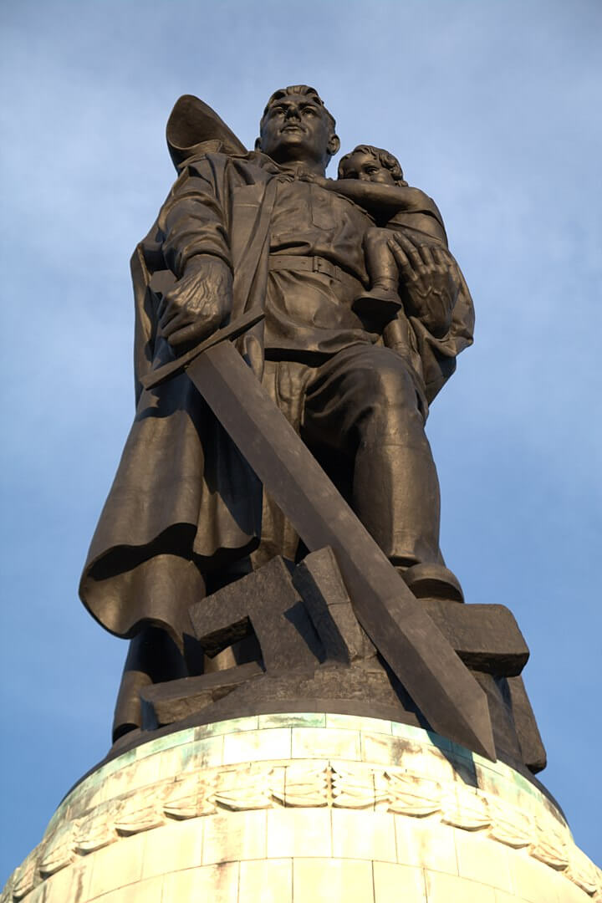
*Statua Żołnierza Wyzwoliciela odsłonięta 8 maja 1946, dłuta Jakowa Biełopolskiego. Treptower Park, Berlin. 
By [Sly07192909](https://commons.wikimedia.org/w/index.php?title=User:Sly07192909&amp;action=edit&amp;redlink=1) - Praca własna, [CC BY-SA 3.0](https://creativecommons.org/licenses/by-sa/3.0), [Link](https://commons.wikimedia.org/w/index.php?curid=20630560)*

### Propaganda

Częściowo za okrucieństwa odpowiedzialna była propaganda, której zadaniem było zmotywowanie żołnierza do walki - znaczący udział miał tu Ilia Erenburg, którego wściekłe filipiki prasa publikowała na pierwszych stronach - charakterystyczny jest przykład z krytycznego momentu wojny, z lipca 1942:
>Nie liczcie dni, nie liczcie kilometrów. Liczcie tylko Niemców, których zabiliście. Zabij Niemca - to twojej matki modlitwa. Zabij Niemca - to wezwanie rosyjskiej ziemi. Nie wahaj się. Nie poddawaj. Zabij.

Już w kwietniu 1945 Erenburg popadł w niełaskę i zaczęto publikować artykuły, przekonujące, że to nie Niemcy są wrogiem a hitleryzm.

### 1 Armia WP

1 Armia WP, która miała o wiele więcej szczęścia co do dowódców niż nieszczęsna 2 Armia, po zawieszeniu polskich flag w Berlinie wczoraj dotarła do Łaby w rejonie Spandau

### 05-04

### 2 Front Białoruski

Wojska 2 Frontu Białoruskiego do chwili kapitulacji dotarły do rubieży Wismar – Schwerin – rzeka Elde. Zajęły tez wyspy w ujściu Odry i Rugię.

W pobliżu Świnoujścia sowieckie lotnictwo zatopiło krążownik "Orion" biorący udział w ewakuacji Prus Wschodnich. Z 4 tys ludzi na pokładzie zginęło 150.

### 2 Armia WP

Wczoraj nieszczęsna 2 Armia LWP, która w zupełnie niepotrzebnej bitwie pod Budziszynem straciła 1/5 do 1/3 ludzi (trudno o rzetelne statystyki, w tak zapomnianej przez późniejszą historię bitwie) i połowę sprzętu, została skierowana do udziału w następnej operacji - praskiej.

Adolf Hitler nie żyje, Wehrmacht nie ma sztabu generalnego, Berlin został zdobyty, większość armii niemieckiej w Niemczech skapitulowała - a wojna trwa nadal. Kiedy skończy się to szaleństwo?

### 05-05

### Ewakuacja

12 Armia Wencka z samego rana rozpoczęła przeprawę przez Łabę przez dwa uszkodzone mosty: kolejowy między Stendal a Schönhausen i drogowy pod Tangermünde oraz prom w Ferchland. Oddziały Armii były ścigane przez sowietów, przeprawy były ostrzeliwane przez artylerię. Amerykanie nie przyspieszali ewakuacji przeszukując wojsko w celu odsiania SS-manów, hiwisów i cywilów.

### 05-06

### Samobójstwa hitlerowców

Hitlerowiec się zabija: Franz Budka SS-Untersturmführer dowódca 1./SS-Festungs-Regiment 1 "Besslein" 19 kwietnia otrzymał krzyż żelazny, nie cieszył się nim długo. Dzisiaj usiłował uciec z Berlina, ale nastąpił na minę, ranny uznał że zostanie schwytany lub umrze z ran, więc się zastrzelił.

### Ewakuacja

Wciąż trwała ewakuacja 12 Armii Wencka, dziś obszar na którym się bronili to było tylko 6 na 2 km.

### Odnośniki

- Eastory ["Eastern Front of WWII animated: 1944/1945" [YT 17:05]](https://www.youtube.com/watch?v=-AUdP-QVEKA)

### film bitwy

serce niemiec, najwieksyz osrdoek logistyczny i wojskowy 
1 kwietnia telegram eisenhovera
potwierdza teorie
tysoace ofiar bombardowan niedobory wszystkiego groza ze wschodu panika
porownanie z barbarossa, kontra nic, armia w staie dezintegracji, dywizje zdzesiatkowane brak sprzetu mlodzincy starcy i fanatycy z ss
weidling 
heinrici zatrzymac na wschodzie jego podwaldnym buse na czele 9 armii
rkka plot stosowane do ostrzalu celow naziemnych 2tys luf artylerii na km frontu
seelow na kilku drogach czolgi idelany cel cala artyleria z beroina scignieta
na urodzinach gering i himmler ostatni raz widzieli sie z hitlerem
stalin zafascynowany reichstagiem ?
przymusowa praca przy umocnieniahc, sciagniete sily do obrony, zapory ppanc i stanowiska ogniowe brak paliwa i sily roboczej, 
sztabocwy pokonanie zapor 15 minut na obrzerzach miasta z czego 14 minut to smiech, auta i wanny - dzien dwa i bedzie po wszystkimi
cytadela obejmuje cale historyczne centrum dobrze broniona,
od karslhorst przedmiescia zaczely sie ciezkie walki 
chcieli uciekac do bechtersgaden zeby uniknac sowieckiej niewoli tam nacierali amerykanie, berlin byl nie do obrony 
100k zgwalconych kobiet, sztab lekcewazyl to naturalne, 2mln w niemczech
walki we wnetrzach i dopiero po zdobuciu obu pierzei mozna bylo pojechac czolgami
razem z zolnierzami zabijali napotkanych w piwnicach cywoilow
ss rozstrzeliwalo za biala flage
nie dziala nic oporcz telefonow sterty gruzow
kto wywiesza biala flage te jest bakcylem zarazy i zostanie odpowiendio potraktowany - goebbels 
helga schneider wegetujemy w widmowym miescie bez pradu i gazu i bez zbiezacej wody higiena osobista jawi nam sie jako luksus, cieply posilek to abstrakcyjny koncept, zyjemy jak zjawy posrod ruin nie dziala nic oprocz telefonow, ktore odzywaja sie czasem ponurym dzwonieniem pod stertami gruzow
zaciekle walki o most moltkego plac przed reichstagiem smiertelnie niebezpieczny 
ocxzekiwali zachownaia broni osobistej, sluzby policyjnje i opatrzenia rannych po kapitulacjji delegacja niemiecka spotkala sie na lotnisku tempellhof i usilowala prtraktowac 
kolejne uderzenie o polnocy 1 maja prosba od weidlinga o zawieszenie broni sowiecka zgoda
rzesze ludnosci cywilnej setki tys ludzi zaczely wychodzic z berlina 
cywile niemiecy stali sie uchodcami
borman i mohnke uciekaja znowu walki blokada i smierc tys cywilow fala przemocy 
ucuekajace masy skierowane na dwa moscty charlotetnburger i weidendammer maskarka od ostrzalu tylko garstka uciekla 

### Berlin 1945

Alice Lowenthal 35 ukrywajaca sie zydowka 13.4.45
Najdroższy przedwczoraj były twoje urodziny. Czy nastepne spedzimy razem, juz w to nie wierze a co zdziecmi wczoraj alianci zajeli weimar, bede sluchac amerykanskiego radia zeby dowiedziec sie co sie stalo w weimarze.

15 kwietnia duzy nalot wielu zginelo

tu radio londyn wlasnie wrocilem  z obozu koncentracyjnego belsen trudno jest mi opisc groze ktora widzialem i o ktorej slyszalem, ogranicze sie do kilku faktow, w obozie bylo 40k mezczyzn kobiet i dzieci, tysiace z nich to Zydzi, w ostatnich kilku miesiacach 30k zabito lub zaglodzono na smierc, zwloki niekiedy w trakcie rozkladu lezaly wzdluz drogi i torow. W barakach sytuacja jest jeszcze gorsza. Widzialem juz wiele potwornosci w ciagu ostatnich pieciu lat ale nic nie rowna sie zgrozą tego  baraku w belsen, prechodzilem nad trupami kiedy uslyzszalem glos najpierw cichy, potem glosny jek, to byla dziewczyna, zywy szkielet, wyciagala koscicste rece i szeptala cicho englisch medicine
straznicy ss ktorzy zastrzelili kilku wiezniow juz po naszym przybyciu do obozu teraz zbieraja zwloki i odwoza je na pochowek, teraz dodam tylko jedno zolnierze drugiej armii ktorzy widzieli to piekolo nigdy dotad nie byli tak wsciekli

cz 2

kwiecien 1945 Yuri Reisman rezyser film o upadku iii rzeszy, 38 kamerzystow wojskowych dokumentowal zdobycie miasta "Berlin" https://www.net-film.ru/en/film-39263/
czujkow: noc miedzy 15 a 16 kweitnia wyjatkowo sie dluzyla mielismy nerwy jak postronki w oczekiwaniu na poczatek czas plynal bardzo powoli, ofensywa miala sie zaczac o 5 rano wreszcie wskazzowki pokazlay piata.

piotr sebelov "takiego dnia jeszcze nie bylo na froncie, o czwartej organy stalina otworzyly ogien, wreszcie rozlegl sie krzyk "na Berlin, na Berlin""

Werner Hutter żołnierz WM 
to był mglisty i chłodny poranek, unosił się zapach siarki ziemia drżała, rozpętało się piekło,
Helmut Altner 16 HJ
ostzrał się nie kończył na chwile ogłuchliśmy, mało kto się odzywał, domy i wioski płonęly w oddali obok nas stała śmierć 

Sieg oder Bolschewizmus 

Dieter Borkowski 17 luftwaffe hilfer
W mieście wielkie poruszenie zaczelo się w Berlinie słychać rosyjskie armaty na ulicahc żandarmi wyłapują uchodzcow i dezerterów od razu sa zabijani na scianach obwieszczenie furhera każdy kto wyda rozkaz odwrotu zostanie stracony na miejscu 

choć rosjanie sa juz za furtenwalde anglicy wciaz nas bombarduja wujek Fritz stary towarzysz partyjny nagle stał się ostry Dieter wracaj do dizal to twoj obowiazek, gdybym nie wrocul zglosilby mnei do raportu 

Nun erst recht: Kampf bis zum Sieg!
Mit dem Fuhrer zum Sieg! 

poczta rkka
Jestem na terytorium neimieckim, spotykamy tylko malych fryckow i kobiety, niszczymi ich jak najszybciej by niemcom nigdynnie przyszlo do glowy nas najezdzac 

Mamo pomscilem ojca zabilem ich wlasnymi rekami, nawet nie wiem ilu ale wciaz za malo, bede sie mscil poki starczy mi zycia 

Brigitte Eicke 18 ekspedientka
Dzis urodziny Fuhrera juz teraz boimy sie smierci słychać artylerię doktor mowi zeby ufac i sie nie bac Fuhrer rpzeorowadzi eksperyment i wszystko dobrze sie skonczy 

Max Bock ukrywajacy sie Zyd 60
normalnei wszedzie lopotalyby te przeklete ale dzis nie ma ani jednej anwet na urzedach nie wywiesili flag panuje poczucie kleski 

Artur Axmann szef HJ
po poludniu udalem sie ogrodu przy kancelarii rzeszy z bunkra wyszedl hitler zlozylem meldunek a on dokonal inspekcji przybylych zolnierzy 

Borkowski
wraz  zlokalna grupa nsdap z kreiuzburgu siedze w bunkrze w ministertwie propagandy czekajac na przydzial, to obrzydliwe ze tak wielu towarzyszy partyjnych jest pijanych, w radio puscili marsze wojskowe, a potem przemowienie goebbelsa z okazji urodzin hitlera

Tylko jemy zawdzieczamy ze niemcy wciaz zyja a europa cywilizowana europa jeszcze nie utonela, zawdzieczamy to woli tego czlowieka stulecia, tylko on wciaz  jest sobie wierny on jest najmezniejzym sercem niemiec i zelazną wolą narodu 

Jakonb Kronika 48 dunski dziennikarz 
przez tyle lat krzyczeli heil, teraz znienawidza czlowiek ktoy ogloscil sie ich fuhrerem ale nie maja sily ani odwagi aby wzywolic sie spod jego demonicznej wladzy 

Adam Schatz 53 artysta
nie ma wody gazu ani pradu 

21 der Russe kommt immer naher 

Grossmann
w niemczech nasi zolnierze zaczeli phytac dlaczego niemcy na nas napadli  miliony naszych widzalo bogate gospodarstwa w prusach wschodnich rozwiniete rolnictwo pietrowe domy z ogrodem i gazem brokowane drogi, pytali sie z rosnacym gniewem dlaczego nas zaataoiwali czeog od nas chcieli 

Konrad Wolf 19 RKKA lieutenent
wielu moich zolnierzy a nawet mocih przyjaciol ze porusza mnie widok niemieckich maist a nawet zwkluch niemcow, nie nigdy nei bede im wspolczul bo widzialem co robili w rosji, jestesmy wyczerpani ale musimy isc dalej 

wszyscy uciekaja rosjanie zblizaja se do karlsdorfu umocnienia okazaly sie bezuzyteczne bo nikt ich nie bronil jestesmy w piwnicy na plebani w piwnicy pastor odprawuol krotkie nabozenstwo niedlugo ndeszlidwaj rosjanie zazadali zegarkow pani S. oddala im swoj rosjanie wyszli. w domu inni gwalcili pania Richter i panią kuchers 

Mathias Menzel 35 dzienikarz
okolo poludnia pocisk spadl na UdL bez ostrzezenia bez alarmu spadl pocisk artyleryjski to juz pewne Berlin zobaczyl Armir Czerwona 

Eicke
Mama nei pozwala mi isc do sklepu czoolgiu strzelaja bez przrwy najcenniesze przedmioty zebralismy do piwnicy i tam ustawilismy lozka pietrowe 

Fifi Grensemann 20
po domach pala swastyki wyrzucaja meble. ja zakopuje portrety hitlera dlaczego? nimo wszystko wciaz wierze w narodowy socjalizm   

marta Hillers 43 dziennikarz
22 w piwnicy krazy wiele plotek pani L mowi wole lezec pod rosjaninem niz dostac  wleb od amerykanina pani B. krzyczy mowiac szczeze zadna z nas nie jest dziewica nikt nie odpowiada 

22 kwietnia Wir horen der Russen

Wolf
nie ma watpliwosci ze zacisnelismy imadlo na Berlinie sluze w sztabie i mam duzo roboty papierkowej jedyna rozywka o audycje niemcow i aliantow 

obnroncy berlina znacie swoje zadanie, wiem ze wypelnicie je jak anjlepiej to wasza godzina proby, mongolska nawala rozbije sie o nasze miato, ja wraz z prsonelem zostane w berlinie, tak samo moja zona i moje dzieci - Goebbels

Wer in diesem Augenblick seine Pflicht nicht erfult, handelt als Verrater an unseren Volk - AH

Ruth Andreas Friedrich 43 dziennikarz
w niedzielnej gazecie napisano okrutny duch walk frontowych unosi sie nad berlinem rozkaz dzienny walczyc do osattniego berlinczyka, wprowadzaja wciaz nowe obostrzenia  kara smieci grozi za uzywanie pradu do gotowania

Lieselotte G. 17 studentka
mama zakopala bizuterie ja schowalam zegarek ziemia jest za mokra 

Eicke
mama i ja spakowalysmy plecak na wypadek gdyby tzreba bylo wyruszyc, mamy dokumenty, dwa zestawy bielizny mydlo buty sukienke recznik i tym podobne moze wywioza nas do Rosji.

24 kwietnia der Russen ist da! 

Wladimir Stezenski RKKA
24 kwietnia dzis przektroczylismy szprewe to wasa i dosc zalosna rzeka trzy razy naplulem do etj przekletej wody fryce odcieci teraz ich wykonczymy 

Borkowski
w flakturemie zglosilem se do porucznika Kitnera spotkalem tylko kilku moich towazysze ale werhmach wcaiz medluje o zwyciestwach

Radio:
cociaz wczoraj neisutannie testowano nasza wole walki dzielni obroncy frontu wschodnie wcoiaz walcza, berlin walczy, berlin ufa furherowi 

Eicke
poszlam po wode do duzego zbiornika przy Winzstrasse jest gesta mgla ale wolimy nie zuywac zapasow bo moze byc jeszcz egorzej wciaz sie slyszy ze ktos zginal w drodze po wode 

Weidling
ok 11 odebralem z kancelarii rzeszy wezwal mnie general krebs furher mianowla mnie dowodca obrony berlina natychmiast mialem rpzejac obowiazki
o 22 udale sie do kancelarii rzeszy furer siedzial zabiurkiem zakrytym ampami wszystko co mowil zmierzalo do jednego, jesli berlin padnie niemcy poosa kleske 

Werner Huettner 
zolnierze biegaja we wszystkie strony gdzie jest front kapitan ciezko ranny raczej nie przezyje 

piotr Sebelow rkka
wszedzie strzaly, ogien i dymy, niemcy atakuja nas z okien i drzwi 

Anne Marie Durand-Wever 55 doktor
przed domem wybuchl granat udalos ie wciagnac rannego do piwnicy oberwal w reke i w noge pani Blau zostala ciezko ranna odlamek przebil pluca zrobilam jej zastrzyk z morfiny
zastanawiam czy boje sie smierci, nei, ale boje sie ciezkich ran, mam rpzy sobie cyjanek potasu 

Hertha von Gebhardt 49 pisarz
w szpitalu Getraude brak wolnych lozek rosjanie i niemcy leza rzem na korytarzu 

Adolphe Jung 43 francuski chirurg conscripted
operowalem do polnocy chcialm wrocic do domu napic sie i posluchac bbc nagle bunkrem zakolysalo wielka bomba spadla na szpital moj pokoj jest zroojnowany wozny i jego zona nie zyja 4 pielengniarki zgnely pod gruzami 

27 kwietnia Im Keller ver (ukrywamy sie w piwnicy)

Theo Findahl 54 norweski dziennikarz
trwa bitwa o berlin ale w Dahlem walki sie skonczyly koneic granatow pociskow i bomb 

Christa R. 15 student
okolo poludnia rpzyszlo trzech zolnierzy pierwsi rosjanie byli bardzo mili poprosili o zegarki i alkohol potem sobie poszli, po nich przysla druga grupa jeden podszedl do mnei zaprowadzxil mnei na gore polozym mnie na kanapie wtedy on polozyl sie na mnie i to zrobil, pod kazdym wzgledem czula sie potwornie 

Emmy Z.
wszystkei musialysmy, nawet 8 letnia Inge, na kolanach blagam zolnierzy ale na prozno potem musialysmy dla nich gotowac

Lieselotte 
podobno w kilka pierwszych dni w Friedrichshagen doszlo do 100 samobojstw 
Pastor zastrzeli  siebie zone i corke bo rosjanie zgwalcili dziewczynke 
pani hoffmann zastrzelila syna a sobie o coirce podciela zyly
powiesila sie nasza nauczycielka panna klinkmoeller nazistka 
ortsgruppenleiter schmidt zastzrelil sie pani Nihchke powiesila sie 

28 kwietnia viele Tote viele (gwałtów)

koniew - im daej sie posuwalismy tym ciezsze byly walki grube kamienne budynki idelanie nadawly sie na umocnienia 

ssman
jak na manewrach nasi lduzie skakali od drzi do dzwi atakujac snajperow na pietrach odbijamy teren

Henri Fenet 25 charlemagne 
nasze jednostki bronia sie na bell alianz plazt blokujac dostep do  dzielnicy rzadowej i kancelarii rzeszy, ani po parwej ani po lewej nie ma obrony mmay tyko panzerfasuty, karabiny  i kilka karabinow masyznowych 

Borkowski
Dowodca bateri Kittner otrzymal zelazny krzyz wrocil z kwatery furera z zyczeniami do adolfa hitlera na pieciu poziomach flaukroomu walaja sie zwloki unosi sie mdlacy slodkawy zapach flakturm jest ak wyspa rosjanie nas omineli

Jakow RKKA
powoli ale wytrwale psuwalismy sie w strone reichstagu, nagle oberwalem przekletym fasyzstowskim pocicskiem zostalem ciezko ranny i straciulem przytomnosc 

Jung
morfina sie skonczyla to straszne uczucie kiedy nie mozna ulzyc rannym w bulu 

30 kwietnia 

Jelena M Rżewskaja 25 tłumacz rkka
zawsze bedziemy pamietac powietrze w berlinie gryzacy dym i pyl piasek zgrzyta miedzy zebami na murach neimieckie plakaty

Unseren Meuern brachen aber unseren Herzen nicht

Eicke
tak sie boje nie zostalo nam wiele zycia na pewni nei mnie co zrobi moj najdrozszy kurt nie zobacze juz zadnego z mocih zolnierzy

RKKA
badzcie zdrowi ukochani wciaz zyje tylko w glowie mi szumi napilem sie dla kurazu 3 gwiazdowy koniak na pewno mi  noe zaszkodzi jestem 50 m od reochstagu

ilja Kuczewski rkka
zdobycie reischtagu nie jest proste resztki kiedys budzacej strach pruskiej armii bronia sie rozpaczliwie gmach zmieniliw  fortece 

Fritz Radloff 29 WM senior leijenant
W reichstagu pelno trupow rosjan kiedy zastzrelimy 10 przychodzi 20 innych strzelaja do nas i zasypuja nas granatami w korytarazhi podziemiach kazdy strzela do kazdego 

Chałdej - wspialems ie na dach z zolnierzami podalem flage jednemu z nich wreszcie znalazlem meijsce z ktoreog bylo widac plonacy reajhtag, ponace domy i plonaca brame brandenburka zrozumialem ze ot koniec 

Erich kempka 35 ss stumbarfirer
walki sa coraz ciezsze domy wal sie z wilkim hukiem, firer pozegnal sie ze wszystkimi, ostatnin raz uscisnal kazdemu uscisnal dlon, stal pochylony, trzsnalem obcasami o odmeldowalem sie ostatni raz, pzoornie spokojny powiedzial linge zastrzele sie wiesz co masz robic

Fiodor Bokow 41 soviet military administrator
wciaz trwaly walki kiedy komitet czydowksentralny kpd wyslal delegacje z moskwy do niemiec grupa inicjacyjna wyladowala 70 km od f nad odra

Wolfgang Leonhard 24 grupa ulbrichta
na lotniksu pusto ani miasta nai budynkow, nic, podeszlo do nas dwoch mlodych oficerow, to zaszczyt panow przywitac, slyszelismy ze sa panowei czlonkami nowego rzadu niemieckiego, malo sie nie zakrztusilem coscie pwoiedzieli? 

1 majo
Karia Hoecker 43 pisarz
1 maja, biegnac z piwnicy do piwnicy dotarlam na lindalee 33 powinno byc tam radio na baterie. wszedzie pelno gruzow i popiolu meble uszkodzone sufit zwisa ze sciany, w piwnicy znalazlam radio

grosadmiral donitz przemowi do narodu neimieckiego
niemcy i neimki zolnierze wehrmachtu nasz firer a h polegl na polu chwaly sytuacja wymaga psiweceni oczekuje dyscyplinu i posluszenstwa wypelniajcie swoje obowiazki stawka jest rpzetrwanie narodu

otto kramer 45 oficer tajnej policji
kiedy podano wiadomosc o smierci fiirera wszyscy wyszli z bunkrow przez klika godzin nie bylo rozkazow dowodztwo najpewniej rpzestalo istniec 

goebbels postanowilismy nie opuszczac berlina ale odebrac sobie zycie u boku firera podjalem te decyuzje w imieniu dzieci  sa za mlode by wyrazizc swoje zdanie ale na pewno dopszlybyu do tego samego wniosku

borkowski
nikt nam nie pomoze ani nie zluzuje marzymy o snie i choc jednym posuilku

weidling w drugiej polowie dnia sytuacja stala sie skrajnie trudna obroncy berlina zostali otoczeni na niewielkeij rpzestzreni jest tylko jedno wyjscie

czujkow
to pan dowodzi obrona berlina spytalem generala wieldinga potwierdzil dzis wydal zolnierozm rozlkaz zlozenia broni 

wolf 19
dla nas wojna sie skonczyla moj boze  ztakiej okazji tzreba pic na umor nigdy nie widzialem takiej radosci sasza miesza spirytus z sokiem swoj diabelski roztwor nazyw smiercia hitlera 

borkowski
mlody rosjanin zebral bron i kopal l;ezace na ziemi helmy smial sie i krzyczal wojna kaput hitler kaput a wy dodomu do babuszki

Henri Daries 25 francuski robotnik rpzymusowy
wyszedlem z kryjoiwki w piwnicy od razu ogarnela mnie dziwna atmosfera cisza ogluszajaca cisza po wielu dniach wbuchow hukow i strzalow

Alice Loeventhal 35 ukrywajacasie zydowka
kiedy to wreszcie do mnie dotarlo nie moglam pwostrzymac lez tak dlugo czekalismy na ten dzoien

Grossmann - dzien kapitulacji berlina trudno to opisac ogromne masy niemiekcich jencow na twarzahc maja wypisany dramat to zimny pochmurny deszcxzoyw dzien, dzien upadku neimiec

eicke
jesem rpzerazona zabieraja wszystkich mezczyzn, wzieli nawet naszych starych policjantow, kobiety staly na ulicy i plakaly, mozliwe z edlugo nie pozyjemy

Rżewskaja
wieczorem znalezli goebbelsa wywlekli go na wilhelmstrasse, prawa reka h nie zyje ale wciaz daje sie rozpoznac, zolnierze i cywile przychodza go zobaczy, zanim sie zabil kazal otrucc swoje dzieci ciekawolo nas tylko jedno gdzie jest h 

3 maja

Grossmann - ogrod zoologiczny, trwaly tu walki klatki sa znisczone trupy malp egzotycznych ptakow niedzwiedzi rozmowa ze starszym mezczyzna przez 37 lat zajmowal sie malpami w jednej klatce byl trup goryla, spytalem  czy to straszne zwierzeta, nie - odpowiedzial- ludzie sa strasznieji 

Fifi Grensemann, 20
dowiedzielismy sie ze przy ku'damm lezy zabity kon poszlam ukroic kawalek dla nas

Franz von Goell, 46 urzednik
sytuacja z zywnoscia krytyczna z plotek dowaidujemy sie gdzie mozna dostac jakies resztki 

Durand-Wever 
udalo mi sie zdobyc tabletki na tyfus, ostrzeglam wszystkich przed piciem wody ze studni w gruzach jest pelno zwlok i wody gruntowe mogly ulec skazeniu

Eicke
poszlysmy do Eicków, na ulicy lezy mnostwo trupow ludzi i koni, straszny widok

Theo Findahl 54 norweski dziennikarz
na szczescie jest chlodno, zwloki w ogrodzie obok sa juz czarne niedlugo sie rozloza, rosjanie nie dotykaja trupow niemcow, ale z szacunkiem grzebia wlasnych poleglych

Rżewskaja
nasi żołnierze przeszli wszystko, bol nienawisc i wstyd w obliczu kleski, beznadziej okrezenia i rozpacz w obozach jenieciich wscieklosc natarcia i euforia zwyciestwa od wolgi po szprewe, tylu z nich zginelo w ostatnich minutach na ulicach berlina

5 maja kein (wieści) vom fuhrer das ist die? ende

Gertha von Gebhardt 49 pisarz
zaczelo sie pladrowanie sklepow ale to nie rosjanie pladruja tylko w wiekszosci niemcy, nei da sie opisac tych scen kobiety bija sie i drapia oblewaja sie olejem, smaruja sobie twarze dzemem wynosza wszystko co sie da

Marta Nierendorf 43 stenotypistka
to dziwne kiedy traci sie kontrole nad wlasnym krajem jest sie narazonym na kaprysy i bezprawie, tam gdzie kiedys byl porzadek panuje chaos 

Gustav Gundelach, 56 grupa ulbrichta
przydzielono nas do pomocy w zakkladaniu komentdantury i organizacji administracji, mielismy nawiazac kontakt z antyfaszystami, bylymi czlonkami kpd spd i zwiazkow zawodowych

Hans Heischmann, 40, WM
obwieszczenie rosyjskiego komendanta miasta ludnosc ma zachowac spokoj wszyscy czlonkowie wm ss i sa maja sie zglosci w ciagu 72 godzin, musze sie ujawnic moga mnie wywiezc na syberia

8 maja

Durand-Wevwer
od poludnia obowiazuje zawieszenie broni niemcy kapituluja 

Jakow I Makarenko 33 sowiecki korespondent
o 13 na niebie pojawily sie trzy daglasy w pierwzszym przylecial brytyjski marszalek lotnictwa tehter, w drugim amerykanski general spatz, w trzecim francuski general tassini, potem wyladowal jezcze jeden z marszalkiem keitlem, nikt nie podal mu reki,

Thomas Cadett 44 BBC
przed naszymi oczami otwarla sie droga do kaulsdorfu gdziemialo sie odbyc spotkanie, dlugo jechalismy ale nie widzialem ani jednego niezniszczonego budynku nadajacego sie do uzytku, krotko mowiac berlin wlasciwie nie istnieje 

Zukow - wszyscy wpatrywlaismy sie w drzwi czekajac na ludzi ktorzy uwierzyli ze zdolaja podbic swiat,

Harry C Butcher 43 us naval adjutant
wszedl keutel, arogancko podszedl do stolu, uniosl bulawe marszalkowska i rozejrzal sie po pokoju jakby stal na polu bitwy

Tassigny
w koszmarnym pruskim stylu strzelil obcasami kiedy mnie zobazcyl powiedzial francuzi tez tu sa widze ze mnie cos ominelo.

Keitel
Zukow spytal czy przeczytalem warunki kapitulacji odpowiedzialem tak, spytal czy jestem gotow je podpisac, ponownie odpowiedzialem tak

Zukow o dwunastej 43 dokument zostal podpisany, rozkazalem neimieckiej delegacji opuscic pokoj wstali uklonili sie i wyszli ze zwiszonymi glowami, w sali zapanowalo ogromne poruszenie, wielu lduzi mialo lzy radosci w oczach wtedy otworzylem bankiet i wznioslem toast uczta trwala do rana spiewalismy i tanczylismy 

Marta Hillers 43 dziennikarz
tej nocy nic sie nie stalo poza tym ze moglam ja spedzic sama pierwszy raz od 27 kwietnia nikt nie wszedl do mojego lozka zaden major ani Uzbek

### Berlin 1945 cz 3

9 maja

Eicke
Wszyscy musieliśmy przyjsc z wiadrami by rozbierac barykady przy kosciele, byla to ciezka praca pod nadzorem rosjan, mamy oddac radia pod grozba kary, nie tylko radia ale tez aparaty fotograficzne, po obiedzie poszlam z mama do firmy zprzyzywczajenia przywitalam sie heil hitler 

dziennik Orest N.K. rkka
Reichstag to wielki ponury budynek nie ma w nim nic pieknego w srodku mnosto cegiel i zelaza, w jednym korytarzu stal ogromny tron z portretem kaizera zrobilem sobie na nim zdjecie sciany pokryte napisami naszych zwycieskich roosyjskich zolnierzy tu byli stalingradczycy tu byl zolnierz ze smolenska jestesmy wreichstagu wszystko w porzadku

raport rkka
tuz przy bunkrze w poblizu kancelarii rzeszy odkryto zwloki dwojga ludzi mezczyzny i kobiety zwloki sa spalone i bez daslzych informacji nei da sie ich zidentyfikowac mezczyzna mial od 50 do 60 wzorst 1,65 zwloki zweglone smierdza spalonym miesem, odlamki szkla w ustach wskazuja ze rozgryzl cienka fiolke, eksperci usuneli zeby i zuchwe zeby nie ulegly zniszczeniu, doktor blaschke od 1932 prywatny dentysta hitlera mial gabinet na ku'dammie 213 znalezlismy tam tylko jego asystentke kate Heusermann pamietala szczegoly dotyczace uzebienia h

Kate Heusermann 35 pielegniarka dentystyczna
trzymalam w dloni mostek dentystyczny od razu zauwazylam znane mi detale, wzielam gleboki oddech, to zeby adolfa hitlera

12 maja

Loewenthal
poszlam do rosyjskiej komendantury trudno znalezc kogos kto mowi po niemiekcu, nie mogli uwierzyc ze w berlinie wciaz sa zydzi, dostalam zgode na powrot do naszego meiszkania
wczoraj poszlam do zydowskiego szpitala dzieci byly tam w zeszlym roku ale potem je zabrano dowiedzialam sie ze wyslano je do auschiwtz nie trace wiary ze znowu bedziemy razem

Martin Riesenburger 49 rabin
w ten piatek urzadzilismy pierwsze nabozenstwo w malej synagodze zydowskiego szpitala wyglosilem mowe ale szybko skonczylem bo cala sala wypelnila sie placzem i szlochem zrozumielismy jak wielu nas brakuje

13 maja

Fiodor Bokow soviet military amdinistration
komendant miasta bersarin s[otkal sie z pierszymi powojennymi wladzami berlina, bezpartyjny antyfaszysta dr artur Werner zostal burmistrzem

Wolfgang Leonhard 24 grupa ulbrichta
Ulbricht z typowym saskim akcentem wyjasnil ze nalezy zachowac pozory demokracji przejmujac pelnie wladzy, potem wpadl erpenbeck miales napisac mi rpzzemowienie dariowe, przelozylismy tekst z prawdy w oficjalnym antyfaszystowskim stylu

chwala armii czerwonej ktora obronila niepodleglosc naszego kraju i pokonala naszych wrogow , chwala naszemu zwycieskimi narodowi wieczna chwala naszym bohaterom ktorzy polegli za wolnsoc i szczescie ludu, to bylo oredzie marszalka stalina z okazji zywciestwa

Hans Heischmann 40 WM
wprowadzono czas moskiewski zegary rpzestawiono dwie goszinyw przod

15 maja

Jacob Kronika 48 dunski dziennikarz
wydano piwersza niemiecka gazete ale trudno o egzemplarz 

Karl Hoecker 43 pisarz
na pierwzej stronie oredzie stalina oraz obwieszczenie radzieckiego dowodztwa wojskowego w tym wielkosc racji zywnosciowych artysci dostana tyle samo co robotnicy.

Jacob Kronika
600 g chleba 100 g miesa 60 kawy i herbaty, porcja ziemniakow, moja gosposia zastanawia sie czy w sklepach starczy jedzenia

Hoecker
setki ludzi w kolejce na Reichstrasse  kolejka pryzpomina biwak ludzie siedza na krzeslach niektore kobiety ceruja skarpety, niektore tak jak ja czytaja

Christa R. 15 student
na obiad jedlismy konine, bardzo smaczna 

Eicke
17 maja sluchalam radia u szepcow, o 10 poszlysmy do sklepu bylo tam kilka dziewczyn charlotte henning zostala zgwalcona kilka razy edith Gassensa pięć, rozmwialysmy o tym co nas spotkalo

Durand
probuje zdobyc narzedzia ginekologiczne do niezbednych badan skutki rzetzaczki sa przerazajace dis badalam zarazona 15 latke, po poludniurpzyszlo do nas moja przyjaciolka Ruth czterech rosjan wymaz niejednoznaczny ale przepisalam antybiotyki

20 maja dzien matki 

Jung
nagle wydano rozkaz opuszczenia berlina przez wsyztskich cudoziemcow podjalem decyzje ze pojde rowerem lub pojde pieszo bylem sam zaden inny francuz nie chcial jechac rano wyjechalem na rowerze z berlina

jean-Rene 40 francuski robotik przymusowy
rano pojechalismy ciezarowka do magdeburga 10 minut pozniej przkroczylismy labe i spotkalismy amerykanow, przez glosniki piojnformowano nas jutro bedziecie we francji wciaz to do mnie nie dociera obudze sie z tego ksozmaru dopiero kiedy znajde sie wsrod francuskich cywili

Martui Eisenburger 49 rabin
po poludniu ktos zapukal do drzwi przed ddrzwiami staly dwie mlode zydowski w pasiakach, wrocily z obozu stuthof wraz z 30 zydami zabralismy ich do siebie

Karla elkeles 17 ocalona
kiedy ujrzalam zniszczony berlin nei zalowalam niemcow, czulam tylko zal i zlosci wobec lduzi ktorzy skazali nas na tak niewyobrazalne cieprienie, zasluzyli na to

Alice Loewenthal
pan dawid wrocil z auschwitz na piechote powiedzial mi ze moje dzieci na pewno wciaz zyja bo przybyly dopiero we wrzesniu a od tego czasu prawie nie zabijano dzieci, co za potworna mysl zabijali dzieci, mozliw ze zabili tez moje

25 maja
Eicke
przyszla pani Szepc, od jutra wszyscy czlonkowie partii maja sie zglosic do pracy, zaczynamy o 6 rano na christburgerstrasse ciezka prace jaos zniesiemy, ale mowa jest tez o zsylce  pora odpokutowac moje zwiazki zpartia 

A.R. gospodyni domowa
jakas kobieta powiedziala ze moj maz musi isc z nia do komendantury, od tad go nie widzialam moj maz ma 71 lat i klopoty z pecherzem byl czlonkiem partii ale nigdy sie nie udzielal

anon
w komendanturze pelno rosjan z budynku wyszlo dwoch ofieerow kiedy przechodzili obok mnie wtedy jeden z nich powiedzial rozstrzelac rosjanin wyrzucuil na podloge zawartosc walizki zostawil mi tylko lyzke i hsusteczke poetm wskazla na piwnice mnostwo lduzi spalo na podlodze 

Ruth Andreas-Friedrich 43 dziennikarz
nagle okazalo sie ze kazdy dawal Zydom chleb albo ziemniaki, wszyscy sluchali zagranizcnego radia i wspierali rpzesadowanych wszyscy sa bohaterami im bardzieuj tym bardziej asurdalne maja wymowki 

Eicke 
na JablonskyStrasse nosilam gruz uzywalismy wiader to bardzo ciezka praca Lottie martin pracowala ze mna bo jej ojciec nalezal do partii wrocilam do domu o 22 16 godzin ciezkiej pracy wiele kobiet dlugo nie wytrzyma to straszne w jakim ponizeniu zyja niemcy

5 czerwca 

Ruth Andreas-Friedrich 43 dziennikarz
czy amerykanie wrezcie  przyjda podziela berlin czy zsotawia go rosjanom kto tu rzadzi spytalam Andrika wzriszyl ramionami, ten czyja teraz kolej 

Christa R. 15 student
w gazetach wydrukowali mape podzialu Niemiec Anglicy amerykanie francuzi i rosjanie przybywaja do berlina

Frank L Howley 42 us army general
berlin bedzie zarzadzany przez cztery mocarstwa amerykanie brytyjczycy francuzi i rosjanie beda ustalac wspolne zdanie w kazdej kwerstii teoretyzie problemy moze stawiac tylko postaw aniemcow

Ruth 
8 czerwca w berlinie upał w czerwcu kazdy dzien ejst goretszy od poprzendiego pod cienka warstwa pylu rozkladaja sie trupy, smrod smierci unosi sie w powietrzu opary nad landwehr kanal jest nie do zniesienia, przechodnie zaslasiaja nosy husiteczkami

Durand
wybuch granatu ciezko ranil troje dzieci bawiacych sie w ruinach musialam je obandazowac i zszyc rany, od wzocraj mamy wode w bolierze czysta swieza wode, od 17.30 mamy etz prad

Karla Hoecker 43 pisarz 
jestesmy jak dzieci wlaczamy i wylaczamy prad juz nie siedzimy w ciemnosciahc pojawily sie plany dzialania zwiazku kultury europejskiej beda wystawy  spektakle wyklady 

Christa R. 15 student
koncer w naszej szkole grali filharmoniy berlinscuy a spiewala pani erna berger bylo wiele znanycn twarzy niektorzy mezczyzni nawet sie wystroili to byla wspaniala noc 

Hoecker
zrobilam pierwsza trwałą od dawna

?
sobota dzis specjalne zebranie w sprawie nazistow od 7 kazano nam stac w szeregu jak rpzestepciom potem naczelnik moodziezy kazal wystapic wzystkim ponizej 20 roku zycia 2 mlodych mezczyzn zebralo nasze karty pracy na mojej wciaz jest lietra n Horst pwoiedzila nie potzrebyujemy tu nazistow, ale naczelnik stwierzil ze moge sdostac inna karte kazal mi isc do domu i wrocic o 14 potem wyslal mnie na spotkanie modziezy antyfasyzstowskiej w charakterze protokolantki 

Howley
30 czerwca kazno mi odwolac wszystkie plany i jechac do berlina wzielismy czapki i 1 lipca juz pedzilismy autotrada jakby sie palilo, obok nas jechali rosyjcy oficerowie w starych skonfiskowanych wozach jedni chcieli pic za zwyciestwo inni czujnie nas obserwowali poznym popoludniem dotarlismy do berlina rosjanie nie pozwolili nam dowuiedzic naszych sektorow szulaismy meijsca gdzie moglibysmys ie zatrzymac 

Haloo BBC this is ruichard dumlebee speaking from berlin the official alllied ocupation has  began the unieted states second armored division is enering the amrican zone of the city today, this the fuuirst bbc broadcast from berlin

Hoecker
na reichstrasse mijaly nas czolgi z biala gwiazda nagle jeden sie zatrzymal wychylil sie zolnierz i zapytal rpzepraszam ktoredy do grunewadu?

Howley
dotarlismy do grunewaldu w mundurch polowych ustwailismy pojazdy w kole jak wdanych latach ustawialo sie pojazdy na prerii

1 lipca 

Eicke
praca w owym biurze antyfaszystow jest zabawna zachowuja sie nazisci tylko pod inna nazwa maja takie same oczekiwania i taki sam styl mowienia na naczelnikwo druzyn mlodziezowych wyznacza sie dawnych rpzelozonych z hitler Jungend
 
4 lipca

Howley
4 lipca zrobilo sie powaznie pod dawnymi koszarami ss adolh hitler a teraz koszarami amcknera przywitaly nas 2 kompanie rosjan, my tez stanelismy na bacznosci ich artyleria oddala dwie salwy powitalne a nasz aopowiedziala

w imienu komendanta berlina i wojsk radzieckihc pragne przywitac ameryukanskie wojska sojusznicze

Lucius Clay
nastepnego dnia pulkownik Howley wyslal lduzi do ratusza odtad to my wydawalismy rozkazy

Christa R. 
mama o wpoldo osmej poszla do pani Schweering w willi na Harnakstrasse zalozono kasyno oficeersie, pani schweering mowi plynnie po angielsu, mama przyniosla rzeczy ktorych nie widzielismy od szesciu lat

Howley
7 ;ipca podczas spotkania z zukowem losy berlina zawisly na wloski, zukow zapytl jak zamierzacie zaopatrzyc miasto w zywnosc i w wegiel, poczulismy zimny podmuch steoowego wiatru,

Lucius Clay
zukow nalegal, powiedzial ze zywnosci brakuje we wschdonich niemczech jak i w zwiazku radzieckim a rosjanie dluzej nie moga zywic miasta

Nikolai A Antipienko 44 rkka leitenant general
na poczatku sadzilismy ze w berlinie bylo 2 mnl luzi i drukowalismy kartki zywnsciowe dla tej liczby ale do stolicy zaczely naplywac masy mezczyzn kobiet i dzieci musielismy wydrukowac ich wiecej 

IRC raport
Berlin byl punktem tranzytowym dla uchodzcow w lipcu przez miasto przetoczylo sie pol mln ludzi

Ida Dahlke 28 dp
przyjechalismy na dworzec szczecinski miasto jest zniszczone widac tylko niebo gruzy imnostwo ludzi, to uchodzcy tacy jak my kto sie nimi zajmie jeden berlinczyk powiedzial za spalonym dworcem jest troche miejsca tam sie polozcie

kurt Tarrach 14 student
pielegnierki czerwonego krzyza pokazaly nam dokad isc, po chwili stanelismy przed schronem plot kazali nam wziac kapiel

Lothar Mehlsack 9 student
wszy byly wszechobecne regularnie musielismy sie odwszawiac zaroiwno dzieci jak i starcy, po dezynfekcji wszy najczesciej znikaly

wladze berlina raport
ludzie wracajacy z deprotaci najczesciej sa w zlym stanie najbardziej cierpia dzieci i neimowleta wiele jest neidozywionych to najczestsza przyczyna smierci

Alan F Brooke szef sztabu armii brytyjskiej
15 lipca o 9.45 polecielismy na konferencje poczdamska na lotnisku czekala kompania honorowa zakwaterowano nas w babelsbergu dostalismy kilka willi nad jeziorem bardzo tam aldnie wieczorem probowalismy zlowic szczupaka, 

Durand
berlin rpzypomina wyspe jest odciety od swiata w poczdamie stalin premier anglii i prezydent ameryki dyskutuja o naszym losie 

Brooke 
22 licpa  o 13,.30 udalem sie na obiad z premierem wlasnie rpzeczytal raprt o amerykanskich probach atomowych, stwierdzil ze rosjanie nie beda musieli przystepowac do wojny z japonia, nowa bomba zakoncyz wojne, bomba tez smieni relacje z rosjanami, bedziemy mogli powiedziec jesli nei wycoafcie sie z takich i takich dzialan to zrownanmy z ziemia moskwe stalingrad kijow sewastopol i inne miasto na konie cdnia kolacja pryzwodcow panstwo

Eicke
25 lipca sroda skonczylam szyc niebieska bluzke z krotkimi rekawami o 20 poszlam z mama do kina puszczali berlin rosyjski film o zdobyciu miasta

zolnierze czuja zwyciestwo sa gotowi dac z siebie wszystko spojrzcie na te tlumy ich rece dretiwaly od hitlerowskich saliutow dzis wyciagaja rece po chcleb a zolnierze armii czerwonej daja go im 

bylysmy roztrzesiane po seansie nie powinni puszcac takich filmow za kilka lat ogladaloby sie go inaczej ale nie po 3 miesiachach

sojuzintorkino

Riesenburger
28 licpa przeprowadzilem pierwsza barmicwe w synagodze przy szpitalu zydowskim, nastepnego dnia 29 lipca udzielilem pierwszego zydowskiego slubu w synagodze przy erykerstrasse, w tych strasznych czasach w auschwitz okochalo sie dwoje ludzi byl to pierwzy radosny dzien w odradzajacym sie Berlinie

Loewnethal
Ach schatzel jak to dobrze jest lezec we wlasnym lozku we wlasnych czterech scianach dobranoc mam nadziej ze ty tez spisz wygodnie jesli jeszcze zyjesz

Karia Elkeles 17 ocalona
cjociaz uniknelam komory gazowej to noca przypominaja mi sie krzyki bicie psy i apel drut kolczasty zwloki dziwczynki lezace w blocie, gert machajacy na pozegnanie przeszlosc miesza sie z trerazniejszoscia przyszlosc to pusta kartka papieru

2 sierpnia 

Ruth dziennikarz 
wszystkei gazety pisza o jednym postanowienia podczdamskie wspolna polityka aliantow zgoda w sprawie pokoju w europei to zbyt piekne by bylo prawdizwe 

Truman - przed nami historyczna sznasa dowiedlismy ze wolni ludzie  oga z powodzeniem troszczyc sie o sprawy swoata 

6 sierpnia 

Ruth dziennikarz
stalo sie bomba atomowa na hiroszime unicestwiela miasto i jego mieszkancow wole nie myslec co by bylo gdynby h stwozryl taka bron 

12 sieprnia 

Franz von Goell 46 urzednik
amerykanie witani sa przyjaznie choc niektorzy niemcy zachowuja sie haniebnie mezczyzni podnosza niedopalki wyrzucone rpzez amerykanow a kobiety spaceruja pdo reke z amerykanskimi zolnierzami 

Teh new republic raport z berlina
wyobrazcie sobie ze wasz syn ma 18 lat albo 19 nikt go nie pilnuje urode clarka gable'a i jest wsrod lduzi pozbawionyh zasd morlanych berlinskie kobeity sa glodne i samotne 

wyzwaniem jest przyszly pokoj to wasze zadanie w niemczech jestescie na sluznie nie spierajcie sie z nimi nei zawierajcie przyjazni badzie czujni i podjerzliiw kazdy neimic to poetncjalne zrodlo klopotow nei mozna fraternizowac sie z niemcami

problem now is future peace that is your job in germany, yuo a soldiers on guard you are not argue with them you are not to be a friendly you a be a luf watchfulll and suspitious every german is a potential source of troble therefore ther must be no fraternisation with geerman perple 

Davidson Tayloer us inforamtion control section 
stary one nie nosza akrtek z napisem mam trypra generla mcclur stacjonuje nad jeziorem wansee straznicy skonfiskowali wszyskie motorowki a w wolnym czasi e plyuwakja po jeziorze z neimeickimi dziewczynami 

Durand
ojciec dzieck gwalt w landesbergu ksozmar
ja sama zdiagnozowalm 50 mprzypadkow rzerzaczki teraz rosnie liczba niechcianych ciaz 

Claire Mauriac 28 francuski czerwony krzyz
31 sierpnia drodzy mamo i tato berlin wyglada sgtrasznie nie sposob sobie wyobrazic tragedoi tego wielkeigo maista w jeszce gorszym stanie sa berlinczycy mieszkaja w piwnicach i umeiraja z glodu 

Brigitte krueger 13 uczennica
jedzenie z kartek nei wystarzca czasme kupujemy cos na czarnym rynku rodzice sprzedaja co tylko moga nasze zabawki domki dla lalek hulajnoge lyzwy czasem uda sie kupic cos dobergo troche masla chleba lub boczku 

Ruth dziennikarz
wszystko rozkradaja a potem sprzedaja ludziom po skandalicznie wysokich cenach 

William L Schirrer 41 amerykanski korespondent
nasi sprowadzaja z domu tanie zegarki i papierosy sprzedaja je rosjanom na alexanderplatz lub w tiergarten zegarek z myszka miki kosztuje 10 tys marek potem marki wymieniaja na dolary 

Mary M Kessel 29 artysta
chodze po antykwariatach bez pieniedzy ale za to z papierosami za cztery paczki kupilam piene weneckie szklo i duzy grzebien z zolwiek skorupy papierosy sa bardzo cenne 

10 wrzensia
Claire Mauriac 28 francuski czerwony krzyz
kilka dni temu byla wielka parada wojskowa z okazji zwyciestwa tysoace rosjan francuzow brytyjczykow i amerykanow cieszymys ie ze francuzi nie zostali pokrzywdzeni mieli tyle samo zolnierzy i flag 

Franz von Goell 46 urzednik
rzesz aniemiecka zostala szniszczona gospodarka lezy w gruzach tak samo kultura  starcilimsy glos w lidze narodow jestesmy traktowani jak tybylcy w kolonaich takie sa gorzkie owoce piecio i poletniej wojny 

William Shirer
moim zdaniem niemcy sie niczego nie nauczyli uzalaja sie nad soba ale nie obchodzi ich los ludzi ktorych probowali wymorodwac 

Eicke
1 pazdiernika wiecozrem psozlam z Gunterem na fil genny i mezczyzna we fraku (Jenny und der Herr im Frack) Gunhte chyba traci dla mnie glowe powiedzlaam o tym makmie a aona na mnei anwrzeszczala pani schilz dostala list od kurta kurt zyje dziekibogu ejstemtaka szczesliwea

Loewenthal
8 listopada mieskznaie jest juz czesiowo urzadzone zaczynamy normalne zycie wciaz boje sie o meza i dzieci, pytalam wzedzie ale nikt nie wie co sie stalo z moimi dziecmi nie wiem jak sobie radzic z mysla ze mogly zostac zabite  a maz jedyny czlowiek ktory mogby mnie zorzumiec wciaz nie wraca 

20 listppada

Ruth dzienikarz
w norymberdze zebral sie trybunal miedzynarodowy od osadzenia zbrodniarzy wojennych akt oskazrenia to siedem stron drobym drukiem ludzie czytaja go bez wstdu i emocji ajkby to ich nei dotyczylo, nei ma zbrodni sprawcow winy ani kary

Martha Gellhorn 36 amerykanska dzienniarka
tych 21 mezczyzn te zera te ciezko pracujace zdufane w sobie mnostra ostatni zywi czlonkowie bandy kora rzdzila niemcami przez nich zgonely miliony zolnierzy marynarzy pilotow i cywilow, miliony trafily do komor gazowych i piecow ani glod ani zaraza ani zadna boska kara nei sprowadzilaby tyle ciierpienia co oni, a mimo to siedza tam z kamiennymi twarzami 

Durand 
8 gridnia swieto niepokalanego poczecia dzien wspomnien spadl pierwszy snieg jest bardzo zimno

Eicke
o 8 ranoposzlam z mama do borksdorfu po drewno bylo ciezkie a lesniczy chcial skonfiskowac nam pile, mielismy dwa wielkie worki plecak i torbe ale musialymy biec na pociag

Durand
10 grudnia podobno jest minus 20 moje wlosy bardzo posiwlay szybko sie starzeje na dworze snieg wzzyscy narzekaja na zimno mam nadziej ze mroz szybko minie brakuje wegla i niedozywieni ludzie beda zmarzac we wlasnych miekaniach to juz sie dzieje

Ruth
bpze narodzenie pierwsze swieta po wojnie jakze inaczej je sobie wyobrazalismy ie ma choinki prezentow ani antrika ale wczorajzniesiono godine policyjna i odwazni moga wyjsc po 23 

Loewnthal
kolejne swieta bez dzieci w zeszly, roku marzylam o wesolych swietach ale rok se konczy a ja mam coraz mniej andziei 

Eicke
ponedzialek sylwester
mama byla zla kiedy wyszlam wieczorem wzielam plyty 

niemcy musza zycj nawet jesli my zginiemy
ty jestes niczym narod jest wszystkim
ren ostatnia bariera

remagen major hans scheller 
arado 9 nalotow w 6 dni ale zero trafien
700 dziial plot i oslona mysliwska 
367 samolotow wyslanych straconych ponad 200
karl gerat mozdzierz kal 540 mm, 14 razy chybil i sie zepsul 
11 V2
skorzeny wyslal 7 nurkow waffen ss vs canal defence lights, na szczycie wiezy lampa lukowa o mocy 13 mln kandeli z ruchoma przeslona - ruchome swiato oslepiajace kazdeog kto spojrzal
po 10 dniach 17 marca most sie sam zawalil, 28 saperow zginelo w katastrofie wiekszosc wylowiono zywych
25k zolniezy przerzucono do tego czasu 40 km szerokosci, 13km glebokosci

plunder najwieksz  brytyjska aoperacja od normandii  1,2mln zolnierzy
60kton amunicji, 59 tys saperow i 30 tys ton sprzetu ssaperskiego tysiace barek i amfibii
600 amfibii buffalo rampa z tylu
blaskowitz 3 4 tys w dywizji kontra 16 tys u aliantow, tylko 200 czolgow i dzial pancernych kontra 5 dywizji pancernych z 1000 czolgow

varcity najwieksza i ostatnia powietrznodesantowa tej wojny, 4 tys samolotow transportowych i szybowcow, eskorta 900 mysliwcow 22 tys zolnierzy 
znisszconych prawie 100 samolotow transportowych i szybowcow
WIELKI MOST PONTONOWY 
DZIEN PO CHURCHILLU 21 GA miala juz 12 mostow 

patton pod moguncja 5 dp bez artyeri i bombowcow same barki mosty pontonowe i amfibie

w muchen glablach goebbels rezydencja pascha wyzwolenie z niewoli egipskiej
jakow amerykanscy zolnierze i jency z kl 

franciszek honiok gliwice

### Wojna w liczbach

reparacje 2x budzet przed wojna
plan dowsa 800 mln marek wpompowane w gospodarke niemiecka ale uzaleznienie od sytuacji w usa
30mld z gieldy wyparowalo krach zaleznosc od kredytow, 2 eksporter na swiecie,  eksport sie zalamal z 12 mld dolarow do 5 , bezrobocie 1,6 bezrobotnych w 1933 6 mln co druga rodzina byla dotknieta bezrobociem
mandzuria 200 tys japonczykow emigracja w 20 XX 10 tys armii kwantunskiej, zloza surowcow ktorych nie bylo w japonii
importowala 90% ropy naftowej a tam lupkowa, 1931 zamach na japonska kolej wiec ostrzelali chinskie koszary
w 1933 a kwantunska juz 114 tys zolnierzy 
incydent na moscie marco polo 
50k km2 11 miast 4k wiosek 
1933 35 z 1% pkb do 10%
1936 do 1938 36 dp i 600k zolnierzy, francja 350k
5k samolotow fr 890
3400 czolgow francja 1300

francja armia regularna 106k stale sluzylo do 240k w razie w do 5mln rezerwistow, ale to tylko na papierze 

uk do 1935 skupiona na navy, sily w europei to 107 ladowego wojska 

raport hosbacha zapis konferencji lebensraum 

francuzi uznali ze w nadrenii 300k wojska nie wiadomo dlaczego

mi6 poinforowalo chamberlaina ze jesli nie podpize dojdzie do wojny 

2

tunel na orzelevczy jablonkowskiej 
1939 9 dpanz kazda po 328 czolgow w sumie ok 3k, ale na 157 dywizji tylko 16 w pelni zmechanizowanych, 400k zolnierzy wjechao konno
wiecej koni uzyli niz w wwi, na 93 jeden pojazd zmotoryzowny na 4 jeden kon
ss do pazdzirnika 1939 531 miejscowosci spalone, ponad 40k cywilow zamordowano, do konca wojny 17% ludnosic polski

norwegia 12 dywizji 350k wojska czyli 1 zolnierz na 10 norwegow
widziano kolumy zmierzajace na ardeny
po dunkierce 2x wieksze straty niemieckie nniz przed
w dunkierce zostalo 60% sprzetu

Barbarossa ze 160 dywizji zostalo 57

uk 300 mysliwcow miesiecznie

4

USA 2% Japonia 70% na zbrojenia
Japonia 90% ropy importowała z USA

Malaje 30k Europejczyków w luksusach 5mln Malajczykow, segregacja rasowa, 20% handlu światowego
japonczycy walczyli z europejskiego brytyjskiego imperializmu

uk importowala 2/3 zywnosci 3k statkow handlowych, 95% ropy od USA
zamiast 300 47 ubootow
uboot 559

5

Stalingrad
z poludnia 90% paliwa

6

japonska armia z 18 na 2 na świecie
yamamoto "przez pół roku zwyciestwa ale jeśli potrwa dłużej nie mamy szans na zwycięstwo"
1939 US Army 140k żołnierzy, mniej niz portugalska, 19
1941 1,8 mln ale ciagle malo / 3 lotniskowce na midway, wycofane do kaliforni
do konca wojny w sumie sluzylo w wojsku 16 mln
zaczelo brakowac rak do pracy w styczniu 1942 2,8 mln kobiet w przemysle zbrojeniowym, w 1945 19 mln
rosie nitowniczka plakat postac fikcryjna ale rose monroe
amerykanska flota pacyfiku prawie dorownywala japonskiej
52 z 59 mld dolarow na zbrojenia
1941 7 mln placilo podatki rok pozniej 42 mln
stimson w pannstwie kapitalistycznym biznes musi zarabiac na wojnie, lub nic z tego nie bedzie
poczatkowo mnostwo bezrobotnych bezrobocie spado do 7 mln, place wzrosly o 70%
najwiekszy przemysl samochodowy na swiecie, produkcja masowa polegala na organizacji nie kwalifikacjach
600 tys willisow 1/3 do sowietow 1/3 do uk
auto 15k czesci, samolot b-24 prawie pol mln czesci
demokracui wieksze podatki w hrabstwie wiec obrotnica, w willow ram w szczytownym momencie 1 b-24 na godzine, 650 miesiecznie

alianci 90% niemcy japonia 3% ropy
syntetyczne paliowo 6x drozsze, kontrakt z ig farben 4letni, dlatego baku takie wazne, 3x wieksza produkcja niz potrzeby niemieckie
tylko maikop zdobyte ale cala infrastruktura zniszczona wiec tylko 70 barylek dziennie
filipiny i holenderkie indie wschodnie - ropa, byli przygotowani do zniszczenia i w kilka dni wznowili produkcje, ale slaba oslona transporowcow, okrety podwodne i lotnictwo niszczyly transport, wiec choc zloza wieksze niz iran i kalifornijskie import 15% przedwojennego, pod koniec wojny przystosowywali okrety do napedu weglowego
usa dostarcczaja 90% wysooktanowego paliwa lotniczego aliantom
niemcy czasem nie mieli paliwa na loty szkoleniowe
port moresby pierwsza bitwa lotniskowcowa
morze koralowe 
wywiad radiowy rocheford na mundurze szlafrok j25 - dowiedzieli sie o planach wielkiej operacji na morzu koralowym
dopiero drugiego dnia znalezli swoje lotniskowce i juz nie mialy jak sie bronic
odlozony atak na australia
decydujaca bitwa morska midway ale nimitz nawet znal date ataku
yorkdown 90 dni remont, 24h, remont w trakcie rejsu
japonczycy nei wiedzieli ze usa ma tam 3 lotniskowce, 10 bomb w 10 minut przewazylo lossy bitwy
w ciagu kolejnycyh 2 lat 7 nowych lotniskowcow usa 90
wiem, jestem gotow nawet na 100% straty sforsowali linie rommla zostawil na polu bitwy 450 czolgow 100 dzial 20 tys zabitych 30 tys do niewoli w sumie 1/3 armii, zostalo mu sprawnych 35 czolgow, jedyne samodzielne zwyciestwo brytyjskie wcalej wojnie

7

wal atlantycki do wiosny 1942 2 lata milion ton stali 13 mln m3 betonow, 3kkm
d-day w lotnictwie przewaga 14x, wysadzono 74 mosty i tunele, ruch zmniejzyl sie o 2/3
najwieksza flotylla w historii 7k statkow

8

mustang straty spadly z 10% do 3,3% pelna oslona mysliwska
w ostatnim roku wojny 40x wiecej bomb niz w blitzu Drezno, Essen, Brema, Kolonia, Berlin,
wydajnosc spadla o 17%, speer 35% mniej czolgow, 31% mniej samolotow i 42% mniej ciezarowek, produkcje artylerii w 1/3 przestawiono na plot, 3/4 88 przesunieto na plot
1944 6 armia powietrzna kontra niemiecki przemysl zbrojeniiowy, transport i rope
speer z w ciagu 1941 do 1943 potroil produkcje i uwaza ze przegrali wojne wskutek nalotow
zginelo 600k cywilow
tygrys krolewski 120km pelny bak 860 l, wiekszosc czolgow dostawala 15 l dziennie
714k wciaz zywych w styczniu 1945 jencow kl, do konca maja zginela prawie polowa, 

operacja berlinska 2,4tys wagonow amunicji tylko na pierwszy dzien 
berlin 85k zolnierzy zbieranina

sowieci 34,5mln zolnierzy 11,5 zginelo, w sumie 27mln zabitych, 50-60mln w ogole zabitych na swiecie 
niemcy 5,5 zabitych, w sumie 8,8 zabitych

w kwietniu 1944 najwieksza ofensywa japonska wwii ichi-go, zdobycie lotnisk z ktorych bombardowano japonie
21 dowodztwo bombowcow curtiss la mey opracowal liste celow
w pietrwzym miesiacu 2,7tys nalotow na tokio i yokohame
zniszczono 40% budynkow w 60 japonskich miastach
iwo jima jedyny raz podczas wwii amerykanie poniesli wieksze straty niz obroncy
okinawa 1200 okretow wysadzilo na okinawie 60k marines
96% pilotow zginelo, brakowalo paliwa na szkolenia
okinawa 1465 atakow kamikaze zatopiono 29 okretow
le may kazal zaoszczedzic trzy japonskie miasta na cos specjalnego
to ja mialem recje nie wy poraz zakonczyc te wojne

tylko 24 miejca siedzace w lawie oskarzonych w orymberdze

rfn do 140 tys sledztwo 164 uznano za winnych zabojstwa

### Dzien kiedy umarl Hitler

20 kwietnia ostatnie publiczne wystapienie, przed bunkrem
w gabinecie h jedyyny zegar w bunkrze
w pokojah h wielkie meble zniesione z kancelarii
przy lozku na wypadek awarii wentylacji butla tlenu
portret f2 ktory tez grozil samobojstwem
od kwietnia na stale w bunkrze, garstka towarzyszy
michael musmano szuka potwierdzenia smierci h rozmawia z setka ludzi w 1948 nagrywa rozmowy ze swiatkami
junge
w jakim stanie bylw kwietniu 1945
w bardzo zlym od wielu lat bral leki tabletki i zastrzyki w ostatnich dniach tzresly mu sie dlonuie przy opbcych wstydzil sie tego i probowal to ukryc

baron von loringhoven
jak duza byla sala w ktorej odywaly sie konferencje
miala 3 m na 4 kiedy wchdzilo do niej 15 ludzi robilo sie bardzo duszno
oo czym rozmawialiscie wojna byla przegrana
tak ale nikt nie mial odwagi to pwoiedziec, za takie slowa grozila smierc do tego narazalo sie cala rodzine wciaz podsycal w nas nadzieje wspominajac o tajnej broni i niesnaskach miedzy aliantami

heinz lorenz attache prasowy
prosze opowiedzie o najbardziej pamietnych chwilach zwiazanych z h
pamietam dwie takie chwile, pierwsza wydarzyla sie 12 kweitnia kiedy ponformowalem go o smierci rozewelta, hitler zaczal tanczyc gratulowal sobie jakby to byla jego zasluga, wyjasnil ze dzieki temu wojna zakonczy sie zwyciestwem
druga miala miejsce 10 dni pozniej wydarzylo sie cos co wywolalo zupelnie inna reakcje, jego wojska ponosilu kleski na wzystkich frontacjh berlin byl zagrozony rozkazal kontratakowac by powstyrzymac ofensywe ale zolnierze nie wykonali rozkazu to nieposluszenstwo wywolalo w nim szok nie mogl zniec mysli o calkoiwtej klesce zalamal sie poweidzial to koniec zastrzele sie.

Junge
czy slyzala pani jak mowi o samobjstwie?
tak, po 22 kwietnia wciaz o tym mowil, zamierzal zazyc trucizne i jednoczensie sie zastzrelic
jak pani zareagowala na slowa h o samobosjtwe 
powiedzialam ze jesli pragnie smierci to lepiej by polegl na czele zolnierzy walczac z rosjanami, ale bal sie ze zostanie ranny dostanei sie do niewoli a wtedy rosjanie go poniza
czy oczekiwal ze ktos zabije sie razem z nim?
tak, eva Braun

Ilse Braun
w jakim stanie byl h kiedy widziala go pani po raz ostatni
jego twarz byla szara jak popiol dlonie mu drzaly i mial pusty wzrok wygladal jak starzec nie mial w sobie zbyt wiele zycia

Anni Winter gosposia Hitlera
Jak dlugo zajmowal asi pani domem h,
15 lat, Eva braun goscila w nim regularnie, w pewnm momencie eva braun chciala wyjsc za hitlera, on powiedzial ze nigdy sie nie ozeni ale ona moze zostac jego przyjaciolka, byla rpzez to bardzo nieszczesliwa podjela probe smobijcza strzelila sobie w piers ale nie odniosla powaznych odrazen

dzieci goebbelsa nie maja ubran na zmiane

Loringhobven
pan goebbels i pani goebbels stwierdzili ze nie chca zyci bez h przez caly dzien rozmawiali o tym jak chca umrzec 
rozdawal fiolki z trucizna
pan tez taka dostal?
nei nie nalezalem do najblizszego kregu 
nie zmaierzalem malowac ust
co pan rpzez to rozumie?  
trucizna byla w pojemnku przypominajacym szminke ci ktozy ja dostali traktowali ja jak wielki skarb

junge
minister goebbel s i jego zona otruli tez szesioro swocih dzieci
co to byla za trucizna?
cyjanek potasu, miecil sie w malej fiolce a ona w mosieznym pojemniku takim jak etn (pokazuje szminke) tez dostalam trucine
zamiezrala pani je uzyc
nie chcialam umierac bo h zamierzal sie zabic, ale uzylabym jej gdyby zmusily mnie warunki wojenne lub gdybym znalazla sie w niebezpieczenstwei

Major Willi Johannmeier adiutant
panie majorze czy otrzymal pan trucizne
nie bylem zolnierzem i nie zmaierzalem umierac od trucizny wolalem honorowo polec w walce

H rozkazuje Wencowi by na czele swoich 70k zolnierzy ruszyl na odsciec zberlinowi

loringhoven
H wierzyyl ze amria wencka przelamie oblezenie berlina 
gdzie byl Wenck
nad laba przebil sie z nielicznymi oddzialami az do poczdamu ale wrog mial ogromna przewage liczebna i sprzetowa
h codziennie pytal gdzie ejst wenck
czy nie podjal juz decyzji o smieric?
tak ale chcial zyc, kochal wladze jak zebrak zloto

loringhoven - przez 5 dni h trzyma sie wiary ze wenck przyjdzie  zpomoca , po zerwaniu lacznosci radiowej orientuje sie przez telefon

loringhoven
kiedy h cakowicie stracil nadzieje?
kiedy uslyszal ze himmler chce sie poddac zachodnim mocarstwom, wpadl w furie stwierdzil ze ten zdrajca nigdy go nie zastapi

junge
zaczal go dyktowac noca 28 kwietnia, musze przyznac ze testamen byl dla mnie wielkim rozczaroweaniem, myslalam ze sprobuje wyjasnic co zrobil i dlaczeog na niemcy spadla tak potworna tragedia albo tez wskaze jakas droge wyjsca, ale on tylko powtarzal argumenty znane z wszystkich poprzednich mow

29 kwietnia godzine po rozstrzelaniu fiegeleina wychodzi z pokoju z eb pod reke czarna sunknia wyszywana cekinami placze ze szczescia, mloda para oswiadcza ze sa czystej krwi arysjkiej i nie maja chorob dzidziccznych

Junge
co stalo sie potem?
ozenil sie z eb i zaczal szykowac sie do samobojstwa 
czy slub jakos uczczono?
odbylo sie niewielkei przyjecie, pito szampana, h nie pil bo dyktowal testemat

Johannmeier
kiedy ostatnio widzial pan h
29 kwietnia rano rozkazal mi przekazac kopie testametu marszalkowi shornerowi, podkreslal ze to bardzo wazne 
w jakiej atmosferze odbyla sie pana ostania rozmowa z hitlerm?
wiedzielismy ze sie juz nie zobaczymy
czy wahal siei rpze dsamobojstwem?
ani chwili
w jakim nastroju byl wtedy h
mial depresje i kazdego podejrzewal, bal sie ze trucizna pozbawi go przytomnosci a zoostaniewydany aliantom, postawnowil ja przetestowac
na Kim
na najlepszym przyjacielu
czyli?
na Blondi
kto to byl
jego pies
jaki byl wynik testu?
pies zdechl

Jung
h poruszal sie jak zywt trup nie mogl zniesc samotnosci, krazyl miedzy kolejnymi ludzmi, wczesniejw szyscy go podziwiali, teraz nie budzuil ani strachu ani poruszenia, w bunkrze nawet palono, przez 12 lat nikt nie osmielil sie zapalic w jego obecnosci nawet eb ktora nigdy nie palila tego dnia pozwolila sobie na papierosa

pekaja ruru kanalizacyjne korytarz zalany moczem i ochodami generalowie sie upijaja

loringhoven
bunkier zamienil sie wkostnice a jego lokatorzy stali sie zywymi trupami panowala przygnebiajaca nierzeczywista atmosfera, chcialem zstamtad uciec wolalem polec z bronia w reku jako zolnierz.
jak sie pan wydostal z bunkra?
spytalem mego rpzleozonego gen krebsa czy moge sporobowac przebic sie do armii wencka h sie zgodzil zasalutowalem i wyszedlem
jak h przyjacl panska decyzje?
byl skupiony nieobecny jakby pozamykal juz wszystkei sprawy i nie obchodzili go ludzie tacy jak my

22.00 29 kwietnia wieczorrem bbc smierc mussoliniego

Junge
czy h wiedzial o smierci Mussoliniego?
tak, moim zdaniem ta wiadomosc najbardziej wyprowadzila go z rownowagi, bal sie ze jesli zywy lub martwy wpadnie w rece aliantow to zostanie ponizony.

30 kwietnia wczesnym rankiem zwolal zebranie

Immegard von varo kelnerka
o 2.30 wezwano mnie do pokojow h, byla bardzo senna, szlam korytarzem podziemnego bunkra furera, na jego koncu ujrzalam dziwan postac przypominala ducha, to byl h bardzo zmarnial ubranie na nim wisialo, mial pusty wzrok, dlonie drzaly mu niczym liscie na wietrze 
uscislal nam dlonie jak starzec stojacy nad grobem pozegnal sie z nami, bezmyslnie wspomnialam ze trzeba byc dzielnym ale jestm pewna ze mnie nie uslyszal ani nie zwroicil uwagi potem wyszedl powloczac nogami 

sowieci sa 200 m od bunkra, probuje wyjsc na zewnatrz ale ostrzal jest za ciezki 
odbywa sie konferencja na ktorej nikt nie ma nic do powiedzenia 
prosi adiutanta guntschego by przygotowal benzyne do spalenia cial 

Junge 
prosze opowiedziec o 30 kwietnia
zjedlismy obiad h eb i ja probowlaismy normalnie rozmawiac, ale kazdy czul obecnosc smierci
jak eb czula sie  wobliczu smierci
kochala h i chciala iumrzec wraz z nim, ale kochala tez zycie, byla bardzo radosna kobieta pelna energii byla niczym dziecko we mgle decydujac sie n a smierc u boku h, zapytala czy to bedzie bolalo, moge umrzec bohatersko ale nie chce cierpiec
co odpowiedzil h?
skupil sie na szczegolach, powiedzial ze natychmiast dojdzie do paralizu ukladu oddechowego a potem serca, smierc nastapi po kilku minutach ale bol zniknie juz po kilku seundach
po obiedzie udalam sie do pokoju, okolo 14.30 adiutant h wezwal mnie na korytarz, h i eb zegnali sie z personelem, mnie uscisnal dlon na samym koncu, spojrzal na mnie ale nie sadze by mnie widzial, nie sadze by kogokolwiek widzial 

spagetti z kapusta i salatka z rodzynkami
ulubiona sukienka h, czrna z kolnierzem z bialych roz, czesze sie i maluje paznokcie

14.45
magda staje rpzed drzwiami h, przez kilka dni nie opsuzczala pokoju teraz domaga sie widzenia z h, h szorstkko odmawia

15.00
Axmann przyszeld na codzienne spotanei z h 
[pzyszedlem ok 15 udalem se do jego pokoju alle drzwi byly zamkniete, gunsze adiutant h stal pod jego drzwaimi kazal mi zachowac cisze wiec wrocilem do sali konferencyjnej i czekalem tam z goebbelsem

Junge
nagle pomyslalam o dzieciahc goebbelsa wspolczulam im bo wiedzialam ze czeka je smierc, wystraszylam sie z edzieci zechca go zobaczyc a h w kazdej chwili mogl odebrc sobie zycie
ten strzal kapitanie mansmano zbail adolfa hitlera

Axmann
goebbels i ja ponbieglismy doo pokoju h otworzylismy drzwi eb siedziala na kanapie z glowa na lewym ramieniu h, miala na sobie czsrna szyfonowa suknie, nie zyla ale na ciele nie bylo zadnych ran, zuchwa h byla znikeztalcona stzrelil sobie w usta z obu skroni ciekla krwe wskutek wystrzalu pekly zyly po obu stronach glowy, kanapa byla poplamiona krwai pistolet strzelal u jego stup przez jakies 10 minut stalem przy zwllokach potem wrocilem do sali konferencyjnej, potem widzialm jak ciala h i eb sa wynoszone z Bunkra

erich kepmka szofer hitlera wynosi zwloki
panie kempka prosze opowiedziec o wydarzeniach z30kwietnia
podalem zwloki eb gunscemu polozyl je obok zwlok h,
wzielismy kanistry i wylalismy benzyne na ciala
koc ktorym przykryto h zsunal sie widzalem jego twarz zalana krwia, rpzez caly czas rosyska artyleria ostrzeliwala kancelarie rzeszy musielismy sie schronic w betonowyum wejsciu do bunkra tam gunsche zapalil kawalek szmaty i rzucil ja an aciala 
kiedy odszedlem obywa ciala plonely

18.15
herman karnau czuwla rpzy cialach 2h
zwloki wciaz plonely miesnie zaaczely odpadac, dotknalem plonaych zwlok lezacych umoich stup a one sie rozpadly zastyglem nieruchomo i unioslem reke w salucie 

spalone szczatki pochowano w leju

the german radio has just announced that h is dead i repeat that 

24h pozniej rosjanie w bunkrze 

stalin sugeruje ze h uciekl kapmania nieufnosci i dezinformacji 

zyjac z h

15 nobla w dziedzinie fizyki i chemii, amerykanie 5, 8 z nich ucieknie 

1930 3,3 5 6,1
1928 800k 1930 6,4 mln
kwiecien kl 25k w prusach latem ponad 100k
13 lipca 1933 msw memorandum by niemieccy pracownicy hh w miescach publicznych obowiazkowe
podczas porodu 
1/3 nauczycielek na wczesniejsza emerytute bo kkk
pozyczki malzenskie ale do domu, za kazd edziecko umarzano 1/4 dlugu, za wiecej order macierzynstwa 
steryklizacja 1934 62400, 1935 71700, do 1945 ponad 400k
hh 1933 50k 1934 ponad 2mln
15 wrzesnia 1935 swastyka na fladze narodowej
1934 2,3 mln 1938 10,3 mln na urlop 
1937 gestapo 7k pelnoetatowych pracownikow
1936 min 2h wf kazdego dnia
stadion 200 rozstrzelanych przez ss nastolatkow 
volksgemainschaft
1939 66,7 nalezalo do jakiejs organizacji nazistowskiej
niemiecka 600k zdegenerowana ponad 2mln
anszlu firmy fazowe wstrzymaly dostawy do zydowskich domow 
267 synagog 91 zabitych 20% zydowskich mezczyzn internowanych 
sierppien 1939 reglamentacja 
aktionhess
10 pazdziernika 1941 VB aowieckka armia przestala istniec 
od 1941 na proszkach bezssennosc dr morell
przestal pokazywac sie publicznie wiec nie bylo widac ze z nim zle 
back export glodu 
samych ukraioncow 2 mln przymusowi robotnicy
1939 300k 1944 5mln robotnikow przymusowych 
po stalngradzie 17-45 musialy zglosci sie do pracy z 3 mln zglosil sie mln 400k znalazlo zatrudnienie
w anglii 2/3 kobiet pracowalo podczas wojny, goebbels byl zly ze niemcom nie udaje sie mobilizacja, ledwie polowa
a swieckimi dywizjami zydowsie komanda likwidacyjne
einsatzgruppen zailo 21% ofiar holokaustu
do 1943 2/3 zabitych 
majdanek 80 sobibor 250 chelmno 320 belzec 600 treblinka 800 auschwitz 1100
unenwurscht 
klemperer w 1942 pisal o auschwitz 
szarotkowi piraci z kolonii
2 mln zabitych zolnierzy wm w ostatnie 9 miesiecy
przesiedlenia 13 mln niemcow 2 mln zmarly ze wzgledu na szykany 
denazyfikacja 1 od gory znaleziono winnych 2 wizyty w kl

### war fakories

nobel baku

wwi miliard pociskow 
entente powiodla ku zwyciestwu wezbrana fala ropy

immanuel baku 1916 polowa branzy naftowej w rosji, 2/3 krajowego popytu 
villa petrolea
po rewolucji produkcja spadla do 13%
1922 generalne 10% dawnej produkcji w rosyjskim przemysle
majkop 70 baryek dziennie, baku 342k barylek 
car aleksander doszedl do paryza zart Stalina

bitwy wygrywa sie w fabrykach, wyscig fabryk
75 h tygodniowo
1917 kobiety 70% sily roboczej w fabrykach 
brak chleba bo piekarze robili droga konfekcje
socjalistyczne nastroje, rewolta w turynie
1919 bieenio rosso czerwono dwulecie setki strajkow rzad giolittego interweniuje ale anielli wsciekly uznali ze potrzebuja nowego sojusznika 
1923 nowa fabryka w lingotto pod turynem pierwsza nowoczesna fabryka aut
mussolini potrzebowal aniellego do rozwoju przemyslu dal mu monoipol i wszystkie przywileje
autostrady polnocnych wloch pierwsze drogi ekspresowe na swiecie
w rozbudowe panstwa chca tchnac ducha wojny w okopoach
fiat 500 topolino 4 cylindry 10k lirow do 85km/h  
littorina pierwsy szynoboz spalinowy 110km/h 160km/h rekord predkosci pociagu spalinowego w 1938 z aluminium odlewanego we wloskich fabrykach
800 szt,
udzial fiata w rynku kolejowym 86% 
1932 d parti wstapil aneili nie byl goracym zwolennikiem reziumu
kulejac agospodarka wazrost o polowe gorszy niz za liberalow
mirafiori 1939 fabryka miasto 2mln m2 najwieksza fabryka na swiecie
m13 i l3 
podczas bitwy o anglie 5% samolotow bylo produkcji wloskiej
nie dostawalli dodatkow za prace podczas nalotow potem strajk generalany 
fiat najwiekszy personel we wloszech
statystyczny robotnik schodl o 17kg racje 1kkal
doradcy mussoliniego mowili ze lud obwinia rezim za naloty a nie wroga
za walety w 1957 produkcja spolki wzroska 10x, wladal 20 lat jego sukces fiat 500 do lat 70 3,5mln szt
forza italia berlusconi

vw

autounion zaproponowal druzyny wyscigowej ale nie tylko wyscigi
auto dla ludu porsche fabryka organizacji kdf kpia forda torego fannem byl hitler kdf wagen
kopia tatry pokazany w 1938 100km/h 990em przecietnie tygondiowo 32rm tygodniowo wiec wyplata z 30 tygodni wiec program platnsci ratalnych  w sumie 280mln rm wyprodukowano tylko 630 kdf wagenow
skrzynia z reduktorem 
do konca wojny 50k szt
70% ciezarowek z fabryk amerykanskich ford otrzymal ogromne odszkodowanie za zniszczona fabryke potem przymusowi robotnicy od forda ale sad uznal ze polityka zagraniczna nie lezy w jgo kompetencjach
10 kwietnia w fabryce kdf opusczona przez ss a robotnicy zniszczyli reszte 
oficerowie korpusu elektrykow i mechanikow radcliff i hearst w wolfsburgu 17k bezrobotnych 
20k sztuk dla brytyjczykow, dach sztukowany, bo nie bylo arkuszy 
potem barter i armie oskarzono o handel na czarnym rynku 
niemiecki menedzer potrzebny tzreba bylo zniemczyc
heinz nordhoff z opla nalezacego do gm - objqal stanowisko w 1947
woolfsburg w strefue brytyjskiej 8 km od strefy sowieckiej
pod koniec .50 1/3 aut w rfn to garbus
1967/1968 beattle dla usa, w niemczech chrzaszcz
1972 15 mln pobil rekord modelu t

atom

rozewelt w pazdzieniku dopieroprzeczytal list einsteina i do razu ruszyl z mahattan
rozproszenie sprzyjalo tajnosci
dysrykt inzynieryjny manhattan gen grows w ogole niechcial
piec elementow: projekt bomby uran reaktor na skale przemyslowa a potem dostarczyc na miejsce
thinman od roosevelta
fatman od churchilla 
milion kg uranu z konga belgijskiego
fermi oczyszczal 
trzy zaklady w dolinach z dala od siedzib ldzkich - oak leve
grows powiedzal ze potrzebuje profesjonalistow wiec dupond bo najlepsze standardy ale 40% materialow wybuchowych wwi wiec nie chcieli miec nic wspolnego z wojna ale za jednego dolara zeby nie bylo ze sie wzbogaciili
potem hanford
lacznie prawie 100k pracownikow 
15 tys t srebra zeby wyprodukowc niezbedne uzwojenie
reaktor w hahnford niesprawny po 3 godzinach potem dzialal potem znowu nie zatrucie ksenonowe 
w polowie czerwca dostepmne urzadzenie testowe o nazwie gadzet
16 czerwca 
specjalnie nad miastem zeby wieksze skutki 
potem 1946 crossroads pokaz dwoch urzadzen na atolu bikini
1945 wrzesien grows rozkaz ataku na 66 celow sowieckich po 3 na kazdy, ale miel wtedy 6 bomb 
dlatego komisja energii atomowej 
kryptonim joe1 dla pierwzej sowieckiej bomby
stalin wiedzial o bombie atomowej przed trumanem 
nazisci zrobili konkurencje, ich uran wzieli sowieci
produkcja w berlington i amariyo
w pantex montowano bomby 3k farmerow z okolicy 
400 powinno wystarczyc a w 1985 maja ich 20k sowieci 38k
wzajemnie zagwarantowane zniszczenie
kelvedon hatch bunkier schronienie dla rzadu uk 
oziorsk miasto za drutami kolczastymi pracownicy majak wymazywaniu uznawani za zaginionych wrzesien 1957 zawiodl system chlodzenia w miejscu skladowanai opadow 
katastrofa kysztymska
pietrow 

kamikaze

zaibatsu
horikoszi, wiek i bbrak doswiadczenia
1942 42k 1944 90k samolotow produkcja usa
japonia 50k w sumie, usa 300k
midway plan wciagniecia w decydujaca bitwe przy wlasnej przeprowadza utracili setki pilotow 1/3 prawie
max ich bylo 2k w marynarce
w 1942 japonski lotnik mial 800h szkolen w 1944 mniej niz 400, czasem tylko 300
mariany 24 lotniskowece i ponad 1300 samolotow, odstral indykkow, 18-20 czerwca 426 samolotow stracinych w fali samobojczych atakow do tego 2/3 z pearl harbor juz nie zylo, polowa w ogole mie dotarla na miejsce, w samym dotarciu mjeli 2x wieksze straty niz w bitwie
taktyka touch with wiec 2 lotem przeplatanym 
na wyspach aleuckich przyneta ale miekkie ladowanie, catalina wypatrzyla 
b29 2/3 tez nagoya zaklady lotnicze mitsubishi
po bombardowaniu produkcja spadla o 1/3
zaibatsu ocalil komunizm, powstaly keyreetsu
kolektywizm gospodarczy niksie podatki dla przemyslu, masowa produkcja dobr konsumpcyjnych na rynek lokalny a potem export
pociagi shinkansen
oka zatoopily co najmniej 2 okrety ten sam dziob

lanccaster

mysliwiec 4x tanszy
p13/36 440km/h 6osobowy 3,6t wysokosc 4500m 2silnikowy
zamaskowana fabryka ruchome krowy i nachylenie 45 zeby nie dawaly cienia
59k cesci ogromna logistyka, 40k bezposrednio w fabryce ale z podwykonawcami milion ludzi, do 8 szt dziennie produkcja 
1842 harris bomber command "jest wielu takich ktorzy twierdza ze bombami sie wojny nie wygrywa, moja  odpowiedz jest taka jeszcze tego nie probowano, niemcy bbeda naszym pierwzym eksperymentem"
kolonia  wmiesiac po wielkim bombardowaniu odnowila produkcje
were doing mens job were only got ladies pay
zaglebie ruhry zasilane trzema zaporami 
celnosc burns wallis zastepca gl projektanta  wwickers
wirujaca wstecznie bomba skaczaca 18m 372km/h 4t
pod koniec stycznia przyszedl do h i powiedzial ze wojna sie juz skonczyla jeezeli chodzi o przemysl i zbrojenia, juz po nas nie mozemy walczyc
55k zabitych lotnikow bomber command
lancaster shining sword

colt

pierwsza produkcja seryjna liniowa, 80% prac w fabryce napedzane maszyna parowa, kazda czesc inna maszyna
wymiennosc czesci, byly identyczne - tylko idea
coltsville, ma przepracowac 10h przy lwlaczonej maszynie, dziennie mialo z fabryki wychodzic 150 szt broni, godzinna przerwa obiadowa
5 lutego 1864 pozar moze sabotaz 
zona elisabeth przejela firme do 1901
patton pacemaker 1873
1911 samopotarzalny rowniez niezawodny, browning
maxim tez produkowany 
vickers kupila fabryke hirama maxima i usa kupila projekt dala coltowi do produkcji
m2 uzywany w lotnictwie 
km browning

WWI

trzy fabryki zalezne od panstwa fabryka prochu w wooldam albey, enfield, woolige arsenal
loyd george w calej anglii powstalo 170 ffabryk
amatol, zoltaczka trotylowa 
1914 pol mln szt amunicji artyelryjskiej, do 1916 ponad 16mln
w 1915 zaspokojono potrzeby
sulvertown w rejonie dokow londynu
5 grudnia 1916 barborow 

### Aces 

130 francja
320 niemcy
royal flying corps 40 samolotow

rozpoznanie powietrzne - bitwa nad marna
lzejsze silniki rotacyjne, malo i slabo, rzedowe silniejsze samochodowe ciezkie
rozpoznawczy Farman MF.7, Caudron G.3 do kierowania ogniem artylerii, Morane-Saulnier L "Parasol" mysliwski, bombowiec Voisin V
garros oslona przed rykoszetami trzy zestrzelil, ale awaryjnie ladowal i niemcy zobaczyli jeog wynalazek
Georges Guynemer spad
fokker synchronizacja 
William Leefe Robinson zestrzelil  Schütte-Lanz SL 11 na 3,5 km

francja ze 10 na 111 eskadr i ze 130 samolotow na 1100
1917 wielkie bombowce o udzwigu do 500kg kilkaset km zasiegu, nowe silniki rzedowe lzejsze w samolotach, 7,5 tys smaolotow we francji wyprodukowano i 16k silnikow 
René Fonck
Mick Mannock rewolwer
krwawy kwiecien
1916-17 dowodcy eskadr mogli wybierac kolory, Richthofen wybral czerwony, 
w  niektorych eskadrach dlugosc zycia od 3 do 6 tygodni, 60 stracila 13 z 18 pilotow i siedmu z uzupelnienia w krwawym kwietniu
spad v 3platowe fokkery
po pokoju z sowietami ofensywa cesarza
atak lotnikow 
pod koniec wojny francja miala 12k samolotow
w 4 lata 180k zmobilizowno robotnikow w branzy lotniczej
straty lotnictwa: niemcy 27k francja 52k uk 36k
lacznie zginelo ponad 10k pilotow
10mln zolnierzy 9mln cywili

### Kobiety w iii rzeszy

od poczatku bylo jasne ze kobiety nie moga pisatowac w Partii funkcji kierowniczych
kobiety mialy byc matkami
1926 kobieca organizacja ns
h "zadaniem kobiety jest byc piekna i rodzic dzieci, samica ptaka gladzi piorka by spodobac sie samcowi i wysiaduje jaja, tymczasem samiec broni gniazda przed agresorami"
h "kołyski to uśpione armie"
1933-39 liczba urodzin wzrosła o 25%
raporty akuszerek b wazne musialy meldowac o wadach, wiekszosc dzieci rodzila sie w domach, nawet rozszczep wargi 
sterylizacja 100k mezczyzn 200k kobiet
higiena rasowa 
t4 wezwano do kancelarii rzeszy ekipe medyczna, m in 20 pielegniarek ktore epoinformowano ze beda zabijac, udzial w programie byl dobrowolny zadna nie wyrazila obiekcji Blankenburg gl lekarz kazal zobowiazac sie do zachoweania poufnosci
zgodnie z tmi zasadami wyksztalcono 600k pielegniarek
od 1941 wszystkich pacjentow szpitali psychiatrycznych czekala smierc 
grossschweidnitz k Drezna Gertrud Elsa Sachse "dr herzer polecil mi uspokajac pacjentow ktorzy byli zbyt niespokojni i agresywni, brudzili posciel, zrywali oaptrunki, marnujac cenne zasoby  byli wyniszczeni fizyczne mieli egzeme i cuchneli, mialam im podawac duze dawki weronalu lub luminalu by zasneli i juz sie nie obudzili" 15 lat "mialam skrupuly gdy podawałam tym biednym ludziom smiertelne dawki lekow ale robilam to z litosc poza tym wykonywala,m tylko polecenia, nie ja powinanm ponosic za to odpowiedzialnosc"
bdm
niemieckie dziewczyny nei mogly nosic kolczykow ani sie malowac
motto "zydzi to nasz nieszzczescie"
Der Osten braucht Dich!
Werde Anfiedlungsbetreuerin im Gau Wartheland

Melita Maschmann 20 Siedlungshelfeerin "bylam szczesliwa mogac pracowac w kraju Warty, niee zamienilabym tego miejsca na zadne inne razem z kolezankami uwazalysmy ze pomoc w zagospodarowaniu tego terytorium jest dla nas zaszczytem zycie wydawalo sie nam wielka przygoda. [...] W wiekszosci domow panowal brud co utwierdzalo nas w poczuciu wyzszosci, to byl ten slynny polski sposob gospodarowania naddszedl czas by niemcy zaprowadzili tu porzadek [...] kiedy polscy robotnicy byli leniwi albo bezczelni gospodarze zwracali sie do mnie, kiedys spoliczkowalam mlodego mezczyzne [...] "
zadaniem tych odsadniczek bylo przygotowanie domow wypedzonych 100k polakow dla nowych osadnikow 

w sluzbie pomocniczej wm 500k koiet
w ss 22k i 50k sekretarek w biurach panstowych i przedsiebiorsw panstwowych

sekretarka gestapo "w dniahc egzekucji bylysmy zawalone stosami papierow"

lina heidrich "jestesmys zczesliwi reinghardt cieszy sie ze sama potrafie sie wszystmi zajac, przez caly zcas musi byc gotow do dzialania, podejmuje trudne decyzje docenia wiec spokoj domowego ogniska"

ingrid greizer (corka do narzecoznego) o getcie lodzkim "to naprawd wspaniale czesc miasta oddzielono od reszty druteem kolczasym za ktyrym ta holota wloczy sie po ulicach, musza nosic dwie gwiazdy z przodu i ztylu, to pomysl taty nazywa to gwiezdzistym lodzkim niebem, ci ludzie niee budza litosci odnosze wrazenie ze niee odbeiraja rzeczy tak jak my nie czuja sie upokorzeni"

hedwig hess "tu chce zyc i umrzec "

"nie wymagamy zadnych kwalifikacji gdyz chodzi po prostu o nadzorowanie pracy wiezniarek"
strazniczki w kazdej chwili mogly zrezygnowac

Lina Haag Irene Harand

### WWII w kolorze

do-17, he 111, ju-88
13 sierpnia adlertag
lofoty zdobyto komplet walcow enigmy, maszyne zaloga trawlera zdolala wyrzucic za burte
midway kłopoty z zaopatrzniem w wode Nimitz

- Forgotten Weapons ["Krieghoff 8mm Mauser Carcano for the Volkssturm" [YT 15:11]](https://www.youtube.com/watch?v=7_tCAbHlKJs)
- Warbirds ["Messerschmitt Me 262 flight over Germany" [YT 6:12]](https://www.youtube.com/watch?v=Gv-CRfNrwgw)