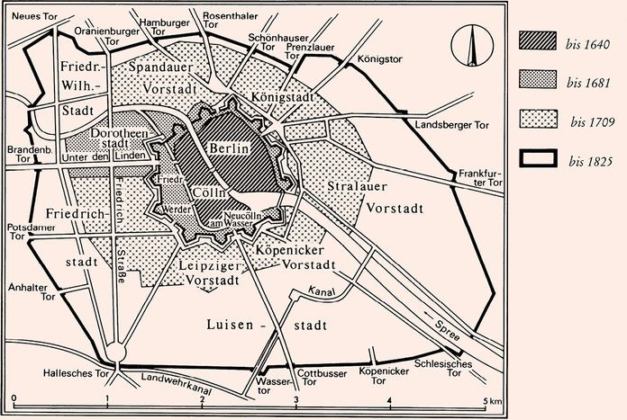
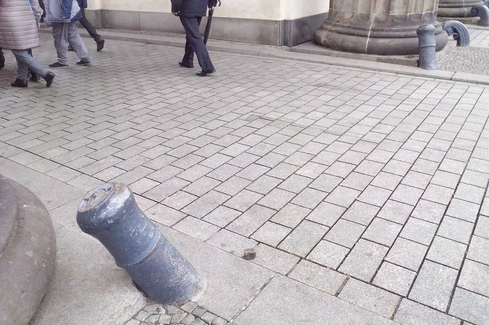
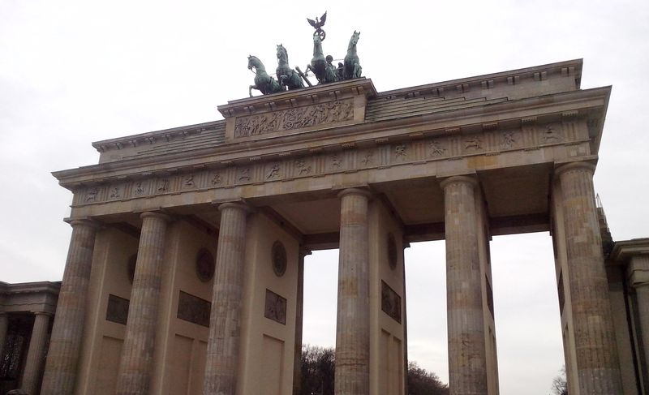

Brama Brandenburska (niem. Brandenburger Tor) jest dla turystów medialną ikoną Berlina, a dla mediów zagranicznych nawet symbolem Niemiec. Rozpoznawalna na całym świecie forma łuku triumfalnego na trakcie ceremonialnym stolicy, stanowi zakończenie alei Unter den Linden. Obecnie odbywają się tu koncerty, imprezy sylwestrowe. Symbol Berlina, zjednoczenia Niemiec, najbardziej rozpoznawalna budowla RFN i jedna z pierwszych wczesnoklasycystycznych budowli w Berlinie. W północnym budynku ogólnodostępny Pokój Ciszy, a w południowym IT.

Bramy zwykle kojarzymy z murami, więc jak to było z tymi murami Berlina? Było ich kilka, po kolei:

- Mury średniowieczne obejmujące położoną na wyspie osadę Colln oraz znajdujący się po drugiej stronie Szprewy na prawym brzegu Berlin. Zlikwidowany podczas budowy Twierdzy Berlin.
- Nowożytne fortyfikacje Twierdzy Berlin, których budowę zaczął Wielki Elektor, tak naprawdę nigdy nie zostały ukończone. Ale tym razem mury obejmowały także Friedrichswerder i Neucolln na lewym brzegu. Miejsce dokąd sięgała wskazuje Nowy Odwach.
- Wzniesiony w latach 1734-37 przez Fryderyka Wilhelma I Mur Celny i Akcyzowy (niem. Berliner Zoll- und Akzisemauer, w skrócie Zollmauer), jak sama nazwa wskazuje nie posiadający właściwości obronnych. Miał utrudniać przemyt.
- Mur Berliński z okresu Zimnej wojny, wybudowany w 1961 i istniejący do 1989, prawdopodobnie najsłynniejszy mur na świecie.

<BoxPageImageWrapper>

Mury Berlina: 1) do 1640 średniowieczne 2) do 1682 Twierdza Wielkiego Elektora 3) do 1825 czarną kreską zaznaczony Mur Celny, z opisanymi bramami.
</BoxPageImageWrapper>

Brama Brandenburska jest jedyną istniejącą do dziś pozostałością Muru Celnego, który obejmował cały obszar miasta, miał długość 17 km i początkowo 14, a później 18 bram. Zniesiono go w 1860, kiedy stał się zbyt wielkim problemem dla rozrastającego się miasta. Jego przebieg wciąż jest widoczny w układzie urbanistycznym, często w miejscu dawnych bram są węzły komunikacyjne. Podobnie jak większość innych bram nazwę swoją bierze od celu drogi, która przez nią prowadzi - w tym wypadku jest to miasto Brandenburg.

Pierwotnie była to zwykła, funkcjonalna, ale trywialnie wyglądająca brama miejska z przyległym budynkiem straży i urzędu. Stanowi jednak wylot najważniejszej drogi stolicy państwa, więc dość wcześnie postulowano nadanie jej bardziej okazałej formy. Pod koniec panowania Fryderyka II Wielkiego zapadła decyzja o budowie okazałej bramy, która byłaby jednocześnie pomnikiem najznaczniejszego króla Prus. Fryderyk urzędował i większość czasu spędzał w Poczdamie, w zbudowanym przez siebie pałacu Sanssouci, ale w Berlinie był uwielbiany, choć sam niezbyt chętnie się tam pojawiał.

Mur celny rozbudowano w 1788, dwa lata po śmierci Fryderyka II Wielkiego. Stara brama została zlikwidowana, była to okazja dla uczczenia Fryderyka. Budowa trwała 3 lata, projekt Carl Gothard Langhans, wybitny niemiecki architekt epoki klasycyzmu. Ślązak, bo urodzony w Kamiennej Górze.

Jego następca Fryderyk Wilhelm II chciał być porównywany do Peryklesa, stąd wzór bramy. Sam nie miał wielkich osiągnięć, ale chciał przemycić ideę, że z poprzednikiem zapewnili wiele lat pokoju. Stąd pierwotna nazwa nowej bramy: Brama Pokoju (niem. Friedenstor). Ma 20 m wysokości do gzymsu. Kopia propylei ateńskiego akropolu. Z każdej strony po sześć 15-metrowej wysokości kolumn doryckich z jońskimi kanelurami. W przejściach 20 reliefów prezentujących czyny Herkulesa (alegoria Fryderyka II). W ścianach zewnętrznych figury boga wojny Marsa i bogini mądrości Minerwy. Francuskie lufy armatnie.

- 1791 6 sierpnia uroczyste otwarcie i aż do 1918 przejazd środkiem był zarezerwowany tylko dla Hohenzollernów i ich gości.
- 1793 umieszczono kwadrygę autorstwa Johanna Gotfryda Schadowa; na cześć zwycięskiej interwencji w Batawie w 1787, kiedy to wojska pruskie pokonały armię francuską - "wojna która przynosi pokój", dlatego Wiktoria bogini zwycięstwa, pierwotnie była naga, później dodano szatę
- 1806 Napoleon po bitwie pod Jeną zabrał Kwadrygę do Paryża
- 1814 generał Ernst von Pfuel odesłał Kwadrygę do Berlina, w uroczystym pochodzie marszałek Blücher przywiózł ją z powrotem i została umieszczona na swoim miejscu. Wtedy też jej kopia została ukoronowana orłem pruskim na wieńcu dębowym z Krzyżem Żelaznym projektu Karla Friedricha Schinkla.

Od 1867 trwa stopniowy demontaż Muru Celnego i wszystkich bram. Niektóre z nich istniały jeszcze do 1945.

<BoxPageImageWrapper>

Wykonane z francuskich armat pachołki w środkowym, honorowym trakcie Bramy Brandenburskiej. W bocznych normalne odboje.
</BoxPageImageWrapper>

Kiedy 30 stycznia 1933 Adolf Hitler został mianowany kanclerzem, wieczorem odbył się słynny przemarsz SA z pochodniami. Jak to zauważył ambasador amerykański szturmowcy paradowali w kółko, żeby stworzyć iluzję liczebności.

W 1945 Brama została zniszczona, choć nie aż tak jak okolica. Z kwadrygi ocalała tylko jedna głowa końska (znajduje się w Märkisches Museum). Na szczęście podczas wojny wykonano gipsowy odlew, dzięki temu możliwa była rekonstrukcja.

- 1957 14 grudnia zakończona trwająca ponad rok odbudowa, bez kwadrygi.
- 1958 17 września dodano kwadrygę bez orła i Krzyża Żelaznego, które zostały uznane przez władze NRD za symbole pruskiego militaryzmu
- 1961 13 sierpnia zamknięta, Przez cały czas istnienia Muru Berlińskiego brak przejścia. Od wschodu na długim odcinku Unter den Linden strefa śmierci, cały plac Paryski niedostępny. Natomiast od strony zachodniej powstała platforma widokowa do oglądania NRD.

1985 8 czerwca Prezydent Niemiec Richard von Weizsäcker "*Jak długo Brama Brandenburska pozostanie zamknięta, tak długo sprawa Niemiec zostanie otwarta*" ([przemówienie](https://de.wikiquote.org/wiki/Richard_von_Weizs%C3%A4cker) na 21. Deutschen Evangelischen Kirchentag, Düsseldorf Die Deutschen und ihre Identität Vortrag des Bundespräsidenten auf dem 21. Deutschen Evangelischen Kirchentag)
>In Berlin habe ich eine Formulierung gehört, die jeder verstehen kann: Die deutsche Frage ist so lange offen, als das Brandenburger Tor zu ist.

<BoxPageImageWrapper>

Brama Brandenburska obecnie.
</BoxPageImageWrapper>

1987 12 czerwca Ronald Reagan po wizycie w Reichstagu, z którego dachu obserwował Mur. O godz. 14.00 [przemówienie "*Tear down this wall!*"](https://www.archives.gov/publications/prologue/2007/summer/berlin.html) na tle Bramy oddzielonej szybą kuloodporną ("Remarks on East-West Relations at the Brandenburg Gate in West Berlin")
>Standing before the Brandenburg Gate, every man is a German, separated from his fellow men. Every man is a Berliner, forced to look upon a scar. 
>President von Weizsacker has said: "The German question is open as long as the Brandenburg Gate is closed." Today I say: As long as this gate is closed, as long as this scar of a wall is permitted to stand, it is not the German question alone that remains open, but the question of freedom for all mankind. Yet I do not come here to lament. For I find in Berlin a message of hope, even in the shadow of this wall, a message of triumph. [...] We welcome change and openness; for we believe that freedom and security go together, that the advance of human liberty can only strengthen the cause of world peace. There is one sign the Soviets can make that would be unmistakable, that would advance dramatically the cause of freedom and peace. General Secretary Gorbachev, if you seek peace, if you seek prosperity for the Soviet Union and Eastern Europe, if you seek liberalization, come here to this gate. Mr. Gorbachev, open this gate. Mr. Gorbachev, tear down this wall!

- 1989 22 grudnia otwarcie ruchu. W sylwestra ludzie wdrapali się na szczyt i uszkodzili kwadrygę.
- 1994 Pokój Ciszy na wzór tego w ONZ
- 2000-02 zamknięta na czas renowacji, koszt 6 mln E. Roczne utrzymanie Kwadrygi 200 tys Euro.
- 2002 3 października w 15. rocznicę Zjednoczenia na rewersie niemieckiego Euro (10, 20 i 50 centów).
- 2004 zamknięty ruch kołowy ze względu na zanieczyszczenie.
