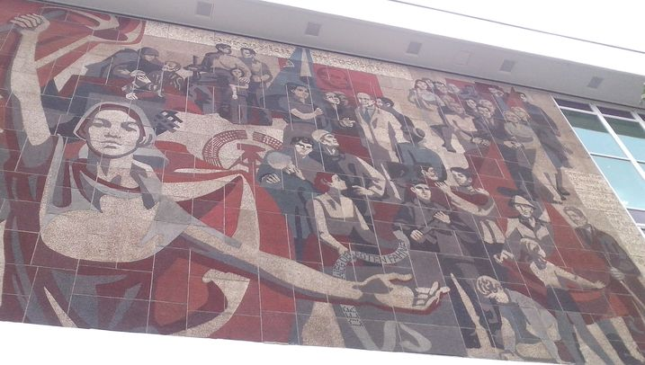

### Powstanie

W latach 50. XX planowano budowę monumentalnego wieżowca w stylu PKiN, ostatecznie jednak zrealizowano Kulturpalast w obecnej postaci. W konkursie wygrała płaskorzeźba autorstwa Rudolfa Sitte "Zmienność świata" (niem. Veränderbarkeit der Welt; [Wikipedia: Modell Kulturpalast Dresden (Westseite), Entwurf des Reliefs Veränderbarkeit der Welt von Rudolf Sitte, 1969](https://de.wikipedia.org/wiki/Rudolf_Sitte#/media/File:Modell_Kulturpalast_DD.JPG), ale zrezygnowano z niej z powodu sprzeciwu SED. Sitte w okresie powojennym znajdował się w artystycznym konflikcie z dominującym w NRD trendem socrealistycznym, uznany był za formalistę i miał z tego powodu wiele problemów. Kolejny projekt autorstwa Ralfa Winklera (znanego późnej jako A. R. Penck) w stylu sztuki starożytnego Egiptu również się nie spodobał. W latach 1968-69 grupa artystów pod kierunkiem Gerharda Bondzin, profesora Drezdeńskiej ASP (niem. Hochschule für Bildende Künste Dresden), zaprojektowała i wykonała obecny: "Droga Czerwonej Flagi" (niem. Der Weg der Roten Fahne) o szerokości 30 metrów. Podobno Bondzin wyciągnął z szuflady swój niezrealizowany szkic dla budynku Robotronu.

Bondzin nota bene urodzony w Morągu, był w tym czasie, tj w latach 1965-70 rektorem ASP, a w latach 1970-74 pełnił funkcję Prezydenta Stowarzyszenia Artystów Plastyków NRD (niem. Verband Bildender Künstler der DDR). Od 1953 był członkiem partii SED, w latach 1969-84 funkcjonariuszem partyjnym szczebla okręgowego. Był więc człowiekiem zaufanym politycznie i stworzył wzorcowy przykład socrealizmu w formie i treści.

### Opis

Pierwotnie miał mieć formę malunku naściennego, ale ograniczenia czasu i środków spowodowały zastosowanie 450 płyt betonowych, pokrytych elektrostatycznie barwną emalią i szkłem. Znajduje się na zachodniej elewacji, nie zobaczymy jej od strony Altmarktu.

Przedstawia w stylu socrealistycznym drogę do socjalizmu i umieszcza NRD w kontekście historii Niemiec i ruchu robotniczego. Jest to tradycja niemieckiego ruchu robotniczego w komiksowym ujęciu, zaczyna się od rewolucji 1848 i kończy się powstaniem NRD. Proces historyczny w ujęciu materializmu historycznego. Celem było "kształtowanie świadomości socjalistycznej".

*Droga Czerwonej Flagi - początek, od Wiosny Ludów do zwycięstwa Rewolucji Październikowej.*

Zaczyna się w w lewym dolnym rogu. Pochylona kobieta zbiera kamienie, mężczyzna podnosi ciężki kosz z kamieniami. To mąż i żona zbierają bruk, broń proletariatu. Nad nimi mężczyzna z karabinem podnosi się z pozycji klęczącej, patrzy w przyszłość. To Wiosna Ludów 1948.

Nad nim stoją wyprostowani Karol Marks ze swoim dziełem, a po prawicy Fryderyk Engels z karabinem (brał udział w walkach). Narodziny Manifestu Komunistycznego, który od powstania wytycza drogę walki klasowej pod sztandarem Czerwonej Flagi. Nad nimi kobieta podnosi Czerwona Flagę. Powyżej napis "Wyzwolenie klasy robotniczej może być tylko dziełem samej klasy robotniczej" (niem. Die Befreiung der Arbeiterklasse kann nur das Werk der Arbeiterklasse selbst sein), cytat z Marksa.

Uwięzieni i spętani robotnicy, za nimi żołnierz cesarski w pikielhaubie. Walka Bismarcka z socjalistami z SPD, działalność była wtedy nielegalna, a aktywiści więzieni. Jednak nie osłabiło to ruchu robotniczego, a wręcz przeciwnie. Wpływy SPD wzrosły. Poniżej w skrócie perspektywicznym dramatyczne walki uliczne, konny policjant, drut kolczasty, mężczyzna z czerwoną flagą jest schwytany, ale walczy. Nie jest pokonany.

Grupa trzech osób w zimowych ubraniach stojących frontalnie. W postawie duma i siła. Kobieta po lewej ma czerwoną flagę, dwaj mężczyźni uzbrojeni w karabiny. Mają CKM. Nad nimi gwiazda pięcioramienna. To Rewolucja Październikowa.

*Droga Czerwonej Flagi - od Rewolucji Październikowej do pokonania Hitlera.*

W sąsiedniej grupie ludzie słuchają jak przemawia Ernst Thälmann, ma wyciągniętą pięść w pozdrowieniu komunistycznym. Po jego lewej kobieta trzyma pakiet z ulotkami i je rozdaje. Narodziny międzywojennego ruchu robotniczego. Ernst Thälmann był przywódcą powstania robotniczego w Hamburgu w 1923, w 1924 został wybrany do Reichstagu, 1925 przewodniczący KC KPD. Człowiek Stalina, później należał do Międzynarodówki Komunistycznej. Od 1933 więziony w KL, rozstrzelany w Buchenwaldzie na osobisty rozkaz Hitlera po zamachu lipcowym. Nad tą grupą cytat z Karla Liebknechta: "Życie staje się naszym programem - mimo wszystko" (niem. Leben wird unser Programm - trotz alledem).

Czasy prześladowań hitlerowskich. Człowiek za drutami kolczastymi, zabity towarzysz owinięty w czerwoną flagę, jego żona tuli dziecko, towarzysze oddają mu hołd.

Centralna postać kobieca z Czerwoną Flagą metafora idei/walki/celu/ojczyzny. Jest dominantą i główną postacią. Symbolicznie dzieli przedstawiony czas na Walkę (1848-1945) i Zwycięstwo (powstanie NRD). Przedstawiona w pozie podobnej do rzeźby "Robotnik i kołchoźnica" (ros. Рабочий и колхозница) Wiery Muchiny wykonanej na dla radzieckiego pawilonu na wystawie światowej w Paryżu w 1937. Znana z czołówki Mosfilmu.

Po drugiej stronie grupa wyzwolenia. 1945 wznowienie walki niemieckiej klasy robotniczej z bratnią pomocą Związku Radzieckiego. Podzielona na dwie sceny: radziecki żołnierz wyzwala więźnia obozu koncentracyjnego, dalej dwaj mężczyźni, jeden z pepeszą i dziecko z gestem pokazywania numeru obozowego. Nad nimi napis "Jesteśmy zwycięzcami historii" (niem. Wir sind die Sieger der Geschichte).

*Droga Czerwonej Flagi - NRD.*

Czasy pokoju. W tle godło NRD i Czerwona Flaga z głową Lenina. Grupa młodzieży z flagą FDJ (Freien Deutschen Jugend) spotyka Waltera Ulbrichta, pierwszego sekretarza KC Socjalistycznej Partii Jedności Niemiec (SED). Prawa ręka w geście retorycznym.

Poniżej dwóch robotników rozmawia ze sobą, trzeci w kasku i goglach patrzy w przyszłość. Uzbrojony strażnik, niemiecki robotnik i żołnierz radziecki w braterskim uścisku

Przed nimi młoda kobieta w ubraniu roboczym przesuwa przez ręce wstęgę taśmy perforowanej z komputera, napis "Der Weg der Roten Fahne". Te grupy wyrażają wspólną pracę, udział w rządzeniu i rewolucję naukową i techniczną w NRD.

W dolnym prawym rogu Czerwoną Flagę w geście przysięgi trzymają pionier, robotnik i żołnierz NVA.

W prawym rogu u góry młodzi ludzie różnych klas i zawodów zjednoczeni ideą i braterstwem, maszerują ramię w ramie niosąc Czerwoną Flagę, jakby ilustrując słowa "Brüder, in eins nun die Hände" z pieśni "Brüder, zur Sonne, zur Freiheit" (ros. Смело, товарищи, в ногу!). Jest to piosenka marszowa zesłańców syberyjskich skomponowana w 1898. W 1918 powstaje niemiecka wersja, na swoje potrzeby przerobili ją nawet naziści. Po wojnie wykonywana w wielu kontekstach, i SPD i zjazdy SED.

### Znaczenie i zachowanie

Do pewnego stopnia "Droga Czerwonej Flagi" nawiązuje do znajdującego się na ścianie Zamku "Orszaku książęcego". Umieszczono ją wszak na ścianie Pałacu, nowego typu bo pałacu należącego do Ludu. Artysta nie ma tu do dyspozycji ściany szerokości 90 metrów, wykorzystuje więc dynamicznie wijąca się osnowę łopoczącej flagi do przedstawienia opowieści o diametralnie odmiennej treści ideologicznej. "Orszak" linearnie i statycznie prezentuje historię Saksonii jako dzieje dynastii Wettynów, to monarchowie i ich otoczenie tworzą historię. Enerdowscy ideolodzy powiedzieliby, że jest to burżuazyjna afirmacja monarchii. Tymczasem tytułowa Czerwona Flaga jest bardzo ogólną metaforą idei, która istniała zawsze i napędzała podziemne wody niespisanych w oficjalnych kronikach buntów, zrywów i powstań. Wyrażona została podczas Wiosny Ludów i dopiero tu zaczyna się opowieść. Odkryta i wyrażona przez Marksa i Engelsa, została przekuta w dzieło walki i pracy przez agitatorów i działaczy partyjnych.

Forma jest idealistyczna i ogólnoniemiecka. Przecież Wiosna Ludów to także Powstanie Marcowe w Dreźnie. Ale nic tu nie nawiązuje do wydarzeń drezdeńskich. Przedstawienie Rewolucji Październikowej obywa się bez Lenina. Są tylko cztery postacie historyczne, wszyscy to Niemcy i żaden z nich nie jest związany z Dreznem. Twórcy i założyciele Partii - Marks i Engels; walka przedwojenna: Thälmann; utworzenie NRD: Ulbricht. Ponieważ nie są w żaden sposób wyróżnieni spośród anonimowych aktorów historii również ich można traktować jak symbole raczej, niż konkretne upamiętnienie, na wzór tego dokonanego w "Orszaku". Tak więc Bondzin, twórca "Drogi Czerwonej Flagi" dał NRD nowy "Orszak", ale jest to orszak zupełnie co innego wyrażający i w zupełnie inny sposób.

Dyskutowano nad celowością zachowania mozaiki. Przeważył jednak pogląd, że nie jest to propagowanie ustroju totalitarnego, a historyczna pamiątka przeszłości Drezna, epoki która je kształtowała przez 40 lat. W 2001 mural został uznany za zabytek, 10 lat później także Kulturpalast. Teraz jest wyremontowany, a "Droga Czerwonej Flagi" odnowiona.

Jako ilustracja muzyczna może służyć niniejszy utwór: [Socialist World Republic - Sozialistische Weltrepublik HD 1080p [Youtube 2:26]](https://www.youtube.com/watch?v=yqr1BnpY628)

Opis za: [dresden.de: Wandbild „Der Weg der Roten Fahne“](http://www.dresden.de/de/kultur/kulturentwicklung/kulturpalast/weg-der-roten-fahne.php).
