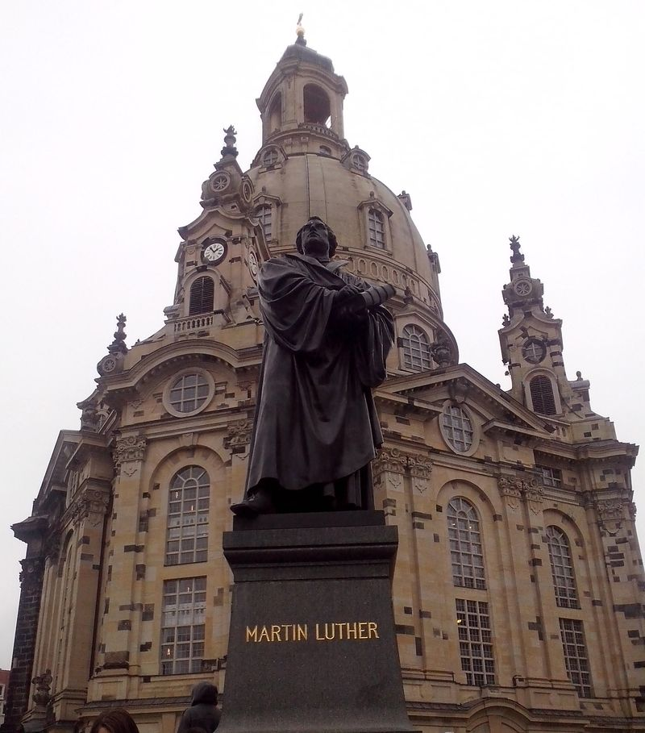
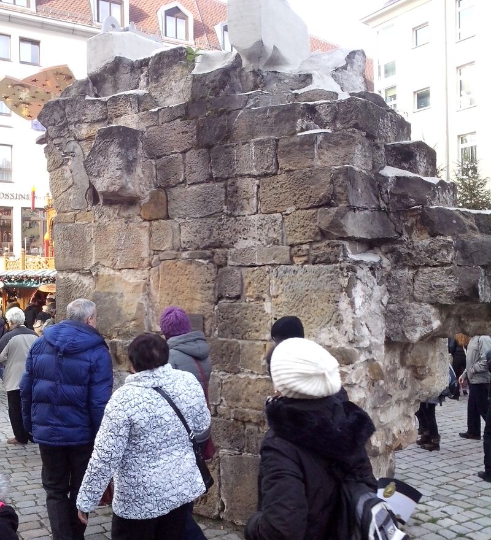

Najsłynniejszy z drezdeńskich kościołów, ani nie jest najstarszy, ani - bardzo długo - nie był najważniejszy. Kościołem parafialnym średniowiecznego Drezna był kościół św Krzyża wzniesiony w narożniku Altmarktu. Z powodu znajdującej się w nim relikwii Krzyża Świętego ściągał wielu pielgrzymów.

Tymczasem Frauenkirche został zbudowany poza murami miejskimi przy placu przed bramą, był więc świątynią przedmieścia. Pierwsza wzmianka o nim pochodzi z 1316: Friedrich Klemme zamawia mszę na pamiątkę zmarłych w chórze kościoła Matki Bożej. Później biskup miśnieński Witigo II (panowanie 1312-42) potwierdza że klasztor Seußlitz ma prawo patronatu kościoła NMP (niem. zu unser lieben Frauen) w Dreźnie. W Miśni też jest kościół maryjny.

Aż do XVIII wieku był to wyraźnie zaznaczający się w panoramie miasta kościół, ale mniej prestiżowy i uboższy. Była to typowa, gotycka świątynia na planie czworoboku, z wysoką wieżą i gotyckim hełmem. Wiadomo o nim niewiele i można przytoczyć tylko kilka dat:

- 1477 - rozbudowa chóru
- 1497 - świetliki dachowe
- 1556-59 powiększenie kościoła i przebudowa wnętrza, empora i nowe ławki
- 1560-65 - nowy cmentarz
- 1584 - nowy ołtarz z piaskowca wysoki na 13 łokci, rzeźbiarz Christoph Walther II

W XVIII wieku był to już stary i rozlatujący się kościół, zbyt mały wobec potrzeb. Na dodatek dawny plac przed bramą miejską po przebudowie Drezna w nowożytną fortecę stał się drugim centrum miasta o czym świadczy jego nazwa Neumarkt. Panujący wówczas elektor Saksonii, a był nim August II Mocny, żeby zostać królem Polski przeszedł na katolicyzm. To obudziło niechęć i podejrzenia wśród mieszczan, którzy od pokoleń byli luteranami i kiedy August zaczął stawiać efektowne barokowe budowle, także chęć rywalizacji. Kiedy król idzie w przepych, miasto nie może zostać w tyle. Tak więc z jednej strony był już najwyższy czas zamienić stary kościół na nowy, z drugiej strony była to najlepsza pora by postawić reprezentacyjną budowlę. Król zresztą wspierał budowę, chciał mieć w swoim mieście nowoczesny, barokowy kościół. W 1722 - 26 IV ostatni raz użyto dzwonów starego kościoła, nastąpiła rozbiórka wieży dzwonnicy i chóru, ale częściowo rozebrany budynek używany był jeszcze przez kilka lat, aż do 1727.

26 VIII 1726 położenie kamienia węgielnego. Budowa odbywała się pod nadzorem burmistrza Christiana Schwarzbacha i senatora Johanna Christopha Behnischa, kierownikiem budowy był urzędnik Christian Friedrich Rabenstein. Najważniejszą jednak osobą podczas budowy był projektant i sprawujący nadzór techniczny, budowniczy miejski Georg Bahr (1666-1738). Jego pomocnikiem był mistrz budowlany Johann Christian Fehre. W celu sfinansowania zorganizowano loterię. Wzniesiony jako "St. Peter der wahren evangelischen Religion".

Jest to w skali barokowego Drezna ogromny kościół zbudowany na podstawie kwadratu o bokach 40x40m i zwieńczony kopułą 95 m wysokości, Kopuła wykonana była z litego piaskowca nadłabskiego, wnętrze wyłożone marmurami. Kopuła została zwieńczona latarnią już po śmierci George'a Bähra w 1738 (który od 1732 nadzorował również budowę kościoła Trzech Króli) przez Christiana Fehre.

Siedemnaście lat po rozpoczęciu budowy 27 V 1743 umieszczono złocone zwieńczenie kopuły. Kopuła wg pierwotnie przedstawionej radcom dokumentacji miała być drewniana pokryta miedzią, ale Bahr w trakcie zmienił projekt na kamienną zapewniając, że wybudował odpowiednie fundamenty. Ujawnił to Radzie dopiero w 1729, co spowodowało wiele kontrowersji. Mimo oporów zbudowano kopułę kamienną. Ostrzał artylerii pruskiej 1760 upewnił drezdeńczyków że konstrukcja jest solidna.

*Pomnik Lutra na tle Frauenkirche. Ciemne bloki w elewacji są oryginalne.*

Kopuła Frauenkirche stała się jednym z najbardziej charakterystycznych elementów sylwetki Drezna, była wówczas i jest dzisiaj najlepszym punktem widokowym. Podczas Powstania Majowego w 1848 to właśnie z niej Richard Wagner składał raporty o ruchach wojsk saskich i pruskich. Wymagała jednak przeglądów, których najwidoczniej zabrakło. Jeszcze przed WWII policja budowlana uznała, że względu na brak remontów kopuła, wybudowana na krawędzi możliwości technicznych, zaczęła grozić zawaleniem. Kościół został zamknięty.

Kościół w zasadzie wytrzymał katastrofalne bombardowanie w lutym 1945. Wnętrze zostało wypalone, kościół trzeszczał i pękał, zaczynał się się rozpadać. Całą następną noc dobiegały z wnętrza huki i trzaski. Dopiero następnego dnia rano kamienna kopuła ważąca 12 tys ton runęła z ogromnym hukiem, który słyszano w całym mieście.

Pozostała sterta gruzów (22 tys m3). Od samego początku postulowano odbudowę. Jeszcze w 1945 (m. in. plakat projektu Paula Sinkwitza), ale nowy porządek polityczny marginalizował rolę kościoła. Tym bardziej w Dreźnie, gdzie znajdował się największy garnizon Armii Czerwonej w NRD. Był nawet projekt usunięcia gruzów i budowy parkingu, ale wzbudziło to taki sprzeciw mieszkańców miasta, że konserwator zabytków zapewnił że ruiny zostały zabezpieczone i nie będą usunięte. Na pocz 60. XX oficjalnie ogłoszony pomnikiem wojny.

*Fragment oryginalnej kopuły Frauenkirche umieszczony w pobliżu odbudowanego kościoła.*

Było to miejsce słynnych demonstracji - po raz pierwszy 13 II 1982 w rocznicę bombardowania młodzi ludzie ze świecami zebrali się na gruzach, które stały się w ten sposób symbolem ruchu pokojowego w NRD.

Pod koniec istnienia NRD w listopadzie 1989 formuje się inicjatywa obywatelska na rzecz odbudowy kościoła i 13 lutego 1990 wystosowuje "Ruf aus Dresden" publiczny apel o zbiórkę pieniędzy. Wkrótce Kościół Luterański Saksonii i Drezna zgadzają się wspierać odbudowę. 4 stycznia 1993 rozpoczynają się prace archeologiczne, gruzy są wydobywane i zabezpieczane. 4 VI odnaleziono krzyż ze zwieńczenia kopuły. 27 V 1994 początek odbudowy. 26 VIII 1996 inauguracja kościoła w obecnych podziemiach bp Volker Kress. 30 X 2005 uroczyste poświęcenie odbudowanego kościoła.

Charakterystyczny kościół w kształcie dzwonu jest dziś jedną z najbardziej charakterystycznych świątyń Niemiec, a w mediach symbolem Drezna i kościoła ewangelicko-augsburskiego.
