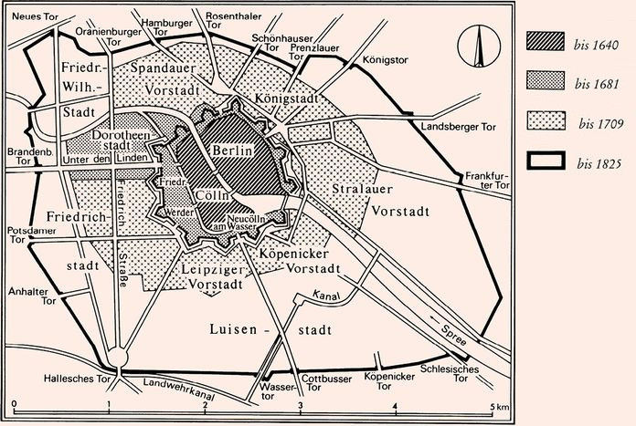

### Początek, wcale nie w Berlinie

Opis Berlina należy zacząć od tego, że w 1920 - podobnie jak wiele innych miast niemieckich w tym okresie - został on powiększony i to znacznie, bo ponad dziesięciokrotnie. Rozrost z ponad 80 do prawie 900 km2 oznaczał, że nagle w jego granicach znalazło się kilka innych miast i kilkadziesiąt dotychczasowych wsi. Czyli to co znamy jako centrum osadnicze związane z wyspą na Szprewie, które było zaczątkiem tego co znamy jako Berlin, wcale nie jest najstarszą częścią miasta, ani i to dość długo nie było najważniejszą.

W średniowieczu na terenie dzisiejszego Berlina znajdowało się wiele osad i grodów Słowian połabskich, takim grodem było Spandau, ale najważniejszym wśród nich była Kopanica, czyli dzisiejsze Kopenick. Była to stolica plemienia Szprewian. W XII władzę sprawował tam Jaksa z Kopanicy, przywódca plemienia Stodoran, zwanych też Hawelanami.

Ostatecznie panowanie Słowian na tym terenie zakończył Albrecht Niedźwiedź ustanowiony przez cesarza w 1134 margrabią Marchii Północnej. Albrecht kilka lat później organizuje krucjatę połabską i dołączając podbite ziemie słowiańskie w 1157 tworzy Marchię Brandenburską (niem. Mark Brandenburg). Zapoczątkował dynastię askańską. Ściąga osadników z Harzu, Nadrenii i Frankonii. Nad Szprewę sprowadza templariuszy (stąd nazwa Tempelhof).

### Berlin (poł XIII w)

1197 to pierwsza wzmianka o Spandau. W XIII wieku wreszcie pojawia się Berlin, lub ściśle rzecz biorąc: dopiero w XIII wieku. Ponadto bardzo długo były to dwie oddzielne osady: Cölln na dzisiejszej Museuminsel i Berlin a na wschodnim brzegu Szprewy, w rejonie dzisiejszego Nikolaiviertel. W miejscu obecnej Mühlendamm powstaje targ. Prawdopodobnie ok 1230 obie osady otrzymują prawa miejskie lub się łączą. Za umowną datę założenia Berlina uznaje się pierwszą wzmiankę o Cölln - jest to 28 października 1237. Pierwsza wzmianka o Berlinie to dopiero 1244 "miasto nad Szprewą w pobliżu Cölln gdzie bije się monety". Prawa miejskie Berlin z cała pewnością otrzymuje w 1251. W 1280 jest to pierwsza mennica Marchii na wschód od Łaby.

Ale nie ma mowy o rozwoju. XIV wiek to czas raczej upadku i problemów. Na samym początku tzn w 1307 oba miasta łączą się już ostatecznie, choć nadal zachowują swoje nazwy i pewną niezależność, np biją własne monety aż do XV wieku. Zaczyna się również budowa dwóch murowanych, ceglanych kościołów gotyckich: Nikolaikirche, który nadal stoi i jest najstarszym zabytkiem Berlina, oraz nieistniejącego obecnie Marienkirche. Niestety, założona przez Albrechta Niedźwiedzia panująca w Brandenburgii dynastia askańska wymiera. W 1319 umiera Waldemar Wielki, a rok po nim umiera jego jedyny syn 12-letni Henryk II Dziecię. Dla Berlina jest to koniec spokojnych czasów, od tej pory na długo Brandenburgia staje się przedmiotem sporów i wojen pomiędzy dynastiami Luksemburgów i Wittelsbachów. W 1325 wybuchają zamieszki, ginie w nich główny kaznodzieja z pobliskiego Bernau i aż do 1244 miasto zostaje obłożone papieskim interdyktem. W 1259 Berlin zostaje członkiem Hanzy. Dwa potężne pożary niszczą miasto w 1276 i 1280. Zła passa ciągnie się aż po XV wiek. Nikt wówczas nie uwierzyłby, nawet w to że jest to przyszła stolica Brandenburgii, a co dopiero Niemiec.

Aby zakończyć te nie przynoszące nikomu pożytku czasu chaosu cesarz Zygmunt Luksemburczyk w 1411 powierzył tytuł margrabiego Brandenburgii Fryderykowi, dotychczasowemu burgrabiemu Norymbergii. Dla Berlina jest on władcą tak samo ważnym jak Albrecht Niedźwiedź, bo od niego zaczyna się dynastia Hohenzollernów przez 500 lat, od 1411 do 1918, sprawująca władzę w Brandenburgii, a więc i w Berlinie.

### Stolica Brandenburgii (poł XIV w)

Lata 1440-71 to panowanie jego syna, elektora Fryderyka II Żelaznego. Wkrótce po objęciu władzy w 1443 rozpoczyna budowę zamku (Cöllner Schloss) na obecnej Wyspie Muzealnej co rozpoczyna wieloletni spór znany jako Berliner Unwillen, o ziemię na której budowany jest zamek i autonomię miasta. Fryderyk rozdziela miasta i zakazuje im sojuszy, w 1447 szuka rozejmu w Spandau. W odpowiedzi oba miasta berlińskie jednoczą się i wiosną 1448 niszczą konstrukcje i zatapiają fundamenty murów zamku na wyspie. Wyrok arbitrażowy w Spandau wydany 25 maja, jest kompromisem zaakceptowanym przez obie strony 19 czerwca i jesienią tego roku buntownicy zostają ukarani. Jest to poważne zwycięstwo księcia nad miejską autonomią. W symbolicznym geście Żelazny nałożył łańcuch na szyję niedźwiedzia - zwierzę herbowe Berlina. W 1451 zamek Cölln an der Spree jest ukończony i od 1470 staje się główną rezydencją elektorów brandenburskich. W ten sposób w XV wieku Brandenburgia staje się siedzibą dynastii Hohenzollernów, a Berlin stolicą Brandenburgii. Choć jest to awans do pierwszej ligi, nadal jednak jest to w tej kategorii jedno z mniejszych i mniej znaczących miast niemieckich i bardzo długo tak pozostanie. Przyczyną jest słabość Brandenburgii.

### Reformacja (od 1539)

Elektor brandenburski z okresu początków Reformacji Joachim II Hektor prywatnie sprzyja Lutrowi jednak nie chce konfliktu z cesarzem. Więc choć popiera ewangelicyzm na wiele sposobów dopiero po kończącym serię wojen religijnych pokoju w Augsburgu w 1555 decyduje się oficjalnie przejść na stronę Reformacji. Od tej pory Brandenburgia to kraj w większości luterański. Jest też władcą niebywale rozrzutnym. Od 1540 wznosi wystawny, renesansowy zamek w Köpenick, a kiedy umiera tam w wieku 65 lat, w 1571 zostawia i Marchię i miasto z ogromnymi długami. Wkrótce na miasto spada epidemia dżumy zabijając 9 tysięcy ludzi. Berlin jednak rozwija się, w 1600 ma już 12 tysięcy mieszkańców.

### Wielki Elektor (1640-88)

Niszcząca całe Niemcy wojna trzydziestoletnia trwająca w latach 1418-48 jest tragedią także dla Berlina. Miasto okupowane jest przez Austriaków, a później przez Szwedów. Traci połowę z 12 tysięcy mieszkańców i 1/3 zabudowy, przedmieścia spłonęły.

Jeszcze podczas wojny w 1640 władzę w Brandenburgii obejmuje Fryderyk Wilhelm I, bardziej znany jako Wielki Elektor (niem. Große Kurfürst). Jest rodowitym berlińczykiem, bo urodził się na zamku Cölln. Znany jest w historii jako władca, który podniósł Brandenburgię z upadku po zniszczeniach wojennych, prowadząc umiejętną politykę polegającą głównie na otwarciu Brandenburgii na obce wpływy. Jego żona pochodziła z obecnej Holandii i zaraz po ślubie w 1846 do Brandenburgii przybywają tysiące Holendrów sprowadzając majątki, wiedzę, doświadczenie. Wśród nich są artyści, rzemieślnicy, budowniczowie, rolnicy i kupcy. O razu rusza przebudowa Berlina. W 1647 rozpoczyna się porządkowanie drogi prowadzącej do Tiergarten, w ten sposób wytycza się nową oficjalną oś miasta. Aleje buduje się według holenderskich wzorów obsadzając ją lipami, stąd jej nazwa - Unter den Linden. W Berlinie i okolicach powstała "kolonia holenderska".

<BoxPageImageWrapper>

Berlin w 1856. Mapa w orientacji wschodniej (tzn. wschód jest u góry). 
**Berlin**: widać oba kościoły: NMP i św Mikołaja. Budynek pośrodku opisany jest jako Berliniser Rahthaus - znajduje się w miejscu obecnego Czerwonego Ratusza. 
**Cölln**: na wschodzie jest Ratusz, na zachodzie kościół pw św Piotra. Na północy obecnej Museuminsel Zamek i Lustgarten. Jeszcze przed wytyczeniem Unter den Linden i budową nowoczesnych fortyfikacji. 
Widać też, że południowa część wschodniego brzegu wyspy wytyczona jest starorzeczem, a północna jest przekopana.
</BoxPageImageWrapper>

W 1662 listem Elektora zostaje powołane Friedrichswerder, pierwsza część Berlina na zachód od Szprewy i fosy.

W latach 1662-68 budowany jest kanał Odra-Szprewa, powstaje w ten sposób bardzo ważny szlak handlowy Wrocław - Hamburg, przepływający w pobliżu Berlina, który dzięki niemu nabiera znaczenia.

Od 8 września 1662 do 29 czerwca 1663 na zamku Cölln trwała dysputa religijna (Berliner Religionsgespräch) pomiędzy luteranami, którzy stanowili dominujące wyznanie i miejscowymi kalwinistami. Przewodniczył jej pierwszy minister Otto von Schwerin. Choć po 17 sesjach została zakończona bez rezultatu to w 1664 Elektor wydał akt tolerancyjny zakazujący prześladowania kalwinistów, co luteranie widzieli jako naruszenie formuły zgody z 1577 wydanej przez Jana Jerzego Hohenzollerna.

W latach 70. XVII wieku powstaje Neustadt wytyczony wzdłuż Unter den Linden, wytyczony przez Joachima Ernsta Blesendorfa nadzorcę fortyfikacji i planistę, Sięga na północ po Szprewę a na zachód po Großer Tiergarten. Otrzymuje prawa miejskie i jest darem Elektora dla drugiej żony, którą była Dorothea Sophie von Schleswig-Holstein-Sonderburg-Glücksburg. Dlatego Neustadt w 1681 otrzymuje nową oficjalną nazwę: Dorotheenstadt.

Kiedy słynny król francuski Ludwik XIV "Król Słońce" w 1685 wydając Edykt z Fontainebleau (fr. Édit de Fontainebleau) nakazujący w praktyce likwidację tolerancji religijnej i możliwości wyznawania jakiegokolwiek innego rodzaju chrześcijaństwa oprócz katolicyzmu Francję opuszcza kilkaset tysięcy hugenotów czyli protestantów francuskich. Już w dwa tygodnie po Edykcie z Fontainebleau Wielki Elektor wydaje Edykt Poczdamski będący zaproszeniem dla prześladowanych francuskich dysydentów religijnych. Na jego treść wpływ miał Jacques Abbadie ówczesny kaznodzieja francuskiej gminy ewangelicko-reformowanej w Berlinie, który Francję opuścił jeszcze w 1880. Oprócz prawa do osiedlenia się i swobody kultu, edykt Elektora gwarantuje im zwolnienia podatkowe, dotacje oraz finansowe wsparcie dla duchownych. Ponad 20 tysięcy francuskich protestantów przybywa do Brandenburgii. Ludność Berlina wzrosła o 1/3 i Berlin na długo stał się miastem w dużej części francuskim.

<BoxPageImageWrapper>

Dzieło Wielkiego Elektora. Berlin w 1688. Fortyfikacje nowożytne z bastionami. Berlin (A), Cölln (B), Der Friedrichswerder (C), Neu Cölln (D), Die Dorotheenstadt (E), Berliner Vorstadt (F). Widać wytyczoną Unter den Linden a na jej końcu, za fosą Tiergarten. Istnieją wszystkie trzy średniowieczne kościoły.
</BoxPageImageWrapper>

Następuje rozkwit miasta. Elektor w 1650 rozpoczyna fortyfikować Berlin w stylu północnowłoskim. Kupuje od Eleonory Hohenzollern zamek miejski w Poczdamie (niem. Potsdamer Stadtschloss) i rozbudowuje go do swoich potrzeb. Powstaje barokowa siedziba Hohenzollernów, po wybudowaniu pałacu Sanssouci używana jako pałac zimowy. Zmarł tam 9 maja 1688.

### Fryderyk I "król w Prusach" (1688-1713)

Pierwszy władca Brandenburgii, który zdobywa koronę królewską. Znany jest jako budowniczy, korzystając z dorobku swojego poprzednika wznosi wspaniały, barokowy Berlin. W 1691 zostaje założony eponimiczny Friedrischstadt.

- 1689 otwarto francuskie gimnazjum
- 1695 rozpoczyna działanie Friedrichshospital.
- 1695-1703 budowa Parochialkirche, najstarszego berlińskiego kościoła budowanego jako protestancki i ewangelicki reformowany; wówczas wszystkie berlińskie kościoły były luterańskie, wyjątkiem była kalwińska kaplica dworska (Hohenzollernowie przeszli na kalwinizm) niedostępna dla ludzi nie mających związków z dworem, jest to więc początek miejskiej gminy ewangelicko-reformowanej.
- 1695-1713 budowa Pałacu Charlottenburg dla żony króla, królowej Sophie Charlotte; w 1705 osada stała się miastem; pierwotna nazwa to Lietzenburg, bo wioska nazywała się Lietzow.
- 1695-1730 budowa Arsenału (Zbrojownia, Zeughaus).
- 1696 ASP w Berlinie (pierwotnie Academie der Mahler-, Bildhauer- und Architectur-Kunst), obecnie Akademia Sztuk (Akademie der Künste).
- 1700 powstaje Berlińsko-Brandenburska Akademia Nauk (pierwotnie Kurfürstlich Brandenburgische Societät der Wissenschaften) założona przez Gotfrieda Wilhelma Leibniza.
- 1701 król zamówił w Gdańsku Bursztynową Komnatę (Bernsteinzimmer) dla komnaty w Charlottenburgu, jego następca na znak sojuszu podarował ją w 1715 Piotrowi I Wielkiemu.
- 1701-05 powstaje Katedra Francuska (Franzosischer Dom).
- 1701-08 powstaje Katedra Niemiecka (Deutscher Dom).

Wydał ogromne sumy na powiększenie zbiorów Biblioteki Królewskiej w Berlinie, ściągnął wielu znanych uczonych i artystów. Średniowieczny i prowincjonalny Berlin bezpowrotnie odszedł w przeszłość. Powstała dzielnica oficjalna. Architekt Andreas Schlüter przebudową zamku ustanowił nowy standard. W 1706 pojawia się określenie "Ateny nad Szprewą" (niem. Spree-Athen). Jest to jedna z najbogatszych epok w historii Brandenburgii, powstawały liczne pałace i rezydencje w Berlinie, Poczdamie, Köpenick i Charlottenburgu.

Dekretem królewskim z 18 stycznia 1709 Berlin, Cölln, Friedrichswerder, Friedrichstadt i Dorotheenstadt zostają połączone w jedno "Königliche Haupt- und Residenzstadt Berlin", dekret wszedł w życie 1 stycznia 1710. Powstają dalsze przedmieścia. Ponieważ Berlin jest stolicą i metropolią następuje szybki rozwój gospodarczy i kulturalny. W tym czasie mieszka tam już ponad 50 tysięcy ludzi, z czego 1/10 to Francuzi.

### Fryderyk Wilhelm I (1713-40)

Jego następca i jedyny syn Fryderyk Wilhelm I zgodnie z życzeniem wystawił mu kosztowny pogrzeb, ale natychmiast po objęciu tronu zaczął oszczędzać, głównie przez minimalizowanie wydatków. Sam koronację miał skromną. Pięciokrotnie zmniejszył koszty dworu. Rozwiązał orkiestry, zamknięto operę, wstrzymano finansowanie Akademii. Z powodu oszczędności królewskich z Berlina wyemigrowali artyści i uczeni. W berlińskim pałacu z 700 pokojami używał tylko 5, a w jego podziemiach umieścił skarbiec. Charlottenburg nie był używany, stał pusty, ale ogrzewano go zimą by nie dopuścić do zniszczenia. Lustgarten zamienił na Exerzierplatz.

Urodził się na zamku Berlin-Cölln. Zmarł na zamku w Poczdamie i tam w kościele garnizonowym urządzono mu pogrzeb.

W 1717 został powołany Korpus Królewski Prus Wschodnich w Berlinie z zadaniem kształcenia kadry oficerskiej.

W 1732 umożliwił przybycie Braciom Czeskim, którzy osiedlili się w Rixdorfie niedaleko Berlina (obecnie w granicach miasta).

Miasto zostaje zmilitaryzowane i ogłoszone garnizonem. Wprowadza rygorystycznie przestrzegany pobór do wojska, a ponieważ powoduje to masowa emigrację młodych mężczyzn potrzebnych dla rozwoju gospodarczego stolicy, wyłącza jego mieszkańców z poboru. Finansował powstanie szpitali m in Charité w Berlinie. Populacja Berlina w 1740 wynosiła 79 tysięcy ludzi.

Ostatecznie porzuca dawne fortyfikacje, których budowę rozpoczął lecz nigdy nie dokończył Wielki Elektor. Były już w fatalnym stanie. Dla efektywnej kontroli handlu w latach 1734-37 budowany jest Mur Celny (niem. Berliner Zoll- und Akzisemauer, w skrócie Zollmauer) obejmujący cały obszar miasta, ma długość 17 km i początkowo 14, a później 18 bram. Początkowo to drewniana palisada, później solidniejsza konstrukcja z cegły i kamienia o wysokości 4 m. Jedyną wciąż istniejącą bramą tego muru jest Brama Brandenburska. Przebieg tego muru można jeszcze zobaczyć w układzie urbanistycznym, często w miejscu dawnych bram są węzły komunikacyjne. Jak sama nazwa wskazuje nie miał funkcji obronnej, służył efektywnemu ściąganiu opłat celnych, które były wówczas znaczącym źródłem dochodów państwa.

### Fryderyk II Wielki (1740-86)

Jeden z najbardziej znanych i cenionych władców niemieckich. Przeszedł do historii jako wielki wódz i zręczny, niecofający się przed niczym cyniczny polityk. W serii trzech wojen śląskich, które ostatecznie wygrał odbił od Austrii Śląsk i uczynił z niego źródło bogactwa Prus. Jest też inicjatorem pierwszego rozbioru Polski.

Różni się od ojca tym, że nie tylko nie gardzi sztuką, ale ceni ją i zna się na niej. Rozumie również znaczenie filozofii i nauki. Przywraca więc Berlinowi dawny blask, choć nie popada w rujnujące skarb państwa wydatki. Większość pieniędzy przeznacza na wojsko i wojny.

Na samym początku swojego panowania rozpoczyna przebudowę Berlina, jej plany wiele razy ulegały zmianie i ostatecznie z powodu ograniczeń finansowych zostały zrealizowane w ograniczonym zakresie. Wykonawcą poleceń Fryderyka był malarz i architekt Georg Wenzeslaus von Knobelsdorff. To jego dziełem były wszystkie architektoniczne inwestycje Fryderyka, który zresztą miał ogromny wpływ na ich wygląd.

Przede wszystkim chciał stworzyć nowe, oficjalne centrum miasta, ostatecznie ze względu na brak czasu i środków zrealizowane w uproszczonej formie za murami twierdzy przy Unter den Linden. To co udało się stworzyć później zostało nazwane Forum Fridericianum. Jest to obecny Bebelplatz.

- Berlińska Opera
- Państwowa Biblioteka Królewska (obecnie Państwowa Biblioteka w Berlinie)
- Katedra pw św Jadwigi (pierwszy katolicki kościół w Berlinie zbudowany od początku Reformacji - był potrzebny Fryderykowi jako gwarancja tolerancji religijnej dla uspokojenia katolików; po aneksji Śląska spora ich liczba znalazła się pod jego panowaniem)
- Pałac Księcia Henriego (Uniwersytet Humboldta)

Po pierwszych dwóch wojnach śląskich w latach 1745–1747 wybudowano poczdamski pałac Sanssouci (po francusku "bez trosk"), brał udział w projektowaniu i nadzorował budowę. Zamiast balów, maskarad i polowań, dominowały tam dyskusje filozoficzne, przechadzki, lektury i koncerty. Po zakończeniu wojny siedmioletniej zorganizował budowę Nowego Pałacu po zachodniej stronie Parku Sanssouci, który został ukończony w 1769 roku i był używany głównie dla gości dworu.

Berlin stał się ważnym ośrodkiem niemieckiego oświecenia. Fryderyk polecił prof Formey założenie w Berlinie francuskiej gazety o polityce i literaturze.

Na jego osobiste zaproszenie Voltaire od lipca 1750 do marca 1752 gościł w Berlinie, Poczdamie i Sanssouci. Ich znajomość zakończyła się głośnym zerwaniem, o co Fryderyk obwinił mieszczańskie pochodzenie gościa. Później się pogodzili.

Choć bywa bezwzględny wobec ludzi jest przeciwnikiem stosowania wobec zwierząt niepotrzebnego okrucieństwa. Kocha swoje psy i chce żeby były pochowane obok niego. Nie tylko nie ma czasu na polowania, ale w ogóle jest przeciwnikiem polowań. Ostatecznie zakończył funkcję Tiergarten jako terenów łowieckich. Od jego czasów powstaje tam park miejski.

Był ważnym sponsorem sztuk, kolekcjonerem obrazów i antycznych rzeźb, jego ulubionym artystą był Jean-Antoine Watteau. Jego kolekcja pałacowa jest wysoko oceniana zarówno ze względu na zawartość jak i organizację.

W wyniku kryzysu 1763 założył w Berlinie pierwszy bank wekslowo-pożyczkowy z kapitałem założycielskim wartości 8 mln talarów, co ustabilizowało nieco stosunki kredytowe.

1763 powstaje Königliche Porzellan-Manufaktur Berlin (KPM), europejska porcelana jest wówczas nowością, minęło dopiero 50 lat od powstania pierwszej europejskiej manufaktury porcelany w Miśni.

W testamencie zawarł życzenie skromnego pogrzebu i pochówku w wybudowanej 1741 krypcie na najwyższym tarasie Sanssouci ("żyłem jak filozof i jak filozof chcę być pochowany"). Zorganizowano mu oficjalny, państwowy pogrzeb w kościele garnizonowym w Poczdamie gdzie spoczął w grobowcu obok ojca. Pod koniec WWII ukryto oba sarkofagi w kopalni, a potem przeniesiono do rodowego zamku Hohenzollern w Szwabii. Po Zjednoczeniu Niemiec w 1991 wreszcie spełniło się życzenie króla i został pochowany w Sanssouci pod prostą płytą nagrobną z napisem Friedrich der Grosse. Obok znajduje się cmentarz jego psów, każdy z nich ma własny, marmurowy grobowiec.

Choć nie miał dobrego zdania o Polakach, uważał ich za dzikusów niezdolnych do organizacji sprawnie działającego kraju - zaprzyjaźnił się z Ignacym Krasickim, arcybpem gnieźnieńskim; poprosił go o konsekrację Katedry św Jadwigi w 1773. Zalecił swoim następcom nauczenie się języka polskiego. I rzeczywiście było to tradycją aż do Fryderyka III, który zadecydował że Wilhelm II nie nauczy się polskiego.

Zawsze był w Berlinie witany z entuzjazmem ale nie sprawiało mu to satysfakcji. Większość czasu spędzał w Poczdamie, w pałacu Sanssouci najważniejszym dziele północnoniemieckiego rokoko. Fryderycjańskie rokoko - to dzieło architekta królewskiego Georga Wenzeslausa von Knobelsdorffa.

Akademia Berlińska, która przedtem miała tylko znaczenie lokalne, a za czasów jego ojca została wręcz zamknięta, została od razu na początku jego panowania otwarta i szybko zyskała na znaczeniu. Fryderyk zarządził używanie języka francuskiego i filozofię jako najważniejszą dziedzinę. Również matematyka: Immanuel Kant, Jean D'Alembert, Pierre-Louis de Maupertuis i Etienne de Condillac. Pod koniec panowania Fryderyka miała już międzynarodowe znaczenie i odgrywała ogromną rolę w kształtowaniu życia umysłowego Niemiec. Na zaproszenie króla do Akademii przybył Joseph-Louis Lagrange po Leonhardzie Eulerze, obaj byli matematykami światowej klasy. Inni znaczni naukowcy to Francesco Algarotti, d'Argens, and Julien Offray de La Mettrie. Kant mógł publikować w Berlinie pisma religijne, które wszędzie indziej w Europie zostałyby ocenzurowane.

<BoxPageImageWrapper>

Berlin w 1789, istnieją już prawie wszystkie elementy obecnej dzielnicy (Ortsteil) Berin-Mitte. Alt Cölln (1), Berlin (2), Friedrichs Werder (3), Neustadt (4), Friedrichstadt (5), Neu Cölln (6), Königstadt (7), Spandauer Vierthel (8), Stralauer Vierthel (9), Köpnicker Vierthel (10). 
Widoczny zarys Muru Celnego. Na końcu Unter den Linden Brama Brandenburska (stara; 11), bardziej na południe Plac Poczdamski (12) i obecny Mehringplatz (pierwotnie Rondell, potem od 1815 Belle-Alliance-Platz; 13).
</BoxPageImageWrapper>

Już po śmierci "Starego Fryca" na jego cześć powstaje najważniejszy symbol Berlina: Brama Brandenburska zaprojektowana przez pochodzącego z Kamiennej Góry, słynnego śląskiego architekta Karla Gotfrieda Langhansa. Tereny łowieckie w Tiergarten nie tolerujący polowań król zamienił w zwierzyniec i park publiczny.

Hitler często porównywał się do Fryderyka, nieustannie miał przy sobie jego portret, nawet w berlińskim bunkrze. Do końca wojny liczył na "Cud Domu Brandenburskiego".

### Fryderyk Wilhelm II (1786-97)

Kontynuował rozbudowę Berlina i sprowadził do stolicy utalentowanych architektów. Za jego panowania powstaje Brama Brandenburska (Carl Gotthard Langhans z Kamiennej Góry).

<BoxPageImageWrapper>

Brama Brandenburska, Plac Paryski.
</BoxPageImageWrapper>

### Fryderyk Wilhelm III (1797-1840)

Początek panowania Fryderyka Wilhelma III przypada na niespokojne dla całej Europy lata wojen napoleońskich. Wielka Armia pokonuje Prusy i z pomocą sojuszników Francji przetacza się przez Europę. Prusacy muszą znieść porażkę. W latach 1806-08 Napoleon okupuje Berlin, zabiera Kwadrygę z Bramy Brandenburskiej (która wraca dopiero w 1814). Z powodu zagrożenia francuskiego król w latach 1807-09 przebywał w Królewcu.

Powrócił na żądanie Napoleona po piątej wojnie koalicyjnej. Napoleon chciał oddzielić go od cara. Do Berlina wjechał 23 grudnia 1809 uroczyście na czele wojska przez Bernauer Tor (przemianowaną później na Królewską).

Na lata 1809-13 przypadają przełomowe dla Prus reformy państwa, które ostatecznie kończą z prawnym dziedzictwem feudalizmu i średniowiecza. Prusy stają nowoczesnym państwem o ujednoliconym prawie, jednakowym dla każdego.

1809 założenie Uniwersytetu Berlińskiego (w latach 1828/49 Friedrich-Wilhelms Universitat, obecnie Uniwersytet Humboldta w Berlinie, dorobił się 41 noblistów). Podróżnik Alexander von Humboldt wpłynął na życie naukowe. Georg Wilhelm Friedrich Hegel katedra filozofii Uniwersytetu.

1810 Wilhelm von Humboldt dostaje zadanie stworzenia "dobrze wybranej kolekcji sztuki". Pomysł zebrania rozproszonych zbiorów w jednym miejscu - jest to późniejsza Museuminsel

1811 powstaje pierwszy stadion sportowy w Berlinie, efekt działalności założyciela niemieckiego ruchu gimnastycznego Jahna.

Po zwycięstwie nad Napoleonem przywieziono Kwadrygę. Jej podróż trwała 2 miesiące i była narodową uroczystością. Po powtórnym umieszczeniu na Bramie Brandenburskiej dodano zaprojektowany przez Schinkla żelazny krzyż w wieńcu z orłem pruskim.

Król wraca do Berlina w 1814 i regularnie pojawiał się w teatrze. Zarówno w Schauspielhaus jak i w Królewskim Teatrze Miejskim. Dzięki temu miał kontakt z ludem.

1821 powstaje Berliński Instytut Handlu pod kierunkiem Christiana Wilhelma Beuth.

1830 16-20 września w Berlinie tzw Schneiderrevolution, bitwa rzemieślników z policją.

1830 uroczyście otwarte Altes Museum, pierwsze berlińskie muzeum dostępne dla publiczności. Na obecnej Wyspie Muzealnej Karl Friedrich Schinkel stworzył jeden z najlepszych przykładów klasycyzmu, budowany w latach 1824-30 w Lustgarten. Po powstaniu kolejnych muzeów nazwane zostało Starym Muzeum. Jest to początek Museuminsel. Ma to ogromne znaczenie ideologiczne dla króla, uważa on że tworzenie w ten sposób tożsamości społeczeństwa miasta pacyfikuje nastroje społeczne. W tych samych latach powstają dwa znaczące dzieła Schinkla:

- Friedrichswerdersche Kirche (po wojnie istnieje tam muzeum Schinkla, obecnie zamknięty).
- Berlińska Akademia Budownictwa (niem. Schinkelsche Bauakademie), budowana w latach 1832-36.

1834-40 ukształtowanie Tiergarten w formie dostępnego dla wszystkich parku angielskiego, projekt: Peter Joseph Lenné.

Rozpoczyna się rewolucja przemysłowa, na Kreuzbergu działa fabryka lokomotyw, od 1838 działa pierwsza w Prusach linia kolejowa Berlin-Poczdam. Bayerische Ludwigseisenbahn działa już od 1834. Pochodzący z Wrocławia August Borsig, który samodzielną działalność rozpoczął w Berlinie w 1837, już w 1840 wyprodukował swoją pierwszą lokomotywę o nazwie Borsig oznaczoną nr 1.

O mało nie odwołał Prinzessinnengruppe (Johann Gottfried Schadow). Pomniki wodzów.

Architekci klasycyzmu: Schinkel, Lenné, Tieck i Rauch nadają Berlinowi nowoczesny wygląd. Powstaje deptak na Unter den Linden, Teatr Schauspielhaus (1818-21, Schinkel) oraz Schlossbrücke jeden z najpiękniejszych mostów berlińskich (1821-24, Schinkel). Stary Berlin taki jakim go znamy obecnie jest już prawie w całości ukształtowany.

Schinkel wspólnie z królem stworzył projekt Pałacu Charlottenhof w południowo-zachodniej części Sanssouci, budowanym 1826-1828. Była to najważniejsza siedziba króla, w czasie wolnym od obowiązków tronu.

1839 król odbył ostatnie wycieczki linią kolejową do Poczdamu, w testamencie przeznaczył milion talarów dla pruskiej linii kolejowej Wschód-Zachód (Berlin-Królewiec). Fryderyk Wilhelm III zmarł 7 czerwca 1840 w Berlinie po długotrwałej chorobie. Pochowany został w mauzoleum w parku pałacowym Charlottenburg obok pierwszej żony (projekt pomnika Christian Daniel Rauch).

W południowej części Tiergarten w pobliżu pomnika królowej Luizy wysoki na 6,5 m pomnik króla (projekt Friedrich Drake) - powstały w 1849 ze składek społecznych jako wyraz wdzięczności za założenie przez króla ogrodu zoologicznego. Obecnie w parku jest kopia, oryginał od maja 2009 w Cytadeli Spandau.

### Fryderyk Wilhelm IV (1840-61)

Choć rozumiał znaczenie przemysłu i nowoczesności był czlowiekiem głęboko religijny i przekonanym o swoim boskim posłannictwie. Był jednocześnie pragmatykiem jak i mistykiem.

Potępił deizm Fryderyka II, dlatego jako przeciwwagę dla czysto ziemskich przyjemności reprezentowanych przez pałac Sanssouci, na wschodnim krańcu parku zbudował Kościół Pokoju (1839 szkic oparty na wczesnochrześcijańskim kościele San Clemente w Rzymie), po 2 latach planowania zatwierdził plany - 20 października 1843. Wzorem wolnostojącej wieży dzwonowej Kościoła Pokoju był Campanile Santa Maria w Cosmedin w Rzymie. Na północ od parku Sanssouci pomnik upamiętniający koniec rewolucji.

W 1844 w południowej części Tiergarten powstaje pierwszy niemiecki ogród zoologiczny (niem. Zoologischer Garten Berlin).

1844 pierwszy zamach. Pistolet. Zamachowiec skazany na śmierć. 1850 drugi zamach na stacji poczdamskiej, zamachowiec wysłany do Halle gdzie spędził resztę życia.

1842 Johann Carl Friedrich August Borsig maszyna parowa w pałacu Sanssouci. Lokomotywy.

1844 pożyczka 25 mln talarów na sfinansowanie budowy kolei z Berlina do Królewca, tzw. Ostbahn

1845-50 budowa Landwehrkanal, było to wówczas daleko poza miastem. Zadaniem kanału było ominięcie miasta.

1847 3 lutego dekret o utworzeniu Landtagu decyzje finansowe. Nie był to reprezentatywny parlament ale zgromadzenie wszystkich 617 członków ośmiu regionalnych parlamentów wojewódzkich. Podzielona na 4 kurie.

W obliczu wydarzeń Wiosny Ludów w Paryżu i Wiedniu (luty i marzec 1848) - zwołał 18 marca 1848 r. do Berlina Zjednoczony Landtag, obiecując nadanie konstytucji. Rewolucja marcowa. Od początku marca 1848 w mieście nastroje rewolucyjne

- Od 9 marca dziesiątki tysięcy Berlińczyków zgromadziły się w Tiergarten.
- 11 marca współpraca pomiędzy Zgromadzeniem Ogólnym i władzami miasta.
- 18-19 marca powstanie barykad. Aby zapobiec rewolucji w Berlinie, król zdecydował się na ustępstwa
- 18 marca 1848 król zniósł cenzurę, obiecał zniesienie barier celnych, zwołanie Landtagu i reformę konfederacji niemieckiej. 10 tys osób zgromadziło się wokół zamku by poprzeć to działanie. Prawdopodobnie przez pomyłkę doszło do masakry. Sytuacja patowa. Król wywiesił białą flagę z napisem NIEPOROZUMIENIE. Próby pertraktacji. Plotka o krwawej masakrze z setkami zabitych. Wojsko pomimo przewagi 14 tys żołnierzy (wobec 4 tys powstańców) nie mogło sobie poradzić z barykadami. Generał Karl von Prittwitz radził zbombardować miasto.
- 19 marca król obiecał usunięcie wojska jeżeli znikną barykady. Odmawia wzięcia na siebie odpowiedzialności za ofiary. Uważa, że to spisek a nie rewolucja. Z balkonu musiał obserwować marsz pogrzebowy z ciałami zabitych, odsłonięte wyeksponowane rany od broni. Za masakrę zostali obwinieni dowódcy wojskowi i książę Wilhelm.
- 21 marca pozorna zmiana kursu, postawił się na czele rewolucji, ogłosił poparcie dla konstytucji, przejechał przez miasto z czarno-czerwono-złota opaską i taką flagą. Aby uniknąć nacisków ulicy na Parlament przesunął jego zebranie na listopad i wyznaczył je w Brandenburg. Król udał, że przyłączył się do rewolucji.
- 10 listopada 1848 generał Friedrich von Wrangel przemaszerował Bramą Brandenburską na czele 13 000 żołnierzy i 60 armat. Ponieważ rewolucja nie zmieniła położenia ekonomicznego lud był nią rozczarowany, więc nie stawił oporu. Pomimo izolowanych zamieszek zapanował pokój. Burżuazja sympatyzowała z robotnikami, ale byli przeciwni rewolucji i stali po stronie króla.
- 13 listopada 1848 obrona cywilna w Berlinie została rozbrojona.
- 5 grudnia 1848 Pruskie Zgromadzenie Narodowe w Brandenburgu. Konstytucja. Po rewizji części zbyt liberalnych artykułów złożył przysięgę na nową konstytucję 5 grudnia 1850: Prusy monarchią konstytucyjną z dwuizbowym Parlamentem. Izba niższa wybierana była przez wszystkich podatników, ale podzielonych na trzy kurie wg wielkości podatków. Nadal istnieją prowincjonalne sejmy. Król ma kontrolę nad służbą cywilną i wojskiem. Pomimo pewnego postępu utrzymywał system prawie bez zmian, konstytucja ta obowiązywała do 1918. Konstytucja przewidywała, że "podlega rewizji" przez "izby, które mają zostać utworzone". Co nie nastąpiło. W niemieckim systemie parlamentarnym inaczej niż w większości krajów premier, czyli kanclerz, nie był powoływany przez większościową grupę parlamentarną, ale był mianowany i odwoływany bezpośrednio przez cesarza. Będzie to miało ogromne skutki dla przyszłości Niemiec. Parlament zbierał się tylko na życzenie króla, który ma ponadto prawo bezwzględnego weta. Nie dał Prusom prawdziwej konstytucji wolał rządzić samorządami szlachty.

Bracia Grimm przybywają na zaproszenie króla na uniwersytet berliński.

W Tiergarten powstaje Zoo, jego ozdobą staje się wkrótce ogromne akwarium. 1842 przekazał menażerię ojca z Wyspy Bażanta (850 zwierząt) do nowego berlińskiego zoo, otwartego 1 sierpnia 1844 (pierwsze w Niemczech). Ścisła współpraca z architektami Alte Nationalgalerie i Neues Museum; Orangerieschloss w Poczdamie. Obok zamku Babelsberg pomnik August Kiß zwycięstwo nad rewolucją; Archanioł Michał i smok.

Z wyjątkiem Nowego Muzeum budynki związane z królem były poza Berlinem, szczególnie dużo było ich w Poczdamie, np. Nowa Oranżeria (niem. Orangerieschloss; 1851-64) i Brama Triumfalna (niem. Triumphtor; 1850-51). W Sanssousi bezpośrednio nawiązywał do FII. Przywrócił stan wnętrz. Tam też zmarł.

Rozwój kolei. Król podróżował pomiędzy Berlinem a Poczdamem czasami kilka razy dziennie.

1851 powstaje Wschodnia Kolej Pruska (niem. Preußische Ostbahn).

Słup ogłoszeniowy jest berlińskim wynalazkiem, niezadowolony z zaśmiecania miasta przez ulotki i afisze Ernst Litfaß wydawca prasy popularnej zaproponował postawienie specjalnych słupów na ogłoszenia. Dostał pozwolenie od władz miasta i 1 czerwca 1855 postawił pierwsze 100 słupów konstrukcji betonowej i wysokości 3 m. Od pomysłodawcy pochodzi jego niemiecka nazwa - Litfaßsäule. Pomysł szybko się rozpowszechnił w innych miastach, w Berlinie monopol na słupy miał jego wynalazca. Litfaß został upamiętniony placem w dzielnicy Mitte, a sam słup ma swój pomnik na Münzstraße (przy Alexanderplatz).

Związek między królem a ludnością stolicy był skomplikowany Nabierająca na znaczeniu burżuazja zaczęła przewyższać projekty budowlane monarchy jeśli nie w prestiżu to w wielkości. Według króla Berlin miał być potęgą nauki i sztuki, która zneutralizuje rewolucyjny potencjał. Wierzył, że rozbudowa Museumsinsel wzmocni lojalność berlińczyków. Sztuka i architektura miała być metodą edukacji i kształtowania świadomości poddanych. Zbudowano Nowe Muzeum na zbiory, których nie było w stanie pomieścić Stare Muzeum. Nastąpił dynamiczny rozwój urbanistyczny i industrialny Berlina, narastała różnica z Poczdamem. Złe warunki socjalne panowały w całym kraju, także w stolicy. W Berlinie 2500 osób mieszkało w 400 pokojach. W latach pięćdziesiątych XIX 35% wszystkich mieszkań w Berlinie składało się tylko z jednego pokoju. Kapitalizm berliński potencjał rewolucyjny dostrzeżony przez Marxa.

Pomnik Schildhorna, Berlin-Grunewald - ideologia historii Fryderyka Wilhelma IV; prezentuje jednocześnie wydarzenia historyczne, zwycięstwo margrabiego brandenburskiego Albrechta Niedźwiedzia nad plemionami słowiańskimi i manifestację chrześcijaństwa.

Patron wielu artystów (m in Karl Friedrich Schinkel i Felix Mendelssohn). Do 1810 poznał Karla Friedricha Schinkla, którego również zapraszał na wieczorne przyjęcia. Schinkel miał ogromy wpływ na poglądy króla w sprawach architektury. Ściśle współpracowali przy projekcie Pałacu Charlottenhof w SW części Sanssouci, budowanym 1826-1828. Była to najważniejsza siedziba króla, w czasie wolnym od obowiązków tronu.

W berlińskim Stadtschloss zajmował pokój na pierwszym piętrze. 3 główne pokoje: "Gwiazda Pokój" sala bankietowa, jadalnia i salon herbaciarnia. Przebudowana przez Schinkla wg wskazówek króla w stylu klasycyzmu. Król z żoną zapraszali wszystkich uczonych do nieformalnej wymiany myśli. Uważa się, że tutaj Humboldt odczytał 1. tom Kosmosu,

W latach 50. XIX zaczął zdradzać objawy choroby psychicznej, określanej łagodnie "zmiękczeniem mózgu". 1857 udar i częściowy paraliż, zachowanie stało się tak ekscentryczne, że jego młodszy brat zaczął zastępować króla w sprawowaniu władzy. 1858 gdy Fryderyk nie wracał do zdrowia, Wilhelm został ustanowiony regentem.

<BoxPageImageWrapper>

Rozwój terytorialny Berlina do XIX wieku. Kolejne szrafury pokazują etapy rozwoju miasta. 
Do 1640 Berlin w granicach średniowiecznych, istniejący aż do czasów Wielkiego Elektora. 
Do 1681 nowożytna Twierdza Berlin Wielkiego Elektora z dodanymi Friedrichswerder i i Neucölln. Powstaje także przedmieście Dorotheenstadt z traktem ceremonialnym, aleją Unter den Linden. 
Do 1709 dodanie kolejnych przemieść oraz w latach 30. XVIII budowa Muru Celnego. 
1845-50 budowa Landwehrkanal. 
1860-70 demontaż Muru Celnego.
</BoxPageImageWrapper>

Berlin nie tylko stolica państwa, ale także stolica przemysłu i biznesu rozwijał się w dużym tempie. Rozrastał się, Wciąż istniał stary Mur Celny, ale coraz większe przedmieścia na jego przedpolu stawiały pod znakiem zapytania jego sensowność. Stał się przeszkodą w rozwoju. W 1860 został unieważniony prawnie i zdecydowano o jego rozbiórce. 1 stycznia 1961 przedmieścia przyłączono do miasta, przez to dwukrotnie zwiększając jego populację. Większość muru została rozebrana w latach 1867-70, a jedyną bramą odbudowaną po wojnie i istniejąca do dziś jest Brama Brandenburska. Mur wciąż jest widoczny w układzie komunikacyjnym i granicach administracyjnych. Jak to zwykle bywa na przebiegu muru powstały ulice o dużym znaczeniu komunikacyjnym, a w miejscu bram znajdują się kluczowe place i skrzyżowania.

Fryderyk Wilhelm IV zmarł po kolejnym udarze w 1861, w Poczdamie, w pałacu Sanssouci. Pochowany jest wraz z żoną w krypcie pod Kościołem Pokoju w parku w Sanssouci.

### Wilhelm I (1861-88)

Urodzony w Kronprinzenpalais Berlin

Wbrew swoim przekonaniom, ale z lojalności wobec brata w 1847 ustanowił pruski parlament (Vereinigter Landtag) i zajął miejsce w izbie wyższej (Herrenhaus).

Był za bezwzględnym stłumieniem powstania w Berlinie w marcu 1848 poprzez ostrzelanie miasta kartaczami i miesiąc później w Badenii. Po Wiośnie Ludów tak znienawidzony, że musiał wyjechać za granicę. Po 2 miesiącach wrócił do Prus i został wybrany deputowanym do Zgromadzenia Narodowego. Po kilku miesiącach porzucił mandat i wrócił do ulubionego Poczdamu. Brał udział w tworzeniu porewolucyjnego rządu.

Podczas koronacji Wilhelma, która odbyła się w Królewcu, księżna Augusta była z dwójką dzieci w Poczdamie. Na początku czerwca Wilhelm wrócił do Berlina.

Zaczyna od rozbudowy Berlina, w 1861 zostają przyłączone do miasta: Wedding, Shöneberg, Friedrichhaim, Moabit oraz Tempelhof. W latach 1861-69 wznoszony jest Czerwony Ratusz (odpowiedź Berlina na Ratusz w Schöneberg), wkrótce potem w latach 1867-76 Alte National Galerie na obecnej Wyspie Muzealnej.

Wilhelm I na samym początku panowania w celu rozwiązania kryzysu parlamentarnego powołuje na stanowisko Kanclerza Ottona von Bismarcka, który był doświadczonym dyplomatą. Najpierw był posłem na sejm frankfurcki, potem ambasadorem w Rosji, a później we Francji. Przez cały okres panowania Wilhelma I był realnym władcą Prus, czym zdobył sobie przydomek Żelaznego Kanclerza. Okres sprawowania przez niego funkcji Kanclerza to oddzielna epoka w historii Berlina, Prus i Niemiec.

Bismarck po serii trzech zwycięskich wojen doprowadził w 1871 do zjednoczenia Niemiec przez Prusy i powstania Cesarstwa. 60% ludności i terytorium Niemiec to Prusy, król Prus automatycznie staje się cesarzem, konstytucja Prus jest konstytucją Cesarstwa. 16 czerwca 1871 triumfalny cesarza wjazd do Berlina.

1872 wrzesień w Berlinie Dreikaiserbund. Zainicjował spotkanie przywódców trzech mocarstw rozbiorowych (Niemcy, Rosja, Austro-Węgry), podczas którego doszło do zbliżenia politycznego.

1873 22 października dołączył do konwencji wojskowej Austro-Węgier i Rosji, co formalnie zapoczątkowało Sojusz Trzech Cesarzy.

Dla Bismarcka zafascynowanego Napoleonem Berlin miał się stać "Watykanem Północy", ale przede wszystkim drugim Paryżem. Zainspirowany paryską kolumną Kolumną Vendôme, wykonaną z armat zdobytych na polu bitwy, każe postawić Kolumnę Zwycięstwa (niem. Siegessäule), w której armaty zdobyte na nieprzyjacielu są ważnym elementem. Kolumna - oczywiście - upamiętnia trzy jego zwycięskie wojny: z Danią, Austrią i Francją. Od 1873 aż do czasów hitlerowskich stoi na Placu Królewskim, czyli przed zaplanowanym miejscem postawienia Reichstagu.

Na wzór paryskich bulwarów od 1875 poszerzana jest Kurfürstendamm (w skrócie Ku'damm), powstaje przestronna aleja luksusowych sklepów i kawiarni.

Berlin staje się miejscem narodzin ruchu socjalistycznego. W tym czasie powstaje również berlińska Politechnika, pierwsza sieć telefoniczna i w 1882 pierwsza na świecie linia tramwaju elektrycznego. Ostatnie lata władzy Wilhelma I to również budowa Reichstagu (nieukończonego za jego życia) siedziby parlamentu i symbolu czasów, najpierw parlamentaryzmu, potem jako ruina hitlerowskiej dyktatury, Zimnej Wojny i wreszcie po jej zakończeniu i odbudowie miasta zjednoczenia Niemiec.

Zamachy:

- 1861 14 lipca student z Lipska Oskar Becker próba zamachu na Wilhelma w Baden-Baden, ale tylko lekko go zranił.
- 1878 11 maja socjaldemokrata (uprzednio wyrzucony z SDP), z zawodu hydraulik Emil Max Hödel oddał kilka strzałów z rewolweru w stronę cesarza i jego córki, Ludwiki Marii, kiedy jechali powozem na Unter den Linden, chybił, podbiegł i dalej strzelał ale też niecelnie. Człowiek który usiłował mu przeszkodzić został ranny i zmarł 2 dni później. Hödel został zatrzymany, uwięziony i skazany na śmierć, wyrok wykonano 16 sierpnia 1878. 1878 2 czerwca niedziela Dr Karl Nobiling (tytuł naukowy, studiował nauki polityczne i rolnictwo), 2 strzały podczas samotnej przejażdżki na Unter den Linden do Tiergarten ze strzelby z okna domu nr 18. Nobiling usiłując popełnić samobójstwo postrzelił się i zmarł od ran 3 miesiące później. Cesarz po długim pobycie w Badeni i Wiesbaden odzyskał zdrowie i wrócił do Berlina 5 grudnia.
- 1883 18 września planowano zamach przy użyciu bomby podczas odsłonięcia Niederwalddenkmal w Rüdesheim, ale dynamit zamókł.

Wilhelm I zmarł w wyniku choroby 9 marca 1888. Tydzień później pochowany w Mauzoleum w Charlottenburgu.

1897 Kaiser-Wilhelm-Nationaldenkmal pomnik konny obok pałacu miejskiego. Rozebrany przez DDR w 1950.

### Wilhelm II (1888-1918)

Tym czym dla Bismarcka był Paryż, dla Wilhelma II jest Londyn. To Anglia staje się punktem odniesienia i głównym rywalem, którego prześcignięcie jest ambicją króla i cesarza. Kaiser Wilhelm Gesellschaft to "Oxford w Dahlem", nowa Biblioteka Królewska ma być po prostu większa i lepsza niż British Library.

Berlin staje się miastem w pełni nowoczesnym. Od 1892 berlińczycy mogą się cieszyć oświetleniem elektrycznym. W 1902 powstaje pierwsza linia metra (U-bahn), wybudowany zostaje Dworzec Zoo i Warshauer Brucke. W 1909 zaczyna działać pierwsze niemieckie lotnisko w Johannisthal (drugim jest powstałe rok później Breslau Kl.-Gandau). 1911 w pobliskim Poczdamie zaczyna dzialanie studio Babelsberg - niemieckie Hollywood. W 1917 Sztab Generalny Armii Pruskiej powołuje tam Universum Film AG, najważniejszą niemiecką wytwórnię filmową znaną później jako UFA, jej początkowym zdaniem była produkcja filmów propagandowych. Ale zaraz po wojnie rozwija się w wielkie komercyjne i artystyczne przedsięwzięcie.

Oprócz przemian urbanistycznych i skoku technologicznego na te czasy przypada powstanie kilku kluczowych dla Berlina budowli:

- 1894 Reichstag budowany z ogromnymi problemami od 1884.
- 1895 Kaiser-Wilhelm-Gedächtniskirche budowany od 1891 jeden z przykładów państwowego kultu religijnego w służbie potrzeb propagandy Cesarstwa, po wojnie tragiczny symbol wojny i Zachodniego Berlina.
- 1904 Bode Museum zamykające Wyspę Muzelną.
- 1905 Katedra Berlińska, o jej budowie zadecydował Wilhelm II jeszcze w 1884, w całości opłacona przez państwo miała dorównać londyńskiej katedrze św Pawła, zastąpiła poprzedni budynek i stała się mauzoleum Hohenzollernów, miała być protestanckim "Watykanem Północy" i centrum państwowego kultu religijnego.

Inną poważną inwestycją, którą cesarz nie tylko popierał, ale i za nią zapłacił była powstała w latach 1895-1901 pompatyczna Siegesallee, którą berlińczycy szybko ochrzcili mianem Puppenalee.

<BoxPageImageWrapper>

Granice Berlina w 1908, jest to w zasadzie obecna dzielnica (Ortsteil) Berlin-Mitte.
</BoxPageImageWrapper>

1903 pomnik Richarda Wagnera w Tiergarten. 1987 zadaszenie.

1906 kapitan z Köpenick.

1910 Karl Scheffler "Berlin - ein Stadtschicksal" - "Berlin dazu verdammt: immerfort zu werden und niemals zu sein"

Podczas słynnej mowy na otwarcie Reichstagu 4 sierpnia 1914 zapewnił: "Od dziś nie znam partii politycznych, znam tylko Niemców" (niem. "Ich kenne keine Parteien mehr, ich kenne nur noch Deutsche"). Politykę cesarza poparły wówczas wszystkie stronnictwa w Reichstagu, łącznie z krytycznie nastawionymi dotychczas do wojny socjaldemokratami i katolikami.

Cesarz kiedy wybuchło powstanie w Berlinie i innych miastach był kompletnie zaskoczony. Do 9 listopada rewolucja ogarnęła Berlin. Tego dnia Philipp Scheidemann (SPD) ogłosił z Reichstagu powstanie Republiki Niemieckiej, a kilka godzin później Karl Liebknecht (Spartakusbund) w Zamku proklamował Republikę Socjalistyczną. Berlin ogarnęły niepokoje polityczne.

28 listopada 1918 Wilhelm I potwierdził specjalnym dokumentem rezygnację z obydwu tronów (tym razem również pruskiego) kończąc 400 letnie panowanie Hohenzollernów. Zwolnił żołnierzy i urzędników z przysięgi wobec niego.

Republika zezwoliła mu na zabranie z Nowego Pałacu w Poczdamie mebli pomieszczonych w 23 wagonach oraz 27 wagonów innych rzeczy w tym łodzi i samochodu.

Hitler choć gardził nim, chciał pochować go uroczyście w Berlinie. Uważał Wilhelma za symbol Wielkiej Wojny i Rzeszy. Ale Wilhelm wyraził życzenie nie wrócić do Niemiec o ile nie zostanie restaurowana monarchia. Obie małżonki, synowie Eitel Friedrich i Joachim oraz najstarszy wnuk Wilhelm spoczywają w Poczdamie, w tzw. Antikentempel w parku Sanssouci. Od śmierci kronprinza Wilhelma (1951) Hohenzollernowie prusko-brandenburscy są chowani na terenie ostatniego pozostałego im zamku Hohenzollern w Hechingen w Szwabii.

Powstało pojęcie wilhelminizmu, którego przykładem jest Siegesallee z 32 posągami władców Brandenburgii i kolejnymi 64 posągami innych ludzi, uznawane w Berlinie za pompatyczne.

### Republika Niemiecka (1918-1933)

1919 5-15 stycznia w Berlinie trwa Powstanie Spartakusa. Krwawo stłumione, 156 ofiar, m.in. Karl Liebknecht i Róża Luksemburg zostają zamordowani po uwięzieniu przez Freikorpsy.

1919 6 luty - 1920 6 czerwca, z powodu niestabilności sytuacji w Berlinie zwołane zostało Weimarskie Zgromadzenie Narodowe (niem. Weimarer Nationalversammlung), m.in 31 lipca 1919 uchwalono Konstytucję.

1920 to jednak przede wszystkim Ustawa o Wielkim Berlinie; powstaje on poprzez przyłączenie okolicznych 8 miast i 56 wsi. Miasto ma teraz ponad 900 km2 powierzchni i ponad 4 milionów mieszkańców.

1921 schwytany zostaje Carl Großmann, grasujący w Berlinie seryjny morderca i kanibal

1922 UFA buduje studia w Tempelhof, rok później powstaje tam znane wszystkim Polakom lotnisko.

1926 do Berlina przybywa Goebbels zaczyna się ważna dla NSDAP "walka o Berlin", który jest najbardziej otwartym i postępowym miastem niemieckim. To światowa metropolia - słynny "Berlin szalonych lat 20." i do końca pozostaje najmniej hitlerowskie. Berlin staje się jednym z kilku najważniejszych centrów kultury na świecie. Nieprzypadkowo akcja "Kabaretu" rozgrywa się w Berlinie. Chociaż w końcu NSDAP zdobywa władzę w państwie, Berlin ciągle jest dla nich problemem. Kiedy w 1929 wybucha Wielki Kryzys uderza przede wszystkim w Berlin, w którym jest 600 tysięcy bezrobotnych i już wkrótce miasto staje się sceną dramatu.

### Trzecia Rzesza (1933-45)

30 stycznia 1933 Adolf Hitler zostaje mianowany kanclerzem Niemiec. 27 lutego płonie Reichstag, jest to dla nazistów pretekst do wprowadzenia stanu wyjątkowego, już wkrótce utrwalonego przez wprowadzoną w marcu Ustawę o pełnomocnictwach, 21 marca w kościele garnizonowym w Poczdamie następuje oficjalne przekazanie władzy Hitlerowi, 1 kwietnia rozpoczyna się bojkot żydowskich sklepów, a 10 maja po zmroku ma miejsce palenie książek na Bebelplatz.

Przyspiesza program budowy autostrad, hitlerowcy robią z niego propagandowy sukces. Fritz Todt (później założyciel i szef Organizacji Todt) dokonuje cudu i w trzy lata buduje tysiąc kilometrów autostrad.

W sierpniu 1936 w Berlinie odbywają się Igrzyska Olimpijskie, na jego potrzeby zostaje rozbudowane lotnisko Tempelhof. Nad specjalnie na ten cel wybudowanym Stadionem Olimpijskim przelatuje drugi prototyp nowego niemieckiego myśliwca Messerschmitt Bf-109V1 pilotowany przez inż Karla Francke. Kiedy cały świat podziwia osiągnięcia Niemiec po rządami narodowych socjalistów, 30 km na północny zachód od Berlina powstaje Obóz Koncentracyjny Sachsenhausen, który jest jednocześnie obozem wzorcowym i siedzibą władz systemu obozów koncentracyjnych. Od roku obowiązują ustawy norymberskie, następują pierwsze deportacje Żydów z Berlina.

Nakręcony podczas Olimpiady film autorstwa Leni Riefenstahl pt "Olympia" trafia do kin w 1938.

9 listopada 1938 w akcie zemsty za zamordowanie przez zdesperowanego Żyda pracownika niemieckiej ambasady w Paryżu dochodzi do ogólnokrajowych prześladowań znanych pod nazwą Noc Kryształowa. Płoną berlińskie synagogi. W 1933 w Niemczech było 550 tys Żydów, w 1939 kiedy po wybuchu wojny z Polską zostaje zamknięta granica jest ich tylko 200 tys. Berlin jest siedzibą największej gminy żydowskiej w Niemczech.

Hitler ma wielkie plany wobec Berlina. Planuje przebudowę na monumentalne miasto z gigantycznymi budynkami i zmianę nazwy na Welthauptstadt Germania. Wojna uniemożliwia realizację tych projektów. Kolumna Zwycięstwa zostanie przeniesiona na obecne miejsce i powiększona o jeden segment (Hitler prawdopodobnie planował wypełnienie go lufami armat zdobytych na zwycięskich wojnach Wehrmachtu). Hitler urzęduje w Kancelarii, którą ocenia jako zbyt skromną siedzibę. Ponadto ciężko mu z okna pozdrawiać paradujące tłumy. To tam powstaje pierwszy balkon dla Hitlera później powielany na wielu oficjalnych gmachach. Hitler nakazuje budowę Nowej Kancelarii Rzeszy ogromnego, monumentalnego budynku, pompatycznej sceny jednego aktora. Ze względu na planowane rozpoczęcie wojny znacznie przyspieszono jej budowę i ukończono ją na samym początku 1939. Pod oranżerią powstaje bunkier przeciwlotniczy, w ostatnich dniach wojny siedziba Goebbelsów. W 1943 w jego sąsiedztwie na rozkaz Hitlera powstaje drugi znacznie silniejszy bunkier o ścianach grubości 4 m. Berlin ma wówczas 4,3 mln mieszkańców.

Pod adresem Tiergarten 4 znajduje się obecnie już nieistniejąca willa miejska odebrana żydowskiemu przedsiębiorcy, w którym ulokowano wydział Kancelarii kierujący operacją wymordowania nieuleczalnie chorych i chorych psychicznie, od adresu akcja nosiła nazwę T4.

W ekskluzywnej dzielnicy Wansee 20 stycznia 1942 ma miejsce konferencja na której zdecydowano o rozpoczęciu Holokaustu.

Na przełomie lutego i marca 1943 miał miejsce protest na Rosenstraße (przy Alexanderplatz) "aryjskich" żon mających żydowskich mężów. Protestowały przeciwko deportacji (wywózce do Auschwitz) 1700 mężczyzn uwięzionych w budynku przy Rosenstraße. Wszyscy zostali uratowani. Był to najbardziej masowy protest Niemców przeciwko władzom hitlerowskim.

Oddział operacji zagranicznych Armii Krajowej Zagra-Lin przeprowadził w Berlinie dwa zamachy w 1943:

- 24 lutego na stacji kolejki miejskiej S-Bahn przy Friedrichstraße (36 zabitych)
- 10 kwietnia na dworcu kolejowym Friedrichstrasse (14 zabitych)

Na koniec wojny przypada największa tragedia Berlina, ostatnia bitwa II Wojny Światowej. Miasto wychodzi z niej kompletnie zniszczone i podzielone na cztery strefy okupacyjne.

### Zimna Wojna (1945-89)

Z nadejściem Zimnej Wojny powstają dwa państwa niemieckie i dwa miasta berlińskie: Berlin Wschodni i Berlin Zachodni. Sama liczba ludności jest wymownym świadectwem tragedii wojny: przedwojenna populacja 4,3 mln ludzi, po wojnie 2,8 mln.

Tak samo jak całe Niemcy, Berlin w 1945 został podzielony na cztery sektory okupacyjne,: sowiecki, amerykański, brytyjski i francuski. Jego dalszy los miał zostać określony umowami sojuszniczymi, w kolejnych porozumieniach pomiędzy aliantami. Jednak współpraca pomiędzy zwycieżcami zakończyła się na Konferencji Poczdamskiej (17 lipca - 2 sierpnia 1945). Brak woli politycznej i coraz większe różnice w stanowiskach pomiędzy aliantami spowodowały rozpad sojuszu, powstanie dwóch wrogich bloków politycznych i Zimną Wojnę. W szczególny sposób odbiło się na to powojennych dziejach Berlina. Berlin tamtego czasu jest światowym centrum szpiegostwa.

Pierwsze powojenne wybory w Berlinie 20 paździenika 1946 komuniści (SED) przegrali sromotnie uzyskując zaledwie 20%. Zwyciężyła SPD mając prawie połowę głosów. Prezydentem miasta został Ernst Reuter, który sformował prozachodnią koalicję SPD, CDU i FDP. Następne odbyły się 5 grudnia 1948, w faktycznie już podzielonym mieście i SED nie wzięła w nich udziału. Reuter pozostał prezydentem miasta (później już tylko zachodniej części) do śmierci w 1953. Uważany jest za twórcę powojennego Berlina, zasłynął apelem by nie ścinać drzew miejskich na opał mówiąc, że lepiej drżeć z zimna niż pozbawić miasto parków.

Już od 1946 Berlin Zachodni był zaopatrywany wyłącznie przez trzy korytarze powietrzne łączące z Hamburgiem, Bückeburgiem i Frankfurtem nad Menem oraz wydzieloną autostradę i linię kolejową. 

Od kwietnia 1948 na czele Rady Ekonimicznej Bizonii (połączone alianckie strefy okupacyjne) staje Ludwig Erhard i 20 czerwca wprowadza reformę monetarną i nowy pieniądz Markę Niemiecką (DM, Deutsche Mark), w miejsce dotychczasowej bezwartościowej Reichsmarki. W odpowiedzi przygotowane na taką ewentualność władze sowieckiej strefy okupacyjnej już 24 lipca wprowadzają tzw markę wschodnią do 1964 noszącą oficjalną nazwę Deutsche Mark von der Deutschen Notenbank, potem Mark der Deutschen Notenbank, a od 1968 Mark der DDR.

Już od marca 1948 sowieci wprowadzają utrudnienia w ruchu towarów. W nocy z 23 na 24 czerwca 1948 wprowadzają całkowitą blokadę Berlina Zachodniego. Nastroje w mieście były fatalne, groziła panika. Z ruin Reichstagu do 300 tys zgromadzonych ludzi przemiawiał prezydent Reuter prosząc by pozostali. Natychmiast powstaje most powietrzny (Operation Vittles) do lotniska Tempelhof, który pomimo wszystkich problemów i ofiar (zginęło 72 pilotów) zapewnia zaopatrzenie przez 11 miesięcy. Berlin Zachodni miał węgla zaledwie na 40 dni, na szczęście zima okazała się wyjątkowo lekka. Blokada na początku maja 1949 zostaje zdjęta. Najbardziej prawdopodobną przyczyna jest sama klęska blokady. Amerykanie odnieśli wielkie propagandowe zwycięstwo organizując zaopatrzenie miasta wyłącznie z powietrza. Światowa opinia publiczna po raz pierwszy ujrzała Niemców w roli ofiar, sytuacja Berlina stała się znana na całym świecie. Ubocznym i bardzo ważnym dla przyszłości podzielonego miata skutkiem blokady było zbudowanie przez samych berlińczyków dużego lotniska w Tegel, które stanie się głównym lotniskiem Berlina Zachodniego.

6 września 1948 członkowie komunistycznej partii SED blokują pracę Rady Miejskiej, dlatego pozostała większość radnych decyduje przenieść siedzibę władz miejskich poza opanowaną przez stronnictwo moskiewskie dzielnicę Mitte, do najlepiej zachowanego budynku ratuszowego jakim jest Ratusz Schöneberg. Aż do końca Zimnej Wojny pozostaje on siedzibą władz Zachodniego Berlina i miejscem wielu demonstracji, np. podczas blokady Berlina, powstania 1953, czy powstania na Węgrzech w 1956.

W 1949 powstają RFN ze stolicą w Bonn i NRD ze stolicą w Berlinie Wschodnim. Berlin Zachodni formalnie nie był częścią RFN, pozostawał protektoratem aliantów zachodnich. W praktyce jednak nie było granicy pomiędzy nim a RFN, a jego mieszkańcy mieli paszporty zachodnioniemieckie. Ustawa Zasadnicza RFN wskazywała na Berlin jako de iure stolicę RFN.

W przeciwieństwie do wschodniego sąsiada Berlin Zachodni nie ma gdzie wywozić gruzu. Zdecydowano się na Grunewald, na terenie Wehrtechnische Fakultät, nieukończonej wojskowej szkoły technicznej urządzono miejsce składowania gruzu. Zamknięto je w 1972. W rezultacie powstała sztuczna góra o wysokości 120 m. Ponieważ znajduje się przy jeziorze o nazwie Teufelsee, góra nosi nazwę Teufelsberg.

Już 1951 dochodzi do pierwszych demonstracji w Berlinie Wschodnim, w 1953 wybucha antykomunistyczne Powstanie Czerwcowe brutalnie stłumione z wieloma ofiarami śmiertelnymi. Od kulminacyjnego dnia Powstania bierze swoją nazwę przedłużenie Unter den Linden - Straße des 17. Juni.

1954-55 Operacja Gold: CIA buduje sekretny tunel dostępowy do sowieckiej łączności, budowa trwa 6 miesięcy. Przez 11 miesięcy mają pełen dostęp do sieci telekomunikacyjnej wiodącej do Berlina od południa; w Wünsdorf mieściło się dowództwo sowieckie.

W czerwcu 1961 na Teufelsberg zaczyna działać mobilna baza nasłuchowa. W październiku 1963 rozpoczyna się budowa stałej stacji CIA nazwanej później "The Hill". Widać ją z daleka. Działała do końca Zimnej Wojny, dziś jej ruiny są interesującą atrakcją turystyczną.

W sierpniu 1961 powstaje Mur Berliński - symbol podzielonego świata. W paździeniku dochodzi do słynnego incydentu na Checkpint Charlie, stają naprzeciwko siebie czołgi amerykańskie M48 Patton i sowieckie T-54.

26 czerwca 1963 prezydent USA John F. Kennedy przed Ratuszem Schöneberg wygłasza słynne berlińskie przemówienie "Ich bin ein Berliner" będące odpowiedzią na budowę Muru Berlińskiego, gwarantuje jedność zachodniego świata i wsparcie dla berlińczyków

>Two thousand years ago, the proudest boast was civis romanus sum. Today, in the world of freedom, the proudest boast is "Ich bin ein Berliner!"... All free men, wherever they may live, are citizens of Berlin, and therefore, as a free man, I take pride in the words "Ich bin ein Berliner!"

Słuchało go tam około 450 tys ludzi. Kiedy półtora roku później 22 listopada ginie w zamachu w Dallas, właśnie tam spontanicznie zbierają się tysiące ludzi i już kilka dni później plac przed Ratuszem otrzymuje nazwę John-F.-Kennedy-Platz.

Podobno Chruszczow w odpowiedzi (24 sierpnia 1963 w Jugosławii) miał o Berlinie powiedzieć:

>Берлин – это яйца Запада в нашей руке. Когда мне что-то нужно, я сжимаю Берлин

Terror okresu Zimnej Wojny:

- 1968 11 kwietnia zamach na Rudiego Dutschke, Ku'damm, zmarł w 1979
- 1972 2 lutego: jachtklub armii brytyjskiej, Ruch 2 czerwca (1 osoba zabita)
- 1974 10 listopada Günter von Drenkmann, prawnik, prezydent Sądu Najwyższego (Kammergericht) Berlina zastrzelony we własnym domu na Bayernallee 10 (Westend) podczas próby porwania przez Ruch 2 czerwca
- 1975 27 lutego Peter Lorenz, polityk CDU pełnomocnik rządu federalnego w Berlinie został porwany przez Ruch 2 lipca; w drodze do domu na skrzyżowaniu Quermatenweg / Ithweg w Zehlendorf, przetrzymywany w piwnicy przy Schenkendorfstraße 7 w Berlin-Kreuzberg, wymieniony za 5 więźniów uwolniony 4 marca.
- 1982 11 stycznia Mifgash-Israel, restauracja mająca żydowskiego właściciela, Palestyńczycy (1 osoba zabita)
- 1983 25 sierpnia Maison de France Ku'damm, ormiańscy nacjonaliści (2 zabitych)
- 1986 5 kwietnia: dyskoteka La Belle na Hauptstraße w Friedenau, Libańczycy na rozkaz Kadafiego (3 zabitych)

W PRL Berlin Zachodni znany jest głównie z:

- książki "My, dzieci z dworca ZOO" (niem. Wir Kinder vom Bahnhof Zoo) wydanie niemieckie 1978, polskie 1984.
- handlu ulicznego (Big Cyc "Berlin Zachodni").
- lotniska Tempelhof, które staje się jednym z miejsc ucieczek z PRL, w Berlinie powstał żart, że nazwa polskiego przewoźnika - LOT - oznacza Landet Oft in Tempelhof. Tylko w 1981 uprowadzono na to lotnisko dziesięć samolotów z Polski.

12 czerwca 1987 prezydent USA Ronald Reagan na tle Bramy Brandenburskiej woła:

>Mr. Gorbachev, open this gate. Mr. Gorbachev, tear down this wall!

### Po Zjednoczeniu (po 1990)

Zburzenie muru i połączenie podzielonego dotąd miasta staje się punktem przełomowym w upadku systemu komunistycznego. Czerwony Ratusz staje się siedzibą władz zjednoczonego miasta. W 1990 następuje zjednoczenie Niemiec i dyskusja o przeniesieniu stolicy do Berlina, co przechodzi niewielką większością głosów. Reichstag musi zostać odbudowany, ostatecznie Bundestag przenosi się tam w 1999. Rok później na Potsdamer Platz wraca Festiwal Filmowy Berlinale. Rewolucyjne zmiany w mieście, generalna przebudowa i nadmiar entuzjazmu powodują przeciążenie miejskiego budżetu. W 2001 konieczne stają się cięcia budżetu i reforma administracyjna liczba dzielnic (Bezirke) zostaje zmniejszona z 23 do 12.

- 2002 - W 12-tą rocznicę zjednoczenia uroczyście zostaje otwarta Brama Brandenburska.
- 2005 - Kanclerzem zostaje Angela Merkel. Powstał Pomnik Pomordowanych Żydów Europy.
- 2006 - Finał Mistrzostw Świata w futbolu.
- 2008 - Oddanie do użytku Dworca Głównego, zamknięcie lotniska na Tempelhof i powstanie pomnika prześladowanych homoseksualistów.
- 2012 - Monument zamordowanych Roma i Sinti.
- 2016 - Premiera serialu "Ku'damm 56". 19 grudnia zamach na Breitscheidplatz (12 zabitych), zamachowiec Anis Amri był sympatykiem ISIS
- 2017 - Premiery seriali, których akcja toczy się w Berlinie: "Babylon Berlin", "Charité" i "4 Blocks".
- 2020 - Na terenie Politechniki powstał pomnik upamiętniający polskich żołnierzy walczących w Berlinie, Bundestag przyjął ustawę o powstaniu w Berlinie pomnika i centrum dokumentacyjnego polskich ofiar wojny, ma powstać na Askanischer Platz. Po 14 latach budowy i 8 lat po planowanym, pierwszym terminie oddania ukończono Port lotniczy Berlin-Brandenburg im. Willy'ego Brandta (BER). We wrześniu wprowadzono lowe logo Berlina ["Berliner Bär wieder da: Neuer Markenauftritt für die Hauptstadt"](https://www.berliner-zeitung.de/news/berliner-baer-wieder-da-neuer-markenauftritt-fuer-die-hauptstadt-li.101387)
- 2022 Pierwsza europejska fabryka Tesli: koszt inwestycli 5 mld euro, docelowo 12 tys. zatrudnionych i 500 tys. aut produkowanych rocznie ["Tesla: Elon Musk opens delayed 'gigafactory' in Berlin"](https://www.bbc.com/news/business-60835389)

Polska ambasada i urząd konsularny w Berlinie mieści się w skromnej willi przy Lassenstraße (Grunewald), dawnej siedzibie polskiej misji wojskowej. Zbudowany w 1965 gmach dawnej PRL-owskiej ambasady przy Unter den Linden 70-72 został opuszczony w 1990 i rozebrany. Od tamtej pory ciągnie się sprawa budowy nowego. Rozpoczęto ją w 2020.