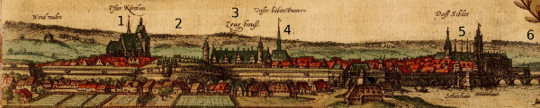
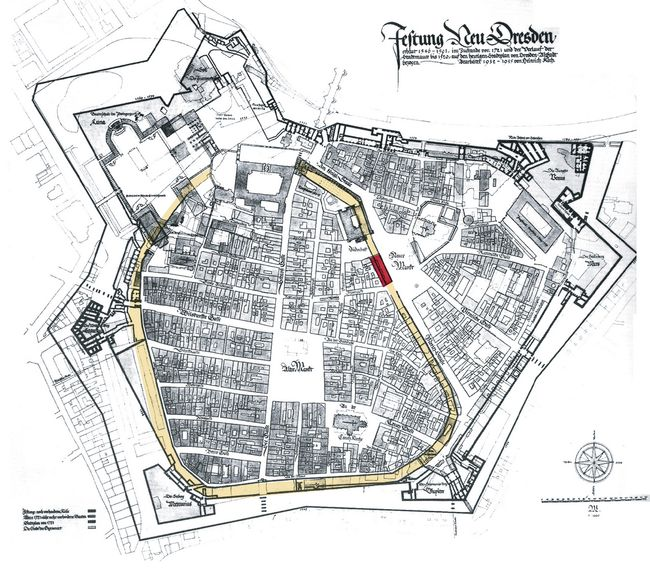
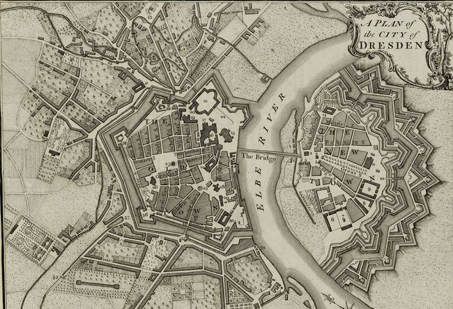
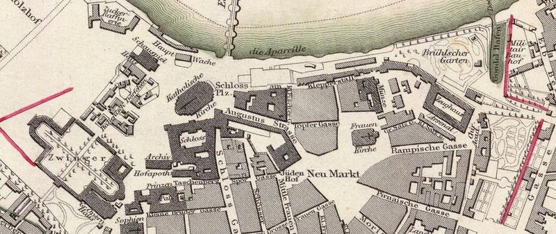
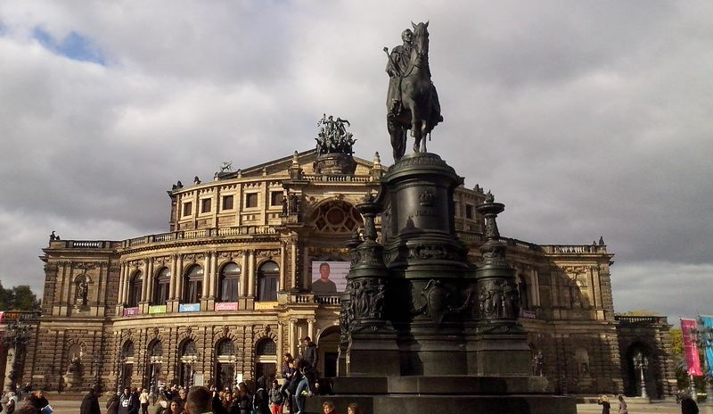
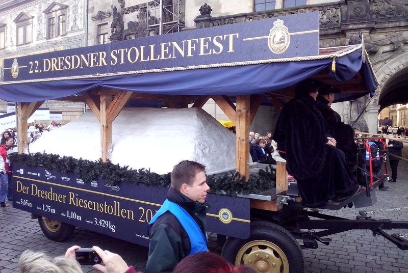

### Miśnia

Dzieje stolicy Saksonii, Drezna, nie zaczynają się na terenie tego miasta, ale w pobliskiej Miśni.

Państwo wschodniofrankijskie, z którego bezpośrednio wywodzą się Niemcy, sąsiadowało z ziemiami zamieszkanymi przez Słowian na ustalonej w IX wieku Limes Sorabicus (niem. Sorbenmark), czyli granicy łużyckiej, biegnącej od Adriatyku aż po linię Łaby. Przebiegała ona mniej więcej na linii Soławy, czyli około 140 km na zachód od Drezna. Dynastią rządzącą państwem wschodniofrankijskim byli Karolingowie. Początkiem właściwej historii Niemiec jest objęcie władzy przez następną dynastię - Ludolfingów, czasem z powodu popularności imienia Otto nazywaną dynastią ottońską. Pierwszym jej przedstawicielem był król Henryk I Ptasznik

Henryk I w 929 przekroczył tę granicę na czele swojej armii i dotarł do Łaby w okolicach późniejszego Drezna. W dogodnym miejscu, na wzniesieniu przy zakolu rzeki wzniósł zamek w miejscu obecnej Miśni. W ten sposób stał się założycielem średniowiecznej stolicy terenów później znanych jako Saksonia. Henryk jest bohaterem opery Richarda Wagnera "Lohengrin" - opera ta została napisana w Dreźnie, ale prapremiera miała miejsce w Weimarze w 1850. Dlaczego nie w Dreźnie? O tym poniżej.

W latach 966-68 powstaje Marchia Miśnieńska już wkrótce obejmująca także obszar Drezna.

Cesarz Henryk IV w 1089 mianował margrabią miśnieńskim Henryka I Starego. Od niego zaczyna się dynastia Wettynów, którzy w Saksonii będą panować praktycznie bez przerwy przez ponad 800 lat. Od 160 lat istnieje Miśnia, od 120 lat jest stolicą biskupstwa i Marchii Miśnieńskiej, a o Dreźnie nikt jeszcze nie słyszał.

### Drezno

Konrad Wielki, wnuk stryja Henryka I Starego i jego następca na tronie miśnieńskim, otrzymuje w 1125 od Lotara III wówczas króla Niemiec a później także cesarza, tereny ludu Nisani. Własnie na tym obszarze leży Drezno. Nisani to byli Słowianie prawdopodobnie pochodzący zza Rudaw, czyli z Czech. W 1147 Konrad bierze udział w krucjacie przeciwko Obodrytom i Wagrom, wtedy też po raz pierwszy w historii wzmiankowana jest należąca do Nisani osada portowa w miejscu późniejszego Drezna.

Nazwa Drezna po raz pierwszy pojawia się dopiero w 1206, w łacińskim dokumencie "Acta sunt hec Dresdene". Dokument ten wydany był za panowania Dytrycha I Zgnębionego. Osobliwy swój przydomek zawdzięcza ten margrabia trudnym czasom, które zmuszały go do lawirowania pomiędzy potężniejszymi władcami. Już w 1216 Drezno określane było jako miasto. Nazwa (pierwotnie Drezdno) wywodzi się najprawdopodobniej ze starołużyckiego słowa Drežďany oznaczającego ludzi mieszkających w podmokłych lasach. Po czesku Drezno to Drážďany. Język górnołużycki, dość zrozumiały dla Polaków wykształcił się w ciągłym kontakcie z językiem czeskim, m.in. z powodu wielowiekowej przynależności Łużyc do korony czeskiej.

Choć nie ma zbyt wielu informacji o dziejach Drezna w tym okresie, miasto szybko nabiera na znaczeniu dzięki korzystnej lokalizacji. Wiadomo, że w połowie XII wieku używany był drewniany most na Łabie, w pobliżu przecinały się szlak z Miśni do Czech i Via Regia (niem. Hochweg) jedna z najważniejszych dróg Europy, biegnąca z Portugalii do Krakowa i Kijowa. Istnieje już romański kościół mariacki na miejscu obecnego Frauenkirche. W 1170 wzniesiono Nikolaikirche. W 1234 wzmiankowana jest Kreuzkapelle z relikwiami Krzyża Św., stąd późniejsze wezwanie Św. Krzyża. W połowie XIII wieku w pobliżu kościoła powstaje Taschenberg, zamek margrabiów. W 1287 wzmiankowana jest duma Drezna - most kamienny na Łabie. Rok później na zamku w Dreźnie umiera margrabia Henryk II Dostojny. Z 1299 pochodzi pierwsze potwierdzenie istnienia miejskich fortyfikacji. 1316 to pierwsza wzmianka o obecnym wezwaniu Frauenkirche, obecnie najbardziej znanego kościoła Drezna. Jak widać miasto formowało się w okolicach obecnego Altmarktu i rozwijało się w kierunku Łaby.

 ### Elektorat Saksonii (1423-1806)

W 1423 margrabia miśnieński Fryderyk I Kłótnik w nagrodę za wierną służbę otrzymuje od cesarza Zygmunta Luksemburskiego Księstwo Saksonii i zaszczytny tytuł Elektora Saksonii. Jest to ogromny awans dla niego osobiście i dla całej dynastii. W obliczu zagrożenia husyckiego w 1427 rozpoczyna unowocześnianie miejskich fortyfikacji, ale w 1429 husyci spalili miasto. Odbudowane, po 1465 staje się rezydencją Wettynów. Po 1485 jest to siedziba albertyńskiej linii Wettynów, czyli tej która sprawuje władzę na terenie dawnej Marchii Miśnieńskiej. Wtedy też obecny Zamek staje się rezydencją dynastii i zostaje rozbudowany.

### Reformacja (od 1539)

Kiedy w 1539 umiera elektor Jerzy Brodaty, gorliwy zwolennik stronnictwa katolickiego. Ponieważ nie pozostawił żadnego syna, tron po nim objął Henryk Pobożny będący wówczas stronnikiem Reformacji. Natychmiast wprowadził ewangelicyzm jako religię państwową. Choć ani nie był zręcznym politykiem, ani polityką nie był zainteresowany, do tego jego rządy trwały zaledwie dwa lata, była to trwała zmiana, która na zawsze już ukształtowała obraz religijny Saksonii i Drezna.

Tymczasem w Rzeszy konflikt pomiędzy stronnictwem katolickim a ewangelickim narastał i wkroczył w fazę otwartej wojny. Powstały w 1531 Związek Szmalkadzki łączy państwa ewangelickie w sojuszu obronnym. Następca Pobożnego, książę Maurycy w 1545 zaczyna wznosić dzieła obronne wokół Starego Miasta na lewym brzegu Łaby, już wkrótce połączoną w jeden system obronny z lewobrzeżnym miastem rezydencjonalnym. Rok później rozpoczynają się prace wokół zamku i jednocześnie wybucha pierwsza wojna szmalkadzka. Całość zostaje ukończona w 1555 - w roku zawarcia pokoju augsburskiego, na długo kończącego wojny religijne w Rzeszy.

W latach 1553-86 księciem elektorem Saksonii był syn Henryka Pobożnego, August. W 1559 dokonuje sekularyzacji, czyli zajęcia całego majątku kościoła katolickiego na terenie księstwa. Diecezja miśnieńska przestaje istnieć, w jej miejsce w 1567 powstaje miśnieńska administratura apostolska z siedzibą w Budziszynie. August jest również zapalonym kolekcjonerem, zbiera broń, narzędzia i dzieła sztuki. W 1560 założył Kunstkamerę uważaną za początek państwowej kolekcji sztuki, z której słynie Drezno. Zapoczątkował tradycję muzyczną Drezna, to za jego czasów zaczyna działać kapela dworska już jako stała instytucja.

<BoxPageImageWrapper>

Weduta Drezna z 1572. Od lewej: kościół pw Św Krzyża (1), Bastion Mars (2), Zbrojownia (3), Frauenkirche (4), Zamek (5), most kamienny (6).
</BoxPageImageWrapper>

Nietrwały pokój pomiędzy katolikami a ewangelikami kończy się straszliwą wojną trzydziestoletnią. Drezno stało się w 1621 miejscem zawarcia tzw. akordu drezdeńskiego, czyli pokoju kończącego pierwszy etap tej wojny, czyli starcie cesarstwa z Czechami i Śląskiem rozstrzygnięte podczas bitwy na Białej Górze. Gwarantem tego porozumienia był elektor saski Jan Jerzy I, pradziadek Augusta II Mocnego. Choć Saksonia nie była stroną w wojnie, dotknęły ją i przemarsze wojsk i epidemie. Kiedy po wojnie zaczęła się odradzać, Drezno zostało spustoszone wielkim pożarem w 1685.

### August II Mocny i August III (1694-1763)

Przełomowym okresem w historii Saksonii było panowanie Augusta II (w Saksonii Augusta I) i jego syna Augusta III (w Saksonii Augusta II), które jednocześnie od 1697 stanowiło unię personalną z Królestwem Polskim, i to przez cały ten czas, z przerwą podczas wojny północnej. To podczas niej doszło do szwedzkiej okupacji Saksonii i właśnie w saksońskim Altranstädt podpisano w 1706 układ pokojowy Szwecji z Polską i rok później traktat dotyczący traktowania przez władze cesarskie śląskich luteran.

W początkach XVII w, w czasie politycznego zamieszania, przemarszów wojsk i okupacji w Saksonii dwóch ludzi pracowało nad skopiowaniem prawdziwej chińskiej porcelany. Alchemik Johann Friedrich Böttger, wynalazca gresu na zamku w Miśni a w Dreźnie fizyk i matematyk Ehrenfried Walther von Tschirnhaus w Palais Fürstenberg opracowywał nowe rodzaje pieców i to on najprawdopodobniej dokonał przełomu po raz pierwszy wypalając europejską twardą porcelanę w 1708. Tschirnhaus umarł w tym samym roku i jego prace przejął Böttger. August II Mocny manufakturę porcelany umieścił na łatwym do upilnowania zamku w Miśni. Miśnieńska porcelana jest znana na całym świecie, a zbiory Muzeum Porcelany w drezdeńskim Zwingerze uważane są za jedną z dwóch najcenniejszych kolekcji na świecie (miśnieńska manufaktura również ma własne imponujące muzeum).

Dla Drezna trwający 60 lat okres panowania obu Augustów, każdego po 30 lat, jest rewolucyjną epoką gigantycznych inwestycji. To wtedy kształtuje się słynne wśród koneserów sztuki, znane w całej Europie barokowe miasto nad Łabą. Pod koniec wojny północnej, kiedy polityka Augusta II wchodzi w okres stabilizacji, powstaje rokokowy Zwinger, a później już pod koniec jego panowania jego prywatna rezydencja w Saksonii, słynny barokowy pałac w poddrezdeńskim Pillnitz (przyłączonym do Drezna w 1950).

Mieszczanie drezdeńscy, którzy byli zagorzałymi ewangelikami, z trudem znosili konwersje króla na katolicyzm i stałą obecność katolików na dworze. Obawiali się również despotyzmu polskiego króla. Swoistą manifestacją ich potęgi była budowa nowej barokowej wersji Frauenkirche (pomimo zmiany konfesji stare, katolickie wezwanie maryjne pozostało), która odbyła się nie tylko za zgodą, ale nawet przy poparciu Augusta II. Chciał mieć w swoim rodzinnym mieście tak wspaniałą świątynię, która do dziś jest symbolem niemieckiego baroku i jedną z najbardziej rozpoznawalnych budowli w Niemczech.

Jego następca wznosi przy starym zamku katolicki kościół pw. Świętej Trójcy, z racji funkcji nazywany również Kościołem Dworskim. Od 1980 pełniący również funkcję katedry diecezji drezdeńsko-miśnieńskiej. Tak więc w tym czasie powstają trzy z kilku najważniejszych drezdeńskich zabytków. Budowane są liczne pałace, rezydencje, siedziby urzędów i teatry. Drezno staje się promieniującym na całą Europę ośrodkiem sztuki.

Pasją obu Augustów było kolekcjonowanie sztuki, to właśnie eksponowaniu ich zbiorów służyły wielkie barokowe pałace. Byli też ważnymi patronami sztuki. August III odkrył i zatrudnił w Dreźnie Canaletta. W latach 1747-52 Bernardo Bellotto namalował 14 wedut Drezna, kolejne trzy w latach 1764-65. Kiedy August umarł, Canaletto wyruszył z Drezna do Sankt Petersburga, na dwór carycy Katarzyny. Podczas podróży został w 1764 zaproszony przez Stanisława Augusta Poniatowskiego do pozostania i pracy w Warszawie i tam już cztery lata później został nadwornym malarzem.

<BoxPageImageWrapper>

Wykonana przez Heinricha Kocha w latach 30. XX wieku analiza rozplanowania murów średniowiecznych istniejących do 1520 - żółty owalny narys z centrum w miejscu Altmarktu, widać jak ważną rolę pełnił zamek w murach miejskich. Zewnętrzny narys to nowożytna twierdza ukończona do 1721.
</BoxPageImageWrapper>

Połowa XVIII wieku to czas wyniszczających Austrię i Prusy wojen śląskich. Tak samo jak podczas wojny trzydziestoletniej, choć Saksonia nie brała udziału w dwóch pierwszych wojnach śląskich, ucierpiała podczas nich. W 1745 za panowania Augusta III, po zakończeniu drugiej wojny śląskiej, zawarto w Dreźnie porozumienie pokojowe znane jako pokój drezdeński - potwierdzało warunki na jakich zakończyła się pierwsza wojna śląska (1742 pokój wrocławski i berliński). Podczas trzeciej wojny śląskiej, znanej też jako wojna siedmioletnia armia pruska dokonuje inwazji na Saksonię i dochodzi do oblężenia i okupacji Drezna. Podczas niej oddzielona od rodziny w Pawilonie na Wałach umiera w 1757 Maria Józefa Habsburżanka. Prusacy znajdują w Zamku nietknięte stemple mennicze i na masową skalę biją monety z pogorszonego surowca tzw. efraimki i zalewają nimi Polskę. Z wojny Saksonia wychodzi pokonana i zmarginalizowana.

Wojnę siedmioletnią kończy pokój w Hubertsburgu (Saksonia) zawarty 15 lutego 1763 m.in przez Saksonię. Bilans wojny jest dla Polski i Saksonii niekorzystny, zresztą już wkrótce bo 5 października 1763 w Dreźnie umiera August III Sas i kończy się pewna epoka. Powstaje wprawdzie stronnictwo opowiadające się za kontynuacją unii, ale bez szans na sukces.

W 1764 elektor Fryderyk Krystian Leopold zakłada drezdeńską ASP (niem. Allgemeine Kunst-Akademie der Malerei, Bildhauer-Kunst, Kupferstecher- und Baukunst), jedna z najstarszych tego typu uczelni w Niemczech i najstarszą uczelnię wyższą w Dreźnie. Jej tradycje sięgają zresztą wcześniej, bo aż do założonej w 1680 dworskiej Zeichen- und Malerschule.

W sierpniu 1791 w pałacu w Pillnitz spotykają się cesarz Leopold II i król pruski Fryderyk Wilhelm II. Oznaką słabości Saksonii był fakt iż elektor saksoński, Fryderyk August I (wnuk Augusta III) nie został w ogóle zaproszony. Wydano tam Deklarację z Pillnitz wspierającą króla Francji. Rewolucyjne władze Francji (Konstytuanta) odebrały to jako deklarację wojny i rzeczywiście wkrótce do niej doszło. Podobno Napoleon odwiedzając później Pillnitz, powiedział "tu się narodziłem".

<BoxPageImageWrapper>

Twierdza Drezno w 1800. Mapa o orientacji zachodniej (zachód jest na górze mapy). W pełni widoczna rola obronna Nowego Miasta.
</BoxPageImageWrapper>

Od przybycia w 1799 aż do śmierci w 1840 w Dreźnie mieszkał słynny malarz epoki romantyzmu Caspar David Friedrich, inspirując się widokami Saksonii i Karkonoszy. W 1816 został przyjęty w poczet Akademii drezdeńskiej, ale nie otrzymał katedry z powodu zbyt liberalnych poglądów.

### Królestwo Saksonii (1806-1918)

W wyniku upadku Cesarstwa 1806 kończy swoje istnienie Elektorat Saksonii (niem. Kurfürstentum Sachsen) i powstaje suwerenne Królestwo Saksonii (niem. Königreich Sachsen). Drezno jest stolicą królestwa. Już wkrótce, w 1809 rozpoczyna się znoszenie fortyfikacji miejskich, na krótko przerwane przez Francuzów, którzy w sierpniu stoczyli bitwę pod miastem. W 1814 udostępniono dla publiczności tarasy Bruhla i rok później rozpoczęto ostateczny demontaż systemu fortyfikacyjnego miasta zakończony ostatecznie w 1830.

Od 1816 do śmierci w 1826 dyrektorem drezdeńskiej Staatskapelle był Carl Maria von Weber. Miał posiadłość w Hosterwitz (od 1950 część Drezna). Jego najważniejsze dzieło "Wolny strzelec" miał wprawdzie prapremierę w berlińskiej Schauspielhaus w 1821, ale właśnie tą operą zainaugurowano Operę Sempera w 1841, była to również ostatnia opera jaką widzieli drezdeńczycy przed bombardowaniem w lutym 1945 i pierwsza wystawiona po remoncie w 1985.

Wilhelm Gotthelf Lohrmann, który od 1827 kierował Salonem Matematyczno-Fizycznym Zbiorów Królewskich (niem. Mathematisch-Physikalischen Salon der Königlichen Kunstsammlungen, obecnie część Muzeum Zwinger) w 1828 w budynku przy Tarasach Brühla założył Technische Bildungsanstalt zu Dresden, szkołę techniczną specjalizującą się w mechanice i budowie maszyn. Była to jedna z pierwszych uczelni tego typu w Niemczech i zalążek obecnej politechniki drezdeńskiej. W 1871 po zjednoczeniu zmienia się jej nazwa na zgodną z pruskimi zasadami Królewsko-Saską Politechnikę (niem. Königlich-Sächsisches Polytechnikum). Od 1960 jest to Uniwersytet Techniczny w Dreźnie (Technische Universität aka TU Dresden). W 2009 powstała koncepcja DRESDEN-Konzept (Dresden Research and Education Synergies for the Development of Excellence and Novelty) połączenia potencjału uczelni technicznej z wieloma organizacjami naukowymi.

Kiedy w Królestwie Polskim wybuchło powstanie listopadowe, w stronę Wielkopolski wyruszył Adam Mickiewicz. Ostatecznie, jak wiemy, nie dotarł tam. Wylądował na krótko w Dreźnie. To właśnie tam w 1832 napisał III część Dziadów z natchnionym, tajemniczym "Z matki obcej: krew jego dawne bohatery, a imię jego będzie czterdzieści i cztery".  [Jak wspomina Seweryn Goszczyński](https://culture.pl/pl/artykul/mickiewicz-a-imie-jego-czterdziesci-i-cztery):

>Kiedym go pytał, co on w rzeczywistości rozumiał przez tę liczbę 44, odpowiedział mi opowiadając obszernie pracę swoją nad tem miejscem Dziadów. - Było to w Dreźnie. - Miał nadzwyczajne natchnienie. - Przez trzy dni nie mógł się oderwać od pisania. - Stół zasłany był czystym papierem, a on przez cały dzień leżał prawie na stole i pisał – zaledwie tyle tylko odrywał się od pracy, ile było potrzeba niekiedy zjeść cokolwiek, poczem wracał natychmiast do siebie i ciągnął dalej pracę.

Jeszcze w tym samym 1832 pojechał z Drezna do Paryża gdzie spędził następne 20 lat.

Od 1849 w Dreźnie mieszka Hermann Krone, który ukończył astronomię na uniwersytecie wrocławskim. Jego pasją jest fotografia, przeprowadził się żeby na drezdeńskiej politechnice uczy się fotografii, to dzięki niemu powstaje tam Katedra Fotografii Naukowej. W 1853 otwiera własny zakład. Zajmuje sie edukacją i rozwojem techniki, eksperymentuje, robi rentgenowskie zdjęcia roślin, pierwsze fotografie lotnicze.

Lata 40. XIX to w całych Niemczech okres gigantycznych inwestycji kolejowych. Jeszcze w 1839 powstaje połączenie lokalne z Lipskiem i wybudowano Dworzec Lipski. Kilka lat później Drezno zostaje jednocześnie przyłączone w dwóch kierunkach: wschodnim i południowym. Najpierw, w 1847, przez Dworzec Śląski (niem. Schlesischer Bahnhof) do linii Drezno - Görlitz, a rok później przez Dworzec Czeski (niem. Böhmische Bahnhof) do linii Děčín – Dresden, nazywanej czasem Linią Doliny Łaby (niem. Elbtalbahn). W 1852 wybudowano pierwszy most kolejowy na Łabie (obecny drogowy Marienbrücke) a trzy lata później powstaje połączenie na zachód z Chemnitz (Albertbahnhof). Dopiero 20 lat później z Berlinem, już po przyłączeniu do Cesarstwa - w 1875. Obecny Dworzec Główny został wybudowany w 1898. Ostatecznie sieć kolejowa przybiera obecną postać w 1901 kiedy powstaje Dworzec Nowe Miasto (niem. Bahnhof Dresden Neustadt) zastępujący dwa najstarsze dworce drezdeńskie: lipski i śląski.

<BoxPageImageWrapper>

Centrum Drezna w 1833. Zwraca uwagę pierwotne ulokowanie budynku Opery w południowym narożniku Zwingera. Tam gdzie w latach 1838-41 wzniesiona zostanie pierwsza Opera Sempera znajduje się teatr - stąd nazwa Placu Teatralnego. Wciąż istnieją Włoska Wioska i Arsenał.
</BoxPageImageWrapper>

Podczas Wiosny Ludów w 1848 Drezno jest jednym miast w którym wybuchają zamieszki - jest to trwające od 3 do 9 maja Powstanie Majowe (niem. Dresdner Maiaufstand lub Dresdner Mairevolution). Władzę w mieście przejmują rewolucjoniści domagający się reform parlamentarnych. W Powstaniu bierze udział przebywający w Dreźnie od 1842 Michał Bakunin, znany rosyjski anarchista i rewolucjonista. Powstaje ponad setka barykad, król Fryderyk August II i ministrowie zdołali uciec z miasta i schronili się w twierdzy Königstein. Do Powstania przyłącza się również słynny niemiecki kompozytor Richard Wagner, od 1843 pełniący funkcję dyrektora Opery Królewskiej w Dreźnie. Z kopuły Frauenkirche składa raporty o ruchach wojsk saskich wspartych przez armię pruską. Trzy tysiące powstańców nie miało szans w walce z pięcioma tysiącami dobrze uzbrojonych i zdyscyplinowanych żołnierzy. Większość zdołała uciec, ale wielu zostało aresztowanych, m.in. Bakunin. Inni kiedy ujawniono ich udział w Powstaniu musieli opuścić Saksonię. Jednym z banitów był właśnie Richard Wagner i dlatego jego "Lohengrin" choć napisany w Dreźnie prapremierę ma w Weimarze. Innym banitą był Gotfried Semper, architekt i historyk sztuki, autor projektu budynku opery drezdeńskiej (niem. Königliche Hoftheater Dresden znana też później jako Altes Hoftheater), który właśnie od swojego twórcy nosi nazwę Semperoper (analogicznie do paryskiej Opery Garniera). Opera ta była ukoronowaniem wielowiekowej tradycji Drezna jako stolicy muzyki i stała się najważniejszym salonem dla rosnącej w siłę burżuazji.

### Cesarstwo Niemieckie (1871-1918)

Po pokonaniu Francji przez Prusy w 1871 powstaje Cesarstwo Niemieckie (niem. Deutsches Kaiserreich). Królestwo Saksonii, które jest jego częścią militaryzuje się na modłę pruską, w północno-wschodniej części Drezna powstaje Albertstadt, największy garnizon w Niemczech. Nazwę bierze od króla Saksonii Alberta, który jako książę następca tronu brał udział w wojnie z Francją i panował w Królestwie Saksonii w latach 1873-1902. Albert dokonuje demontażu monarchii, patronuje reformom demokratycznym.

Pomiędzy wojnami Bismarcka Drezno w 1869 traci w pożarze swoją dumę: Semperoper. Gotfried Semper był już w tym czasie ułaskawiony i król poprosił go o przyjazd i zaprojektowanie opery na nowo. Semper jednak odmówił, zaproponował natomiast, że zaprojektuje nową operę pod warunkiem, że to jego syn będzie odpowiedzialny za realizację budowy. I ten sposób w 1878 miejskie elity miejskie odzyskały swój pałac i świątynię sztuki (niem. Zweiten Königlichen Hoftheaters, obecnie Sächsischen Staatsoper Dresden).

<BoxPageImageWrapper>

Pomnik króla Jana na tle Opery Sempera.
</BoxPageImageWrapper>

Jedną z bardziej oryginalnych budowli Drezna jest rosyjska cerkiew ortodoksyjna zbudowana w latach 1872-74. Znajduje się w pobliżu Dworca Głównego i Politechniki. W połowie XIX wieku nastąpiło zbliżenie dyplomatyczne imperium rosyjskiego z państwami niemieckimi. Coraz częściej rosyjscy dyplomaci, wojskowi i arystokraci bywali i mieszkali w Niemczech, głównie w stolicach, ale też dość często odwiedzali niemieckie uzdrowiska. Taki był początek rosyjskiej diaspory w Dreźnie. W 1861 powstała gmina ortodoksyjna licząca ok 350 osób. Nabożeństwa odprawiano w prywatnej kaplicy. W 1863 urodził się w Dreźnie i w tej kaplicy został ochrzczony późniejszy premier Rosji Piotr Stołypin. Fiodor Dostojewski mieszkał w Dreźnie w latach 1869-71 i ochrzcił w tej kaplicy swoją córkę, Lubow. Hojny datek rosyjskiego sowietnika (radca stanu, wysoki urzędnik państwowy) Siemiona Wikulina pokrył 3/4 kosztów budowy obecnej cerkwi św Symeona (imię fundatora). Jeden z architektów Harald Julius von Bosse, również rosyjski radca stanu, ale pochodzenia niemieckiego, zaprojektował także niemiecki kościół w Sankt Petersburgu. W 1875 w nabożeństwie uczestniczył Aleksander Aleksandrowicz Romanow, późniejszy car Aleksander III. W latach 1906-08 w Dreźnie wraz z rodziną mieszkał Siergiej Rachmaninow, i to tam skomponował słynną "Wyspę Umarłych" zainspirowany widzianą w Paryżu biało-czarną reprodukcją obrazu Böcklina pod tym samym tytułem. Kiedy w Lipsku zobaczył oryginał był nim rozczarowany. Podczas pierwszej wojny światowej w latach 1914-21 cerkiew została zamknięta z obawy przed szerzeniem prorosyjskiej propagandy i modlitw za zwycięstwo wojsk rosyjskich. Po zwycięstwie rewolucji październikowej cerkiew nadal należała do patriarchatu moskiewskiego, ale w 1939 hitlerowcy przekazali ja na rzecz emigracyjnego kościoła ortodoksyjnego. Z bombardowania w lutym 1945 jako jedna z niewielu budowli w okolicy wyszła z niewielkimi zniszczeniami. Długi spór o prawa do świątyni zakończyła dopiero unifikacja obu kościołów w 2007. Obecnie do parafii należy około tysiąca osób.

Z pobytem rosyjskich żołnierzy wiążę się również nazwa pierwszego nowoczesnego, drezdeńskiego wodociągu - Wasserwerk Saloppe. Najpierw podczas wojny siedmioletniej w tym miejscu wojska pruskie założyły posterunek przy stacji promowej, potem budynek przekazano właścicielowi promu który urządził tam wyszynk. Był od najwidoczniej bardzo popularny wśród wojsk rosyjskich, które pojawiły się w Dreźnie podczas wojen napoleońskich - od nich pochodzi ta niecodzienna nazwa Saloppe. Jest to fonetyczne dostosowanie nazwy używanej przez Rosjan: "wódka chałupka". W 1874, już w czasach bismarckowskich, powstał Wasserwerk Saloppe. Od 1891 zaopatrywał już tylko Nowe Miasto dostarczając dziennie 4 tys. m3 wody pitnej. Zakłady zostały zniszczone podczas bombardowania w lutym 1945. Po wojnie w 1949 przywrócono je do działania, ale ponieważ jakość wody w Łabie ulegała pogorszeniu i zaczęto miasto zaopatrywać z Zapory Lehnmühle na Wilde Weißeritz wyłączono je z sieci w 1993. Obecnie powstały tam ekskluzywne lofty od 100 do 300 m2 w cenie ok 5 tys E za m2.

Drezno jest czwartym w kolejności chronologicznej miastem niemieckim posiadającym zoo. Najstarsze jest oczywiście berlińskie zoo w Tiergarten. W 1861 powstało zoo drezdeńskie zaprojektowane przez Petera Josepha Lenné. W okresie międzywojennym jego specjalnością była hodowla orangutanów. Choć podczas ostatniej wojny zostało prawie całkowicie zniszczone, otwarto je bardzo szybko bo już w maju 1946. Od 1960 najsłynniejszym zwierzęciem była słonica Schöpfi, która żyła tam 50 lat. W 1999 otwarto Afrikahaus, wybudowane za 12 mln marek. Zoo ma powierzchnię 13 ha i w 2018 odwiedziło je ponad 900 tys ludzi.

Druga połowa XIX wieku to również narodziny zainteresowania historią i badaniem tożsamości Saksonii. W latach 1772-76 dla uczczenia 800-lecia dynastii Wettynów powstaje pierwsza, oryginalna wersja "Orszaku książęcego" (niem. Fürstenzug) na ścianie Zamku. Obraz stworzył Adolf Wilhelm Walther znany drezdeński malarz i profesor ASP. W technice sgraffito, której nauczył się od Sempera, przedstawił dzieje Saksonii w formie pochodu kolejnych władców. Ponieważ z upływem lat obraz blakł, w latach 1904-07 na podstawie oryginalnych kartonów i pod kontrolą autora została w Miśni przeniesiona na porcelanowe kafle i w ten sposób utrwalona w obecnej postaci. Jest to największe na świecie porcelanowe dzieło sztuki.

Specjalnością Drezna aż do czasów Wielkiego Kryzysu staje się przemysł tytoniowy. Produkowano tu w 40 fabrykach ponad 60% niemieckich wyrobów tytoniowych. Najważniejszym przedstawicielem tej branży był przedsiębiorca pochodzenia żydowskiego Hugo Zietz, który po 20 latach działalności, na początku XX wieku wybudował charakterystyczną fabrykę Yenidze w formie przypominającej meczet, dlatego, że używał tytoniu tureckiego głownie z okolic miasta Yenidze (wówczas w Turcji, obecnie greckie Genisea - Γενισέα). Jego konkurentem był również działający od lat 80. XIX wieku Georg Anton Jasmatzi, dyrektorem generalnym jego fabryki był Ernst Gütschow, który w 1909 kupił zamek Czocha i był jego właścicielem do 1945.

W 1888 Karl August Lingner (1861-1916) zaczął handlować artykułami gospodarstwa domowego i pięć lat później, w 1892, założył laboratorium chemiczne, w którym pracował dla niego chemik dr Richard Seifert. W 1895 opatentowali płyn do płukania ust "Odol" już wkrótce największą niemiecką markę tego typu. Słynny włoski kompozytor Giacomo Puccini napisał odę "Odol Ode". Dzięki zakrojonej na szeroką skalę reklamie na całym świecie "Odol" zyskał wielką popularność. Franczyza umożliwiła ekspansję na cały świat. W kilka lat Lingner stał się dwucyfrowym milionerem żyjącym jak książę. Kupił pałac nad Łabą - Lingnerschloss aka Villa Stockhausen - i kazał go przebudować, w testamencie pozostawił okoliczne ogrody jako teren publiczny.

Lingner był nie tylko biznesmenem i milionerem; zarabiał na tym czym naprawdę się interesował i potrafił zainspirować tym innych ludzi, a zarobione pieniądze przeznaczał na edukację w zakresie znaczenia i zachowania higieny. Wspierał instytucje charytatywne i publiczną opiekę zdrowotną. Zorganizował w 1903 wystawę "Choroby i ich zwalczanie" (niem. Volkskrankheiten und ihre Bekämpfung), w 1911 pierwszą Międzynarodową Wystawę Higieny (niem. Internationale Hygiene-Ausstellung Dresden) obejrzało 5 mln ludzi. W 1912 założył Niemieckie Muzeum Higieny (niem. Deutsche Hygiene-Museum) współcześnie dumę Drezna i jeden z bardziej interesujących obiektów turystycznych.

W latach 30. XX wieku "Odol" produkowany był w ponad 20 krajach. W 1945 podczas bombardowania zakłady Lingner-Werke zostały całkowicie zniszczone. W okresie powojennym markę i produkcję przejęła firma z Düsseldorfu. Drezno bezpowrotnie utraciło "Odol", który - jak twierdzi producent: koncern GlaxoSmithKline - ma 70% rynku niemieckiego. "Odol" wciąż w tej samej charakterystycznej płaskiej butelce z zakrzywioną szyjką jest marką parasolową, pod tą samą nazwą produkowane są pasty do zębów, gumy do żucia, pastylki i spraye.

Na przełomie wieków powstają dwie kolejki górskie w dzielnicy Loschwitz: w 1895 linowo-terenowa Standselbahn, a w 1901 podwieszana Schwebebahn. Dziś stanowią ważną atrakcję turystyczną.

W 1885 odbyły się w Dreźnie VI. Deutsches Turnfest (ogólnoniemieckie zawody gimnastyczne organizowane od 1860). Zaczęto wtedy mówić o potrzebie stworzenia nowoczesnego kompleksu wystawowego na miarę stolicy królestwa. Idealnym miejscem był Großer Garten, wówczas publicznie dostępny park królewski. W 1887 zorganizowano tam Pierwszą Międzynarodową Wystawę Ogrodniczą (niem. I. Internationale Gartenbau-Ausstellung ). Rok później władze miasta ogłosiły konkurs i już w latach 1894-96 powstał kompleks wystawowy z dominującym Miejskim Pałacem Wystawowym (niem. Städtische Ausstellungspalast). Budowa i zagospodarowanie terenu kosztowały 1.5 mln marek. Pierwszą imprezą była Druga Międzynarodowa Wystawa Ogrodnicza. Zintegrowany terenami rekreacyjnymi i zoo zespół wystawowy stał się na dziesięciolecia najważniejszym publicznym salonem miasta. Powstało też wesołe miasteczko. Czasem narzekano na rozwój inwestycji bo nie wszystkie powstające budynki były w najlepszym stylu.

Niezwykłą atrakcją Drezna stała się najdoskonalsza w historii architektury realizacja utopijnej wizji rewolucyjnego architekta francuskiego Claude-Nicolasa Ledoux - Kulistego Domu (niem. Kugelhaus). Powstał w 1928 jako część wystawy "Jahresschau Deutscher Arbeit - Die Technische Stadt". Miał 6 kondygnacji, 24 metry średnicy i zbudowany był na podstawie walca o wysokości 4 m i średnicy 11 m. Windą można było wjechać na restaurację na ostatnim piętrze skąd rozciągał się widok na cały Ogród. Podczas wystaw najczęściej był miejscem ekspozycji najnowszych osiągnięć techniki. Ostatni raz w 1936. Z braku renowacji, nieznalezienia nabywcy i coraz bardziej intensywnej krytyki futurystycznej konstrukcji jako "nie-niemieckiej" i "zdegenerowanej" został rozebrany w 1938. Siedem lat później cały kompleks wystawowy został doszczętnie zniszczony. W 1949 podjęto decyzję o nieodbudowywaniu go i pozostałości wysadzono w powietrze.

### Wolny Kraj Saksonia (od 1918)

Po Wielkiej Wojnie, Saksonia staje się republiką, powstaje Wolny Kraj Saksonia (niem. Freistaat Sachsen). W marcu 1920 w wielu miastach niemieckich dochodzi do puczu Kappa-Lüttwitza, wojskowego zamachu stanu. Ludność Drezna masowo występuje przeciwko puczystom, na Placu Pocztowym żołnierze Freikorpsów strzelają do protestujących, ginie 59 ludzi. Ostatecznie jednak cywilom udaje się pokojowymi metodami stłumić pucz. W listopadzie 1920 ustanowiono konstytucję, opartą na weimarskiej.

Aż do czasów hitlerowskich Drezno jest jednym z najważniejszych w Niemczech ośrodkiem sztuki nowoczesnej. Wśród wykładowców Akademii Sztuk Pięknych (niem. Hochschule für Bildende Künste Dresden) byli wówczas Oskar Kokoschka i Otto Dix. Kokoschka był w Dreźnie od 1917, w 1919 został profesorem drezdeńskiej ASP. W 1924 dwa lata przed wygaśnięciem kontraktu niespodziewanie opuścił posadę i udał się w podróż. Dix był bardziej związany z Dreznem, studiował tu w latach 1909-14. Po Wielkiej Wojnie, na której walczył jako ochotnik, związany był z ekspresjonistyczną Dresdner Sezession Gruppe 1919, działającą do 1925. Dwa lata po rozwiązaniu Grupy 1919, w 1927 został profesorem drezdeńskiej ASP. W 1928 został członkiem Pruskiej Akademii Sztuki (niem. Preußische Akademie der Künste). W 1933 został przez nazistów uznany za reprezentanta tzw "sztuki wynaturzonej" (niem. Entartete Kunst) i objął go zakaz wystawiania. Przeniósł się wraz z rodziną do Badenii-Wirtembergii, wojnę przetrwał dzięki temu, że przyjaciele kupowali jego obrazy. W latach 1947-66 co roku przyjeżdżał do Drezna na wyjazdy twórcze. Umarł w 1967.

W 1921 następuje znaczne powiększenie obszaru miasta oraz odtworzenie diecezji miśnieńskiej.

W 1926 powstaje w Dreźnie Boehner-Film, wytwórnia filmowa specjalizująca się w filmie dokumentalnym i reklamowym. Istniała do 1967 i wyprodukowała ponad 2 tysiące filmów. W drugiej połowie 30. XX opanowała technikę kolorowych filmów 3-D.

W latach 1930-31 doktor drezdeńskiej kliniki kobiecej Kurt Warnekros przeprowadził pod kierownictwem twórcy seksuologii Magnusa Hirschfelda pionierską, pierwszą na świecie serię czterech operacji dostosowania płci transpłciowej kobiety, duńskiej malarki Lili Elbe. Hirschfeld w 1919 założył w Berlinie Instytut Nauk Seksualnych. Niestety czwarta operacja, przeszczep macicy, zakończyła się zakażeniem i pacjentka zmarła. W 2001 ukazała się nawiązująca do jej życia powieść "The Danish Girl" (pl. "Dziewczyna z portretu"), a w 2015 na ekrany weszła ekranizacja powieści pod tym samym tytułem.

W 1932 kiedy całe Niemcy targane były politycznym chaosem wynikłym z Wielkiego Kryzysu, odbywa się uroczysty pogrzeb ostatniego króla Saksonii Fryderyka Augusta III. Króla żegnają setki tysięcy ludzi, pogrzeb staje się demonstracją sentymentów Saksończyków do "starych czasów". W 2012 w Szwajcarii zmarł jego wnuk, ostatni bezpośredni dziedzic tytułu królów Saksonii - Maria Emanuel Saski.

### Trzecia Rzesza (1933-45)

Od 1925 do końca wojny gauleiterem Saksonii był Martin Mutschmann, z zawodu koronkarz i dyrektor fabryki koronek w Plauen. Fanatyczny nazista, członek NSDAP od 1922. Miłośnik polowań, z dumą używał tytułu Gau-jägermeister. Obwinia się go za nieprzygotowanie Drezna do bombardowania. W latach 30. jego siedzibą była zbudowana w 1906 tzw Mutschmannvilla przy Comeniusstraße 32 (przy Grosser Garten). W 1943 kazał wybudować schron w ogrodzie. Był to jedyny cywilny schron w mieście. Mieszkańcy Drezna w razie bombardowania mogli się chronić tylko w piwnicach. Willa spłonęła podczas bombardowania w lutym 1945, po wojnie została odbudowana.

Po przejęciu władzy przez hitlerowców (w terminologii reżimu: Machtergreifung) zarysował się poważny, wewnętrzny konflikt pomiędzy dyktaturą partii nazistowskiej NSDAP a potężnymi Oddziałami Szturmowymi (niem. Sturmabteilung; w skrócie SA). Konflikt ten został rozwiązany przemocą podczas tzw. Nocy Długich Noży (niem. Nacht der langen Messer). Była to seria aresztowań, porwań i egzekucji dokonanych w nocy z 29 na 30 czerwca 1934 i następnego dnia. Zamordowano wtedy przynajmniej 90 ludzi, głownie z szefostwa SA, ale również wykorzystano okazję by pozbyć się niewygodnych dla reżimu ludzi niezwiązanych z SA. Głównymi centrami akcji były Monachium i Berlin, ale także na Śląsku i w Dreźnie zabijano SA-manów. W Dreźnie zabito ich trzech: Ernsta Ewalda Martina byłego szefa służby wywiadowczej Mutschmanna, Lamperdusa Ostendorpa członka Feldjägerkorps oraz Joachima Schroedtera dowódcę brygady SA w Dreźnie.

Pierwsze drezdeńskie lotnisko, Flugplatz Dresden-Kaditz, działało w latach 1913-26, potem przeniesiono je do Heller. W 1935 zbudowano w pobliskim Klotzsche obecne lotnisko, z początku cywilno-wojskowe, jednak już od wojny z Polską wojny w całości zajęte na potrzeby Luftwaffe. Od 1937 znajdowała się tam jedna z czterech oficerskich szkół lotniczych Luftwaffe, uczono w niej m.in. latania na Ju-52 według wskazań przyrządów.

W 1936 od 24 kwietnia do 11 października w Großer Garten odbywała się 1. Reichsausstellung des deutschen Gartenbaues (w skrócie Reichsgartenschau Dresden, Pierwsza Wystawa Rzeszy Ogrodnictwa Niemieckiego). Nakręcony został wówczas pionierski kolorowy film w technologii 3-D, pierwszy w Niemczech i jeden z pierwszych na świecie. Premiera "Gartenschau in Dresden" miała miejsce 27 maja 1937. Pół roku później ukazał się inny film 3-D produkcji Boehner-Film pod tytułem "Zum Greifen nah". Również w Dreźnie, już podczas wojny, nakręcono film 3-D prezentujący obsługę armaty 8,8 cm Flak 18. W Ministerstwie Propagandy Rzeszy określano filmy trójwymiarowe mianem "Raum Film" (więcej na ten temat [taz: "3D mit Nazi-Bratwurst"](http://www.taz.de/!5126455/)).

Sąd z aresztem śledczym przy Münchner Platz (Plac Monachijski) był narzędziem terroru hitlerowskiego. Działały tam Sądy Specjalne (niem. Sächsische Sondergerichte). Ponurą specjalnością tej instytucji było wykonywanie wyroków śmierci wydanych przez sądy polityczne w Poznaniu oraz Protektoracie Czech i Moraw. Do bombardowania 14 lutego 1945 zamordowano tam gilotyną ponad 1300 ludzi. Ponad 1/3 z nich stanowili członkowie czeskiego ruchu oporu. Zamordowano tam również wielu Polaków, np członków organizacji "Czarna Flaga" z Gostynia oraz Poznańską Piątkę. Jednak represje polityczne nie ustały z pokonaniem nazistów. Okres powojenny to najpierw wszechwładza NKWD i wciąż nieustalona liczba ofiar terroru komunistycznego, po powstaniu NRD w 1949 nadal kontynuowano wykonywanie egzekucji, zakończyły się dopiero w 1956. Dziś w tym miejscu funkcjonuje Miejsce Pamięci (niem. Gedenkstätte Münchner Platz Dresden).

Alois Andritzki 30 lipca 1939 został wyświęcony na kapłana w Katedrze św. Piotra w Budziszynie. Wkrótce potem został przydzielony do kościoła pw. Św Trójcy (kościół dworski, obecna Katedra) gdzie pełnił funkcje duszpasterza nieletnich, prefekta chóru chłopięcego i prezesa drezdeńskiej Rodziny Kolpinga. Pochodził z Radibor z rodziny serbołużyckiej i przedtem działał w wielu organizacjach serbołużyckich. Był aktywnym przeciwnikiem ideologii i dyktatury nazistowskiej. Szybko zainteresowało się nim Gestapo, po tym jak nie dał się zastraszyć został aresztowany 21 stycznia 1941, od 7 lutego znajdował się w areszcie śledczym przy Placu Monachijskim. W lipcu Sąd Specjalny skazał go na pół roku więzienia za działalność antypaństwową (w terminologii reżimu Heimtückegesetz) i wywieziono go do KL Dachau gdzie został umieszczony w bloku dla księży (niem. Pfarrerblock). Dołączył do grupy księży szensztackich i poznał założyciela ruchu księdza Josefa Kentenicha. W grudniu 1942 z powodu niedożywienia i fatalnych warunków sanitarnych wśród więźniów wybuchła epidemia duru brzusznego. Zachorował również Andritzki. Kiedy ciężko chory poprosił strażnika o księdza z komunią ten miał powiedzieć "Chcesz Chrystusa? Masz zastrzyk" i zabił go zastrzykiem z trucizną. Prochy wysłano do rodziny i pogrzeb odbył się w kwietniu 1943. W czerwcu 2011 został beatyfikowany. Jest jedynym Serbołużyczaninem i jedynym Saksończykiem wyniesionym na ołtarze. 5 lutego 2011 urny z prochami Aloisa Andritzkiego i dwóch innych męczenników (Bernharda Wenscha i Aloysa Scholze) zostały uroczyście przeniesione do Katedry i umieszczone na Ołtarzu Męczenników (niem. Märtyreraltar). W czerwcu 2011 przy katedrze został umieszczony stolperstein przypominający Andritzkiego.

Podczas wojny Drezno, podobnie jak Wrocław, było uważane za schron przeciwlotniczy hitlerowskich Niemiec. Uznano, że znajduje się poza zasięgiem alianckich bombowców. Pozbawiono je obrony przeciwlotniczej. Właśnie do Drezna w końcu stycznia 1945 ewakuowano wrocławskie szkoły wyższe Uniwersytet i Politechnikę. W mieście ukryły setki tysięcy uciekinierów, głównie ze Śląska. Dowódcą brytyjskiego Bomber Command był Arthur "Bomber" Harris, który za wszelką cenę chciał dowieść, że wojnę można wygrać z powietrza. Bombardowania dywanowe miały zniszczyć gospodarkę przeciwnika i złamać morale ludności cywilnej do tego stopnia, że inwazja lądowa byłaby tylko formalnością. Jedną z jego propozycji była operacja Thunderclap: gigantyczne, miażdżące bombardowanie Berlina, jednak ze względu na duże straty oraz silną obronę przeciwlotniczą nie doszło do jej realizacji. W zmodyfikowanej formie w kilku atakach miała zniszczyć cele na zapleczu frontu i przez osłabienie armii niemieckiej przyspieszyć zakończenie wojny. Ostatecznie przeprowadzono tylko jedno takie bombardowanie, jego ofiarą padło Drezno. 14 lutego 1945 miasto świętowało ostatki a w nocy w kilku atakach spadło na nie prawie 4 tysiące ton bomb. W bombardowaniu wzięło udział ponad tysiąc dwieście bombowców. Zniszczeniu uległo całe historyczne centrum miasta. Bombardowane to jest jednym z najbardziej kontrowersyjnych epizodów wojny, przez niektórych oceniane jako zbrodnia wojenna. Najbardziej dyskutowanymi zagadnieniami była celowość bombardowania miasta oraz liczba ofiar ostatecznie ustalona na 25 tysięcy zabitych.

<Warning comment="Zainteresowanym sprawą bombardowania Drezna w lutym 1945 polecam tekst, który powstał w ramach kroniki wojennej pisanej w 70. rocznicę tragicznych dla Wrocławia i Drezna wydarzeń końca wojny" link="/festung-breslau/article/drezno-bombardowanie" linktxt="Bombardowanie Drezna (13-15 lutego 1945)"/>

14 kwietnia dokładnie miesiąc po bombardowaniu gauleiter Mutschmann ogłosił Drezno twierdzą i wzywał do obrony miasta za wszelką cenę. Jest odpowiedzialny za liczne egzekucje ludzi oskarżonych o dezercję i defetyzm. Uciekł 8 maja przed wkroczeniem Armii Czerwonej do Drezna. 17 maja został schwytany w Oberwiesenthal (k Chemnitz). Z Chemnitz został wywieziony do Moskwy. Resztę życia spędził w więzieniu na Łubiance. Skazano go na śmierć. Został rozstrzelany 14 lutego 1947, w drugą rocznicę bombardowania.

### NRD (1949-89)

Po wojnie Saksonia z racji należenia do sowieckiej strefy okupacyjnej stała się częścią NRD (niem. Deutsche Demokratische Republik). W Dreźnie był zlokalizowany największy garnizon Armii Sowieckiej w NRD, stacjonowała tu 1. Gwardyjska Armia Pancerna. Marszałek Friedrich Paulus dowódca 6. Armii zniszczonej pod Stalingradem powrócił z sowieckiej niewoli w 1953. W Dreźnie w willi przy Preußstraße 10 (Oberloschwitz) pod stałą obserwacją Stasi spędził ostatnie cztery lata życia.

W 1947 Gerhard Schicht rozpoczął produkcję modeli wagonów kolejowych z blachy, potem bakelitu. Marka Schicht zdobyła popularność. W początkach lat 50. rozpoczęła produkcję precyzyjnych modeli plastikowych z elementami metalowymi, rozpoczęła się współpraca z Stärz&amp;Co z Oybina - późniejszą VEB Modellbahn Oybin. W 1958 firma została upaństwowiona i już jako VEB Modellbahnwagen Dresden stała się znana także w Polsce, Był to jedyny producent modeli wagonów kolejowych w skali H0 w NRD. Często uważa się, że modele kolejowe w skali H0 stały się specjalnością eksportową NRD, ze względu na popularność w kraju gdzie norma powierzchni mieszkania to było 40m2. W 1970 Schicht przejął inne drezdeńskie przedsiębiorstwo produkujące modele kolejowe - Werner Ehlcke KG, a dwa lata później sam stał się częścią Modellbahn Oybin, który podlegał VEB Prefo Dresden. Te przekształcenia po części wynikały z przyczyn ekonomicznych, ale przebiegały zgodnie z polityką upaństwowienia i centralizacji, podporządkowania ekonomii potrzebom politycznym.

Od końca lat czterdziestych do początku lat sześćdziesiątych trwał w NRD proces systematycznej nacjonalizacji i upaństwawiania przedsiębiorstw prywatnych. Upaństwowiona i scentralizowana ekonomia łatwiej podlegała sterowaniu i planowaniu. Przekształcano je w tzw Volkseigener Betrieb (w skrócie VEB). W ostatnim roku istnienia NRD w zakładach VEB pracowało prawie 80% zatrudnionych. NRD dbało o marki krajowe: dwie najważniejsze związane z Dreznem to Practica (linia lustrzanek produkcji Pentaconu) i Robotron, główny producent sprzętu komputerowego. Produkty Schichta (później Modellbahnwagen Dresden) były sprzedawane pod marką Piko.

Od 1949 w drezdeńskich zakładach Kamera Werke rozpoczęto produkcję aparatów fotograficznych Practica (wznowienie produkowanej od 1936 lustrzanki Praktiflex). Kiedy marka zdobyła popularność a produkcja się zwiększyła w 1959 producenci sprzętu fotograficznego (m.in. drezdeński oddział Zeissa) zostali zreorganizowani w przedsiębiorstwo państwowe VEB, od 1964 znane jako Pentacon. Nazwa bierze się z używanego w lustrzankach pryzmatu pentagonalnego wynalezionego w Dreźnie. Aparaty Praktica znane były z dobrej jakości mechaniki i optyki. Był to jeden z najbardziej rozpoznawalnych brandów RWPG. W 1990 Pentacon był już tylko symbolem złego zarządzania i część oddziałów została sprzedana, po redukcjach, likwidacji i przekształceniach już jako zupełnie inna firma pod tą samą nazwą produkuje specjalistyczny sprzęt optyczny. W 2001 zakończyła się produkcja lustrzanek Praktica, od tej pory produkowano tylko aparaty cyfrowe. W 2015 zaprzestano używania nazwy Praktica.

W ramach tworzenia nowej świadomości politycznej dążono do zacierania lokalnej świadomości historycznej (heimat). W 1952 dawne rejencje (obecne landy) podzielono na okręgi (niem. Bezirk). Saksonia została podzielona na trzy okręgi, Drezno było stolicą okręgu zajmującego całą wschodnią część Saksonii. Okręgi istniały do zjednoczenia w 1990.

W 1945 władze sowieckie na terenie swojej strefy okupacyjnej przeprowadziły Operację Osoaviakhim, która polegała na wywiezieniu i uwięzieniu w ośrodkach badawczych 2 tysięcy niemieckich naukowców i inżynierów. Razem z rodzinami wywieziono daleko na wschód ponad 6 tysięcy ludzi. Większość z nich wróciła w 1954. Jednym z nich był Carl Wilhelm Brunolf Baade jeden z głównych inżynierów Junkersa, który w Dubnie pod Moskwą był konstruktorem w biurze OKB-1 i tam wspólnie z innymi niemieckimi inżynierami, w większości również z Junkersa skonstruował dwusilnikowy odrzutowiec wojskowy OKB-1 150. Był to w zasadzie bombowiec Junkersa okresu wczesnych odrzutowców.

Lotnisko drezdeńskie po wojnie zostało zajęte przez armię sowiecką. Władze niemieckie odzyskały je dopiero w 1957. Ponieważ z Baade wróciło do NRD ponad 300 specjalistów od konstrukcji lotniczych, a lotnisko z zapleczem produkcyjnym było już do dyspozycji władze enerdowskie ujrzały okazję do budowy własnego przemysłu lotniczego. Jego głównym ośrodkiem miało być Drezno. Przedsięwzięcie już na samym początku napotkało liczne problemy. Byli skazani na zubożone zaplecze przemysłowe. Większość wykwalifikowanych robotników wyjechała do RFN, gdzie znaleźli lepiej płatną pracę. Jak się okazało tylko 10% z zatrudnionych pracowało przed wojną w fabryce lotniczej. Brak również było dobrych pilotów oblatywaczy. W 1958 w Pirnie zaprezentowano czterosilnikowy pasażerski odrzutowiec o nazwie 152 (czasem nazywany Baade 152), jak się można domyślać był to po prostu powiększony i udoskonalony OKB-1 150. Zbudowano trzy prototypy, niestety pierwszy z nich rozbił się podczas drugiego lotu w 1959 w pobliżu Ottendorf-Okrilla. Wszyscy czterej członkowie załogi zginęli. Śledztwo w sprawie katastrofy na polecenie Waltera Ulbrichta ograniczono do tygodnia, wyniki utajniono i prawdopodobnie zaginęły. Pozostałe dwa samoloty wykonały jeszcze kilka lotów próbnych. Ujawniono liczne wady, ich poprawienie wymagało czasu, i coraz trudniejsza była rywalizacja ze światową czołówką. W tej sytuacji W 1961 projekt rozwoju własnych samolotów został zamknięty z powodów ekonomicznych - brak perspektyw na zamówienia ze strony krajów RWPG. Obecnie kadłub samolotu 152 jest prezentowany na drezdeńskim lotnisku. Baade resztę życia spędził jako pracownik naukowy politechniki drezdeńskiej, nie odzyskał już zdrowia, zmarł w 1969 w wieku 65 lat.

Jednym z wielu ludzi, którzy powrócili z niewoli Operacji Osoaviakhim w 1954 był wybitny naukowiec i wynalazca, baron Manfred von Ardenne. Pochodził z Hamburga, z arystokratycznej rodziny. Kiedy miał sześć lat jego ojciec dostał posadę rządową w Ministerstwie Wojny więc cała rodzina przeniosła się do Berlina, tam skończył szkołę i w 1928 w wieku 21 lat za odziedziczone pieniądze założył Forschungslaboratorium für Elektronenphysik w Berlin-Lichterfelde, w którym prowadził badania nad telewizją i mikroskopem elektronowym. Wynalazł skaningowy mikroskop elektronowy i stworzył system telewizyjny, którym na całe Niemcy transmitowano Olimpiadę w Berlinie. Podczas wojny był jednym z ważniejszych uczestników niemieckiego programu nuklearnego. Między innymi temu zawdzięczał wizytę generała pułkownika NKWD z kilkoma sowieckimi naukowcami już 10 maja 1945. Proponowano mu udział w sowieckim programie budowy bomby atomowej. Manfred wiedział, że uniemożliwi to późniejszy powrót do Niemiec i zdecydował się zająć wzbogacaniem izotopów. Został szefem Instytutu A w Suchumi nad Morzem Czarnym, gdzie m.in. pracowało ponad 300 Niemców. Za prace nad mikroskopem elektronowym otrzymał w 1947 Nagrodę Stalinowską. W 1953 przed powrotem do Niemiec za udział w projekcie atomowym dostał Nagrodę Stalinowską pierwszej klasy, z czym wiązała się nagroda pieniężna 100 tys rubli. Choć przed wojną był związany z Berlinem, być może ze względu na bliskość Berlina Zachodniego, osiadł w Dreźnie i za pieniądze z Nagrody Stalinowskiej założył Forschungsinstitut Manfred von Ardenne, jedyny prywatny instytut badawczy w NRD. Był również profesorem Politechniki Drezdeńskiej. W 1989 dwa lata po nawiązaniu partnerstwa z Hamburgiem Ardenne został honorowym obywatelem Drezna. Upadek NRD oznaczał również zamknięcie tego Instytutu z powodu długów, ale po trudnościach związanych z przekształceniem istnieje nadal jako przedsiębiorstwo Von Ardenne Anlagentechnik GmbH. Ardenne umarł w 1997 mając ponad 600 patentów z zakresu telekomunikacji, fizyki i medycyny.

Do Drezna trafił również słynny komunistyczny szpieg, który wykradł dane Projektu Mannhattan - niemiecki fizyk i członek KPD Klaus Fuchs. Został schwytany w 1949, przyznał się i został skazany na 14 lat więzienia. Wypuszczono go w 1959 i wyjechał do NRD gdzie został przyjęty z honorami. Wstąpił do SED i był zaufanym człowiekiem partii. Został członkiem KC SED. Został także dyrektorem największego badawczego ośrodka atomowego w NRD - powstałego w 1956 Helmholtz-Zentrum Dresden-Rossendorf, aż do przejścia na emeryturę w 1979. Zmarł w 1988, na rok przed upadkiem NRD. Ośrodek mieści się przy drodze 6 kilka km na wschód od granic Drezna.

Od 1950 atrakcją Großer Garten jest kolejka parkowa (niem. Dresdner Parkeisenbahn), jedna z niewielu ocalałych do dziś budowanych dla dzieci i pionierów (enerdowskie harcerstwo) miniaturowych kolei wąskotorowych (niem. Kindereisenbahn aka Pioniereisenbahn). Budowano je nie tylko dla zabawy, miały również służyć celom wychowawczym, bowiem obsługiwane były przez pionierów. Rozstaw torów wnosi tylko 381 mm - jest to najwęższy na świecie standard piętnastocalowy; w Niemczech są tylko trzy takie kolejki - pozostałe są w Lipsku i Stuttgarcie. Kursuje pomiędzy dawnymi terenami wystawowymi (obecnie Szklana Manufaktura) a zoo. Długość trasy to 5,6 km.

Odbudowywany szybko, bo już w 1963 Zwinger i jego zbiory stały się atrakcją ściągającą do miasta turystów. Również zbiory skarbca zamkowego cieszą się popularnością. Większa część drezdeńskich kolekcji sztuki zabrana przez okupantów została zwrócona. Socjalistyczna przebudowa zmieniła charakter miasta, z wyjątkiem najważniejszych zabytków w ścisłym centrum nie starano się odbudowywać dawnego Drezna. Symbolem nowych czasów stał się zbudowany w 1968 Kulturpalast przy Starym Targu, na jego fasadzie znajduje się jedno z najważniejszych dzieł enerdowskiego socrealizmu: mozaika "Droga Czerwonej Flagi" (niem. Der Weg der Roten Fahn). Można w nim widzieć dyskusję z "Orszakiem książęcym", bo przedstawia historię ruchu robotniczego od Wiosny Ludów, a enerdowski socjalizm jako kulminację drogi postępowej ludzkości. Kulturpalast obecnie jest świeżo po remoncie.

Jedną z ważniejszych ulic przedwojennego Drezna była Prager Straße, powstała w połowie XIX wieku ulica prowadząca z Altmarktu do Dworca Głównego. Zabudowa całej okolicy została kompletnie zniszczona podczas lutowego bombardowania. W 1962 podjęto decyzję o odbudowie. Rozważano rekonstrukcję nawiązującą do historycznej zabudowy, ale ostatecznie przeważyła koncepcja modernistycznego eksperymentu na wielką skalę. Zrealizowano go w latach 1965-78. Wzorowano się na Lijnbaan w Rotterdamie. Powstała pierwsza w Niemczech tak duża piesza strefa, ponad 500 metrów długi deptak otoczony sklepami i gastronomią, który do dziś pełni funkcję drezdeńskiego broadwayu. Dominantę stanowi zbudowany w technologii wielkopłytowej zespół trzech hoteli i bloku mieszkalnego wzniesionych po obu stronach rozległego placu. Budowę zaczęto od Prager Zeile (pierwotnie, do lat 90. Wohnzeile Prager Straße). Jest to ogromny dwunastopiętrowy blok mieszkalny o długości 240 metrów. Zbudowano go w latach 1965-67 i był to wówczas największy budynek mieszkalny w NRD. Realizował założenia Unité d’Habitation (niem. Wohnmaschine) Le Corbusiera. Został odnowiony w 2007. W latach 1968-69 zbudowano trzy duże hotele o nazwach nawiązujących do atrakcji turystycznych Saksonii: Bastei, Königstein i Lilienstein. Są to trzy sąsiadujące ze sobą dwunastopiętrowe wieżowce połączone kilkukondygnacyjnym ciągiem usługowo-handlowym. Należały do enerdowskiej sieci Interhotel. Obecnie największą atrakcją dla turystów na Prager Straße jest Centrum Galerie gdzie znajduje się sklep Primark.

W latach 1963-69 powstaje charakterystyczna drezdeńska wieża telewizyjna. Jest to po berlińskiej druga co do wysokości budowla NRD. Podstawa znajduje się na wysokości 230 m n.p.m., a wieża ma wysokość 252 metrów. Szczyt znajduje się 373 m nad lustrem Łaby. Forma wieży ma przypominać kieliszek wina musującego, ze względu na winiarskie tradycje okolic. Oficjalne otwarcie i uruchomienie wieży przełożono ponieważ w tym samym czasie otwarto o wiele ważniejszą dla władz NRD wieżę berlińską. Od września 1969 nadawała sygnał telewizyjny, od 1972 kolorowy w systemie SECAM, wybranym specjalnie (podobnie jak w PRL) żeby nie można było odbierać w kolorze telewizji zachodnich, które nadawały sygnał PAL. Do 1991 na wysokości 145 m funkcjonowała dwupiętrowa restauracja na ponad 100 miejsc i otwarty taras widokowy dla 50 ludzi. Okolice Drezna i cały obszar Saksonii na wschód i południe była to tzw "Tal der Ahnungslosen" - "dolina nieświadomości", był to bowiem jeden z dwóch i jedyny z tak dużym miastem obszar NRD do którego nie docierał sygnał RFN-owskiej telewizji państwowej: ARD, której skrót wyjaśniano: "Außer Raum Dresden" (oprócz rejonu Drezna).

W Dreźnie powstał jedyny seryjnie produkowany enerdowski samochód sportowy - Melkus RS1000. W latach 1969-79 fabrykę opuściło 101 egzemplarzy. Jego twórca, kierowca rajdowy, Heinz Melkus użył podwozia Wartburga 353. Wzorowane na najlepszych zachodnich samochodach rajdowych nadwozie powstało z tego samego plastiku, którego używano do produkcji Trabanta. Z Wartburga pochodził też trzycylindrowy, dwusuwowy silnik o mocy 70 KM pozwalający rozpędzić pojazd do prędkości 200 km/h. Około 60 tych samochodów jest wciąż na chodzie. W 2006 rodzina twórcy pojazdu wznowiła produkcję i do tej pory zbudowali 50 samochodów.

W 1969 powstało przedsiębiorstwo VEB Kombinat Robotron, największy enerdowski producent elektroniki. Produkowali systemy mainframe, minikomputery i urządzenia peryferyjne. Siedziba główna i większość oddziałów znajdowały się w Dreźnie. Najbardziej popularnym produktem były znane także w Polsce znakomite maszyny do pisania Erika. W szczytowym okresie zatrudniał 30 tys. ludzi. W 1990 wszystkie oddziały zostały przekształcone w spółki, które zostały potem zlikwidowane lub kupione przez Siemensa.

W 1980 Jan Paweł II przeniósł stolicę diecezji z Miśni do Drezna i od tego czasu nazywa się ona diecezją drezdeńsko-miśnieńską, Kościół Dworski został podniesiony do rangi Katedry. Od 1994 diecezja drezdeńsko-miśnieńska wchodzi w skład archidiecezji berlińskiej.

14 lutego 1982 w rocznicę bombardowania Drezna odbyło się pierwsze spontaniczne i zorganizowane niezależnie od władz komunistycznych spotkanie na ruinach Frauenkirche. Wtedy właśnie narodziła się saksońska opozycja demokratyczna. Regularne coroczne spotkania w każdą rocznicę tragicznego bombardowania jednoczyły drezdeńczyków i stały się istotnym elementem tworzącym powojenną tożsamość miasta. Wprawdzie z powodów politycznych odbudowanie kościoła było odkładane, ale w 1985 oddano do użytku odbudowaną Semperoper. W 1989 jeszcze przed upadkiem Muru Berlińskiego wystawiła jedyną operę Beethovena "Fidelio", której akcja rozgrywa się w więzieniu. Scenografia nawiązująca do totalitaryzmu była jawną deklaracją polityczną.

W latach 1985-1989 służył w Dreźnie, oficjalnie jako sowiecki dyplomata, oficer KGB Władymir Putin. Swoją późniejszą pozycję w Rosji zbudował, opowiadając o tym, że zdecydowaną postawą trzymając kałasznikowa i grożąc, że będzie strzelał, obronił konsulat przed demonstrantami i dzięki niemu była to jedyna placówka, która nie została splądrowana.

Jedną z ważniejszych uczelni wyższych Drezna jest Hochschule für Musik Carl Maria von Weber Dresden, która wywodzi się z prywatnego konserwatorium powstałego w w 1856. W czasach NRD, w 1952 uzyskała status uczelni wyższej. W 1987 ukończyła ją pochodząca z Plauen, Katrin Weber, popularna w Niemczech piosenkarka i aktorka kabaretowa.

W przełomowym dla Niemiec i całej Europy Środkowej 1989 Drezno przynajmniej raz odegrało poważną rolę. 19 grudnia odwiedził je kanclerz RFN Helmut Kohl. Wizyta miała charakter oficjalny, było to spotkanie z Hansem Modrowem ówczesnym premierem NRD. Kwestii ewentualnego zjednoczenia Niemiec nie było w ogóle w agendzie, ale jak wspomina Kohl to właśnie w Dreźnie zrozumiał, że zjednoczenie jest koniecznością chwili i nie ma na co czekać. Na lotnisku Dresden-Klotzsche czekały na niego tysiące entuzjastycznie nastawionych ludzi. Dziesiątki tysięcy stało na ulicach wiwatując i skandując "Einheit! Einheit!". Morze flag czarno-czerwono-złotych, zaledwie kilka saksońskich, transparenty z których wynikało, że drezdeńczycy uważają go za swojego kanclerza. Czy wśród witającego tłumu był szeregowy agent KGB Władimir Putin? Trzy dni później wspólnie z Modrowemm otworzyli przejście graniczne w Bramie Brandenburskiej. Od 24 grudnia obywatele NRD mogli bez wizy i podawania powodu, całkowicie swobodnie wyjechać do RFN.

- DW Documentary ["Chancellor Helmut Kohl's speech and German reunification" [YT 42:25]](https://www.youtube.com/watch?v=ZKomTQQ2Ij4)
- Konrad-Adenauer-Stiftung ["Dresden war eine Zeitenwende"](https://www.kas.de/pl/veranstaltungsberichte/detail/-/content/-dresden-war-eine-zeitenwende-)

### Po Zjednoczeniu

Najważniejszą inicjatywą lat 90. XX wieku było odbudowanie Frauenkirche. Zrealizowano je etapami i ostatecznie odbudowę po ponad 10 latach zakończono w 2005. Od tej pory świątynia będąca również antywojennym muzeum stanowi symbol współczesnego Drezna, a jej charakterystyczna kopuła często pojawia się w mediach.

Już w latach 50. zaczęto mówić o potrzebie odtworzenia w Dreźnie terenów wystawowych. W 1966 otwarto Centrum Wystawowe Fučíkplatz (niem. Ausstellungszentrum Fučíkplatz, nazwa brała się z adresu, obecnie jest to Straßburger Platz), nowoczesny żelbetowy pawilon, którego wielkość wystarczała na ówczesne potrzeby wystaw o znaczeniu regionalnym. Po Zjednoczeniu potrzeby znacznie wzrosły kompleks rozbudowano, wtedy jednak okazało się że za mało jest miejsc parkingowych i sama lokalizacja terenów wystawowych w centrum miasta jest niekorzystna. Ostatnia duża impreza odbyła się w 1999 i tereny wystawowe przeniesiono na obecne miejsce - Messe Dresden na Ostragehege, a enerdowskie Centrum Wystawowe rozebrano. W 2001 w tym samym miejscu uruchomiono Szklaną Manufakturę (niem. Gläserne Manufaktur), czyli efektownie przeszkloną fabrykę Volkswagena, która jednocześnie jest obiektem turystycznym przeznaczonym do zwiedzania. Produkowano tam na zamówienie auta luksusowe na zamówienie, przez pewien czas nawet Bentleya. Obecnie jest w fazie przekształceń i planowana jest przebudowa na centrum samochodów elektrycznych. Manufaktura cały czas pełni funkcję ośrodka sztuki.

Również w 2001 na Nowym Mieście powstaje Kunsthof, słynny na cały świat ciąg pięciu artystycznie i oryginalnie zaprojektowanych dziedzińców.

W 2004 na listę światowego dziedzictwa UNESCO wpisano drezdeńską Dolinę Łaby. Po wybudowaniu mostu Waldschlößchen UNESCO najpierw zagroziło skreśleniem z listy, a później rzeczywiście w 2009 to zrobiło i było to wydarzenie prawie bez precedensu, bo coś takiego wydarzyło się przedtem tylko raz. Drezdeńczycy mówią, że nie żałują, bo most był naprawdę potrzebny, a turyści i tak przyjeżdżają tak samo jak przedtem.

W 2006 świętowano uroczyście 800-lecie dziejów miasta. Drezno jest jednym z najważniejszych niemieckich ośrodków turystyki, rocznie odwiedza je prawie 10 mln turystów, w tym wielu z zagranicy, a hotele odnotowują 2 mln noclegów.

Również w 2006 Yadegar Asisi, artysta pochodzenia austriackiego w starej gazowni kilometr za Grosser Garten stworzył Panometer Dresden, trzy lata wcześniej zrobił to samo w Lipsku. Panometer jest nazwą, którą sam wymyślił; pochodzi ona z połączenia słów panorama i gazometr (ang. gasometer). Jest to ogromna panorama Drezna, którą można oglądać ze zbudowanej we wnętrzu gazometru trzypiętrowej wieży. Pierwszym dostępnym dla turystów obrazem było Barokowe Drezno z roku 1756. W 2015 w 70. rocznicę tragicznego bombardowania Drezna powstał kolejny obraz: zbombardowanego Drezna. Oba są udostępniane na zmianę.

W 2011 ukończono przebudowę Muzeum Wojskowo-Historycznego Bundeswehry (niem. Militärhistorisches Museum der Bundeswehr). Autorem projektu jest Daniel Libeskind (urodzony w Łodzi). Samo muzeum istniało od 1873 czyli od założenia miasta garnizonowego w Albertstadt, z początku było garnizonową izbą pamięci. Z czasem jego znaczenie rosło. W okresie powojennym było to oficjalne muzeum NVA (niem. Nationale Volksarmee) armii NRD. Po zjednoczeniu stało się oficjalnym muzeum Bundeswehry i największym muzeum wojskowym w Niemczech.

Od 2014 Drezno stało się znanym w całych Niemczech ośrodkiem tworzenia się ruchu PEGIDA oraz nadzwyczajnej popularności wzbudzającej wiele dyskusji partii politycznej Alternative für Deutschland (AfD). Jej założycielka i była przywódczyni Frauke Petry urodziła się w Dreźnie. Na Placu Teatralnym pomiędzy Semperoper a Katedrą i Zamkiem zbierały się demonstracje liczące nawet kilkanaście tysięcy ludzi. W ostatnich wyborach do Bundestagu we wrześniu 2017 AfD zdobyła w Saksonii, szczególnie w jej wschodniej części ogromną liczbę głosów. W 2019 w wyborach lokalnych (landowych) było to już 27,5% i była to druga siła polityczna po CDU, które osiągnęło wynik 32,1%.

Po dwuletniej przerwie, w 2019 otwarto ekspozycję Festung Dresden.

27 listopada 2019 doszło do jednej z najbardziej zuchwałych kradziezy w historii RFN. Złodzieje włamali się do skarbca zamkowego, muzeum Grünes Gewölbe, w którym były prezentowane osobiste klejnoty Augustów. Wartość zrabowanych kosztowności szacuje się na miliard Euro. Wprawdzie rok później w Berlinie dokonano serii aresztowań powiązanych z tą kradzieżą, ale jak dotąd niczego przed sądem nie udowodniono i nie odzyskano łupów.

Drezno staje się lokalnym hubem technologicznym:

- marzec 2021 - Fraunhofer IFAM Dresden przedstawił Powerpaste, materiał wodorowy, który może magazynować energię 10x bardziej wydajnie niż baterie litowo-jonowe: ["Powerpaste: So kann Wasserstoff nicht nur Mofas antreiben"](https://www.erneuerbareenergien.de/powerpaste-so-kann-wasserstoff-nicht-nur-mofas-antreiben)
- czerwiec 2021 - Popularnym tematem jest nienaprawialna kaskada deficytów spowodowana zerwanymi łańcuchami dostaw. Jest to spowodowane m.in. tym, że kilku wschodnioazjatyckich producentów zmonopolizowało całą branżę. W Dreźnie otwiera się właśnie duża wytwórnia wafli krzemowych: ["Bosch eröffnet Halbleiterwerk in Dresden"](https://www.mdr.de/nachrichten/sachsen/dresden/dresden-radebeul/hellerau-bosch-halbleiter-werk-eroeffnung-100.html)

W kwietniu 2022 rozpoczęto budowę nowego budynku centrum administracyjnego Drezna w pobliżu Ratusza, po drugiej stronie Dr.-Külz-Ring.

We wrześniu 2022 Nature opublikowało wyniki badań drezdeńskiego zespołu Instytutu Molekularnej Biologii Komórkowej i Genetyki im. Maxa Plancka identyfikującego pojedynczą zmianę w aminokwasie TKTL1 zwiększającą produkcję neuronów w płacie czołowym, co doprowadziło do przewagi homo sapiens sapiens nad neandertalczykiem: ["Human TKTL1 implies greater neurogenesis in frontal neocortex of modern humans than Neanderthals"](https://www.science.org/doi/10.1126/science.abl6422).

### Symbole Drezna

Herb Drezna jest dwupolowy, złote tło, po prawej (kierunki w opisie heraldycznym są odwrócone) znajduje się lew miśnieński, po lewej dwa czarne pale landsberskie (niem. Landsberger Pfähle). Krótko istniejąca Marchia Landsberska, późnej połączona z miśnieńską, była tradycyjną dziedziną Wettynów.

Flaga jest czarno-żółta z herbem Drezna pośrodku. Lipsk ma prawie identyczny herb, tylko pale są niebieskie, a flaga niebiesko-żółta z herbem Lipska pośrodku. Herb i flaga Miśni to czarny lew miśnieński na złotym tle.

### Jarmark Struclowy

Jedną z najbardziej znanych tradycji Drezna jest Jarmark Struclowy (niem. Striezelmarkt), którego tradycja sięga 1434 roku, czyli czasów zaraz po awansie Drezna na stolicę elektoratu saksońskiego. Zaczyna się w końcu listopada i trwa aż do świąt. Tradycyjną specjalnością, od której bierze swoją nazwę są serwowane wówczas strucle, czyli ciasto z bakaliami, z którego Drezno słynie od średniowiecza. W grudniu każdego dnia do Drezna przyjeżdżają tysiące turystów z całych Niemiec, także z Polski i Czech. Na Nowym i Starym Targu podawane są lokalne specjały i grzane wino.

W drugą sobotę Adwentu urządzany jest uroczysty pochód Dresdner Stollenfest (niem. Stollen albo Christstollen, potocznie zaś własnie Striezel - to właśnie strudel). Składa się z ludzi ubranych w historyczne stroje, od czasów średniowiecza do XIX-wiecznych początków najbardziej tradycyjnych firm drezdeńskich. Prezentują się wszystkie gildie rzemieślnicze. Pomiędzy obserwujących turystów rozrzucane są smakołyki. Tradycyjnie ozdobami parady są: August II Mocny na koniu, wieziona w powozie dziewczyna mająca być wzorem urody i umiejętności dla wszystkich drezdeńskich dziewczyn (niem. Stollenmädchen), ale przede wszystkim to słynne, gigantyczne, legendarne ciasto, wiezione na specjalnym, ozdobnym wozie z baldachimem. Jego wielkość mierzona jest w metrach, a waga w setkach kilogramów. Po paradzie jest dzielone na kawałki i sprzedawane na Starym Targu jako specjalność jarmarku.

<BoxPageImageWrapper>

Strudel w 2016, na wozie podane są jego parametry.
</BoxPageImageWrapper>

Tradycja gigantycznego strudla ma źródło w legendzie o wielkim cieście, które upiekli kucharze księcia elektora Augusta II Mocnego na zakończenie manewrów odnowionej, saksońskiej armii, które miały miejsce w północnej Saksonii w 1730 (niem. Zeithainer Lustlage). Według kronik zostało upieczone w całości i ważyło prawie 2 tony. Po prawie trzech wiekach opowieść o tym cieście została wydobyta z archiwów i użyta jako osnowa tej "nowej, świeckiej tradycji". Pierwsza Parada Strudlowa odbyła się w 1994 i od tej pory całe miasto szczyci się tą znana już na całym świecie tradycją. Rekordowy Christstollen powstał w 2013 roku, ważył ponad 4 tony. Współcześnie gigantyczny strudel pieczony jest w warstwach, składanych później w całość, nawet współczesna technika nie umożliwia wypieczenia tak wielkiego ciasta w jednym kawałku.
