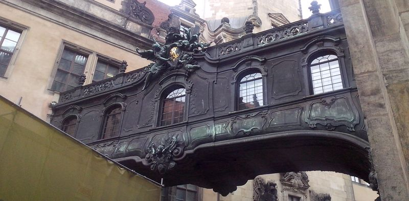

### Na pograniczu łużyckim

Żeby zrozumieć dzieje Saksonii trzeba się również przenieść w czasie w okres dużo wcześniejszy niż jej powstanie.

Dwóch kolejnych władców germańskiego plemienia Franków: Karola Młota i Karola Wielkiego uważa się za założycieli Imperium Karolińskiego (zwanego też Frankijskim). Jest to właściwy początek średniowiecza zachodniej części Europy. Karol Wielki był najważniejszym władcą tego okresu. W roku 800 został Cesarzem, co oznaczało odtworzenie Cesarstwa Rzymskiego. Imperium które stworzył, wkrótce po jego śmierci, na mocy traktatu w Verdun w 843 ulega rozpadowi na trzy części:

 - z zachodniej (państwo zachodniofrankijskie) powstaje późniejsza Francja
 - środkowa ulega kolejnym podziałom, ale jego południowa cześć to późniejsza północna Italia
 - natomiast na wschodzie tworzy się państwo wschodniofrankijskie (łac. regnum francorum orientalium), są to późniejsze Niemcy.

Państwo wschodniofrankijskie składało się z Turyngii, Lotaryngii, Fryzji, Saksonii (czyli obecnej Dolnej Saksonii), Frankonii, Szwabii i Bawarii. Pierwszym władcą państwa wschodniofrankijskiego jest wnuk Karola Wielkiego, Ludwik II Niemiecki panujący w latach 843-76. Jego przydomek jest jednak ahistoryczny, powstał dopiero w XIX wieku. Dopiero od wymarcia dynastii Karolingów niemieckich w X wieku zaczęto mówić o Królestwie Niemieckim (łac. regnum Teutonicorum).

### Ptasznik i Lohengrin

Dynastia Karolingów niemieckich wygasa na Ludwiku IV Dziecięciu, który umarł w 911. Władzę w królestwie niemieckim drogą elekcji obejmuje Konrad I z dynastii Konradynów i jest on jedynym przedstawicielem tego rodu na tronie niemieckim.

Po nim na ponad sto lat władcami Niemiec są królowie z dynastii Ludolfingów, dwóch pierwszych miało decydujący wpływ na historię Niemiec. Dokonują oni gruntownego przeorientowania polityki kierując jego siły na ekspansję w kierunku wschodnim.

Pierwszym Ludolfingiem jest Henryk I Ptasznik (niem. Heinrich der Vogler) panujący w latach 919-936. Był też księciem Saksonii, ale tytuł ten dotyczył ówczesnego księstwa saksońskiego (niem. Herzogtum Sachsen), czyli obecnej Dolnej Saksonii. Uważa się, że to on po upadku starej dynastii uratował kraj przed rozpadem na niezależne księstwa i obronił je przed inwazją Madziarów, został wprawdzie przez nich pokonany w bitwie pod Püchen w 919, ale zawarł rozejm zapewniający pokój za cenę trybutu.

Stworzył również bazę do ekspansji i zajęcia terenów znanych później jako Brandenburgia i Saksonia. Wschodnią granicą państwa wschodniofrankijskiego była ustalona w IX wieku Limes Sorabicus (niem. Sorbenmark), czyli granica łużycka, biegnąca od Adriatyku aż po linię Łaby, oddzielająca państwa germańskie od Słowian. Na odcinku obecnej Saksonii ta granica biegła mniej więcej na linii Soławy, czyli około 140 km na zachód od Drezna.

Henryk I Ptasznik po zawarciu pokoju z Madziarami przekroczył tę granicę w 928 na czele swojej armii i dokonał inwazji na tereny zamieszkałe przez plemiona słowiańskie. Po pokonaniu Stodoran zdobył ich stolicę - Brenabor, obecny Brandenburg. Od jego niemieckiej nazwy nazwano całą krainę nad Szprewą Brandenburgią. Dotarł do Łaby w okolicach późniejszego Drezna i po zwycięstwie nad Glomitami (inaczej: Dalemińcy) w dogodnym miejscu, na wzniesieniu przy zakolu rzeki wzniósł zamek w miejscu obecnej Miśni. W ten sposób stał się założycielem średniowiecznej stolicy krainy historycznej znanej od ponad 500 lat jako Saksonia. Wtargnął do Czech i zmusił księcia Wacława I do płacenia trybutu. Na wieść o powstaniu wznieconym przez wieleckie plemię Redarów udał się na północ i pokonał ich po pięciodniowym oblężeniu grodu w Łęczynie (niem. Lenzen w zachodniej Brandenburgii). Jego zwycięskie wojny opisuje Widukind z Korbei benedyktyński kronikarz w pisanym od 967 dziele "Res gestae saxonicae" (Dzieje Sasów), w którym znajduje sie również najstarsza wzmianka o Mieszku I.

Jego syn i następca Otton I Wielki był pierwszym władcą niemieckim koronowanym na cesarza (w 962) i to on w 955 pokonał Madziarów w bitwie na Lechowym Polu ostatecznie powstrzymując ich niszczące najazdy. Główna linia Ludolfingów, znanych też jako dynastia ottońska wygasa na prawnuku Henryka I Ptasznika, Ottonie III (tym od Zjazdu Gnieźnieńskiego) zmarłym w 1002.

### Marchia Wschodnia (937-965)

Dziesięć lat później, w 937 w pierwszym roku panowania jako król niemiecki Otto I tworzy Marchię Wschodnią (niem. Sächsische Ostmark, łac. marchia orientalis), której wschodnią granicę stanowi Limes Sorabicus. W ogromnym przybliżeniu można powiedzieć, że Marchia Wschodnia obejmowała zachodnią część późniejszego NRD. Natomiast na szerokości geograficznej Saksonii Marchia Wschodnia rozciągała się od Gór Harzu po Soławę i Muldę.

Teren państwa niemieckiego podzielony był wówczas na hrabstwa. Marchia była specyficznym rodzajem hrabstwa. Była to wojskowo-feudalna jednostka polityczna tworzona na granicy Świętego Cesarstwa Rzymskiego. Rządzący marchią margrabia miał więcej samodzielności niż hrabia, ponieważ był odpowiedzialny za bezpieczeństwo granic. Margrabią Marchii Wschodniej zostaje Gero. Na potrzeby tej Marchii w 962 zostaje utworzone arcybiskupstwo w Magdeburgu.

### Marchia Miśnieńska (966-1423)

W 965 Gero umiera i staje się to początkiem zmian administracyjnych. W ciągu następnych trzech lat następują ogromne zmiany. W roku Chrztu Polski, czyli w 966 cesarz niemiecki Otto I dzieli Marchię Wschodnią na 6 mniejszych:

 - Marchia Billingów - wschodni odcinek dolnego biegu Łaby
 - Marchia Północna - późniejsza Brandenburgia
 - Marchia Łużycka - obszar Dolnych Łużyc, w XII i XIII wieku zostaje podzielona, część obszaru zostaje włączona dol Marchii Miśnieńskiej
 - Marchia Merseburska - okolice Lipska, już na początku lat 80. X włączona w skład Marchii Miśnieńskiej
 - Marchia Życka - na południowy zachód od Merseburskiej, ze stolicą w Zeitz, przestałą istnieć podczas powstania Słowian połabskich i potem przez króla Henryka II Świętego jej teren został włączony do Marchii Miśnieńskiej
 - Marchia Miśnieńska (niem. Mark Meißen) zajmującą południowo-wschodnią część Marchii Wschodniej.

W 967 sobór w Rawennie tworzy trzy nowe biskupstwa podległe Magdeburgowi: Miśnię, Merseburg i Zeitz. Od 968 stolica i marchii i biskupstwa znajduje się w Miśni, wtedy wzmiankowany jest pierwszy margrabia miśnieński Wigbert. Obecna Saksonia jest w sensie politycznym kontynuacją ówczesnej Marchii Miśnieńskiej istniejącej właściwie do końca średniowiecza. Łużyce są zaś w ciągu X i XI wieku wielokrotnie do Miśni przyłączane i odłączane. W tym okresie Górne Łużyce to Milsko (ziemie plemienia Milczan [Paweł Konczewski "Między początkiem a końcem świata Milczan"](https://archeologia.com.pl/miedzy-poczatkiem-a-koncem-swiata-milczan/)). W latach 1002-31 Milsko należało do Polski. Trwają wojny Niemców, Czechów, Wieletów i Polaków. Sytuacja stabilizuje się dopiero pod koniec XI wieku i od XII wieku Milsko jest we władaniu czeskim.

### Diecezja miśnieńska (od 967)

Diecezja miśnieńska założona w 967 jako jedno z 3 biskupstw podległych pod Magdeburg. Jej zadaniem było utworzenie i utrwalenie struktur kościelnych na wschodnich peryferiach Marchii Miśnieńskiej oraz konwersja Wenedów (Słowian zachodnich). Kościół jest narzędziem kolonizacji niemieckich kresów wschodnich. W następnych wiekach powstaje sieć parafialna i zostają sprowadzone zakony.

W 1344 papież Urban V specjalnie dla Jana Luksemburskiego podnosi Pragę do rangi archidiecezji i 20 lat później wyznacza arcybiskupa praskiego jako legata (legatus natus) dla diecezji miśnieńskiej (również dla Bambergu i Ratyzbony). Z oczywistych powodów działanie to jest sabotowane w Magdeburgu, w efekcie Miśnia pozostaje pod jurysdykcją metropolii w Magdeburgu, ale biskupi są mianowani bezpośrednio przez Stolicę Apostolską, co jest oczywistym łamaniem przywilejów kapituły katedralnej. Jednym z ważniejszych z tamtego okresu jest Jan z Jenstejna (tak, ten od Jana Nepomucena) biskup miśnieński w latach 1374-79 a potem arcybiskup praski. Ostatnim biskupem tego okresu jest Thimo z Colditz, który przez zaniedbanie doprowadził ją na skraj bankructwa.

W końcu margrabia miśnieński Wilhelm I Jednooki, po utrwaleniu swojej władzy, wymógł w 1405 na papieżu Bonifacym IX egzempcję diecezji - w tym wypadku oderwanie diecezji miśnieńskiej i od Pragi i od Magdeburga i podporządkowanie jej bezpośrednio Stolicy Apostolskiej. W 1404 sprowadził do Drezna kanoników regularnych. Już kilkanaście lat później wybuchają wojny husyckie i choć diecezja jest nimi poważnie dotknięta, korzysta ze swojej niezależności od Pragi.

W XVI wieku kościół katolicki w Saksonii ulega dezintegracji. Zaczyna się to w 1539 kiedy tron obejmuje sympatyk konfesji ewangelickiej Henryk Pobożny, który zaraz po objęciu władzy czyni z luteranizmu religię państwową. Jego syn i następca August był jednym z głównych przedstawicieli strony protestanckiej na Sejmie w Augsburgu w 1555. Ustalono tam zasadę "cuius regio eius religio" (czyje panowanie tego religia). August na mocy tej zasady w 1559 dokonał sekularyzacji biskupstwa i wszystkich zakonów w Saksonii. Ostatecznie, w 1581 ostatni biskup miśnieński Jan IX z Haugwitz składa wobec kapituły katedralnej rezygnację i w porozumieniu z księciem Augustem przechodzi na luteranizm, żeni się i udaje się na emeryturę do zamku Ruhetal. Pomiędzy sekularyzacją a rezygnacją ostatniego biskupa, w 1567 papież Pius V powołuje miśnieńską administraturę apostolską z siedzibą w Budziszynie. I w tym stanie trwa saksońska organizacja kościoła katolickiego przez następnych ponad trzysta lat.

Dopiero w XX wieku, w 1921 na nowo powstaje diecezja miśnieńska, tym razem ze stolicą w Budziszynie - katedra św Piotra. Od 1945 z powodu napływu uchodźców ze wschodu liczba katolików gwałtownie wzrosła. Wg statystyk na 1950 w Saksonii jest prawie 10% katolików, w 2016 już tylko 3%.

### Wettynowie (1089-1918)

Nowy rozdział w historii Saksonii rozpoczął Henryk IV (cesarz niemiecki w latach 1084-1105) najbardziej znany ze sporu z papieżem Grzegorzem VII o inwestyturę (to ten który klęczał w Kanossie w 1077). Aby zakończyć okres niepokoju i zamieszania, kiedy to na tronie miśnieńskim co kilka lat zasiadają nowi władcy, a teren Marchii jest przedmiotem sporów, w 1089 mianował margrabią miśnieńskim całkowicie od siebie zależnego i uzdolnionego Henryka, który miał wówczas 19 lat. Henryk był synem Dedo I, margrabiego Marchii Łużyckiej. Nowy władca dowiódł swoich kompetencji politycznych, żeniąc się z Gertrudą z Braunschweig, siostrą poprzedniego władcy Miśni. Od tej pary zaczynają się dzieje Wettynów, którzy w Saksonii będą panować praktycznie bez przerwy przez ponad 800 lat. Tak długie panowanie jednej dynastii na jednym terytorium jest ewenementem na skalę światową.

W 1165 syn i następca Konrada Wielkiego, Otto Bogaty nadaje prawa miejskie i przywileje handlowe dla Lipska. Wśród praw jest także prawo targowe. Lipsk staje się znanym w całych Niemczech ośrodkiem handlu, a jego znaczenie stale rośnie. Sukces Lipska wynika z położenia dokładnie na skrzyżowaniu dwóch najważniejszych szlaków handlowych Rzeszy Niemieckiej: via regia (Kijów - Santiago de Compostela) i via imperii (Szczecin - Rzym).

Przykładem wzrostu potęgi rodu Wettynów jest tzw spór o Dohnę (niem. Dohnaische Fehde). Dohna (cz. Donin) to było miasto przy zamku historią sięgające jeszcze XI wieku. Od 1076 lenno czeskie. W 1143 stała się siedzibą rodową Doninów. W 1385 na jednym z drezdeńskich balów dla szlachty saksońskiej jeden z Doninów, burgrabia Jeschke (Yoshko) flirtował z żoną szlachcica saksońskiego Hansa von Körbitz. Rozgniewany Korbitz zareagował tak, że doszło do awantury i Jeschke publicznie go spoliczkował. Zaczęła się wojna, w której główną rolę odgrywały interesy wszystkich biorących w niej udział rodów, trwała ponad ćwierć wieku, aż do 1402. Najważniejszym uczestnikiem sporu był popierający Korbitza margrabia miśnieński Wilhelm I Jednooki. Wykorzystał wojnę do wyrugowania Doninów z ich ziemi i ostatecznie całkowitego wyniszczenia rodu. Zajmując ich zamki powołał się na status królewszczyzny (niem. Reichsfreiheit). Wszyscy dorośli przedstawiciele rodu Doninów zginęli w walce, ostatni z nich - właśnie ów nieszczęsny burgrabia Jeschke - uciekł do Weesenstein, ale nie znalazł tam schronienia; aresztowany w Königstein, w 1403 został ścięty w Budzie (Budapeszt). Wilhelm I Jednooki zajął te ziemie i odtąd posiadłości Wettynów sięgały Rudaw.

### Elektorat Saksonii (1423-1806)

Pierwotnie teren Niemiec podzielony był na hrabstwa, część z nich później ulega przekształceniu w księstwa. Kilka z tych księstw uzyskuje rangę elektoratu. Co to jest i czym się różni od zwykłego księstwa? Otóż jeden z najważniejszych monarchów średniowiecznych Karol IV Luksemburski, król czeski i cesarz niemiecki, który w 1349 założył Uniwersytet Praski i któremu Praga zawdzięcza Most Karola, wydaje w 1353 Złotą Bullę wprowadzającą poważną zmianę ustrojową Rzeszy. Od tej pory o wyborze kolejnego cesarza decyduje kolegium elektorów złożone z 7 książąt, czterech świeckich i 3 kościoła (biskupów). Jednym z tych elektorów był książę Saksonii-Wittenbergi z dynastii askańskiej.

W 1409 w wyniku waśni narodowych zagraniczni (głównie niemieccy) profesorowie i studenci opuścili Uniwersytet Praski. Margrabia Miśni Fryderyk I Kłótnik (niem. Friedrich IV. der Streitbare) wspólnie z bratem, Wilhelmem wykorzystali nadarzającą się okazję, zaprosili ich do Lipska i tam w tym samym roku ufundowali uniwersytet. Był to drugi uniwersytet w Niemczech, najstarszy - w Heidelbergu założono w 1386. Już wkrótce konflikt w Pradze zaostrzy się pod względem narodowym i religijnym i dojdzie do wojen husyckich. Fryderyk I Kłótnik chętnie bierze udział w wojnach, np. staje pod Grunwaldem po stronie krzyżackiej. Kiedy Zygmunt Luksemburski, syn i następna Karola IV na tronie cesarskim, organizuje krucjaty przeciwko husytom, Fryderyk chętnie go wspiera i staje się jego stronnikiem. W przededniu wojen husyckich w 1423 umiera bezdzietnie ostatni askański władca Saksonii. Tytuł elektora i księstwo jest do wzięcia. Zygmunt Luksemburski przekazuje Henrykowi dziedzicznie godność księcia Saksonii i co za tym idzie elektora Rzeszy. Jest to ogromny awans dla dynastii Wettynów. Powstaje rozległe państwo obejmujące teren obecnej Saksonii, Saksonii-Anhalt i Turyngii.

Ponieważ zarówno księstwo Saksonii, jak i tytuł elektora są bardziej zaszczytne niż dotychczasowe tytuły używane przez Wettynów, od tamtej pory używane są w miejsce dotychczasowych. Wkrótce potem ta ogromna dziedzina Wettynów zostaje podzielona wewnątrz dynastii, ale najważniejsze atrybuty, czyli tytuł elektorski i nazwa Saksonii pozostaje w rękach gałęzi rodu panującej w dotychczasowej Marchii Miśnieńskiej. Więc z pewnego punktu widzenia wygląda to tak jakby dotychczasowa Saksonia "przesunęła się" na południe.

Może jest to nadmiar szczegółów, niestety bez nich nie da się zrozumieć, dlaczego do pewnego czasu mówimy o Marchii Miśnieńskiej, a potem dość nagle o księstwie czy też elektoracie saksońskim i cały czas o tych samych ziemiach, tej samej dynastii.

Może się to wydawać tym bardziej osobliwe, że przecież kilka wieków wcześniej Saksonią nazywano wyłącznie dość odległe od Drezna księstwo u ujścia Łaby i Wezery. Nazwa Saksonii wywodzi się od germańskiego plemienia Sasów. Sasi razem w innymi plemionami germańskimi: Anglami i Jutami od V wieku ne najeżdżali Brytanię, stworzyli tam osadnictwo anglosaskie - stąd mówimy o Anglosasach i języku angielskim, który powstał w Brytanii przez połączenie dialektów germańskich, rdzennych elementów celtyckich i uproszczenie gramatyki podczas dominacji normańskiej. Ale nie tylko na Wyspach pozostały ślady po Sasach. Dzisiaj aż trzy landy niemieckie noszą nazwy Saksonia, są to:

- znajdująca się nad Morzem Północnym Dolna Saksonia (niem. Niedersachsen) ze stolicą w Hanowerze
- leżąca na południe od niej Saksonia-Anhalt (niem. Sachsen-Anhalt) ze stolicą w Magdeburgu
- oraz sąsiadująca z Polską Saksonia (niem. Sachsen) ze stolicą w Dreźnie

Po śmierci Fryderyk I Kłótnika w 1428 tytuł elektora dziedziczy najstarszy z trzech jego synów - Fryderyk II Łagodny. Kiedy najmłodszy z braci Wilhelm II osiągnął pełnoletność, w 1445 Fryderyk podzielił się z nim księstwem odstępując mu Turyngię. Już jednak w następny roku wybucha niszcząca kraj i trwająca aż pięć lat wojna domowa, zakończona podziałem kraju na Turyngię i Saksonię. Obie strony wychodzą z niej ogromnymi długami. Wilhelm II umarł w 1482 nie pozostawiając następców i jego ziemie przeszły we władanie synów Fryderyka.

W 1455 całą Rzeszę obiega historia porwania książąt z Altenburga (niem. Altenburger Prinzenraub). Rycerz Kunz von Kauffung, który walczył podczas wojny domowej po stronie Fryderyka został podczas niej wzięty do niewoli i wypuszczony po zapłaceniu ogromnego okupu. Po wojnie domagał się od Fryderyka odszkodowania za okup i zniszczony majątek. Fryderyk odmówił twierdząc, że Kunz wziął udział w wojnie na własne ryzyko i ostateczny wyrok sądu w Lipsku przyznał mu rację. Von Kauffung zebrał grupę 30 zbrojnych i podstępem korzystając z nieobecności księcia wdarł się do słabo strzeżonego zamku w Altenburgu, tym łatwiej, że sam przez kilka lat był jego burgrabią. Porwał obu synów Fryderyka, Ernesta (14 lat) i Albrechta (12 lat) i wywiózł ich na południe w stronę swoich czeskich posiadłości, gdzie mieli zostać uwięzieni aż do uzyskania okupu. Porywacze rozdzielili się na dwie grupy. Albrechtowi udało się zbiec i sprowadzić pomoc. Kunz von Kauffung został pojmany, osądzony i stracony na rynku we Freibergu. Przywódcom drugiej grupy udało się wynegocjować wygnanie w zamian za wypuszczenie Ernesta.

W 1464 Fryderyk II łagodny umiera i jego synowie przejmują władzę. W przeciwieństwie do poprzedniego pokolenia Wettynów nie są skonfliktowani. Przenieśli siedzibę dynastii z Miśni do Drezna. Kiedy umarł ich stryj Wilhelm, landgraf Turyngii pojawia się kwestia ewentualnego podziału ogromnej dziedziny Wettynów. W 1485 trzy lata po śmierci Wilhelma zawarto traktat w Lipsku, w wyniku którego Ernest dostaje zachodnią część czyli Turyngię, a Albrecht Odważny wschodnią czyli Saksonię z Miśnią i Dreznem. Od tego traktatu pochodzi trwały podział w dynastii Wettynów na dwie linie: ernestyńską i albertyńską. Wtedy też Drezno zostaje siedzibą rodową albertyńskiej linii Wettynów (czyli tej która sprawuje władzę na terenie dawnej Marchii Miśnieńskiej). Natomiast zamek Albrechtsburg przebudowany przez znanego architekta w służbie elektrów saskich Arnolda von Westfalen staje się pierwszym zamkiem rezydencjonalnym w Niemczech i jednym z najbardziej znaczących przykładów gotyku świeckiego w Niemczech. Obecną nazwę nadał mu w 1676 książę elektor Jan Jerzy II dla upamiętnienia księcia Albrechta, założyciela linii albertyńskiej Wettynów.

### Reformacja (od 1539)

Kiedy w 1517 rozpoczęła się w Niemczech Reformacja, na tronie saksońskim zasiadał Jerzy Brodaty. W 1496 ożenił się z Barbarą Jagiellonką, córką Kazimierza Jagiellończyka. Podczas Reformacji pozostał zagorzałym zwolennikiem kościoła katolickiego. Wsparł go także militarnie podczas wojen chłopskich, które objęły również teren Saksonii. Choć nie prześladował ewangelików, nie pozwalał na żadne zmiany religijne. Bardzo chciał przekazać tron władcy katolickiemu, ale choć Barbara urodziła mu dziesięcioro dzieci, żaden z jego synów nie dożył wieku sprawnego. Wiedząc, że umrze nie pozostawiając dziedzica, a jego następca skłania się ku ewangelikom w ostatnich latach życia szukał katolickiego księcia, któremu mógłby przekazać tron. Nie udało mu się to i po jego śmierci w 1539 tron po nim objął Henryk Pobożny (niem. Heinrich der Fromme), jak sam przydomek wskazuje człowiek bardzo zaangażowany religijnie. Odbył pielgrzymki do Ziemi Świętej oraz do Santiago de Compostela. Jeszcze w latach 30. XVI wieku stał się zwolennikiem Reformacji, być może pod wpływem żony Katarzyny Meklemburg. Jego matką była Sydonia, córka króla czeskiego Jerzego z Podiebradów, który był kalikstynem czyli zwolennikiem umiarkowanej odmiany husytyzmu. Był kiepskim władcą, polityka go nie interesowała, na szczęście dla Saksonii rządzi krótko, zaledwie dwa lata. Zaraz po objęciu władzy wprowadził ewangelicyzm jako religię państwową. Była to trwała zmiana, która na zawsze już ukształtowała obraz religijny Saksonii. Do dziś protestantyzm jest wyznaniem dominującym.

Używana w Saksonii urzędowa wersja języka niemieckiego tzw kancelaryjny saksoński (sächsische Kanzleisprache aka Meißner Kanzleideutsch) został doceniony przez Marcina Lutra i stał się podstawą dla dokonanego przez niego w 1522 tłumaczenia Nowego Testamentu (niem. Lutherbibel). Poprzez ogromne znaczenie samego tekstu jak i późniejszej twórczości Lutra (pisma polemiczne, listy, pieśni) na uformowanie się standardowego języka niemieckiego - znanego jako Hochdeutsch - można powiedzieć, że wczesnorenesansowy saksoński urzędowy stał się podstawą współczesnego języka niemieckiego.

Konflikt pomiędzy stronnictwem ewangelickim i katolickim w Rzeszy narasta. Państwa ewangelickie tworzą w 1531 sojusz obronny od miejscowości, w której go zawarto nazywany Związkiem Szmalkadzkim (niem. Schmalkaldische Bund), dochodzi do dwóch wojen szmalkadzkich w latach 1546-47 i 1551-52 zakończonych ostatecznie pokojem w Augsburgu w 1555 (niem. Augsburger Religionsfrieden). Wprowadza się wtedy zasadę cuius regio eius religio, czyli czyja władza tego religia. Pokój augsburski na ponad pół wieku kończy wojny religijne w Rzeszy. Dając wolność religiną władcom Rzeszy w sprawach polityki wewnętrznej uniezależnia ich od cesarza.

Podczas pierwszej wojny szmalkadzkiej dochodzi do wielkiego skandalu w rodzie Wettynów. Skonfliktowany z resztą rodziny margrabia Miśni Maurycy (Wettyn z linii albertyńskiej) pozostając ewangelikiem, staje podczas wojny po stronie cesarza i wspiera czynnie stronnictwo katolickie. Zyskał sobie z tego powodu przydomek "Judasza z Miśni" (niem. Judas von Meißen) oraz po przegranej ewangelików tytuł księcia Saksonii. Wojna szmalkadzka została rozstrzygnięta w bitwie pod Mühlbergiem (wówczas w Saksonii, obecnie Brandenburgia), w której po stronie ewangelickiej główną siłą były wojska saksońskie dowodzone przez elektora saksońskiego Jana Fryderyka Wspaniałomyślnego, pokonane między innymi przez żołnierzy Maurycego. Maurycy wart jest wzmianki z przynajmniej dwóch powodów, otóż od jego imienia bierze swoją nazwę zbudowany dla niego dworek myśliwski a później słynna rezydencja Wettynów - Moritzburg. W 1543 powołuje elitarną szkołę książęcą: przeznaczone dla najzdolniejszej młodzieży Sächsisches Landesgymnasium Sankt Afra zu Meißen.

Ponieważ Maurycy wkrótce umiera, nie pozostawiając męskiego potomka, jego następcą zostaje syn Henryka Pobożnego, August - książę elektor Saksonii w latach 1553-86. Podczas sejmu w Augsburgu w 1555 August jest najważniejszym przedstawicielem stronnictwa Reformacji. W 1559 korzystając z postanowień sejmu dokonuje sekularyzacji, czyli zajęcia całego majątku kościoła katolickiego na terenie księstwa. Diecezja miśnieńska przestaje istnieć, w jej miejsce w 1567 powstaje miśnieńska administratura apostolska z siedzibą w Budziszynie.

Gorące spory polityczne wywołane kontrowersjami religijnymi, czasem przekształcające się w wojny zajmują następne ponad sto lat. Najgorszym okresem jest straszliwa wojna trzydziestoletnia (1618-48), w której Saksonia nie wzięła udziału, ale padła jej ofiarą. Wojnę rozpoczęło wystąpienie Czech i Śląska przeciwko Habsburgom rozstrzygnięte podczas bitwy na Białej Górze, która zakończyła się największą katastrofą w dziejach Czech. Skutki represji były tak straszne, że dopiero w XIX wieku nastąpiło czeskie odrodzenie narodowe. Drezno stało się w 1621 miejscem zawarcia tzw. akordu drezdeńskiego, czyli pokoju kończącego wojnę cesarstwa z Czechami i Śląskiem. Dla Śląska postanowienia akordu drezdeńskiego były łaskawe. Gwarantem tego porozumienia był elektor saski Jan Jerzy I, pradziadek Augusta II Mocnego. Dla całej Europy Środkowej okres wojny trzydziestoletniej oznaczał regres gospodarczy, epidemie i zniszczenia, ucierpiała na tym także Saksonia. Zależnie od regionu straty ludzkie wynosiły od jednej trzeciej do połowy ludności. Ocenia się, że kiedy zawarto kończący wojnę pokój westfalski w Księstwie Saksonii mieszkało 535 tys ludzi, mniej więcej tyle co w 1550. Biorąc pod uwagę zniszczenia materialne oznacza to, że pod względem cywilizacyjnym Saksonia cofnęła się o ponad sto lat. Zmiany społeczne wynikały w tym czasie również z migracji. Cesarz Ferdynand II po pokonaniu Czechów wygnał z Czech ponad 30 tys rodzin ewangelickich (ok 150 tys ludzi), większość z nich osiadła w Saksonii. Również po wojnie tysiące ewangelików emigrowało z sąsiednich księstw do Saksonii, co dawało im możliwość pozostania przy swojej religii.

### Górne Łużyce

W średniowieczu na wschód od Marchii Miśnieńskiej leżało Milsko, którego nazwa wywodziła się od plemienia Milczan. W 1002 Milsko zostało przez Bolesława Chrobrego włączone do księstwa piastowskiego. Stolicą Milska, czyli późniejszych Górnych Łużyc był wówczas i jest do dziś Budziszyn. W 1018 książę Bolesław i cesarz Henryk II zawarli pokój w Budziszynie. Podczas kryzysu państwa piastowskiego w 1031 cesarz Konrad II włącza Milsko w skład Marchii Miśnieńskiej. Od 1076 przez prawie sześć wieków, z krótkimi przerwami, pozostają we władzy korony czeskiej.

Za panowania króla czeskiego i cesarza niemieckiego Karola IV w 1346 zostaje powołany Związek Sześciu Miast (niem. Oberlausitzer Sechsstädtebund; górnołuż. Zwjazk šěsćiměstow; czes. Šestiměstí) unikalna i w dużym stopniu suwerenna republika kupiecka utworzona przez sześć najważniejszych miast górnołużyckich: Budziszyn (władze Związku), Löbau (sejmik), Görlitz, Kamenz, Zittau oraz Lubań (od 1945 w Polsce). Dzięki korzystnemu położeniu na Via Regia - jednym z najważniejszych w Europie szlaków handlowych - i udzielonym przez dwór cesarski przywilejom szybko urósł w potęgę i bogactwo. Głównym zadaniem była likwidacja band zagrażających bezpieczeństwu szlaków handlowych. W 1367 Wittelsbachowie sprzedają Dolne Łużyce Karolowi IV, który włącza je do korony czeskiej.

Związek Sześciu Miast Formalnie istniał aż do kongresu wiedeńskiego w 1815, ale już w 1547 król czeski Ferdynand I odebrał prawo do wystawiania własnych wojsk, przywileje i nałożył na miasta związkowe ogromne i uciążliwe kary, m in podatek od piwa. Przyczyną było rozpuszczenie wojsk związkowych po upływie umówionych dwóch miesięcy, na jakie zostały użyczone. Niestety nastąpiło to w przeddzień decydującej o wyniku wojny szmalkadzkiej bitwy pod Mühlbergiem (to tam Maurycy Saski stanął po stronie cesarskiej zyskując sobie przydomek "Judasz z Miśni"). Choć kary udało się szybko zapłacić, nigdy już nie udało się odzyskać politycznej niezależności.

Podczas wojny trzydziestoletniej Górne i Dolne Łużyce zostały przyłączone do Saksonii. Wynikało to postanowień pokoju praskiego zawartego 30 maja 1635 pomiędzy cesarzem Ferdynandem II i elektorem saskim Janem Jerzym I, który reprezentował niemieckich protestantów.

Górne Łużyce rozciągają się na zachodzie od przedpola metropolii drezdeńskiej po Kwisę na wschodzie. W wyniku Kongresu Wiedeńskiego Saksonia została ukarana przez Prusy odebraniem blisko 1/3 terytorium. Były to Dolne Łużyce przyłączone do Brandenburgii oraz wschodnia część Górnych łącznie z Görlitz, która weszła w skład Dolnego Śląska. Kiedy w 1945 Dolny Śląsk został przyłączony do Polski wszyscy Serbołużyczanie mieszkający na wschód od Nysy Łużyckiej zostali wysiedleni do Niemiec. Serbołużyczanie są jedyną pozostałością Słowian Połabskich. Dlatego w okolicach Görlitz mamy taki galimatias łużycko-saksońsko-prusko-dolnośląski.

W 1991 Związek Sześciu Miast został reaktywowany - w celu nawiązania współpracy regionalnej i promocji turystyki. Ale tym razem należy do niego siedem miast: Görlitz i Zgorzelec oddzielnie. Polityczną i kulturową stolicą Górnych Łużyc od początku aż do dziś jest Budziszyn (niem. Bautzen, do 1868 Budissin).

### August II Mocny i August III (1694-1763)

Przełomowym okresem w historii Saksonii było panowanie Augusta II (w Saksonii Augusta I) i jego syna Augusta III (w Saksonii Augusta II), które jednocześnie od 1697 stanowiło unię personalną z Królestwem Polskim, i to przez cały ten czas, z przerwą podczas wojny północnej. To podczas niej doszło do szwedzkiej okupacji Saksonii i podczas niej w saksońskim Altranstädt podpisano w 1706 układ pokojowy Szwecji z Polską i rok później traktat dotyczący traktowania przez władze cesarskie śląskich luteran. Król szwedzki był ich protektorem. Dwa lata później zawarto reces egzekucyjny do traktatu z Altranstädt, w wyniku którego wybudowano na Śląsku sześć Kościołów Łaski.

W 1708 jeszcze podczas wojny północnej i szwedzkiej okupacji dochodzi do istotnego odkrycia. Pracujący dla Augusta II Mocnego matematyk i fizyk Ehrenfried Walther von Tschirnhaus oraz alchemik Johann Friedrich Böttger odkryli sposób produkcji prawdziwej porcelany i Miśnia stała się pierwszym miejscem w Europie gdzie wypalano porcelanę dokładnie taką jak chińska. Kwestią do dziś kontrowersyjną jest kto tak naprawdę tego dokonał. Tschirnhaus bowiem umarł już w październiku 1708 w Palais Fürstenberg w Dreźnie, ale wiele wskazuje że to on dokonał przełomu pracując niezależnie od Böttgera w Dreźnie. Böttger natomiast uwięziony na zamku miśnieńskim już w 1705 opracował gres czyli tzw "czerwoną porcelanę", określaną też jako Böttgersteinzeug. W 1710 specjalnym dekretem królewskim zostaje powołana pierwsza w Europie fabryka porcelany: Królewsko-Polska i Elektorsko-Saska Manufaktura Porcelany (niem. Königlich-Polnische und Kurfürstlich-Sächsische Porzellan-Manufaktur, obecnie Staatliche Porzellan-Manufaktur Meissen GmbH). Miśnieńska porcelana jest znana na całym świecie, a zbiory Muzeum Porcelany w Zwingerze uważane są za jedną z dwóch najcenniejszych kolekcji na świecie. Technika produkcji była tajemnicą państwową, zamku dzień i noc pilnowało 30 żołnierzy. Nie zapobiegło to jednak kradzieży technologii i już w 1717 powstała następna europejska manufaktura porcelany - w Wiedniu. Nazwa "białe złoto" która określano miśnieńską porcelanę jeśli chodzi o pierwsze kilkadziesiąt lat istnienia jest myląca, manufaktura bowiem nie była przynajmniej wtedy źródłem wielkich dochodów, a produkty z tego okresu były ciemne. Dopiero z czasem dopracowano się mlecznej bieli. Przez 153 lata manufaktura działała w gotyckich wnętrzach zamku Albrechtsburg, dopiero w 1863 została przeniesiona na przedmieścia Miśni, gdzie znajduje się do dziś.

Pasją obu Augustów było kolekcjonowanie sztuki, to właśnie eksponowaniu ich zbiorów służyły wielkie barokowe pałace. Byli też ważnymi patronami sztuki, nadwornym kapelmistrzem Augusta III był Johann Sebastian Bach, który przebywał jednak w Lipsku, a nie w Dreźnie, bo August preferował włoski styl. August III odkrył i zatrudnił w Dreźnie Canaletta. Kiedy August umarł, Canaletto wyruszył z Drezna do Sankt Petersburga, na dwór carycy Katarzyny, ale podczas podróży został zaproszony przez Stanisława Augusta Poniatowskiego do pozostania i pracy w Warszawie i tam już został.

W górnołużyckim Kamenz (Kamieniec) w 1729 urodził się Gotthold Ephraim Lessing, pisarz i dramaturg, jeden z najważniejszych literatów niemieckich okresu Oświecenia. Od 1741 uczęszcza do szkoły książęcej pod wezwaniem św. Afry w Miśni, tam dostrzeżono jego talent. Pięć lat później wstępuje na uniwersytet w Lipsku gdzie nawiązuje kontakt z elitą kulturalną i zaczyna pisać. Jest jednym z twórców języka niemieckiego. Warto wspomnieć, że w latach 1760-65 jest sekretarzem generała Friedricha Bogislava von Tauentziena, dowódcy twierdzy wrocławskiej.

*Przejście z Zamku do Kościoła Dworskiego. August III Sas musiał sobie zapewnić dyskretne przejście do katolickiego kościoła w luterańskim mieście*

Połowa XVIII wieku to czas wyniszczających Austrię i Prusy wojen śląskich. Ich bezpośrednią ofiarą padły zarówno Saksonia jak i Polska. W 1745 za panowania Augusta III, po zakończeniu drugiej wojny śląskiej zawarto w Dreźnie porozumienie pokojowe znane jako pokój drezdeński, potwierdzało warunki na jakich zakończyła się pierwsza wojna śląska (1742 pokój wrocławski i berliński). Pierwsze dwie wojny śląskie były raczej lokalnymi konfliktami o panowanie na Śląsku, ostatecznie ten spór rozstrzygnęła trzecia wojna śląska, tzw. wojna siedmioletnia, w której udział wzięły niemal wszystkie państwa Europy. Podczas niej w 1760 armia pruska dokonuje inwazji na Saksonię i po zajęciu Drezna Prusacy znajdują nietknięte stemple mennicze. Na masową skalę biją monety z pogorszonego surowca tzw. efraimki i zalewają nimi Polskę. Wojna siedmioletnia zakończyła się zwycięstwem Prus oraz znacznym osłabieniem i ekonomicznym i dyplomatycznym Saksonii i Polski. Wojnę kończy zawarty w 1763 pokój w Hubertusburgu, w Saksonii, w zamku myśliwskim Wettynów zbudowanym przez Augusta II Mocnego. Fryderyk II Wielki: "Saksonia jest jak worek z mąką, ile by się nim nie potrząsało, zawsze się coś wysypie".

W tym samym roku ze śmiercią Augusta III Sasa kończy się panowanie saskie w Polsce. Minie dziewięć lat i nastąpi pierwszy rozbiór Polski. Czasy saskie zmieniły Saksonię i Warszawę. W historii Polski panowanie Sasów oceniane jest negatywnie, ale prawdopodobnie spory wpływ na tę ocenę miała propaganda historyków pruskich, którzy z obu Augstów uczynili szwarccharaktery dla polukrowania wizji polityki Prus. Druga połowa XVIII wieku to znaczny wzrost dwóch europejskich potęg: Prus i Rosji. Dla Polski oznaczał on zabory, a dla Saksonii marginalizację i zastój.

Latem 1789 wybucha Rewolucja Francuska i wrzenie ogarnia całą Europę. Po ciężkiej zimie, następnego lata w Saksonii dochodzi do niepokojów znanych jako powstanie chłopskie w Saksonii (niem. Sächsischer Bauernaufstand). Zaczęło się podczas polowania w Wehlen i koncentrowało się na dwóch zasadniczych postulatach: likwidacji pańszczyzny i przywilejów łowieckich szlachty. Bunt ogarnął całą Saksonię, łącznie z Łużycami, dochodziło do napadów na zamki i wypędzeń arystokratów, oddziały chłopskie rozbrajały wojsko saksońskie. Wystąpienia miały charakter spontaniczny, nie przerodziły się w zorganizowaną rewolucję. Do września 1790 zostały stłumione przez dobrze zorganizowaną akcję wojskową.

W 1791 postanowienia Konstytucji 3 maja czynią z Fryderyka Augusta I (wnuka Augusta III) legalnym następcą króla Stanisława Augusta Poniatowskiego, dwór saski w ogóle nie został o tym powiadomiony i postanowienie to nie weszło w życie. Wyraźnie pokazuje to jednak chęć kontynuacji aliansu polsko-saskiego.

W sierpniu tego roku w pałacu w Pillnitz spotykają się cesarz Leopold II i król pruski Fryderyk Wilhelm II. Oznaką słabości Saksonii był fakt iż elektor saksoński, Fryderyk August I nie został w ogóle zaproszony. Przyczyną spotkania była potrzeba omówienia spraw związanych z zakończeniem wojny z Turcją, oraz Polską, która właśnie ogłosiła Konstytucję. Władcy zaniepokojeni rewolucyjnym wrzeniem w Paryżu ogłaszają Deklarację z Pillnitz mówiącą o pomocy dla króla Francji. Rewolucyjne władze Francji (Konstytuanta) odebrały to jako deklarację wojny i rzeczywiście wkrótce do niej doszło - to w Pillnitz uformowała się pierwsza koalicja antyfrancuska. Podobno Napoleon, odwiedzając później Pillnitz, powiedział "tu się narodziłem".

W końcu XVIII wieku wzrasta zainteresowanie krajoznawstwem i dziejami regionu. Szczególnym zainteresowaniem cieszą się okolice górnego biegu Łaby, na które zgodnie z ówczesna modą, dzięki podobieństwu do Jury Szwajcarskiej zaczyna się mówić Szwajcaria Saksońska. Oficjalnie to określenie wprowadził w 1800 artysta związany z Akademia Drezdeńską, nota bene Szwajcar z pochodzenia Adrian Zingg. Ta malownicza kraina staje się ulubionym tematem pejażystów: poza Zinggiem, najważniejsi malarze tego regionu to Anton Graff, Caspar David Friedrich, Johan Christian Dahl, Carl Gustav Carus i Ludwig Richter. Śladem ich obrazów wytyczony jest specjalny dedykowany sztuce szlak turystyczny - Malerweg, mający 112 km długości.

### Królestwo Saksonii (1806-1918)

W wyniku wojen napoleońskich upada dotychczasowy system polityczny, następuje koniec Cesarstwa i w 1806 kończy swoje istnienie Elektorat Saksonii (niem. Kurfürstentum Sachsen). Powstaje suwerenne Królestwo Saksonii (niem. Königreich Sachsen), jedno z wielu państw niemieckich, należących do utworzonego przez Napoleona Związku Reńskiego. Dotychczasowy elektor Fryderyk August I koronuje się na króla Saksonii. W 1807 na mocy postanowień układu w Tylży zostaje także formalnym władcą Księstwa Polskiego. Są to jednak czasy wojenne i nie idzie za tym realne objęcie władzy.

Twierdza Sonnenstein w Pirnie została przekształcona w 1811 w zakład opieki nad osobami chorymi nerwowo i psychicznie do tej pory przetrzymywanych w zakładach poprawczych w Torgau i Waldheim. Z inicjatywą wyszedł znany lekarz i psychiatra Christian August Fürchtegott Hayner, a ze strony władz Saksonii poparcia udzielił minister Gottlob Adolf Ernst von Nostitz und Jänkendorf. Pierwszym ważnym pacjentem nowego zakładu był Daniel Paul Schreber, sędzia który własne epizody schizofrenii paranoidalnej opisał w pionierskiej książce "Pamiętniki nerwowo chorego" (niem. Denkwürdigkeiten eines Nervenkranken) jednym z ważniejszych źródeł badań nad ta chorobą w XIX wieku. Właściwym twórcą zakładu w Sonnenstein był Ernst Gottlob Pienitz, jeden z pierwszych lekarzy wykazujących zainteresowanie leczeniem chorób psychicznych. Zarówno Hayner jak i Pienitz nauki pobierali w słynnym paryskim szpitalu psychiatrycznym Hôpital de la Salpêtrière u Philippa Pinela. Zastosowane tam nowatorskie metody i humanitarne podejście do pacjentów przenieśli do Saksonii, Hayner w Waldheim, a Pienitz w Sonnenstein. Obu uważa się za twórców współczesnej, wywodzącej się w idei oświeceniowych praktyki psychiatrycznej w Niemczech. Szczególną rolę odgrywa tu ośrodek ww Sonnestein, który w XIX wieku uważany był za wzorcowy.

W 1813 na polach pod Lipskiem rozegrała się jedna z najważniejszych i najbardziej krwawych bitew wojen napoleońskich, znana także jako "bitwa narodów" (niem. Völkerschlacht bei Leipzig). Miała ona przełomowe znaczenie podczas wojen wyzwoleńczych i oznaczała ostateczne pokonanie Napoleona na ziemiach niemieckich. Wzięło w niej udział ponad pół miliona żołnierzy. Dowódcą ze strony pruskiej był marszałek Gebhard Leberecht von Blücher. Dowodzący Saksończykami Fryderyk August I został wzięty do niewoli, a książę Józef Poniatowski utonął w Elsterze omyłkowo zastrzelony przez Francuzów. W stulecie bitwy na jej miejscu uroczyście odsłonięto monumentalny pomnik-mauzoleum Pomnik Bitwy Narodów (niem. Völkerschlachtdenkmal). Jego budowa trwała piętnaście lat.

Już wkrótce, po zakończeniu wojen napoleońskich, w 1815 podczas Kongresu Wiedeńskiego Saksonia została ukarana za przymierze z Napoleonem utratą prawie 1/3 terytorium, głównie na rzecz Prus. Król pruski Fryderyk Wilhelm III chciał doprowadzić do całkowitego rozbioru Saksonii. Wtedy właśnie dotychczasowa historyczna granica Śląska na Kwisie została przesunięta na Nysę Łużycką. Wettynowie jednak utrzymali prawo do tytułu królewskiego.

Saksonia jest jednym z pierwszych niemieckich państw z elementami demokracji parlamentarnej. W 1830 po niepokojach związanych z rewolucją lipcową we Francji król Antoni I wprowadził konstytucję oraz parlament o ograniczonych kompetencjach.

W 1839 powstaje pierwsza w Saksonii linia kolejowa. Kilka lat później Drezno zostaje połączone również w kierunkach zachodnim (Görlitz) i południowym (Děčín). W latach 1846-51 powstaje w Saksonii do dziś największy na świecie ceglany most kolejowy - wiadukt Göltzsch (niem. Göltzschtalbrücke) nad doliną rzeki Göltzsch pomiędzy Mylau i Netzschkau. Znajduje się na trasie łączącej Saksonię z Bawarią. Przypomina akwedukt, w sumie 98 łuków na czterech poziomach. Całkowita długość 574 m, wysokość 78 m. Na szczęście udało się ocalić go od zniszczenia podczas wojny, po wielu remontach wciąż jest w użytku.

Podczas Wiosny Ludów w 1848 w wielu miastach niemieckich wybuchają zamieszki. W Dreźnie jest to trwające od 3 do 9 maja Powstanie Majowe (niem. Dresdner Maiaufstand lub Dresdner Mairevolution). Władzę w mieście przejmują rewolucjoniści domagający się reform parlamentarnych. Powstanie zostaje stłumione z pomocą armii pruskiej. Wszyscy, którzy wzięli w nim udział muszą opuścić Saksonię. Byli to m.in. Michał Bakunin, znany rosyjski anarchista, słynny niemiecki kompozytor Richard Wagner, oraz Gotfried Semper, architekt i historyk sztuki, autor projektu budynku opery drezdeńskiej.

2 połowa XIX wieku to gwałtowny rozwój przemysłu, głównym ośrodkiem przemysłowym jest Zwickau, znajduje się tam ponad połowa wszystkich maszyn i kotłów parowych w Saksonii. Drugim ośrodkiem przemysłu staje sie Chemnitz. Daleko w tyle są Drezno, Lipsk i Budziszyn.

Pod koniec XIX wieku popularne stają się wielkie targi, często o znaczeniu międzynarodowym, jest to narzędzie rozwijania gospodarki i promocji kraju. Pierwsza Wystawa Światowa (EXPO) w pełnym tego słowa znaczeniu odbywają się w Londynie w 1851. Znane też są wystawy paryskie. Do grona miast urządzających targi międzynarodowe dołącza w 1895 Lipsk organizując pierwsze Targi Wzorcowe (niem. Mustermesse), znane później jako Targi Lipskie (niem. Leipziger Messe). Lipsk zostaje najważniejszym niemieckim miastem targowym.

### Cesarstwo Niemieckie (1871-1918)

W latach 60. XIX kanclerz Prus Otto von Bismarck realizuje skomplikowany plan zjednoczenia Niemiec pod egidą Prus. Zamierza osiągnąć swój cel za pomocą trzech kolejnych wojen. Druga z nich ma za zadanie wykluczenie Austrii z procesu zjednoczeniowego. Królestwo Saksonii staje po stronie Austrii, która wojnę przegrywa w krwawej bitwie pod Sadową. Wtedy pokonana Saksonia przyłącza się do zwycięzcy i od 1867 należy do Związku Północnoniemieckiego. Jako sojusznik Prus Saksończycy biorą udział w kolejnej pruskiej wojnie tym razem z Francją i po zwycięstwie pod Sedanem nic już nie stoi na drodze do zjednoczenia Niemiec. Powstaje Cesarstwo Niemieckie (niem. Deutsches Kaiserreich).

60% ludności i powierzchni Cesarstwa to Prusy. Przynależność do Cesarstwa oznacza dla Saksonii zależność od Prus. Królestwo Saksonii militaryzuje się na modłę pruską, w północno-wschodniej części Drezna powstaje Albertstadt, największy garnizon w Niemczech. Nazwę bierze od króla Saksonii Alberta, który jako książę następca tronu brał udział w wojnie z Francją i panował w Królestwie Saksonii w latach 1873-1902. W 1884 król Albert odziedziczył ogromny pałac Sibyllenort (Pałac Sybilli w Szczodrem koło Wrocławia), który od tej pory staje się główną rezydencją rodu Wettynów, sprawujących wówczas już tylko władzę tytularną. Albert dokonuje demontażu monarchii, patronuje reformom demokratycznym i zmianie Saksonii w nowoczesny, rozwijający się kraj. Umiera bezdzietnie w 1902 w pałacu w Szczodrem i tron przejmuje po nim, jego brat Jerzy, którego syn Fryderyk August III jest już ostatnim panującym przedstawicielem dynastii Wettynów.

W wyniku reformy prawa w nowopowstałej Rzeszy powołano w 1879 Sąd Najwyższy Rzeszy (niem. Reichsgericht). Niewielka przewaga głosów w Radzie Związku (niem. Bundesrat) (20/18) zadecydowała, że jego siedziba będzie nie w Berlinie a w Lipsku. Być może o lokalizacji zadecydował fakt, że Lipsk był już siedzibą Federalnego Wyższego Sądu Gospodarczego Konfederacji Północnoniemieckiej, a później Wyższego Sądu Gospodarczego Rzeszy. Zaczął funkcjonowanie 1 października 1879.

Z dwóch najważniejszych spraw jakie toczyły się w Lipsku pierwsza to trybunał niemieckich zbrodni wojennych w latach 1921-27, nota bene Niemczech określany jako Leipziger Prozesse. Sam proces został wymuszony postanowieniami traktatu wersalskiego i jego wyniki nie były zadowalające, ale na dłuższą metę poważnie przyczynił się do ustanowienia spójnego systemu badania i karania zbrodni wojennych. Druga to proces rzekomych/domniemanych podpalaczy Reichstagu w 1933. Proces juz z całą pewnością polityczny, ale fakt, że skazany został tylko schwytany na miejscu Marinus van der Lubbe, natomiast wszyscy lewicowi politycy, których naziści usiłowali wrobić w teorię spisku (podpalenie Reichstagu miało być sygnałem do rozpoczęcia rewolucji) zostali zwolnienie z zarzutów, uświadomił hitlerowcom, że muszą stworzyć własny system sądowniczy, całkowicie od nich zależny.

W latach 80. XIX wieku bracia Friedrich i William Nevoigt stworzyli w Chemnitz najdłużej istniejącą wyłącznie saksońską firmę - rowery Diamant. Zaczęli w 1882 od produkcji części do maszyn do szycia. Trzy lata później dołączyli do oferty zdobywające sobie wtedy popularność rowery. Zapotrzebowanie było takie, że musieli dobudować do fabryki osobne skrzydło. W 1895 powołali markę Diamant. W 1898 wprowadzili na rynek łańcuch podwójny, a w 1912 specjalnie profilując ramę rower damski (niem. Damenrad). Szczyt rozwoju firmy przypadł na lata 1920-21, cykliści na ich rowerach wygrali 20 na 29 krajowych wyścigów.

W 1900 mający poważanie neurolog z Lipska Paul Julius Möbius wydał książkę pod znamiennym tytułem "O fizjologicznym niedorozwoju umysłowym kobiety" (niem. Über den physiologischen Schwachsinn des Weibes). Cienka merytorycznie i objętościowo (kilkadziesiąt stron zaledwie) trafiła w gusta konserwatywnej publiki obawiającej się sufrażystek i emancypacji i zdobyła ogromną popularność. Za życia autora, czyli do 1907, miała 8 wydań.

We Freibergu 23 lipca 1908 miała miejsce ostatnia publiczna egzekucja dokonana w Saksonii. Skazaną była 23-letnia Greta Beier, która mając kochanka (poprzedni narzeczony, z którym rozstała się z powodu jego niewierności), zaszła z nim w ciążę i dokonała aborcji jednocześnie była oficjalną narzeczoną wybranego przez rodziców bogatego i dobrze zarabiającego inżyniera. Rok wcześniej i kilka dni przed ślubem podała mu posiłek z cyjankiem, a kiedy był bezwładny, strzeliła z rewolweru w usta. Upozorowała samobójstwo, napisała list w którym wyjaśniał iż zabił się z powodu sekretnego romansu z jakąś Włoszką, która go teraz szantażowała oraz przepisał cały majątek na rzecz Grety. To ostatnie wzbudziło podejrzenia brata ofiary i w efekcie Gretę uwięziono. Przyznała się do wszystkiego opisując dokładnie szczegóły zbrodni, po tym jak obiecano jej że nie grozi jej kara śmierci, bo w Saksonii przez ostatnie 50 lat nie skazano na śmierć żadnej kobiety. Król jednak po przeczytaniu zeznań oświadczył, że nie skorzysta z prawa łaski. Wyrok wykonano na dziedzińcu sądu, było tam około 200 ludzi także dzieci.

Na przełomie wieków saksońskie miasto Zwickau staje się najważniejszym w Niemczech ośrodkiem motoryzacyjnym, było to niemieckie Detroit. August Horch od 1899 produkował samochody w Kolonii, potem od 1903 krótko w Reichenbach im Vogtland (Saksonia, k Chemnitz) i w 1904 przeniósł produkcję do Zwickau gdzie już pozostał. Tu założył przedsiębiorstwo o nazwie Horch &amp; Cie. Motorwagen-Werke AG, po kilku latach musiał opuścić założoną przez siebie spółkę i ponieważ nie mógł używać swojego nazwiska w kolejnym przedsięwzięciu przetłumaczył je na łacinę (Horch to po niemiecku "słuchaj") i w 1910 właśnie w Zwickau powstało Audi.

Po zakończeniu Wielkiej Wojny w 1918 wobec upadku Cesarstwa Niemieckiego ostatni monarcha saksoński Fryderyk August III abdykuje. Resztę życia spędza w Szczodrem, gdzie umiera w 1932, tuż przed dojściem Hitlera do władzy. Podwrocławski pałac Wettynów po wojnie został rozszabrowany i zrujnowany w czasach PRL. Ocalał z niego niewielki fragment znajdujący się w opłakanym stanie.

### Wolny Kraj Saksonia (od 1918)

Po Wielkiej Wojnie, Saksonia staje się republiką, powstaje Wolny Kraj Saksonia (niem. Freistaat Sachsen). Wojsko w Saksonii zostaje włączone do Reichswehry, w większości do IV Okręgu (niem. Wehrkreis). Pierwsze lata po wojnie to w całych Niemczech czas niepokojów. W kwietniu 1919 minister wojny Gustav Neuring zostaje w Dreźnie zlinczowany przez tłum weteranów obawiających się zmniejszenia zasiłków kombatanckich. W marcu 1920 w wielu miastach niemieckich dochodzi do puczu Kappa-Lüttwitza, wojskowego zamachu stanu. Ludność Drezna masowo występuje przeciwko puczystom, pomimo strat cywilom udaje się pokojowymi metodami (demonstracje i strajk generalny) stłumić pucz. W rejonie Vogtlandu krotko działa komunistyczny oddział pod dowództwem Maxa Hoelza. W listopadzie 1920 ustanowiono konstytucję, opartą na weimarskiej. W całym okresie 1919-30 najsilniejszą partią w Saksonii jest SPD, w sześciu kolejnych wyborach osiąga wynik 30-40%.

W 1921, 24 czerwca, następuje odtworzenie diecezji miśnieńskiej z siedzibą biskupa w Budziszynie. 11 października w Zwickau powstaje pierwsza poza Bawarią grupa NSDAP i już piątego grudnia następnego roku dostają zakaz wystąpień publicznych. Po puczu monachijskim

Powstałe przed Wielką Wojną Horch i Audi to samochody luksusowe. Na przeciwnym biegunie rynku działało utworzone w 1905 przedsiębiorstwo DKW (niem Dampfkraftwagen, co oznacza samochód parowy), które sławę zdobyło w okresie międzywojennym specjalizując się w tanich, łatwych w naprawie i niezawodnych pojazdach, początkowo wyłącznie motocyklach. Nazwę popularnej także w Polsce "dekawki" wyjaśniano "dykta, klej i woda". Aż do Drugiej Wojny Światowej produkowali tylko pojazdy dwusuwowe. Przebojem był opracowany w 1919 przez zamieszkałego w Niemczech Duńczyka Jorgena Rasmussena dwusuwowy silnik zawierający zaledwie siedem ruchomych części. Pierwszy samochód wyprodukowali w 1928, a w latach 30. ich fabryka w Zschopau (koło Chemnitz) była największym na świecie producentem silników motocyklowych. W tym okresie na licencji DKW powstają czeskie motocykle Jawa.

W 1932 z połączenia DKW, Horcha, Audi i Wanderera powstaje Auto Union z siedzibą w Zwickau i od razu wynajmuje Ferdynanda Porsche do nawiązania rywalizacji z Mercedesem. W 1934 produkowany w Zwickau P-Wagen osiąga na berlińskim torze prędkość 216 km/h.

Zwickau nie był jedynym ośrodkiem motoryzacji w Saksonii. Mieszkający z Zittau (Żytawa) Karl Gustav Hiller w 1888 zaczął produkować maszyny tekstylne, dziesięć lat później kupił od Rovera licencję na produkcję rowerów, na początku XX wieku powstawały już motocykle Phänomen i trójkołowce Phänomobil. W 1916 powstała spółka akcyjna Phänomen Werke Gustav Hiller, która w okresie międzywojennym produkowała ciężarówki Phänomen Granit. I to stało się specjalnością fabryki od 1957 znanej jako Robur.

### Trzecia Rzesza (1933-45)

W okresie hitlerowskim w Saksonii funkcjonowało kilka obozów koncentracyjnych. Już w marcu 1933 powstają cztery obozy - typowe dla wczesnego okresu NS. Najkrócej istniały KL Leschwitz, we wsi k Görlitz i obóz Halbestadt (część Königstein); oba zlikwidowane już po dwóch miesiącach, w maju 1933. Pozostałe dwa istniały ponad rok i ulokowane były w zamkach w pobliżu Drezna: jeden w Colditz, drugi w Hohnstein. Oba zostają rozwiązane w sierpniu 1934. Więźniowie KL Hohnstein pracowali przy budowie pobliskiego toru wyścigowego Deutschlandring. W latach 1939-40 na zamku Hohnstein znajdował się Oflag IV-A.

W maju 1933 powstaje KL Sachsenburg w przędzalni pod tamtejszym zamkiem. Kierowani są do niego więźniowie wyżej wymienionych likwidowanych obozów koncentracyjnych. Działa do 1937. W maju 1933 we wszystkich saksońskich obozach koncentracyjnych osadzonych jest prawie 8 tys ludzi. Do 1937 uwięziono w nich kolejne 10 tys. W większości byli to działacze SPD i KPD. Po jego likwidacji w Saksonii nie ma już żadnych obozów koncentracyjnych. System hitlerowskich obozów koncentracyjnych w 1937 zostaje scentralizowany, większość więźniów zostaje wysłana do Dachau.

Od września do grudnia 1933 w lipskim Sądzie Najwyższym Rzeszy odbywała się rozprawa komunistów oskarżonych o podpalenie Reichstagu (niem. Reichstagsbrandprozess). Schwytany na miejscu Marinus van der Lubbe został skazany na śmierć, pozostali są zostali uniewinnieni - byli to przywódcy KPD którym hitlerowcy usiłowali dowieść usiłowania dokonania zamachu stanu. Wyrok wykonano również w Lipsku, 10 stycznia 1934 Lubbe został ścięty na gilotynie.

W 1913 we wsi Großopitz na południowy zachód od Drezna urodził się Gerhard Palitzsch jeden z najsłynniejszych zbrodniarzy hitlerowskich, sławny kat z Auschwitz. Już w lutym 1933 wstąpił do NSDAP i szybko zrobił karierę w SS. Szczególnie doceniono jego upodobanie do katowania i mordowania bezbronnych ludzi. Główny egzekutor KL Auschwitz, to on najczęściej wykonywał rozstrzeliwał ludzi pod Ścianą Śmierci przy Bloku 11. Zamordował tysiące ludzi.

Tor wyścigowy Deutschlandring miał zastąpić najstarszy niemiecki tor wyścigowy: niesławny Nordschleife w Nürburg - uznany za zbyt trudny i nienowoczesny (chodzi tu o ten starszy tor, a nie współcześnie używany). Przy projektowaniu skorzystano z najlepszych światowych wzorów. Jego długość wynosiła dokładnie 10 km. Został ukończony 27 kwietnia 1939 i wtedy też oficjalnie nadano mu nazwę zgodną z tonem partyjnej propagandy. Czasem był nawet określany jako Grossdeutschlandring. Na październik 1940 planowano Grand Prix Niemiec (niem. Großer Preis von Deutschland), które miało być wielkim świętem niemieckiej motoryzacji otwierającym ten wspaniały obiekt sportowy. Zaprojektowano infrastrukturę na milion widzów i 250 tysięcy miejsc parkingowych. Zanim jednak rozpoczęła się budowa, wybuchła wojna i odwołano zawody. Po wojnie we wschodnich Niemczech nie było już zapotrzebowania na taki obiekt. Pozostał więc sam tor, na którym w latach 50. zorganizowano kilka wyścigów, po czym został włączony do sieci dróg publicznych. Jest to pętla pomiędzy Hohnstein a Stürza.

Najważniejszą inwestycją motoryzacyjną reżimu była budowa sieci autostrad (niem. Reichsautobahn, w skrócie RAB). Dwie z nich wiodły przez Saksonię. Najpierw połączono Halle z Lipskiem (jest to obecna A14), odcinek ten oddano 20 kwietnia 1936. 23 czerwca 1937 powstał drugi historycznie odcinek obecnej A4 od Drezna na wschód do Meerane (okolice Chemnitz), a na zachód do Budziszyna i dalej pobliskiego Weißenberg oddano 1 lipca 1940. Najstarszym fragmentem autostrady A4 jest RAB9 Wrocław - Legnica oddany 27 września 1936. Oznaczał on osiągnięcie 1000 km długości co Hitler uczcił we Wrocławiu.

1 marca 1936 przeprowadzono pierwszą w Niemczech transmisję wideotelefoniczną. Minister Poczty, Paul Von Eltz-Rubernach odbył rozmowę z burmistrzem Lipska. Oba urzędy pocztowe berliński i lipski odległe były o 160 km. Wkrótce potem rozszerzono sieć włączając do niej Hamburg, Norymbergę i Monachium. Z powodu ogromnych kosztów wideotelefon nie cieszył się popularnością. Wykorzystano go jednak propagandowo podczas Olimpiady w Berlinie. Wynalazcą tego systemu przesyłania dźwięku i obrazu w czasie rzeczywistym był Georg Oskar Schubert absolwent drezdeńskiej politechniki, w 1925 obronił tam doktorat. Od 1930 pracował w berlińskim Siemensstadt, gdzie był kierownikiem działu rozwoju w zajmującym się technologiami telewizyjnymi Fernseh-AG. Swój system nazwał Gegensehn-Fernsprechanlagen. Rozwój tej technologii zakończył się w 1940 z powodu wojny. W zmienionej formie na krótko wróciła w latach 80. Podczas wojny przedsiębiorstwo zostało przeniesione do Sudetenlandu i tam w 1945 Schubert został schwytany przez Armię Czerwoną i wywieziony na Syberię. Wrócił stamtąd ciężko chory w 1954 i po kilku miesiącach zmarł.

Przed nadchodzącą wojną propaganda nazistowska promowała ideę likwidacji (błędnie nazywaną eutanazją) osób umysłowo i dziedzicznie chorych, podnosząc kwestię ogromnych kosztów, jakie ma pochłaniać utrzymanie ich przy życiu. W maju 1939 mieszkający w Pommsen koło Lipska ojciec kalekiego dziecka (urodziło się niewidome, nie miało lewego przedramienia i miało zdeformowaną nogę) zwrócił się do tzw Kancelarii Führera z prośbą o "wyzwolenie dziecka przez łaskę śmierci". Kancelaria była biurem przyjmującym pocztę odpowiedzialnym za kontakt władz z partyjnymi masami. Zarządzający nią Philipp Bouhler, sam kulejący na skutek ran wojennych, przekazał list bezpośrednio Hitlerowi, który odniósł się do pomysłu egzekucji entuzjastycznie. Przeprowadzono ją po konsultacji z lekarzami kliniki uniwersyteckiej w Lipsku po koniec lipca 1939. Od sierpnia na bezpośredni rozkaz Hitlera rozpoczęto przygotowania do programu - jak to ujmowano w nomenklaturze hitlerowskiej "likwidacji życia niewartego życia" (niem. lebensunwertes Leben). Kierownictwo operacji Hitler powierzył Bouhlerowi, jego organizacja zatrudniała 116 osób i składała się z trzech biur, nazwa każdego z nich ukrywała właściwy cel. Siedzibą wszystkich trzech była pożydowska willa przy Tiergartenstraße 4, niedaleko dzielnicy rządowej. Od tego adresu wzięła się nazwa programu - Akcja T4 (niem. Aktion T4). W jej wyniku zamordowano 80 tys ludzi.

Wszystko zaczęło się w 1920 kiedy ukazała się kontrowersyjna praca "Likwidacja istot niewartych życia - jej zakres i forma" ("Die Freigabe der Vernichtung Lebensunwerten Lebens - ihr Mass und ihre Form"). Jej autorami byli ludzie wykształceni należący do elity niemieckiego społeczeństwa: Karl Binding emerytowany prawnik z uniwersytetu lipskiego i Alfred Hoche z pochodzenia Saksończyk i psychiatra na uniwersytecie we Fryburgu Bryzgowijskim. W 1922 na corocznym zjeździe saksońskich neurologów podczas dyskusji na jej temat po raz pierwszy w środowisku medycznym otwarcie zadano pytanie "czy lekarzowi wolno zabijać". Morderstwo nazywano "humanitarną śmiercią" (niem. humaner Tod) lub "łagodnym wybawieniem" (niem. sanfte Erlösung). Wyższy radca medyczny Ewald Meltzer, który przez prawie 30 lat kierował ośrodkiem dla niezdolnych do nauki dzieci opóźnionych w rozwoju w Katharinenhof (obecnie część Großhennersdorf k Löbau w Górnych Łużycach) po przeczytaniu tej książki rozesłał do rodziców ok 200 dzieci ankietę badającą ich stosunek ewentualnego "skrócenia życia" ("Lebensverkürzung eines Wesens" - termin wprowadzony przez autorów "Likwidacji..."), otrzymał 162 odpowiedzi z tego 73% (119) pozytywnych. Tylko dziesięć procent jednoznacznie i całkowicie odrzuciło możliwość "bezbolesnego skrócenia życia". Wyniki opublikował w 1925 z komentarzem "Człowiek chętnie uwolniłby od ciężaru siebie i dziecko, ale każdy chce mieć czyste sumienie". Choć Meltzer sam nie miał nic wspólnego z Akcją T4 i w ogóle był przeciwny zabijaniu (propagował sterylizację), jego badanie było przedmiotem analizy w memoriale Theo Morella, osobistego lekarza Hitlera, "Vernichtung lebensunwerten Lebens" i często podnoszonym usprawiedliwieniem dla organizatorów T4. Według Morella zamordowanie 200 tysięcy chorych pozwoliłoby dokonać oszczędności na sumę 8 mld marek (w 1933 budżet Rzeszy wynosił 5,5 mld marek).

Sonnenstein w Pirnie od 1811 był znany w Niemczech jako wzorowy i nowoczesny ośrodek leczenia zaburzeń psychicznych. Od początku 1940 do sierpnia 1941 był jednym z sześciu głównych ośrodków, w których przeprowadzono Akcję T4. Doktor Hermann Paul Nitsche pracujący tam od 1913 i w latach 1928-1939 dyrektor zakładu był jednym z głównych organizatorów programu. W ramach Akcji T4 zamordowano tam 14 tysięcy ludzi. Uważa się, że pod względem technicznym i organizacyjnym był to wstęp do Holokaustu, w którym użyto procedur i przeszkolonego w mordowaniu personelu T4. W przypadku Sonnenstein było to około stu osób doświadczonych w używaniu komory gazowej (na tlenek węgla) i krematorium, jedna trzecia z nich została skierowana do pracy w obozach zagłady. Sonnenstein był także jednym z miejsc, w których mordowano również przeciwników politycznych. Po wstrzymaniu Akcji T4 przeprowadzano tam również egzekucje w ramach Akcji 14f13 (niem. Aktion 14f13 aka Sonderbehandlung 14f13) - mordowanie niezdolnych do pracy więźniów obozów koncentracyjnych. Ofiarą tych egzekucji padło ponad tysiąc ludzi. Jedną z tysięcy ofiar Sonnenstein była np. malarka Elfriede Lohse-Wächtler, przedstawicielka drezdeńskiej secesji. Latem 1942 zdemontowano komorę gazową i zatarto ślady dokonanej zbrodni. Zorganizowano tam Adolf-Hitler-Schule Gau Sachsen i szpital dla Wehrmachtu.

Zimą 1942/1943 7 osobowa komisja lekarzy skontrolowała 110 saksońskich zakładów opiekuńczo-leczniczych. Cytat z raportu końcowego:
>W trakcie naszej kilkumiesięcznej działalności [...] odnieśliśmy wrażenie, że kierownicy tych zakładów, względnie przytułków, z wyjątkiem kilku [instytucji] klerykalnych, jak na przykład Fundacja św Antoniego w Kamenz i zakład dla epileptyków Innere Mission w Klein-Wachau, i kilku mniejszych placówek w okręgu Zittau, raczej pozytywnie odnoszą się do problemu eutanazji. Nigdzie nie robiono nam większych trudności. Wszędzie kierownictwo zakładów, względnie przytułków, wspierało nas i chętnie udostępniało nam [...] swoje akta i karty choroby. [...] Nawet tam, gdzie ze względów religijnych istnieją negatywne postawy w stosunku do kwestii eutanazji, nie napotkaliśmy znaczącej obstrukcji.

W 1947 władze sowieckie przeprowadziły proces zbrodniarzy z Sonnenstein, dyrektor Nitsche i dwóch pielęgniarzy zostało skazanych na śmierć. Nitsche został zgilotynowany w Dreźnie. Od 2000 jest to miejsce pamięci T4 (niem. Gedenkstätte Pirna Sonnenstein). Jak na to zwraca uwagę Götz Aly (z którego książki zaczerpnąłem większość informacji na temat T4 w Saksonii) - paradoksalnie Nitsche aż do czasu kiedy stał się nazistą był postępowym psychiatrą, mającym wiele osiągnięć. Propagował humanitarne podejście do pacjenta i w duchu Pienitza, swojego słynnego poprzednika z Sonnenstein, wdrażał traktowanie pacjentów z przyjaźnią i życzliwością, koncentrację na aktywnej terapii. Był przeciwnikiem jakichkolwiek środków przymusu w rodzaju kaftanów bezpieczeństwa i chciał się zakazu popularnego wówczas zawijania chorych w mokre prześcieradła. Domagał się leczenia otwartego i psychiatrii społecznej. W 1929 ukazał się Handbuch der Geisterkrankheiten (Podręcznik chorób psychicznych), w którym Nitsche napisał główny rozdział "Ogólna terapia i profilaktyka" (niem. Allgemeine Therapie und Prophylaxe), w którym domagał się psychiatrii wolnej od przemocy i propagował idee Hermanna Simona.

W 1939 w miejsce dawnego obozu koncentracyjnego na zamku Colditz powstaje obóz jeniecki - najsłynniejsze, elitarne więzienie dla alianckich oficerów Oflag IV-C. Dlaczego elitarne? Osadzeni zostają w nim szczególnie ważni więźniowie, lub tacy którzy dokonali już kilku prób ucieczki. Miało być to więzienie, z którego już nie można uciec. W całej historii obozu od października 1939 do kwietnia 1945 uciekło z niego 31 więźniów.

Podczas wojny Drezno uważane za "schron przeciwlotniczy Rzeszy" zostało zbombardowane przez ponad tysiąc alianckich bombowców. Zginęło 25 tysięcy ludzi, zniszczone zostało całe centrum miasta.

Berlińskie mieszkanie Käthe Kollwitz na Prenzlauer Berg zostało zbombardowane w 1943. W lipcu 1944 najmłodszy syn Fryderyka Augusta III, książę Ernst Heinrich zaprosił ją do Moritzburga. Oddał jej do użytku dworek Rüdenhof leżący w pobliżu zamku. Umarła tam 22 kwietnia 1945. W 50. rocznicę śmierci artystki w 1995 otwarto tam muzeum i dom teraz nazywa się Käthe-Kollwitz-Haus Moritzburg.

W Saksonii w dniach 21-26 kwietnia 1945 miała miejsce tzw. bitwa pod Budziszynem, a w rzeczywistości masakra 2. Armii Wojska Polskiego spowodowana niekompetencją dowodzącego nią generała Świerczewskiego. Podczas nieskoordynowanego marszu na Drezno, który miał zabezpieczyć lewą flankę 1 Frontu Ukraińskiego rozproszone oddziały polskie znalazły się pod ogniem oddziałów Grupy Armii "Mitte" pod dowództwem niesławnego wówczas już feldmarszałka Ferdinanda Schörnera. Była to ostatnia udana niemiecka operacja wojskowa. Zginęło wg oficjalnych danych kilka tysięcy polskich żołnierzy, ale na ile ta liczba jest wiarygodna świadczy fakt iż liczba zaginionych sięga 30 tysięcy ludzi. Ocenia się, że bitwa ta stanowi 1/3 wszystkich strat wojennych obu polskich armii walczących pod sowieckim dowództwem.

Również w Saksonii kwietnia doszło do spotkania Armii Czerwonej i US Army, które przeszło do historii jako spotkanie na Łabie. Najpierw w pobliżu Strehla czterech zwiadowców amerykańskich po przekroczeniu Łaby napotkało oddziały Pierwszego Frontu Ukraińskiego. Kilka godzin później doszło do najbardziej znanego spotkania w pobliżu zniszczonego mostu na Łabie w Torgau. Następnego dnia - 25 kwietnia - w Torgau zorganizowano spotkanie dowódców na szczeblu dywizji, znanego jako uścisk dłoni na Łabie (ang. Handshake of Torgau).

### NRD (1949-89)

W pierwszych miesiącach po zakończeniu wojny w Europie Saksonia była pod okupacją zarówno wojsk amerykańskich (w zachodniej części) jak i Armii Czerwonej. Amerykanie opuścili Saksonię dopiero 1. lipca 1945, przekazując cały jej obszar władzom sowieckim. W ten sposób stała się częścią sowieckiej strefy okupacyjnej (niem. Sowjetische Besatzungszone; w skrócie: SBZ). Od strony wschodniej granica została wytyczona zgodnie z postanowieniami Konferencji Poczdamskiej (17 lipca - 2 sierpnia) na Nysie Łużyckiej. Był to czas braku stabilności i wszechwładzy NKWD. W Budziszynie przez tajne więzienie Speziallager Bautzen w ciągu czterech lat przewinęło się ponad 30 tys. ludzi, 10% z nich zniknęło bez śladu. Podobne więzienie choć na mniejszą skalę działało w Dreźnie.

W Dreźnie był zlokalizowany największy garnizon Armii Sowieckiej w NRD, stacjonowała tam 1. Gwardyjska Armia Pancerna (niem. 1. Garde-Panzerarmee, ros. 1-я гвардейская танковая армия) trzon pierwszej linii Układu Warszawskiego. W 1993 Armia została przeniesiona do Smoleńska i rozformowana w 1998.

Jeszcze przed powstaniem NRD, decyzją władz okupacyjnych z istniejących zakładów przemysłu motoryzacyjnego zostaje powołana ogólnokrajowa marka parasolowa - Industrieverband Fahrzeugbau, w skrócie IFA. Część saksońska jest znana później pod nazwą VEB IFA-Kombinat PKW Karl-Marx-Stadt: jej produktami były m. in. Trabant, Robur, Barkas i motocykl MZ.

W 1948 na polecenie administracji sowieckiej w dawnych zakładach Siemensa w Chemnitz ruszyła produkcja miniaturowej kolejki elektrycznej, zaprezentowanej na targach lipskich w 1949 jako Pico Express. Z powodu małej wydajności zakładów w Chemnitz produkcję przeniesiono do Sonneberga w Turyngii. Już jako Piko kolejki te zdobyły sobie renomę na całym świecie.

Przez ponad cztery lata Alianci nie byli w stanie dojść do porozumienia w sprawie utworzenia państwa niemieckiego i już w okresie zimnej wojny jesienią 1949 powstają dwa oddzielne państwa niemieckie: 7 września RFN a miesiąc później 7 października NRD (niem. Deutsche Demokratische Republik - DDR). Trzy dni później 10 października 1949 powstaje Radziecka Komisja Kontroli (niem. Sowjetische Kontrollkommission), na której czele stoli legendarny dowódca 8 Armii Gwardyjskiej generał Wasilij Czujkow. Istniała do maja 1953. Jedną z pierwszych decyzji nowego państwa wschodnioniemieckiego było nawiązanie współpracy z istniejącym w tych samych realiach politycznych państwem polskim. 6 lipca 1950 podpisano w obecnym Domu Kultury w Zgorzelcu układ zgorzelecki już w pierwszym artykule sankcjonującym granicę na Odrze i Nysie Łużyckiej. Zgorzelec był nowym polskim miastem powstałym z prawobrzeżnego przedmieścia Görlitz.

W Saksonii odbyła się ostateczna rozprawa nowopowstałego państwa enerdowskiego z hitleryzmem. W okresie od 21 kwietnia do 29 czerwca w więzieniu Waldheim w Chemnitz odbył się tzw "proces w Waldheim" (niem. Waldheimer Prozesse). Faktyczną przyczyną procesu była decyzja władz sowieckich o rozwiązaniu enerdowskich więzień NKWD i przekazaniu Niemcom osadzonych od 1945 więźniów z Budziszyna, Buchenwaldu i Sachsenhausen. Czujkow ogłosił tę decyzję w styczniu 1950. Proces miał znaczenie pokazowe, nie miał prawnego umocowania i był pod względem formalnym parodią sprawiedliwości. 37 sędziów zostało specjalnie dobranych, jedynym kryterium było posłuszeństwo wobec rządzącej partii komunistycznej SED. Wszyscy zostali przeszkoleni na przyspieszonych kursach prawniczych organizowanych od 1946. Na ławie oskarżonych zasiadła rekordowa liczba oskarżonych: 3442. Zapadło bardzo dużo poważnych wyroków. Prawie wszyscy (3324) zostali skazani, w większości na wysokie kary więzienia: 1900 wyroków od 15 do 25 lat, tylko pięciu dostało wyroki poniżej 4 lat. Poza tym 146 wyroków dożywocia oraz w sumie po apelacjach 33 wyroki śmierci, z których wykonano dwadzieścia cztery, wszystkie 4 listopada 1950. Był to jedyny proces zbrodniarzy hitlerowskich w NRD i zakończył proces denazyfikacji. STASI nie miała żadnych oporów w zatrudnianiu byłych hitlerowców i czerpaniu z doświadczeń Gestapo. Według propagandy enerdowskiej nowe państwo niemieckie (i jego obywatele) nie miało nic wspólnego hitlerowską przeszłością.

Po umocnieniu władzy komunistycznej w 1952 przeprowadzono reformę administracyjną. Saksonia tak samo jak wszystkie inne enerdowskie landy przestała istnieć. Została podzielona na trzy okręgi (niem. Bezirk): Drezno, Chemnitz i Lipsk. Taki podział administracyjny istniał aż do końca istnienia NRD. W 1953 zmieniono nazwę Chemnitz na Karl-Marx-Stadt, była to zupełnie arbitralna decyzja, ponieważ Chemnitz nie miało żadnych związków z Karolem Marksem.

Lata 50. to też okres rozkwitu i likwidacji jazzu w Saksonii. Główne ośrodki to oczywiście miasta uniwersyteckie: Lipsk i Drezno. Jazzkreises Leipzig został założony przez Reginalda Rudorfa dziennikarza i krytyka sztuki, w 1956 Rudorf został pobity, rok później oskarżono go o "Boykotthetze, konterrevolutionärer Tätigkeit sowie Beleidigung hoher Funktionäre der SED und der FDJ" i dostał wyrok dwóch lat obozu pracy m.in. w kamieniołomie Röcknitz, udało mu się potem uciec na Zachód. Natomiast Dresdner Interessengemeinschaft Jazz został zdelegalizowany i zakazany w 1957.

W NRD nie było odpowiednika PRL-owskiej odwilży gomułkowskiej. W 1956 powstaje kolejne więzienie polityczne Haftanstalt Bautzen II w więzieniu w Budziszynie. Jest to więzienie specjalne przeznaczone dla ważnych więźniów, gwarantujące brak możliwości ucieczki i okrutne traktowanie osadzonych. Pojmanych zwożono szarą furgonetką z reklamą "Ostsee Fisch Frisch auf den Tisch". Miejsce to zasłynęło z tortur nie pozostawiających śladów, np dręczenia ludzi zimnem (Kältefolter), ciasnotą (tzw. Tigerkäfig) i zmuszania ich do życia w upokarzających warunkach. Aż trzech podwójnych agentów Stasi popełniło tu samobójstwo (m.in. Armin Raufeisen i Horst Garau), oficjalnie wykluczono udział osób trzecich, ale taka koincydencja jest zgodna ze słowami szefa Stasi Ericha Mielke "ci funkcjonariusze Stasi, którzy przejdą na służbę zachodniego wywiadu, muszą pamiętać, że czeka ich tylko i wyłącznie śmierć".

Zaraz po wojnie uruchomiono produkcję rowerów w dawnych zakładach Diamant, prowadzona była pod sowieckim zarządem jako państwowe sowieckie przedsiębiorstwo Awtowelo. Wkrótce w 1951 zatrudniało półtora tysiąca ludzi i produkowało 200 tys rowerów rocznie. W uznaniu sukcesu oddano je Saksonii i od tej pory aż do upadku NRD działało pod nazwą VEB Elite-Diamant. Był to najważniejszy i najbardziej znany za granicą producent rowerów w NRD. W RFN były sprzedawane jako Diadem. Jest to jedna z niewielu enerdowskich marek, która z sukcesem przetrwała transformację ekonomiczną, obecnie jest to część Trek Bicycle Corp. Zakłady Diamantwerke w Hartmannsdorf są najstarszą fabryką rowerów w Niemczech.

Jednym z tradycyjnych ośrodków motoryzacji było czwarte co do wielkości miasto Saksonii Zwickau. Fabryki Auto Union zostały najpierw podczas wojny zniszczone przez amerykańskie lotnictwo, a później w pierwszych latach powojennych zdemontowane i wywiezione pod Ural gdzie przez wiele lat produkowano samochody DKW. Inżynierowie, kapitał i prawo do marek, zarówno do Audi, Auto Union jak i DKW przeniosły się do Niemiec Zachodnich. W 1951 w Bawarii umarł August Horch i dziś w Zwickau istnieje jego muzeum. Władze NRD usiłując uruchomić przemysł motoryzacyjny na bazie tego co pozostało po Auto Union uruchomiły: z dawnego Horcha VEB Sachsenring Automobilwerke Zwickau, a z Audi - VEB Automobilwerk Zwickau. W pierwszym zaczęto produkcję samochodów ciężarowych, a w drugim kontynuowano produkcję DKW w 1953 przeniesioną do Wartburga w Turyngii.

Rozpoczęły się pracę na futurystycznym projektem samochodu małolitrażowego dla mas. W 1955 ruszyła produkcja AWZ P70, ponieważ oceniono ją jako perspektywiczną w celu zapewnienia produkcji wielkoseryjnej połączono obywa przedsiębiorstwa w jedno - VEB Sachsenring Automobilwerke Zwickau, wtedy też zmieniono nazwę samochodu na Sachsenring P70. Miał już nadwozie z duroplastu na stalowej ramie. Już w 1955 przedstawiono jego następcę od 1957 znanego jako Trabant, jest to rok wystrzelenia sowieckiego Sputnika, a Trabant to niemiecki odpowiednik tego słowa. Właściwy Trabant w formie znanej nam wszystkim - Trabant 601 - powstał kilka lat później, po raz pierwszy został publicznie zademonstrowany na Targach Lipskich w 1964. To jeden z najbardziej rozpoznawalnych samochodów świata i stał się jednym z symboli NRD. W latach 1957-91 wyprodukowano ich ponad 3 miliony, z czego dwie trzecie były wciąż na chodzie w dniu upadku NRD, dzięki czemu na jeden samochód osobowy przypadało tam 4 osoby. W Berlinie istnieje Muzeum Trabanta i Trabant jest na jednym z dwóch najczęściej publikowanych murali z Muru Berlińskiego. Już jako "Trabi" reprezentuje tzw. ostalgię (niem. Ostalgie = Osten + Nostalgie), czyli sentyment do dawnego NRD.

Osobliwą specjalnością motoryzacyjną Saksonii były tzw. Kinderpanzer (aka Pionierpanzer) konstruowane w warsztatach zakładów azotowych VEB Agrochemie Piesteritz. Były to zbudowane najczęściej w skali 1/3 miniaturowe dziecięce czołgi i inne pojazdy pancerne. Podstawą było podwozie Trabanta, czasem używano podzespołów Wartburga. Miały działające gąsienice. Organizowano parady tych dziecięcych czołgów i z pewnością były ogromną atrakcją dla chłopców, jak również narzędziem indoktrynacji. W Bad Schmiedeberg istniała Pionierpanzerbrigade. Chociaż można zobaczyć je na licznych zdjęciach, żaden z tych czołgów nie ocalał.

W dawnych zakładach DKW w Zschopau ponownie uruchomiono produkcję motocykli. W 1956 zostały wydzielone w ramach IFA jako Motorenwerke Zschopau (w skrócie MZ) a jego produkty znane i popularne były również w Polsce - jako "emzetki".

Mniej znaną, ale również rozpoznawalną w Polsce saksońską marką motoryzacyjną był Robur. Phänomen Werke z łużyckiego Zittau produkująca motocykle jeszcze przed pierwszą wojną światową, a w okresie międzywojennym ciężarówki Phänomen Granit, została zniszczona pod koniec wojny. Wkrótce po niej zaczęła funkcjonowanie jako warsztat naprawczy sowieckiego sprzętu. Ze względu na znaczenie została bardzo szybko znacjonalizowana. Kiedy tylko powstało NRD powrócono do produkcji ciężarówek. Pierwsze Granity wyjechały z fabryki już w styczniu 1950. W 1957 fabrykę przemianowano na VEB Robur-Werke Zittau ("robur" to po łacinie pień dębu). Ciężarówki przemianowano na Garant. W 1961 na targach lipskich zaprezentowano pierwszą wersję najbardziej znanego produktu tej firmy: Robura LO 2500, znanego po prostu jako Robur, albo IFA Robur. Do 1990 wyprodukowano ich 250 tys.

Na bazie zakładów Framo w Karl-Marx-Stadt w 1958 powstała fabryka Barkas-Werke, najbardziej znana z produkcji od 1961 aż do 1991 jedynego enerdowskiego samochodu dostawczego: Barkas B1000. Zawierał on elementy Wartburga, m. in. silnik. Miał on nowoczesne wagonowe nadwozie i napęd na przednie koła, oraz nisko położoną powierzchnię ładunkową. Po raz pierwszy zaprezentowany publicznie na Targach Lipskich w 1962 jak wszystkie produkcje enerdowskie ulegał potem niewielkim zmianom. Nadwozie powstawało w Karl-Marx-Stadt, a montownia pojazdów znajdowała się w dawnych zakładach Framo w pobliskim Hainichen.

Po Zjednoczeniu los Robura, MZ i Barkasa był taki sam: marka i zakłady upadły. Próby kontynuacji nie powiodły się.

W 1980 Jan Paweł II przeniósł stolicę diecezji z Budziszyna do Drezna i od tego czasu nazywa się ona diecezją drezdeńsko-miśnieńską, Kościół Dworski został podniesiony do rangi Katedry. Od 1994 diecezja drezdeńsko-miśnieńska wchodzi w skład archidiecezji berlińskiej.

W lipskim więzieniu przy Alfred-Kästner-Straße znajdowało się ostatnie w NRD (i w ogóle w Niemczech) miejsce straceń. Po rezygnacji z gilotyny, od 1968 egzekucje wykonywano bez ostrzeżenia strzałem z pistoletu z tłumikiem w tył głowy. Ostatnią ofiarą egzekucji był Werner Teske zabity 26 czerwca 1981. Jeszcze w czasach studenckich został zwerbowany przez STASI, później doktor ekonomii, który w latach 70. stracił wiarę w najlepszy z systemów. Przygotowywał ucieczkę do RFN, a kiedy STASI odnalazła schowek z tajnymi dokumentami, które przygotowywał jako przepustkę na Zachód został aresztowany i w trybie pilnym osądzony i skazany. Surowość wyroku, nielegalnego nawet w świetle komunistycznego prawa, wynikała prawdopodobnie z tego, że rok wcześniej inny ważny funkcjonariusz STASI uciekł do RFN-u. Wyrok i jego wykonanie trzymano w tajemnicy, do tego stopnia, że dopiero w 1990 jego żona dowiedziała się, że jest wdową.

### Po Zjednoczeniu

W 1990 powołano Park Narodowy Szwajcaria Saksońska (niem. Nationalpark Sächsische Schweiz), ściśle współpracujący z powstałym w 2000 czeskim odpowiednikiem. Jest to jedyny PN w Saksonii. Trwają starania o wpis obu parków na listę UNESCO.

Typowy dla czasów transformacji ustrojowej po Zjednoczeniu jest przypadek miasta Hoyerswerda (łuż. Wojerecy), które władze NRD uznały za idealne do lokalizacji wielkiego przemysłu. W 1955 zaczęto tam budowę wielkiej kopalni węgla brunatnego Schwarze Pumpe (łuż. Čorna Pumpa, pełna nazwa VEB Gaskombinat Schwarze Pumpe). W okresie największego rozwoju pracowało w niej 20 tysięcy ludzi. Już po kilku latach Czarna Pompa stała się największym na świecie zakładem przetwórstwa węgla brunatnego. Miasto rozrastało się gwałtownie i wybudowano ogromne blokowiska. Populacja Hoyerswerdy z niecałych 10 tys. w 1955 wzrosła do 1981 do 70 tys. ludzi. Po upadku NRD i zamknięciu kopalni w 1992 spadła do 40 tysięcy a blokowiska są od 1997 systematycznie wyburzane. W 1993 uruchomiono elektrownię.

Lata 90. to czas niespodziewanej kariery toru motocyklowego wyścigowego Sachsenring (w Hohenstein-Ernstthal k Chemnitz). W odróżnieniu od Deutschlandring powstał w sposób ewolucyjny i nie był związany z propagandą hitlerowską. Pierwsze wyścigi motocyklowe zorganizowano tam w 1927 na wyłączonych chwilowo z użytku odcinkach dróg publicznych. Pomimo problemów z opinią publiczną wyścigi te w latach 30. weszły do kalendarza imprez krajowych. W 1937 pojawia się po raz pierwszy nazwa Sachsenring. Po wojnie wznowiono wyścigi już w 1949, zawody w 1950 ściągnęły 400 tys. widzów. Od 1960 organizowano tam także wyścigi rowerowe, motocyklowe Grand Prix DDR oraz wyścigi międzynarodowe. W latach 70. zawody krajów tzw. demokracji ludowej ściągały do 300 tys. widzów. Cały czas nie był to oddzielny tor wyścigowy, a tylko dostosowane elementy sieci dróg publicznych. Kiedy po Zjednoczeniu pojawiły się tam naprawdę szybkie pojazdy, znowu zaczęły przydarzać się wypadki śmiertelne z powodu których Sachsenring miał złą sławę. Na kilka lat wyłączono go z operacji i dzięki wsparciu widzów i władz lokalnych zbudowano zupełnie nowy tor, na którym od 1996 odbywają się wyścigi. Od 1998 odbywają się tu niemieckie motocyklowe Grand Prix. Obecnie tor ma długość 3670 m.

W 1999 ukończono trwająca trzy lata budowę tunelu Königshainer Berge (niem. Autobahntunnel Königshainer Berge) na autostradzie A4 tuż przy granicy z Polską w pobliżu Goerlitz. Tunel kosztował 80 mln euro. W 2018 był piątym co do długości w Niemczech (najdłuższy, Rennsteigtunnel w Turyngii ma prawie 8 km). Składa się z dwóch równoległych linii o długości prawie 3300 m. Wykonany został w ramach programu Verkehrsprojekte Deutsche Einheit (w skrócie VDE, pol. Projekty Transportowe Niemiecka Jedność), na który składa się 17 inwestycji infrastrukturalnych łączących Niemcy po zjednoczeniu. W maju 2013 na biegnącej na wschodnią stronę linii doszło do poważnego wypadku, spaliła się ciężarówka. Natychmiast trzeba było skierować 30 tysięcy pojazdów na objazdy, podczas tego zamieszania doszło do wielu wypadków, w jednym z nich była ofiara śmiertelna. W październiku przywrócono ruch w tunelu. Naprawy kosztowały 2 mln euro, a dodatkowe 6 mln pochłonęły remonty zniszczonych objazdów.

Tunel biegnie przez granitową górę Königshainer Berge (łuż. Limas) na szczycie której znajduje się rezerwat ptasi. Od XIX wieku stanowiła jedno z najcenniejszych źródeł granitu w Prusach. Już w 1842 użyto tego granitu do wybrukowania dróg przy pałacu królewskim w Berlinie. Latarnia morska na Arkonie, Reichstag, Dworzec Wschodni w Berlinie, berliński Dynamo-Stadion oraz pomnik Armii Czerwonej na Alt-Treptow - to najsłynniejsze budowle z granitem z Königshainer Berge. W 1930 rozpoczęto ochronę najcenniejszych zasobów przyrodniczych głównie grup skalnych, z których słynie góra. W 1975 ostatecznie zakończono eksploatację granitu. Od lat 70. jest to coraz popularniejsze miejsce wspinaczkowe.

Od 2014 Drezno stało się znanym w całych Niemczech ośrodkiem tworzenia się ruchu PEGIDA oraz wkrótce potem nadzwyczajnej popularności wzbudzającej wiele dyskusji partii politycznej Alternative für Deutschland (AfD). W Dreźnie odbywały się demonstracje liczące nawet kilkanaście tysięcy ludzi. W ostatnich wyborach do Bundestagu we wrześniu 2017 AfD zdobyła w Saksonii ogromną liczbę głosów. W całym landzie zdobyli rekordową w skali kraju liczbę 27% głosów. W trzech wschodnich powiatach (Görlitz, Bautzen, Sächsische Schweiz-Osterzgebirge) stali się najsilniejszą partią. Natomiast w wyborach do europarlamentu w maju 2019 znowu mieli rekordowy wynik 25,3% i są najsilniejszą partią w Saksonii. W wyborach do parlamentu krajowego(landowych) w Saksonii AfD zdobyła drugie miejsce (28%) notując zysk 18% w porównaniu z poprzednimi wyborami. Wygrali w 15 (z 60) okręgach wyborczych.

Po 2015 z powodu napływu imigrantów znacznie wzrosły nastroje szowinistyczne. W listopadzie 2016 policja aresztowała kilku członków Freie Kameradschaft Dresden, organizacji dokonującej ataków na ośrodki dla uchodźców. Powiązana z nią była Bürgerwehr Freital (aka Gruppe Freital), której ośmiu członków w marcu 2018 skazano za akty terroru. Obie grupy są częścią tzw. Ruchu Obywateli Rzeszy (niem. Reichsbürgerbewegung), którego nazwa nawiązuje do ustaw norymberskich (niem. Nürnberger Gesetze) z 1935 odbierającym "niearyjskim" Niemcom (czyli mającym pochodzenie żydowskie) prawa obywatelskie. "Aryjski" Niemiec był określany jako Reichsbürger czyli obywatel Rzeszy, natomiast "niearyjski" Staatsangehörige (można to przetłumaczyć jako posiadacz przynależności państwowej). Określała to ustawa o obywatelstwie Rzeszy (niem. Reichsbürgergesetz).

W sierpniu 2018 po tym jak okazało się, że w sprawie zabójstwa zatrzymano imigrantów w Chemnitz wybuchły kilkudniowe zamieszki obszernie relacjonowane w mediach. W październiku 2018 aresztowano sześciu członków tzw "Revolution Chemnitz", która 14 września określając się jako "Straż obywatelska" (niem. Bürgerwehr) dokonała napaści na obcokrajowców. Członkowie grupy starali się zdobyć broń samopowtarzalną i planowali atak terrorystyczny na Dzień Jedności Niemiec - 3 października. Celem było obalenie porządku prawnego na drodze rewolucji. Są sympatykami lub są powiązani z AfD. W Chemnitz jak się uważa od 20 lat rozwija się volkistowsko nacjonalistyczne podziemie.

Najbardziej znana kobieta współczesnych Niemiec i najważniejszy niemiecki polityk, kanclerz Angela Merkel również związana jest z Saksonią, studiowała w Lipsku fizykę.

W 2019 udało się wpisać transgraniczny zabytkowy region górniczy w Rudawach na listę UNESCO - [Erzgebirge/Krušnohoří Mining Region](http://whc.unesco.org/en/list/1478/). Są to 22 obiekty w Rudawach reprezentujące 800-letnią tradycję górniczą sięgającą XII wieku. Pięć znajduje się w Czechach, 17 w Saksonii. W latach 1460-1560 było to najważniejsze źródło srebra. Wydobywano również cynę. Pod koniec XIX wieku Rudawy stały się największym na świecie źródłem uranu.

2022 ["Sachsen im Finale des Zukunftscluster-Wettbewerbs"](https://www.saechsische.de/dresden/tu-dresden/sachsen-im-finale-des-zukunftscluster-wettbewerbs-5665102.html)

### Symbole Saksonii

Herb Saksonii to Herb Królestwa Saksonii, a flaga jest biało-zielona. Herb Królestwa Saksonii to poziome pasy czarno-złote (godło dynastii askańskiej, panującej w Wittemberdze, to po nich Wettynowie uzyskali tytuł elektorski), z przebiegającym ukośnie zielonym paskiem jakby rozwiniętej korony, symbolizującym gałązkę ruty. Z tego powodu nosi nazwę "herbu rucianego" (niem. Rautenkranzwappen). Według legendy pasek ten też jest związany z dynastią askańską. Herb ten jest również znakiem dynastii Wettynów, chociaż również wszystkie pozostałe symbole, tj. lew miśnieński, pale landsberskie i pasy czarno-złote również były używane przez Wettynów.

Herb Drezna jest dwupolowy, złote tło, po prawej (kierunki w opisie heraldycznym są odwrócone) znajduje się lew miśnieński, po lewej dwa czarne pale landsberskie (niem. Landsberger Pfähle). Krótko istniejąca Marchia Landsberska, późnej połączona z miśnieńską, była tradycyjną dziedziną Wettynów. Flaga jest czarno-żółta z herbem Drezna pośrodku. Lipsk ma prawie identyczny herb, tylko pale są niebieskie, a flaga niebiesko-żółta z herbem Lipska pośrodku. Herb i flaga Miśni to czarny lew miśnieński na złotym tle.
