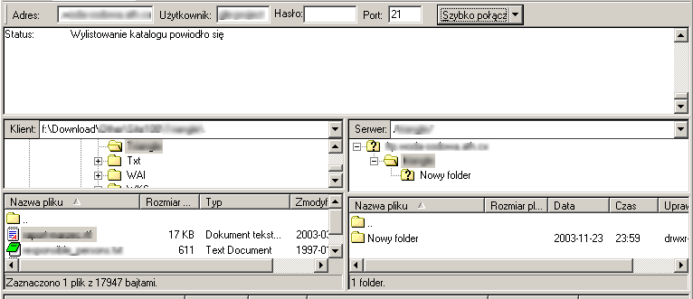

- [Czym jest FTP](#intro)
- [Podstawowe pojęcia](#fundamental)
- [Polecenia](#commands)
- [Używanie klienta FTP (na przykładzie Filezilli)](#filezilla)
- [GNU wget](#wget)
- [Protokół FTP](#protocol_ftp)
- [Secure FTP](#secure_ftp)
- [Protokół TFTP](#protocol_tftp)
- [Odnośniki](#links)

**Ostatnia aktualizacja 27 VIII 2005.**

### Czym jest FTP

FTP to akronim oznaczający Protokół Transferu Plików (_File Transfer Protocol_). 
Jak sama nazwa mówi pozwala na kopiowanie plików pomiędzy komputerami, zarówno w sieci lokalnej jak i globalnej. 
Charakterystyczna dla całego internetu architektura klient/serwer oznacza w tym przypadku, że komputer użytkownika (klient) wyszukuje w sieci serwer FTP, nawiązuje z nim połączenie a następnie inicjuje przesyłanie plików w jedną lub drugą stronę. 
FTP to wygodne narzędzie, dzięki któremu każdy użytkownik internetu może uzyskać dostęp do archiwów dostępnych na olbrzymiej ilości hostów. 

Kluczowe elementy sesji FTP to:  

- odszukanie serwera FTP
- ustanowienie połączenia pomiędzy klientem a serwerem
- przeszukiwanie zasobów serwera
- użycie poleceń FTP do przesyłania informacji

### Podstawowe pojęcia

- **serwer FTP** - komputer udostępniający usługę FTP
- **klient FTP** - komputer użytkownika, także wyspecjalizowany program służący do tranferu FTP
- **lokalny katalog** - katalog w systemie operacyjnym użytkownika
- **zdalny katalog** - katalog na serwerze
- **bieżący katalog** - katalog otwarty do edycji, zarówno lokalny jak i zdalny, pliki są przesyłane z bieżącego katalogu lokalnego na bieżący katalog zdalny i odwrotnie
- **konto anonymous** - konto anonimowe; dostępne publicznie, zarówno nazwa użytkownika jak i hasło brzmią 'anonymous'
- **active/passive connection** - zainicjowanie połączenia ze strony serwera (active) lub klienta (passive); ten drugi zalecany jest ze względów bezpieczeństwa oraz przy niektórych sytuacjach sieciowych
- **ASCII/Binary mode** - pierwszy tryb służy do przenoszenia danych tekstowych, drugi do danych binarnych
- **kody odpowiedzi** - po otrzymaniu żądania serwer odpowiada trzycyfrowymi liczbami, które od 000 do 299 mają znaczenie informacyjne a od 300 są komunikatami błędów

### Polecenia

Podstawowe polecenia FTP. Co prawda ich znajomośc nie jest już niezbędna by korzystać z tej usługi, ale czasem przydaje się jeśli napotkamy nietypową konfigurację serwera lub z jakichś innych przyczyn program zawiedzie i trzeba będzie posłużyć się linią poleceń. 

help lub ?
wymienia pełną listę poleceń wraz z opisem

open [host] [port]
inicjuje sesję, otwiera połączenie pomiędzy klientem a serwerem

user [login]
używa nazwy użytkownika do logowania

passiv
przełącza na tryb pasywny przesyłania plików

dir lub ls
wyświetla katalogi na serwerze

nlist
wyświetla listę plików na serwerze

cd
zmienia katalogi na zdalnym komputerze w górę i w dół

pwd
pokazuje bieżący katalog i ścieżkę dostępu

lls, lcd, lpwd
wyświetlenie katalogu, zmiana i pokazanie ścieżki na lokalnym komputerze

get
kopiuje plik z serwera na lokalny komputer

put
kopiuje plik z lokalnego komputera na serwer

mput, mget
to samo co powyżej ale w odniesieniu do wielu plików jednocześnie, serwer zapyta się o potwierdzenie

prompt
ustanawia interaktywny prompt; "on" zwiększa bezpieczeństwo dzięki weryfikacji każdego kroku; "off" pozwala poleceniom działać [unimpeded]

delete
kasuje plik na zdalnym katalogu

rmdir
kasuje katalog na zdalnym katalogu

acsii/binary
określa jakiego rodzaju pliki przesyłamy (np. trybu ascii powinniśmy używać przy przesyłaniu plików tekstowych takich jak .txt czy .html a binary przy plikach graficznych .jpg .png)

close
zamyka połączenie z serwerem FTP

quit lub bye
konczy sesję FTP

Składnia polecenia ftp:  

```
 ftp opcje host port
```

- **-v** wypisuje dodatkowe informacje o transferze plików
- **-i** wyłącza zapytania przy transferze wielu plików

### Używanie klienta FTP (na przykładzie Filezilli)

#### Graficzny klient FTP

Istnieją programy, które umożliwiają korzystanie z FTP przy pomocy graficznego interfejsu, dodatkową ich zaletą jest możliwość zautomatyzowania procesu. 
Wszystkie tego typu programu zarówno posiadają podobny interfejs jak i oferują mniej więcej te same możliwości. Dobrym przykładem klienta FTP jest Filezilla:


*Filezilla interface*

Filezilla prezentuje typowy interfejs klienta FTP. W większości z nich (np. [gFTP](http://linux.sky.pl/teksty/gftp.html) dla Linuksa) można napotkać następujące elementy:  

- **menu** (The Menu - pasek menu)
- **toolbar** (The Toolbar - pasek narzędziowy) ikonki z podstawowymi poleceniami: nawiązywania połączenia, zmian trybu widoku itp.
- **quickconnect** (The Quickconnect Bar - pasek szybkiego dostępu) umożliwia natychmiastowe połaczenie z wybranym serwerem bez uprzedniej konfiguracji
- **message log** (The Message Log - komunikaty FTP) podgląd komunikatów jakie wymieniają między sobą komputery w czasie sesji FTP, jest to przydatne jeśli coś dzieje się źle (np. połączenie jest zerwane)
- **local view** (Local View - widok katalogów lokalnych) podgląd katalogów i plików na komputerze użytkownika
- **remote view** (Remote View - widok katalogów serwera) podgląd katalogów i plików na serwerze, jeśli nagle znika oznacza to zerwanie połączenia
- **transfer queue** (Transfer Queue - kolejka transferu) tutaj widać zarówno kolejkę plików przeznaczonych do przesłania jak i to co się z nimi dzieje (np. procentowy wskaźnik przesłania)
- **status bar** (Status Bar - pasek statusu) najważniejsze informacje o stanie programu

#### Instalacja i konfiguracja

Filezilla jest darmowym (licencja GPL) klientem FTP dla Windows i Linuksa.

- [strona główna Filezilli](http://filezilla.sourceforge.net/)  
- [dokumentacja](http://filezilla.sourceforge.net/documentation/)  
- [download (plik setup.exe - 3MB)](http://sourceforge.net/project/showfiles.php?group_id=21558)

Sama instalacja przebiega w bardzo prosty, automatyczny sposób, wybieramy język polski i standardową instalację a następnie jeśli ktoś jeszcze będzie korzystał z komputera wybieramy tryb ochrony i decydujemy gdzie program trzyma swoje ustawienia (w rejestrze lub pliku xml); po zaakceptowaniu domyślnej lokalizacji program się instaluje. 
Konfigurację przeprowadza się poprzez _Edycja/Ustawienia_.


*Filezilla okno ustawień*

#### Nawiązanie połączenia

Połączenie z serwerem można nawiązać na trzy sposoby

##### Menedżer Stron

Jest to najwygodniejsza opcja, chociaż wymaga na początku skonfigurowania Menedżera Stron; nie jest to trudne: _Plik/Menedżer Stron_.


*Filezilla site manager*

a następnie już w oknie ustawień Menedżera Stron: _Nowa Strona_ (uwaga: wtedy trzeba wpisać nazwę, która może być dowolna ale powinna być znacząca, żeby później nie mylić serwerów) a potem po kolei wpisujemy nazwę hosta, wybieramy typ serwera oraz ustawienia logowania.

Kiedy wszystkie dane są już wprowadzone można się połączyć albo zamknąć okno ustawień a potem uruchomić dane połączenie wybierając je z paska narzędziowego:


*Filezilla connect*

##### Szybkie Połączenie

Te same dane wpisujemy w pola paska Szybkiego Połączenia, jest to może prostsze ale trzeba je wpisywać za kazdym razem i opcja ta przydatna jest raczej do jednorazowych połaczeń.


*Filezilla quickconnect*

##### Polecenie FTP

Całą sesję lub jej część można przeprowadzić używając linii poleceń FTP: Serwer/Polecenie FTP


*Filezilla FTP command*

#### Transfer plików

Już po nawiązaniu połączenia możemy przeglądać zasoby serwera FTP i kopiować pliki.

##### Przeglądanie katalogów

Największą część okna zajmują dwa panele: lewy pokazujący pliki lokalne, prawy, w którym jest podgląd serwera. W tym drugim najwygodniejszy jest tryb podglądu: widok drzewa, oraz włączenie podglądu zaznaczonych katalogów. Jeśli użytkownik ma odpowiednie uprawnienia może sam tworzyć i kasować katalogi.


*Filezilla tree view*

##### Kopiowanie plików na serwer

Tutaj widać wszystkie opcje edycyjne udostępnione przez program, plik można od razu wysłać na serwer, dodać do kolejki, wysłać pod zmienioną nazwą. Oprócz tego dostępne są normalne polecenia systemowe.


*Filezilla upload*

##### Kopiowanie plików z serwera

To samo w odniesieniu do plików znajdujacych się na serwerze.


*Filezilla download*

##### Koniec połączenia

Połączenie kończymy klikając Plik/Rozłącz lub ikonke rozłączenia na pasku narzędziowym (można wtedy połączyć się z innym serwerem) lub po prostu zamykając program. 

### GNU wget

GNU wget jest programem komputerowym służącym do pobierania plików z Internetu, za pośrednictwem protokołu HTTP lub FTP. Jest zaliczany jest do kategorii narzędziowych programów sieciowych i rozpowszechniany jest na licencji GPL. 
Pozwala na proste i szybkie utworzenie mirrorów i rekursywne pobieranie. Nazwa jest połączeniem WWW i GET (polecenie protokołu HTTP używane do pobierania pliku).

Jest to program lini poleceń używany głównie w systemach uniksowych (chociaż istnieją także nakładki graficzne i wersja dla MS Windows), napisany w C. 

Przykładowe funkcje:  

- jest nieinteraktywny - może pracować w tle, kiedy użytkownik nie jest zalogowany, więc można się wylogować po rozpoczęciu pobierania, a program samodzielnie dokończy operację
- potrafi dokonać konwersji odnośników w pobieranych dokumentach HTML, tak by utworzyły lokalną strukturę
- umożliwia używanie masek nazw plików i potrafi zagłębiać się rekurencyjnie w strukturę dokumentów HTML i drzew katalogowych FTP, tworząc lokalną kopię struktur katalogów podobną do istniejącej na zdalnym serwerze
- rozpoznaje polecenia z pliku tobots.txt - (Robots Exclusion Standard)
- umie odczytać znaczniki czasowe (timestamp information) plików podawane przez serwery HTTP i FTP i lokalnie je zapisać, dzięki temu może zauważyć, że zdalny plik zmienił się od czasu ostatniego pobrania i automatycznie pobrać nową wersję
- działa szczególnie dobrze z powolnymi bądź niestabilnych połączeniami, ponawiając pobieranie dokumentu aż do pełnego ściągnięcia lub przekroczenia zadanej przez użytkownika liczby prób; próbuje wznawiać pobieranie od miejsca przerwania, stosując polecenie REST przy FTP i Range przy HTTP, na serwerach, które je obsługują.
- potrafi korzystać z serwerów proxy, co może odciążyć sieć, przyspieszyć pobieranie i umożliwić dostęp przez firewall, jeśli jednak sam użytkownik jest za firewallem, który wymaga stosowania bramki typu socks, można wziąć bibliotekę socks i skompilować wget z obsługą socks. wget obsługuje też, jako opcję, bierne pobieranie FTP (passive downloading)
- wbudowane funkcje oferują mechanizm precyzyjnego wyboru odnośników
- pobieranie można wygodnie obserwować na ekranie dzięki wypisywanym kropkom, z których każda reprezentuje ustaloną ilość otrzymanych danych (domyślnie 1KB); oznakowanie to można dostosować do własnych upodobań
- większość funkcji jest w pełni konfigurowalna, albo za pośrednictwem opcji wiersza poleceń, albo poprzez plik inicjujący .wgetrc; wget umożliwia definiowanie ogólnosystemowych, globalnych plików startowych (domyślnie /usr/local/etc/wgetrc) zawierających ustawienia dla całego servera
- jest dostępny na warunkach określonych w Powszechnej Licencji Publicznej GNU (GNU General Public License), opublikowanej przez Free Software Foundation - oznacza to, że można go używać za darmo, bez ograniczeń

Jest idealnym narzędziem do tworzenia kopii lustrzanych (mirrorów), lub przeglądania sieci w poszukiwaniu danych. 
Jest instalowany domyślnie w większości dystrybucji systemu GNU/Linux. 
Wget nie potrafi pobrać plików większych niż 2 GB, do takich celów można użyć ncftpget lub cURL. 

Nakładki graficzne programu wget:

- GNOME Transfer Manager (GTM) - dostępna jest polska wersja
- TkWget
- Wget2 dla środowiska GNOME
- odpowiednik w środowisku graficznym: Web Downloader for X (D4X)
- Może przedstawić się jako przeglądarka (opcja -U np. wget -U "Mozilla/5.0 (X11; U; Linux i686; en-US; rv:1.0.1) Gecko/20021003")

GNU wget domyślnie sprowadza plik do bieżącego katalogu, więc przed jego uruchomieniem trzeba przejść do katalogu, w którym powinien znaleźć się plik. 
Składnia polecenia jest bardzo prosta wystarczy wskazać plik:

```
wget http://serwer.com/nazwa_pliku
```

Jeśli z jakichś powodów połączenie zostało przerwane wget będzie usiłował je ponowić i dokończyć pracę ale po pewnej liczbie nieudanych prób kończy działanie. Żeby kontunuować po następnym połączeniu z tego samego katalogu wydajemy to samo polecenie z opcją _-c_ (continue):

```
wget -c http://serwer.com/nazwa_pliku
```

Inna sytuacja - chcemy skopiować jakiś fragment witryny znajdujący się w katalogu, np _http://serwer.com/katalog_

```
wget -r -np -k http://serwer.com/katalog
```

Trzy opcje oznaczają:

- _-r_ - tryb rekursywny, czyli podążanie za linkami i kopiowanie dokumentów z zagnieżdżonych katalogów
- _-np_ - _no parents_ czyli nie sięganie do katalogów nadrzędnych
- _-k_ - konwersja wszystkich linków zawartych w dokumentach na lokalne

### Protokół FTP (File Transfer Protocol)

FTP (Protokół Transmisji Plików) jest protokołem typu klient-serwer, który umożliwia przesyłanie plików z i na serwer poprzez sieć TCP/IP. Należy do warstwy aplikacji w zestawie protokołów internetowych. Jest standardem określonym przez IETF w październiku 1985 w RFC 959 (który zastąpił RFC 765 i wcześniejsze aż do pierwotnego FTP RFC 114). 

Wady:

- hasła i zawartość plików są przesyłane jawnym tekstem i mogą zostać podsłuchane
- używane jest wiele połączeń TCP/IP jedno do kontroli połączenia i po jednym dla każdego procesu pobierania, wysyłania lub listowania katalogu co jest kłopotliwe dla firewalli
- ciężko jest filtrować aktywny tryb FTP po stronie klienta używając firewalla, ponieważ klient musi otworzyć arbitralny port w celu otrzymania połączenia, rozwiązaniem jest tryb pasywny
- możliwe jest nadużycie pewnych wbudowanych własności protokołu by nakazać serwerowi wysłanie danych na arbitralny port na dowolnym komputerze

FTP jest protokołem 8-bitowym, dlatego nie jest potrzebne dalsze przetwarzanie (przekodowywanie) informacji, tak jak ma to miejsce w standardach MIME i uuencode. Nie jest ograniczony do jakiegoś rodzaju pliku, przesyła dowolny strumień bitów tworzący jednostkę w systemie plików i powiązane z nim metadane w rodzaju nazwy pliku, wielkości i znaczników czasowych. 
FTP wykorzystuje do komunikacji dwa połączenia TCP. 

- połączenie kontrolne (sterujące) - polecenia do serwera
- transmisja danych -

Gdy użytkownik rozpoczyna sesję FTP interpreter protokołu po jego stronie inicjuje połączenie kontrolne (sterujące) z serwerem FTP. Połączenie to realizowane jest za pomocą telnetu. Takim kanałem sterującym będą dalej przesyłane wszystkie polecenia i sygnały kontrolne między serwerem a klientem FTP. Użytkownik może takie połączenie ustanowić również bezpośrednio za pomocą telnetu pomijając program klienta FTP.

Polecenia przesyłane kanałem określają parametry, którym dla połączenia będą przesyłane dane, takie jak numer portu, tryb przesyłu, i rodzaj danych oraz operacje jakie mają zostać wykonane na systemie plików (pobierz wyślij usuń utwórz itp). Proces transferu danych ze strony użytkownika powinien teraz czekać i nasłuchiwać na określonym porcie aż serwer zainicjuje połączenie danych według parametrów otrzymanych kanałem kontrolnym.

Port danych nie musi się znajdować na tym samym hoście który zainicjował połączenie FTP.

Jeśli użytkownik ma przesłać pliki pomiędzy dwoma zdalnymi hostami musi zainicjować dwa połączenia kontrolne (z obydwoma serwerami) oraz rozpocząć przesyłanie danych między nimi - wtedy komunikaty oraz polecenia przechodzą kanałami kontrolnymi przez komputer użytkownika natomiast połączenie danych odbywa się tylko między serwerami; połączenie sterujące musi być otwarte cały czas gdy odbywa się transfer danych  

FTP działa w dwóch trybach:  

- aktywny (port 20 - połączenie sterujące; port 21 - transfer danych)
- pasywny (port 21 - połączenie sterujące; port powyżej 1024 - transfer danych)

Kiedy dane są przesyłane połączenie sterujące jest bezczynne co może spowodować problemy z firewallami, które przerywają sesję po określnym czasie bezczynności i może to doprowadzić do systuacji, że chociaż dane są przesłane w całości, sesja sterująca została przerwana z komunikatem błędu. 

Wiele serwerów FTP umożliwia tzw. "anonymous ftp" dzięki czemu użytkownicy nie muszą posiadać konta na serwerze, domyślnie nazwą użytkownika i hasłem - jeśli jest wymagane- jest "anonymous". Czasem użytkownicy są dla uwierzytelnienia pytani o adres mailowy. 

Chociaż można używać FTP za pośrednictwem terminala jest zaprojektowany głównie z myślą o programach klienckich. 

Większość współczesnych przeglądarek WWW i manadżerów plików może łączyć się z serwerami FTP, pozwala to manipulować plikami na zdalnej maszynie w sposób podobny do operacji na lokalnym systemie plików. Używa się do tego FTP URL, w postaci ftp://&lt;ftpserveraddress&gt; (np. ftp://ftp.gimp.org/). Hasło można opcjonalnie umieścić w URL, np.: ftp://&lt;login&gt;:&lt;password&gt;@&lt;ftpserveraddress&gt;. Większość przegladarek wymaga trybu pasywnego, który nie jest obsługiwany przez wszystkie serwery. 

Ponieważ komputery w sieci pracują w róznych systemach, aby transmitowane dane mogły byc poprawnie dostarczone klient i serwer muszą ustalić typ danych jaki będzie przesyłany  

ASCII
domyślny typ danych i musi być obsługiwany przez wszystkie implementacje protokołu  
transmisja plików tekstowych - komputer wysyłający konwertuje dane z lokalnie stosowanego formatu na standardowy 8-bitowy ASCII a system odbierający przekodowuje to na lokalny format

EBCDIC
od ASCII rożni się kodami niektórych znaków, może być stosowany tylko pomiędzy komputerami, które używają tego formatu jako wewnętrznej reprezentacji znaków

IMAGE
dane są wysyłane jako ciąg bitów dla potrzeb transmisji składanych w grupy po 8 bitów, system odbierający również musi odbierać dane jako ciąg bitów, czasem niezbędne jest dodanie na końcu pliku wypełnienia do pełnej wartości, wypełnieniem tym zawsze są zera,  
obsługa tego typu danych nie jest obligatoryjna, ale zalecana

LOCAL TYPE
dane są przesyłane w porcjach określanych dodatkowym parametrem, który musi być całkowitą liczbą dziesiętną (nie ma wartości domyślnej)

binary
binaria

Kanał komunikacyjny między interpreterem protokołu po stronie klienta a interpreterem po stronie serwera jest nawiązywane za pomocą protokołu TCP, interpreter klienta jest odpowiedzialny za wysyłanie poleceń FTP oraz interpretację odpowiedzi ze strony klienta.

Interpreter Protokołu (IP) serwera natomiast odczytuje otrzymane polecenia, wysyła odpowiedzi oraz informuje proces transferu danych (DTP) o konieczności nawiązania połączenia danych oraz ich transferu. 
Jeśli transfer odbywa się bezpośrednio między klientem a serwerem to proces DTP klienta jest zarządzany bezpośrednio przez jego IP.

Jeśli transfer odbywa się pomiędzy dwoma serwerami to DTP systemu odbierającego jest zarządzane przez własne IP na podstawie poleceń IP klienta. 

Polecenia transmitowane kanałem sterującym można podzielić na:  

- polecenia kontroli dostępu (access control commands)
    
    USER (username)
    występuje z parametrem, którym jest ciąg znaków identyfikujących użytkownika, jest to informacja niezbędna dla serwera, który na tej podstawie musi ustalić prawa dostępu do systemu plików  
    zwykle jest to pierwsze polecenie transmitowane kanałem kontrolnym zaraz po nawiązaniu połączenia  
    
    PASS (password)
    specyfikuje hasło użytkownika podanego za poleceniem USER  
    musi zostać przesłane natychmiast po USER  
    
    ACCT (user's account)
    identyfikuje konto użytkownika  
    nie jest obligatoryjne  
    
    CWD (change working directory)
    zmiana katalogu bieżącego (parametry transmisji pozostają niezmienione)  
    parametrem jest ścieżka dostępu  
    
    CDUP (change to parent directory)
    wersja CWD powodująca przejście do wyższego katalogu  
    wprowadzona dla ułatwienia poruszania się po strukturze katalogów w systemach o różnych konwencjach nazewnictwa  
    
    SMNT (structure mount)
    umożliwia przyłączenie do bieżacego katalogu systemu plików, podobnie jak polecenie mount  
    parametrem jest ścieżka dostępu lub inny identyfikator  
    
    REIN (reinitialize)
    odłączenie użytkownika, opróżnienie buforów wejścia/wyjścia oraz informacji o koncie  
    jeśli w tym czasie był jakiś transfer zostanie dokończony, a później parametry zostaną ustawione na wartości domyślne  
    połączenie kontrolne jest otwarte cały czas  
    system znajduje się w stanie jak w chwili nawiązania połączenia  
    
    QUIT (quit)
    odłączenie użytkownika oraz jeśli nie ma w tym czasie transferu zamknięcie połączenia kontrolnego  
    jeśli był transfer połączenie kontrolne jest otwarte aż do otrzymania odpowiedzi z serwera  
    
- polecenia definiujące parametry transferu danych (tranfer parametres commands):  
    wszystkie mają swoje wartości domyślne, więc podawanie ich ma sens tylko kiedy trzeba je zmienić  
    za wartość domyślną uznaje się w tym wypadku ostatnio podaną lub jeśli wcześniej nie została ona wyspecyfikowana podane są wartości jak poniżej (czyli są pamiętane przez serwer)  
    polecenia te mogą być podawane w dowolnej kolejności ale muszą poprzedzać żądanie usługi FTP
    
    PORT
    specyfikuje port danych, który zostanie użyty do transmisji  
    argumentem jest kombinacja 32-bitowego adresu IP serwera i 16-bitowego adresu portu TCP  
    informacja ta jest dzielona na 6 8-bitowych pól, które są dalej transmitowane jako liczby dziesiętne z przedziału 0-255 pola te są oddzielone znakiem przecinka:
    
    ```
    PORT h1,h2,h3,h4,p1,p2
    ```
    
    gdzie h1-4 to adres IP a p1-2 numer portu
    
    PASV
    żąda od DTP ze strony serwera aby nasłuchiwał na porcie danych innym niż standardowy i czekał na połączenie  
    w odpowiedzi serwer przesyła swój adres oraz numer portu danych  
    
    TYPE
    specyfikuje sposób reprezentacji (typ) danych i przyjmuje następujące parametry oddzielone znakiem spacji (kod ASCII 32):
    
    - A - ASCII
    - E - EBCIDC
    - I - IMAGE
    - L - Local Byte (wymaga dodatkowego parametru określającego wielkość porcji danych)
    
    parametry A i E wymagają dodatkowo wartości: N (Non-print), T (Telnet Format Effectors), C (Carriage Control)  
    typem domyślnym jest ASCII Non-print  
    
    STRU
    podaje kod specyfikujący strukturę przesyłanego pliku
    
    - F - File (zwykły plik bez wyróżnionej struktury rekordów)
    - R - Record (rekordy danych)
    - P - Page (strony danych)
    
    MODE
    podaje kod definiujący tryb transferu danych
    
    - S - Stream (strumień danych)
    - B - Block (bloki danych)
    - C - Compressed (dane kompresowane)
    
- polecenia usług FTP (FTP services commands):  
    definiują transfer plików lub lub funkcje systemowe na plikach żądane przez użytkownika  
    argumentem jest zwykle ścieżka dostępu do pliku (zgodna ze składnią systemu serwera)  
    mogą być używane w dowolnej kolejności, za wyjątkiem tego, że RNTO musi być poprzedzone przez RNRF oraz REST musi być poprzedzone poleceniem możliwym do przerwania (np. STOR)  
    wszystkie dane przesyłane w odpowiedzi na polecenia są transmitowane przez kanał danych za wyjątkiem pewnych informacji zwracanych przez serwer  
    
    RETR (retrieve)
    rozpoczęscie transferu pliku, którego ścieżka dostępu podana jest jako parametr  
    status i zawartość pliku po stronie serwera muszą pozostać nie zmienione  
    
    STOR (store)
    informuje DTP serwera, że powinien zacząć przyjmować dane pojawiające się na łączu danych i zapisać je jako plik  
    jeśli istnieje wyspecyfikowany plik jego stara zawartość powinna zostać zastąpiona nową, jeśli nie istnieje powinien zostać utworzony  
    
    STOU (store unique)
    j.w ale plik musi zostać zapisany w bieżącym katalogu pod unikalną dla tego katalogu nazwą  
    odpowiedź serwera musi zawierać wygenerowaną nazwę  
    
    APPE (append)
    rozpoczęcie przyjmowania danych i zapisywanie ich w postaci pliku  
    jeśli wyspecyfikowany plik już istnieje przyjmowane dane są dopisywane na końcu  
    jeśli nie istnieje zostanie utworzony  
    
    ALLO (allocate)
    może być wymagana przez niektóre serwery w celu zarezerwowania miejsca na przesyłany plik  
    argumentem jest dziesiętna liczba całkowita określająca wielkość pliku w bajtach  
    dla plików przesyłanych w formie rekordów lub stron moze zaistnieć konieczność określenia maksymalnej wielkości przyjmowanej przez rekord czy stronę (również w tej samej postaci, podawna jest wtedy jako drugi argument oddzielony od pierwszego ciągiem znaków &lt;SP&gt;R&lt;SP&gt;), serwery które nie potrzebują maksymalnej wielkości potraktuja to polecenie jako NOOP  
    
    REST (restart)
    argumentem jest miejsce w pliku od którego ma zostać ponowiona transmisja, samo polecenie tylko ustawia odpowiedni znacznik w pliku, dlatego zaraz po niej musi nastąpić polecenie rozpoczęcia transmisji  
    
    RNFR (rename from)
    specyfikuje ścieżkę dostępu i nazwę pliku która ma zostać zmieniony, zaraz potem musi wystąpić RNTO  
    
    RNTO (rename to)
    specyfikuje ścieżkę dostępu i nazwę jaka ma zostać nadana plikowi podanemu w poleceniu RNFR  
    
    ABOR (abort)
    przerwanie wykonywanego ostatnio polecenia oraz wszystkich będących w toku transferów  
    jeśli w momencie wydania polecenia usługa fTP została zakończona serwer zamyka kanała danych (jeśli jeszcze był otwarty) oraz wysyła odpowiedź 226 (abort zakończyła się sukcesem)  
    jeśli transfer trwa zostaje przerwany i wysłana zostaje odpowiedź 426 (nienormalne przerwanie usługi) a potem 226  
    
    DELE (delete)
    skasowanie pliku podanego jako parametr, wykonywane jest natychmiast  
    wszelkie dodatkowe pytania zabezpieczające przed pomyłką muszą być wykonywane przez klienta  
    
    RMD (remove directory)
    usunięcie katalogu podanego jako parametr  
    
    MKD (make directory)
    utworzenie katalogu podanego jako parametr  
    
    PWD (print working directory)
    wysłanie w odpowiedzi do klienta nazwy bieżącego katalogu na serwerze  
    
    LIST (list)
    wysłanie do klienta listy plików (jeśli parametrem jest ścieżka dostępu do katalogu) lub danych o pliku (jeśli jest nim nazwa pliku), brak parametrów oznacza wyświetlenie listy z bieżącego katalogu  
    tranfer listy plików odbywa się przez kanała ASCII lub EBCDIC  
    
    NLST (name list)
    przesłanie listy plików z katalogu wskazanego parametrem lub bieżącego (jeśli brak parametru); serwer wysyła strumień danych będących nazwami plików bez żadnych dodatkowych informacji  
    poszczególne pozycje są oddzielone znakami &lt;CRLF&gt; (carriage return) lub &lt;NL&gt; (new line)  
    polecenie to używane jest zwykle przez programy do dalszego przetwarzania  
    
    SITE (site parameters)
    umożliwia serwerowi świadczenie usług które są specyficzne dla systemu, ale nie na tyle uniwersalne by mogły zostać włączone do stałych poleceń obsługiwanych przez protokół  
    
    SYST (system)
    ustalenie systemu pod kontrolą którego pracuje serwer  
    
    STAT (status)
    przesłanie poprzez połączenie kontrolne informacji o stanie serwera  
    jeśli przesłane jest w czasie transferu serwer informuje o zaawansowaniu operacji  
    jeśli parametrem jest ścieżka dostępu zachowuje się jak polecenie LIST (ale dane idą połączeniem kontrolnym nie danych)  
    jeśli brak parametru - serwer przesyła ogólne informacje o swoim stanie i i przebiegających w tym czasie transferach  
    
    HELP (help)
    przesłanie dodatkowych informacji, np. o konkretnej implementacji  
    sugerowane jest, by to polecenie mogło być wykonane jeszcze przed USER  
    

Każde polecenie powoduje przesłanie z serwera odpowiedzi, jest to konieczne ze względu na zapewnienie synchronizacji pomiedzy żądaniami klienta a działaniami serwera oraz zagwarantowanie, że klient zawsze zna stan operacji na serwerze każde polecenie musi wygenerować przynajmniej jedną odpowiedź  
Tekst za trzycyfrowym kodem jest przeznaczony tylko dla człowieka ponieważ numer zawiera w sobie kompletną informację standardowa odpowiedź składa się 3 cyfr po których następuje znak &lt;SP&gt; a dalej tekst zakończony kodem EOF. 
Czasem jednak odpowiedź jest dłuższa niż jeden wiersz, po kodzie odpowiedzi jest minus i kolejne linie tekstu, ostatnia linia komunikatu ponownie zawiera ten sam kod po nim spację i opcjonalny dodatkowy tekst  

```
123 - pierwsza linia tekstu
kolejna linia tekstu
123 opcjonalny tekst
```

Znaczenie danej cyfry zależy od jej położenia:

- pierwszy znak kodu
    1. Positive preliminary replay - żądana akcja została rozpoczęta, oczekiwany jest kolejny komunikat przed możliwością wydania kolejnego polecenia, wprawdzie wydanie w tym momencie polecenia jest naruszeniem protokołu to serwer powinien tworzyć kolejkę poleceń, które przychodzą w trakcie pracy, ten typ odpowiedzi wskazuje że klient może zająć się kanałem danych
    2. Positve completion replay - żądana akcja została zakończona sukcesem, można wydać następne polecenie
    3. Positive intermediate replay - polecenie zostało zaakceptowane ale wykonanie zostało zawieszone w oczekiwaniu na dalsze informacje, użytkownik powinien teraz wysłać dodatkowe polecenie, które tych informacji dostarczy
    4. Triansient negative completion replay - polecenie nie zostało zaakceptowaneale błąd jest tymczasowy i można ponownie wysłać polecenie
    5. Permament negative completion replay - polecenie nie zostało zaakceptowane i nie powinno zostać powtórzone
- drugi znak kodu
    - 0. - Syntax (składnia)
    - 1. - Information (odpowiedzi na polecenia żądające informacji, np. HELP)
    - 2. - Connections (odpowiedzi odnoszące się do połączeń kontrolnych oraz danych)
    - 3. - Authetication adn accounting (stwierdzenie autentyczności - związane z procedurą logowania)
    - 4. - nie używane
    - 5. - File system (system plików)
- trzeci znak kodu daje dokładną odpowiedź

Odpowiedzi serwera:

- 200 - polecenie przyjęte
- 500 - nie rozpoznane polecenie
- 501 - błąd w parametrze lub argumentach
- 202 - polecenie nie zaimplementowane, zbyteczne
- 502 - polecenie nie zaimplementowane
- 503 - błędna sekwencja poleceń
- 504 - polecenie nie zaimplementowane dla tego parametru
- 110 - powtórzenie znacznika restartu
- 211 - status systemu lub odpowiedź na HELP
- 212 - status katalogu
- 213 - status pliku
- 214 - wiadomość pomocy
- 215 - nazwa systemu
- 120 - usługa gotowa w n minut
- 220 - usługa gotowa dla nowego użytkownika
- 221 - zamknięcie połączenia kontrolnego
- 421 - usługa niedostępna, zamknięcie połączenia kontrolnego
- 125 - otwarte połączenie danych, start transmisji
- 225 - otwarte połączenie danych, brak bieżących transmisji
- 425 - niemożliwe otwarcie kanału danych
- 226 - zamknięcie połączenia danych
- 426 - zamknięcie połączenia danych, transmisja przerwana
- 227 - wejście w tryb PASV (h1,h2,h3,h4,p1,p2)
- 230 - użytkownik zalogowany
- 530 - użytkownik niezalogowany
- 331 - zaakceptowana nazwa użytkownika, wymagane hasło
- 332 - do zalogownia wymagane jest konto
- 532 - wymagane konto do wysyłania plików
- 150 - status pliku OK, otwieranie połączenia danych
- 250 - wykonywanie na pliku żądanego polecenia
- 257 - stworzona ścieżka dostępu
- 350 - żądana akcja na pliku wymaga dodatkowych informacji
- 450 - niemożność wykonania polecenia - plik niedostępny
- 550 - niemożność wykonania polecenia - plik niedostępny (brak dostępu)
- 451 - przerwanie wykonywania polecenia, błąd lokalny
- 551 - przerwanie wykonywania polecenia, błędna strona
- 452 - przerwanie wykonywania polecenia, brak miejsca na zapis pliku
- 552 - przerwanie wykonywania polecenia, brak miejsca na zapis pliku (dla danego pliku)
- 553 - przerwanie wykonywania polecenia, niedozwolona nazwa pliku

Minimalna implementacja (muszą ją zawierać wszystkie serwery)  

- typ danych ASCII
- rodzaj przesyłu danych STREAM
- struktura danych FILE i RECORD
- polecenia - USER, QUIT, PORT, TYPE, MODE, STRU, RETR, STOR, NOOP

Wartościami domyślnymi dla parametrów są  

- typ danych ASCII
- rodzaj przesyłu danych STREAM
- struktura danych FILE

### Secure FTP

Secure FTP oznacza zamknięcie normalnej sesji FTP w tunelu połączenia SSH. 
Określenie to może być mylące ponieważ tylko kanał kontrolny jest zabezpieczony, transfer danych nadal odbywa się w postaci niezaszyfrowanej poza tunelem SSH, jest to znacząca różnica w porównaniu z sftp lub scp gdzie i polecenia i dane są szyfrowane. 

### TFTP (Trivial FTP)

Jest to bardzo prosty protokół transferu plików podobny do podstawowej wersji FTP, zwykle zaimplementowany jako znajdujący się nad UDP  

Cechy:  

- używa UDP (port 69) jako protokołu transportowego (w przeciwieństwie do FTP: TCP port 21).
- nie umożliwia listowania zawartości katalogów
- nie posiada mechanizmów uwierzytelnienia ani szyfrowania
- używany do kopiowania plików do i ze zdalnego serwera
- wspiera trzy różne tryby transferu: "netascii", "octet" and "mail", dwa pierwsze są odpowiednikami trybów "ascii" i "image" (binary) protokołu FTP

Szczegóły sesji:

Ponieważ TFTP używa UDP nie ma formalnej definicji sesji, klienta lub serwera, jednakże każdy plik przesyłany przy użyciu TFTP tworzy niezależną wymianę i nieformalną relacje klient - serwer pomiędzy hostami: rozpoczynającym połączenie i odpowiadającym. 

- rozpoczynający host A wysyła pakiet RRQ (read request) lub WRQ (write request) do hosta B; pakiet zawiera nazwę pliku i tryb transferu
- B odpowiada pakietem ACK (acknowledgement), który także informuje host A, na który port w hosta B powinny być wysłane pakiety
- host źródłowy wysyła numerowane pakiety DATA na port docelowy, wszystkie oprócz ostatniego zawierają 512 bajtów danych; host przeznaczenia odpowiada numerowanymi pakietami ACK na wszystkie pakiety DATA
- ostatni pakiet DATA musi zawierać mniej niż 512 bajtów, co sygnalizuje koniec pliku; jeśli rozmiar ostatniego fragmentu to dokładnie 512 bajtów, host źródłowy wysyła ostatni pakiet DATA zawierający zero bajtów danych

Każda transmisja TFTP zaczyna się od żądania odczytu bądź zapisu pliku, które jednocześnie jest żądaniem nawiązania połączenia. Jeśi serwer udzieli zgody połączenie zostanie otwarte i zacznie się transfer danych w pakietach po 512 bajtów  
Każdy wysyłany pakiet musi zostać potwierdzony przez system odbierający, który wysyła w tym celu pakiet potwierdzenia dopóki odbiór nie zostanie potwierdzony nie może zostać wysłany następny plik. 
Zakończenie połączenia sygnalizowane jest przez wysłanie pliku mniejszego niż 512 bajtów. 
Jeśli pakiet danych zaginie system odbierający odczeka i odsyłą ostatnio odebrany pakiet danych co sygnalizuje systemowi wysyłającemu zagubienie części danych i konieczność retransmisji  
Większość błędów wysłanych przez wysłanie pakietu błędu przerywa transmisję, pakiet błędu nigdy nie jest potwierdzany a system po jego wysłaniu może natychmiast przerwać pracę - powoduje to sytuację, w której adresat może nigdy nie otrzymać komunikatu błędu, ale jest to wykrywane przez mierzenie czasu oczekiwania na dane. 
Błędy są generowane przez 3 rodzaje zdarzeń  

- żądanie nie może zostać spełnione (brak pliku, nie ma takiego użytkownika)
- niemożność zakwalifikowania otrzymanego pakietu (wysłano błednie sformatowany pakiet)
- brak dostępu do określonych zasobów (brak miejsca na dysku)

- 0. - błąd niezdefiniowany
- 1. - nie znaleziono pliku
- 2. - brak dostępu
- 3. - brak miejsca na dysku
- 4. - błędna operacja
- 5. - nieznany identyfikator transferu
- 6. - plik już istnieje
- 7. - nie ma takiego użytkownika

Pakiety żądania odczytu oraz zapisu (w nawiasie kwadratowym długość pola w bajtach):

- [2] - kod operacji czyli 1 lub 2
- ciąg ASCII - nazwa pliku
- [1] - 0
- ciąg ASCII - tryb
    - netascii: przetworzenie na lokalny system znaków
    - octet: transmisje binarne, oznacza, że źródło było zapisane w formacie 8-bitowym
    - mail: zawsze zaczyna się od wysłaniapakietu WRQ, zamiast nazwy pliku podaje się nazwę użytkownika w postaci "nazwa użytkownika" lub "nazwa użytkownika@nazwa hosta"; w innym przypadku mail ma być potraktowany jak netascii
- [1] - 0

Kod operacji:

1. RRQ - żądanie odczytu (read request)
2. WRQ - żądanie zapisu (write request)
3. DTA - dane (data)
4. ACK - potwierdzenie (acknowledgemennt
5. ERR - błąd (error)

Format pakietu danych (w nawiasie kwadratowym długość pola w bajtach):

- [2] kod operacji (w tym wypadku 3)
- [2] numer bloku danych (określa położenie przesyłąnego fragmentu danych w pliku, numercja zaczyna się od 1 i w każdym następnym jest zwiększana o 1
- [0 do 512] dane (jeśli mniej niz 512 oznacza to ostatni fragment)

Pakiet potwierdzenia (w nawiasie kwadratowym długość pola w bajtach):

- [2] kod operacji (w tym wypadku 4)
- [2] numer bloku danych (identyczny z wartością odpowiadającego pola w potwierdzanym pakiecie)  
    pakiet WRQ jest potwierdzany pakietem ACK, w którym wartość tego pola to 0

Pakiet błędu (w nawiasie kwadratowym długość pola w bajtach):

- [2] kod operacji (w tym wypadku 5)
- [2] kod błędu
- sciąg ASCII - opis błędu (przeznaczony tylko dla człowieka)
- [1] 0

Koniec transferu zaznaczany jest pakietem wielkości poniżej 512 bajtów, który potwierdzany jest przez korespondujący host pakietem ACK, po wysłaniu ostatniego pakietu ACK host odbierający może zakończyć połączenie, niemniej nie jest to zalecane. Przyjmuje się, że powinien odczekać jeszcze przez pewien okres na wypadek konieczności retransmisji pakietu ACK, który mógł ulec zagubieniu, w takim wypadku system wysyłający ponownie wyśle ostatni pakiet danych  

### Odnośniki

- Wikipedia: [FTP (pl.)](http://pl.wikipedia.org/wiki/FTP), [File\_transfer\_protocol (eng.)](http://en.wikipedia.org/wiki/File_transfer_protocol), [Secure_FTP (eng.)](http://en.wikipedia.org/wiki/Secure_FTP), [Wget (eng.)](http://en.wikipedia.org/wiki/Wget), [Wget (pl.)](http://pl.wikipedia.org/wiki/Wget), [Trivial\_File\_Transfer_Protocol (eng.)](http://en.wikipedia.org/wiki/Trivial_File_Transfer_Protocol), [TFTP (pl.)](http://pl.wikipedia.org/wiki/TFTP)
- [Active FTP vs. Passive FTP, a Definitive Explanation](http://slacksite.com/other/ftp.html)
- lifehacker: [Geek to Live: Mastering Wget](http://www.lifehacker.com/software/top/geek-to-live--mastering-wget-161202.php)
