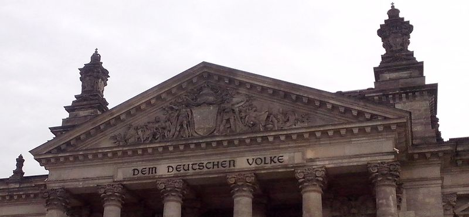
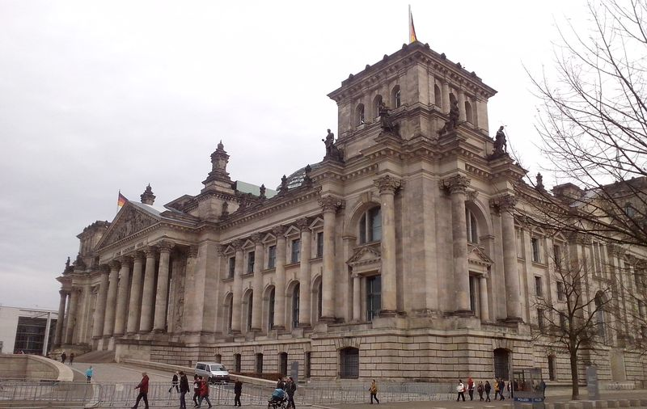

Samo słowo Reichstag oznacza Sejm Rzeszy. Takie Sejmy, czyli zgromadzenia przedstawicieli wszystkich stanów Rzeszy odbywały się od XV wieku aż do czasów napoleońskich. W średniowieczu najczęściej w Norymberdze, która dzięki temu miała szczególny status miasta sejmowego. Przechowywano tam regalia cesarskie. Po tym jak Norymberga przyjęła ewangelicyzm, popadła w niełaskę u Habsburgów i od 1594 aż do upadku Cesarstwa w 1806 stałym miejscem zwoływania sejmów była Ratyzbona. Przedtem Sejmy Rzeszy odbywały się też w innych miastach, np w 1420 we Wrocławiu. Ale żaden z nich nie zawitał do Berlina, który leżał daleko na prowincji niemieckiego świata i aż do XVIII wieku nie działo się tam nic istotnego dla innych państw niemieckich.

Kiedy mowa jest o Reichstagu berlińskim trzeba zaznaczyć, że słowo to ma dwa znaczenia:

- Historycznie pierwszym jest zgromadzenie parlamentarne, które było zwoływane w Berlinie od początku istnienia Związku Północnoniemieckiego czyli od 1867 do końca hitlerowskich Niemiec w 1945, Późniejsze, powojenne parlamenty obu państw niemieckich miały inne nazwy: w RFN jest to Bundestag, w NRD była to Volkskammer (Izba Ludowa) zwoływana w Pałacu Republiki.
- Drugim współcześnie ważniejszym znaczeniem słowa Reichstag jest nazwa własna budynku - siedziby niemieckiego Parlamentu.

Skomplikowane? Równie, a może jeszcze bardziej zawiłe, są dzieje berlińskiego parlamentu. Został on powołany w wyniku wydarzeń Wiosny Ludów w 1848 i był to oczywiście wyłącznie parlament Królestwa Prus, stąd jego nazwa: Pruska Izba Panów (niem. Preußisches Herrenhaus), jego pierwsza siedziba znajdowała się przy Leipziger Straße 3.

Rosnące w siłę Prusy miały ambicje zjednoczenia Niemiec. Po wojnie z Austrią, której pokonanie wyeliminowało najważniejszego konkurenta w tym procesie, powstaje zasadnicza część późniejszych zjednoczonych Niemiec: Związek Północnoniemiecki (niem. Norddeutscher Bund), istniejący w latach 1867-70. Wtedy po raz pierwszy pojawia się nazwa Reichstag. Wyraźnie widać tu odwołanie do szczytnej tradycji dawnej Rzeszy i ambicję przywrócenia Cesarstwa. Siedzibę ma w sąsiednim budynku przy Leipziger Straße 4.

Jest to budynek pozostały po zbudowanej w 1763 Królewskiej Fabryce Porcelany (niem. Königliche Porzellan-Manufaktur Berlin znanej też pod skrótem KPM). Jej założycielem i pierwszym właścicielem był słynny Johann Ernst Gotzkowsky. W 1825 oba te budynki (Leipziger Straße 3 oraz 4) kupuje znany berliński bankier i filantrop Abraham Mendelssohn Bartholdy, ojciec słynnego kompozytora. W 1826 ma tam miejsce premiera uwertury jego syna Felixa Mendelssohna Bartholdiego "Ein Sommernachtstraum". W 1856 oba budynki zostały nabyte przez państwo. Do dziś niewiele z nich zostało, bo w 1904 zostały gruntownie przebudowane na obecną formę. Znajduje się tam siedziba Bundesratu czyli izby Parlamentu składającej się z przedstawicieli krajów związkowych.

W 1871 po pokonaniu Francji zostaje powołane Cesarstwo Niemieckie, a dotychczasowa siedziba po raz kolejny okazuje się zbyt mała. Od 1871 Reichstag zbiera się w pałacu Schwerin, dawnej siedzibie pruskich deputowanych (niem. Preußisches Abgeordnetenhaus) przy Leipziger Straße 75. Jednocześnie powołano komisję w celu znalezienia i budowy nowej siedziby. Tymczasowo przystosowano również gmach przy Leipziger Strasse 4.

Tu trzeba się trochę cofnąć w czasie. Wywodzący się z poznańskiej szlachty hrabia Atanazy Raczyński, był zwolennikiem Napoleona i walczył po jego stronie. Po jego klęsce uznał, że nadal należy służyć Polsce i stał się pruskim dyplomatą. W 1834 w wieku 46 lat przeprowadził się do Berlina i kupił dom na Unter den Linden 21. Był to salon otwarty i jednocześnie galeria sztuki. Z czasem dla kolekcji Raczyńskiego zabrakło miejsca i zwrócił się do króla Fryderyka Wilhelma I, z którym był w przyjaznej relacji, z prośbą o lepsze miejsce na budowę własnego pałacu miejskiego. Otrzymał zgodę zawierającą warunek, że kolekcja ma być dostępna publicznie. Tak w latach 1842-44 powstał Pałac Raczyńskiego (niem. Palais Raczynski) na miejscu obecnego Reichstagu. Ze względu na doskonałą lokalizację to właśnie miejsce zostało w 1872 wybrane na miejsce budowy nowej siedziby Parlamentu. Raczyński jeszcze żył i ani myślał o sprzedaży pałacu, umarł w Palais Raczynski w 1874. Dopiero jego syn po długich negocjacjach sprzedał pałac w 1881. Kolekcja obrazów zgromadzonych przez hrabiego stanowi trzon zbiorów Muzeum Narodowego w Poznaniu. Poznańską Bibliotekę Raczyńskich wybudował jego brat Edward.

Do tego czasu zdołano zorganizować konkurs na projekt, z którego nic nie wynikło. Upadł również dość kontrowersyjny pomysł umieszczenia Reichstagu w miejscu Cyrku Krolla. Zorganizowano już drugi konkurs i wygrał go niemiecki architekt z z Frankfurtu nad Menem, Paul Wallot. Liczne problemy, wynikające zarówno z ingerencji Królewskiej Akademii Budowlanej jak i cesarza i ciągłe zmiany planów opóźniały budowę. Trwała dziesięć lat, od 1884 do 1894. Okazało się, że kopuła wg pierwotnych planów murowana, była zbyt ciężka, trzeba było przerwać jej wznoszenie i zmienić projekt na znacznie skromniejszy i nowocześniejszy - kopułę ze stali i szkła. Krytykowano samą ideę umieszczenia na gmachu Reichstagu kopuły, elementu dotąd zastrzeżonego dla budowli sakralnych i cesarskich, może dlatego w 1889 kopułę zwieńczyła korona cesarska - znak dominacji cesarza nad Parlamentem. Wilhelm II, który do tego czasu stał się zagorzałym przeciwnikiem projektu Wallota nazywał go "małpiarnią Rzeszy". Neorenesansowy gmach miał licznych krytyków, np w 1922 architekt miejski Berlina, Ludwig Hoffmann nazwał go "karawanem pierwszej klasy". Okazał się również niewygodny, był za mały. Brakło miejsca na biura poselskie.

*Klasycystyczny tympanon Reichstagu z napisem "Narodowi niemieckiemu" (Dem Deutschen Volke), który został umieszczony dopiero w 1916.*

Wielka Wojna, której wybuch wszystkie stronnictwa polityczne powitały z entuzjazmem bardzo szybko doprowadziła do marginalizacji zarówno Parlamentu jak i cesarza. Rzeczywistą władzę miała generalicja. W do dziś niejasnych okolicznościach na fasadzie Reichstagu w Boże Narodzenie 1916 pojawił się napis Dem Deutschen Volke (Narodowi niemieckiemu). Był w oryginalnym projekcie Wallota, ale podobno cesarz jeszcze w czasie budowy sprzeciwił się umieszczeniu go. Czasy się jednak zmieniły i jak się okazuje wola coraz bardziej zmęczonego wojną narodu zaczęła odgrywać ważną rolę. Litery odlano z armat zdobytych podczas wojen wyzwoleńczych.

9 listopada 1918 Philip Scheidemann z okna Reichstagu proklamował Republikę. Tego samego dnia Karl Liebknecht proklamował Republikę Socjalistyczną z gmachu Zamku Miejskiego. Wkrótce w Berlinie wybuchły zamieszki i z powodu niepokojów obrady przeniesiono do Weimaru.

Niecały miesiąc po objęciu przez Adolfa Hitlera funkcji kanclerza Niemiec, 27 lutego 1933 wybuchł pożar, który zniszczył cały budynek. Następnego dnia Hitler wydał dekret "O ochronie narodu i państwa" (niem. Verordnung zum Schutz von Volk und Staat), de facto wprowadzający stan wyjątkowy. Reichstag przeniesiono do gmachu Opery Krolla (i tam przemawiał Hitler).

W nowym systemie politycznym Parlament w zasadzie nie był potrzebny, Trzecia Rzesza była państwem permanentnego stanu wyjątkowego, władzę tak naprawdę sprawowały organa partyjne pod dyktando Hitlera. Na potrzeby wystąpień publicznych wystarczał tymczasowy budynek Opery Krolla. Nie przeprowadzono pełnej odbudowy Reichstagu, odremontowano kopułę, a wnętrza przystosowano na potrzeby tymczasowych, propagandowych wystaw. Prezentowano tam m.in. makiety Germanii czyli wizji monumentalnego Berlina, które po "ostatecznym zwycięstwie" miał zbudować minister gospodarki i architekt Rzeszy Albert Speer wg zaleceń Hitlera. Na miejscu Reichstagu miał powstać gigantyczny, kubaturowo największy na świecie budynek, mogący pomieścić nawet 180 tys ludzi. Zwieńczony gigantyczną kopułą miał mieć wysokość 300 metrów, czyli tyle o Wieża Eiffla. Dla porównania: obecnie Reichstag ma wysokość 47 metrów.

Podczas Operacji Berlińskiej to właśnie ten wyłączony z użytku i przeznaczony do wyburzenia budynek Reichstagu został na mapach sztabowych Armii Czerwonej oznaczony jako punkt docelowy ataku. 2 maja 1945 reporter wojskowy Jewgienij Chałdiej wykonał jedną z najsłynniejszych wojennych fotografii Flaga zwycięstwa nad Reichstagiem (ros. "Знамя Победы над рейхстагом"), opublikowana 13 maja w czasopiśmie "Ogoniok", Agencja Prasowa TASS przed publikacją wyretuszowała drugi zegarek (choć może to był kompas naręczny).

Po wojnie był to Berlin Zachodni, który oficjalnie nie był częścią RFN. Poza tym stolicą RFN było Bonn, więc budynek nadal nie mógł pełnić przewidzianej dla niego funkcji, popadł w ruinę, a w okolicy założono ogródki działkowe. W 1954 ze względów bezpieczeństwa wysadzono kopułę, a rok później Bundestag w Bonn zadecydował o kompletnej odbudowie Reichstagu. W latach 1958-72 działało tam muzeum historyczne. Od 1971 wystawa stała "Fragen an die Deutsche Geschichte". Potem także Muzeum Bundestagu i taras widokowy na Berlin Wschodni. Stamtąd oglądał miasto Ronald Reagan przed swoim słynnym przemówieniem na tle Bramy Brandenburskiej.

1990 noc z 2 na 3 października około północy, na Placu Republiki, przed zachodnim wejściem ustawiono maszt Flagi Jedności (niem. Fahne der Einheit), ma status pomnika.

1990 6 października decyzja o przeniesieniu rządu do Berlina.

1991 20 czerwca głosowanie za powrotem Parlamentu do Reichstagu - 337 głosów za, 320 przeciw.

1995 od 24 czerwca do 6 lipca opakowanie Christo i Jeanne Claude, 100 tys m2 srebrzystej tkaniny, w 2 tygodnie zobaczyło to 5 M ludzi

1999 19 kwietnia pierwsze posiedzenie Parlamentu w nowym budynku. Ponad 600 posłów.

*Reichstag obecnie*

Projektant to znany brytyjski architekt Norman Foster. Pozostawił tylko zewnętrzne ściany, wewnątrz powstał nowoczesny budynek. Charakterystycznym i symbolicznym elementem jest kopuła, 24 m wysoka (tyle co budynek), ma 40 m średnicy i waży 1200 ton. Pierwsza symbolizowała dominację cesarza, obecnie jest to dostępny dla publiczności popularny punkt widokowy z 2 spiralnymi rampami na szczyt znajdujący się 47 m nad poziomem ulicy. Wstęp wolny, wymagana rejestracja.

- [British Pathé "Reichstag Ruins Demolished (1954)" [YT 2:12]](https://www.youtube.com/watch?v=520nKY0D7F0)
- [Paul Gibson "The Reichstag Building in German History" [YT 44:42]](https://www.youtube.com/watch?v=JujmJ3F0md8)
