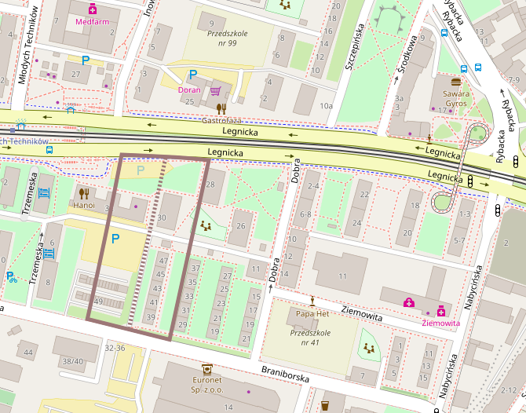

Najważniejszy z zapomnianych wrocławskich cmentarzy - do tego stopnia zapomniany, że prawie nikt nie wie o jego istnieniu. Na jego miejscu stoją bloki mieszkalne przy jednej z głównych arterii miejskich. A przez sto lat to były wrocławskie Powązki - najważniejszy cmentarz miejskiej elity. Co więcej, w ogóle był to pierwszy nowożytny cmentarz miejski i aż do 1945 był otoczonym murem zabytkiem. Odegrał kluczową rolę w historii miejskich nekropolii.

W historii wrocławskich cmentarzy mamy - z grubsza rzecz biorąc - trzy epoki:

- cmentarze średniowieczne
- Wielki Cmentarz (1777-1863)
- współczesność

Cmentarze średniowieczne przykościelne trwały razem z uwięzionym w murach miastem aż do epoki Oświecenia. Czyli prawie do końca istnienia miejskich fortyfikacji. Najważniejsze były te umieszczone przy kościołach parafialnych: św Elżbiety, św Marii Magdaleny oraz św Bernarda. W 1775 król pruski Fryderyk II Wielki, wówczas od ponad 30 lat także władca Śląska, zakazuje grzebania zwłok w obrębie murów miejskich co praktycznie rzecz biorąc oznacza ich likwidację. Są nadmiernie zagęszczone, zajmują cenne miejsce, ale przede wszystkim coraz bardziej dostrzega się w nich zagrożenie sanitarne. Obawy przed zanieczyszczeniem źródeł wody pitnej, zatruciem, a nawet kolejną epidemią powodują, że w całej Europie rezygnuje się z istniejących od stuleci cmentarzy przykościelnych.

Rozkaz Fryderyka nie zostaje wykonany od razu. Przygotowanie nowego miejsca wymaga czasu, jeszcze więcej czasu będą potrzebowały poszczególne gminy na likwidację dotychczasowych nekropolii. Władze miasta początkowo szukają miejsca na Przedmieściu Odrzańskim (obecne Nadodrze), ale okazuje się, że poziom wód gruntowych jest tam zbyt wysoki. Właściwe miejsce wrocławski magistrat odnalazł na Przedmieściu Mikołajskim. Odkupiono należący do klasztoru urszulanek teren nazywany *Kantoreigarten* i tam właśnie ulokowano pierwszy w historii Wrocławia cmentarz komunalny - Wielki Cmentarz, którego działanie przez dokładnie 90 lat wyznacza kolejny rozdział historii wrocławskich nekropolii.

Wielki Cmentarz, obiekt który w świadomości współczesnych wrocławian w ogóle nie istnieje, założony w 1777, funkcjonował do 1867. Dlaczego jest taki ważny? Przecież nie pozostał po nim żaden ślad. Dotychczasowe cmentarze przykościelne pozwalały na pochówki istniejące dość krótko, systematycznie co jakiś czas groby były opróżniane żeby zrobić miejsce, a kości składano w ossuariach kościelnych. Pod koniec XIX wieku podczas remontu kościoła pw św. Marii Magdaleny wywieziono z takiego ossuarium 32 fury kości. Ta krótkotrwałość pochówków była przyczyną popularności epitafiów - umieszczonych na ścianach kościołów płyt upamiętniających zmarłych. Epitafia te, nierzadko bezcenne dzieła sztuki świadczące nie tylko o gustach artystycznych, trendach kulturowych, ale i o życiu codziennym ówczesnych wrocławian, istnieją od późnego gotyku aż po barok. Od 1777 zmarli są grzebani na Wielkim Cmentarzu, leżącym poza miastem, więc można upamiętnić ich trwale w miejscu pochówku, dlatego epitafia na ścianach kościołów stają się niepotrzebne. Tę zmianę oznacza początek istnienia tej nekropolii.

A co oznacza data jej zamknięcia? Wobec braku możliwości powiększenia jego obszaru dokładnie w tym samym roku powstają dwa wielkie, znane doskonale współczesnym wrocławianom miejskie cmentarze komunalne: na Grabiszynie i Osobowicach, oba również poza ówczesnymi granicami miasta. 1867 w historii cmentarzy wrocławskich oznacza początek współczesności. To dlatego okres działania Wielkiego Cmentarza jest epoką pośrednią pomiędzy średniowieczem a współczesnością, zaczyna się jeszcze w czasie istnienia miejskich fortyfikacji, kiedy Wrocław jest fryderycjańską twierdzą, a kończy w przededniu zjednoczenia Niemiec, kiedy Wrocław jest miastem przemysłowym od dawna posiadającym kolej i ważne dla regionu fabryki.

*Położenie Wielkiego Cmentarza na mapie Wrocławia, przerywaną linią zaznaczony jest przebieg głównej alei. Mapa: OpenStreetMap.*

Już po zamknięciu, Wielki Cmentarz otoczony murem, przylegający bezpośrednio do szosy berlińskiej (obecna ulica Legnicka) istniał nadal i w ograniczonym zakresie był używany przez parafie miejskie św. Marii Magdaleny i św. Elżbiety. W 1807 Hieronim Bonaparte wydaje rozkaz zniesienia fortyfikacji i miasto zmienia charakter gwałtownie rozrastając się na zewnątrz, wrastając w przedmieścia: Odrzańskie, Oławskie, Świdnickie i Mikołajskie. Wkrótce ustrój miejski utracił resztki średniowiecza: zniesiono system cechowy, tradycyjny miejski samorząd, wszystkich obywateli pruskich zrównano w prawach. Przez te 90 lat zmieniło się we Wrocławiu i Prusach praktycznie wszystko. W 1808 Przedmieście Mikołajskie zostało włączone w obręb miasta.

Nazwa Wielkiego Cmentarza nie wynika z jego rozmiarów, ale znaczenia jakie miejska elita przywiązywała do nowego miejsca pochówku. Był to przede wszystkim cmentarz wielkich rodów mieszczańskich, patrycjatu i nowej burżuazji, byli tu pochowani urzędnicy miejscy i religijni. Powstała niezwykła galeria sztuki cmentarnej. Wśród najważniejszych pochowanych wrocławian wymienić należy przede wszystkim tych, którzy są rozpoznawalni także dziś:

- Karl Gothard Langhans (ojciec) pochodzący z Kamiennej Góry, a więc Ślązak, znany w całych Niemczech architekt epoki klasycyzmu
- Gotfried Linke producent siodeł, który później zajął się wytwarzaniem wagonów kolejowych, jego firma stała się częścią późniejszej Linke-Hofmann Werke; jedynego ogólnoniemieckiego koncernu z siedzibą we Wrocławiu
- rodzina Eichbornów, wrocławskich bankierów
- rodzina Kornów przybyła do Wrocławia w XVIII wieku; bardzo ważnych dla kultury polskiej wydawców i drukarzy; po zamknięciu Wielkiego Cmentarza wznieśli własne mauzoleum na Górze Kaplicznej na Osobowicach, wydawali najdłużej istniejącą wrocławską gazetę: Schlesiche Zeitung ukazującą się w latach 1742-1945

Wielki Cmentarz na zdjęciach lotniczych z 1947 jest oazą zieleni w morzu ruin. Znajdująca się pośrodku kaplica cmentarna wciąż ma zachowany dach. Zlikwidowany w końcu lat pięćdziesiątych, nie został zamieniony, jak większość likwidowanych poniemieckich cmentarzy w park. Na jego miejscu wzniesiono bloki mieszkalne i pawilony handlowe.

Na podstawie: Burak Marek, Okólska Halina "Cmentarze dawnego Wrocławia" Muzeum Architektury we Wrocławiu i Via Nova 2007; s 209-213.
