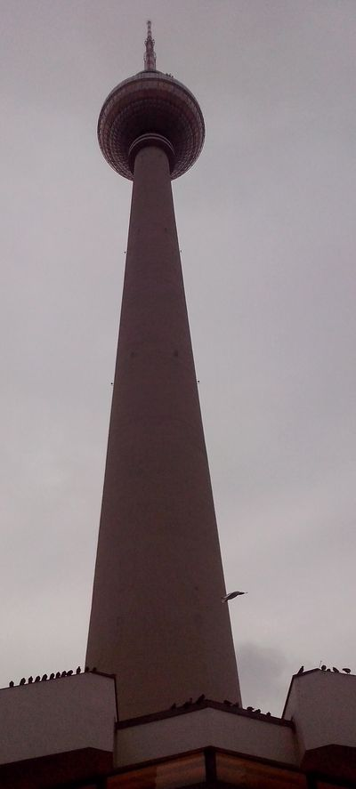

Berlińska Wieża Telewizyjna (niem. *Fernsehturm*) była symbolicznym zwieńczeniem wielkiego projektu przebudowy Berlina wg wzorów socrealistycznych. Nieprzypadkowo pierwszym zbudowanym dużym gmachem była Ambasada CCCP - monumentalne gmaszysko na Unter den Linden ukończone w 1952. W tym samym roku rozpoczyna się budowa Stalinallee - zbudowanej z rozmachem wg wzorów socrealistycznej trasy mającej być enerdowskim odpowiednikiem Unter den Linden. Ukończono ją w 1961 i akurat zbiegło się to ze zmianą polityczną, w wyniku której zmieniono nazwę na Karl-Marx-Allee.

Władze NRD chciały mieć w Berlinie odpowiednik Wieży Ostankino, którą właśnie wtedy wznoszono. Były to czasy kiedy obóz socjalistyczny przodował w podboju kosmosu, więc wszelkie nawiązania do techniki rakietowej i pojazdów kosmicznych były mile widziane. W 1964 powstał projekt na podstawie szkiców architekta Hermanna Henselmanna. Czerwona kula na szczycie to Sputnik, a wieża przypomina antenę.

Ostankino ma wysokość 540 m (do dachu 385 m) i została zbudowana w latach 1963-67. Wieżę berlińską oddano do użytku po czterech latach budowy - 3 października 1969 (dokładnie 21 lat później nastąpiło zjednoczenie Niemiec). Wówczas po Ostankino była to druga co do wysokości konstrukcja w Europie, obecnie druga w UE (pół metra wyższa jest wieża radiowo-telewizyjna w Rydze). Ze względu na konieczność stosowania importowanych materiałów wielokrotne przekroczenie budżetu. Wydźwięk propagandowy znacznie zmniejszył fakt, że niecałe trzy miesiące wcześniej, 20 lipca Amerykanie wylądowali na Księżycu.

Pierwotna wysokość wieży to 365 m, podobno wynikała z nakazu Waltera Ulbrichta (przewodniczącego KC SED w latach 1950-71), który chciał, żeby każde dziecko w NRD zapamiętało jej wysokość. Teraz po remoncie i zmianie anteny w 1997 ma 368 m wysokości.

W 1994 (25. rocznica) austriacki skoczek narciarski Rupert Hirner skoczył z bungee z wysokości 260 m, był to ówczesny rekord świata.

1998 odbył się pierwszy bieg po schodach, 986 stopni, rekord należy do olimpijczyka Thomasa Munkelta 5m56s.

Kula ma średnicę 32 m i jest pokryta piramidkami wielkości 15 cm. Niekiedy odblask układa się w krzyż, efekt ten nazywany jest "zemstą papieża" (niem. Rache des Papstes<em>). </em>Do kuli turystów wożą w 40 sekund dwie windy. Odwiedza ją ponad milion turystów rocznie z 50 krajów. Z restauracji każdego dnia korzysta półtora tysiąca klientów. U podnóża znajduje się Muzeum Człowieka MeMu Menschen Museum, Informacja Turystyczna oraz wypożyczalnia rowerów i segwayów.

Atrakcjami Wieży są:

- taras widokowy na wysokości 203 m widoczność do 40 km, Bar 203.
- piętro wyżej na wysokości 207 m obracająca się restauracja Sphere z przezroczystą podłogą, pełen obrót co pół godziny, pierwotnie co godzinę.

Wieża Telewizyjna wyraźnie odznacza się w panoramie Berlina, także dlatego że jest to miasto niewysokie. Ze względu na kształt nazywana jest Wykałaczką (niem. Zahnstocher), lub TV-szparagiem (niem. Telespargel).

W Berlinie jest tylko 6 budowli mających ponad 80 metrów:

- **Berliner Fernsehturm** 368 m
- **Funkturm** 147 m - wieża radiowa zbudowana w latach 1924-26 z okazji Internationale Funkausstellung (IFA - Międzynarodowa Wystawa Radiowa) na Messe Berlin w dzielnicy Charlottenburg-Wilmersdorf
- **Park Inn Berlin** 125 m (do dachu) - zbudowany w latach 1967-70 dla enerdowskiej sieci Interhotels przeznaczonej dla obcokrajowców, nadzorowane przez Stasi, dominuje nad *Alexanderplatz*
- **Treptowers** 125 m - jest to zespół budynków biurowych zbudowany w 1998 w Alt-Treptow, nad Szprewą; jeden z nich jest wysoki i rzeczywiście przypomina wieżę
- **Berliner Dom** 116 m - katedra berlińska, obecny budynek ukończono w 1898
- **Kollhof-Tower** 103 m - ukończony w 1999 budynek na Placu Poczdamskim, w stylu klasycznych drapaczy chmur

*Wieża Telewizyjna*