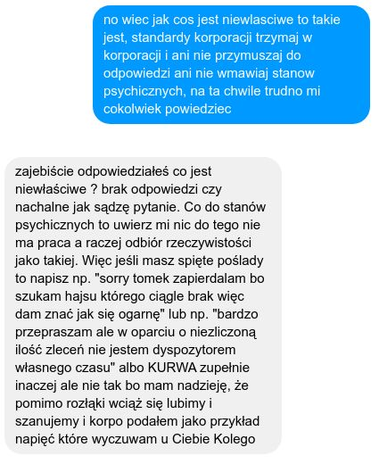
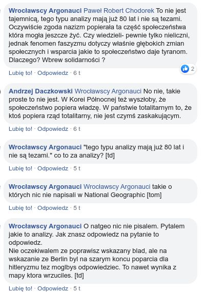
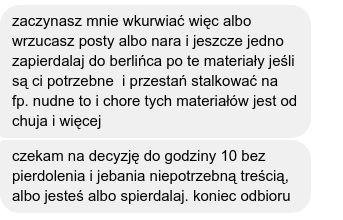
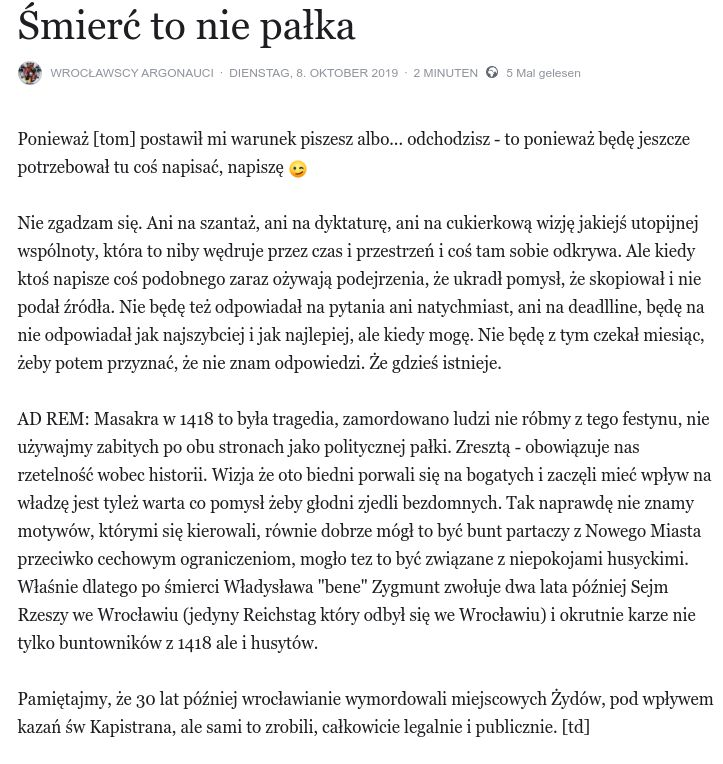
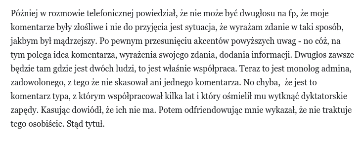
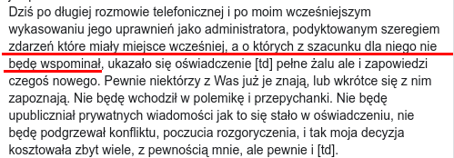

**Na wstępie muszę zaznaczyć, że mam wyraźną, okraszoną wieloma kurwami, zgodę Autora na publikacje wszelkich zacytowanych poniżej wiadomości prywatnych. Tomka są białe, moje są niebieskie.**

### Akt 0. Czym byli Wrocławscy Argonauci?

Wrocławscy Argonauci powstali jako stowarzyszenie nieformalne w 2013 i od początku aż do końca tak naprawdę składało się z dwóch osób: usera ukrywającego się pod pseudonimem [tom] i mnie. Po tym jak [tom] zorganizował wycieczkę po Kozanowie, zaproponował byśmy następną po Osobowicach zrobili razem.

Przez te sześć lat zorganizowaliśmy 10 wycieczek na peryferia Wrocławia. Trasy naszych wycieczek były relacjonowane we wrocławskiej Gazecie Wyborczej. Od 2014 istniał fanpage na Facebooku. Mieliśmy też występ w telewizji regionalnej. Było kilka osób, które pojawiały się regularnie na naszych wycieczkach, były nawet plany formalizacji działalności i poszerzenia grona. Ale co ważne: od początku az do końca Argonauci to tak naprawdę tylko dwie osoby, które od początku i wspólnie prowadziły fanpage Wrocławscy Argonauci: [tom] i ja. Wszystkie istniejące tam wpisy są podpisane albo [tom], albo [td].

Do końca, czyli do października 2019, kiedy to zakończyliśmy współpracę w sposób opisany poniżej.

### Akt 1. Masz odpowiadać natychmiast i grzecznie

W maju (o godzinie 22.00) dostałem jakieś ponaglenie, żebym natychmiast odpowiadał, na co odpowiedziałem "_Nie halo nie zawsze można odpowiedzieć sec_".

*Wrocławscy Argonauci, czyli Tomek Kulik*

W wyniku tego dowiedziałem się, że "_Że tak powiem Co ty Tadziu taki spięty jesteś? Jakoś tak słabo odpowiadasz i trochę niegrzecznie ?"_ Oraz informację, że w korporacji musiałbym odpowiedzieć natychmiast:

*Wrocławscy Argonauci, czyli Tomek Kulik*

I tak oto zaczęły się problemy. Prawdę mówiąc, miałem zamiar wyjaśnić kwestię "standardów komunikacji", ale do tego trzeba było się spotkać osobiście. Do tego czasu uważałem, że w tym duecie nie ma szefa, no ale jeżeli [tom] pisze mi instrukcję jak mu mam odpowiadać, kiedy nie mam czasu odpowiadać, to zmienia sytuację i to poważnie. Jak to ma być relacja bossa i pouczanego podwładnego to w takim procesie straciłem zainteresowanie.

Do czasu wyjaśnienia tej sytuacji i też z powodu braku czasu nie wrzucałem nic na facebookowy profil Argonautów.

### Akt 2. Nie możesz podważać nieomylności [tom]a

Aż do 1 września. Wtedy [tom] wrzucił jakiś napuszony tekst o wybuchu wojny. Dopisałem komentarz "_Co to za banialuki o "entuzjazmie notowanym w Berlinie"? Berlin byl najmniej hitlerowskim miastem ze wszystkich, na parteitagi sciagano tam ekipy z prowincji. Natomiast Niemcy bali sie wojny i radosc z jej zakonczenia to byla glownie ulga ze skonczyla sie (jeszcze) bez tragedii. [td]_"

Jak się okazało, był to grzech śmiertelny. Tym bardziej że później miałem pecha zapytać o źródła.

*Wrocławscy Argonauci, czyli Tomek Kulik*

To dopytywanie i unikanie odpowiedzi trwało tygodniami. Jestem zainteresowany tym tematem. Chciałem się dowiedzieć. Później w czasie rozmowy telefonicznej dowiedziałem się, że postanowił mi nie odpowiadać, bo go - cytuję - "wkurwiłem". Czym? Okazało się, że pytaniem.

Tak więc [tom] był wkurwiony na mnie, ale nic nie powiedział. Kisił to w sobie dość długo. Później z powodu jakichś jego złośliwych komentarzy ma moim fb zadzwoniłem do niego, bo chciałem poznać ich przyczynę. Nic nie mówił na temat swoich stanów psychicznych. Co do komentarzy to podobno "o nic mu nie chodziło", zupełnie bez przyczyny pisał je przez dwa dni.

### Akt 3. Nie wkurwiaj [tom]a sugestią, że coś źle napisał

I tak nadszedł dzień ostatni. Wkurwienie [tom]a było jak wulkan. Zrobił na Argonautach wpis o buncie z 1418, opisując go jako uzasadniony mord dokonany przez biedotę, która miała już biedy dość i zabiła radnych słusznie. Dopisał w komentarzu, że pewnie wkrótce znajdzie się ta informacja na profilu Marka Krajewskiego. Miał do niego żal, bo w kilka dni po tym, jak coś umieścił u siebie, znalazło się to u Krajewskiego. Tak na marginesie: to była rzecz, która była też w innych miejscach. Jednak najwidoczniej automatycznie wszystko, co zobaczy [tom] w jakiś magiczny sposób staje się "jego".

Potem wyjaśniał, że przepisywał z Chądzyńskiego. Nie podając źródła, bo przecież [tom] nie musi podawać źródeł, ale piekli się, jeśli uzna, że został zacytowany bez podziękowań.

Odpisałem na ten komentarz, że jest to niepotrzebna złośliwość. Że dopiero jakby naprawdę to się znalazło u Krajewskiego, to mógłby tak pisać, poza tym wydarzenie przedstawia jednostronnie i upraszcza je do politycznej agitki. Nie mam dostępu do komentarza, bo razem ze swoim go skasował.

### Akt 4. Nie wkurwiaj [tom]a albo wypierdalaj

Wtem, tego samego dnia wieczorem dostaję ultimatum.

*Wrocławscy Argonauci, czyli Tomek Kulik*

Na chwilę mi opadła szczęka, bo takiej Hiszpańskiej Inkwizycji nikt się nie spodziewał. Potem wrzucam notatkę (tym razem skrin mam, bo spodziewałem się, że go skasuje).

*Wrocławscy Argonauci, czyli Tomek Kulik*

W odpowiedzi [tom] robi trzy rzeczy po kolei.

1. Kasuje mój wpis - żeby dowieść, że nie akceptuje cenzury.
2. Kasuje moje uprawnienia edytora - żeby wykazać brak zapędów dyktatorskich.
3. Odfriendowuje mnie na Facebooku - co oznacza, że nie traktuje tego osobiście.

Tak to wygląda.

### Argonautów post mortem czyli dyktatura

Później w czasie rozmowy telefonicznej (chciałem poznać przyczyny, dla których wyrzucił mnie z Argonautów i uzyskać zgodę na publikację jego prywatnych wypowiedzi) okazało się, że były tylko dwie:

- uznał, że moje komentarze atakują go, podważają jego autorytet
- ponadto niedopuszczalne było to, że na Argonautach pojawił się jakiś, cytuję - "dwugłos". A przecież może być tylko monogłos nieomylnego Tomka Kulika.

Podsumowując: zostałem wyrzucony z profilu bez ostrzeżenia, po postawieniu ultimatum, którego nie można zaakceptować. Po tym, jak tak samo jak Tomek, nie mniej, ten profil przez sześć lat tworzyłem. Przyczyną, jedyną jaka została mi ujawniona było zagrożone poczucie bezpieczeństwa, dyskomfort wynikający z braku pełnej kontroli. I owszem według niego to nie jest dyktatura.

Opisałem to wszystko powyżej na moim profilu ["Argonauci baju bye"](https://www.facebook.com/notes/tadeusz-dudkowski/argonauci-baju-bye/10156926532483192/). Napisałem tam między innymi:

*Wrocławscy Argonauci, czyli Tomek Kulik*

Taka jest właśnie historia końca Argonautów.

Na tym można by zakończyć, ale niestety ta sytuacja ma dalszy ciąg.

### Niestety dalszy ciąg

Po pierwsze Tomek utrzymuje jakoby "otwarta formuła Argonautów" nadal była aktualna. Jak bardzo aktualna widać w obawie przed krytyką i "dwugłosem". Wszyscy, którzy podejmą się współpracy z Tomkiem powinni być tego świadomi. Muszą mówić głosem zgodnym z głosem Tomka i uważnie wypatrywać wszelkich znamiona gniewu. Ponadto ta "otwarta formuła" nie obejmuje ludzi, którym zazdrości sukcesu i pomawia o kradzież własnych odkryć. Oraz mnie. Nie znam całej Czarnej Listy.

Po drugie - i to jest naprawdę przykre - opublikował komentarz do mojego opisu sytuacji ["Wrocław to wbrew pozorom niezbyt duże miasto..."](https://www.facebook.com/WroclawscyArgonauci/photos/a.1665557626991643/2430922160455182/). Ma do tego pełne prawo. Dlaczego więc: niestety?

Otóż kłamie w kwestii przyczyny swojej decyzji. Nie ma tam ani słowa o rzeczywistym przebiegu zdarzeń, o furii i wściekłości, która narastała z tego co widzę całe tygodnie. O strachu wynikającym z utraty kontroli nad profilem. O braku umiejętności zmierzenia się z krytyką, ani o tym, że koniec końców go - cytuję - "wkurwiłem" bo uznał, że kilka (słownie: kilka) komentarzy jest złośliwą krytyką wymierzoną w jego autorytet.  
  
Co więcej są tam przeinaczenia i pomówienia. typu: "_Nie będę wchodził w polemikę i przepychanki._" po czym pisze "_Nie będę upubliczniał prywatnych wiadomości jak to się stało w oświadczeniu_". No cóż - jest to wzorcowy przykład manipulacji. Wszedłeś w polemikę, pisząc oświadczenie, przecież oświadczenie samo w sobie jest polemiką, więc nie chowaj się za parawanem obserwatora. Tym bardziej, jeśli jednocześnie sugerujesz jakobym publikował prywatne wiadomości bez Twojej wyraźnej zgody. Jak widzisz treść tych wiadomości, ich forma jest ważną częścią historii końca Argonautów. Bo zakończyli się na tych Twoich słowach: "**spierdalaj. koniec odbioru"**

Ponadto napisałeś tam coś takiego: "_po moim wcześniejszym wykasowaniu jego uprawnień jako administratora, podyktowanym szeregiem zdarzeń które miały miejsce wcześniej, a o których z szacunku dla niego nie będę wspominał,_", Powyżej ten szereg zdarzeń opisałem dokładnie, czego w tym opisie brakuje?

*Wrocławscy Argonauci, czyli Tomek Kulik*

O jakich to "**zdarzeniach [...] o których z szacunku dla niego nie będę wspominał,**" piszesz? Umieść sobie ten szacunek tam gdzie trzymasz szacunek dla wszystkich badaczy i popularyzatorów regionu, tych wszystkich pogardzanych przez Ciebie "jebanych celebrytów" i - proszę uprzejmnie - odpowiedz na to pytanie.

### Tomek, nie rzucaj insynuacjami, napisz wprost

Tomek Kulik - domagam się, żebyś o nich wspomniał. Bo, widzisz, to zdanie tak zawieszone jest tylko insynuacją, podłym retorycznym trikiem. Sugerujesz jakobym zrobił coś, co było przyczyną wywalenia mnie z profilu, co wolałbym ukryć, ale Ty w swojej wielkiej szlachetności zatrzymasz je w tajemnicy.

Więc teraz publicznie proszę Cię, żebyś je ujawnił. To jak, napiszesz coś czy dalej będziesz się ukrywał za maską admina profilu, nad którym teraz sprawujesz pełną kontrolę, na której tak bardzo Ci zależało.

Ponieważ nie wierzę, żebyś miał odwagę przyznać się publicznie do kłamstwa, ani dość honoru, żeby za to kłamstwo przeprosić, to zostawiam tę sytuację w tym momencie właśnie w takiej postaci.

Będziesz udawał, że nie dostrzegłeś pytania, ale ten tekst będzie Ci towarzyszył długo. Cały czas, który będziesz się borykał z utrzymaniem kontroli nad fikcją jakiejś "otwartej formuły" czy też "społeczności" Argonautów.

Sugeruję Ci również, żebyś przestał się ukrywać za generalną ideą profilu. Mam do niego takie samo prawo jak Ty i nie widzę powodu, żebyś dalej kisił się w norze Demiurga. No, chyba że psychologicznie Ci odpowiada.

Bo widzisz poznawać tajemnice historii i zakamarków okolicy można z własną twarzą, własnym nazwiskiem i na własną odpowiedzialność. Nie są potrzebne żadne gierki. Tak ja to robię i tak to robią Ci, o których masz tak niską opinię, ci wszyscy "_jebani celebryci_". A OK, to może nie jest najlepszy argument w tej sytuacji. Tak czy inaczej, dorośnij i zrzuć maskę.